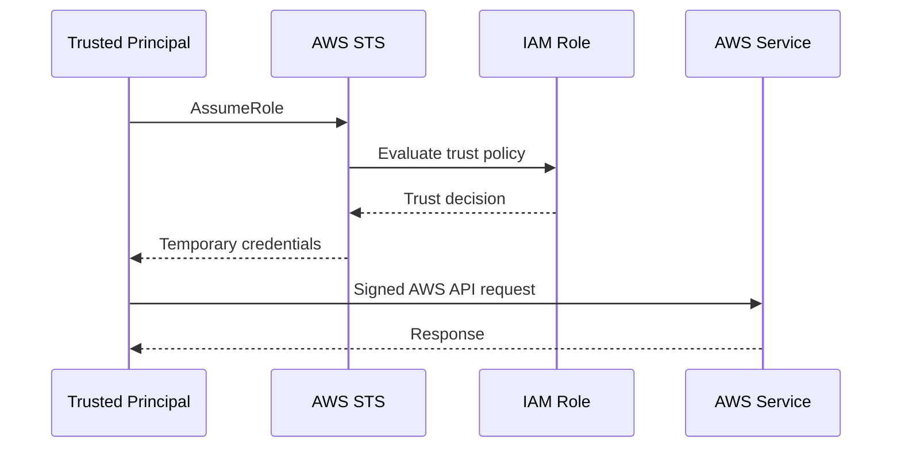
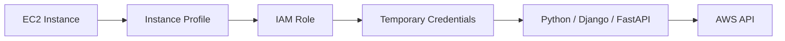

# 11- IAM Roles

## Overview

An AWS IAM role is an identity that defines a set of permissions and can be assumed by a trusted principal. Unlike an IAM user, a role is designed around **temporary credentials and delegated access** rather than a permanent username or access key. Roles are a fundamental building block for backend workloads, cross-account access, federation, CI/CD, and AWS service integrations. :contentReference[oaicite:0]{index=0}

A role should be understood as two separate authorization concerns:

```text
Trust Policy
    ↓
Who can assume the role?

Permission Policy
    ↓
What can the role do after it is assumed?
```

That distinction is central to IAM troubleshooting.

For a production backend:

```text
FastAPI / Django / Worker
        ↓
Runtime Identity
        ↓
IAM Role
        ↓
Temporary Credentials
        ↓
AWS API
```

The application should normally use the runtime's AWS credential provider rather than storing long-lived AWS access keys.

---

## What Is an IAM Role?

An IAM role is an AWS identity that can be assumed by a trusted principal.

A role can be assumed by:

- IAM users
- Other IAM roles
- AWS services
- Federated identities
- Web identity principals
- Trusted principals from another AWS account

Once assumed, AWS issues temporary security credentials that can be used to make AWS API requests according to the role's effective permissions. :contentReference[oaicite:1]{index=1}

Conceptually:

```text
Trusted Principal
        ↓
    Assume Role
        ↓
    IAM Role
        ↓
Temporary Credentials
        ↓
    AWS APIs
```

---

## Why Roles Exist

Roles solve several problems that become difficult when long-lived credentials are used.

They provide:

- Temporary credentials
- Delegated access
- Workload identity
- Cross-account access
- Federation
- Service integration
- Separation between human identity and application identity

Instead of:

```text
Django
    ↓
Developer Access Key
    ↓
AWS
```

prefer:

```text
Django
    ↓
ECS Task Role
    ↓
Temporary Credentials
    ↓
AWS
```

This reduces credential-management overhead and keeps application authorization independent from an employee's personal AWS identity.

---

## Role Components

A production IAM role normally has several important components:

```text
IAM Role
    ├── Trust Policy
    ├── Permission Policies
    ├── Tags
    ├── Maximum Session Duration
    └── Optional Permissions Boundary
```

The trust policy and permission policies solve different problems.

| Component | Purpose |
|---|---|
| Trust policy | Defines who or what can assume the role |
| Permission policy | Defines what the role can do |
| Permissions boundary | Limits the maximum permissions identity policies can grant |
| Tags | Metadata and ABAC support |
| Maximum session duration | Caps requested role-session lifetime |

---

## Trust Policy

The trust policy is a resource-based policy attached to the role that defines which principals are allowed to assume it. AWS requires the role's trust relationship to permit the requesting principal or service. :contentReference[oaicite:2]{index=2}

Example for ECS:

```json
{
    "Version": "2012-10-17",
    "Statement": [
        {
            "Sid": "AllowEcsTasksToAssumeRole",
            "Effect": "Allow",
            "Principal": {
                "Service": "ecs-tasks.amazonaws.com"
            },
            "Action": "sts:AssumeRole"
        }
    ]
}
```

This means:

```text
Principal:
    ECS Tasks service

Action:
    sts:AssumeRole

Target:
    This IAM role
```

It does **not** grant the role permission to access S3, SQS, Secrets Manager, or other services.

---

## Permission Policy

A role also needs permission policies describing what the assumed role is allowed to do.

Example:

```json
{
    "Version": "2012-10-17",
    "Statement": [
        {
            "Sid": "PublishOrderEvents",
            "Effect": "Allow",
            "Action": "sqs:SendMessage",
            "Resource": "arn:aws:sqs:ap-south-1:123456789012:order-events"
        }
    ]
}
```

The complete model is:

```text
Trust Policy
    "Can this principal become the role?"

Permission Policy
    "What can the role do after it is assumed?"
```

Both need to be correct.

---

## Trust Policy vs Permission Policy

This is one of the most important IAM distinctions.

```text
Role
 ├── Trust Policy
 │       └── Who can assume me?
 │
 └── Permission Policies
         └── What can I do?
```

For example, an ECS task can successfully assume a role only if:

```text
Trust policy
    allows ecs-tasks.amazonaws.com
```

After the role is assumed, the task can access S3 only if:

```text
Role permissions
    allow the required S3 action
```

A common production failure is to fix the permission policy when the actual problem is the trust policy.

---

## Assuming a Role

Role assumption is performed through AWS Security Token Service (STS).

The common API is:

```text
AssumeRole
```

The flow is:



The role session receives temporary credentials containing:

```text
Access Key ID
Secret Access Key
Session Token
Expiration
```

The application then signs AWS API requests using those temporary credentials. :contentReference[oaicite:3]{index=3}

---

## Role Sessions

When a role is assumed, AWS creates a role session.

Conceptually:

```text
IAM Role
    ├── Session A
    ├── Session B
    └── Session C
```

Each session gets its own temporary credentials and session context.

A role session name is useful for auditability.

For example:

```text
Role:
    arn:aws:iam::123456789012:role/DeploymentRole

Session:
    ci-build-4821
```

The AWS CLI can configure a `role_session_name`, and AWS documents that the session name appears in the role-session ARN and CloudTrail records. :contentReference[oaicite:4]{index=4}

For production automation, use meaningful session names where the access pattern supports them.

---

## Temporary Credentials

Role sessions receive temporary security credentials rather than permanent credentials.

A simplified lifecycle is:

```text
AssumeRole
    ↓
Credentials issued
    ↓
Application uses credentials
    ↓
Credentials expire
    ↓
Application / SDK obtains new credentials
```

This is preferable to distributing permanent access keys to applications.

For AWS SDKs, the credential provider chain can obtain and refresh credentials from the runtime environment.

A Python backend can therefore use:

```python
import boto3

s3 = boto3.client("s3")

response = s3.get_object(
    Bucket="company-reports",
    Key="generated/report.pdf",
)
```

The application does not need to know the role's secret credentials.

---

## Role Session Duration

For `AssumeRole`, the requested session duration can range from **15 minutes to the role's configured maximum**, and the role maximum can be configured from **1 hour to 12 hours**. The default maximum session duration for roles is 1 hour when not otherwise configured. :contentReference[oaicite:5]{index=5}

Example:

```bash
aws iam update-role \
    --role-name DeploymentRole \
    --max-session-duration 43200
```

This sets the maximum requested session duration to 12 hours. :contentReference[oaicite:6]{index=6}

The actual session duration also depends on how the role is assumed and the requested duration.

For normal application workloads, avoid increasing session duration simply for convenience. Longer credentials remain valid for longer if exposed.

---

## Role Chaining

Role chaining occurs when a role session assumes another role.

```text
User
  ↓
Role A
  ↓
Role B
  ↓
AWS API
```

Role chaining is useful in some delegated and multi-account designs, but it introduces additional complexity.

A key operational constraint is that role chaining limits the CLI/API session to a maximum of **one hour**. Requesting more than one hour through role chaining causes the assume-role operation to fail. :contentReference[oaicite:7]{index=7}

Therefore:

```text
Direct AssumeRole
    Up to the role's configured maximum

Role Chaining
    Maximum 1 hour for CLI/API sessions
```

Long chains also make auditing and troubleshooting more difficult.

Prefer a direct, well-defined trust relationship when possible.

---

## External ID

An `ExternalId` is an optional value that can be required when assuming a role, especially for third-party cross-account access.

Conceptually:

```text
Third-Party Account
        ↓
AssumeRole + ExternalId
        ↓
Customer Role
```

A trust policy can require an external ID:

```json
{
    "Version": "2012-10-17",
    "Statement": [
        {
            "Sid": "AllowThirdPartyProvider",
            "Effect": "Allow",
            "Principal": {
                "AWS": "arn:aws:iam::555555555555:role/ThirdPartyRole"
            },
            "Action": "sts:AssumeRole",
            "Condition": {
                "StringEquals": {
                    "sts:ExternalId": "customer-12345"
                }
            }
        }
    ]
}
```

The external ID is intended to help prevent the confused deputy problem when a third party accesses multiple customer accounts. AWS documents `ExternalId` specifically for cross-account role-assumption scenarios involving third parties. :contentReference[oaicite:8]{index=8}

An external ID is not a password substitute and should not be treated as a secret credential.

---

## Cross-Account Roles

Roles are one of the primary mechanisms for cross-account access.

Example:

```text
Account A
    CI/CD
       |
       | AssumeRole
       v
Account B
    ProductionDeploymentRole
       |
       v
Production Resources
```

The target role's trust policy specifies who can assume it.

The caller also needs permission to invoke:

```text
sts:AssumeRole
```

against the target role.

AWS documents this as a two-sided relationship:

```text
Caller permission
    +
Target role trust
```

Both must allow the assumption. :contentReference[oaicite:9]{index=9}

---

## Cross-Account Role Example

### Target Role Trust Policy

```json
{
    "Version": "2012-10-17",
    "Statement": [
        {
            "Sid": "AllowCICDAccount",
            "Effect": "Allow",
            "Principal": {
                "AWS": "arn:aws:iam::111111111111:role/DeploymentPipelineRole"
            },
            "Action": "sts:AssumeRole"
        }
    ]
}
```

### Source Role Permission

```json
{
    "Version": "2012-10-17",
    "Statement": [
        {
            "Sid": "AssumeProductionRole",
            "Effect": "Allow",
            "Action": "sts:AssumeRole",
            "Resource": "arn:aws:iam::222222222222:role/ProductionDeploymentRole"
        }
    ]
}
```

The architecture is:

```text
DeploymentPipelineRole
    |
    | sts:AssumeRole
    v
ProductionDeploymentRole
    |
    | permissions
    v
Production AWS resources
```

This is preferable to sharing long-lived access keys between accounts.

---

## Roles for Human Access

Roles can also provide temporary access to AWS accounts for humans.

For example:

```text
Developer Identity
    ↓
IAM Identity Center / Federation
    ↓
Temporary AWS Session
    ↓
DeveloperRole
```

When a user assumes or switches into a role, the user's effective access comes from the role for that session. AWS documents role switching as a way for users to obtain permissions different from their original identity. :contentReference[oaicite:10]{index=10}

This is generally preferable to creating a separate long-lived access key for every operational task.

---

## Roles for Workloads

Roles are especially important for application workloads.

### EC2

```text
EC2 Instance
    ↓
Instance Profile
    ↓
IAM Role
    ↓
Temporary Credentials
```

EC2 uses an **instance profile** as the container through which a role is attached to an instance. An instance profile can contain only one IAM role. :contentReference[oaicite:11]{index=11}

### ECS

```text
ECS Task
    ↓
Task Role
    ↓
Temporary Credentials
```

The task role provides AWS permissions to the application containers.

The ECS execution role is a separate concept used by ECS infrastructure for supported task execution operations.

### Lambda

```text
Lambda Function
    ↓
Execution Role
    ↓
AWS Permissions
```

The execution role determines which AWS APIs the function can call.

### EKS

```text
Kubernetes Workload
    ↓
AWS Workload Identity
    ↓
IAM Role
    ↓
AWS APIs
```

This avoids embedding permanent AWS access keys into pods.

---

## EC2 Instance Profiles

An instance profile is a container used to attach an IAM role to an EC2 instance.

```text
IAM Role
    ↓
Instance Profile
    ↓
EC2 Instance
```

When the role is created through the AWS Management Console for EC2, the console can create an instance profile automatically. When roles are created through the CLI or API, the role and instance profile are separate resources and may have different names. :contentReference[oaicite:12]{index=12}

Example:

```bash
aws iam create-instance-profile \
    --instance-profile-name WebServerProfile
```

Then add the role:

```bash
aws iam add-role-to-instance-profile \
    --role-name WebServerRole \
    --instance-profile-name WebServerProfile
```

Attach the instance profile to the EC2 instance through EC2 APIs or the console. :contentReference[oaicite:13]{index=13}

A common mistake is assuming an IAM role and an EC2 instance profile are interchangeable. They are not.

---

## Instance Profile Architecture

The runtime path is:



Applications running on the instance can use the role-supplied temporary credentials to sign requests. AWS notes that applications on an EC2 instance share the permissions of the role associated with the instance profile. :contentReference[oaicite:14]{index=14}

This is important operationally:

> Do not run unrelated applications with the same EC2 instance role if they require different AWS permissions.

When stronger isolation is required, separate workloads across instances or use a workload model with per-task or per-workload identities.

---

## Service Roles

A service role is an IAM role that an AWS service assumes to perform actions on your behalf.

Examples include roles used by:

- CloudFormation
- Certain deployment services
- Other AWS services that need delegated permissions

A service role is account-owned and its permissions can be changed by IAM administrators, although changing the permissions can break the service integration. AWS distinguishes these roles from service-linked roles. :contentReference[oaicite:15]{index=15}

Conceptually:

```text
AWS Service
    ↓
Service Role
    ↓
AWS API Calls
    ↓
Resources
```

The service role's trust policy typically trusts the relevant AWS service principal.

---

## Service-Linked Roles

A service-linked role is a special type of IAM role directly linked to an AWS service.

The service defines:

- The trust relationship
- The permission policy
- How the role is created
- How the role is deleted
- The resources that depend on it

The permissions of a service-linked role cannot be attached to another IAM entity, and IAM administrators can generally view but not edit the role's permissions. :contentReference[oaicite:16]{index=16}

This differs from an ordinary service role:

```text
Service Role
    Account-owned
    IAM administrator manages permissions

Service-Linked Role
    Service-owned behavior
    Service controls permissions
```

Do not manually redesign or modify service-linked roles as though they were application roles.

---

## Service-Linked Role Lifecycle

A service-linked role may be created automatically by the service.

For services that support explicit creation, the AWS CLI uses:

```bash
aws iam create-service-linked-role \
    --aws-service-name SERVICE-NAME.amazonaws.com
```

The exact service principal must come from the service documentation; do not guess it because AWS notes that service principal formatting is service-specific and case-sensitive. :contentReference[oaicite:17]{index=17}

Service-linked roles may also have deletion dependencies.

AWS requires related resources to be deleted before certain service-linked roles can be removed. :contentReference[oaicite:18]{index=18}

---

## Role Creation

Roles can be created through:

- AWS Management Console
- AWS CLI
- AWS SDKs
- IAM API
- Infrastructure-as-code tooling

At a conceptual level:

```text
Define trust policy
        ↓
Create role
        ↓
Attach permission policy
        ↓
Optional:
    Tags
    Permissions boundary
        ↓
Use role
```

AWS documents that role creation differs depending on whether the role is intended for:

- IAM users
- AWS services
- Identity federation
- Cross-account access

The trust relationship must reflect the intended use case. :contentReference[oaicite:19]{index=19}

---

## CLI: Create a Role

Create a trust policy file:

```json
{
    "Version": "2012-10-17",
    "Statement": [
        {
            "Effect": "Allow",
            "Principal": {
                "Service": "ecs-tasks.amazonaws.com"
            },
            "Action": "sts:AssumeRole"
        }
    ]
}
```

Create the role:

```bash
aws iam create-role \
    --role-name OrderServiceRole \
    --assume-role-policy-document file://trust-policy.json
```

Attach a managed permission policy:

```bash
aws iam attach-role-policy \
    --role-name OrderServiceRole \
    --policy-arn arn:aws:iam::123456789012:policy/OrderServicePermissions
```

AWS documents these as separate role-creation and permission-attachment steps. :contentReference[oaicite:20]{index=20}

---

## CLI: Inspect a Role

Get role metadata:

```bash
aws iam get-role \
    --role-name OrderServiceRole
```

List attached managed policies:

```bash
aws iam list-attached-role-policies \
    --role-name OrderServiceRole
```

List inline policies:

```bash
aws iam list-role-policies \
    --role-name OrderServiceRole
```

Inspect the trust policy through `get-role` or the IAM console.

To verify the actual runtime principal:

```bash
aws sts get-caller-identity
```

For production troubleshooting, verifying the current identity should happen before modifying permissions.

---

## AWS CLI Role Profiles

The AWS CLI can assume a role automatically through a named profile.

Example:

```ini
[profile production]
role_arn = arn:aws:iam::222222222222:role/ProductionDeploymentRole
source_profile = default
role_session_name = deployment
```

Running:

```bash
aws s3 ls --profile production
```

causes the CLI to use the source profile to request temporary credentials for the target role. AWS documents that the source identity needs permission to call `sts:AssumeRole`, while the target role needs a trust relationship allowing the source principal. :contentReference[oaicite:21]{index=21}

---

## Role Session Name

A meaningful role session name improves auditability.

Example:

```text
ci-github-actions-4821
```

rather than:

```text
session
```

The AWS CLI documentation notes that the role session name becomes part of the role-session ARN and is included in CloudTrail logs for logged operations. :contentReference[oaicite:22]{index=22}

For automated workloads, include useful identifiers where practical:

```text
workflow
deployment ID
job ID
service
operator identity
```

Do not place sensitive information in session names because they can become visible in logs and identifiers.

---

## Role Naming

Use names that communicate the workload or trust boundary.

Prefer:

```text
OrderServiceRole
PaymentWorkerRole
ReportingReadRole
ProductionDeploymentRole
```

Avoid:

```text
Role1
AppRole
TempRole
Test
Admin2
```

Good names make IAM investigation significantly easier.

For large organizations, consistent naming and tagging conventions also support inventory management and access reviews.

---

## Roles and Microservices

A microservice architecture benefits from dedicated workload roles.

```text
Order Service
    ↓
OrderServiceRole
    ├── sqs:SendMessage
    └── dynamodb:PutItem

Payment Service
    ↓
PaymentServiceRole
    ├── secretsmanager:GetSecretValue
    └── sqs:SendMessage

Report Worker
    ↓
ReportWorkerRole
    └── s3:PutObject
```

Avoid:

```text
Every Service
    ↓
SharedApplicationRole
    ↓
AdministratorAccess
```

Dedicated roles improve:

- Least privilege
- Incident containment
- Auditing
- Ownership
- Access review
- Change isolation

---

## Roles and CI/CD

CI/CD systems should normally use dedicated roles.

A modern pattern is:

```text
CI/CD
    ↓
OIDC / Federation
    ↓
AWS IAM Role
    ↓
Temporary Credentials
    ↓
AWS APIs
```

For example:

```text
GitHub Actions
    ↓
DeploymentRole
    ├── ECR
    ├── ECS
    └── CloudFormation
```

Do not use a developer's personal access key for production deployments.

A deployment role should contain only the permissions required by the deployment pipeline.

---

## Roles and Python Backends

The application should use the AWS SDK without managing long-lived role credentials directly.

Example:

```python
import boto3

secrets = boto3.client("secretsmanager")

response = secrets.get_secret_value(
    SecretId="prod/order-service/database",
)

secret_string = response["SecretString"]
```

In ECS, Lambda, EC2, or other supported environments, the SDK can obtain credentials through the appropriate runtime credential provider.

The application therefore follows:

```text
Python
    ↓
boto3
    ↓
Credential Provider
    ↓
Temporary Role Credentials
    ↓
AWS API
```

This keeps IAM configuration outside application business logic.

---

## Roles and Docker

Do not bake AWS credentials into Docker images.

Avoid:

```dockerfile
ENV AWS_ACCESS_KEY_ID=...
ENV AWS_SECRET_ACCESS_KEY=...
```

Prefer:

```text
Container
    ↓
Runtime-provided identity
    ↓
IAM role
    ↓
Temporary credentials
```

For ECS, use task roles.

For EC2-based containers, use the instance role only when appropriate and understand that all workloads on that instance share its instance-role permissions.

For Kubernetes workloads on AWS, use an appropriate workload identity mechanism rather than static credentials.

---

## Roles and High Availability

IAM roles are global account-level identities within the AWS partition, while the resources they access may be regional.

For a multi-region backend:

```text
Global IAM Role
    |
    +---- Region A workload
    |
    +---- Region B workload
```

The role itself does not need to be recreated separately for each AWS region.

However, permissions must correctly reference regional resources where the target service uses regional ARNs.

A multi-region design should also ensure that disaster-recovery workloads have the necessary IAM permissions for their failover region.

---

## Security Considerations

### Use Least Privilege

A role should receive only the permissions required by its workload.

Prefer:

```text
s3:GetObject
    +
specific bucket/prefix
```

over:

```text
s3:*
    +
Resource: *
```

### Keep Trust Policies Narrow

A role with a broad trust policy can be dangerous even when its permission policy is carefully scoped.

Review:

```text
Who can assume this role?
```

as carefully as:

```text
What can this role do?
```

### Avoid Long-Lived Credentials

Prefer role-based temporary credentials wherever supported.

### Protect High-Impact Roles

Roles with permissions such as:

```text
iam:PassRole
iam:CreateRole
iam:AttachRolePolicy
iam:PutRolePolicy
iam:UpdateAssumeRolePolicy
```

require additional scrutiny because they can become part of privilege-escalation paths.

### Separate Workloads

Do not give unrelated services the same highly privileged role.

---

## Role Permissions and `iam:PassRole`

`iam:PassRole` is frequently misunderstood.

It does not allow a caller to assume a role directly.

Instead, it allows a caller to **pass a role to an AWS service** when configuring a resource or operation that uses that role.

Example:

```text
CI/CD
    ↓
Create / Update ECS Task
    ↓
PassRole
    ↓
ECS
    ↓
Task uses the passed role
```

A deployment pipeline can therefore have:

```text
ECS deployment permissions
+
iam:PassRole for specific role ARN
```

without having permission to assume that application role itself.

Scope `iam:PassRole` to specific role ARNs whenever practical.

---

## Common Mistakes

| Mistake | Why it happens | Better approach |
|---|---|---|
| Confusing trust and permission policies | Both are attached to the same role | Treat them as separate authorization questions |
| Using IAM users for applications | Static credentials feel familiar | Use workload roles |
| Sharing one role across unrelated services | Simplifies initial setup | Create workload-specific roles |
| Using broad trust relationships | Makes AssumeRole easier | Trust only required principals |
| Using `AdministratorAccess` for applications | Removes permission errors quickly | Build least-privilege policies |
| Hard-coding AWS credentials in Docker | Easy local configuration | Use runtime role credentials |
| Confusing role with instance profile | EC2 uses both concepts | Role provides permissions; instance profile passes the role to EC2 |
| Ignoring role chaining limits | Multi-hop assumptions appear transparent | Account for the one-hour CLI/API role-chaining limit |
| Ignoring session duration | Applications unexpectedly expire | Configure and request an appropriate duration |
| Overusing role chaining | Delegation becomes complicated | Prefer direct trust where practical |
| Using a broad `iam:PassRole` | Deployment requires it | Scope it to required role ARNs |
| Modifying service-linked roles manually | They look like normal IAM roles | Let the linked service manage their permissions |

---

## Troubleshooting Role Assumption

When `AssumeRole` fails, check the source and target independently.

```text
Caller
    ↓
Does caller have sts:AssumeRole?
    ↓
Target Role
    ↓
Does trust policy allow caller?
    ↓
Conditions / ExternalId
    ↓
Organization / account restrictions
```

For example:

```bash
aws sts assume-role \
    --role-arn arn:aws:iam::222222222222:role/ProductionDeploymentRole \
    --role-session-name deployment
```

If this fails, do not immediately change the target role's permission policy.

A failed role assumption normally points first toward:

```text
Source permission
Trust relationship
Condition
ExternalId
Account relationship
```

After the role is successfully assumed, failures against an AWS service should be investigated against the role's effective permissions.

---

## Troubleshooting the Active Role

Verify the current principal:

```bash
aws sts get-caller-identity
```

Example:

```json
{
    "Account": "123456789012",
    "Arn": "arn:aws:sts::123456789012:assumed-role/OrderServiceRole/order-worker"
}
```

This confirms whether the process is actually running as:

```text
OrderServiceRole
```

rather than:

```text
DeveloperRole
```

or another unintended credential source.

This check is particularly useful in:

- Local development
- Docker
- ECS
- EC2
- CI/CD
- Kubernetes
- Cross-account automation

---

## Production Role Lifecycle

A production role should have an explicit lifecycle.

```text
Design
    ↓
Create Trust Policy
    ↓
Attach Least-Privilege Permissions
    ↓
Optional Boundary
    ↓
Deploy
    ↓
Observe / Audit
    ↓
Review Permissions
    ↓
Retire
```

The lifecycle should cover:

- Ownership
- Purpose
- Trust relationships
- Permissions
- Tags
- Runtime dependencies
- Cross-account dependencies
- Retirement plan

Unused roles create unnecessary security and operational complexity even when they currently have no obvious impact.

---

## Role Governance

For larger organizations, define standard role categories:

```text
Human Access
    DeveloperRole
    ReadOnlyRole
    OperationsRole

Application Workloads
    OrderServiceRole
    PaymentServiceRole
    ReportingWorkerRole

Deployment
    DevelopmentDeployRole
    ProductionDeployRole

AWS Services
    ServiceRole
    Service-Linked Role
```

This creates consistent identity boundaries across the platform.

A useful rule is:

> One role should represent one meaningful trust and authorization boundary.

That does not mean every tiny application operation requires a separate role, but materially different trust boundaries should not be collapsed into one identity.

---

## Role Tags and ABAC

IAM roles can be tagged and those tags can participate in attribute-based access control designs.

For example:

```text
Role Tags
    Team = Payments
    Environment = Production
```

These attributes can be referenced through appropriate policy conditions.

This can support scalable access-control models where policy decisions depend on attributes rather than manually maintaining a separate permission statement for every resource.

However, tag governance becomes part of the security model.

If tags are incorrect or can be modified by unauthorized principals, the resulting authorization boundary may be weakened.

---

## Role Architecture

A production architecture can separate:

```text
Human Identity
    ↓
IAM Identity Center / Federation
    ↓
Temporary Role Session

CI/CD
    ↓
OIDC / Federation
    ↓
Deployment Role

Application
    ↓
Workload Identity
    ↓
Application Role

Third-Party Account
    ↓
Cross-Account AssumeRole
    ↓
Delegated Role
```

All paths converge on the same core model:

```text
Trusted Principal
    ↓
Role Assumption
    ↓
Temporary Credentials
    ↓
Role Permissions
    ↓
AWS Resources
```

This is why IAM roles are one of the most reusable authorization abstractions in AWS.

---

## Senior-Level Design Considerations

A senior backend engineer should evaluate a role using four independent questions:

```text
Trust
    Who can become this role?

Permissions
    What can the role do?

Lifetime
    How long can credentials remain valid?

Boundary
    What prevents the role from becoming more privileged?
```

Then evaluate the operational context:

```text
Account
Region
Workload
Deployment model
Cross-account relationships
Resource policies
Organization guardrails
Audit requirements
```

This prevents the common mistake of treating a role as merely:

```text
Name + Policy
```

An IAM role is better understood as a complete identity boundary.

---

## Interview Perspective

### What Is an IAM Role?

An IAM role is an AWS identity that can be assumed by a trusted principal and used to obtain temporary security credentials. The role's permissions determine what the resulting session can do. :contentReference[oaicite:23]{index=23}

### Trust Policy vs Permission Policy

```text
Trust Policy
    Who can assume the role?

Permission Policy
    What can the role do?
```

### What Is `AssumeRole`?

`AssumeRole` is an AWS STS operation that returns temporary security credentials for a role when the caller and target role satisfy the required authorization and trust relationships. :contentReference[oaicite:24]{index=24}

### What Is Role Chaining?

Using a role session to assume another role.

```text
Role A session
    ↓
AssumeRole
    ↓
Role B session
```

For AWS CLI/API role chaining, the resulting session is limited to one hour. :contentReference[oaicite:25]{index=25}

### What Is an Instance Profile?

An instance profile is a container used to pass an IAM role to an EC2 instance. An instance profile can contain only one role. :contentReference[oaicite:26]{index=26}

### Service Role vs Service-Linked Role

```text
Service Role
    Account-owned
    Permissions managed by IAM administrators

Service-Linked Role
    Directly linked to an AWS service
    Service controls its permissions
```

AWS documents these as different role types. :contentReference[oaicite:27]{index=27}

### Why Use Roles Instead of Access Keys?

Roles provide temporary credentials and decouple application authorization from a long-lived credential stored in the application environment. AWS supports role-based temporary credentials across many services and workloads. :contentReference[oaicite:28]{index=28}

---

## Reference Sources

- AWS IAM role creation and role types: :contentReference[oaicite:29]{index=29}
- AWS STS `AssumeRole`: :contentReference[oaicite:30]{index=30}
- IAM role session duration: :contentReference[oaicite:31]{index=31}
- AWS CLI role usage and cross-account role configuration: :contentReference[oaicite:32]{index=32}
- EC2 instance profiles: :contentReference[oaicite:33]{index=33}
- IAM service-linked roles: :contentReference[oaicite:34]{index=34}
- AWS services and IAM capabilities: :contentReference[oaicite:35]{index=35}

## Key Takeaways

- **IAM roles are assumable identities built around delegated access and temporary credentials**, making them the standard identity mechanism for many AWS workloads.
- A role always has two distinct authorization concerns: the **trust policy controls who can assume it**, while permission policies control what the assumed role can do.
- Roles support **workload identity, cross-account access, federation, CI/CD, EC2, ECS, Lambda, and other AWS service integrations** without requiring long-lived application credentials.
- **Role chaining is limited to one hour for AWS CLI/API sessions**, while normal role sessions can be configured with maximum durations from 1 to 12 hours depending on the role and assumption method. :contentReference[oaicite:36]{index=36}
- In production, design roles around clear **trust boundaries, least-privilege permissions, appropriate credential lifetimes, and strong operational ownership**, and treat `iam:PassRole`, broad trust policies, and highly privileged roles as security-sensitive controls.