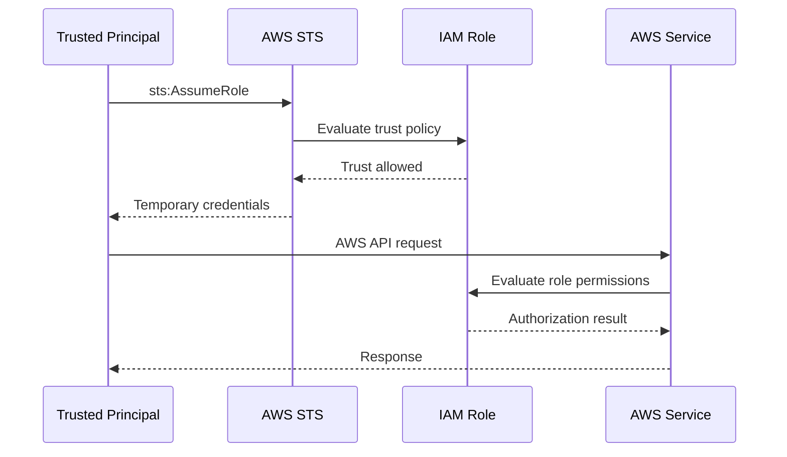

# 12- Trust Policies

## Overview

An IAM role trust policy defines **who or what is allowed to assume the role**. It is the resource-based policy attached directly to an IAM role and controls the role's trust relationship.

A role therefore has two distinct authorization layers:

```text
Trust Policy
    ↓
Who can assume this role?

Permission Policies
    ↓
What can the assumed role do?
```

This distinction is foundational to AWS IAM.

For example, an ECS task may be allowed to assume a role:

```text
ECS Tasks
    ↓
AssumeRole
    ↓
OrderServiceRole
```

After the role is assumed, the role's permission policies determine whether the application can:

```text
sqs:SendMessage
s3:PutObject
secretsmanager:GetSecretValue
```

A correct permission policy does not help if the trust policy does not allow the caller to assume the role. Likewise, a correct trust policy does not give the role permission to access AWS resources.

---

## What Is a Trust Policy?

A trust policy is a JSON policy attached to an IAM role that defines the principals trusted to assume that role.

A typical trust policy looks like:

```json
{
    "Version": "2012-10-17",
    "Statement": [
        {
            "Sid": "AllowEcsTasks",
            "Effect": "Allow",
            "Principal": {
                "Service": "ecs-tasks.amazonaws.com"
            },
            "Action": "sts:AssumeRole"
        }
    ]
}
```

This statement means:

```text
Principal:
    ECS tasks service

Effect:
    Allow

Action:
    sts:AssumeRole

Target:
    This IAM role
```

The trust policy does not define S3, SQS, DynamoDB, Secrets Manager, or other application permissions.

---

## Why Trust Policies Exist

IAM roles are designed to be **assumed by trusted principals**.

Without a trust relationship, a role would have permissions but no authorized caller could obtain its credentials.

The role lifecycle is therefore:

```text
Trusted Principal
        ↓
Trust Policy
        ↓
AssumeRole / Federation
        ↓
Temporary Credentials
        ↓
Role Permission Policies
        ↓
AWS Resources
```

This separation allows AWS to model:

- Human access
- Workload identity
- Service roles
- Cross-account access
- Federation
- CI/CD access
- Delegated administration

without embedding long-lived credentials into applications.

---

## Trust Policy vs Permission Policy

This is one of the most important IAM distinctions.

### Trust Policy

Answers:

> Who can assume this role?

Example:

```json
{
    "Version": "2012-10-17",
    "Statement": [
        {
            "Effect": "Allow",
            "Principal": {
                "Service": "ecs-tasks.amazonaws.com"
            },
            "Action": "sts:AssumeRole"
        }
    ]
}
```

### Permission Policy

Answers:

> What can the role do?

Example:

```json
{
    "Version": "2012-10-17",
    "Statement": [
        {
            "Effect": "Allow",
            "Action": "sqs:SendMessage",
            "Resource": "arn:aws:sqs:ap-south-1:123456789012:order-events"
        }
    ]
}
```

The resulting architecture is:

```text
Caller
    ↓
Trust Policy
    ↓
Role Session
    ↓
Permission Policies
    ↓
AWS Resource
```

A common troubleshooting error is changing the permission policy when the actual failure is the trust relationship.

---

## Trust Policies Are Resource-Based Policies

IAM role trust policies are a special form of resource-based policy.

The resource is the IAM role:

```text
IAM Role
    ↓
Trust Policy
```

This explains why trust policies contain an explicit:

```json
"Principal": ...
```

An identity-based policy does not normally specify `Principal` because the identity receiving the policy is already known.

Compare:

```text
Identity-Based Policy

Role
    ↓
Permission Policy
    ↓
Action + Resource


Trust Policy

Role
    ↓
Trust Policy
    ↓
Principal + sts:AssumeRole
```

The policy is evaluated from the perspective of the role being protected.

---

## Core Trust Policy Elements

A trust policy commonly uses:

| Element | Purpose |
|---|---|
| `Version` | IAM policy language version |
| `Statement` | Authorization statements |
| `Sid` | Optional statement identifier |
| `Effect` | Usually `Allow` for trusted principals |
| `Principal` | Who is trusted |
| `Action` | STS operation allowed |
| `Condition` | Additional trust constraints |

Most trust policies do not need `Resource` because the policy is attached directly to the role being trusted.

A standard structure is:

```json
{
    "Version": "2012-10-17",
    "Statement": [
        {
            "Sid": "TrustStatement",
            "Effect": "Allow",
            "Principal": {},
            "Action": "sts:AssumeRole",
            "Condition": {}
        }
    ]
}
```

---

## `Principal`

`Principal` is the most important element in a trust policy.

It specifies the trusted entity.

Common forms include:

```text
AWS account
IAM role
IAM user
AWS service
Federated identity provider
```

Examples:

### AWS Service

```json
"Principal": {
    "Service": "ecs-tasks.amazonaws.com"
}
```

### IAM Role

```json
"Principal": {
    "AWS": "arn:aws:iam::123456789012:role/DeploymentRole"
}
```

### AWS Account

```json
"Principal": {
    "AWS": "arn:aws:iam::123456789012:root"
}
```

### Federated Identity Provider

```json
"Principal": {
    "Federated": "arn:aws:iam::123456789012:oidc-provider/example.com"
}
```

The exact principal type must match the federation or trust mechanism being used.

---

## AWS Service Principals

AWS services commonly assume roles on behalf of applications.

Examples:

```text
EC2
    ec2.amazonaws.com

ECS tasks
    ecs-tasks.amazonaws.com

Lambda
    lambda.amazonaws.com

CloudFormation
    cloudformation.amazonaws.com
```

An ECS task role trust policy might be:

```json
{
    "Version": "2012-10-17",
    "Statement": [
        {
            "Sid": "AllowEcsTasksToAssumeRole",
            "Effect": "Allow",
            "Principal": {
                "Service": "ecs-tasks.amazonaws.com"
            },
            "Action": "sts:AssumeRole"
        }
    ]
}
```

The service principal should be obtained from the AWS service documentation rather than guessed.

A typo in the service principal can cause role-assumption failures even when the role's permission policy is correct.

---

## IAM Role Principal

A role can trust another role.

Example:

```json
{
    "Version": "2012-10-17",
    "Statement": [
        {
            "Sid": "AllowDeploymentRole",
            "Effect": "Allow",
            "Principal": {
                "AWS": "arn:aws:iam::123456789012:role/DeploymentRole"
            },
            "Action": "sts:AssumeRole"
        }
    ]
}
```

The resulting relationship is:

```text
DeploymentRole
    ↓
sts:AssumeRole
    ↓
ProductionRole
```

The source role also needs permission to call:

```text
sts:AssumeRole
```

on the target role.

A trust policy alone is therefore not always sufficient.

---

## Cross-Account Trust

Trust policies are fundamental to cross-account access.

Example:

```text
Account A
    DeploymentRole
        |
        | AssumeRole
        v
Account B
    ProductionRole
```

The target role in Account B can trust the source role in Account A:

```json
{
    "Version": "2012-10-17",
    "Statement": [
        {
            "Sid": "AllowSourceAccountDeploymentRole",
            "Effect": "Allow",
            "Principal": {
                "AWS": "arn:aws:iam::111111111111:role/DeploymentRole"
            },
            "Action": "sts:AssumeRole"
        }
    ]
}
```

The source role also needs:

```json
{
    "Version": "2012-10-17",
    "Statement": [
        {
            "Sid": "AssumeProductionRole",
            "Effect": "Allow",
            "Action": "sts:AssumeRole",
            "Resource": "arn:aws:iam::222222222222:role/ProductionRole"
        }
    ]
}
```

Conceptually:

```text
Source Side
    sts:AssumeRole permission
          +
Target Side
    Trust policy
          ↓
Role assumption
```

This is the standard pattern for controlled cross-account role access.

---

## Account Principals

A trust policy can trust an entire AWS account:

```json
{
    "Principal": {
        "AWS": "arn:aws:iam::111111111111:root"
    }
}
```

This does not mean that only the root user can assume the role.

The account principal represents the trusted account. Identity permissions in that account determine which users or roles can actually call `sts:AssumeRole`.

Conceptually:

```text
Account A
    |
    +-- User
    +-- Role A
    +-- Role B
             |
             | sts:AssumeRole
             v
Account B
    Target Role
```

This pattern is broader than directly trusting one role.

When least privilege is important, trust a specific role or otherwise constrain the account-level trust with conditions.

---

## Role Assumption Actions

Different federation mechanisms use different STS actions.

| Trust mechanism | Typical STS action |
|---|---|
| IAM role / AWS service | `sts:AssumeRole` |
| Web identity / OIDC | `sts:AssumeRoleWithWebIdentity` |
| SAML federation | `sts:AssumeRoleWithSAML` |

This matters when designing trust policies.

A trust policy intended for OIDC federation should not blindly use:

```text
sts:AssumeRole
```

when the actual authentication flow uses:

```text
sts:AssumeRoleWithWebIdentity
```

---

## Role Assumption Flow

For a normal role:



The important separation is:

```text
Assumption authorization
    ↓
Trust policy

Resource authorization
    ↓
Role permission policies
```

---

## Conditions in Trust Policies

Conditions make trust relationships more precise.

A trust policy can constrain the trusted principal based on request context.

For example:

```json
{
    "Version": "2012-10-17",
    "Statement": [
        {
            "Sid": "AllowDeploymentRoleFromExpectedOrg",
            "Effect": "Allow",
            "Principal": {
                "AWS": "arn:aws:iam::111111111111:role/DeploymentRole"
            },
            "Action": "sts:AssumeRole",
            "Condition": {
                "StringEquals": {
                    "aws:PrincipalOrgID": "o-exampleorgid"
                }
            }
        }
    ]
}
```

Common trust-policy condition keys include:

- `aws:PrincipalArn`
- `aws:PrincipalAccount`
- `aws:PrincipalOrgID`
- `sts:ExternalId`
- OIDC token claims
- Source-account and source-ARN keys where supported by the service integration

Conditions should be used to reduce trust scope, not simply to make the policy more complicated.

---

## External ID

An `ExternalId` is commonly used when a third-party service assumes a role in your AWS account.

Example:

```json
{
    "Version": "2012-10-17",
    "Statement": [
        {
            "Sid": "AllowThirdPartyProvider",
            "Effect": "Allow",
            "Principal": {
                "AWS": "arn:aws:iam::555555555555:role/VendorRole"
            },
            "Action": "sts:AssumeRole",
            "Condition": {
                "StringEquals": {
                    "sts:ExternalId": "customer-12345"
                }
            }
        }
    ]
}
```

The third party calls:

```text
AssumeRole
    +
ExternalId
```

The external ID helps prevent the **confused deputy** problem when one third party accesses resources belonging to many customers. AWS documents external IDs specifically for these cross-account third-party scenarios.

An external ID is not a replacement for:

- Strong authentication
- Narrow principals
- Least privilege
- Short session durations
- Good trust-policy design

---

## The Confused Deputy Problem

Consider a SaaS provider serving:

```text
Customer A
Customer B
Customer C
```

Each customer gives the provider access to an AWS role.

Without a tenant-specific external ID, the provider could potentially be induced into using one customer's role when operating on behalf of another customer.

The external ID creates an additional trust condition:

```text
Provider
    ↓
Customer-specific ExternalId
    ↓
AssumeRole
    ↓
Correct Customer Role
```

This allows the target role to distinguish which customer relationship the provider is acting under.

---

## OIDC Trust Policies

OpenID Connect (OIDC) federation lets an external identity provider exchange a valid OIDC token for temporary AWS credentials.

A simplified flow is:

```text
External Workload
    ↓
OIDC Token
    ↓
AWS STS
    ↓
IAM Role Trust Policy
    ↓
Temporary Credentials
    ↓
AWS APIs
```

A trust policy for GitHub Actions, for example, commonly looks conceptually like:

```json
{
    "Version": "2012-10-17",
    "Statement": [
        {
            "Sid": "AllowGitHubActions",
            "Effect": "Allow",
            "Principal": {
                "Federated": "arn:aws:iam::123456789012:oidc-provider/token.actions.githubusercontent.com"
            },
            "Action": "sts:AssumeRoleWithWebIdentity",
            "Condition": {
                "StringEquals": {
                    "token.actions.githubusercontent.com:aud": "sts.amazonaws.com"
                },
                "StringLike": {
                    "token.actions.githubusercontent.com:sub": "repo:my-org/my-repo:*"
                }
            }
        }
    ]
}
```

The important design principle is to constrain the token claims.

Do not trust an entire OIDC provider when the workload only needs access for one organization, repository, environment, or other tightly defined subject.

---

## OIDC Conditions

OIDC trust policies commonly restrict claims such as:

```text
aud
sub
```

For GitHub Actions:

```text
aud
    sts.amazonaws.com

sub
    repo:organization/repository:ref:refs/heads/main
```

A narrowly scoped subject can reduce the trust relationship considerably.

For example:

```json
"StringLike": {
    "token.actions.githubusercontent.com:sub": [
        "repo:company/backend-api:environment:production"
    ]
}
```

The exact subject format depends on the identity provider's token claims.

The production rule is:

> Treat federation claims as security-sensitive authorization attributes, not as generic metadata.

---

## EKS Workload Identity

Modern EKS environments can use AWS IAM roles for pod workloads.

One supported model is EKS Pod Identity, where the EKS Pod Identity Agent and AWS service principal participate in the role-assumption flow.

A conceptual trust relationship is:

```json
{
    "Version": "2012-10-17",
    "Statement": [
        {
            "Sid": "AllowEksPods",
            "Effect": "Allow",
            "Principal": {
                "Service": "pods.eks.amazonaws.com"
            },
            "Action": [
                "sts:AssumeRole",
                "sts:TagSession"
            ]
        }
    ]
}
```

The exact EKS integration and prerequisites should be aligned with the cluster's configured workload identity mechanism.

The important architecture remains:

```text
Kubernetes Pod
    ↓
Workload Identity
    ↓
IAM Role
    ↓
Temporary Credentials
    ↓
AWS API
```

This removes the need to place static access keys inside Kubernetes secrets.

---

## `aws:PrincipalArn`

The `aws:PrincipalArn` condition key can be used to constrain trust based on the ARN of the principal.

Example:

```json
{
    "Version": "2012-10-17",
    "Statement": [
        {
            "Sid": "AllowDeploymentRole",
            "Effect": "Allow",
            "Principal": "*",
            "Action": "sts:AssumeRole",
            "Condition": {
                "ArnEquals": {
                    "aws:PrincipalArn": "arn:aws:iam::111111111111:role/DeploymentRole"
                }
            }
        }
    ]
}
```

This is an advanced pattern and should not be used without understanding its evaluation semantics.

One important reason to know the pattern is IAM role lifecycle.

When a role ARN is used directly as a principal in a resource-based policy, AWS internally maps that principal to a principal ID. If the role is deleted and recreated, the new role has a different principal ID. A policy using `aws:PrincipalArn` has different lifecycle behavior because the condition evaluates the ARN dynamically.

This can matter in infrastructure automation where IAM roles are recreated.

---

## Principal ID and Role Recreation

Suppose a trust policy directly references:

```text
arn:aws:iam::111111111111:role/DeploymentRole
```

The role is later deleted and recreated with the same name.

The new role is a different IAM identity internally.

This can result in an old trust relationship no longer matching the recreated role.

Conceptually:

```text
Original Role
    DeploymentRole
        ↓
Principal ID A

Role deleted

New Role
    DeploymentRole
        ↓
Principal ID B
```

The names are identical, but the identities are different.

This is an important production consideration for infrastructure-as-code and automated role replacement.

Where appropriate, conditions based on `aws:PrincipalArn` can avoid certain lifecycle problems, but they should be used deliberately.

---

## `aws:PrincipalOrgID`

Organizations can use `aws:PrincipalOrgID` to constrain trust to principals belonging to a specific AWS Organization.

Conceptually:

```text
AWS Organization
    ↓
Trusted principals
    ↓
AssumeRole
```

A policy can use:

```json
{
    "Condition": {
        "StringEquals": {
            "aws:PrincipalOrgID": "o-exampleorgid"
        }
    }
}
```

This can be useful when multiple accounts inside one organization should be trusted without listing each account individually.

However, an organization-wide condition may be broader than a specific workload trust relationship.

Use it when the organizational trust boundary is genuinely the desired boundary.

---

## Conditions for AWS Services

Service-to-service trust policies often use context keys such as:

```text
aws:SourceArn
aws:SourceAccount
```

These conditions can prevent a service principal from being trusted more broadly than intended.

Conceptually:

```text
AWS Service
    +
Expected Source ARN
    +
Expected Account
    ↓
Target Role
```

The exact condition keys and semantics depend on the AWS service integration.

For service roles, always follow the service's documented trust-policy pattern rather than creating a generic policy based only on the service principal.

---

## Wildcard Principals

This is dangerous:

```json
{
    "Effect": "Allow",
    "Principal": "*",
    "Action": "sts:AssumeRole"
}
```

It can create an extremely broad trust relationship unless conditions narrow the eligible principals.

Prefer:

```json
{
    "Principal": {
        "AWS": "arn:aws:iam::111111111111:role/DeploymentRole"
    }
}
```

or an explicitly constrained principal plus conditions.

A role with highly privileged permissions and a broad trust policy can become a significant privilege-escalation target.

---

## Trust Policy With Multiple Principals

A trust policy can contain multiple trusted principals.

Example:

```json
{
    "Version": "2012-10-17",
    "Statement": [
        {
            "Sid": "AllowApprovedServices",
            "Effect": "Allow",
            "Principal": {
                "Service": [
                    "ecs-tasks.amazonaws.com",
                    "lambda.amazonaws.com"
                ]
            },
            "Action": "sts:AssumeRole"
        }
    ]
}
```

This is syntactically valid, but sharing one role across materially different workloads can create a larger trust boundary than intended.

For example:

```text
ECS
    +
Lambda
    ↓
One privileged role
```

may be less desirable than:

```text
ECS
    ↓
EcsApplicationRole

Lambda
    ↓
LambdaApplicationRole
```

Prefer separate roles when the workloads have different permissions, deployment ownership, or trust boundaries.

---

## Multiple Trust Statements

Separate trust statements can clarify different trust paths.

Example:

```json
{
    "Version": "2012-10-17",
    "Statement": [
        {
            "Sid": "AllowEcsTasks",
            "Effect": "Allow",
            "Principal": {
                "Service": "ecs-tasks.amazonaws.com"
            },
            "Action": "sts:AssumeRole"
        },
        {
            "Sid": "AllowDeploymentRole",
            "Effect": "Allow",
            "Principal": {
                "AWS": "arn:aws:iam::111111111111:role/DeploymentRole"
            },
            "Action": "sts:AssumeRole"
        }
    ]
}
```

This is easier to review than combining unrelated trust relationships into one statement.

Each statement can have independent conditions where needed.

---

## Trust Policy and Permission Boundaries

A permissions boundary limits the permissions an identity can receive from identity-based policies.

It does not automatically rewrite the trust policy.

Consider:

```text
Trust Policy
    Allows DeveloperRole

Permission Policy
    Allows S3

Boundary
    Allows S3
```

These solve three separate concerns:

```text
Trust
    Who can become the role?

Permission
    What can the role do?

Boundary
    What is the maximum identity-policy permission set?
```

The boundary is not a substitute for a narrow trust relationship.

A highly privileged role should have both:

```text
Narrow trust
+
Narrow permissions
```

---

## Trust Policy and SCPs

SCPs can also influence whether an assumption or related API operation is permitted, depending on the principal and account context.

For cross-account role assumption:

```text
Source Account
    ↓
Caller permission
    ↓
Source account organization controls
    ↓
sts:AssumeRole
    ↓
Target Role Trust
    ↓
Target account controls
```

A trust policy being correct does not guarantee that an organization-level control cannot block the request.

When debugging cross-account role assumption, inspect both the local IAM policies and the AWS Organizations controls affecting the source and target accounts.

---

## Trust Policy and Resource-Based Policy Semantics

A trust policy is resource-based because it is attached to the IAM role.

However, trust policies have a specialized purpose:

```text
Resource:
    IAM Role

Action:
    sts:AssumeRole

Principal:
    Trusted caller
```

This makes them different operationally from an S3 bucket policy, even though both are resource-based policies.

A useful model is:

```text
S3 Bucket Policy
    Resource access

Role Trust Policy
    Identity assumption
```

This distinction is important when reasoning about role assumption versus resource access.

---

## Production Trust Policy Example

Consider a production ECS service.

The role should trust only ECS tasks:

```json
{
    "Version": "2012-10-17",
    "Statement": [
        {
            "Sid": "AllowEcsTasksOnly",
            "Effect": "Allow",
            "Principal": {
                "Service": "ecs-tasks.amazonaws.com"
            },
            "Action": "sts:AssumeRole"
        }
    ]
}
```

The permission policy separately grants:

```text
sqs:ReceiveMessage
sqs:DeleteMessage
secretsmanager:GetSecretValue
s3:PutObject
```

The combined design is:

```text
ECS Task
    ↓
Trust Policy
    "May assume OrderWorkerRole"

OrderWorkerRole
    ↓
Permission Policy
    "May consume queue and write reports"
```

This creates a clean separation of identity and permissions.

---

## CI/CD Trust Policy Example

A deployment role using OIDC can trust only a specific GitHub Actions subject.

```json
{
    "Version": "2012-10-17",
    "Statement": [
        {
            "Sid": "AllowProductionWorkflow",
            "Effect": "Allow",
            "Principal": {
                "Federated": "arn:aws:iam::123456789012:oidc-provider/token.actions.githubusercontent.com"
            },
            "Action": "sts:AssumeRoleWithWebIdentity",
            "Condition": {
                "StringEquals": {
                    "token.actions.githubusercontent.com:aud": "sts.amazonaws.com"
                },
                "StringLike": {
                    "token.actions.githubusercontent.com:sub": "repo:company/backend-api:environment:production"
                }
            }
        }
    ]
}
```

The important controls are:

```text
Federated provider
    +
Correct STS action
    +
Expected audience
    +
Expected subject
```

Without subject restrictions, a trust relationship could be much broader than the intended deployment workflow.

---

## Third-Party SaaS Trust Policy Example

Suppose a monitoring vendor needs access to a role.

A controlled trust relationship can include:

```json
{
    "Version": "2012-10-17",
    "Statement": [
        {
            "Sid": "AllowMonitoringVendor",
            "Effect": "Allow",
            "Principal": {
                "AWS": "arn:aws:iam::555555555555:role/VendorMonitoringRole"
            },
            "Action": "sts:AssumeRole",
            "Condition": {
                "StringEquals": {
                    "sts:ExternalId": "customer-12345"
                }
            }
        }
    ]
}
```

The corresponding permission policy should expose only the telemetry resources the vendor actually needs.

The trust policy and permission policy should therefore be reviewed together:

```text
Vendor
    ↓
Trust Relationship
    ↓
MonitoringRole
    ↓
Least-Privilege Permissions
```

---

## Troubleshooting `AccessDenied` During AssumeRole

When role assumption fails, do not begin by changing the target role's application permissions.

Use this workflow:

```text
AssumeRole failure
    ↓
Identify caller
    ↓
Verify source identity
    ↓
Check source permission
    ↓
Check target trust policy
    ↓
Check Principal
    ↓
Check sts:AssumeRole action
    ↓
Check Condition
    ↓
Check ExternalId
    ↓
Check organization/account restrictions
```

Verify the current identity:

```bash
aws sts get-caller-identity
```

Then inspect the target role:

```bash
aws iam get-role \
    --role-name ProductionDeploymentRole
```

The most common categories are:

```text
Wrong caller
Wrong account
Missing sts:AssumeRole
Incorrect trust Principal
Condition mismatch
ExternalId mismatch
Organization restriction
```

---

## Trust Policy Troubleshooting Example

Suppose this fails:

```bash
aws sts assume-role \
    --role-arn arn:aws:iam::222222222222:role/ProductionDeploymentRole \
    --role-session-name deployment
```

Expected source role:

```text
arn:aws:iam::111111111111:role/DeploymentRole
```

Target trust policy:

```json
{
    "Principal": {
        "AWS": "arn:aws:iam::111111111111:role/DeploymentRole"
    },
    "Action": "sts:AssumeRole"
}
```

Check:

```text
1. Is the CLI actually using DeploymentRole?
2. Does DeploymentRole have sts:AssumeRole?
3. Is the target ARN correct?
4. Does the target trust exactly the intended source principal?
5. Are there trust-policy conditions?
6. Are there SCPs or other organization controls?
```

This is much safer than broadening trust to:

```json
"Principal": "*"
```

just to make the operation work.

---

## Trust Policy Best Practices

### Trust Specific Principals

Prefer:

```json
"Principal": {
    "AWS": "arn:aws:iam::111111111111:role/DeploymentRole"
}
```

over:

```json
"Principal": "*"
```

### Use Conditions for Additional Restrictions

Useful conditions may constrain:

```text
Organization
Account
External ID
OIDC claims
Source resource
Session attributes
```

### Separate Trust Boundaries

Do not use one highly privileged role for:

```text
Developers
CI/CD
ECS
Lambda
Third-Party Vendor
```

unless there is a deliberate reason to share the trust boundary.

### Prefer Temporary Credentials

A trust policy should normally lead to temporary credentials rather than long-lived access keys.

### Review Trust Before Permissions

A role with a narrow permission policy but an overly broad trust relationship may still be dangerous.

Security review should therefore examine:

```text
Who can assume?
+
What can the role do?
```

---

## Common Mistakes

| Mistake | Why it happens | Better approach |
|---|---|---|
| Confusing trust with permissions | Both are associated with the same role | Separate "who can assume" from "what can do" |
| Using `Principal: "*"` | Fast way to fix AssumeRole errors | Trust explicit principals or carefully constrained conditions |
| Trusting an entire account unnecessarily | Easier than listing a role | Trust the specific role when practical |
| Forgetting the caller's `sts:AssumeRole` permission | Only target trust is inspected | Check both sides of the assumption |
| Using the wrong STS action | Federation type is misunderstood | Match `AssumeRole`, `AssumeRoleWithWebIdentity`, or `AssumeRoleWithSAML` to the mechanism |
| Missing OIDC claim conditions | Provider is trusted too broadly | Restrict audience and subject claims |
| Omitting `ExternalId` for third-party access | Vendor trust is treated like normal cross-account access | Use customer-specific external IDs where appropriate |
| Sharing privileged roles across unrelated workloads | Reduces role count | Separate materially different trust boundaries |
| Assuming role names uniquely identify principals forever | Roles are deleted and recreated | Understand role/principal-ID lifecycle |
| Ignoring SCPs and organization controls | Trust policy looks correct | Inspect the complete authorization path |
| Broadening trust instead of diagnosing the caller | Debugging stops at AccessDenied | Verify with `aws sts get-caller-identity` |

---

## Security Considerations

Trust policies are security-sensitive because they determine who can obtain temporary credentials for a role.

Consider:

```text
Highly Privileged Role
    +
Broad Trust
    ↓
High Risk
```

A secure design aims for:

```text
Highly Privileged Role
    +
Narrow Trust
    +
Narrow Permissions
    ↓
Controlled Access
```

Review the following especially carefully:

- `Principal: "*"`
- Account-wide trust
- Third-party principals
- OIDC providers
- Broad organization trust
- Highly privileged deployment roles
- Roles with `iam:*`
- Roles with `iam:PassRole`
- Roles that can modify IAM
- Roles used across many workloads

Trust policies should be treated as part of the privilege-escalation boundary.

---

## Operational Considerations

### Infrastructure as Code

Manage trust policies through source control wherever possible.

Example repository:

```text
infrastructure/
    iam/
        trust-policies/
            ecs-order-worker.json
            production-deployment.json
            github-actions.json
        roles/
            order-worker
            production-deployment
```

This provides:

- Reviewability
- Version history
- Repeatability
- Controlled deployment
- Easier recovery

### Naming

Use role names that identify the intended trust boundary:

```text
OrderServiceRole
ProductionDeploymentRole
GitHubActionsProductionRole
ThirdPartyMonitoringRole
```

### Auditability

Role assumption events should be traceable to:

```text
Principal
Role
Session Name
Account
Time
Source
```

Use CloudTrail and meaningful role-session names where appropriate.

---

## High Availability and Disaster Recovery

IAM roles are not regional resources in the same way as EC2 or RDS resources.

A role can therefore be used by workloads deployed in different AWS regions, provided the target resources and policies are configured appropriately.

For disaster recovery, ensure that the failover environment has:

```text
Required role
    +
Correct trust relationship
    +
Correct resource permissions
    +
Required secrets permissions
    +
Required cross-account permissions
```

A common DR failure is:

```text
Application successfully fails over
    ↓
AWS API call
    ↓
AccessDenied
```

because the recovery environment uses different accounts, resource ARNs, or trust relationships.

Identity architecture should therefore be included in DR testing.

---

## Senior-Level Trust Model

A useful way to review any IAM role is to ask four questions:

```text
Who?
    Trusted principal

How?
    STS / federation mechanism

For how long?
    Session lifetime

Then what?
    Role permissions
```

For production roles, add:

```text
Which account?
Which organization?
Which workload?
Which conditions?
Which resource boundary?
Which audit trail?
```

This turns a trust policy from a JSON document into an explicit security boundary.

---

## Interview Perspective

### What Is a Trust Policy?

A trust policy is the resource-based policy attached to an IAM role that specifies which principals are allowed to assume the role.

### Does a Trust Policy Grant S3 or SQS Permissions?

No.

It controls role assumption.

```text
Trust Policy
    ↓
Can become the role?

Permission Policy
    ↓
Can access S3/SQS/etc.?
```

### What Is the Difference Between `AssumeRole` and `AssumeRoleWithWebIdentity`?

```text
AssumeRole
    Standard role assumption

AssumeRoleWithWebIdentity
    OIDC / web identity federation
```

SAML federation uses a separate STS operation.

### Why Is `ExternalId` Used?

It helps protect third-party cross-account role-assumption scenarios against confused-deputy problems.

### What Happens if Trust Is Correct but `sts:AssumeRole` Permission Is Missing?

The caller can still fail to assume the target role.

Cross-account role assumption typically requires:

```text
Caller Permission
    +
Target Trust
```

### Why Is `Principal: "*"` Dangerous?

It can create an extremely broad trust relationship. A privileged role with broad trust can expose significant account capabilities.

### Why Might a Recreated Role Stop Matching a Trust Policy?

When a role is deleted and recreated, the replacement role has a different internal principal identity even if its name and ARN are the same. Direct role-principal references can therefore require policy reconciliation after replacement.

---

## Production Trust Policy Checklist

Before deploying a role, verify:

```text
Principal
    Is the trusted entity explicit?

Action
    Is the correct STS action used?

Conditions
    Can the trust be narrowed further?

Account
    Is the expected account trusted?

Organization
    Is the organization boundary correct?

OIDC / Federation
    Are audience and subject claims constrained?

Third Party
    Is ExternalId required?

Role Lifecycle
    Could role recreation affect the trust?

Privilege
    Is the trusted principal appropriate for the role's permissions?

Auditability
    Can role sessions be traced?

Infrastructure
    Is the trust policy managed as code?
```

The final security review should evaluate:

```text
Trust
    +
Permissions
    +
Boundaries
    +
Organization Controls
    ↓
Effective Role Risk
```

## Key Takeaways

- A **trust policy controls who can assume an IAM role**, while the role's permission policies control what the resulting role session can do.
- Trust policies are **resource-based policies** and therefore explicitly specify the trusted `Principal` and the appropriate STS assumption action.
- Production trust should be **narrow and explicit**; use conditions such as organization, account, external ID, or federation claims when they materially reduce the trust boundary.
- Cross-account and federated role assumption requires more than a correct target trust policy; verify the **caller permissions, trust relationship, conditions, STS operation, and organization-level controls**.
- Treat trust policies as a core security boundary: a highly privileged role needs both **least-privilege permissions and a tightly controlled set of trusted principals**.