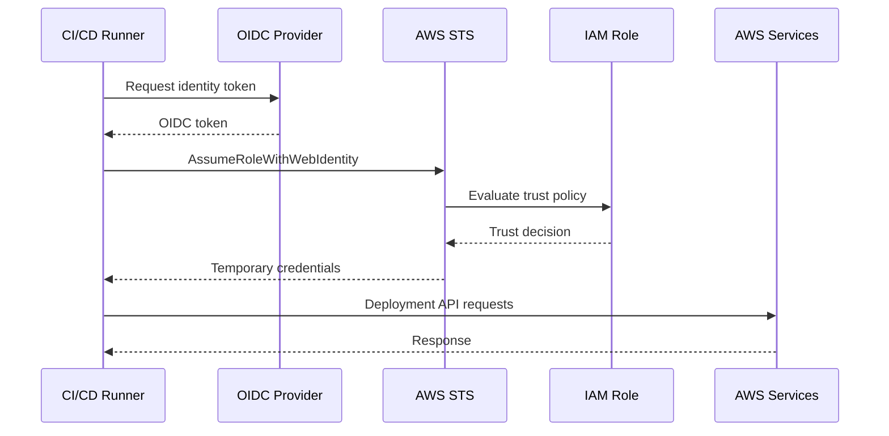

# 13- STS and Temporary Credentials

## Overview

AWS Security Token Service (AWS STS) is the service used to request **temporary security credentials** for AWS access. Those credentials are short-lived and consist of:

```text
Access Key ID
Secret Access Key
Session Token
Expiration
```

AWS applications and tools use these credentials to sign AWS API requests. Temporary credentials are the foundation for many modern AWS identity patterns, including:

- IAM role assumption
- Cross-account access
- Workforce federation
- Web identity federation
- CI/CD OIDC access
- Kubernetes workload identity
- Delegated access
- Temporary MFA-backed sessions

AWS recommends temporary credentials over long-lived IAM user access keys for workloads. AWS compute services such as EC2 and Lambda can deliver role credentials to applications automatically, and AWS SDKs can obtain and refresh temporary credentials through their credential provider mechanisms. :contentReference[oaicite:0]{index=0}

A useful mental model is:

```text
Trusted Identity
        ↓
      AWS STS
        ↓
Temporary Security Credentials
        ↓
AWS SDK / CLI
        ↓
AWS API
```

STS is therefore not normally the service that decides whether your application may read an S3 object or publish to SQS. It primarily provides the temporary credentials that allow the resulting principal to make AWS API requests, after which normal IAM authorization applies.

---

## What AWS STS Is

AWS Security Token Service provides APIs for obtaining temporary AWS security credentials.

The most important STS operations for backend engineers are:

| STS operation | Primary purpose |
|---|---|
| `AssumeRole` | Assume an IAM role |
| `AssumeRoleWithWebIdentity` | Obtain role credentials from an OIDC/web identity token |
| `AssumeRoleWithSAML` | Obtain role credentials from a SAML assertion |
| `GetSessionToken` | Obtain temporary credentials for an IAM user/root credential session |
| `GetFederationToken` | Obtain temporary credentials for a federated user session |
| `GetCallerIdentity` | Identify the principal represented by the current credentials |

AWS documents these operations as the primary mechanisms for requesting temporary security credentials. :contentReference[oaicite:1]{index=1}

---

## Temporary Security Credentials

Temporary credentials contain three values required for authenticated AWS API calls:

```text
AWS_ACCESS_KEY_ID
AWS_SECRET_ACCESS_KEY
AWS_SESSION_TOKEN
```

They also have an expiration time.

Unlike a long-lived IAM user access key, temporary credentials stop working after they expire. AWS states that temporary credentials cannot be extended beyond their original validity period; new credentials must be obtained. :contentReference[oaicite:2]{index=2}

Conceptually:

```text
Credentials Issued
        ↓
Valid API Requests
        ↓
Expiration Time
        ↓
Credentials Rejected
```

A valid temporary credential is therefore both:

```text
Authentication Material
+
Time-Limited Authorization Context
```

The permissions available to the credentials depend on how those credentials were obtained and the policies applicable to the resulting principal.

---

## Why Temporary Credentials Matter

Long-lived access keys create several operational problems:

```text
Credential stored
    ↓
Credential copied
    ↓
Credential deployed
    ↓
Credential potentially leaked
    ↓
Manual rotation required
```

Temporary credentials change the lifecycle:

```text
Identity
    ↓
Request short-lived access
    ↓
Temporary credentials
    ↓
Use
    ↓
Expiration
    ↓
Obtain another session
```

This provides several advantages:

- Reduced credential lifetime
- Less dependence on static secrets
- Better separation of identity and workload
- Easier cross-account delegation
- Better federation support
- Better CI/CD integration
- Better workload identity patterns

AWS explicitly recommends using temporary credentials for workloads instead of distributing long-term IAM user credentials. :contentReference[oaicite:3]{index=3}

---

## STS and IAM Roles

The most common modern STS pattern is role assumption.

```text
Caller
    ↓
IAM Role Trust Policy
    ↓
sts:AssumeRole
    ↓
AWS STS
    ↓
Temporary Credentials
    ↓
Role Session
    ↓
AWS APIs
```

The target role contains:

```text
Trust Policy
    Who can assume the role?

Permission Policies
    What can the role do?
```

STS connects those two concepts by creating a temporary role session.

---

## `AssumeRole`

`AssumeRole` requests temporary credentials for an IAM role.

A conceptual request looks like:

```text
Source Principal
    ↓
sts:AssumeRole
    ↓
Role ARN
    ↓
Trust Policy Evaluation
    ↓
Temporary Credentials
```

Example CLI command:

```bash
aws sts assume-role \
    --role-arn arn:aws:iam::222222222222:role/ProductionDeploymentRole \
    --role-session-name deployment
```

The caller must be authorized to call `sts:AssumeRole`, and the target role must trust the caller through its trust policy. For cross-account access, both sides of the role-assumption relationship must be correctly configured. :contentReference[oaicite:4]{index=4}

---

## `AssumeRole` Response

A successful `AssumeRole` response contains temporary credentials.

Conceptually:

```json
{
    "Credentials": {
        "AccessKeyId": "ASIA...",
        "SecretAccessKey": "temporary-secret",
        "SessionToken": "temporary-token",
        "Expiration": "2026-09-18T14:00:00Z"
    }
}
```

The actual response contains additional metadata.

The important operational properties are:

```text
AccessKeyId
SecretAccessKey
SessionToken
Expiration
```

All three credential values are needed to authenticate requests made with the session credentials.

---

## Role Sessions

Every successful role assumption creates a role session.

```text
ProductionDeploymentRole
    |
    +-- Session: deployment-1001
    +-- Session: deployment-1002
    +-- Session: deployment-1003
```

Each session has its own temporary credentials.

A role session can be identified through its session name. AWS documents that the role session name becomes part of the role-session ARN and appears in CloudTrail events for operations made through the session. :contentReference[oaicite:5]{index=5}

For CI/CD, useful session names can contain identifiers such as:

```text
github-actions-4821
deploy-production-9381
terraform-run-231
```

Avoid putting sensitive information into session names because session identifiers can become visible in audit records.

---

## Role Session Duration

For `AssumeRole`, the requested duration can range from:

```text
15 minutes
```

up to the role's configured maximum session duration, which can be:

```text
1 hour to 12 hours
```

The default role maximum is one hour unless changed. The `DurationSeconds` parameter cannot exceed the role's configured maximum. :contentReference[oaicite:6]{index=6}

Example:

```bash
aws sts assume-role \
    --role-arn arn:aws:iam::222222222222:role/ProductionDeploymentRole \
    --role-session-name deployment \
    --duration-seconds 3600
```

For production workloads, choose the smallest duration that is operationally practical.

Longer sessions reduce the frequency of credential acquisition but increase the window during which exposed credentials remain usable.

---

## Role Chaining

Role chaining occurs when a role session assumes another role.

```text
Principal
    ↓
Role A
    ↓
Temporary Session A
    ↓
AssumeRole
    ↓
Role B
    ↓
Temporary Session B
```

This can be useful in delegated-access and multi-account architectures.

However, AWS limits CLI/API role chaining to a **maximum one-hour session**. A chained role session cannot request a longer duration through the normal `AssumeRole` API flow. :contentReference[oaicite:7]{index=7}

Therefore:

| Pattern | Typical maximum |
|---|---|
| Direct `AssumeRole` | Up to role maximum, 12 hours |
| Role chaining | 1 hour |
| `AssumeRoleWithWebIdentity` | Up to role maximum, 12 hours |

Role chaining should be kept intentional because every additional hop makes authorization and auditing more difficult.

---

## Source Identity

`AssumeRole` supports a `SourceIdentity` value that identifies the original source of a role-assumption request.

The source identity persists across chained role sessions. :contentReference[oaicite:8]{index=8}

Conceptually:

```text
Human / CI/CD
    ↓
Role A
    SourceIdentity = deployment-4821
    ↓
Role B
    SourceIdentity = deployment-4821
```

This can improve auditability in environments with multiple role hops.

A useful production pattern is to connect source identity with an existing deployment, workflow, or operator identifier without placing secrets in the value.

---

## Session Policies

When assuming a role, the caller can supply session policies that further restrict the permissions available to the resulting session.

Conceptually:

```text
Role Permissions
        ∩
Session Policy
        ↓
Role Session Permissions
```

A session policy cannot grant more permissions than the underlying role allows.

This is useful when the same role supports several delegated workflows but each session should receive a narrower permission set.

AWS supports an inline session policy and managed session-policy ARNs for relevant STS operations. :contentReference[oaicite:9]{index=9}

---

## Session Tags

STS role sessions can also carry session tags.

Conceptually:

```text
Caller
    ↓
AssumeRole
    + Session Tags
    ↓
Role Session
    ↓
ABAC / Audit Context
```

Session tags can participate in authorization designs using appropriate IAM condition keys.

They can also help preserve context such as:

```text
Team = Payments
Environment = Production
Project = Orders
```

Session tags should be treated as authorization-sensitive metadata when policies depend on them.

Do not assume that a tag is trustworthy merely because it came from a session. The ability to pass or set session tags must itself be controlled.

---

## `GetCallerIdentity`

`GetCallerIdentity` identifies the IAM principal represented by the credentials currently being used.

Example:

```bash
aws sts get-caller-identity
```

Example response:

```json
{
    "UserId": "AROAXXXXXXXXXXXXX:deployment",
    "Account": "123456789012",
    "Arn": "arn:aws:sts::123456789012:assumed-role/DeploymentRole/deployment"
}
```

The response is particularly useful during IAM troubleshooting because it answers:

```text
Which account am I using?
Which principal am I using?
Am I using the expected role?
```

AWS states that no permissions are required for `GetCallerIdentity`; even an explicit deny on `sts:GetCallerIdentity` does not prevent the identity information from being returned. :contentReference[oaicite:10]{index=10}

This makes it one of the best first diagnostic commands when debugging AWS credentials.

---

## `GetCallerIdentity` in Backend Diagnostics

A Python service can inspect its current identity:

```python
import boto3

sts = boto3.client("sts")

identity = sts.get_caller_identity()

print(identity["Account"])
print(identity["Arn"])
```

This can be useful during:

- Local development
- Container debugging
- ECS deployments
- EC2 troubleshooting
- CI/CD validation
- Cross-account debugging
- Kubernetes workload identity diagnostics

Avoid logging full credentials. Identity metadata is useful for diagnostics, while secret access keys and session tokens must never be logged.

---

## `AssumeRoleWithWebIdentity`

`AssumeRoleWithWebIdentity` exchanges an OIDC/web identity token for temporary AWS credentials.

The architecture is:

```text
External Identity Provider
        ↓
OIDC Token
        ↓
AWS STS
        ↓
IAM Role Trust Policy
        ↓
Temporary Credentials
        ↓
AWS API
```

This is important for:

- Kubernetes workloads
- GitHub Actions
- Other OIDC-enabled CI/CD systems
- Web identity federation
- Applications using supported external identity providers

The resulting credentials are temporary and use the same basic model:

```text
Access Key ID
Secret Access Key
Session Token
Expiration
```

AWS documents a default session duration of one hour for `AssumeRoleWithWebIdentity`, with a configurable duration from 15 minutes up to the role's maximum session duration of up to 12 hours. :contentReference[oaicite:11]{index=11}

---

## OIDC and CI/CD

A production CI/CD architecture can avoid static AWS keys:

```text
GitHub Actions
    ↓
OIDC Token
    ↓
AWS STS
    ↓
AssumeRoleWithWebIdentity
    ↓
Deployment Role
    ↓
Temporary Credentials
    ↓
ECR / ECS / CloudFormation
```

The trust policy should restrict the OIDC provider and relevant token claims.

A simplified trust policy is:

```json
{
    "Version": "2012-10-17",
    "Statement": [
        {
            "Sid": "AllowProductionWorkflow",
            "Effect": "Allow",
            "Principal": {
                "Federated": "arn:aws:iam::123456789012:oidc-provider/token.actions.githubusercontent.com"
            },
            "Action": "sts:AssumeRoleWithWebIdentity",
            "Condition": {
                "StringEquals": {
                    "token.actions.githubusercontent.com:aud": "sts.amazonaws.com"
                },
                "StringLike": {
                    "token.actions.githubusercontent.com:sub": "repo:company/backend-api:environment:production"
                }
            }
        }
    ]
}
```

The exact provider and claim values depend on the identity platform.

The security principle is:

```text
Federation Provider
    +
Specific Identity Claims
    +
Least-Privilege Role
```

rather than:

```text
CI/CD
    +
Long-Lived AWS Access Key
```

---

## OIDC and Kubernetes

Kubernetes workloads can use web identity or AWS-native workload identity mechanisms to obtain role credentials.

The generalized model is:

```text
Pod
    ↓
Workload Identity
    ↓
OIDC / AWS identity mechanism
    ↓
STS
    ↓
IAM Role
    ↓
Temporary Credentials
```

The AWS SDK can then obtain those credentials automatically.

This is preferable to:

```text
Kubernetes Secret
    ↓
Permanent AWS Access Key
```

because temporary credentials reduce the lifetime of exposed authentication material.

AWS recommends temporary credentials for workloads and documents web identity as one mechanism for workloads outside the traditional IAM user model. :contentReference[oaicite:12]{index=12}

---

## `AssumeRoleWithSAML`

SAML federation allows an external identity provider to exchange a SAML assertion for temporary AWS credentials.

The model is:

```text
Corporate IdP
    ↓
SAML Assertion
    ↓
AWS STS
    ↓
IAM Role
    ↓
Temporary Credentials
    ↓
AWS Resources
```

This is commonly associated with workforce federation.

The important architectural property is the same:

```text
External Authentication
    ↓
Temporary AWS Session
```

rather than creating a long-lived IAM access key for every employee.

---

## `GetSessionToken`

`GetSessionToken` obtains temporary credentials based on long-term credentials belonging to an IAM user or, technically, the AWS account root user.

Its important use case is MFA-backed temporary sessions for IAM users.

Example:

```bash
aws sts get-session-token \
    --serial-number arn:aws:iam::123456789012:mfa/alice \
    --token-code 123456
```

For IAM users, AWS documents a session duration from 15 minutes to 36 hours, with a default of 12 hours. For root-user credentials, the maximum is one hour. :contentReference[oaicite:13]{index=13}

The credentials inherit the IAM user's permissions, subject to the applicable session context.

---

## `GetSessionToken` and MFA

A common model is:

```text
IAM User
    +
Long-Term Credentials
    +
MFA
    ↓
GetSessionToken
    ↓
Temporary Credentials
```

This can be useful for specific legacy or specialized human-access scenarios.

However, modern workforce access generally favors federation and IAM Identity Center instead of building operational workflows around long-lived IAM user credentials.

AWS recommends avoiding IAM users for purpose-built software and using centralized identity or short-term credentials instead. :contentReference[oaicite:14]{index=14}

---

## `GetFederationToken`

`GetFederationToken` can create temporary credentials for a federated user session.

AWS documents:

```text
Minimum:
    15 minutes

Maximum:
    36 hours

Default:
    12 hours
```

For root credentials, the session is restricted to a maximum of one hour. :contentReference[oaicite:15]{index=15}

A session policy must be supplied for `GetFederationToken`, and the resulting permissions are constrained by the IAM user's permissions and the supplied session policy. :contentReference[oaicite:16]{index=16}

For modern applications, web identity federation and role assumption are often more natural choices, but `GetFederationToken` remains part of the STS authorization model and is relevant when understanding older federation patterns and AWS session behavior.

---

## STS Credential Comparison

| API | Main use | Caller | Default | Maximum |
|---|---|---|---:|---:|
| `AssumeRole` | Role assumption | Trusted principal | 1 hour | Role maximum, up to 12 hours |
| `AssumeRoleWithWebIdentity` | OIDC/web identity | Identity provider token | 1 hour | Role maximum, up to 12 hours |
| `AssumeRoleWithSAML` | SAML federation | SAML assertion | 1 hour | Role maximum, up to 12 hours |
| `GetSessionToken` | Temporary IAM user session / MFA | IAM user or root credentials | 12 hours | IAM user: 36 hours; root: 1 hour |
| `GetFederationToken` | Federated user session | IAM user or root credentials | 12 hours | IAM user: 36 hours; root: 1 hour |
| `GetCallerIdentity` | Identify caller | Current AWS credentials | N/A | N/A |

The exact limitations of each operation differ beyond session duration, including which APIs the resulting credentials can call and whether session policies or MFA are supported. AWS provides a detailed STS credential comparison in its current documentation. :contentReference[oaicite:17]{index=17}

---

## Temporary Credentials and Credential Provider Chains

Backend applications should generally avoid manually handling STS credentials whenever the AWS SDK can obtain them automatically.

For example:

```python
import boto3

s3 = boto3.client("s3")
```

The application can rely on the SDK's credential provider mechanism to discover appropriate credentials.

Depending on the runtime, credentials can come from sources such as:

```text
Environment
    ↓
AWS configuration
    ↓
IAM Identity Center / profile
    ↓
Web identity
    ↓
Container credentials
    ↓
EC2 role credentials
```

The exact provider order depends on the SDK and environment.

AWS recommends using temporary credentials delivered by AWS compute services or other supported credential providers rather than manually managing access keys. :contentReference[oaicite:18]{index=18}

---

## Boto3 and Temporary Credentials

A production Python application normally does not need to explicitly call STS when the runtime already provides role credentials.

For example:

```python
import boto3

s3 = boto3.client("s3")

s3.put_object(
    Bucket="company-reports",
    Key="generated/report.json",
    Body=b'{"status": "complete"}',
)
```

The application can remain unaware of whether its credentials came from:

```text
ECS task role
EC2 instance role
Lambda execution role
OIDC role
IAM Identity Center
AssumeRole profile
```

This separation is valuable because authentication configuration remains an infrastructure concern.

---

## Explicitly Assuming a Role With Boto3

An application can explicitly call STS when it needs to assume a different role.

Example:

```python
import boto3

sts = boto3.client("sts", region_name="ap-south-1")

response = sts.assume_role(
    RoleArn="arn:aws:iam::222222222222:role/ReportingRole",
    RoleSessionName="reporting-job",
)

credentials = response["Credentials"]

s3 = boto3.client(
    "s3",
    region_name="ap-south-1",
    aws_access_key_id=credentials["AccessKeyId"],
    aws_secret_access_key=credentials["SecretAccessKey"],
    aws_session_token=credentials["SessionToken"],
)
```

This pattern can be useful for deliberate cross-account or delegated access.

However, do not build custom credential-refresh logic unless necessary. Prefer the SDK's role or credential-provider mechanisms when they can manage the lifecycle for you.

---

## Automatic Credential Refresh

Temporary credentials create an operational requirement:

```text
Credentials expire
    ↓
Application must obtain new credentials
```

Modern AWS SDK providers can manage this lifecycle.

For example:

```text
ECS Task Role
    ↓
Temporary Credentials
    ↓
SDK Credential Provider
    ↓
Credential Expiration Approaches
    ↓
Provider Obtains New Credentials
    ↓
Application Continues
```

AWS SDK documentation describes credential providers that automatically retrieve and refresh temporary credentials for supported authentication patterns. :contentReference[oaicite:19]{index=19}

This is one reason production applications should use standard AWS SDK credential providers rather than manually storing STS responses.

---

## Temporary Credentials in Containers

For ECS:

```text
ECS Task
    ↓
Task Role
    ↓
Temporary Credentials
    ↓
Container Application
```

For EC2:

```text
EC2 Instance
    ↓
Instance Role
    ↓
Temporary Credentials
    ↓
Application
```

For Kubernetes:

```text
Pod
    ↓
AWS Workload Identity
    ↓
IAM Role
    ↓
Temporary Credentials
```

The application should normally use the standard SDK credential chain.

Do not place:

```text
AWS_ACCESS_KEY_ID
AWS_SECRET_ACCESS_KEY
```

containing permanent credentials directly into container images or source code.

AWS recommends using role-based temporary credentials for AWS workloads. :contentReference[oaicite:20]{index=20}

---

## Temporary Credentials in CI/CD

A modern CI/CD architecture can use OIDC:



This avoids storing long-lived AWS secrets in CI/CD configuration.

The resulting deployment identity can be scoped to:

```text
ECR
ECS
CloudFormation
S3
```

or whatever the deployment actually requires.

---

## Temporary Credentials and Cross-Account Access

Cross-account access commonly uses STS role assumption.

```text
Account A
    CI/CD Role
       |
       | sts:AssumeRole
       v
Account B
    Production Role
       |
       ↓
Temporary Credentials
       |
       ↓
Production APIs
```

The source identity needs permission for:

```text
sts:AssumeRole
```

and the target role trust policy must trust the source principal.

Once the target role is assumed, the caller uses the temporary credentials of the target role session.

This avoids sharing permanent credentials between accounts.

---

## Temporary Credentials and External IDs

Third-party access can combine:

```text
Cross-account role
+
ExternalId
+
Temporary credentials
```

Example:

```text
Vendor
    ↓
AssumeRole + ExternalId
    ↓
Customer AWS Role
    ↓
Temporary Credentials
    ↓
Approved Resources
```

The external ID helps address confused-deputy risks, while the temporary session limits credential lifetime.

These controls solve different problems:

```text
ExternalId
    Trust-context protection

Temporary credentials
    Credential-lifetime protection

Least privilege
    Authorization-scope protection
```

Use all three where the architecture requires them.

---

## Regional STS Endpoints

AWS STS can be called through:

```text
Global endpoint
    https://sts.amazonaws.com

Regional endpoint
    https://sts.ap-south-1.amazonaws.com
```

AWS recommends using regional STS endpoints when possible because they can reduce latency, improve redundancy, and provide better session-token availability. :contentReference[oaicite:21]{index=21}

A backend application can explicitly configure the STS region:

```python
import boto3

sts = boto3.client(
    "sts",
    region_name="ap-south-1",
)
```

When using STS inside a private VPC, an interface VPC endpoint can provide private network access to the regional STS endpoint. AWS documents using the matching regional endpoint when sending STS traffic through an STS VPC endpoint. :contentReference[oaicite:22]{index=22}

---

## STS Credentials Are Global in Use

Temporary credentials issued by a regional STS endpoint can be used to make AWS API calls in other enabled AWS Regions. :contentReference[oaicite:23]{index=23}

For example:

```text
STS ap-south-1
    ↓
Temporary Credentials
    ↓
S3 ap-south-1
    +
SQS ap-southeast-1
    +
DynamoDB us-east-1
```

The credential issuance endpoint and the target AWS service region are separate concepts.

This matters when building multi-region applications.

---

## STS Global Endpoint and Session Tokens

AWS distinguishes between credentials issued through regional endpoints and credentials issued through the global STS endpoint.

AWS currently recommends regional STS endpoints. The global endpoint has additional session-token version and region-availability behavior, while regional STS endpoints provide tokens that are valid across AWS Regions. :contentReference[oaicite:24]{index=24}

This matters when:

- Enabling new opt-in Regions
- Running workloads across multiple Regions
- Designing private-network STS access
- Troubleshooting credentials that work in one Region but not another

For new production systems, prefer explicit regional STS configuration unless there is a documented reason to use the global endpoint.

---

## Temporary Credential Security Model

Temporary credentials are safer than long-lived credentials, but they are not harmless.

If an attacker obtains valid temporary credentials:

```text
Temporary Credentials
    ↓
Attacker
    ↓
AWS API Requests
```

the credentials can generally be used until they expire or other applicable controls prevent access.

Therefore:

```text
Temporary credentials
    ≠
No security risk
```

They should still be:

- Scoped through least privilege
- Protected from logs
- Protected from application traces
- Kept out of source code
- Kept out of Docker images
- Kept out of crash dumps where practical
- Monitored through CloudTrail and related controls

Temporary lifetime reduces exposure duration; it does not remove the need for authorization controls.

---

## Never Log Temporary Credentials

Avoid:

```python
print(response)
```

when the response contains STS credentials.

A safer diagnostic approach is:

```python
identity = sts.get_caller_identity()

print({
    "account": identity["Account"],
    "arn": identity["Arn"],
})
```

Never print:

```text
SecretAccessKey
SessionToken
```

to application logs.

Remember that production log aggregation often copies logs into multiple systems and retention periods.

---

## Credential Expiration Handling

Applications should treat expiration as an expected lifecycle event rather than an exceptional security incident.

A robust runtime flow is:

```text
Request
    ↓
Credential Provider
    ↓
Valid Temporary Credentials?
    ├── Yes → Sign Request
    └── No
          ↓
      Obtain New Credentials
          ↓
      Sign Request
```

Avoid manually caching credentials indefinitely.

The SDK or supported credential provider should manage the credential lifecycle whenever possible.

---

## Session Duration Tradeoffs

Longer sessions:

```text
Advantages
    Less frequent credential acquisition
    Useful for long-running workflows

Risks
    Longer exposure window
```

Shorter sessions:

```text
Advantages
    Smaller credential lifetime

Costs
    More frequent credential acquisition
    Greater dependence on STS availability/configuration
```

For long-running backend services, do not choose a very short session merely because it appears more secure.

Use a duration that provides an appropriate balance between:

```text
Credential exposure window
+
Credential refresh reliability
+
STS dependency
+
Application runtime
```

---

## Reliability Considerations

A backend workload using temporary credentials depends on both:

```text
AWS service
+
Credential acquisition path
```

For example:

```text
FastAPI
    ↓
SDK
    ↓
ECS Task Role Credentials
    ↓
STS / Credential Endpoint
    ↓
Temporary Credentials
    ↓
S3
```

If credential acquisition is unavailable, the application may be unable to authenticate new requests.

For production systems:

- Prefer regional STS endpoints.
- Use standard SDK credential providers.
- Avoid unnecessary custom credential-fetching logic.
- Monitor authentication failures separately from application authorization failures.
- Test credential refresh behavior for long-running services.
- Include IAM and STS dependencies in disaster-recovery planning.

AWS explicitly recommends regional STS endpoints for reduced latency and improved redundancy. :contentReference[oaicite:25]{index=25}

---

## VPC Architecture for Private Workloads

For workloads without public internet access, STS can be accessed through a VPC interface endpoint.

```text
Private ECS / EC2
        |
        v
VPC Interface Endpoint
        |
        v
Regional AWS STS
        |
        v
Temporary Credentials
```

This is useful for private backend architectures where workloads are intentionally isolated from the public internet.

AWS documents creating an interface VPC endpoint for STS and using the corresponding Regional STS endpoint for requests sent through that endpoint. :contentReference[oaicite:26]{index=26}

The network path should be tested independently from the IAM authorization path.

---

## STS and Microservices

In a microservice architecture:

```text
Order Service
    ↓
OrderServiceRole
    ↓
Temporary Credentials
    ↓
SQS

Payment Service
    ↓
PaymentServiceRole
    ↓
Temporary Credentials
    ↓
Secrets Manager

Reporting Worker
    ↓
ReportingRole
    ↓
Temporary Credentials
    ↓
S3
```

Each workload gets a separate identity boundary.

The important pattern is:

```text
Service
    ↓
Role
    ↓
Temporary Session
    ↓
Required AWS APIs
```

This scales better than distributing shared access keys across services.

---

## STS and Django

A Django application running on ECS might simply use:

```python
import boto3

s3 = boto3.client("s3")

def upload_report(path: str, key: str) -> None:
    s3.upload_file(
        path,
        "company-reports",
        key,
    )
```

No STS API call is needed in application code when the ECS task role is already configured.

The actual architecture is:

```text
Django
    ↓
boto3
    ↓
ECS Task Role Credentials
    ↓
S3
```

The SDK and runtime handle the credential source.

This is preferable to manually calling `AssumeRole` for every request.

---

## STS and FastAPI

A FastAPI service follows the same model:

```python
import boto3
from fastapi import FastAPI

app = FastAPI()

sqs = boto3.client("sqs")


@app.post("/events")
def publish_event() -> dict[str, str]:
    sqs.send_message(
        QueueUrl="https://sqs.ap-south-1.amazonaws.com/123456789012/order-events",
        MessageBody='{"event": "order.created"}',
    )

    return {"status": "published"}
```

The API code is independent of whether credentials come from:

```text
ECS
Lambda
EC2
OIDC
IAM Identity Center
AssumeRole
```

That separation is a strong backend engineering pattern.

---

## STS and Celery Workers

A Celery worker running on ECS can use the ECS task role:

```text
Celery Worker
    ↓
ECS Task Role
    ↓
Temporary Credentials
    ↓
SQS / S3 / Secrets Manager
```

The worker does not need to receive AWS access keys through Celery task arguments or environment variables.

Credential identity should come from the worker's runtime.

Never serialize AWS secret credentials into:

```text
Celery messages
Redis
Kafka
PostgreSQL
Application logs
```

---

## STS and CI/CD Role Chaining

Avoid unnecessarily long chains:

```text
GitHub Actions
    ↓
Role A
    ↓
Role B
    ↓
Role C
    ↓
Production
```

Every extra hop creates:

- More trust relationships
- More policy interactions
- More session constraints
- More opportunities for configuration failure
- More complicated audit trails

Prefer:

```text
GitHub Actions
    ↓
Production Deployment Role
```

when the trust model permits it.

If role chaining is required, account for the one-hour maximum session duration for chained CLI/API role sessions. :contentReference[oaicite:27]{index=27}

---

## Common Mistakes

| Mistake | Why it happens | Better approach |
|---|---|---|
| Treating STS as the final authorization system | STS issues credentials, so it appears to control permissions | Distinguish credential issuance from IAM authorization |
| Using long-lived IAM user keys for applications | Easy to configure | Use workload roles and temporary credentials |
| Forgetting the session token | Access key and secret appear sufficient | Include all three temporary credential values |
| Hard-coding STS credentials | Manual credential handling | Use SDK credential providers |
| Logging temporary credentials | Debugging response objects | Log identity metadata, not secrets |
| Requesting unnecessarily long sessions | Fewer refreshes | Use an appropriate duration |
| Ignoring one-hour role chaining limit | Multiple AssumeRole hops | Reduce hops or design around the limit |
| Calling STS for every application request | Misunderstanding role sessions | Cache through the SDK credential provider |
| Ignoring STS endpoint choice | Global endpoint works in development | Prefer Regional endpoints for production |
| Assuming `GetCallerIdentity` needs permissions | Treating all STS APIs equally | Know that it requires no permissions |
| Forgetting OIDC claim restrictions | Trusting the whole identity provider | Restrict audience and subject claims |
| Sharing one role across unrelated workloads | Reduces IAM object count | Use workload-specific roles |
| Treating temporary credentials as automatically safe | Short lifetime feels sufficient | Combine temporary credentials with least privilege |

---

## Troubleshooting STS

When an STS operation fails, identify which stage failed.

```text
Credential / Token Source
        ↓
STS Request
        ↓
Trust Policy
        ↓
Session Creation
        ↓
Temporary Credentials
        ↓
AWS API Request
        ↓
Resource Authorization
```

Do not confuse:

```text
AssumeRole failure
```

with:

```text
S3 AccessDenied after successful AssumeRole
```

They occur at different stages.

---

## Troubleshooting `AssumeRole`

Check:

```text
1. Current caller
2. Target role ARN
3. Source sts:AssumeRole permission
4. Target trust policy
5. Principal
6. ExternalId
7. MFA requirements
8. Session conditions
9. SCP / organization controls
10. Role session duration
```

Start with:

```bash
aws sts get-caller-identity
```

Then:

```bash
aws iam get-role \
    --role-name ProductionDeploymentRole
```

Finally test:

```bash
aws sts assume-role \
    --role-arn arn:aws:iam::222222222222:role/ProductionDeploymentRole \
    --role-session-name diagnostic
```

The failure message should then be interpreted in the context of the trust relationship rather than solved by broadening permissions blindly.

---

## Troubleshooting `AccessDenied` After AssumeRole

Suppose:

```text
AssumeRole
    succeeds
```

but:

```text
s3:GetObject
    fails
```

The STS operation is working.

Now investigate:

```text
Role permission policy
        ↓
Permissions boundary
        ↓
Session policy
        ↓
SCP / RCP
        ↓
S3 bucket policy
        ↓
Requested resource ARN
        ↓
Condition keys
```

This separation is important because successful credential issuance proves only that the caller obtained the role session.

It does not prove that the resulting session has permission for every AWS service operation.

---

## Troubleshooting Credential Expiration

An application may fail after running correctly for a period of time.

Typical symptom:

```text
Initial requests
    ✅

Later requests
    ❌ ExpiredToken
```

Investigate:

```text
Credential source
Session duration
Credential provider refresh
Clock synchronization
Container / instance identity
STS endpoint connectivity
```

The correct design for long-running applications is normally to use a credential provider that obtains new temporary credentials automatically rather than manually extending an expired credential set. AWS documents SDK support for automatic retrieval and refresh through credential providers. :contentReference[oaicite:28]{index=28}

---

## Security Considerations

### Prefer Temporary Credentials

For workloads:

```text
Role
    ↓
Temporary Credentials
```

is preferable to:

```text
IAM User
    ↓
Permanent Access Key
```

AWS recommends avoiding IAM users for purpose-built software and using short-term credentials instead. :contentReference[oaicite:29]{index=29}

### Minimize Session Lifetime

Do not automatically choose the maximum possible session duration.

### Protect Session Tokens

The session token is part of the credential set and must be protected with the same care as the access key and secret access key.

### Limit Role Trust

A short-lived credential issued to the wrong principal is still a security incident.

Review:

```text
Trust Policy
+
Permission Policy
+
Credential Lifetime
```

### Use Regional STS Endpoints

Regional endpoints can improve latency and resilience and are AWS's recommended approach. :contentReference[oaicite:30]{index=30}

---

## Operational Considerations

A production STS implementation should account for:

```text
Credential acquisition
Credential refresh
Session duration
STS endpoint
Network path
Trust policy
Permission policy
Audit trail
```

For private workloads:

```text
Private Subnet
    ↓
STS VPC Endpoint
    ↓
Regional STS
```

For public or standard AWS workloads:

```text
Application
    ↓
Regional STS / SDK
    ↓
Temporary Credentials
```

Use CloudTrail and application-level identity diagnostics to investigate unexpected assumptions or authentication failures.

---

## Auditability

Role sessions can be traced through:

```text
Role ARN
+
Role Session Name
+
Source Identity
+
CloudTrail
```

For example:

```text
Role:
    arn:aws:iam::222222222222:role/ProductionDeployRole

Session:
    github-actions-4821

SourceIdentity:
    release-2026-09-18
```

This is significantly more useful than having every application use one shared IAM user access key.

For production CI/CD, choose session identifiers that allow an operator to associate an AWS event with a deployment or workflow.

---

## Disaster Recovery

STS should be included in identity and recovery planning.

A multi-region architecture might use:

```text
Region A
    Application
       ↓
    Regional STS

Region B
    Application
       ↓
    Regional STS
```

Both regions use the same logical IAM role when appropriate, but the workload must have:

- Network connectivity to STS
- Correct regional endpoint configuration
- Correct role trust
- Correct resource permissions
- Access to recovery-region resources

A disaster-recovery test should verify both:

```text
Application availability
+
Identity availability
```

An application that has compute but cannot obtain or refresh credentials is not fully operational.

---

## Senior-Level Mental Model

Treat STS as the bridge between **identity establishment** and **temporary AWS access**.

```text
Human / Workload / External Identity
                ↓
        Trust / Federation
                ↓
             AWS STS
                ↓
      Temporary Role Session
                ↓
      Credential Provider / SDK
                ↓
          AWS API Request
                ↓
       IAM Policy Evaluation
                ↓
        AWS Resource Access
```

There are therefore two distinct questions:

```text
Can this principal obtain temporary credentials?
```

and:

```text
What can those credentials actually do?
```

The first is heavily influenced by:

```text
Trust relationship
STS operation
Federation
MFA
ExternalId
Session constraints
```

The second depends on:

```text
Identity policies
Resource policies
Permissions boundaries
Session policies
SCP / RCP
Conditions
Explicit denies
```

Confusing these two layers is the source of many IAM troubleshooting errors.

---

## Interview Perspective

### What Is AWS STS?

AWS Security Token Service is the AWS service used to request temporary security credentials for AWS access. :contentReference[oaicite:31]{index=31}

### What Do Temporary Credentials Contain?

```text
Access Key ID
Secret Access Key
Session Token
Expiration
```

### Why Use STS?

```text
Temporary access
Cross-account delegation
Federation
Workload identity
MFA-backed sessions
CI/CD authentication
```

### What Is `AssumeRole`?

It requests temporary credentials for an IAM role when the caller satisfies the role's trust and authorization requirements. :contentReference[oaicite:32]{index=32}

### What Is `GetCallerIdentity` Used For?

It identifies the AWS account and principal associated with the current credentials and requires no permissions. :contentReference[oaicite:33]{index=33}

### What Is the Difference Between `AssumeRole` and `AssumeRoleWithWebIdentity`?

```text
AssumeRole
    Standard role delegation

AssumeRoleWithWebIdentity
    OIDC / web identity federation
```

### What Is the Role-Chaining Limit?

AWS limits CLI/API role chaining sessions to one hour. :contentReference[oaicite:34]{index=34}

### How Long Can an `AssumeRole` Session Last?

From 15 minutes up to the target role's configured maximum, with a maximum role setting of 12 hours. The default role maximum is one hour. :contentReference[oaicite:35]{index=35}

### How Long Can `GetSessionToken` Credentials Last?

For IAM users, from 15 minutes up to 36 hours, with a default of 12 hours. Root-user sessions are limited to one hour. :contentReference[oaicite:36]{index=36}

### Does STS Give the Application Permissions?

Not by itself.

STS provides credentials representing a principal or session. IAM and the applicable authorization policies determine what those credentials can do.

### Why Prefer Role Credentials Over Access Keys?

They provide temporary, renewable credentials and avoid embedding long-lived IAM user credentials into workloads. AWS explicitly recommends temporary credentials for workloads. :contentReference[oaicite:37]{index=37}

---

## Practical Production Checklist

Before deploying an STS-based workload, verify:

```text
Identity
    Who is obtaining the credentials?

Trust
    Is the role trust policy narrow?

STS API
    Is the correct STS operation being used?

Session
    Is the duration appropriate?

Refresh
    Can the application obtain new credentials automatically?

Permissions
    Does the role have only required access?

Boundaries
    Is there a permissions boundary where required?

Organization
    Are SCP / RCP constraints understood?

Network
    Can the workload reach the appropriate STS endpoint?

Endpoint
    Is a Regional STS endpoint configured where appropriate?

Logging
    Can role sessions be traced?

Secrets
    Are temporary credentials excluded from logs and source code?

Recovery
    Can the workload obtain and refresh credentials during failover?
```

## Reference Sources

- AWS STS temporary security credentials: :contentReference[oaicite:38]{index=38}
- Request temporary security credentials: :contentReference[oaicite:39]{index=39}
- `AssumeRole` API: :contentReference[oaicite:40]{index=40}
- `AssumeRoleWithWebIdentity` API: :contentReference[oaicite:41]{index=41}
- `GetSessionToken` API: :contentReference[oaicite:42]{index=42}
- `GetFederationToken` API: :contentReference[oaicite:43]{index=43}
- `GetCallerIdentity` API: :contentReference[oaicite:44]{index=44}
- AWS STS Regional endpoints: :contentReference[oaicite:45]{index=45}
- AWS SDK temporary credentials guidance: :contentReference[oaicite:46]{index=46}
- IAM security best practices: :contentReference[oaicite:47]{index=47}

## Key Takeaways

- **AWS STS issues temporary security credentials** that consist of an access key ID, secret access key, and session token, with a defined expiration time.
- `AssumeRole` is the core mechanism for **workload identity, cross-account access, delegation, and temporary role sessions**, while web identity and SAML operations support federation scenarios.
- Use **standard AWS SDK credential providers** to acquire and refresh temporary credentials rather than manually storing or rotating STS credentials inside applications. :contentReference[oaicite:48]{index=48}
- `GetCallerIdentity` is a critical IAM diagnostic command because it identifies the current principal and requires no permissions, while STS session duration and role-chaining limits must be considered in production. :contentReference[oaicite:49]{index=49}
- For production systems, combine **temporary credentials, least-privilege roles, narrow trust policies, automatic credential refresh, Regional STS endpoints, and auditable role sessions** rather than relying on long-lived access keys. :contentReference[oaicite:50]{index=50}