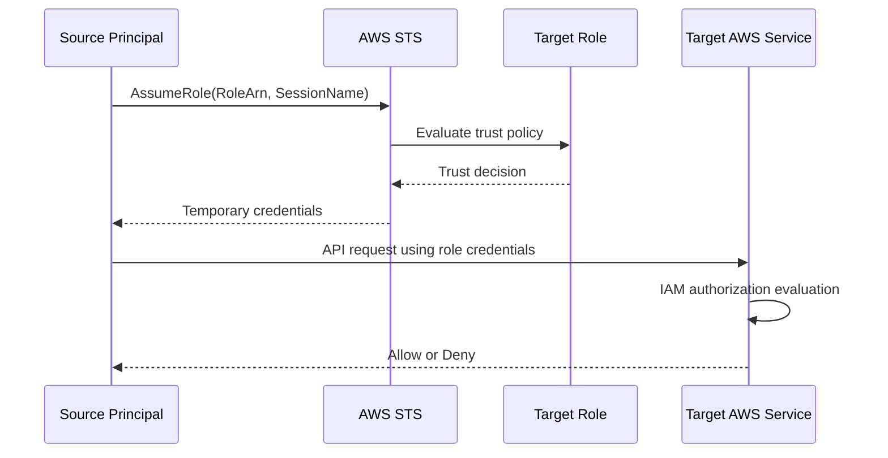
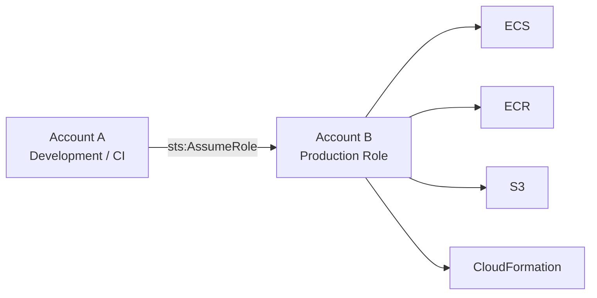
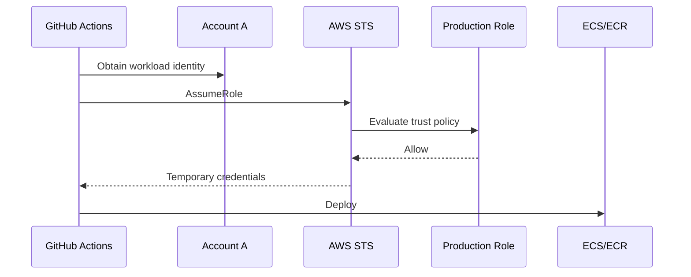
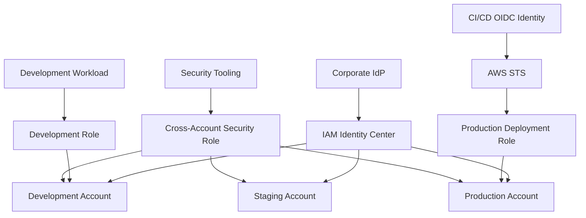
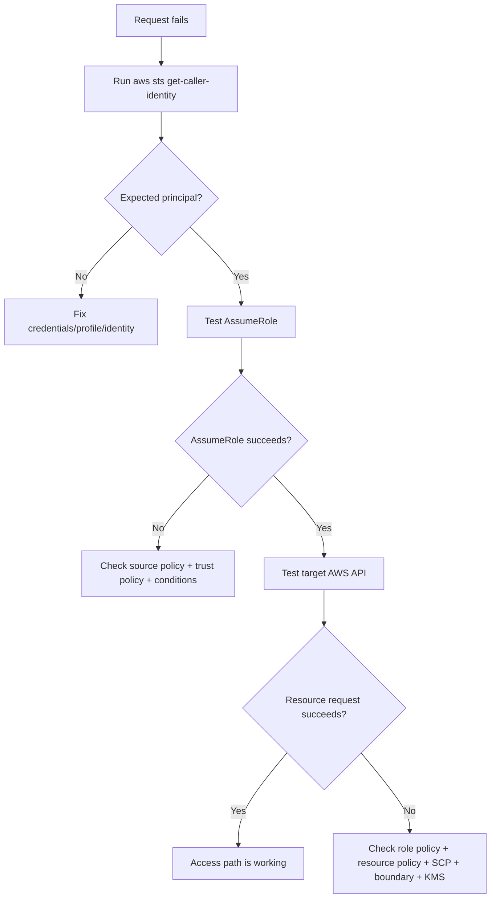

# 14- AssumeRole and Cross-Account Access

## Overview

`AssumeRole` is the primary AWS STS mechanism for obtaining temporary credentials for an IAM role. It is fundamental to modern AWS architectures because it enables identity delegation without distributing long-lived access keys.

Cross-account access commonly builds on this model:

```text
Principal in Account A
        |
        | sts:AssumeRole
        v
Role in Account B
        |
        | Temporary credentials
        v
Resources in Account B
```

The important distinction is:

```text
Trust Policy
    Who may assume the role?

Permission Policy
    What may the role do?
```

For cross-account role access, both sides of the relationship must be designed correctly:

```text
Source Account
    └── Principal is allowed to call sts:AssumeRole

Target Account
    └── Role trust policy allows that principal
```

After the role is assumed, the resulting temporary credentials are authorized according to the permissions available to the role session and all other applicable IAM controls. AWS documents cross-account role access as a mechanism where a role in one account delegates permissions to trusted principals in another account. ([AWS IAM cross-account resource access](https://docs.aws.amazon.com/IAM/latest/UserGuide/access_policies-cross-account-resource-access.html))

---

## Why AssumeRole Matters

Long-lived access keys create a credential-distribution problem:

```text
Developer / CI/CD / Service
        |
        | Long-lived access key
        v
Target Account
```

With `AssumeRole`:

```text
Developer / CI/CD / Service
        |
        | Identity
        v
AWS STS
        |
        | Temporary credentials
        v
Target Role
```

This provides:

- Temporary credentials
- Explicit trust relationships
- Centralized permission management
- Cross-account delegation
- Better auditability
- Reduced reliance on long-lived secrets
- Support for human, workload, and CI/CD identities

AWS recommends temporary credentials for workloads instead of embedding long-term IAM user access keys. ([AWS IAM best practices](https://docs.aws.amazon.com/IAM/latest/UserGuide/best-practices.html))

---

## What `AssumeRole` Does

`AssumeRole` requests a temporary role session from AWS STS.

Conceptually:

```text
Caller
  |
  | AssumeRole
  | RoleArn
  | SessionName
  | Optional: ExternalId
  | Optional: MFA
  | Optional: SessionPolicy
  v
AWS STS
  |
  | Evaluate trust relationship
  v
IAM Role
  |
  | Create temporary role session
  v
Temporary Credentials
```

A successful request returns:

```text
AccessKeyId
SecretAccessKey
SessionToken
Expiration
```

The caller then uses those credentials to make AWS API requests as the assumed role.

The `AssumeRole` API supports session durations from 15 minutes up to the role's configured maximum, which can be as high as 12 hours. The default maximum session duration is one hour. Role chaining limits CLI/API role sessions to one hour. ([AWS STS AssumeRole API](https://docs.aws.amazon.com/STS/latest/APIReference/API_AssumeRole.html))

---

## IAM Role Structure

An IAM role has two fundamentally different policy concepts.

### Trust Policy

The trust policy controls:

```text
WHO can assume this role?
```

Example:

```json
{
    "Version": "2012-10-17",
    "Statement": [
        {
            "Effect": "Allow",
            "Principal": {
                "AWS": "arn:aws:iam::111122223333:role/DeploymentRole"
            },
            "Action": "sts:AssumeRole"
        }
    ]
}
```

### Permission Policy

The permissions policy controls:

```text
WHAT can the role do after it is assumed?
```

Example:

```json
{
    "Version": "2012-10-17",
    "Statement": [
        {
            "Effect": "Allow",
            "Action": [
                "ecs:UpdateService",
                "ecs:DescribeServices"
            ],
            "Resource": "*"
        }
    ]
}
```

The distinction is critical:

| Policy | Answers |
|---|---|
| Trust policy | Who can assume the role? |
| Permission policy | What can the role do? |
| Session policy | What additional restriction applies to this session? |
| SCP | What is permitted at the organization/account boundary? |
| Resource policy | Which principals can access this resource? |

A common IAM failure is adding `s3:*` to the role's permission policy while forgetting that the caller cannot assume the role because the trust policy is incorrect.

---

## AssumeRole Request Lifecycle

A useful senior-level model is:



Notice that role assumption and resource access are separate authorization events.

```text
Event 1:
Can the principal assume the role?

Event 2:
Can the resulting role session access the resource?
```

This distinction is essential when troubleshooting production incidents.

---

## Cross-Account Terminology

AWS uses two useful terms:

| Term | Meaning |
|---|---|
| Trusted account | Account containing the principal that is granted access |
| Trusting account | Account containing the resource or role that grants access |

Example:

```text
Account A
    Application / CI Role
    Trusted Account
          |
          | AssumeRole
          v
Account B
    Production Role
    Trusting Account
```

The terms describe the trust relationship, not which account is more important operationally.

AWS uses the same trusted/trusting terminology in its cross-account policy evaluation documentation. ([AWS cross-account policy evaluation](https://docs.aws.amazon.com/IAM/latest/UserGuide/reference_policies_evaluation-logic-cross-account.html))

---

## Cross-Account Role Architecture

A common production architecture is:



Example:

```text
Account A
    GitHub Actions
        ↓
    DeploymentRole

        ↓ sts:AssumeRole

Account B
    ProductionDeploymentRole
        ↓
    ECS / ECR / CloudFormation
```

The source account does not receive permanent credentials belonging to Account B.

Instead, the source identity temporarily becomes the target role.

---

## Requirements for Cross-Account AssumeRole

For a standard cross-account role assumption, verify both sides.

### Source Side

The calling principal needs permission to call:

```text
sts:AssumeRole
```

against the target role.

Example:

```json
{
    "Version": "2012-10-17",
    "Statement": [
        {
            "Effect": "Allow",
            "Action": "sts:AssumeRole",
            "Resource": "arn:aws:iam::222233334444:role/ProductionDeployRole"
        }
    ]
}
```

### Target Side

The target role trust policy must allow the source principal.

```json
{
    "Version": "2012-10-17",
    "Statement": [
        {
            "Effect": "Allow",
            "Principal": {
                "AWS": "arn:aws:iam::111122223333:role/DeploymentRole"
            },
            "Action": "sts:AssumeRole"
        }
    ]
}
```

A simplified mental model is:

```text
Source permission
        AND
Target trust
        ↓
AssumeRole succeeds
```

For cross-account role access, AWS documents the need for the source principal to be authorized to make the role-assumption request and for the target role to trust that principal. ([AWS cross-account resource access](https://docs.aws.amazon.com/IAM/latest/UserGuide/access_policies-cross-account-resource-access.html))

---

## Trusting an Entire AWS Account

A role can trust an AWS account rather than an individual role.

Example:

```json
{
    "Version": "2012-10-17",
    "Statement": [
        {
            "Effect": "Allow",
            "Principal": {
                "AWS": "arn:aws:iam::111122223333:root"
            },
            "Action": "sts:AssumeRole"
        }
    ]
}
```

This does **not** mean that only the root user of Account A can assume the role.

An AWS account principal in a role trust policy can establish trust with principals from that account, subject to the account's own policies and delegation model.

This distinction is frequently misunderstood.

A better mental model is:

```text
Principal = Account A

meaning:

Account A is trusted to delegate access
according to its own IAM controls
```

For production access, trusting a specific workload role is generally easier to reason about than trusting an entire account when the broader trust is not required.

---

## Trusting a Specific Role

A more narrowly scoped trust policy can trust a specific source role:

```json
{
    "Version": "2012-10-17",
    "Statement": [
        {
            "Sid": "TrustDeploymentRole",
            "Effect": "Allow",
            "Principal": {
                "AWS": "arn:aws:iam::111122223333:role/DeploymentRole"
            },
            "Action": "sts:AssumeRole"
        }
    ]
}
```

This provides a clearer identity boundary:

```text
Account A
    ├── ApplicationRole
    ├── DeveloperRole
    └── DeploymentRole
                   |
                   +---- trusted by Account B
```

Only the intended role is part of the trust relationship.

---

## Trusting IAM Users

A role can trust an IAM user, although modern workforce architectures generally favor federated identities and IAM Identity Center over long-lived IAM users.

Example:

```json
{
    "Version": "2012-10-17",
    "Statement": [
        {
            "Effect": "Allow",
            "Principal": {
                "AWS": "arn:aws:iam::111122223333:user/alice"
            },
            "Action": "sts:AssumeRole"
        }
    ]
}
```

This can be useful in legacy environments, but it should not become the default architecture for a modern workforce.

Prefer:

```text
Identity Center / Federation
        ↓
Temporary identity
        ↓
Role
```

over:

```text
IAM User
        ↓
Long-lived access key
        ↓
AssumeRole
```

---

## Role Permission Policy Is Not the Trust Policy

Consider:

```text
ProductionDeployRole

Trust:
    Account A DeploymentRole may assume it.

Permissions:
    Can update ECS service.
    Can read ECR.
    Can read deployment artifacts.
```

These policies solve different problems.

Adding this:

```json
{
    "Effect": "Allow",
    "Action": "sts:AssumeRole",
    "Resource": "*"
}
```

to the role's permission policy does **not** make that role assumable by another principal.

`sts:AssumeRole` is an action performed by the caller against the target role.

The role itself needs a trust policy that allows the caller.

---

## Production Example: CI/CD Cross-Account Deployment

Suppose:

```text
Account A
    Shared Services
    GitHub Actions

Account B
    Production
```

The desired architecture is:



The production role could allow:

```text
ecr:GetAuthorizationToken
ecr:BatchGetImage
ecs:DescribeServices
ecs:UpdateService
ecs:DescribeTaskDefinition
```

but should not automatically receive:

```text
iam:*
s3:*
ec2:*
```

unless the deployment workflow actually requires them.

---

## CLI: Assume a Role

The basic CLI command is:

```bash
aws sts assume-role \
    --role-arn arn:aws:iam::222233334444:role/ProductionDeployRole \
    --role-session-name github-actions
```

The result contains temporary credentials.

For one-off testing, these credentials can be exported into a shell:

```bash
export AWS_ACCESS_KEY_ID="ASIA..."
export AWS_SECRET_ACCESS_KEY="..."
export AWS_SESSION_TOKEN="..."
```

Then verify:

```bash
aws sts get-caller-identity
```

The ARN should show the assumed role session, for example:

```text
arn:aws:sts::222233334444:assumed-role/ProductionDeployRole/github-actions
```

Do not place actual production credentials into shell history, source code, CI logs, or documentation.

---

## CLI Profiles for Role Assumption

For repeated operational use, configure a profile instead of manually copying STS credentials.

Example:

```ini
[profile production]
role_arn = arn:aws:iam::222233334444:role/ProductionOperatorRole
source_profile = engineering
region = ap-south-1
```

Then:

```bash
aws sts get-caller-identity \
    --profile production
```

The AWS CLI can obtain and refresh role credentials as needed for the configured profile.

This is preferable to manually executing `assume-role`, parsing its response, and exporting credentials for every command.

---

## Role Assumption From Python

Using Boto3, an application can explicitly assume a role:

```python
import boto3

sts = boto3.client("sts", region_name="ap-south-1")

response = sts.assume_role(
    RoleArn="arn:aws:iam::222233334444:role/ProductionReadRole",
    RoleSessionName="reporting-service",
)

credentials = response["Credentials"]

session = boto3.Session(
    aws_access_key_id=credentials["AccessKeyId"],
    aws_secret_access_key=credentials["SecretAccessKey"],
    aws_session_token=credentials["SessionToken"],
    region_name="ap-south-1",
)

s3 = session.client("s3")
```

This is useful when an application deliberately needs delegated access.

However, applications should not implement unnecessary custom credential-management logic. Where possible, use the AWS SDK's standard credential providers and role configuration.

---

## Better Pattern for Long-Running Applications

Avoid:

```python
while True:
    credentials = assume_role()
    use_credentials_for_some_time()
```

without a robust credential refresh strategy.

Prefer a supported credential provider that understands expiration and refresh.

The architectural objective is:

```text
Application
    ↓
Credential Provider
    ↓
Valid role credentials
    ↓
AWS API
```

rather than:

```text
Application
    ↓
Manually stored STS response
    ↓
Eventually expires
    ↓
Application failure
```

This becomes especially important for Django, FastAPI, Celery workers, and long-running Kubernetes workloads.

---

## `ExternalId` for Third-Party Access

`ExternalId` is primarily designed for delegated third-party access.

Example:

```text
Customer Account
    |
    | trusts
    v
Vendor Role
```

The vendor may assume the role with:

```text
RoleArn
+
ExternalId
```

The trust policy can require:

```json
{
    "Version": "2012-10-17",
    "Statement": [
        {
            "Effect": "Allow",
            "Principal": {
                "AWS": "arn:aws:iam::111122223333:role/VendorAccessRole"
            },
            "Action": "sts:AssumeRole",
            "Condition": {
                "StringEquals": {
                    "sts:ExternalId": "customer-7c91f8b2"
                }
            }
        }
    ]
}
```

The security purpose is to reduce confused-deputy risk when multiple customers use the same third-party service.

AWS documents `ExternalId` as a mechanism that can ensure a third party must include a customer-specific value when assuming a role. ([AWS STS AssumeRole API](https://docs.aws.amazon.com/STS/latest/APIReference/API_AssumeRole.html))

---

## `ExternalId` Is Not a Secret

A common mistake is treating:

```text
ExternalId
```

as equivalent to:

```text
Password
```

It is not a general-purpose secret.

The security model is:

```text
Vendor Identity
    +
Expected ExternalId
    ↓
Role Trust Condition
```

The external ID should be unique and difficult to guess in a multi-tenant third-party integration, but it should not be treated as a secret credential.

For third-party integrations, the customer-specific external ID helps ensure that one customer cannot trick a shared vendor principal into assuming another customer's role. ([AWS IAM third-party access](https://docs.aws.amazon.com/IAM/latest/UserGuide/id_roles_create_for-user.html))

---

## Trust Policy Conditions

Trust policies can restrict role assumption with conditions.

Common conditions include:

```text
sts:ExternalId
aws:PrincipalArn
aws:PrincipalOrgID
aws:SourceArn
aws:SourceAccount
aws:MultiFactorAuthPresent
```

Example:

```json
{
    "Version": "2012-10-17",
    "Statement": [
        {
            "Sid": "AllowProductionRoleFromOrg",
            "Effect": "Allow",
            "Principal": {
                "AWS": "arn:aws:iam::111122223333:root"
            },
            "Action": "sts:AssumeRole",
            "Condition": {
                "StringEquals": {
                    "aws:PrincipalOrgID": "o-exampleorgid"
                }
            }
        }
    ]
}
```

Conditions should narrow an already meaningful trust relationship. They should not be used as a replacement for understanding who the principal is.

---

## MFA-Protected AssumeRole

A trust policy can require MFA.

Example:

```json
{
    "Version": "2012-10-17",
    "Statement": [
        {
            "Sid": "RequireMFA",
            "Effect": "Allow",
            "Principal": {
                "AWS": "arn:aws:iam::111122223333:root"
            },
            "Action": "sts:AssumeRole",
            "Condition": {
                "Bool": {
                    "aws:MultiFactorAuthPresent": "true"
                }
            }
        }
    ]
}
```

The caller must provide MFA context when assuming the role.

This is useful for privileged human access.

For automated workloads, MFA is generally not an appropriate substitute for workload identity and narrowly scoped role trust.

---

## `ExternalId` vs MFA

These solve different problems.

| Mechanism | Primary purpose |
|---|---|
| `ExternalId` | Reduce confused-deputy risk in third-party access |
| MFA condition | Require stronger authentication context |
| `aws:PrincipalOrgID` | Restrict trust to an AWS Organization |
| `aws:PrincipalArn` | Restrict trust based on the principal's ARN |
| `aws:SourceArn` | Restrict service-originated requests to a resource |
| `aws:SourceAccount` | Limit requests to a specific AWS account |

Do not add an unrelated condition simply because a trust policy supports conditions.

---

## Role Session Name

A role session name identifies an individual STS session.

Example:

```bash
aws sts assume-role \
    --role-arn arn:aws:iam::222233334444:role/ProductionDeployRole \
    --role-session-name github-actions-5812
```

Useful session names can represent:

```text
Deployment ID
Workflow ID
Operator identity
Job ID
Service name
```

For example:

```text
github-actions-5812
```

is generally more useful for incident investigation than:

```text
session1
```

Avoid sensitive data in the session name because session identifiers can appear in audit information.

---

## Source Identity

STS can also propagate a `SourceIdentity` value across role chaining.

Conceptually:

```text
Human / CI
    |
    | SourceIdentity = release-5812
    v
Role A
    |
    v
Role B
    |
    v
Role C
```

This can improve attribution across multiple role-assumption hops.

For high-value production operations, source identity can supplement:

```text
Role session name
CloudTrail
Deployment ID
CI workflow ID
```

rather than relying on usernames alone.

---

## Role Chaining

Role chaining occurs when:

```text
Role A session
    ↓
AssumeRole
    ↓
Role B
```

Example:

```text
Developer
    ↓
EngineeringRole
    ↓
ProductionOperatorRole
```

Role chaining can be useful for strong separation of duties, but it introduces additional complexity.

The major operational limitation is:

```text
Role chaining
    ↓
Maximum CLI/API session duration
    = 1 hour
```

AWS documents this one-hour maximum for role chaining. ([AWS STS AssumeRole API](https://docs.aws.amazon.com/STS/latest/APIReference/API_AssumeRole.html))

Avoid long chains such as:

```text
Role A
  ↓
Role B
  ↓
Role C
  ↓
Role D
```

unless the architecture has a clear security or organizational reason.

---

## `aws:PrincipalArn` in Trust Policies

A trust policy can use `aws:PrincipalArn` as a condition for AWS principals.

Example pattern:

```json
{
    "Version": "2012-10-17",
    "Statement": [
        {
            "Effect": "Allow",
            "Principal": {
                "AWS": "arn:aws:iam::111122223333:root"
            },
            "Action": "sts:AssumeRole",
            "Condition": {
                "ArnEquals": {
                    "aws:PrincipalArn": "arn:aws:iam::111122223333:role/DeploymentRole"
                }
            }
        }
    ]
}
```

This pattern can be useful when the authorization design needs to rely on the principal ARN rather than directly specifying an individual role principal.

When using conditions such as `aws:PrincipalArn`, understand exactly which principal types and AWS services populate the key and how the condition interacts with the rest of the trust policy.

For production designs, validate the resulting authorization behavior rather than relying only on visual policy inspection.

---

## Cross-Account Access Through Resource Policies

Cross-account access does not always require `AssumeRole`.

Some AWS services support resource-based policies.

For example:

```text
Account B
    S3 Bucket
       ↑
       | Bucket Policy
       |
Account A
    Application
```

The target resource itself can grant access to a principal from another account.

AWS documents two broad cross-account patterns:

```text
Role-based delegation
        OR
Resource-based delegation
```

Use a role when the target service does not support the required resource policy or when centralized permission management through a role is more appropriate. ([AWS cross-account resource access](https://docs.aws.amazon.com/IAM/latest/UserGuide/access_policies-cross-account-resource-access.html))

---

## AssumeRole vs Resource-Based Policy

| Aspect | Cross-account role | Resource-based policy |
|---|---|---|
| Primary control | IAM role | Resource |
| Uses STS | Yes | Not necessarily |
| Temporary role credentials | Yes | Not inherently |
| Works across many services | Broadly | Service-dependent |
| Centralized application identity | Strong | Depends on resource |
| Good for multi-service workloads | Yes | Usually service-specific |
| Requires role trust policy | Yes | No |
| Common examples | ECS, CI/CD, admin access | S3, SQS, SNS |

Neither mechanism is universally superior.

The important engineering decision is whether the access pattern is:

```text
Identity assumes a delegated identity
```

or:

```text
Resource directly delegates access
```

---

## Cross-Account Resource Policy Evaluation

For many cross-account resource-policy scenarios, authorization depends on permissions on both sides.

Conceptually:

```text
Source Account
    Identity Policy
        +
Target Account
    Resource Policy
        ↓
Cross-account request
```

AWS documents that for cross-account access using resource-based policies, the source principal generally needs an identity-based permission and the target resource policy must allow the request. ([AWS identity-based vs resource-based policies](https://docs.aws.amazon.com/IAM/latest/UserGuide/access_policies_identity-vs-resource.html))

The exact behavior depends on the principal type and service.

Do not assume that every resource policy follows identical evaluation semantics.

---

## Cross-Account S3 Example

Suppose:

```text
Account A
    ReportingApplicationRole

Account B
    company-reporting-prod
```

Account B could use an S3 bucket policy to grant access to the principal from Account A.

Example:

```json
{
    "Version": "2012-10-17",
    "Statement": [
        {
            "Sid": "AllowReportingRole",
            "Effect": "Allow",
            "Principal": {
                "AWS": "arn:aws:iam::111122223333:role/ReportingApplicationRole"
            },
            "Action": [
                "s3:GetObject"
            ],
            "Resource": "arn:aws:s3:::company-reporting-prod/reports/*"
        }
    ]
}
```

The role in Account A still needs appropriate identity-based permissions for the cross-account request.

For object access, also ensure that:

```text
Bucket policy
IAM policy
Object ownership / encryption
KMS policy when applicable
```

are all consistent.

---

## Cross-Account KMS Considerations

S3 or another AWS service may depend on KMS.

A common architecture is:

```text
Account A
    Role
      ↓
    S3 API
      ↓
Account B
    Encrypted S3 Object
      ↓
    KMS Key
```

Even when S3 access is allowed, the role may still fail because KMS authorization is missing.

When investigating cross-account encrypted resource access, check:

```text
Identity policy
Resource policy
KMS key policy
KMS grants where applicable
SCP / organization controls
Encryption context conditions
```

This is a common production source of misleading `AccessDenied` errors.

---

## Cross-Account Secrets Manager

A service may also use Secrets Manager in another account.

Example:

```text
Application Account
    FastAPI
       ↓
    ApplicationRole
       ↓
    secretsmanager:GetSecretValue
       ↓
Security Account
    Secret
```

The design should separately validate:

```text
Can the role authenticate?
Can it access Secrets Manager?
Can the secret resource policy allow the principal?
Can KMS decrypt the secret if a customer-managed key is involved?
```

Cross-account authorization frequently consists of multiple policy layers rather than a single IAM policy.

---

## Multi-Account AWS Architecture

A production AWS environment may separate accounts by workload or environment:

```text
AWS Organization
│
├── Security Account
│
├── Log Archive Account
│
├── Shared Services Account
│
├── Development Account
│
├── Staging Account
│
└── Production Account
```

Application identities should generally remain local to the workload account where possible.

Cross-account access is then explicit:

```text
CI/CD
   ↓
Production Deployment Role

Security tooling
   ↓
Security Audit Role

Central logging
   ↓
Read / write roles
```

This provides stronger isolation than placing every workload in one AWS account.

---

## Centralized Identity Pattern

A common workforce architecture is:

```text
Corporate Identity Provider
            ↓
     IAM Identity Center
            ↓
      AWS Organizations
            ↓
    Account / Permission Sets
            ↓
Temporary AWS Sessions
```

Human users typically do not need IAM users in every AWS account.

Workloads can use separate IAM roles:

```text
Human Identity
    ↓
Identity Center

Workload Identity
    ↓
IAM Role
```

This separates workforce access from machine-to-machine access.

---

## Production Cross-Account Architecture

A mature multi-account environment may look like:



The architecture separates:

```text
Human access
Workload access
CI/CD access
Security automation
```

Each receives only the role permissions required for its function.

---

## Least-Privilege Role Design

A cross-account role should be designed around a specific workload.

Weak:

```text
ProductionAccessRole
    Action: "*"
    Resource: "*"
```

Better:

```text
ProductionDeploymentRole

Actions:
    ecs:UpdateService
    ecs:DescribeService
    ecr:GetAuthorizationToken
    ecr:BatchGetImage

Resources:
    Specific ECS services
    Required ECR repositories
```

The same principle applies to operator roles:

```text
ProductionReadOnlyRole
ProductionDeploymentRole
ProductionIncidentRole
SecurityAuditRole
```

Separate roles make authorization intent easier to understand and audit.

---

## Permission Boundaries and Cross-Account Roles

A permissions boundary can restrict the maximum permissions available to a role.

Conceptually:

```text
Role Identity Policy
        ∩
Permissions Boundary
        ↓
Effective Permissions
```

A cross-account role therefore cannot simply grant itself permissions beyond its boundary.

The same session may also be constrained by:

```text
Session policy
SCP
Resource policy
Explicit denies
```

When designing delegated access, consider the complete authorization path instead of evaluating only the role's attached permission policy.

---

## Service Control Policies

An AWS Organizations Service Control Policy can restrict what an assumed role can do in an account.

For example:

```text
Role Policy
    Allows s3:DeleteObject

SCP
    Denies s3:DeleteObject

Result
    Denied
```

Therefore:

```text
Successful AssumeRole
```

does not imply:

```text
Full permissions of the role policy
```

A cross-account deployment failure can therefore involve an SCP in the target account even when the trust relationship and role permissions are correct.

---

## Conditions and Context

Production trust policies frequently use conditions to reduce the trusted surface.

Example:

```json
{
    "Version": "2012-10-17",
    "Statement": [
        {
            "Sid": "AllowSpecificPrincipal",
            "Effect": "Allow",
            "Principal": {
                "AWS": "arn:aws:iam::111122223333:root"
            },
            "Action": "sts:AssumeRole",
            "Condition": {
                "ArnEquals": {
                    "aws:PrincipalArn": "arn:aws:iam::111122223333:role/DeploymentRole"
                },
                "StringEquals": {
                    "aws:PrincipalOrgID": "o-exampleorgid"
                }
            }
        }
    ]
}
```

Useful conditions depend on the identity and trust architecture.

Do not blindly combine conditions.

A policy becomes difficult to operate when nobody can explain:

```text
Which exact request context satisfies this trust?
```

---

## Common Cross-Account Failure Modes

| Symptom | Likely area |
|---|---|
| `AccessDenied` on `AssumeRole` | Source permission or target trust |
| `not authorized to perform sts:AssumeRole` | Caller lacks `sts:AssumeRole` or another policy constraint |
| `ExternalId` mismatch | Trust condition |
| MFA-related denial | Trust policy condition |
| AssumeRole succeeds but S3 fails | Role/resource permissions |
| AssumeRole succeeds but KMS fails | KMS authorization |
| Works in CLI but not application | Credential/provider configuration |
| Works in one account but not another | Account-specific policies, SCPs, trust |
| Works for one role but not another | Principal or trust mismatch |
| 12-hour role session fails | Role maximum session duration |
| Chained role fails for long duration | One-hour role-chaining limit |
| CI/CD fails after migration to OIDC | OIDC provider or trust conditions |

---

## Systematic Troubleshooting

When cross-account access fails, work through the path in order.

### Verify the Current Principal

```bash
aws sts get-caller-identity
```

Confirm:

```text
Account
ARN
Expected role
Expected profile
```

### Inspect the Target Role

```bash
aws iam get-role \
    --role-name ProductionDeployRole
```

Review:

```text
AssumeRolePolicyDocument
MaxSessionDuration
```

### Test Role Assumption

```bash
aws sts assume-role \
    --role-arn arn:aws:iam::222233334444:role/ProductionDeployRole \
    --role-session-name diagnostic
```

### Verify the Assumed Identity

After using the temporary credentials:

```bash
aws sts get-caller-identity
```

Expected:

```text
arn:aws:sts::222233334444:assumed-role/ProductionDeployRole/diagnostic
```

### Test the Actual Resource

For example:

```bash
aws s3api head-object \
    --bucket company-reports-prod \
    --key reports/daily.json
```

This separates:

```text
Role assumption problem
```

from:

```text
Resource authorization problem
```

---

## Cross-Account Debugging Flow



This is more reliable than repeatedly broadening IAM policies.

---

## Cross-Account Access With AWS CLI Profiles

A clean developer workflow may use:

```ini
[profile engineering]
sso_session = company
sso_account_id = 111122223333
sso_role_name = Developer
region = ap-south-1

[profile production]
source_profile = engineering
role_arn = arn:aws:iam::222233334444:role/ProductionOperatorRole
region = ap-south-1
```

Then:

```bash
aws sts get-caller-identity --profile engineering
```

and:

```bash
aws sts get-caller-identity --profile production
```

The first verifies the workforce identity.

The second verifies the assumed production role.

This makes account transitions explicit and reduces accidental operations against the wrong account.

---

## Cross-Account Access for Microservices

Consider a payments platform:

```text
Account A
    Orders Service
        |
        | AssumeRole
        v
Account B
    Payments Service Resources
```

A safer architecture is usually not:

```text
OrdersServiceRole
    Allow *
```

Instead:

```text
OrdersServiceRole
    ↓
AssumeRole
    ↓
PaymentsReadRole
    ↓
Required Secrets / SQS / S3
```

The target role should represent exactly the delegated capability.

For example:

```text
Orders → Payments

Allowed:
    sqs:SendMessage
    secretsmanager:GetSecretValue

Denied:
    iam:*
    ec2:*
    s3:DeleteObject
```

This creates an explicit service boundary.

---

## Cross-Account Access for ECS

A common architecture:

```text
ECS Task in Account A
        ↓
Task Role
        ↓
sts:AssumeRole
        ↓
Account B Role
        ↓
S3 / SQS / Secrets Manager
```

Do not confuse:

```text
ECS execution role
```

with:

```text
ECS task role
```

The application normally receives AWS permissions through the **task role**.

The execution role is used by ECS for tasks such as image retrieval and log delivery.

Cross-account application authorization should generally be attached to the workload's application identity, not mixed into infrastructure bootstrap permissions.

---

## Cross-Account Access for Lambda

A Lambda function can use its execution role to assume another role.

```text
Lambda
    ↓
Execution Role
    ↓
sts:AssumeRole
    ↓
Cross-Account Role
    ↓
Target Resource
```

The Lambda execution role therefore needs:

```text
sts:AssumeRole
```

and the target role must trust the Lambda execution role.

For simple resource-policy-compatible integrations, a direct resource policy may be simpler than introducing a second role.

---

## Cross-Account Access for EKS

A Kubernetes workload can obtain AWS credentials through its workload identity mechanism and then assume another role.

```text
Pod
  ↓
Workload Identity
  ↓
Application Role
  ↓
sts:AssumeRole
  ↓
Target Account Role
  ↓
AWS Service
```

Use this pattern only when the target resource actually belongs in a separate authorization boundary.

Avoid making every microservice assume multiple roles merely because the architecture is multi-account.

---

## CI/CD Security Pattern

A strong deployment flow is:

```text
CI/CD OIDC
    ↓
Short-lived identity
    ↓
Production deployment role
    ↓
Temporary credentials
    ↓
ECR / ECS / CloudFormation
```

Avoid:

```text
CI/CD secret
    ↓
Permanent AWS access key
    ↓
Production account
```

The production role trust policy should constrain the OIDC provider claims to the intended repository, branch/environment, or other appropriate workload identity attributes.

---

## Common Mistakes

### Mistaking Trust for Permissions

Incorrect:

```text
The role can access S3,
therefore my user can assume it.
```

Correct:

```text
The role's trust policy must allow the caller,
and the caller must be authorized to assume it
when required by the cross-account model.
```

### Adding `sts:AssumeRole` to the Wrong Policy

The `sts:AssumeRole` permission belongs to the caller's authorization path.

The target role's trust policy authorizes who may assume the role.

### Trusting an Entire Account Unnecessarily

This:

```json
"Principal": {
    "AWS": "arn:aws:iam::111122223333:root"
}
```

can create a broad trust boundary.

Prefer a narrower principal or appropriate condition when the architecture allows it.

### Giving the Target Role Administrator Access

Cross-account access should not become a path to account-wide administration unless that is an intentional, controlled administrative role.

### Forgetting the Session Token

Temporary credentials require:

```text
AccessKeyId
SecretAccessKey
SessionToken
```

not just the first two values.

### Ignoring Role Chaining

Multiple `AssumeRole` hops can unexpectedly cap the session at one hour. ([AWS STS AssumeRole API](https://docs.aws.amazon.com/STS/latest/APIReference/API_AssumeRole.html))

### Using `ExternalId` as a Password

External IDs help identify the intended customer context for a third-party integration. They are not a replacement for proper principal authentication and least privilege.

### Debugging Only the Target Policy

Cross-account authorization involves multiple accounts and policy layers.

Check the complete path.

### Using Wildcard Resource Permissions

Avoid:

```json
"Action": "*",
"Resource": "*"
```

unless the role is explicitly an administrative or emergency role with corresponding governance.

---

## Security Considerations

Cross-account access creates a deliberate trust boundary.

Treat these as security-critical:

```text
Trust Policy
Principal Selection
ExternalId
Session Conditions
Role Permissions
Session Duration
SCPs
Permissions Boundaries
Resource Policies
KMS Policies
CloudTrail Visibility
```

A role can be technically correct and still represent excessive privilege.

Ask both:

```text
Who can assume this role?
```

and:

```text
What becomes possible after assuming it?
```

---

## Audit and Monitoring

CloudTrail records role-assumption activity and subsequent API activity.

Operationally, correlate:

```text
AssumeRole event
    ↓
Role session
    ↓
AWS API calls
    ↓
Deployment / operator / workload identity
```

Useful audit attributes include:

```text
Account
Role ARN
Session name
Source identity where used
Source account
Event source
API action
Resource
Timestamp
```

This is especially important for production deployment roles and incident-response roles.

---

## Scalability Considerations

At small scale:

```text
Account A
    ↓
ProductionRole
    ↓
Account B
```

may be enough.

At larger scale, avoid creating an uncontrolled role graph:

```text
A → B
A → C
A → D
B → C
B → D
C → D
...
```

Instead, establish clear trust domains:

```text
Identity / CI
       ↓
Account Roles
       ↓
Service-specific permissions
```

Good cross-account architecture minimizes both:

```text
Role count
+
Trust graph complexity
```

while retaining meaningful isolation.

---

## Reliability Considerations

Role assumption introduces an identity dependency:

```text
Application
    ↓
Credential Provider
    ↓
STS
    ↓
Temporary Role Session
    ↓
AWS API
```

For long-running services:

- Use supported SDK credential providers.
- Avoid manually caching expired credentials.
- Prefer Regional STS endpoints for production workloads where appropriate.
- Test role refresh behavior.
- Test failure behavior when credentials cannot be refreshed.
- Include IAM/STS in disaster-recovery testing.

A service that can recover its compute infrastructure but cannot obtain its required role credentials is not fully recoverable.

---

## Performance Considerations

Calling `AssumeRole` for every application request is an anti-pattern.

Bad:

```text
HTTP Request
    ↓
AssumeRole
    ↓
S3
    ↓
HTTP Response
```

for every request.

Better:

```text
Application
    ↓
Credential Provider
    ↓
Cached temporary role session
    ↓
S3 / SQS / Secrets Manager
```

Credential acquisition should happen according to the SDK/provider lifecycle, not per business operation.

For high-throughput services, reducing unnecessary STS calls also avoids creating an unnecessary dependency and potential throttling pressure.

---

## Architecture Decision Guide

| Requirement | Common pattern |
|---|---|
| Application needs AWS service access in its own account | IAM workload role |
| Application needs access to another account | `AssumeRole` |
| CI/CD deploys across accounts | OIDC + deployment role |
| Third-party SaaS needs customer access | Cross-account role + `ExternalId` |
| Human needs temporary privileged access | Workforce identity + role |
| Directly share S3/SQS/SNS resource | Resource-based policy when supported |
| Multi-account organization-wide access | Central identity + account-specific roles |
| Service needs a very specific delegated capability | Dedicated target role |
| Private workload requires STS without internet | Regional STS + VPC endpoint |

---

## Senior-Level Authorization Model

For a cross-account role request, reason through the layers in this order:

```text
1. Who is the caller?

2. Which AWS account owns the caller?

3. Which role is being targeted?

4. Does the target trust the caller?

5. Is the caller allowed to call sts:AssumeRole?

6. Are ExternalId, MFA, OIDC, organization, or other
   trust conditions satisfied?

7. Does AssumeRole succeed?

8. Which role session was created?

9. What permissions does the role provide?

10. Is the role constrained by a permissions boundary?

11. Is the session constrained by a session policy?

12. Is an SCP/RCP restricting the request?

13. Does the target resource have a resource policy?

14. Are service-specific controls such as KMS involved?

15. Is there an explicit deny anywhere?
```

This model prevents the common mistake of treating IAM authorization as a single JSON document.

---

## Interview Traps

### `AssumeRole` Does Not Copy Permissions From the Caller

The caller does not transfer its permissions to the target role.

```text
Caller permissions
    ≠
Role permissions
```

The resulting credentials represent the role session.

### Trust Policy and Permission Policy Are Different

```text
Trust policy
    Who can assume?

Permission policy
    What can the role do?
```

### `AssumeRole` Success Does Not Guarantee Resource Access

A role may be successfully assumed while its access to S3, SQS, KMS, or another service is denied.

### Cross-Account Access Has Two Sides

Always identify:

```text
Source account
Target account
```

Then inspect both sides.

### Account Trust Is Not the Same as Root-User-Only Trust

A trust policy that specifies an AWS account principal can permit delegation from that account, not merely access by the account's root user.

### Resource Policies Can Sometimes Replace AssumeRole

Some services support direct cross-account resource policies.

Do not introduce a role assumption hop unless the architecture benefits from it.

### Role Chaining Has a One-Hour Limit

A frequent senior-level interview and production trap. ([AWS STS AssumeRole API](https://docs.aws.amazon.com/STS/latest/APIReference/API_AssumeRole.html))

---

## Production Checklist

Before approving a cross-account role, verify:

```text
Trust
    □ Exact intended principal is trusted
    □ Trust conditions are justified
    □ ExternalId used for appropriate third-party access
    □ Organization constraints used where appropriate
    □ MFA enforced for privileged human access where required

Permissions
    □ Role permissions follow least privilege
    □ Resource ARNs are appropriately scoped
    □ Sensitive actions are minimized
    □ Permissions boundary considered where appropriate

Session
    □ Session duration is appropriate
    □ Role chaining is understood
    □ Session names are operationally useful
    □ Source identity used where beneficial
    □ Session policies understood

Organization
    □ SCP/RCP restrictions reviewed
    □ Cross-account boundaries are documented
    □ Account ownership is clear

Operations
    □ CloudTrail visibility exists
    □ Role assumptions are auditable
    □ Credential refresh is handled by supported providers
    □ Failure and recovery paths are tested

Application
    □ No long-lived access keys are embedded
    □ STS is not called per request
    □ SDK credential providers are used
    □ KMS/resource-policy dependencies are tested
```

## AWS Documentation Links

- [AWS IAM — Cross-account resource access](https://docs.aws.amazon.com/IAM/latest/UserGuide/access_policies-cross-account-resource-access.html)
- [AWS IAM — Cross-account policy evaluation logic](https://docs.aws.amazon.com/IAM/latest/UserGuide/reference_policies_evaluation-logic-cross-account.html)
- [AWS IAM — Identity-based vs resource-based policies](https://docs.aws.amazon.com/IAM/latest/UserGuide/access_policies_identity-vs-resource.html)
- [AWS STS — AssumeRole API](https://docs.aws.amazon.com/STS/latest/APIReference/API_AssumeRole.html)
- [AWS IAM — Creating roles for users and third-party access](https://docs.aws.amazon.com/IAM/latest/UserGuide/id_roles_create_for-user.html)

## Key Takeaways

- **`AssumeRole` creates a temporary role session; the trust policy determines who may assume the role, while the permission policy determines what the role can do.**
- **Cross-account role access requires a correctly designed trust relationship and an authorization path for the source principal to call `sts:AssumeRole`.**
- **Successful role assumption and successful resource access are separate events; always troubleshoot the role-assumption path and the target-resource authorization path independently.**
- **Use dedicated, least-privilege roles, narrow trust conditions, temporary credentials, and auditable session identity instead of sharing long-lived cross-account access keys.**
- **For senior-level IAM design, reason through the complete authorization chain: principal → trust → STS session → role permissions → boundaries/session policies → organization controls → resource policies → service-specific authorization.**