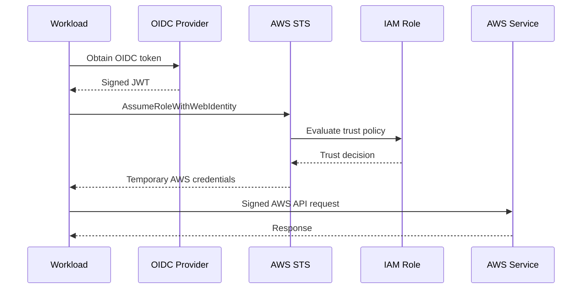
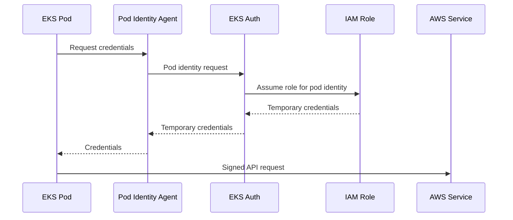
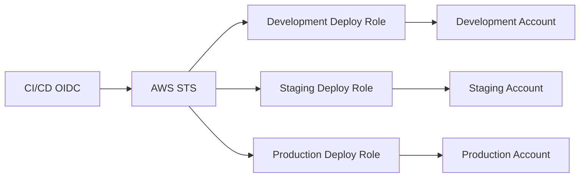
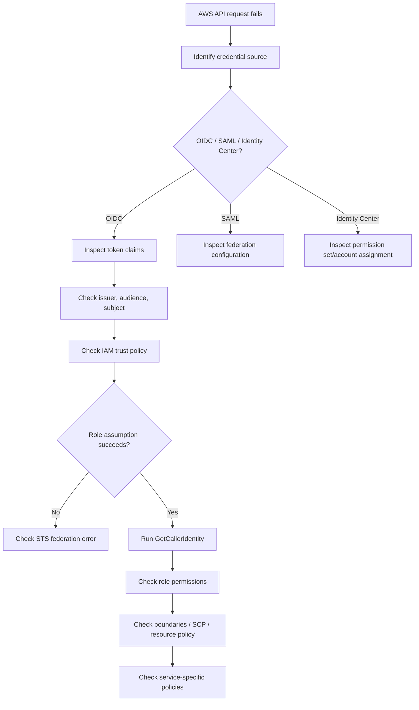

# 15- Web Identity and Federation

## Overview

AWS identity federation allows identities managed outside traditional IAM users to obtain access to AWS resources without creating a permanent IAM user access key for every person or workload.

The core model is:

```text
External Identity
        ↓
Federation Token / Assertion
        ↓
AWS STS
        ↓
Temporary AWS Credentials
        ↓
IAM Authorization
        ↓
AWS Resources
```

The most important federation mechanisms in modern AWS architectures are:

| Mechanism | Typical identity | AWS integration |
|---|---|---|
| OIDC web identity federation | Workloads, CI/CD, application users | `AssumeRoleWithWebIdentity` |
| SAML 2.0 federation | Workforce / enterprise users | `AssumeRoleWithSAML` |
| IAM Identity Center | Workforce users across AWS accounts | Short-term AWS credentials |
| EKS Pod Identity | Kubernetes workloads on EKS | EKS-native workload identity |
| IRSA | Kubernetes workloads | OIDC + `AssumeRoleWithWebIdentity` |
| Cognito Identity Pools | Application users | Federated identities + temporary AWS credentials |

AWS currently recommends IAM Identity Center for centralized workforce access and EKS Pod Identity for new supported EKS workloads. IRSA remains an important OIDC-based pattern, particularly for existing deployments and environments where EKS Pod Identity is not supported. ([AWS identity providers and federation](https://docs.aws.amazon.com/IAM/latest/UserGuide/id_roles_providers.html), [AWS EKS identity best practices](https://docs.aws.amazon.com/eks/latest/best-practices/identity-and-access-management.html))

The senior-level objective is to understand that federation separates:

```text
Authentication
    Who are you?

from

AWS Authorization
    What AWS role or permissions should you receive?
```

---

## What Federation Solves

Traditional IAM-user access looks like:

```text
Employee
    ↓
IAM User
    ↓
Long-lived Access Key
    ↓
AWS
```

Federation changes this to:

```text
Corporate Identity Provider
    ↓
Authenticated Identity
    ↓
Federation Assertion / Token
    ↓
AWS
    ↓
Temporary AWS Session
```

For workloads:

```text
CI/CD / Kubernetes / External Workload
    ↓
OIDC Identity
    ↓
AWS STS
    ↓
Temporary Role Credentials
```

The major benefits are:

- No permanent AWS credentials for every identity
- Centralized authentication
- Short-lived AWS sessions
- Existing enterprise identity integration
- Fine-grained workload identity
- Cross-account access
- Better credential lifecycle management
- Reduced credential exposure

Federation does not eliminate IAM authorization. It supplies the identity context from which AWS can establish a temporary session.

---

## Authentication vs Authorization

Federation becomes easier to understand when authentication and authorization are separated.

### Authentication

```text
Who is this identity?
```

Examples:

```text
Corporate IdP
Google
Microsoft Entra ID
GitHub OIDC
Kubernetes service account
Amazon Cognito
```

### Authorization

```text
What can this identity do in AWS?
```

Examples:

```text
Read S3
Publish SQS
Deploy ECS
Read Secrets Manager
Assume a production role
```

A typical federation flow is:

```text
External Authentication
        ↓
Identity / Token
        ↓
AWS STS
        ↓
IAM Role
        ↓
IAM Authorization
```

The external identity authenticates the subject. IAM determines what AWS access that subject receives.

---

## Web Identity Federation

Web identity federation allows an application or workload to present an OIDC token to AWS STS and receive temporary credentials.

The core STS API is:

```text
AssumeRoleWithWebIdentity
```

The high-level flow is:



The resulting credentials are temporary:

```text
Access Key ID
Secret Access Key
Session Token
Expiration
```

AWS documents OIDC federation as a mechanism where an OIDC JSON Web Token can be exchanged through STS for temporary IAM role credentials. ([AWS IAM OIDC federation](https://docs.aws.amazon.com/IAM/latest/UserGuide/id_roles_providers_oidc.html))

---

## OIDC

OpenID Connect (OIDC) is an identity layer built on OAuth 2.0.

For AWS federation, the important pieces are:

```text
OIDC Provider
    ↓
Signed JWT
    ↓
Claims
    ↓
AWS IAM Trust Policy
```

A JWT commonly contains claims such as:

```json
{
    "iss": "https://issuer.example.com",
    "sub": "repo:company/backend-api:environment:production",
    "aud": "sts.amazonaws.com",
    "exp": 1790000000
}
```

The exact claims depend on the identity provider.

AWS IAM uses these claims to evaluate whether the token represents a trusted identity for a role.

---

## OIDC Token Structure

An OIDC JWT has three conceptual parts:

```text
Header.Payload.Signature
```

For example:

```text
eyJhbGciOiJSUzI1NiJ9
.
eyJpc3MiOiJodHRwczovL2lkcC5leGFtcGxlLmNvbSJ9
.
signature
```

The payload contains claims such as:

| Claim | Purpose |
|---|---|
| `iss` | Token issuer |
| `sub` | Subject / identity |
| `aud` | Intended audience |
| `exp` | Expiration |
| `iat` | Issuance time |
| Provider-specific claims | Repository, group, tenant, namespace, etc. |

For AWS federation, trust policies should validate the claims that actually identify the intended workload.

A token being correctly signed is not enough.

The trust policy must also ensure:

```text
Correct issuer
+
Correct audience
+
Correct subject / workload
```

where appropriate.

---

## OIDC Provider Registration in IAM

For direct OIDC federation with IAM, AWS needs an IAM OIDC identity provider associated with the AWS account.

The conceptual relationship is:

```text
External OIDC Provider
        ↓
IAM OIDC Provider
        ↓
IAM Role Trust Policy
        ↓
AssumeRoleWithWebIdentity
```

The IAM role trust policy references the provider as a federated principal.

Example:

```json
{
    "Version": "2012-10-17",
    "Statement": [
        {
            "Sid": "AllowOIDCWorkload",
            "Effect": "Allow",
            "Principal": {
                "Federated": "arn:aws:iam::123456789012:oidc-provider/issuer.example.com"
            },
            "Action": "sts:AssumeRoleWithWebIdentity"
        }
    ]
}
```

In production, this trust is normally incomplete without conditions restricting token claims.

---

## OIDC Trust Policy Conditions

A safer trust policy restricts the claims accepted from the provider.

Example:

```json
{
    "Version": "2012-10-17",
    "Statement": [
        {
            "Sid": "AllowProductionWorkflow",
            "Effect": "Allow",
            "Principal": {
                "Federated": "arn:aws:iam::123456789012:oidc-provider/token.actions.githubusercontent.com"
            },
            "Action": "sts:AssumeRoleWithWebIdentity",
            "Condition": {
                "StringEquals": {
                    "token.actions.githubusercontent.com:aud": "sts.amazonaws.com"
                },
                "StringLike": {
                    "token.actions.githubusercontent.com:sub": "repo:company/backend-api:environment:production"
                }
            }
        }
    ]
}
```

The key principle is:

```text
Do not trust the whole OIDC provider blindly.

Trust:
    Provider
    +
    Expected audience
    +
    Expected subject/workload
```

The precise claim keys are provider-specific.

---

## `AssumeRoleWithWebIdentity`

The STS operation is:

```text
AssumeRoleWithWebIdentity
```

Conceptually:

```text
OIDC JWT
    ↓
AssumeRoleWithWebIdentity
    ↓
IAM Role Trust Policy
    ↓
Temporary Role Session
    ↓
AWS API
```

A CLI example can look like:

```bash
aws sts assume-role-with-web-identity \
    --role-arn arn:aws:iam::123456789012:role/DeploymentRole \
    --role-session-name github-actions \
    --web-identity-token "$OIDC_TOKEN"
```

The exact token acquisition process depends on the identity provider.

The application should not manually implement JWT validation when AWS is the intended relying party. AWS validates the token against the configured OIDC provider and applies the IAM trust policy.

---

## Web Identity Session Duration

For `AssumeRoleWithWebIdentity`, AWS documents a duration from 15 minutes up to the IAM role's configured maximum session duration, with a role maximum of up to 12 hours. The default maximum session duration for a role is one hour. ([AWS STS AssumeRoleWithWebIdentity API](https://docs.aws.amazon.com/STS/latest/APIReference/API_AssumeRoleWithWebIdentity.html))

The token itself may have a shorter lifetime than the resulting AWS role session.

This produces two independent expiration concepts:

```text
OIDC token expiration
        +
AWS session credential expiration
```

Do not assume that extending the role's maximum session duration extends the source identity token.

---

## SAML Federation

SAML 2.0 federation is commonly used for enterprise workforce access.

The architecture is:

```text
Enterprise Identity Provider
        ↓
SAML Assertion
        ↓
AWS STS
        ↓
AssumeRoleWithSAML
        ↓
IAM Role
        ↓
Temporary AWS Credentials
```

Typical identity providers include enterprise directory systems and federated identity platforms.

The SAML assertion can communicate:

```text
User identity
Role mappings
Session attributes
```

AWS STS validates the SAML assertion and creates a temporary session associated with the selected IAM role.

AWS supports SAML federation directly with IAM and through IAM Identity Center for centralized workforce access. ([AWS identity providers and federation](https://docs.aws.amazon.com/IAM/latest/UserGuide/id_roles_providers.html))

---

## SAML vs OIDC

| Feature | SAML 2.0 | OIDC |
|---|---|---|
| Typical use | Enterprise workforce | Workloads, modern applications, CI/CD |
| Token format | XML assertion | JWT |
| AWS STS API | `AssumeRoleWithSAML` | `AssumeRoleWithWebIdentity` |
| Human SSO | Common | Possible |
| CI/CD | Less common | Common |
| Kubernetes | Less common | Common |
| GitHub Actions | No standard SAML workflow | OIDC |
| Claims | XML attributes | JWT claims |

SAML remains important in enterprise identity architectures, while OIDC is particularly relevant for workload and CI/CD federation.

---

## IAM Identity Center

IAM Identity Center provides centralized workforce access to AWS accounts and applications.

A typical architecture is:

```text
Corporate IdP
      ↓
IAM Identity Center
      ↓
Permission Sets
      ↓
AWS Accounts
      ↓
Short-Term AWS Sessions
```

AWS recommends IAM Identity Center for centralized workforce access across AWS accounts. ([AWS identity providers and federation](https://docs.aws.amazon.com/IAM/latest/UserGuide/id_roles_providers.html))

This is different from an application workload using `AssumeRoleWithWebIdentity`.

### Workforce Federation

```text
Human
   ↓
Corporate IdP
   ↓
IAM Identity Center
   ↓
AWS Account
```

### Workload Federation

```text
CI/CD / Pod / Application
   ↓
OIDC
   ↓
STS
   ↓
IAM Role
```

Both avoid long-lived IAM user access keys, but they serve different identity domains.

---

## Federation Through IAM Identity Center

IAM Identity Center can use identity sources such as:

- IAM Identity Center directory
- External identity providers
- Active Directory integrations

For external identity providers, SAML 2.0 can be used for workforce federation into the AWS access portal.

A simplified model is:

```text
Microsoft Entra ID / Okta / Other IdP
             ↓
          SAML 2.0
             ↓
    IAM Identity Center
             ↓
       Permission Set
             ↓
        AWS Account
```

The permission set defines the AWS permissions associated with the user's account access.

---

## Permission Sets

Permission sets represent a reusable workforce access definition.

Example:

```text
Developer
ReadOnly
Operations
SecurityAudit
Administrator
```

Conceptually:

```text
User / Group
    ↓
Permission Set
    ↓
AWS Account
    ↓
AWS Permissions
```

This is more scalable than maintaining individual IAM users and policies separately in every AWS account.

---

## IAM Federation vs IAM Identity Center

| Requirement | Direct IAM federation | IAM Identity Center |
|---|---|---|
| Single workload role | Good | Not the primary model |
| OIDC workload | Good | Not the primary model |
| Enterprise workforce | Possible | Recommended |
| Multiple AWS accounts | More manual | Strong fit |
| Centralized permission assignment | Limited | Strong |
| SAML workforce SSO | Supported | Strong fit |
| CI/CD OIDC | Strong fit | Not the usual approach |
| Kubernetes workload identity | Strong via OIDC/IRSA | Not the normal pattern |

The important architectural decision is to separate:

```text
Workforce identity
```

from:

```text
Workload identity
```

rather than forcing every identity through one mechanism.

---

## CI/CD OIDC Federation

One of the most important practical OIDC patterns is CI/CD authentication.

Instead of:

```text
GitHub Actions
    ↓
AWS Access Key Secret
    ↓
AWS
```

use:

```text
GitHub Actions
    ↓
OIDC Token
    ↓
AWS STS
    ↓
Deployment Role
    ↓
Temporary Credentials
    ↓
ECR / ECS / CloudFormation
```

The workflow never needs a long-lived AWS secret.

---

## GitHub Actions Example

A workflow can request an OIDC token through the workflow identity mechanism.

Example:

```yaml
name: Deploy

on:
  push:
    branches:
      - main

permissions:
  id-token: write
  contents: read

jobs:
  deploy:
    runs-on: ubuntu-latest

    steps:
      - uses: actions/checkout@v4

      - name: Configure AWS credentials
        uses: aws-actions/configure-aws-credentials@v5
        with:
          role-to-assume: arn:aws:iam::123456789012:role/GitHubActionsProductionRole
          aws-region: ap-south-1

      - name: Verify identity
        run: aws sts get-caller-identity

      - name: Deploy
        run: ./scripts/deploy.sh
```

The important security controls are:

```text
id-token: write
+
IAM OIDC provider
+
Narrow trust policy
+
Least-privilege deployment role
```

The workflow obtains temporary AWS credentials rather than storing AWS access keys.

---

## GitHub OIDC Trust Design

A production trust policy should normally constrain:

```text
Audience
Repository
Organization
Branch or environment
```

For example:

```json
{
    "Version": "2012-10-17",
    "Statement": [
        {
            "Sid": "GitHubProduction",
            "Effect": "Allow",
            "Principal": {
                "Federated": "arn:aws:iam::123456789012:oidc-provider/token.actions.githubusercontent.com"
            },
            "Action": "sts:AssumeRoleWithWebIdentity",
            "Condition": {
                "StringEquals": {
                    "token.actions.githubusercontent.com:aud": "sts.amazonaws.com"
                },
                "StringLike": {
                    "token.actions.githubusercontent.com:sub": "repo:company/backend-api:environment:production"
                }
            }
        }
    ]
}
```

This prevents unrelated repositories from using the same deployment role.

A broad condition such as:

```text
repo:company/*
```

may be too permissive for production access depending on the security model.

---

## Workload Identity in Kubernetes

Kubernetes has its own identity model:

```text
Kubernetes Service Account
```

AWS needs a way to map that identity to:

```text
IAM Role
```

There are two major EKS mechanisms:

```text
EKS Pod Identity
IRSA
```

AWS currently recommends EKS Pod Identity for new EKS workloads where supported. IRSA remains appropriate for existing deployments and environments where Pod Identity is not supported. ([AWS EKS workload identity guidance](https://docs.aws.amazon.com/eks/latest/userguide/service-accounts.html))

---

## IAM Roles for Service Accounts

IRSA uses Kubernetes service account tokens and an EKS OIDC provider.

The flow is:

```text
Kubernetes Service Account
        ↓
Projected OIDC JWT
        ↓
AWS STS
        ↓
AssumeRoleWithWebIdentity
        ↓
IAM Role
        ↓
Temporary AWS Credentials
```

AWS documents IRSA as an OIDC-based model where a Kubernetes service-account token is passed to `AssumeRoleWithWebIdentity`. ([AWS EKS IRSA documentation](https://docs.aws.amazon.com/eks/latest/userguide/iam-roles-for-service-accounts.html))

---

## IRSA Trust Policy

An IRSA role trust policy typically contains a federated EKS OIDC provider and conditions restricting namespace and service account.

Example:

```json
{
    "Version": "2012-10-17",
    "Statement": [
        {
            "Sid": "AllowOrdersServiceAccount",
            "Effect": "Allow",
            "Principal": {
                "Federated": "arn:aws:iam::123456789012:oidc-provider/oidc.eks.ap-south-1.amazonaws.com/id/EXAMPLE"
            },
            "Action": "sts:AssumeRoleWithWebIdentity",
            "Condition": {
                "StringEquals": {
                    "oidc.eks.ap-south-1.amazonaws.com/id/EXAMPLE:aud": "sts.amazonaws.com",
                    "oidc.eks.ap-south-1.amazonaws.com/id/EXAMPLE:sub": "system:serviceaccount:orders:orders-api"
                }
            }
        }
    ]
}
```

This ties the role to:

```text
Cluster OIDC Provider
+
Kubernetes namespace
+
Service account
```

IRSA is therefore a strong least-privilege mechanism for EKS workloads.

---

## EKS Pod Identity

EKS Pod Identity is an AWS-native mechanism for assigning an IAM role to a Kubernetes service account without configuring an IAM OIDC identity provider for each EKS cluster.

The architecture is:

```text
Kubernetes Service Account
        ↓
EKS Pod Identity Association
        ↓
IAM Role
        ↓
EKS Pod Identity Agent
        ↓
Temporary Credentials
```

AWS documents that EKS Pod Identity uses the EKS Pod Identity Agent and the `pods.eks.amazonaws.com` service principal. It also provides credential vending through the EKS infrastructure rather than requiring each pod to independently perform the OIDC federation flow. ([AWS EKS Pod Identity](https://docs.aws.amazon.com/eks/latest/userguide/pod-identities.html))

---

## EKS Pod Identity Trust Policy

A role used with EKS Pod Identity can trust the EKS Pod Identity service principal:

```json
{
    "Version": "2012-10-17",
    "Statement": [
        {
            "Sid": "AllowEksPodIdentity",
            "Effect": "Allow",
            "Principal": {
                "Service": "pods.eks.amazonaws.com"
            },
            "Action": [
                "sts:AssumeRole",
                "sts:TagSession"
            ]
        }
    ]
}
```

EKS then creates an association between the Kubernetes service account and the IAM role.

The AWS documentation notes that the role can be reused across multiple EKS clusters without modifying the trust policy for each new cluster. ([AWS EKS Pod Identity](https://docs.aws.amazon.com/eks/latest/userguide/pod-identities.html))

---

## EKS Pod Identity vs IRSA

| Characteristic | EKS Pod Identity | IRSA |
|---|---|---|
| AWS recommendation for new supported EKS workloads | Yes | Existing/alternative pattern |
| OIDC provider required per cluster | No | Yes |
| IAM role references cluster OIDC provider | No | Yes |
| Kubernetes service-account annotation | No | Yes |
| AWS-native EKS configuration | Yes | No |
| EKS Pod Identity Agent | Required | Not required |
| Supported beyond EKS | No | Broader Kubernetes applicability |
| Cross-account design | Supported through role delegation | Supported |
| Existing IRSA deployments | Not required to migrate | Natural fit |
| Fargate | Not supported | Supported |
| Windows nodes | Not supported | Supported |
| Unsupported AWS SDKs | May be unsupported | Depends on SDK support |

AWS recommends EKS Pod Identity for new workloads where the platform and SDK support it. IRSA remains useful where its OIDC model is already established or where Pod Identity's supported-environment constraints apply. ([AWS EKS workload identity comparison](https://docs.aws.amazon.com/eks/latest/userguide/service-accounts.html), [AWS EKS multi-account strategy](https://docs.aws.amazon.com/eks/latest/best-practices/multi-account-strategy.html))

---

## EKS Pod Identity Architecture



The AWS SDK in the pod uses the normal credential provider chain.

The application should therefore generally not contain AWS credential-management logic.

---

## EKS Pod Identity Session Tags

EKS Pod Identity can provide role session tags containing workload context such as:

```text
Cluster
Namespace
Service Account
```

These attributes can support attribute-based authorization designs.

Conceptually:

```text
Cluster = production-eks
Namespace = payments
ServiceAccount = payments-api
```

The IAM policy can then use appropriate principal/session-tag condition keys to restrict access.

This can allow a shared IAM role design where access depends on workload attributes rather than creating a separate role for every cluster.

AWS documents session tags as one of the enhancements provided by EKS Pod Identity. ([AWS EKS Pod Identity](https://docs.aws.amazon.com/eks/latest/userguide/pod-identities.html))

---

## GitHub OIDC vs EKS OIDC

Both use OIDC, but the identity semantics differ.

| Aspect | GitHub Actions | EKS IRSA |
|---|---|---|
| Subject | Repository/workflow identity | Kubernetes service account |
| Issuer | GitHub | EKS cluster |
| Token | OIDC JWT | Projected service-account JWT |
| AWS API | `AssumeRoleWithWebIdentity` | `AssumeRoleWithWebIdentity` |
| Primary purpose | CI/CD | Kubernetes workload identity |
| Trust restriction | Repository/environment claims | Cluster/namespace/service-account claims |

The common security principle is:

```text
Do not trust merely the issuer.

Trust the specific identity represented by the claims.
```

---

## Application Federation with Amazon Cognito

Amazon Cognito supports application-user identity federation.

A useful distinction is:

```text
Cognito User Pools
    Authentication / user directory

Cognito Identity Pools
    Federated AWS credentials
```

An identity pool can exchange supported identity-provider tokens for temporary AWS credentials.

The architecture is:

```text
Application User
      ↓
Identity Provider
      ↓
Cognito Identity Pool
      ↓
Temporary AWS Credentials
      ↓
AWS Resource
```

This can be appropriate for applications that need direct, controlled access from client applications to AWS resources.

For example:

```text
Mobile Application
      ↓
Cognito Identity Pool
      ↓
Temporary AWS Credentials
      ↓
S3
```

The permissions granted to client identities should be extremely narrow because client-side credentials are inherently more exposed than server-side credentials.

---

## Cognito Identity Pools vs User Pools

| Capability | User Pool | Identity Pool |
|---|---|---|
| User authentication | Yes | No, primarily federation |
| User directory | Yes | No |
| JWT tokens for application auth | Yes | Uses external/user-pool tokens as identity sources |
| Temporary AWS credentials | No, by itself | Yes |
| Direct AWS resource access | Not the primary purpose | Yes |
| AWS IAM role mapping | Not the primary purpose | Yes |

A common architecture is:

```text
User
 ↓
Cognito User Pool
 ↓
ID / Access Token
 ↓
Cognito Identity Pool
 ↓
IAM Role
 ↓
Temporary AWS Credentials
```

---

## Role Mapping With Federated Identities

Federation can map different identities to different roles.

For example:

```text
External Identity
      |
      +── ApplicationUser
      |       ↓
      |   ReadOnlyRole
      |
      +── AdminUser
              ↓
          AdminRole
```

The exact implementation depends on the federation mechanism.

The underlying principle is:

```text
Identity attributes
        ↓
Role selection
        ↓
Role permissions
```

This becomes powerful when combined with ABAC and session tags.

---

## Attribute-Based Access Control

Federation can supply attributes such as:

```text
department = finance
environment = production
team = payments
tenant = acme
```

These can be used as authorization context where the federation mechanism and IAM policies support the relevant condition keys.

Conceptually:

```text
Identity Provider
      ↓
Attributes
      ↓
AWS Session Context
      ↓
IAM Conditions
      ↓
Resource Access
```

This allows policies to express business rules such as:

```text
allow access when:
    aws:PrincipalTag/team == resource tag/team
```

The security challenge is attribute integrity.

If an identity can arbitrarily choose:

```text
team=security
```

then the attribute cannot be safely used as an authorization control.

Therefore:

```text
Trusted identity attributes
+
Controlled role/session tagging
+
IAM conditions
```

must be designed together.

---

## Workforce Federation vs Workload Federation

A senior engineer should keep these models separate.

### Workforce

```text
Employee
    ↓
Corporate IdP
    ↓
IAM Identity Center
    ↓
AWS Account
    ↓
Temporary Session
```

### CI/CD

```text
Workflow
    ↓
OIDC Provider
    ↓
STS
    ↓
Deployment Role
    ↓
Temporary Session
```

### EKS

```text
Pod
    ↓
EKS Pod Identity / IRSA
    ↓
IAM Role
    ↓
Temporary Session
```

### Application User

```text
User
    ↓
Identity Provider / Cognito
    ↓
Identity Pool
    ↓
IAM Role
    ↓
Temporary Session
```

All four use identity federation, but the identity lifecycle, trust model, and threat model differ.

---

## Cross-Account Web Identity Federation

OIDC can also participate in cross-account architecture.

Example:

```text
Account A
    CI/CD OIDC Identity
         |
         | AssumeRoleWithWebIdentity
         v
    Account B
    Deployment Role
         |
         ↓
      AWS APIs
```

The role in Account B must trust the OIDC principal and apply appropriate claim restrictions.

The role permissions remain local to Account B.

For example:

```text
Trust:
    GitHub production environment

Permissions:
    ECS deployment only
```

This is a strong model for centralized CI/CD deploying into multiple AWS accounts.

---

## Cross-Account EKS Workload Access

A Kubernetes workload may need to access a resource in another account.

A common pattern is:

```text
EKS Pod
   ↓
Application Role
   ↓
AssumeRole
   ↓
Target Account Role
   ↓
Target Resource
```

With EKS Pod Identity, the pod first receives credentials for its associated IAM role. That role can then be authorized to assume the target account's role.

Conceptually:

```text
Pod Identity
    ↓
SourceRole
    ↓ sts:AssumeRole
TargetRole
    ↓
S3 / SQS / Secrets Manager
```

This keeps cross-account trust explicit.

---

## Federation and Temporary Credentials

The common result of federation is a temporary AWS session:

```text
Identity Provider
       ↓
Token / Assertion
       ↓
STS
       ↓
IAM Role Session
       ↓
Temporary Credentials
```

Temporary credentials contain:

```text
Access Key ID
Secret Access Key
Session Token
Expiration
```

Never treat them as permanent secrets.

The application should use a supported AWS SDK credential provider whenever possible so that expiration and refresh are handled automatically.

---

## Credential Provider Chain

Backend applications should generally remain independent of the exact federation mechanism.

For example:

```python
import boto3

s3 = boto3.client("s3")

response = s3.get_object(
    Bucket="company-data",
    Key="reports/latest.json",
)

data = response["Body"].read()
```

The application does not need to know whether credentials came from:

```text
ECS task role
EC2 role
EKS Pod Identity
IRSA
OIDC role
IAM Identity Center
AssumeRole profile
```

This is an important production design principle:

```text
Application code
    ↓
AWS SDK default credential chain
    ↓
Runtime identity mechanism
```

Do not embed infrastructure-specific credentials into application code.

---

## Python Application Example

A FastAPI service can use the default credential provider chain:

```python
import boto3
from fastapi import FastAPI

app = FastAPI()

s3 = boto3.client(
    "s3",
    region_name="ap-south-1",
)


@app.get("/report")
def get_report() -> dict:
    response = s3.get_object(
        Bucket="company-reports",
        Key="daily/report.json",
    )

    body = response["Body"].read()

    return {
        "size": len(body),
    }
```

The application does not need:

```python
aws_access_key_id="..."
aws_secret_access_key="..."
```

The runtime supplies temporary credentials.

---

## CI/CD Credential Flow

A production CI/CD pipeline should resemble:

```text
GitHub / GitLab / Other OIDC-capable CI
                ↓
          OIDC Token
                ↓
      AWS AssumeRoleWithWebIdentity
                ↓
        Deployment IAM Role
                ↓
       Temporary AWS Credentials
                ↓
     ECR / ECS / CloudFormation
```

The IAM role should have the smallest permission set required to deploy.

This is preferable to storing:

```text
AWS_ACCESS_KEY_ID
AWS_SECRET_ACCESS_KEY
```

as permanent CI/CD secrets.

---

## Federation Security Model

Federation introduces a new trust boundary.

For OIDC, review:

```text
Issuer
Audience
Subject
Token expiry
Signing keys
Trust policy
Role permissions
Session duration
```

For SAML, review:

```text
Identity provider
Assertion issuer
Audience
Role selection
Assertion lifetime
Signing keys
Trust policy
Role permissions
```

For workforce federation:

```text
Identity source
Group membership
Permission sets
AWS account assignment
MFA / authentication controls
```

For EKS:

```text
Service account
Namespace
Cluster identity
Pod Identity / IRSA mapping
IAM role
SDK support
Node access to credentials
```

---

## OIDC Trust Policy Pitfalls

### Trusting the Entire Provider

Bad:

```json
{
    "Principal": {
        "Federated": "arn:aws:iam::123456789012:oidc-provider/example"
    },
    "Action": "sts:AssumeRoleWithWebIdentity"
}
```

with no meaningful conditions.

This may allow any valid token from the provider to attempt role assumption.

Better:

```text
Provider
+
audience
+
specific subject
```

### Incorrect Audience

For AWS STS federation, the expected audience commonly needs to be:

```text
sts.amazonaws.com
```

for providers such as GitHub Actions and standard OIDC role assumption patterns.

Verify the identity provider's exact token format before writing the trust policy.

### Broad Subject Matching

A condition such as:

```text
repo:company/*
```

may trust many workloads when only one production repository needs access.

---

## OIDC Key Rotation

OIDC providers sign JWTs using signing keys.

A relying party must be able to validate the signature using the provider's published keys.

For EKS, the cluster exposes an OIDC discovery endpoint and signing keys used to validate projected service-account tokens. AWS documents that EKS rotates the signing keys periodically. ([AWS EKS IRSA documentation](https://docs.aws.amazon.com/eks/latest/userguide/iam-roles-for-service-accounts.html))

Production systems should therefore avoid making assumptions such as:

```text
OIDC signing key never changes
```

Identity providers should expose standards-compliant discovery and key-rotation mechanisms, and systems consuming the tokens should use the provider's documented key-discovery behavior.

---

## Token Lifetime vs AWS Session Lifetime

Consider:

```text
OIDC Token
    Expires at 10:00

AWS Role Session
    Expires at 10:15
```

The expiration of the source token and the expiration of the AWS temporary credentials are separate concepts.

This matters when designing refresh logic.

A robust workload should obtain fresh identity material and AWS credentials through the supported credential provider rather than assuming one token can be reused indefinitely.

---

## Security: Never Pass Tokens Through Business Data

Avoid:

```text
OIDC token
    ↓
Kafka message
```

or:

```text
OIDC token
    ↓
Celery task
```

or:

```text
OIDC token
    ↓
Database
```

Identity tokens are authentication material.

Keep them inside the authentication boundary.

Applications should exchange them for the intended temporary AWS session and avoid propagating raw tokens through unrelated application infrastructure.

---

## Security: Do Not Log Federation Tokens

Do not log:

```text
JWT
SAML assertion
AWS secret access key
AWS session token
```

A safe diagnostic output is:

```bash
aws sts get-caller-identity
```

This identifies the principal without exposing the temporary credential material.

---

## Security: Audience Restriction

A token may be validly issued by a trusted provider but intended for another application.

The `aud` claim addresses this distinction.

Conceptually:

```text
Issuer trusted
        +
Audience expected
        +
Subject expected
        ↓
Accept
```

Without audience validation, a valid token intended for another service could potentially become part of an unintended trust path.

---

## Security: Subject Restriction

The subject should identify the intended identity.

For CI/CD:

```text
repo:company/backend-api:environment:production
```

For EKS IRSA:

```text
system:serviceaccount:payments:payments-api
```

The exact syntax comes from the identity provider.

Do not construct subject patterns based on assumptions. Inspect the real token claims and match only the required identity.

---

## Federation and IAM Access Analyzer

IAM Access Analyzer can help identify resource policies that grant access outside expected trust boundaries and can assist with policy validation and analysis.

It should be used alongside:

```text
Trust policy review
Policy review
CloudTrail
Access reviews
Unused access analysis
```

Federation security is not simply an OIDC or SAML configuration problem. It is an end-to-end authorization problem.

---

## Federation and CloudTrail

For production federated access, audit:

```text
Role assumption
    ↓
Session identity
    ↓
AWS API calls
```

Useful identifiers include:

```text
Role ARN
Role session name
Source identity where supported
AWS account
External identity attributes
Timestamp
Requested resource
API operation
```

This is particularly important for:

```text
CI/CD deployments
Cross-account access
Production operations
Third-party integrations
High-privilege roles
```

---

## Performance and Scalability

Federation is usually not part of the hot path for every business request.

A good architecture is:

```text
Authentication / Federation
        ↓
Obtain temporary credentials
        ↓
Credential provider caches / refreshes
        ↓
Many AWS API requests
```

Avoid:

```text
Every HTTP request
    ↓
OIDC authentication
    ↓
STS
    ↓
AWS API
```

unless the workload explicitly requires that behavior.

For high-throughput microservices, credential acquisition should be amortized across many requests.

---

## Reliability Considerations

Federated workloads depend on an identity chain:

```text
Identity Provider
        ↓
Token
        ↓
AWS STS
        ↓
IAM Role
        ↓
AWS API
```

Potential failure points include:

```text
IdP outage
Token issuance failure
Expired token
OIDC discovery failure
Signing-key rotation problem
Trust-policy mismatch
STS connectivity
Credential refresh failure
Role permission denial
```

For production systems:

- Use supported SDK credential providers.
- Test credential refresh.
- Avoid unnecessary federation calls on the request path.
- Consider private STS connectivity for isolated workloads.
- Include identity-provider dependencies in disaster-recovery planning.
- Monitor authentication and authorization failures separately.

---

## Network Architecture

For private workloads:

```text
Private Subnet
    ↓
AWS SDK
    ↓
Regional STS VPC Endpoint
    ↓
AWS STS
```

For workloads using an external OIDC provider:

```text
Private Workload
    ↓
External OIDC Provider
    ↓
Token
    ↓
AWS STS
```

Network restrictions can therefore become part of the identity architecture.

For example, an isolated CI runner or Kubernetes workload may need access to both:

```text
OIDC provider
+
AWS STS
```

depending on the identity mechanism.

---

## Federation in Django and FastAPI

A server-side Django or FastAPI application typically should not implement OIDC-to-STS exchange manually unless it has a specific architectural reason.

Prefer:

```text
Application
    ↓
boto3
    ↓
Default credential chain
```

and configure federation at the runtime level.

For example:

```text
ECS
    ↓
Task Role
```

or:

```text
EKS
    ↓
Pod Identity
```

or:

```text
CI/CD
    ↓
OIDC Deployment Role
```

This keeps IAM mechanics outside business logic.

---

## Federation in Celery

A Celery worker should use its runtime identity:

```text
Celery Worker
    ↓
Task Role / Pod Identity
    ↓
Temporary AWS Credentials
    ↓
AWS API
```

Do not send federation tokens as task arguments.

Avoid storing AWS credentials in:

```text
Redis
PostgreSQL
Kafka
Celery payloads
Application logs
```

The worker runtime should obtain the credentials itself.

---

## Federation and Microservices

Each service should have a distinct identity where practical.

Example:

```text
Orders Service
    ↓
OrdersRole
    ↓
SQS

Payments Service
    ↓
PaymentsRole
    ↓
Secrets Manager

Reporting Service
    ↓
ReportingRole
    ↓
S3
```

For Kubernetes:

```text
Service Account
    ↓
Pod Identity
    ↓
IAM Role
```

or, for IRSA:

```text
Service Account
    ↓
OIDC
    ↓
IAM Role
```

This avoids one shared IAM role becoming a privilege-escalation bridge across unrelated services.

---

## Federation and CI/CD Multi-Account Architecture

A centralized CI/CD platform can use one identity mechanism and assume dedicated roles in each account.



Each target account independently controls:

```text
Trust
Permissions
Environment boundaries
Deployment capabilities
```

This is preferable to issuing a separate long-lived AWS access key to the CI system for every account.

---

## Federation and Third-Party SaaS

A SaaS provider may need access to customer AWS resources.

A common model is:

```text
Customer Account
    ↓
Customer IAM Role
    ↑
Third-Party Principal
```

The trust policy can use:

```text
Principal
+
ExternalId
+
Least-privilege permissions
```

The resulting access should normally be temporary.

The customer should independently control:

```text
Which role is trusted
Which permissions exist
Which resources are accessible
```

Third-party access should not require administrator permissions simply because the vendor requests broad access.

---

## Federation vs Access Keys

| Property | Federated temporary access | Long-lived access key |
|---|---|---|
| Credential lifetime | Short | Long until rotated/revoked |
| Centralized authentication | Yes | Limited |
| Automatic expiry | Yes | No |
| Workforce SSO | Yes | No |
| CI/CD OIDC | Yes | No |
| Kubernetes OIDC | Yes | No |
| Credential rotation burden | Lower | Higher |
| Exposure window | Limited | Potentially long |
| Recommended for modern workloads | Yes | Generally avoid |

The modern AWS design principle is:

```text
Identity provider
    ↓
Temporary AWS identity
```

rather than:

```text
Static AWS secret
    ↓
Application
```

---

## Federation vs `AssumeRole`

These concepts are related but not identical.

### Standard Role Assumption

```text
AWS Principal
    ↓
AssumeRole
    ↓
IAM Role
```

### Web Identity Federation

```text
OIDC Identity
    ↓
AssumeRoleWithWebIdentity
    ↓
IAM Role
```

### SAML Federation

```text
SAML Identity
    ↓
AssumeRoleWithSAML
    ↓
IAM Role
```

The destination is similar:

```text
IAM Role Session
```

but the source identity mechanism differs.

---

## Federation vs IAM Users

IAM users represent AWS-native long-lived identities.

Federation represents external identity authorities.

Modern workforce architecture:

```text
Corporate IdP
    ↓
IAM Identity Center
    ↓
Short-term AWS access
```

rather than:

```text
Employee
    ↓
IAM User
    ↓
Permanent access key
```

For workloads:

```text
Workload
    ↓
OIDC / Pod Identity / IAM Role
    ↓
Temporary credentials
```

This provides a cleaner identity lifecycle.

---

## Common Mistakes

| Mistake | Why it happens | Better approach |
|---|---|---|
| Trusting an entire OIDC provider | Provider registration appears sufficient | Restrict audience and subject claims |
| Using permanent CI/CD keys | Easy initial setup | Use OIDC federation |
| Confusing OIDC authentication with AWS authorization | Token proves identity but not resource access | Map identity to a least-privilege role |
| Logging JWTs | Debugging authentication | Log identity metadata, not tokens |
| Sending tokens through Kafka/Redis | Treating tokens like application data | Keep identity material inside the auth boundary |
| Assuming all OIDC providers use the same claims | Similar JWT structure | Read provider-specific claim documentation |
| Ignoring token expiration | Testing only short jobs | Use supported credential refresh |
| Calling STS for every request | Overly literal federation implementation | Cache/refresh credentials through SDK providers |
| Using IRSA for every new EKS cluster automatically | Familiarity with older pattern | Evaluate EKS Pod Identity first |
| Assuming Pod Identity replaces all OIDC use cases | AWS-native feature seems universal | Check platform and SDK support |
| Mixing workforce and workload identity models | Both use federation | Design them as separate identity domains |
| Granting admin access to federated roles | Simplifies configuration | Apply least privilege |

---

## Troubleshooting Web Identity Federation

A systematic debugging flow is:



---

## Troubleshooting OIDC `AccessDenied`

Check these in order:

```text
1. Is the OIDC provider correct?

2. Is the issuer correct?

3. Is the audience correct?

4. Is the subject correct?

5. Does the IAM role trust that provider?

6. Does the trust policy permit:
       sts:AssumeRoleWithWebIdentity?

7. Do the token claims satisfy the conditions?

8. Is the token expired?

9. Does the application have a current token?

10. Does the role have the required permissions?
```

Start with:

```bash
aws sts get-caller-identity
```

once credentials are available.

For the federation step itself, inspect the identity provider configuration, trust policy, and token claims.

Do not fix an STS trust failure by broadening the role's resource permissions.

---

## Troubleshooting `InvalidIdentityToken`

Typical causes include:

```text
Expired token
Invalid issuer
Incorrect audience
Untrusted provider
Invalid signing key
OIDC discovery problem
Malformed token
```

For OIDC workloads, verify:

```text
iss
aud
sub
exp
```

against the role trust policy.

For Kubernetes, also verify:

```text
Cluster OIDC provider
Service account
Namespace
Projected token
Pod identity mechanism
```

---

## Troubleshooting EKS IRSA

Check:

```bash
aws eks describe-cluster \
    --name production \
    --query "cluster.identity.oidc.issuer"
```

Then verify:

```text
IAM OIDC provider
IAM role trust policy
Service account annotation
Namespace
Service account name
Pod environment
AWS SDK version
```

A typical IRSA service account may contain:

```yaml
apiVersion: v1
kind: ServiceAccount
metadata:
  name: orders-api
  namespace: orders
  annotations:
    eks.amazonaws.com/role-arn: arn:aws:iam::123456789012:role/OrdersApiRole
```

The actual configuration depends on how the cluster and workload are managed.

---

## Troubleshooting EKS Pod Identity

Check:

```text
EKS Pod Identity Agent
Pod identity association
Kubernetes namespace
Kubernetes service account
IAM role trust policy
IAM role permissions
AWS SDK version
Pod environment
```

The association is managed through EKS rather than through annotations on the Kubernetes service account. AWS documents that Pod Identity associations are configured through the EKS service and do not require storing association metadata in Kubernetes objects. ([AWS EKS Pod Identity associations](https://docs.aws.amazon.com/eks/latest/userguide/pod-id-association.html))

---

## Senior-Level Mental Model

Treat federation as a chain of independently verifiable trust decisions:

```text
External Identity
        ↓
Token / Assertion
        ↓
Issuer Validation
        ↓
Audience Validation
        ↓
Subject Validation
        ↓
IAM Trust Policy
        ↓
STS Role Session
        ↓
IAM Permissions
        ↓
AWS Resource
```

Every layer answers a different question.

```text
Is the token authentic?
    ↓
Is it intended for AWS?
    ↓
Does it represent the expected identity?
    ↓
Does IAM trust that identity?
    ↓
What role does the identity receive?
    ↓
What can the role do?
```

This is the core reasoning model for production federation designs.

---

## Interview Perspective

### What Is Web Identity Federation?

It allows an identity represented by an OIDC token to obtain temporary AWS credentials for an IAM role through `AssumeRoleWithWebIdentity`. ([AWS IAM OIDC federation](https://docs.aws.amazon.com/IAM/latest/UserGuide/id_roles_providers_oidc.html))

### Why Is OIDC Useful for CI/CD?

It eliminates the need to store long-lived AWS access keys in the CI/CD platform.

```text
CI/CD
    ↓
OIDC token
    ↓
STS
    ↓
Temporary role credentials
```

### What Is the Difference Between OIDC and SAML?

```text
OIDC
    Modern JWT-based federation
    Common for workloads and CI/CD

SAML
    XML-based enterprise federation
    Common for workforce SSO
```

### Does an OIDC Token Directly Grant S3 Permissions?

No.

The token establishes identity for the federation flow. AWS STS obtains a role session, and IAM permissions determine what the resulting credentials can do.

### What Is IRSA?

IAM Roles for Service Accounts is an EKS workload identity mechanism based on Kubernetes projected service-account tokens, an EKS OIDC provider, and `AssumeRoleWithWebIdentity`. ([AWS EKS IRSA](https://docs.aws.amazon.com/eks/latest/userguide/iam-roles-for-service-accounts.html))

### What Is EKS Pod Identity?

It is an EKS-native workload identity mechanism that associates IAM roles with Kubernetes service accounts and provides temporary credentials through the EKS Pod Identity Agent. AWS recommends it for new supported EKS workloads. ([AWS EKS Pod Identity](https://docs.aws.amazon.com/eks/latest/userguide/pod-identities.html))

### Why Should Audience and Subject Be Restricted?

Because trusting only the OIDC issuer may authorize identities that the AWS role was never intended to trust.

### Should Backend Applications Implement OIDC-to-STS Logic?

Normally no.

Use the AWS SDK's supported credential providers and configure identity federation at the infrastructure/runtime layer where possible.

### What Is the Difference Between Identity Center and OIDC Workload Federation?

```text
IAM Identity Center
    Workforce identity

OIDC + STS
    Workload / application federation
```

They solve related but different identity problems.

---

## Production Design Checklist

Before deploying federated AWS access, verify:

```text
Identity
    □ Workforce vs workload identity is clearly separated
    □ Identity provider ownership is documented
    □ Identity claims are understood

OIDC
    □ Issuer is correct
    □ Audience is restricted
    □ Subject is restricted
    □ Token lifetime is understood
    □ Signing-key rotation is supported

SAML
    □ Assertion issuer is trusted
    □ Audience is correct
    □ Role mapping is controlled
    □ Assertion lifetime is understood

IAM
    □ Trust policy is narrow
    □ Role permissions follow least privilege
    □ SCP / boundaries are understood
    □ Resource policies are reviewed

Workloads
    □ No long-lived AWS keys are embedded
    □ SDK credential provider is used
    □ Credential refresh is tested
    □ Tokens are not logged or propagated through business systems

EKS
    □ Pod Identity evaluated for new supported workloads
    □ IRSA used deliberately where appropriate
    □ Service account mappings are documented
    □ Node / pod credential isolation is tested

CI/CD
    □ OIDC is preferred over static secrets
    □ Repository/environment restrictions are configured
    □ Deployment role permissions are minimal

Operations
    □ CloudTrail captures role sessions
    □ Federation failures are observable
    □ Identity dependencies are included in DR planning
    □ Access reviews are performed periodically
```

## AWS Documentation Links

- [IAM identity providers and federation](https://docs.aws.amazon.com/IAM/latest/UserGuide/id_roles_providers.html)
- [OIDC federation with IAM](https://docs.aws.amazon.com/IAM/latest/UserGuide/id_roles_providers_oidc.html)
- [STS AssumeRoleWithWebIdentity API](https://docs.aws.amazon.com/STS/latest/APIReference/API_AssumeRoleWithWebIdentity.html)
- [STS AssumeRoleWithSAML API](https://docs.aws.amazon.com/STS/latest/APIReference/API_AssumeRoleWithSAML.html)
- [AWS EKS IAM Roles for Service Accounts](https://docs.aws.amazon.com/eks/latest/userguide/iam-roles-for-service-accounts.html)
- [AWS EKS Pod Identity](https://docs.aws.amazon.com/eks/latest/userguide/pod-identities.html)
- [AWS EKS Pod Identity associations](https://docs.aws.amazon.com/eks/latest/userguide/pod-id-association.html)
- [AWS EKS workload identity comparison](https://docs.aws.amazon.com/eks/latest/userguide/service-accounts.html)
- [AWS IAM Identity Center](https://docs.aws.amazon.com/singlesignon/latest/userguide/what-is.html)

## Key Takeaways

- **Federation separates external authentication from AWS authorization:** an IdP-issued token or assertion establishes identity, AWS STS creates a temporary role session, and IAM policies determine what that session can do.
- **OIDC with `AssumeRoleWithWebIdentity` is a core workload and CI/CD pattern**, while SAML and IAM Identity Center are especially important for workforce federation.
- **Trust policies must restrict the intended identity, not merely the identity provider:** issuer, audience, subject, and other claims should be evaluated according to the federation provider's security model.
- **For EKS, evaluate EKS Pod Identity first for new supported workloads; IRSA remains important for existing deployments and unsupported Pod Identity environments.**
- **Production federation should use temporary credentials, least-privilege roles, automatic credential refresh, strong claim restrictions, and auditable sessions rather than long-lived AWS access keys.**