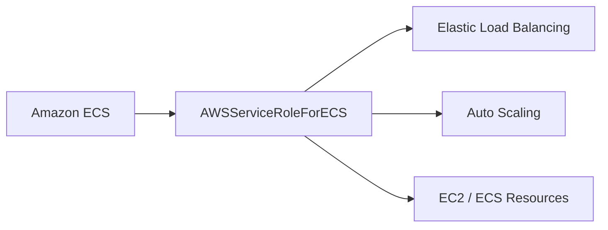
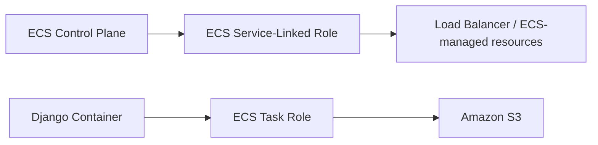

# 16- Service-Linked Roles

## Overview

A **service-linked role (SLR)** is a special IAM role that is directly linked to an AWS service. The linked service creates and manages the role's permissions and uses the role to perform supported actions on behalf of the customer.

The architecture is:

```text
AWS Service
    ↓
Service-Linked Role
    ↓
AWS APIs / Customer Resources
```

Unlike a normal IAM role, a service-linked role is controlled by the AWS service that owns it.

For example:

```text
Amazon ECS
    ↓
AWSServiceRoleForECS
    ↓
AWS resources required by ECS
```

Service-linked roles exist so AWS services can obtain the permissions they require without requiring customers to manually construct and maintain a service role.

AWS defines service-linked roles as a type of service role whose permissions and trust relationship are defined by the linked AWS service. IAM administrators can view the role but cannot normally modify its permissions or trust policy directly in IAM. ([AWS: Create a service-linked role](https://docs.aws.amazon.com/IAM/latest/UserGuide/id_roles_create-service-linked-role.html), [AWS: Update a service-linked role](https://docs.aws.amazon.com/IAM/latest/UserGuide/id_roles_update-service-linked-role.html))

---

## Why Service-Linked Roles Exist

Without service-linked roles, an AWS service might require customers to create and maintain a custom role:

```text
Customer
    ↓
Create IAM Role
    ↓
Write Trust Policy
    ↓
Write Permission Policy
    ↓
Attach Role to Service
```

This creates several operational problems:

- Customers must understand the service's internal permission requirements.
- Customers can accidentally remove required permissions.
- AWS cannot safely evolve the service's required permissions.
- Service cleanup becomes more difficult.
- Incorrect roles can leave resources in partially managed states.

Service-linked roles move ownership of those service-specific permissions to AWS:

```text
Customer
    ↓
Enable AWS Feature
    ↓
AWS Service
    ↓
Create / Use Service-Linked Role
    ↓
AWS-managed service operations
```

AWS explicitly states that service-linked roles help prevent an unexpectedly changed or deleted role from breaking the service or leaving resources in an unknown state. ([AWS IAM `CreateServiceLinkedRole`](https://docs.aws.amazon.com/IAM/latest/APIReference/API_CreateServiceLinkedRole.html))

---

## Service-Linked Role vs Normal IAM Role

The most important distinction is ownership.

| Characteristic | Normal IAM role | Service-linked role |
|---|---|---|
| Created by | Customer or automation | AWS service or customer through IAM/API |
| Used by | Customer workload, user, or AWS service | Specific AWS service |
| Trust policy | Customer-managed | Service-defined |
| Permissions | Customer-managed | Service-defined |
| Can modify permissions in IAM | Yes | No |
| Can modify trust policy in IAM | Yes | No |
| Role name | Customer-defined | Service-defined |
| Role lifecycle | Customer-controlled | Linked service-controlled |
| Delete freely | Usually | Depends on service resources |
| Purpose | General authorization | Service-specific operations |

A service-linked role is therefore not simply a normal IAM role with a special name.

It has a different lifecycle and ownership model. ([AWS IAM: Service-linked roles](https://docs.aws.amazon.com/IAM/latest/UserGuide/id_roles_create-service-linked-role.html))

---

## Service Role vs Service-Linked Role

These terms are often confused.

### Service Role

A service role is a normal IAM role that an AWS service assumes to perform actions on your behalf.

Example:

```text
CloudFormation
    ↓
Customer-created ServiceRole
    ↓
AWS Resources
```

The customer controls the role.

You can generally:

```text
Change trust policy
Change permissions
Attach policies
Remove policies
Delete role
```

### Service-Linked Role

A service-linked role is owned by the linked AWS service.

```text
AWS Service
    ↓
Service-Linked Role
    ↓
AWS Resources
```

The service defines the trust and permissions.

You generally cannot modify those policies directly in IAM.

AWS specifically distinguishes service roles from service-linked roles and notes that service-linked roles are owned by the service. ([AWS: Create a service-linked role](https://docs.aws.amazon.com/IAM/latest/UserGuide/id_roles_create-service-linked-role.html))

---

## Example Architecture

Consider Amazon ECS managing resources in an account.

A simplified conceptual model is:



The service-linked role provides ECS with the service-controlled permissions required for supported ECS operations.

This is different from the role used by the application container:

```text
ECS Service
    ↓
Service-Linked Role

ECS Task
    ↓
Task Role
```

The first identity represents the **AWS service itself**.

The second represents the **application running inside the task**.

This distinction is important in production ECS architectures.

---

## Service-Linked Role Naming

Service-linked roles commonly use a naming pattern similar to:

```text
AWSServiceRoleFor<ServiceName>
```

Examples may include:

```text
AWSServiceRoleForECS
AWSServiceRoleFor...
```

The exact name is service-specific.

The role also uses the AWS-managed service-role path:

```text
/aws-service-role/<service-principal>/
```

For example, a service-linked role ARN can look conceptually like:

```text
arn:aws:iam::123456789012:role/aws-service-role/ecs.amazonaws.com/AWSServiceRoleForECS
```

The exact role name and service principal must be taken from the documentation for the specific AWS service.

AWS documents the service-linked role path and structure when creating service-linked roles through the IAM API. ([AWS `CreateServiceLinkedRole` example](https://docs.aws.amazon.com/IAM/latest/UserGuide/iam_example_iam_CreateServiceLinkedRole_section.html))

---

## Service Principal

The trust relationship for a service-linked role is associated with the AWS service's service principal.

Conceptually:

```json
{
    "Principal": {
        "Service": "example.amazonaws.com"
    }
}
```

A real service-linked role uses the exact service principal defined by AWS.

For example:

```text
ECS
    ↓
ecs.amazonaws.com
```

The important distinction is:

```text
Normal role:
    You decide who can assume it.

Service-linked role:
    The linked AWS service is the intended principal.
```

The service principal is service-specific and case-sensitive. AWS recommends using the exact principal documented for the service. ([AWS `CreateServiceLinkedRole`](https://docs.aws.amazon.com/IAM/latest/APIReference/API_CreateServiceLinkedRole.html))

---

## Trust Policy

A service-linked role has a trust policy, but the customer does not normally manage it.

A conceptual trust relationship is:

```text
AWS Service Principal
        ↓
sts:AssumeRole
        ↓
Service-Linked Role
```

For example:

```json
{
    "Version": "2012-10-17",
    "Statement": [
        {
            "Effect": "Allow",
            "Principal": {
                "Service": "example.amazonaws.com"
            },
            "Action": "sts:AssumeRole"
        }
    ]
}
```

The actual trust policy is defined by the service.

IAM administrators cannot modify the trust policy of a service-linked role directly. ([AWS: Update role trust policy](https://docs.aws.amazon.com/IAM/latest/UserGuide/id_roles_update-role-trust-policy.html))

---

## Permissions Policy

The permissions attached to a service-linked role are also controlled by the service.

Conceptually:

```text
AWS Service
    ↓
Defines required permissions
    ↓
Service-Linked Role
    ↓
AWS APIs
```

The service may need permissions to:

```text
Describe resources
Create or modify resources
Manage networking
Publish metrics
Interact with logging
Operate load balancers
Manage service-specific infrastructure
```

The precise permissions are determined by the linked service.

A customer should not attempt to replace these permissions with a manually created policy.

AWS documents that the service defines the permissions and that the service-linked-role permissions policy cannot simply be attached to another IAM entity. ([AWS: Create a service-linked role](https://docs.aws.amazon.com/IAM/latest/UserGuide/id_roles_create-service-linked-role.html))

---

## Why Customers Cannot Normally Modify the Permissions

Consider an AWS service that depends on:

```text
Permission A
Permission B
Permission C
```

If a customer could remove `Permission B`:

```text
AWS Service
    ↓
Service-Linked Role
    ↓
Permission B removed
    ↓
Service operation fails
```

The service may have no way to maintain its own operational guarantees.

Service-linked roles prevent this class of configuration drift.

AWS explicitly prevents direct IAM modification of the permissions policy for service-linked roles. Some services may expose supported service-specific mechanisms for changing related permissions, but those changes are controlled through the service rather than arbitrary IAM policy editing. ([AWS: Update role permissions](https://docs.aws.amazon.com/IAM/latest/UserGuide/id_roles_update-role-permissions.html))

---

## Creation Lifecycle

A service-linked role can often be created automatically when you use a feature that requires it.

For example:

```text
Enable AWS Feature
        ↓
AWS checks for required SLR
        ↓
SLR does not exist
        ↓
AWS creates SLR
        ↓
Service starts using SLR
```

In some scenarios, an administrator must explicitly create the service-linked role.

The IAM API is:

```text
CreateServiceLinkedRole
```

and the AWS CLI command is:

```bash
aws iam create-service-linked-role \
    --aws-service-name example.amazonaws.com
```

The exact service principal must be the one documented for the relevant AWS service. ([AWS CLI: create-service-linked-role](https://docs.aws.amazon.com/cli/latest/reference/iam/create-service-linked-role.html))

---

## Required IAM Permission to Create an SLR

When manually creating a service-linked role, the caller needs permission to create it.

The relevant IAM action is:

```text
iam:CreateServiceLinkedRole
```

A restrictive administrator policy can scope this permission to an appropriate service principal where supported by IAM condition keys.

For example, the authorization design should distinguish:

```text
Who may create service-linked roles?
```

from:

```text
Which service-linked role is being created?
```

This is important in controlled production environments.

---

## Automatic Creation

Many AWS services create their service-linked role automatically when the service needs it.

For example:

```text
Create service resource
        ↓
AWS detects missing SLR
        ↓
AWS creates SLR
        ↓
Service operation proceeds
```

Therefore, an engineer may encounter an IAM role that was never manually created but still exists in the account.

This is expected behavior.

Do not delete such a role simply because the team did not explicitly create it.

First determine:

```text
Which AWS service owns the role?
Which resources depend on it?
Is it currently used?
```

---

## Viewing Service-Linked Roles

The IAM console identifies service-linked roles as:

```text
(Service-linked role)
```

in the trusted-entities information.

From the CLI, you can inspect roles with:

```bash
aws iam list-roles \
    --path-prefix /aws-service-role/
```

You can inspect a specific role with:

```bash
aws iam get-role \
    --role-name AWSServiceRoleForECS
```

The returned role metadata can show:

```text
RoleName
RoleId
Arn
Path
CreateDate
AssumeRolePolicyDocument
MaxSessionDuration
```

AWS documents `/aws-service-role/` as the service-linked role path and provides CLI/API mechanisms to inspect these roles. ([AWS: Create a service-linked role](https://docs.aws.amazon.com/IAM/latest/UserGuide/iam_example_iam_CreateServiceLinkedRole_section.html))

---

## Service-Linked Role Discovery

A useful operational workflow is:

```bash
aws iam list-roles \
    --path-prefix /aws-service-role/ \
    --query 'Roles[].{Name:RoleName,Arn:Arn,Path:Path}' \
    --output table
```

This can help answer:

```text
Which service-linked roles exist?
Which AWS service owns them?
What are their ARNs?
```

For account inventory and security reviews, include service-linked roles in IAM asset discovery rather than treating them as irrelevant implementation details.

---

## Service-Linked Role ARN

A service-linked role ARN generally follows:

```text
arn:aws:iam::<account-id>:role/aws-service-role/<service-principal>/<role-name>
```

Example:

```text
arn:aws:iam::123456789012:role/aws-service-role/ecs.amazonaws.com/AWSServiceRoleForECS
```

The path is significant.

Do not manually construct ARNs when exact values can be retrieved from AWS.

Use:

```bash
aws iam get-role \
    --role-name AWSServiceRoleForECS \
    --query 'Role.Arn' \
    --output text
```

This avoids incorrect assumptions about service-specific naming.

---

## Lifecycle Ownership

The key operational difference is:

```text
Normal IAM Role
    Customer controls lifecycle

Service-Linked Role
    AWS Service controls lifecycle semantics
```

The service can define:

```text
When the role is required
When the role can be removed
What permissions it needs
How those permissions evolve
```

This reduces customer-managed IAM configuration for AWS-managed service integrations.

---

## Deletion

Deleting a service-linked role is different from deleting a normal IAM role.

A common lifecycle is:

```text
Service Resources Removed
        ↓
Service no longer needs SLR
        ↓
Delete SLR
```

In some services, removing the underlying service resources causes AWS to delete the service-linked role automatically.

In other cases, deletion may be initiated manually through the service or IAM.

AWS states that the exact deletion mechanism depends on the linked service. ([AWS: Delete roles or instance profiles](https://docs.aws.amazon.com/IAM/latest/UserGuide/id_roles_manage_delete.html))

---

## Why Deletion Can Fail

A service-linked role may still be required by active resources.

For example:

```text
Service-Linked Role
        ↓
Production Resource
        ↓
Service depends on SLR
```

Attempting to delete the role:

```text
Delete SLR
    ↓
AWS detects active dependency
    ↓
Deletion fails
```

This is intentional.

Deleting the role while the service still depends on it could break service operations.

AWS documents that the related resources must generally be removed before the role can be deleted successfully. ([AWS `DeleteServiceLinkedRole`](https://docs.aws.amazon.com/IAM/latest/APIReference/API_DeleteServiceLinkedRole.html))

---

## Deleting a Service-Linked Role With the CLI

The CLI command is:

```bash
aws iam delete-service-linked-role \
    --role-name AWSServiceRoleForExample
```

The operation is asynchronous and returns a deletion task identifier.

Example:

```json
{
    "DeletionTaskId": "task/aws-service-role/example.amazonaws.com/AWSServiceRoleForExample/..."
}
```

The returned task ID is used to check the deletion status. ([AWS `DeleteServiceLinkedRole`](https://docs.aws.amazon.com/IAM/latest/APIReference/API_DeleteServiceLinkedRole.html))

---

## Monitoring Deletion Status

Use:

```bash
aws iam get-service-linked-role-deletion-status \
    --deletion-task-id "task/aws-service-role/example.amazonaws.com/AWSServiceRoleForExample/..."
```

The response can indicate:

```text
SUCCEEDED
FAILED
IN_PROGRESS
```

If deletion fails, AWS may return information describing why the service-linked role is still needed.

This is much safer than repeatedly attempting deletion without identifying the dependency.

([AWS `GetServiceLinkedRoleDeletionStatus`](https://docs.aws.amazon.com/IAM/latest/APIReference/API_GetServiceLinkedRoleDeletionStatus.html))

---

## Safe Deletion Procedure

A production-safe process is:

```text
Identify SLR
    ↓
Identify owning AWS service
    ↓
Review service documentation
    ↓
Identify dependent resources
    ↓
Remove or migrate dependent resources
    ↓
Request role deletion
    ↓
Monitor deletion task
    ↓
Verify role removal
```

Do not begin by deleting the role.

The service resource lifecycle should drive the role lifecycle.

---

## Service-Linked Roles and Resource Deletion

A common cleanup sequence is:

```text
Application
    ↓
Service Resource
    ↓
Delete Resource
    ↓
Service no longer needs SLR
    ↓
SLR becomes deletable
```

For example, deleting an AWS service configuration may eventually make its service-linked role unnecessary.

The exact relationship depends on the AWS service.

Always use the service-specific cleanup documentation rather than assuming all SLRs behave identically.

---

## Service-Linked Roles and Permissions Boundaries

Permissions boundaries are customer-controlled limits on the permissions available to IAM roles and users.

Service-linked roles are different.

You should not treat an SLR like:

```text
Customer-managed application role
```

and attempt to apply your normal IAM role governance mechanisms to it.

The service controls the role's permissions.

If an organization has a centralized IAM governance requirement that conflicts with an AWS service's service-linked role model, the correct solution is usually to evaluate the service's documented IAM integration rather than modifying the SLR directly.

---

## Service-Linked Roles and SCPs

Service-linked roles are still operating inside an AWS account governed by the broader AWS Organizations environment.

An SCP can restrict API operations at the account or organizational level.

Conceptually:

```text
AWS Service
    ↓
Service-Linked Role
    ↓
AWS API
    ↓
SCP / Organization Controls
    ↓
Allow or Deny
```

Therefore, a service-linked role does not automatically bypass organizational governance.

A service may fail because an organization-level policy blocks an action the service needs.

This can produce confusing production failures because the customer cannot simply add the missing action to the SLR.

---

## Service-Linked Roles and Resource Policies

A service-linked role can interact with resources subject to resource-based policies and other authorization layers.

For example:

```text
AWS Service
    ↓
Service-Linked Role
    ↓
S3 / KMS / EC2 / ELB
```

A failure can therefore involve:

```text
Service-linked role permissions
+
Resource policy
+
KMS policy
+
SCP
+
Service-specific constraints
```

Do not assume that inspecting only the IAM role explains every `AccessDenied` error.

---

## Service-Linked Roles and KMS

Encryption introduces another authorization layer.

Example:

```text
AWS Service
    ↓
Service-Linked Role
    ↓
Encrypted Resource
    ↓
KMS Key
```

If the service operation requires KMS permissions, the relevant authorization may involve:

```text
IAM
KMS key policy
KMS grants
Service-specific KMS integration
```

A service-linked role does not remove the need to configure encryption permissions correctly.

When troubleshooting an encrypted service integration, inspect both the service-linked role and the KMS authorization path.

---

## Example: ECS

Amazon ECS uses service-linked roles for ECS service operations in supported configurations.

Conceptually:

```text
ECS Control Plane
       ↓
AWSServiceRoleForECS
       ↓
AWS APIs
       ↓
Load Balancer / Auto Scaling / Other Resources
```

This should not be confused with:

```text
ECS Task Role
```

or:

```text
ECS Task Execution Role
```

The identities serve different purposes.

| ECS identity | Used by | Primary purpose |
|---|---|---|
| Service-linked role | ECS service | ECS-managed service operations |
| Task role | Application container | Application AWS API access |
| Execution role | ECS infrastructure | Image/log/task startup operations |

This separation is fundamental to production ECS security.

---

## ECS Application Access Example

Suppose a Django application runs inside an ECS task and needs S3 access.

The correct application identity is normally:

```text
Django Container
    ↓
ECS Task Role
    ↓
S3
```

Not:

```text
Django Container
    ↓
AWSServiceRoleForECS
    ↓
S3
```

The service-linked role belongs to ECS itself.

Application permissions should be attached to the application's task role.

---

## Service-Linked Roles and Lambda

Lambda execution roles should generally be used for:

```text
Lambda Function
    ↓
AWS API
```

A service-linked role, where used by an AWS service integration, serves the service rather than the function's business logic.

This distinction prevents accidental coupling:

```text
AWS Service identity
    ≠
Application workload identity
```

The same principle applies to:

```text
ECS
EKS
CloudFormation
EventBridge
Auto Scaling
Elastic Load Balancing
```

depending on the specific service integration.

---

## Service-Linked Roles and Kubernetes

Kubernetes workloads should normally use workload identity mechanisms such as:

```text
EKS Pod Identity
```

or:

```text
IRSA
```

rather than service-linked roles.

The identity model remains:

```text
Pod
    ↓
Workload IAM Role
    ↓
AWS API
```

A service-linked role, by contrast, represents an AWS service's own control-plane permissions.

Do not use a service-linked role as an application role.

---

## Service-Linked Roles in Automation

Infrastructure-as-code should understand the lifecycle of SLRs.

For example, a Terraform or CloudFormation deployment may enable an AWS feature that automatically creates an SLR.

A later deletion of infrastructure can leave the role temporarily present if the service has not fully removed its dependencies.

Therefore:

```text
Infrastructure deletion
    ≠
Immediate IAM role disappearance
```

Automation should not assume that service-linked roles behave like ordinary customer-managed IAM roles.

---

## Infrastructure as Code Considerations

Before explicitly managing an SLR in Terraform or CloudFormation, verify:

```text
Does the service create it automatically?
Does the service require it?
Does the service manage its policy?
Does the service support custom suffixes?
Can it safely be deleted?
```

In many cases, allowing the AWS service to create and manage the SLR is the correct approach.

Do not duplicate AWS-managed service-role behavior with a manually created customer role unless the service documentation specifically requires it.

---

## Importing an Existing Service-Linked Role

An existing service-linked role may already exist because:

```text
An engineer enabled a feature
An AWS console operation created it
A deployment previously created it
The service automatically provisioned it
```

Before attempting to recreate it:

```bash
aws iam list-roles \
    --path-prefix /aws-service-role/
```

Then identify the role associated with the service.

Duplicate creation attempts can fail because the role already exists.

---

## Common Permission Error

A common error pattern is:

```text
User is not authorized to perform:
iam:CreateServiceLinkedRole
```

This usually means the caller does not have permission to create the required service-linked role.

The fix is not necessarily:

```text
AdministratorAccess
```

Instead, determine:

```text
Which service-linked role is required?
Which principal is performing the operation?
Does that principal have iam:CreateServiceLinkedRole?
```

Then grant the narrow administrative capability required by the organization's IAM governance model.

---

## Common Deletion Error

Another common failure is:

```text
Service-linked role deletion failed
```

The reason is often that resources associated with the linked service still exist.

Troubleshooting:

```text
1. Identify the linked service.

2. Identify resources using that service.

3. Remove obsolete resources.

4. Submit role deletion again.

5. Check deletion-task status.
```

AWS's deletion API explicitly supports asynchronous deletion status reporting for this purpose. ([AWS `DeleteServiceLinkedRole`](https://docs.aws.amazon.com/IAM/latest/APIReference/API_DeleteServiceLinkedRole.html))

---

## Common Mistakes

| Mistake | Why it happens | Better approach |
|---|---|---|
| Editing an SLR's permissions in IAM | Treating it like a normal role | Change supported configuration through the linked service |
| Editing the SLR trust policy | Assuming all role trust policies are customer-managed | Treat the service as the trust owner |
| Using an SLR for application permissions | Confusing service identity with workload identity | Use task, execution, Lambda, or workload roles |
| Deleting an SLR manually without checking resources | Role looks unused | Remove dependent service resources first |
| Assuming all AWS services use SLRs | Generalizing service integrations | Check service-specific IAM documentation |
| Granting broad `iam:CreateServiceLinkedRole` unnecessarily | Simplifying administration | Restrict who may create SLRs |
| Recreating an existing SLR | Not checking IAM role inventory | Inspect `/aws-service-role/` first |
| Treating SLR permissions as customer policy | Assuming IAM owns every IAM role | Recognize AWS service ownership |
| Debugging only the SLR | Ignoring other policy layers | Check SCPs, resource policies, KMS, and service configuration |
| Removing SLRs during incident cleanup | Attempting to reduce IAM objects | Avoid changing service infrastructure without understanding dependencies |

---

## Troubleshooting Methodology

When an AWS service operation involving a service-linked role fails, use this sequence:

```text
Identify AWS service
        ↓
Identify service-linked role
        ↓
Verify role exists
        ↓
Verify service resource configuration
        ↓
Check SCP / organization restrictions
        ↓
Check resource policies
        ↓
Check KMS if applicable
        ↓
Check service-specific IAM documentation
        ↓
Inspect CloudTrail / service logs
```

Useful commands include:

```bash
aws iam list-roles \
    --path-prefix /aws-service-role/
```

```bash
aws iam get-role \
    --role-name AWSServiceRoleForECS
```

```bash
aws iam get-role \
    --role-name AWSServiceRoleForECS \
    --query 'Role.AssumeRolePolicyDocument'
```

For deletion:

```bash
aws iam delete-service-linked-role \
    --role-name AWSServiceRoleForExample
```

Then:

```bash
aws iam get-service-linked-role-deletion-status \
    --deletion-task-id "task/aws-service-role/..."
```

---

## Security Considerations

Service-linked roles reduce customer-managed IAM configuration, but they should still be included in security reviews.

Review:

```text
Which AWS service owns the role?
What permissions does the service require?
Which resources can the service operate on?
Can organization policies restrict those operations?
What data can the service access?
```

Do not attempt to weaken or broaden an SLR's permissions manually.

Instead, control the security boundary through:

```text
AWS service configuration
Resource policies
SCPs
KMS policies
Network controls
Resource-level permissions
Service-specific security settings
```

The principle is:

```text
Control the surrounding architecture,
not the AWS-owned role internals.
```

---

## Privilege Escalation Considerations

Service-linked roles should be considered when reviewing IAM privilege escalation paths.

An administrator who can create or activate a powerful AWS service may indirectly cause AWS to create an SLR with significant permissions.

Therefore:

```text
iam:CreateServiceLinkedRole
```

should be treated as an administrative capability rather than an unimportant IAM permission.

Review:

```text
Who can create SLRs?
Which AWS services can they create them for?
What permissions do those services receive?
What resources can the service subsequently manage?
```

The relevant risk depends on the specific AWS service and its service-linked role permissions.

---

## Operational Governance

Include service-linked roles in IAM inventory and change reviews.

For each SLR, record:

| Attribute | Example |
|---|---|
| Role name | `AWSServiceRoleForECS` |
| Owning service | Amazon ECS |
| Service principal | `ecs.amazonaws.com` |
| Role path | `/aws-service-role/ecs.amazonaws.com/` |
| Purpose | ECS-managed operations |
| Customer permission control | No direct IAM editing |
| Lifecycle owner | AWS service |
| Dependent resources | ECS service configuration |
| Deletion method | Service-specific / IAM API where supported |

This prevents engineers from treating the IAM console as the complete source of ownership information.

---

## Monitoring and Auditability

CloudTrail can help determine which AWS service operations are occurring and which identities are involved.

For service-linked-role troubleshooting, correlate:

```text
AWS service operation
        ↓
CloudTrail event
        ↓
Service principal / role context
        ↓
Resource operation
        ↓
Failure or success
```

For operational reviews, monitor unusual behavior around:

```text
Service-linked role creation
Service resource creation
Privilege-sensitive service configuration
Role deletion attempts
SCP-denied service actions
KMS authorization failures
```

The goal is not to alert on the mere existence of SLRs, but to understand changes to the service configurations that depend on them.

---

## Scalability Considerations

Service-linked roles scale well because AWS manages the service-specific role lifecycle.

For example:

```text
10 AWS Accounts
    ×
Multiple AWS Services
    ↓
Service-linked roles managed by AWS
```

The customer does not need to create a custom service role policy for every account and service integration.

This is especially valuable in multi-account environments.

However, organizational scale still requires:

```text
IAM inventory
Account standards
SCP governance
CloudTrail
Infrastructure-as-code discipline
Service ownership documentation
```

SLRs reduce IAM maintenance; they do not eliminate identity governance.

---

## High Availability and Reliability

A service-linked role is part of the service's control-plane integration.

Its permissions allow the service to perform required operations on managed resources.

Therefore, deleting or modifying the underlying role outside supported mechanisms can create service failures.

AWS intentionally restricts customer modification of SLR trust and permissions to protect service stability. ([AWS `CreateServiceLinkedRole`](https://docs.aws.amazon.com/IAM/latest/APIReference/API_CreateServiceLinkedRole.html))

For production systems:

```text
Do not manually modify SLR internals.
Do not delete them during incident response unless dependency analysis is complete.
Use service-supported lifecycle operations.
```

---

## Disaster Recovery

Service-linked roles are account-local IAM resources.

A multi-account or multi-region architecture should account for:

```text
AWS service resources
+
Service-linked roles
+
SCPs
+
Resource policies
+
KMS configuration
```

When rebuilding an environment:

```text
Deploy service resources
        ↓
AWS creates required SLR
        ↓
Service configuration becomes operational
```

Do not assume that copying an SLR's JSON into another account is a supported disaster-recovery mechanism.

The linked service should establish the correct service-linked role lifecycle.

---

## Service-Linked Role vs Execution Role

These roles solve different problems.

```text
AWS Service
    ↓
Service-Linked Role
    ↓
AWS-managed service operations
```

versus:

```text
Workload
    ↓
Execution Role
    ↓
AWS APIs required by workload infrastructure
```

Examples:

```text
ECS Service
    ↓
Service-Linked Role

ECS Task
    ↓
Task Role

ECS Task Startup
    ↓
Execution Role
```

Understanding the identity owner is more important than memorizing role names.

Ask:

```text
Who is actually making the AWS API call?
```

---

## Service-Linked Role vs Task Role

For an ECS-based Django application:



If the Django application gets:

```text
AccessDenied
```

for S3, investigate the **task role**.

Do not inspect `AWSServiceRoleForECS` first just because the application runs on ECS.

This distinction avoids a large class of IAM troubleshooting mistakes.

---

## Senior-Level Mental Model

Treat service-linked roles as:

```text
AWS-owned identity boundaries
```

rather than:

```text
Customer-managed application roles
```

The full model is:

```text
AWS Service
    ↓
Service-Specific Identity
    ↓
Service-Linked Role
    ↓
AWS API Calls
    ↓
Customer Resources
```

The customer controls the environment around the role:

```text
Service Configuration
Resource Lifecycle
SCPs
Resource Policies
KMS Policies
Network Controls
Operational Governance
```

The AWS service controls the role's core trust and permissions.

This is the key conceptual boundary.

---

## Interview Perspective

### What Is a Service-Linked Role?

A service-linked role is a special IAM role linked to an AWS service. The service defines the role's trust relationship and permissions and uses the role to perform supported actions on the customer's behalf. ([AWS: Create a service-linked role](https://docs.aws.amazon.com/IAM/latest/UserGuide/id_roles_create-service-linked-role.html))

### How Is It Different From a Normal Service Role?

```text
Service role:
    Customer manages the role.

Service-linked role:
    AWS service owns the role configuration.
```

### Can You Edit an SLR's Permission Policy?

Normally no.

The service controls the permissions. Some services expose supported service-specific mechanisms for modifying related permissions, but the permissions policy is not directly customer-editable in IAM. ([AWS: Update role permissions](https://docs.aws.amazon.com/IAM/latest/UserGuide/id_roles_update-role-permissions.html))

### Can You Edit the Trust Policy?

No. AWS documents that the trust policy of a service-linked role cannot be modified. ([AWS: Update role trust policy](https://docs.aws.amazon.com/IAM/latest/UserGuide/id_roles_update-role-trust-policy.html))

### Who Assumes the Role?

The linked AWS service.

### Can You Delete a Service-Linked Role?

Sometimes, but only according to the service's supported lifecycle.

Dependent resources may need to be removed first, and deletion may be asynchronous. ([AWS `DeleteServiceLinkedRole`](https://docs.aws.amazon.com/IAM/latest/APIReference/API_DeleteServiceLinkedRole.html))

### Why Does AWS Manage the Role?

To prevent customers from accidentally removing or changing permissions required for the service to operate correctly.

### Should Applications Use Service-Linked Roles?

No.

Applications should generally use:

```text
EC2 role
ECS task role
Lambda execution role
EKS workload identity
Other application-specific IAM roles
```

### What Is a Common SLR Interview Trap?

Confusing:

```text
AWSServiceRoleForECS
```

with:

```text
ECS task role
```

The first represents ECS service operations; the second represents the application workload.

---

## Production Checklist

Before modifying or deleting a service-linked role, verify:

```text
Ownership
    □ Which AWS service owns the role?
    □ Is it actually service-linked?

Lifecycle
    □ Are active service resources dependent on it?
    □ Does the service automatically create or remove it?
    □ Does the service require manual deletion?

Permissions
    □ Have the service-defined permissions been reviewed?
    □ Are SCPs or resource policies restricting the service?

Application Identity
    □ Is an application incorrectly using the SLR?
    □ Should an ECS, Lambda, EC2, or EKS workload role be used instead?

Operations
    □ Has the role been included in IAM inventory?
    □ Are CloudTrail events available?
    □ Has deletion behavior been tested in a non-production account?

Governance
    □ Who may create service-linked roles?
    □ Are iam:CreateServiceLinkedRole permissions appropriately restricted?
```

## AWS Documentation Links

- [Using service-linked roles](https://docs.aws.amazon.com/IAM/latest/UserGuide/id_roles_create-service-linked-role.html)
- [CreateServiceLinkedRole API](https://docs.aws.amazon.com/IAM/latest/APIReference/API_CreateServiceLinkedRole.html)
- [Create service-linked role with AWS CLI](https://docs.aws.amazon.com/cli/latest/reference/iam/create-service-linked-role.html)
- [Update a service-linked role](https://docs.aws.amazon.com/IAM/latest/UserGuide/id_roles_update-service-linked-role.html)
- [Update role permissions](https://docs.aws.amazon.com/IAM/latest/UserGuide/id_roles_update-role-permissions.html)
- [Update role trust policy](https://docs.aws.amazon.com/IAM/latest/UserGuide/id_roles_update-role-trust-policy.html)
- [DeleteServiceLinkedRole API](https://docs.aws.amazon.com/IAM/latest/APIReference/API_DeleteServiceLinkedRole.html)
- [GetServiceLinkedRoleDeletionStatus API](https://docs.aws.amazon.com/IAM/latest/APIReference/API_GetServiceLinkedRoleDeletionStatus.html)
- [Delete roles or instance profiles](https://docs.aws.amazon.com/IAM/latest/UserGuide/id_roles_manage_delete.html)

## Key Takeaways

- **A service-linked role is an AWS-service-owned IAM role** whose trust relationship and permissions are defined for a specific AWS service rather than managed like a normal customer-created role.
- **Do not use service-linked roles for application workloads**; ECS task roles, Lambda execution roles, EC2 roles, and EKS workload identity serve application-specific authorization needs.
- **SLR permissions and trust policies are not directly editable in IAM**, because AWS controls them to preserve the linked service's operational requirements.
- **Deletion is service-dependent and may fail while resources still depend on the role**; remove the service resources first and monitor asynchronous deletion tasks where applicable.
- **For production IAM troubleshooting, identify the identity owner first:** AWS service → service-linked role, workload → workload role, and human/automation identity → appropriate federated or assumed role.