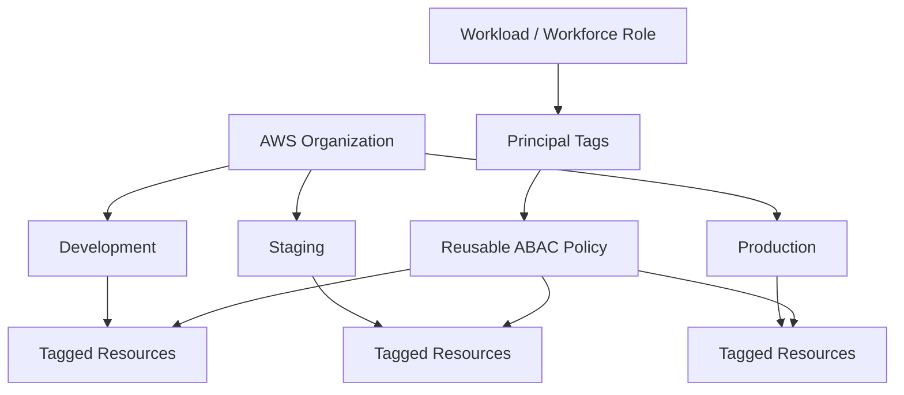
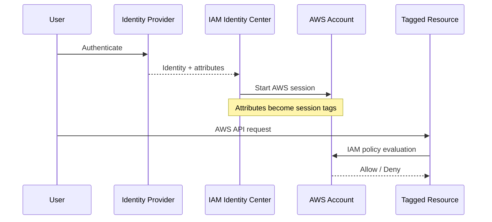
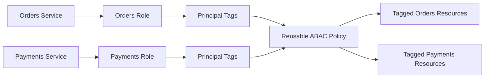
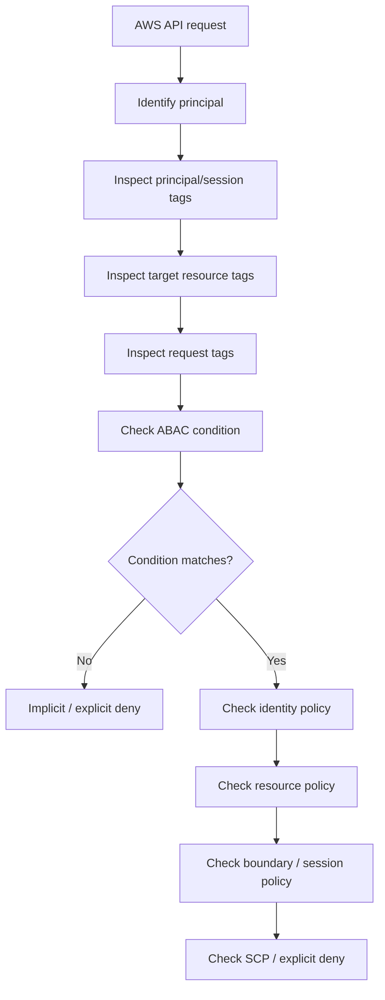

# 17- Attribute-Based Access Control

## Overview

**Attribute-Based Access Control (ABAC)** is an authorization model where access decisions depend on attributes associated with the principal, resource, request, or session rather than requiring a separate policy for every identity-resource combination.

In AWS, tags are the primary attributes used for ABAC.

A typical model is:

```text
Principal
    Team = payments
    Environment = production
         |
         | request
         v
Resource
    Team = payments
    Environment = production
         |
         v
IAM Policy Condition
         |
         v
Allow / Deny
```

Instead of writing:

```text
Alice → PaymentsBucket
Bob   → PaymentsBucket
Carol → OrdersBucket
```

you can define a reusable rule such as:

```text
Allow access when:
    Principal.Team == Resource.Team
```

AWS documents ABAC as an authorization strategy where tags and other identity attributes can be evaluated dynamically during IAM policy evaluation. ([AWS IAM ABAC](https://docs.aws.amazon.com/IAM/latest/UserGuide/introduction_attribute-based-access-control.html))

ABAC is particularly useful in large AWS environments where identities, accounts, teams, applications, environments, and resources change frequently.

---

## Why ABAC Exists

Traditional role-based access control can become difficult to scale.

Suppose an organization has:

```text
20 teams
5 environments
500 engineers
10,000 resources
```

A purely identity-specific model can create a large number of:

```text
Roles
Policies
Policy statements
Role-resource mappings
```

ABAC replaces many explicit mappings with reusable rules.

For example:

```text
Principal:
    Team = payments

Resource:
    Team = payments

Policy:
    PrincipalTag/Team == ResourceTag/Team
```

The same policy can work for:

```text
Payments
Orders
Billing
Identity
Reporting
```

without changing the policy each time another team is added.

AWS specifically describes ABAC as a way to create a single policy or small set of policies that can work across resources based on matching attributes. ([AWS IAM ABAC](https://docs.aws.amazon.com/IAM/latest/UserGuide/introduction_attribute-based-access-control.html))

---

## ABAC vs RBAC

The key difference is what drives authorization.

### RBAC

```text
User
    ↓
Role
    ↓
Permissions
    ↓
Resource
```

Example:

```text
PaymentsDeveloperRole
    ↓
Read Payments Resources
```

### ABAC

```text
Principal Attributes
        +
Resource Attributes
        ↓
Policy Condition
        ↓
Access
```

Example:

```text
Principal.Team = Payments
Resource.Team = Payments
        ↓
Allow
```

Comparison:

| Property | RBAC | ABAC |
|---|---|---|
| Authorization based on | Roles | Attributes |
| Main AWS mechanism | IAM roles/policies | Tags and condition keys |
| Policy count at scale | Can grow significantly | Often smaller |
| Dynamic resource matching | Limited | Strong |
| Operational complexity | Role management | Attribute/tag governance |
| Best for | Stable access groups | Large dynamic environments |
| Main risk | Role explosion | Tag manipulation / bad attributes |
| Governance focus | Role lifecycle | Attribute integrity |

ABAC does not replace RBAC.

A mature architecture often uses both:

```text
Role
+
Principal attributes
+
Resource attributes
+
Explicit policy constraints
```

---

## Core ABAC Model

AWS ABAC commonly relies on these condition keys:

| Condition key | Meaning |
|---|---|
| `aws:PrincipalTag/tag-key` | Tag on the principal or session |
| `aws:ResourceTag/tag-key` | Tag attached to the target resource |
| `aws:RequestTag/tag-key` | Tag included in the current request |
| `aws:TagKeys` | Tag keys allowed in the request |
| `iam:ResourceTag/tag-key` | Tag on an IAM user or role resource |
| `sts:TransitiveTagKeys` | Session tag keys that may persist through role chaining |

AWS documents `aws:PrincipalTag`, `aws:ResourceTag`, `aws:RequestTag`, and `aws:TagKeys` as important building blocks for tag-based authorization. ([AWS global condition keys](https://docs.aws.amazon.com/IAM/latest/UserGuide/reference_policies_condition-keys.html), [AWS tags in IAM policies](https://docs.aws.amazon.com/IAM/latest/UserGuide/access_tags.html))

---

## Principal Tags

A principal can carry tags that describe its identity or authorization context.

Example:

```text
Role:
    Name = PaymentsApplicationRole
    Team = Payments
    Environment = Production
```

A policy can reference:

```text
aws:PrincipalTag/Team
```

Example:

```json
{
    "Version": "2012-10-17",
    "Statement": [
        {
            "Effect": "Allow",
            "Action": [
                "ec2:DescribeInstances"
            ],
            "Resource": "*",
            "Condition": {
                "StringEquals": {
                    "aws:PrincipalTag/Team": "Payments"
                }
            }
        }
    ]
}
```

The policy is reusable because it does not need a hard-coded role name.

AWS supports tags on IAM users and roles and allows their values to participate in policy evaluation. ([AWS: Controlling access to IAM users and roles using tags](https://docs.aws.amazon.com/IAM/latest/UserGuide/access_iam-tags.html))

---

## Resource Tags

Resources can also have attributes represented as tags.

Example:

```text
EC2 Instance
    Team = Payments
    Environment = Production
```

A policy can reference:

```text
aws:ResourceTag/Team
```

Conceptually:

```text
Principal.Team
      ==
Resource.Team
```

This allows the same policy to protect many resources.

AWS supports `aws:ResourceTag/tag-key` for services and resource types that expose the condition key. Support varies by AWS service and resource type, so the Service Authorization Reference must be checked before implementing an ABAC design. ([AWS: Controlling access to AWS resources using tags](https://docs.aws.amazon.com/IAM/latest/UserGuide/access_tags.html))

---

## Principal-Resource Matching

A common ABAC policy pattern is:

```text
PrincipalTag/Team
        ==
ResourceTag/Team
```

For example:

```json
{
    "Version": "2012-10-17",
    "Statement": [
        {
            "Sid": "ManageResourcesInOwnTeam",
            "Effect": "Allow",
            "Action": [
                "ec2:StartInstances",
                "ec2:StopInstances"
            ],
            "Resource": "arn:aws:ec2:*:*:instance/*",
            "Condition": {
                "StringEquals": {
                    "aws:ResourceTag/Team": "${aws:PrincipalTag/Team}"
                }
            }
        }
    ]
}
```

The same policy can apply to multiple teams.

```text
PaymentsRole
    Team = Payments
        ↓
Payments instances only

OrdersRole
    Team = Orders
        ↓
Orders instances only
```

The policy does not need one statement per team.

---

## Policy Variables

ABAC commonly uses policy variables to compare dynamic values.

The syntax is:

```text
${aws:PrincipalTag/Team}
```

For example:

```json
{
    "Condition": {
        "StringEquals": {
            "aws:ResourceTag/Team": "${aws:PrincipalTag/Team}"
        }
    }
}
```

During authorization, AWS resolves the variable from the request context.

AWS documents that single-valued context keys can be used as policy variables and that `aws:PrincipalTag` is a common source of dynamic values. ([AWS IAM policy variables](https://docs.aws.amazon.com/IAM/latest/UserGuide/reference_policies_variables.html))

---

## Why Policy Variables Matter

Without variables, you may need separate statements:

```text
Team = Payments
Team = Orders
Team = Billing
Team = Identity
```

With variables:

```text
Resource.Team == Principal.Team
```

The policy becomes reusable.

This is one of the strongest scalability advantages of ABAC.

---

## Session Tags

Principal identity does not always come from a permanently tagged IAM user or role.

AWS STS supports **session tags**.

Example:

```text
AssumeRole
    ↓
Session Tags
    Team = Payments
    Environment = Production
    ↓
Temporary Role Session
```

The resulting session can use those tags during policy evaluation.

AWS documents session tags for `AssumeRole`, `AssumeRoleWithSAML`, and `AssumeRoleWithWebIdentity`. ([AWS STS session tags](https://docs.aws.amazon.com/IAM/latest/UserGuide/id_session-tags.html))

---

## Session Tags vs Role Tags

These are different concepts.

### Role Tag

```text
IAM Role
    Team = Payments
```

This is attached to the IAM role itself.

### Session Tag

```text
Role Session
    Team = Payments
```

This exists for the duration of the session.

Comparison:

| Property | Role tag | Session tag |
|---|---|---|
| Stored on | IAM role | Temporary session |
| Lifetime | Until changed | Session lifetime |
| Common source | IAM resource configuration | STS federation / `AssumeRole` |
| Useful for | Stable workload identity | Dynamic identity context |
| Can be transitive | No | Yes, when configured |

AWS notes that session tags are valid for the session and can be made transitive through role chaining. ([AWS STS session tags](https://docs.aws.amazon.com/IAM/latest/UserGuide/id_session-tags.html))

---

## Session Tags With `AssumeRole`

The AWS CLI supports session tags:

```bash
aws sts assume-role \
    --role-arn arn:aws:iam::123456789012:role/PaymentsRole \
    --role-session-name payments-worker \
    --tags Team=Payments Environment=Production \
    --transitive-tag-keys Team
```

Conceptually:

```text
Caller
    ↓
AssumeRole
    +
Session Tags
    ↓
Role Session
    ↓
IAM authorization
```

The principal must be authorized to pass the requested tags. AWS documents conditions involving `aws:RequestTag`, `aws:TagKeys`, and `sts:TransitiveTagKeys` for controlling session-tag use. ([AWS STS session tags](https://docs.aws.amazon.com/IAM/latest/UserGuide/id_session-tags.html))

---

## Transitive Session Tags

When role chaining is used:

```text
Role A
    ↓
Role B
    ↓
Role C
```

session tags normally do not automatically persist through every hop.

A session tag can be marked as **transitive**.

```text
Role A Session
    Team = Payments
    ↓
TransitiveTagKeys = Team
    ↓
Role B Session
    Team = Payments
```

AWS documents that transitive session tags can persist through role chaining. ([AWS STS session tags](https://docs.aws.amazon.com/IAM/latest/UserGuide/id_session-tags.html))

This matters in architectures that use:

```text
Federated identity
    ↓
Role A
    ↓
Cross-account Role B
```

because authorization in Account B may depend on attributes established earlier in the chain.

---

## Tag Integrity

ABAC is only as strong as the attributes used by the policy.

Suppose access is:

```text
Principal.Team == Resource.Team
```

and the principal can change its own:

```text
Team = Security
```

then the attribute is not a reliable authorization boundary.

Similarly, if a developer can retag:

```text
Environment = Production
```

without authorization controls, a tag-based policy may be bypassed.

Therefore:

```text
ABAC
    requires
trusted attributes
```

not merely:

```text
ABAC
    + arbitrary tags
```

This is the most important production concern with ABAC.

---

## Tag Governance

A production ABAC architecture should define:

```text
Required tag keys
Allowed values
Who can create tags
Who can modify tags
Who can delete tags
Which resources must be tagged
How missing tags are handled
How tag drift is detected
```

Typical organizational attributes include:

```text
Environment
Team
Application
CostCenter
DataClassification
Owner
Project
Compliance
```

Use a controlled vocabulary.

Avoid having different teams independently create:

```text
team
Team
TEAM
owner_team
OwningTeam
```

because inconsistent keys weaken policy design.

AWS recommends consistent naming conventions for tag keys used in authorization. ([AWS IAM condition elements](https://docs.aws.amazon.com/IAM/latest/UserGuide/reference_policies_elements_condition.html))

---

## `aws:RequestTag`

`aws:RequestTag/tag-key` checks the value of a tag supplied in the current request.

Example:

```json
{
    "Effect": "Allow",
    "Action": "ec2:CreateTags",
    "Resource": "*",
    "Condition": {
        "StringEquals": {
            "aws:RequestTag/Team": "${aws:PrincipalTag/Team}"
        }
    }
}
```

Conceptually:

```text
Requested Tag:
    Team = Payments

Principal:
    Team = Payments

Result:
    Allowed
```

But:

```text
Requested Tag:
    Team = Security

Principal:
    Team = Payments

Result:
    Denied
```

`aws:RequestTag` evaluates tags passed in the request rather than tags already attached to the resource. ([AWS global condition keys](https://docs.aws.amazon.com/IAM/latest/UserGuide/reference_policies_condition-keys.html))

---

## `aws:ResourceTag`

`aws:ResourceTag/tag-key` evaluates the tag currently attached to the target resource.

Example:

```json
{
    "Effect": "Allow",
    "Action": "ec2:StopInstances",
    "Resource": "arn:aws:ec2:*:*:instance/*",
    "Condition": {
        "StringEquals": {
            "aws:ResourceTag/Environment": "Development"
        }
    }
}
```

This means:

```text
Only resources tagged:
Environment = Development
```

are eligible for the statement.

Whether a service and action support resource-tag conditions is service-specific. Always verify the relevant Service Authorization Reference. ([AWS services that work with IAM](https://docs.aws.amazon.com/IAM/latest/UserGuide/reference_aws-services-that-work-with-iam.html))

---

## `aws:TagKeys`

`aws:TagKeys` controls which tag keys can appear in a request.

For example:

```json
{
    "Effect": "Allow",
    "Action": [
        "ec2:CreateTags"
    ],
    "Resource": "*",
    "Condition": {
        "ForAllValues:StringEquals": {
            "aws:TagKeys": [
                "Team",
                "Environment",
                "CostCenter"
            ]
        }
    }
}
```

This restricts the keys that the request can manipulate.

Unlike `aws:RequestTag`, `aws:TagKeys` evaluates the tag key names rather than their values.

AWS classifies `aws:TagKeys` as a multivalued condition key. It should therefore be used with an appropriate set operator such as `ForAllValues` or `ForAnyValue`. ([AWS global condition keys](https://docs.aws.amazon.com/IAM/latest/UserGuide/reference_policies_condition-keys.html), [AWS single-valued vs multivalued keys](https://docs.aws.amazon.com/IAM/latest/UserGuide/reference_policies_condition-single-vs-multi-valued-context-keys.html))

---

## `aws:RequestTag` vs `aws:ResourceTag` vs `aws:TagKeys`

| Condition key | Evaluates | Typical use |
|---|---|---|
| `aws:PrincipalTag/Team` | Principal attribute | Who is making the request |
| `aws:ResourceTag/Team` | Existing resource tag | Which resources can be accessed |
| `aws:RequestTag/Team` | Tag in current request | Which tags may be assigned |
| `aws:TagKeys` | Tag keys in current request | Which attributes may be manipulated |

A common ABAC design uses all four:

```text
PrincipalTag
      ↓
Authorization

ResourceTag
      ↓
Target matching

RequestTag
      ↓
Creation/update validation

TagKeys
      ↓
Allowed attribute vocabulary
```

---

## Enforcing Tag Ownership

A strong pattern is:

```text
Users can manage resources
only when the resource's Team
matches their Team attribute.
```

At the same time:

```text
Users may not arbitrarily change Team tags.
```

For example:

```text
Principal.Team = Payments
```

The policy can allow:

```text
Create resource:
    Team = Payments

Modify resource:
    Resource.Team = Payments

Change tag:
    Team must remain Payments
```

The exact policies depend on the AWS service and supported tagging actions.

The important design principle is to protect the attribute that determines authorization.

---

## Creation-Time Tagging

For ABAC to work reliably, new resources often need mandatory tags.

Conceptually:

```text
Create Resource
    ↓
Require Team tag
    ↓
Team = Principal.Team
    ↓
Resource created
```

Without this control:

```text
Resource created
    Team = missing
```

and the resource may become unreachable through an ABAC policy.

This is why ABAC often requires both:

```text
Access policy
+
Tag governance policy
```

not just one authorization statement.

---

## Tag-on-Create Pattern

A generic policy structure looks like:

```json
{
    "Version": "2012-10-17",
    "Statement": [
        {
            "Sid": "AllowCreateWithMatchingTeamTag",
            "Effect": "Allow",
            "Action": [
                "ec2:RunInstances"
            ],
            "Resource": "*",
            "Condition": {
                "StringEquals": {
                    "aws:RequestTag/Team": "${aws:PrincipalTag/Team}"
                }
            }
        }
    ]
}
```

The exact policy for a resource creation operation depends on the AWS service because some create APIs involve multiple resource types and separate tagging permissions.

Always verify the service's authorization reference before deploying a create-time policy.

---

## Denying Untagged Resource Creation

Organizations may also enforce required tags through explicit deny controls or organizational guardrails.

Conceptually:

```text
Create resource
    |
    +-- Required tags present? → Allow path
    |
    +-- Missing required tag? → Explicit Deny
```

For example:

```text
Environment
Team
CostCenter
```

could be mandatory.

This can provide stronger governance than relying entirely on developers to remember tagging conventions.

The exact deny policy must account for AWS services that do not support the relevant tagging conditions during creation.

---

## ABAC With IAM Roles

IAM roles themselves can be tagged.

Example:

```bash
aws iam tag-role \
    --role-name PaymentsApplicationRole \
    --tags Key=Team,Value=Payments \
           Key=Environment,Value=Production
```

Inspect:

```bash
aws iam list-role-tags \
    --role-name PaymentsApplicationRole
```

Then policies can reference:

```text
aws:PrincipalTag/Team
```

or IAM-specific role-resource tag conditions where appropriate.

AWS documents tag-based controls for IAM users and roles. ([AWS: Controlling access to and for IAM users and roles using tags](https://docs.aws.amazon.com/IAM/latest/UserGuide/access_iam-tags.html))

---

## ABAC for Cross-Account Access

ABAC can be useful across accounts, but the trust model remains separate.

For example:

```text
Account A
    DeveloperRole
        Team = Payments
            |
            | AssumeRole
            v
Account B
    ProjectRole
        Team = Payments
            |
            v
    Tagged Resources
```

The system still needs:

```text
Trust relationship
+
AssumeRole permission
+
Role permissions
+
ABAC conditions
```

ABAC does not replace cross-account trust.

It can reduce the number of role-specific policies after the identity has entered the target account.

---

## ABAC With AWS Organizations

A multi-account architecture can standardize attributes:

```text
Team
Application
Environment
DataClassification
CostCenter
```

across:

```text
Development
Staging
Production
Security
Shared Services
```

The resulting architecture can be:



SCPs can provide organization-wide guardrails while ABAC policies provide more granular identity-to-resource matching.

This creates layered authorization:

```text
SCP / organization guardrail
        ↓
Role / permission policy
        ↓
ABAC conditions
        ↓
Resource policy
```

---

## ABAC With Permissions Boundaries

ABAC controls can be combined with permissions boundaries.

For example:

```text
Identity Policy
    Allows EC2 operations when tags match

Permissions Boundary
    Limits maximum permitted EC2 scope

Effective Access
    Intersection of both
```

AWS documents that permissions boundaries limit the maximum permissions an identity-based policy can grant to a role or user. ([AWS permissions boundaries](https://docs.aws.amazon.com/IAM/latest/UserGuide/access_policies_boundaries.html))

This can be useful when teams are allowed to create roles or policies but must remain inside an organizational permission ceiling.

---

## ABAC With Session Policies

Temporary role sessions can also be constrained by session policies.

Conceptually:

```text
Role Policy
    +
ABAC conditions
    +
Session Policy
    ↓
Effective Permissions
```

Session tags can supply dynamic context:

```text
Team = Payments
Project = Orders
```

while the session policy imposes an additional restriction.

This is useful for delegated automation where the base role supports several workflows but each individual session should receive narrower access.

---

## ABAC With IAM Identity Center

IAM Identity Center supports ABAC using identity attributes.

For example:

```text
Corporate IdP
    |
    +-- Department = Finance
    +-- CostCenter = 4100
    +-- Team = Payments
              |
              v
IAM Identity Center
              |
              v
Session Tags
              |
              v
aws:PrincipalTag/Team
```

The permission policy can compare the user's attribute to resource tags.

Example:

```json
{
    "Version": "2012-10-17",
    "Statement": [
        {
            "Effect": "Allow",
            "Action": [
                "ec2:DescribeInstances",
                "ec2:StartInstances",
                "ec2:StopInstances"
            ],
            "Resource": "*",
            "Condition": {
                "StringEquals": {
                    "aws:ResourceTag/Team": "${aws:PrincipalTag/Team}"
                }
            }
        }
    ]
}
```

IAM Identity Center passes configured access-control attributes as session tags that can be referenced using `aws:PrincipalTag`. ([AWS IAM Identity Center ABAC](https://docs.aws.amazon.com/singlesignon/latest/userguide/abac.html), [AWS access-control attributes](https://docs.aws.amazon.com/singlesignon/latest/userguide/attributesforaccesscontrol.html))

---

## Identity Center ABAC Architecture



The critical property is:

```text
Corporate identity attributes
        ↓
AWS session context
        ↓
IAM policy evaluation
```

The identity source therefore becomes part of the authorization architecture.

---

## Attribute Integrity in Identity Center

If:

```text
Department = Finance
```

determines AWS access, the system must ensure that unauthorized users cannot change their department attribute.

This is a general ABAC principle:

```text
Authorization attribute
        ↓
Must have a trusted source
```

For external identity providers, IAM Identity Center can receive attributes through the configured identity federation mechanism, including SAML assertions. AWS documents how Identity Center maps selected attributes into session tags for ABAC. ([AWS IAM Identity Center ABAC configuration](https://docs.aws.amazon.com/singlesignon/latest/userguide/configure-abac.html))

---

## ABAC With Workload Identity

ABAC can also describe workload context.

Example:

```text
ECS Task Role
    Team = Payments
    Environment = Production
```

Resource:

```text
SQS Queue
    Team = Payments
    Environment = Production
```

Policy:

```text
Principal.Team == Resource.Team
```

For EKS, session tags or workload identity context can similarly provide attributes.

The pattern is:

```text
Workload identity
    ↓
Principal attributes
    ↓
Resource attributes
    ↓
IAM policy
```

This allows identity policy reuse across many services and environments.

---

## ABAC With EKS

For EKS workloads, attributes can come from:

```text
IAM role tags
Session tags
EKS workload identity context
```

For example:

```text
Namespace = payments
Service = payments-api
Environment = production
```

A role or session can carry attributes that participate in IAM conditions.

EKS Pod Identity supports session tags that can contain workload context, which can be used with ABAC designs. ([AWS EKS Pod Identity](https://docs.aws.amazon.com/eks/latest/userguide/pod-identities.html))

---

## ABAC With CI/CD

OIDC federation and ABAC can be combined.

Example:

```text
GitHub Actions
    ↓
OIDC
    ↓
Deployment Role
    ↓
Session / Principal Attributes
    ↓
ABAC
    ↓
Environment-tagged resources
```

A deployment identity might carry:

```text
Application = Orders
Environment = Production
```

and the policy can restrict access to matching resources.

The trust policy still controls whether the CI/CD workload can assume the role.

Therefore:

```text
OIDC
    = Identity establishment

ABAC
    = Authorization based on attributes
```

These are complementary mechanisms.

---

## ABAC for Microservices

A large microservice platform may use standardized attributes:

```text
Application
Team
Environment
DataClassification
```

Example:

```text
Orders Service
    Team = Commerce
    Environment = Production

Orders Database Secret
    Team = Commerce
    Environment = Production
```

A centralized policy can enforce matching attributes across many service resources.

Potential architecture:



This can reduce role-policy duplication in a large service estate.

---

## ABAC and Data Classification

ABAC can also model data sensitivity.

Example resource attributes:

```text
DataClassification = Public
DataClassification = Internal
DataClassification = Confidential
DataClassification = Restricted
```

Principal attributes:

```text
Clearance = Internal
Clearance = Confidential
```

A policy can compare these values where the authorization model supports it.

However, data classification is a security control, not merely a tagging convention.

The values must be:

```text
Defined
Controlled
Audited
Protected from unauthorized modification
```

A tag named:

```text
DataClassification = Public
```

must not be considered trustworthy if an ordinary application developer can freely change it.

---

## ABAC and Environment Isolation

A common deployment model is:

```text
Environment = Development
Environment = Staging
Environment = Production
```

Workload roles can carry:

```text
Environment = Production
```

Resources can carry:

```text
Environment = Production
```

The policy can require:

```text
Principal.Environment == Resource.Environment
```

This creates a reusable environment boundary.

However, environment tags alone should not be the only protection around production.

Use layered controls such as:

```text
AWS Organizations
SCPs
Separate accounts
Least-privilege roles
Network isolation
ABAC
Resource policies
```

ABAC is one authorization layer, not a complete production isolation architecture.

---

## ABAC and Service Support

Not every AWS service or resource supports every tag-based condition.

AWS maintains a service capability matrix showing whether a service supports ABAC fully or partially. ([AWS services that work with IAM](https://docs.aws.amazon.com/IAM/latest/UserGuide/reference_aws-services-that-work-with-iam.html))

Before using:

```text
aws:ResourceTag
aws:RequestTag
aws:TagKeys
```

verify:

```text
Service
Resource type
Action
Condition key
```

For example:

```text
EC2
    Instance resource
    StopInstances
    ResourceTag support
```

may differ from another service:

```text
Service X
    Resource Y
    Action Z
    No ResourceTag support
```

An ABAC architecture must therefore be designed against actual AWS service authorization capabilities.

---

## Missing Tags

A missing tag can create an authorization failure.

Example:

```text
Principal.Team = Payments

Resource.Team = <missing>
```

Policy:

```text
Resource.Team == Principal.Team
```

Result:

```text
Condition cannot match
    ↓
Statement does not allow access
    ↓
Implicit deny
```

This is one reason mandatory tag governance is critical.

A production ABAC design must decide:

```text
What happens when the attribute is missing?
```

Usually the safe answer is:

```text
Access is denied.
```

---

## Tag Drift

ABAC environments can fail operationally when resource tags drift from the intended state.

Example:

```text
Initial:
    Team = Payments

Later:
    Team = Legacy
```

The IAM policy still works exactly as written, but the resource is now associated with a different authorization domain.

Therefore ABAC requires operational controls such as:

```text
Tag validation
Configuration compliance
Infrastructure as Code
Resource inventory
CloudTrail
AWS Config where appropriate
Periodic access review
```

ABAC reduces policy duplication, but increases the importance of attribute governance.

---

## Infrastructure as Code

ABAC works particularly well with infrastructure as code because tags can be defined alongside resources.

Terraform example:

```hcl
resource "aws_instance" "payments" {
  ami           = var.ami_id
  instance_type = "t3.small"

  tags = {
    Team        = "Payments"
    Environment = "Production"
    Application = "PaymentsAPI"
  }
}
```

The corresponding IAM role can use matching attributes.

This creates a consistent lifecycle:

```text
Code
    ↓
Resource attributes
    ↓
ABAC authorization
```

The important requirement is that the tag definitions remain governed and validated.

---

## Python / Backend Integration

ABAC usually does not require application code to implement authorization logic.

A FastAPI application can simply use its IAM role:

```python
import boto3

sqs = boto3.client("sqs", region_name="ap-south-1")


def publish_event(queue_url: str, message: str) -> None:
    sqs.send_message(
        QueueUrl=queue_url,
        MessageBody=message,
    )
```

The application does not need:

```python
if team == resource_team:
    ...
```

The AWS authorization layer handles that decision.

This keeps infrastructure authorization centralized rather than duplicating it in every backend service.

---

## ABAC vs Application-Level Authorization

These are not interchangeable.

### Application Authorization

```text
HTTP Request
    ↓
Django / FastAPI
    ↓
Application permissions
    ↓
Database
```

### AWS ABAC

```text
Application
    ↓
AWS SDK
    ↓
AWS API
    ↓
IAM Policy
    ↓
Tag-based authorization
```

A production system may need both.

For example:

```text
Django:
    Which application user may view invoice 123?

AWS IAM:
    Which service may access the S3 object containing invoice data?
```

Keep authorization responsibilities at the appropriate layer.

---

## ABAC and Resource Policies

ABAC conditions can appear alongside resource-based policies where the service supports the relevant condition keys.

Example concept:

```text
Principal:
    Team = Payments

Resource:
    Team = Payments

Resource Policy:
    permits trusted principal

IAM Condition:
    tags must match
```

The final authorization result still depends on the full IAM policy evaluation model.

Do not treat ABAC as a replacement for resource policies.

---

## ABAC and Explicit Deny

Explicit denies still override allows.

Example:

```text
Identity Policy
    Allow EC2 access when Team matches

SCP
    Deny ec2:TerminateInstances

Result:
    Denied
```

Therefore:

```text
ABAC Allow
    ≠
Guaranteed access
```

Always account for:

```text
Identity policies
Resource policies
Permissions boundaries
Session policies
SCPs
Explicit denies
Conditions
```

---

## ABAC and Permissions Boundaries

A role might have:

```text
Identity Policy:
    ABAC-based permissions

Boundary:
    EC2 only
```

The identity policy can dynamically match resources by tags, but the boundary still limits the maximum permission set.

This is useful for delegated role creation.

For example:

```text
Platform Team
    creates workload roles

ABAC
    controls team/resource matching

Permissions Boundary
    prevents high-risk actions
```

This is a common senior-level pattern for combining flexibility with centralized guardrails.

---

## ABAC and SCPs

SCPs are organization-level guardrails.

A common architecture is:

```text
SCP
    Prevent dangerous organization-wide actions

Identity Policy
    Define service capabilities

ABAC
    Restrict access by team/environment/project

Resource Policy
    Control resource-side access
```

For example:

```text
SCP:
    deny IAM user access-key creation

Role policy:
    allow S3 operations

ABAC:
    allow only matching Team resources
```

These controls operate at different layers.

---

## ABAC Security Model

A useful security equation is:

```text
ABAC Security
=
Policy correctness
+
Attribute integrity
+
Tag governance
+
Service support
+
Monitoring
```

A perfectly written ABAC policy is unsafe if:

```text
Users can freely modify authorization tags.
```

Likewise, strong tags are not enough if:

```text
A service/action does not support the condition key.
```

This is the central operational lesson of ABAC.

---

## Preventing Tag Tampering

Protect tag mutation APIs.

Examples include:

```text
ec2:CreateTags
ec2:DeleteTags
iam:TagRole
iam:UntagRole
```

The exact actions depend on the service.

A governance model may allow:

```text
Platform team
    Manage Team tag

Application developers
    Manage non-security metadata
```

For example:

```text
SecurityClassification
Environment
Team
```

may require stronger controls than:

```text
Description
Documentation
OwnerEmail
```

The security boundary should reflect the importance of the attribute.

---

## Attribute Trust Hierarchy

Not all attributes should be treated equally.

A useful classification is:

| Attribute | Typical trust level | Why |
|---|---|---|
| `Team` | High | Determines authorization |
| `Environment` | High | May control production access |
| `DataClassification` | High | Security-sensitive |
| `CostCenter` | Medium/High | Governance and billing |
| `Application` | Medium | Resource association |
| `Description` | Low | Operational metadata |
| `OwnerEmail` | Low/Medium | Operational metadata |

High-trust attributes should have stronger mutation controls.

---

## ABAC Naming Standards

Standardize tag keys.

Example:

```text
Team
Environment
Application
CostCenter
DataClassification
Owner
```

Avoid:

```text
team
TEAM
team_name
teamName
owner_team
```

in the same organization.

AWS condition key matching for tag keys has case-insensitive behavior, while tag values are commonly case-sensitive under string condition operators. AWS recommends consistent naming conventions to avoid unexpected condition behavior. ([AWS IAM condition elements](https://docs.aws.amazon.com/IAM/latest/UserGuide/reference_policies_elements_condition.html))

---

## ABAC Tag Value Standards

Use controlled values.

Good:

```text
Environment:
    development
    staging
    production
```

Poor:

```text
Environment:
    prod
    Production
    production-env
    live
    prod-env
```

Controlled values reduce policy complexity and operational drift.

For organizations with many teams, maintain a canonical vocabulary through:

```text
IaC modules
Tag policies
Platform automation
Governance controls
CI/CD validation
```

---

## ABAC and AWS Organizations Tag Policies

AWS Organizations supports tag policies for standardizing tags across an organization.

Tag policies help define organizational tagging standards, while IAM policies determine whether tagged resources can be accessed.

Conceptually:

```text
Organizations Tag Policy
    ↓
Standardize tag keys/values

IAM ABAC
    ↓
Authorize based on tags
```

These are different controls.

A tag policy does not replace IAM authorization.

---

## ABAC Policy Design Pattern

A strong ABAC policy generally follows:

```text
Stable action set
+
Dynamic attribute matching
+
Controlled resource scope
+
Explicit tag mutation restrictions
```

For example:

```json
{
    "Version": "2012-10-17",
    "Statement": [
        {
            "Sid": "ManageOwnTeamInstances",
            "Effect": "Allow",
            "Action": [
                "ec2:StartInstances",
                "ec2:StopInstances",
                "ec2:RebootInstances"
            ],
            "Resource": "arn:aws:ec2:*:*:instance/*",
            "Condition": {
                "StringEquals": {
                    "aws:ResourceTag/Team": "${aws:PrincipalTag/Team}"
                }
            }
        }
    ]
}
```

The policy expresses a reusable authorization rule rather than enumerating every resource.

---

## ABAC Policy Review

When reviewing an ABAC policy, ask:

```text
1. Which attribute drives access?

2. Who controls that attribute?

3. Can the principal modify it?

4. Can another service modify it?

5. What happens when the attribute is missing?

6. Does the target AWS service support the condition key?

7. Does the policy use the correct condition operator?

8. Are tag keys standardized?

9. Are tag values standardized?

10. Are explicit denies or SCPs involved?

11. Can role chaining change the attributes?

12. Are session tags trusted?

13. Is there an audit trail for tag changes?
```

This is more important than simply checking whether the JSON is syntactically valid.

---

## Common Mistakes

| Mistake | Why it happens | Better approach |
|---|---|---|
| Treating all tags as trusted | Tags look like metadata | Protect authorization-sensitive tags |
| Allowing users to modify `Team` freely | Tagging permissions appear harmless | Restrict security-sensitive tag mutation |
| Assuming all AWS services support ABAC equally | Global condition keys look universal | Verify service/resource support |
| Using inconsistent tag keys | Teams create their own conventions | Standardize keys organization-wide |
| Ignoring missing tags | Resources work initially | Enforce required tagging where supported |
| Using hard-coded team values everywhere | Easier first implementation | Compare principal and resource attributes |
| Using ABAC without guardrails | Flexible policy seems sufficient | Combine with boundaries, SCPs, and least privilege |
| Forgetting session tags | Federation context is dynamic | Understand session and transitive tags |
| Passing arbitrary session tags | Trusting caller-controlled attributes | Restrict `aws:RequestTag`, `aws:TagKeys`, and transitive keys |
| Using `ForAllValues` on single-valued keys | Misunderstanding condition context | Use set operators only for multivalued keys |
| Treating ABAC as application authorization | Both control access | Keep AWS IAM and application authorization responsibilities separate |
| Assuming tags automatically provide isolation | Tags are only policy inputs | Use accounts, SCPs, resource policies, and network controls where required |

---

## Troubleshooting ABAC

When an ABAC request unexpectedly fails, identify the exact values in the authorization context.

Start with:

```text
Who is the principal?
```

Then:

```text
What principal attributes exist?
```

Then:

```text
What resource attributes exist?
```

Then:

```text
What attributes were present in the request?
```

Finally:

```text
Which policy statement evaluated the conditions?
```

A conceptual debugging path is:



---

## Troubleshooting Missing Principal Tags

If:

```text
${aws:PrincipalTag/Team}
```

does not resolve to the expected value, investigate:

```text
IAM role tags
IAM user tags
Session tags
Identity Center attributes
OIDC/SAML claims
Role chaining
Credential source
```

For policy variables, AWS warns that unresolved variables can cause the relevant policy statement to become invalid for the request context. ([AWS IAM policy variables](https://docs.aws.amazon.com/IAM/latest/UserGuide/reference_policies_variables.html))

This makes missing attributes a significant production concern.

---

## Troubleshooting Session Tags

Verify:

```text
Was the session tag supplied?
Is the caller allowed to pass that tag?
Is the tag key allowed by aws:TagKeys?
Was the tag marked transitive?
Was the role chain preserving it?
Was the tag overridden?
```

AWS documents controls for limiting session tags and their transitivity. ([AWS STS session tags](https://docs.aws.amazon.com/IAM/latest/UserGuide/id_session-tags.html))

---

## Troubleshooting Resource Tags

Check:

```bash
aws ec2 describe-tags \
    --filters "Name=resource-id,Values=i-0123456789abcdef0"
```

Or inspect the resource:

```bash
aws ec2 describe-instances \
    --instance-ids i-0123456789abcdef0 \
    --query 'Reservations[].Instances[].Tags'
```

Verify:

```text
Key
Value
Case
Environment
Team
```

A single value mismatch can cause the ABAC condition to fail.

---

## Troubleshooting Condition Operators

These are not interchangeable:

```text
StringEquals
StringLike
ArnEquals
ForAllValues:StringEquals
ForAnyValue:StringEquals
Null
```

For example:

```text
aws:ResourceTag/Team
```

is single-valued.

```text
aws:TagKeys
```

is multivalued.

AWS explicitly warns that set operators such as `ForAllValues` and `ForAnyValue` should not be used with single-valued context keys because doing so can result in overly permissive policies. ([AWS single-valued vs multivalued condition keys](https://docs.aws.amazon.com/IAM/latest/UserGuide/reference_policies_condition-single-vs-multi-valued-context-keys.html))

---

## Performance Considerations

ABAC itself generally does not introduce application-level network calls.

The authorization decision occurs inside AWS authorization infrastructure.

The operational performance concern is usually indirect:

```text
Tag lookup / lifecycle
    ↓
Policy evaluation
```

The larger concerns are:

```text
Policy complexity
Tag consistency
Resource inventory
Governance automation
Troubleshooting complexity
```

Do not move ABAC logic into application code simply to avoid thinking about IAM policy design.

---

## Scalability Considerations

ABAC is particularly valuable when the number of resources grows rapidly.

Without ABAC:

```text
100 teams
×
1,000 resources
```

can create many explicit policy mappings.

With ABAC:

```text
Principal.Team
        ==
Resource.Team
```

the same logical rule can govern all matching resources.

The scalability benefit comes from **policy reuse**, not from eliminating policy evaluation.

The architecture still needs centralized tag standards and resource lifecycle controls.

---

## Reliability Considerations

ABAC introduces a dependency on metadata correctness.

Potential failure modes:

```text
Missing tag
Wrong tag value
Unexpected tag casing
Tag drift
Unauthorized tag mutation
Session tag missing
Role chaining loses tag
Service does not support condition
```

For production:

- Treat authorization tags as controlled configuration.
- Validate required tags during resource provisioning.
- Test policy behavior when tags are missing.
- Monitor tag changes.
- Keep sensitive attributes immutable to ordinary workloads.
- Avoid using undocumented assumptions about service tag support.

---

## Disaster Recovery Considerations

ABAC policies can survive infrastructure recreation, but resources recreated without the required tags may become inaccessible.

For example:

```text
Original EC2
    Team = Payments
        ↓
Disaster recovery
        ↓
New EC2
    Team = missing
        ↓
ABAC policy
        ↓
Access denied
```

Therefore, tag configuration must be part of disaster-recovery automation.

Infrastructure as code should treat security-relevant tags as first-class configuration rather than optional metadata.

---

## Operational Governance

A production ABAC program should define:

```text
Attribute catalog
Tag naming convention
Allowed values
Tag ownership
Required tags
Mutation permissions
Exception process
Resource coverage
Compliance validation
Audit process
```

Example:

| Attribute | Purpose | Owner | Mutation |
|---|---|---|---|
| `Team` | Authorization boundary | Platform | Restricted |
| `Environment` | Environment isolation | Platform | Restricted |
| `Application` | Workload identity | Application team | Controlled |
| `CostCenter` | Billing | FinOps | Restricted |
| `DataClassification` | Security | Security | Highly restricted |
| `Owner` | Operations | Application team | Controlled |

The more directly an attribute affects authorization, the stronger its governance should be.

---

## Senior-Level Architecture Pattern

A mature AWS architecture can combine:

```text
AWS Organizations
        ↓
SCP guardrails
        ↓
IAM Identity Center / workload roles
        ↓
Principal attributes
        ↓
ABAC policies
        ↓
Tagged resources
        ↓
Resource policies
        ↓
KMS / service-specific controls
```

For a workload:

```text
EKS Pod
    ↓
EKS Pod Identity
    ↓
IAM Role
    ↓
Session / Principal attributes
    ↓
ABAC
    ↓
Tagged S3 / SQS / Secrets / EC2 resources
```

For workforce access:

```text
Corporate IdP
    ↓
IAM Identity Center
    ↓
Session attributes
    ↓
ABAC
    ↓
AWS account resources
```

For CI/CD:

```text
OIDC
    ↓
Deployment Role
    ↓
ABAC / environment attributes
    ↓
Deployment resources
```

---

## ABAC Design Principles

A strong ABAC implementation follows these principles:

### Prefer Stable Attributes

Good:

```text
Team
Application
Environment
DataClassification
```

Less suitable:

```text
TemporaryDescription
TicketNumber
RandomIdentifier
```

Authorization should depend on attributes with a clear lifecycle.

### Protect Authorization Attributes

A principal should not freely change:

```text
Team
Environment
DataClassification
```

when those attributes determine privilege.

### Use Least Privilege

ABAC reduces policy duplication but does not justify:

```text
Action = *
Resource = *
```

Use the smallest action set and resource scope compatible with the service.

### Layer Controls

Combine:

```text
ABAC
+
SCP
+
Permissions Boundary
+
Resource Policy
+
KMS
+
Network Security
```

where required.

---

## ABAC vs Tag-Based Resource Organization

Tags are not automatically an authorization mechanism.

This:

```text
EC2:
    Team = Payments
```

is merely metadata.

It becomes an authorization control only when a policy evaluates it:

```json
{
    "Condition": {
        "StringEquals": {
            "aws:ResourceTag/Team": "Payments"
        }
    }
}
```

The distinction is:

```text
Tagging
    = metadata

ABAC
    = metadata used in authorization
```

---

## ABAC vs RBAC: Practical Decision Guide

| Requirement | Common approach |
|---|---|
| Small number of stable access groups | RBAC |
| Large dynamic resource fleet | ABAC |
| Access determined by team ownership | ABAC |
| Access determined by job function | RBAC |
| Workforce access across many AWS accounts | IAM Identity Center + ABAC/RBAC |
| Kubernetes workload identity | IAM role + workload identity + optional ABAC |
| Environment matching | ABAC + account/SCP isolation |
| Strong administrative separation | Dedicated roles + SCPs |
| Highly sensitive data | ABAC plus explicit resource/KMS controls |

Most enterprise systems use both models.

A role can establish a broad identity boundary while attributes refine which resources that role can access.

---

## Interview Perspective

### What Is ABAC?

ABAC is an authorization model where policy decisions depend on attributes such as principal tags, resource tags, request tags, or session attributes.

### How Does AWS Implement ABAC?

Primarily through IAM policy condition keys such as:

```text
aws:PrincipalTag
aws:ResourceTag
aws:RequestTag
aws:TagKeys
```

AWS supports ABAC only for services and resource types that expose the relevant tagging condition capabilities. ([AWS services that work with IAM](https://docs.aws.amazon.com/IAM/latest/UserGuide/reference_aws-services-that-work-with-iam.html))

### What Is the Difference Between `aws:PrincipalTag` and `aws:ResourceTag`?

```text
aws:PrincipalTag
    Attribute on the calling identity/session

aws:ResourceTag
    Attribute on the target resource
```

### What Is `aws:RequestTag`?

It evaluates tag values included in the current request.

### What Is `aws:TagKeys`?

It limits which tag keys can be used in a request.

### Why Are Session Tags Important?

They allow dynamic identity attributes to be carried in a temporary session and can be made transitive during role chaining. ([AWS STS session tags](https://docs.aws.amazon.com/IAM/latest/UserGuide/id_session-tags.html))

### What Is the Biggest ABAC Security Risk?

**Attribute manipulation.**

If users or workloads can modify authorization-sensitive tags, they may be able to change the identity context that the policy trusts.

### Does ABAC Replace RBAC?

No.

Roles and ABAC are complementary:

```text
Role
    establishes identity boundary

ABAC
    refines access by attributes
```

### Does Every AWS Service Support ABAC?

No.

Service and resource support varies and must be checked in the Service Authorization Reference. ([AWS services that work with IAM](https://docs.aws.amazon.com/IAM/latest/UserGuide/reference_aws-services-that-work-with-iam.html))

### Can ABAC Work Across AWS Accounts?

Yes, but cross-account trust and role-assumption authorization are still required. ABAC controls can then participate in authorization after the identity is established in the target account.

### Can ABAC Be Used With IAM Identity Center?

Yes. IAM Identity Center can pass configured identity attributes as session tags, which can then be referenced through `aws:PrincipalTag`. ([AWS IAM Identity Center ABAC](https://docs.aws.amazon.com/singlesignon/latest/userguide/abac.html))

---

## Production Checklist

Before adopting ABAC for a production authorization boundary, verify:

```text
Attributes
    □ Authorization attributes are clearly defined
    □ Attribute vocabulary is standardized
    □ Tag keys use consistent naming
    □ Tag values use controlled values

Trust
    □ Attribute sources are trusted
    □ Identity-provider attributes are protected
    □ Session-tag sources are controlled

Policy
    □ Principal and resource attributes are compared correctly
    □ Correct condition operators are used
    □ Single-valued and multivalued keys are handled correctly
    □ Missing attributes fail safely
    □ Explicit denies are understood

Tag Governance
    □ Authorization-sensitive tags cannot be freely modified
    □ aws:RequestTag is restricted where needed
    □ aws:TagKeys is restricted where needed
    □ Required tags are enforced during provisioning
    □ Tag drift is monitored

AWS Services
    □ Every service/resource type supports the required condition keys
    □ Resource-level authorization semantics are verified
    □ Service-specific policies have been reviewed

Architecture
    □ ABAC complements roles rather than replacing them blindly
    □ SCPs provide organization-level guardrails
    □ Permissions boundaries are used where appropriate
    □ Resource and KMS policies are included in the design

Operations
    □ Tag changes are auditable
    □ Policy behavior is tested
    □ Disaster recovery preserves security tags
    □ Access reviews include attribute-based permissions
```

## AWS Documentation Links

- [Attribute-Based Access Control with IAM](https://docs.aws.amazon.com/IAM/latest/UserGuide/introduction_attribute-based-access-control.html)
- [Controlling access to AWS resources using tags](https://docs.aws.amazon.com/IAM/latest/UserGuide/access_tags.html)
- [Controlling access to and for IAM users and roles using tags](https://docs.aws.amazon.com/IAM/latest/UserGuide/access_iam-tags.html)
- [IAM policy variables and tags](https://docs.aws.amazon.com/IAM/latest/UserGuide/reference_policies_variables.html)
- [AWS global condition context keys](https://docs.aws.amazon.com/IAM/latest/UserGuide/reference_policies_condition-keys.html)
- [IAM condition elements](https://docs.aws.amazon.com/IAM/latest/UserGuide/reference_policies_elements_condition.html)
- [Single-valued vs multivalued context keys](https://docs.aws.amazon.com/IAM/latest/UserGuide/reference_policies_condition-single-vs-multi-valued-context-keys.html)
- [Pass session tags in AWS STS](https://docs.aws.amazon.com/IAM/latest/UserGuide/id_session-tags.html)
- [AWS services that work with IAM and ABAC](https://docs.aws.amazon.com/IAM/latest/UserGuide/reference_aws-services-that-work-with-iam.html)
- [IAM permissions boundaries](https://docs.aws.amazon.com/IAM/latest/UserGuide/access_policies_boundaries.html)
- [IAM Identity Center ABAC](https://docs.aws.amazon.com/singlesignon/latest/userguide/abac.html)
- [IAM Identity Center access-control attributes](https://docs.aws.amazon.com/singlesignon/latest/userguide/attributesforaccesscontrol.html)
- [Configure IAM Identity Center ABAC](https://docs.aws.amazon.com/singlesignon/latest/userguide/configure-abac.html)
- [EKS Pod Identity](https://docs.aws.amazon.com/eks/latest/userguide/pod-identities.html)

## Key Takeaways

- **ABAC uses trusted attributes to make reusable authorization decisions**, commonly comparing `aws:PrincipalTag` with `aws:ResourceTag` instead of enumerating every identity-resource relationship.
- **ABAC scales policy design but shifts complexity into attribute governance:** authorization-sensitive tags must have controlled sources, standardized values, and restricted mutation permissions.
- **`aws:PrincipalTag`, `aws:ResourceTag`, `aws:RequestTag`, and `aws:TagKeys` solve different authorization problems**, and session tags can provide dynamic identity attributes for temporary sessions.
- **ABAC complements rather than replaces roles, SCPs, permissions boundaries, resource policies, and application-level authorization.**
- **For production systems, verify service-level ABAC support and design the full lifecycle of security attributes—creation, mutation, propagation, auditing, drift detection, and disaster recovery.**