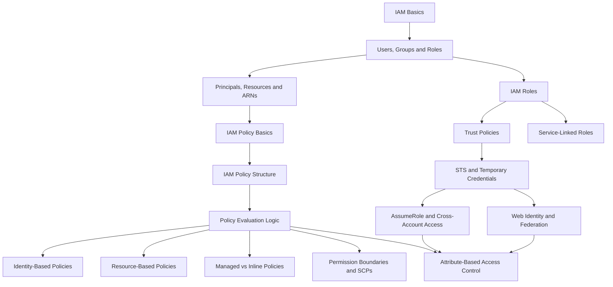
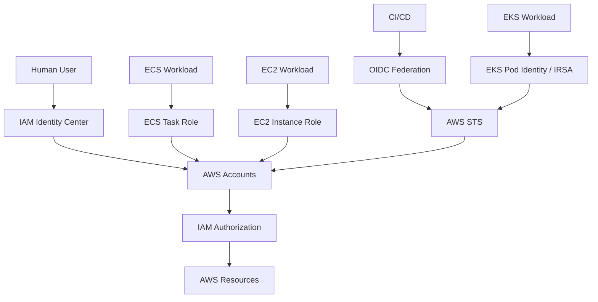

# README

## Overview

This folder contains the **AWS IAM concept layer** of the Backend Engineering Playbook.

The material is organized to build IAM knowledge progressively:

```text
IAM Fundamentals
      ↓
Policies
      ↓
Policy Evaluation
      ↓
Roles and Trust
      ↓
STS and Temporary Credentials
      ↓
Cross-Account Access
      ↓
Federation and Workload Identity
      ↓
Advanced Authorization
      ↓
Production Architecture and Security
```

The focus is on understanding IAM as an authorization system rather than memorizing individual policy statements.

For senior backend engineering, the most important skill is being able to trace an AWS authorization decision from:

```text
Principal
    ↓
Credentials / Session
    ↓
Trust
    ↓
Policy Evaluation
    ↓
Conditions
    ↓
Organization Controls
    ↓
Resource Policy
    ↓
AWS Resource
```

---

## Navigation

| # | File | Description |
|---|---|---|
| 01 | [01- IAM Basics](./01-%20IAM%20Basics.md) | Authentication, authorization, users, roles, permissions, resources, and IAM fundamentals |
| 02 | [02- Users, Groups and Roles](./02-%20Users%2C%20Groups%20and%20Roles.md) | IAM identity types, lifecycle, usage patterns, and role-based access |
| 03 | [03- Principals, Resources and ARNs](./03-%20Principals%2C%20Resources%20and%20ARNs.md) | Principals, AWS resources, ARNs, resource identification, and identity relationships |
| 04 | [04- IAM Policy Basics](./04-%20IAM%20Policy%20Basics.md) | Policy concepts, permissions, allow/deny, identity-based and resource-based authorization |
| 05 | [05- IAM Policy Structure](./05-%20IAM%20Policy%20Structure.md) | Version, Statement, Effect, Action, Resource, Principal, and Condition fields |
| 06 | [06- Policy Evaluation Logic](./06-%20Policy%20Evaluation%20Logic.md) | Default deny, explicit deny, explicit allow, policy sources, boundaries, SCPs, and conditions |
| 07 | [07- Identity-Based Policies](./07-%20Identity-Based%20Policies.md) | Policies attached to users, groups, and roles |
| 08 | [08- Resource-Based Policies](./08-%20Resource-Based%20Policies.md) | Resource-side authorization using policies on services such as S3, SQS, and SNS |
| 09 | [09- Managed vs Inline Policies](./09-%20Managed%20vs%20Inline%20Policies.md) | AWS-managed, customer-managed, and inline policy design and lifecycle |
| 10 | [10- Permission Boundaries and SCPs](./10-%20Permission%20Boundaries%20and%20SCPs.md) | Maximum permission boundaries and organization-level guardrails |
| 11 | [11- IAM Roles](./11-%20IAM%20Roles.md) | Role structure, sessions, temporary credentials, service roles, instance profiles, and role lifecycle |
| 12 | [12- Trust Policies](./12-%20Trust%20Policies.md) | Who can assume roles, principals, conditions, external IDs, OIDC, and trust design |
| 13 | [13- STS and Temporary Credentials](./13-%20STS%20and%20Temporary%20Credentials.md) | AWS STS, temporary credentials, AssumeRole, web identity, sessions, and credential refresh |
| 14 | [14- AssumeRole and Cross-Account Access](./14-%20AssumeRole%20and%20Cross-Account%20Access.md) | Cross-account roles, trust relationships, role assumption, external IDs, and multi-account access |
| 15 | [15- Web Identity and Federation](./15-%20Web%20Identity%20and%20Federation.md) | OIDC, SAML, IAM Identity Center, CI/CD federation, EKS identity, and temporary access |
| 16 | [16- Service-Linked Roles](./16-%20Service-Linked%20Roles.md) | AWS-owned roles, lifecycle, permissions, service integrations, and operational considerations |
| 17 | [17- Attribute-Based Access Control](./17-%20Attribute-Based%20Access%20Control.md) | ABAC, principal/resource tags, session tags, tag governance, and scalable authorization |

---

## Recommended Reading Order

The files are intentionally numbered in dependency order.

### Identity Fundamentals

Start by understanding:

```text
IAM Basics
    ↓
Users, Groups and Roles
    ↓
Principals, Resources and ARNs
```

These establish the vocabulary required for everything that follows.

### Policies

Next build the policy model:

```text
IAM Policy Basics
    ↓
IAM Policy Structure
    ↓
Policy Evaluation Logic
    ↓
Identity-Based Policies
    ↓
Resource-Based Policies
    ↓
Managed vs Inline Policies
```

At this stage, the key question should be:

```text
Given a principal, policy set, request, and resource,
why does AWS allow or deny the request?
```

### Advanced Role Authorization

Then move into roles and delegated access:

```text
Permission Boundaries and SCPs
    ↓
IAM Roles
    ↓
Trust Policies
```

These concepts are essential for understanding production AWS identity architecture.

### Temporary Credentials and Federation

Continue with:

```text
STS and Temporary Credentials
    ↓
AssumeRole and Cross-Account Access
    ↓
Web Identity and Federation
```

This section covers the identity patterns used by:

```text
CI/CD
ECS
EC2
Lambda
EKS
Cross-account systems
Federated workforce access
Third-party integrations
```

### AWS Service Ownership and Advanced Authorization

Finish the concept layer with:

```text
Service-Linked Roles
    ↓
Attribute-Based Access Control
```

These introduce AWS-owned identity behavior and scalable attribute-driven authorization.

---

## Concept Dependency Map



---

## IAM Mental Model

For day-to-day backend engineering, use this authorization model:

```text
Who?
    ↓
Principal

How are they authenticated?
    ↓
Credentials / Role Session / Federation

What are they trying to do?
    ↓
Action

What are they trying to access?
    ↓
Resource

Which policies apply?
    ↓
Identity + Resource + Session + Boundary + SCP/RCP

What contextual attributes exist?
    ↓
Conditions / Tags / MFA / Source / Organization

Is there an explicit deny?
    ↓
Final decision
```

This model should be used when troubleshooting `AccessDenied`, designing roles, reviewing policies, and preparing for senior-level IAM interviews.

---

## Core IAM Concepts

| Area | Questions to answer |
|---|---|
| Identity | Who is making the request? |
| Authentication | How did the principal obtain AWS credentials? |
| Authorization | What permissions does the principal have? |
| Trust | Who can assume the role? |
| Policy | Which actions and resources are allowed? |
| Conditions | Under what request context is access allowed? |
| Boundaries | What limits the maximum permission set? |
| Organization | What do SCPs or organizational controls restrict? |
| Resource policy | What does the target resource permit? |
| Session | Is access temporary, delegated, or federated? |
| Attributes | Do tags or identity attributes influence access? |

---

## Modern Identity Architecture

A production AWS architecture should generally distinguish between **workforce identity**, **workload identity**, and **delegated access**.



The application itself should generally remain unaware of long-lived AWS credentials.

Instead:

```text
Application
    ↓
AWS SDK
    ↓
Runtime Identity
    ↓
Temporary Credentials
    ↓
AWS API
```

---

## Backend Engineering Relevance

IAM is directly involved in common backend infrastructure:

| Technology | IAM relevance |
|---|---|
| Django | S3, Secrets Manager, SQS, CloudWatch, deployment |
| FastAPI | AWS SDK access to application dependencies |
| Celery | SQS, S3, Secrets Manager, event workflows |
| Docker | Container runtime identity |
| ECS | Task roles, execution roles, service identity |
| Kubernetes | EKS Pod Identity, IRSA, service-account identity |
| Kafka | AWS resource authorization where managed AWS services are involved |
| Redis | Secrets and infrastructure access |
| CI/CD | OIDC and deployment roles |
| Nginx | Usually indirect; IAM applies to AWS resources behind or around the service |
| PostgreSQL | Secrets Manager, RDS administration, encryption, deployment |
| gRPC | Service identity and AWS resource permissions in distributed systems |

The key engineering rule is:

```text
Do not distribute AWS credentials between services.

Give each workload an identity.
```

---

## Production IAM Architecture

A mature AWS environment commonly separates:

```text
Human Access
    ↓
IAM Identity Center

CI/CD
    ↓
OIDC + Deployment Roles

Applications
    ↓
Workload Roles

Cross-Account Access
    ↓
AssumeRole

Resource-Level Delegation
    ↓
Resource Policies

Organization Guardrails
    ↓
SCPs / RCPs

Dynamic Authorization
    ↓
ABAC
```

The controls complement each other rather than replacing one another.

---

## Security Priorities

IAM design should prioritize:

```text
Least Privilege
        ↓
Temporary Credentials
        ↓
Strong Trust Relationships
        ↓
Centralized Workforce Identity
        ↓
Workload Identity
        ↓
Attribute Integrity
        ↓
Auditability
```

Avoid:

```text
Hard-coded access keys
Shared IAM users
Shared application credentials
Wildcard administrator policies
Broad cross-account trust
Uncontrolled tag modification
Unreviewed role chaining
```

---

## Common IAM Troubleshooting Pattern

When an AWS request fails:

```text
1. Identify the current principal

2. Verify the AWS account

3. Identify the requested action

4. Identify the target resource

5. Inspect identity-based policies

6. Inspect resource-based policies

7. Inspect trust policies if AssumeRole is involved

8. Check session policies

9. Check permissions boundaries

10. Check SCP / organization restrictions

11. Check condition values

12. Check explicit denies

13. Check service-specific authorization
```

Start with:

```bash
aws sts get-caller-identity
```

Then investigate the authorization path rather than immediately adding broader permissions.

---

## Senior-Level Focus Areas

These concepts should be understood deeply rather than memorized:

```text
Policy Evaluation
    ↓
Trust Policies
    ↓
Temporary Credentials
    ↓
AssumeRole
    ↓
Cross-Account Access
    ↓
Federation
    ↓
Workload Identity
    ↓
Permission Boundaries
    ↓
SCPs
    ↓
ABAC
    ↓
Authorization Troubleshooting
```

A strong senior-level explanation should be able to answer:

```text
Who is the caller?

How did they authenticate?

Which role or session represents them?

Why is that role trusted?

Which policies apply?

Which conditions are evaluated?

Is there an explicit deny?

What organizational guardrails apply?

What resource policy applies?

Why did AWS ultimately allow or deny the request?
```

---

## Quick Command Reference

### Identify Current Principal

```bash
aws sts get-caller-identity
```

### List IAM Roles

```bash
aws iam list-roles
```

### List Service-Linked Roles

```bash
aws iam list-roles \
    --path-prefix /aws-service-role/
```

### Inspect a Role

```bash
aws iam get-role \
    --role-name <role-name>
```

### Assume a Role

```bash
aws sts assume-role \
    --role-arn arn:aws:iam::<account-id>:role/<role-name> \
    --role-session-name <session-name>
```

### Validate an Assumed Role

```bash
aws sts get-caller-identity
```

### Simulate Permissions

```bash
aws iam simulate-principal-policy \
    --policy-source-arn arn:aws:iam::<account-id>:role/<role-name> \
    --action-names s3:GetObject \
    --resource-arns arn:aws:s3:::<bucket>/<key>
```

The exact simulation parameters depend on the identity and target resource.

---

## Interview Preparation Map

| Interview area | Relevant files |
|---|---|
| IAM fundamentals | 01, 02, 03 |
| Policy structure | 04, 05 |
| Policy evaluation | 06 |
| Identity vs resource policies | 07, 08 |
| Policy lifecycle | 09 |
| Boundaries and SCPs | 10 |
| Roles | 11 |
| Trust relationships | 12 |
| STS and temporary credentials | 13 |
| Cross-account access | 14 |
| Federation and OIDC | 15 |
| AWS service identity | 16 |
| ABAC and advanced authorization | 17 |

High-value interview areas include:

```text
Trust policy vs permission policy
IAM role vs IAM user
Temporary credentials vs access keys
AssumeRole flow
Cross-account authorization
OIDC federation
EKS workload identity
Permissions boundary vs SCP
Identity-based vs resource-based policies
ABAC vs RBAC
AccessDenied troubleshooting
```

---

## Common IAM Misconceptions

| Misconception | Correct model |
|---|---|
| A role policy determines who can assume the role | Trust policy determines who may assume it |
| AssumeRole gives the caller the target account's permissions | It creates a temporary session for the target role |
| Successful AssumeRole means S3 access will work | Resource authorization still applies |
| STS itself grants business permissions | STS provides credentials; IAM policies authorize actions |
| Temporary credentials are automatically safe | They still require least privilege and secret protection |
| SCPs grant permissions | SCPs constrain account permissions |
| Permission boundaries grant permissions | They limit the maximum permissions available |
| All AWS resources support ABAC | Service/resource support varies |
| Tags are automatically trusted | Authorization-sensitive tags must be governed |
| Service-linked roles are application roles | They are AWS-service-owned identities |
| OIDC tokens directly grant AWS API permissions | They establish federated identity for a role session |
| Resource policies and IAM policies are interchangeable | Their semantics depend on the service and principal |

---

## Recommended Study Strategy

Use the folder in three passes.

### First Pass: IAM Mechanics

Focus on:

```text
01 → 06
```

Build a strong mental model for:

```text
Identity
Policies
Policy evaluation
Authorization decisions
```

### Second Pass: Production Identity

Focus on:

```text
07 → 15
```

Understand:

```text
Roles
Trust
STS
Temporary credentials
Cross-account access
Federation
Workload identity
```

### Third Pass: Advanced Authorization

Focus on:

```text
16 → 17
```

Understand:

```text
AWS-owned service identities
ABAC
Tag governance
Attribute integrity
Production authorization architecture
```

For senior interviews, revisit:

```text
06
10
12
13
14
15
17
```

These topics contain many of the failure modes and architecture questions encountered in real AWS environments.

---

## Production Review Checklist

Before approving an IAM architecture or production change, verify:

```text
Identity
    □ Human and workload identities are separated
    □ Long-lived credentials are minimized

Trust
    □ Role trust is explicit and narrow
    □ Cross-account trust is justified
    □ Federation claims are restricted

Permissions
    □ Least privilege is applied
    □ Resource scope is appropriate
    □ Wildcards are justified

Authorization
    □ Policy evaluation is understood
    □ Explicit denies are accounted for
    □ Boundaries are considered
    □ SCPs are considered
    □ Resource policies are considered

Credentials
    □ Temporary credentials are preferred
    □ Credential refresh is automatic
    □ Secrets are not logged

Workloads
    □ ECS uses task roles appropriately
    □ EC2 uses instance roles
    □ Lambda uses execution roles
    □ EKS uses appropriate workload identity

Advanced Controls
    □ ABAC attributes are trusted
    □ Authorization tags are protected
    □ Service-linked roles are not misused

Operations
    □ CloudTrail visibility exists
    □ Access reviews are performed
    □ Unused permissions are identified
    □ IAM changes are auditable

Troubleshooting
    □ GetCallerIdentity is part of the standard workflow
    □ AccessDenied failures are analyzed layer by layer
```

## Key Takeaways

- **IAM is an authorization system, not just a collection of users and policies; the critical skill is understanding how identity, trust, policies, conditions, boundaries, organization controls, and resource policies combine into a final decision.**
- **Modern AWS architectures should prefer centralized workforce identity and temporary workload credentials over long-lived IAM user access keys.**
- **Roles, STS, `AssumeRole`, federation, workload identity, cross-account access, and ABAC form the core building blocks for production AWS identity architecture.**
- **IAM troubleshooting should always start by identifying the actual principal and then tracing the complete authorization path rather than blindly adding permissions.**
- **For senior backend engineering, IAM knowledge means being able to design least-privilege systems, explain authorization decisions step by step, and operate those systems safely across accounts, services, workloads, and environments.**