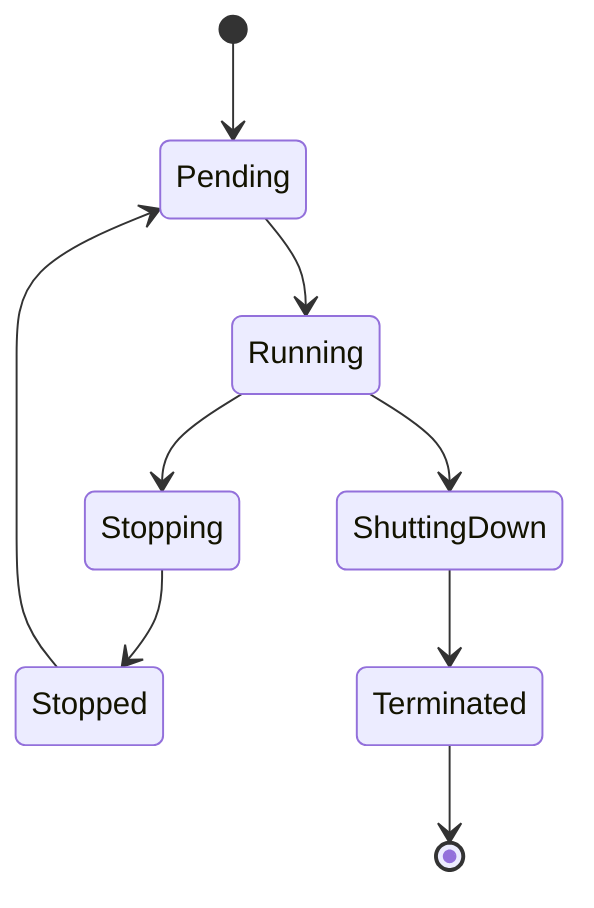
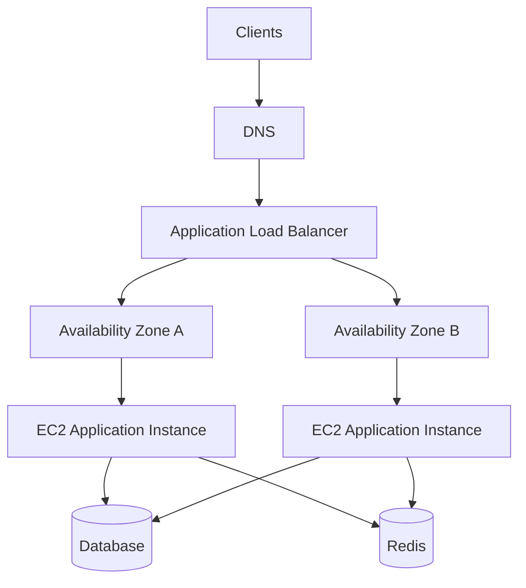

cli/
    01- AWS CLI Setup and Configuration.md
    02- EC2 Instance Inspection.md
    03- EC2 Instance Management.md
    04- AMI Management.md
    05- EBS Volume Management.md
    06- EBS Snapshot Management.md
    07- Security Group Management.md
    08- Key Pair Management.md
    09- Elastic IP Management.md
    10- Auto Scaling CLI.md
    11- Load Balancer CLI.md
    12- Querying and Filtering.md
    13- Output Formatting.md
    14- Operational CLI Workflows.md
    README.md

operations/
    01- EC2 Monitoring and Observability.md
    02- Instance Health and Status Checks.md
    03- Capacity and Resource Management.md
    04- Storage Operations.md
    05- Auto Scaling Operations.md
    06- Load Balancer Operations.md
    07- Backup and Recovery.md
    08- Instance Lifecycle Operations.md
    09- Cost Optimization.md
    10- Service Limits and Quotas.md
    11- Production Best Practices.md
    README.md
```
For your **EC2** documentation, I’d use the following topic guidance for the two areas we just structured:

```
EC2/
    cli/
        01- AWS CLI Setup and Configuration.md
            Cover installing/configuring AWS CLI for EC2 work, profiles, regions,
            credentials, verification, and safe CLI usage.

        02- EC2 Instance Inspection.md
            Cover commands for listing and inspecting instances, instance state,
            instance IDs, IP addresses, DNS names, AZs, instance types, tags,
            security groups, and related metadata.

        03- EC2 Instance Management.md
            Cover starting, stopping, rebooting, terminating, modifying,
            and describing EC2 instances using AWS CLI.

        04- AMI Management.md
            Cover creating, describing, copying, deregistering, and inspecting
            AMIs, including practical AMI lifecycle workflows.

        05- EBS Volume Management.md
            Cover listing, describing, attaching, detaching, modifying,
            and deleting EBS volumes using AWS CLI.

        06- EBS Snapshot Management.md
            Cover creating, describing, copying, restoring, and deleting
            EBS snapshots and practical snapshot workflows.

        07- Security Group Management.md
            Cover listing, describing, creating, modifying ingress/egress rules,
            revoking rules, and deleting security groups.

        08- Key Pair Management.md
            Cover creating, describing, importing, deleting, and managing
            EC2 key pairs through AWS CLI.

        09- Elastic IP Management.md
            Cover allocating, describing, associating, disassociating,
            and releasing Elastic IP addresses.

        10- Auto Scaling CLI.md
            Cover AWS CLI commands for Auto Scaling Groups, launch templates,
            scaling policies, desired capacity, instance health, and lifecycle
            inspection.

        11- Load Balancer CLI.md
            Cover CLI operations for ELB resources associated with EC2,
            including load balancers, listeners, target groups, and target
            health inspection.

        12- Querying and Filtering.md
            Cover --query, JMESPath expressions, filters, tag-based filtering,
            state filtering, and extracting specific EC2 information.

        13- Output Formatting.md
            Cover JSON, text, table, YAML where applicable, pagination,
            and producing CLI output suitable for scripts and automation.

        14- Operational CLI Workflows.md
            Cover practical multi-command workflows such as finding unhealthy
            instances, inspecting networking, investigating storage,
            identifying instances by tags, and performing safe operational
            checks.

        README.md


    operations/
        01- EC2 Monitoring and Observability.md
            Cover CloudWatch metrics, instance monitoring, CPU, network,
            disk-related metrics where applicable, alarms, dashboards,
            and operational visibility.

        02- Instance Health and Status Checks.md
            Cover system status checks, instance status checks, scheduled events,
            impaired instances, recovery mechanisms, and operational response.

        03- Capacity and Resource Management.md
            Cover instance capacity, resource utilization, right-sizing,
            instance selection, quotas, capacity planning, and avoiding
            resource exhaustion.

        04- Storage Operations.md
            Cover operational management of EBS and instance storage,
            volume utilization, resizing, snapshots, backup practices,
            attachment issues, and storage lifecycle management.

        05- Auto Scaling Operations.md
            Cover operating Auto Scaling Groups, desired/min/max capacity,
            scaling policies, health checks, replacement behavior,
            scaling events, and operational troubleshooting.

        06- Load Balancer Operations.md
            Cover operating EC2-backed load balancing, target registration,
            target health, listener configuration, health checks,
            connection behavior, and operational maintenance.

        07- Backup and Recovery.md
            Cover AMI and EBS snapshot strategies, recovery workflows,
            restoration considerations, backup validation, and disaster
            recovery practices relevant to EC2.

        08- Instance Lifecycle Operations.md
            Cover launch, stop, start, reboot, termination, replacement,
            maintenance, scheduled events, and safe instance lifecycle
            procedures.

        09- Cost Optimization.md
            Cover right-sizing, instance purchasing options, utilization,
            idle-resource identification, storage costs, Elastic IP costs,
            and practical EC2 cost-control practices.

        10- Service Limits and Quotas.md
            Cover EC2 quotas, EBS limits, networking-related limits,
            Auto Scaling limits, API throttling considerations, quota
            inspection, and requesting quota increases.

        11- Production Best Practices.md
            Cover operational standards for production EC2 environments,
            tagging, patching, monitoring, backups, access management,
            lifecycle management, reliability, and safe change practices.

        README.md
```

**One adjustment I recommend:** `01- AWS CLI Setup and Configuration.md` should stay **EC2-focused**. Don't turn it into a general AWS CLI tutorial. Your broader AWS CLI notes can live separately, while this file explains only what is needed to operate EC2 effectively.
```
# 01- EC2 Basics

## Overview

Amazon Elastic Compute Cloud (EC2) provides resizable compute capacity in AWS. An EC2 instance is a virtual server running inside an AWS Region and Availability Zone, with configurable compute, memory, networking, storage, operating system, and security controls.

For backend engineering, EC2 is important because many AWS architectures ultimately depend on compute instances directly or indirectly. EC2 can host Django and FastAPI applications, Celery workers, Nginx, background processors, internal services, CI runners, and custom workloads that require operating-system-level control.

EC2 is not simply "a virtual machine in the cloud." Its production behavior depends on how the instance is provisioned, networked, secured, monitored, scaled, and integrated with services such as VPC, EBS, IAM, CloudWatch, Elastic Load Balancing, and Auto Scaling.

---

## What EC2 Provides

An EC2 instance combines several independently managed resources:

| Component | Responsibility |
|---|---|
| Instance type | Defines compute, memory, networking, and sometimes accelerator capabilities |
| AMI | Provides the operating-system and software image used to launch an instance |
| EBS | Provides persistent block storage |
| Instance store | Provides temporary local block storage when available |
| VPC | Provides network placement and connectivity |
| Subnet | Determines the instance's network location within a VPC |
| Security group | Controls instance-level inbound and outbound traffic |
| IAM role | Provides temporary AWS permissions to applications running on the instance |
| Key pair | Provides one mechanism for administrative access to supported operating systems |
| User data | Runs initialization commands during instance launch |
| Elastic IP | Provides a static public IPv4 address when required |
| CloudWatch | Provides monitoring, metrics, alarms, and operational visibility |

A useful mental model is:

```text
                         AWS Region
                              |
                       Availability Zone
                              |
                            VPC
                              |
                           Subnet
                              |
                       EC2 Instance
                    /       |        \
                   /        |         \
               Compute    Storage    Network
                 |          |           |
          Instance Type   EBS      ENI / IPs
                 |          |           |
             CPU/Memory   Volumes   Security Group
```

---

## Why EC2 Exists

Traditional servers require organizations to purchase, provision, maintain, and physically operate infrastructure.

EC2 abstracts the physical infrastructure while retaining substantial operating-system control.

Instead of purchasing a physical server, an engineering team can define:

- CPU and memory requirements
- Operating system
- Storage
- Network placement
- Security rules
- IAM permissions
- Startup configuration
- Monitoring
- Scaling behavior

An instance can then be launched programmatically and replaced when necessary.

This makes EC2 useful for workloads where the engineering team needs control over the operating system, runtime, networking, or installed software.

---

## EC2 Instance Lifecycle

An EC2 instance is not simply running forever. It moves through lifecycle states.

The most important states are:

| State | Description |
|---|---|
| Pending | Instance is being launched |
| Running | Instance is executing and available for workload execution |
| Stopping | Instance is transitioning to stopped state |
| Stopped | Instance is not executing; attached EBS volumes can remain |
| Shutting-down | Instance is transitioning toward termination |
| Terminated | Instance has been permanently terminated |

A simplified lifecycle is:



Stopping and terminating are fundamentally different operations.

**Stop** generally preserves the instance configuration and attached EBS-backed resources so the instance can be started again.

**Terminate** permanently removes the instance. EBS volumes configured for deletion on termination can also be deleted.

For production systems, termination should therefore be treated as a destructive lifecycle operation.

---

## EC2 and the AWS Region

An EC2 instance runs inside a specific AWS Region and Availability Zone.

For example:

```text
Region
└── Availability Zone
    └── Subnet
        └── EC2 Instance
```

A Region contains multiple Availability Zones. An Availability Zone is an isolated infrastructure location within a Region.

An EC2 instance belongs to one Availability Zone.

This has important architectural consequences:

- An individual instance is not highly available by itself.
- Instance failure can affect the workload.
- Production applications should generally distribute instances across multiple Availability Zones.
- Auto Scaling Groups can maintain instances across Availability Zones.
- Load balancers can distribute traffic across healthy instances.

For a backend API, a production architecture might look like:



The important design principle is that the application should not depend on one EC2 instance being permanently available.

---

## Instance Types

An EC2 instance type determines the hardware characteristics exposed to the virtual server.

Important dimensions include:

- vCPUs
- Memory
- Network performance
- EBS bandwidth
- Local instance storage where available
- Accelerators for specialized instance families

AWS provides different instance families optimized for different workloads.

Typical categories include:

| Category | Typical workload |
|---|---|
| General purpose | Web applications, APIs, development workloads |
| Compute optimized | CPU-intensive services |
| Memory optimized | In-memory processing and large-memory applications |
| Storage optimized | High local-storage throughput workloads |
| Accelerated computing | GPU, ML, graphics, and specialized workloads |

For a Django or FastAPI application, general-purpose instances are often a reasonable starting point. The actual choice should be driven by observed CPU, memory, network, and application behavior rather than by a generic assumption.

---

## Instance Type Selection

Instance sizing is a capacity-planning decision.

For example, suppose a FastAPI service experiences:

- Low CPU utilization
- High memory utilization
- Stable request latency
- Moderate network traffic

Increasing CPU alone may not solve the bottleneck. A memory-oriented configuration or application-level memory optimization may be more appropriate.

Conversely, if a CPU-intensive Celery workload consistently saturates CPU while memory remains comfortable, a compute-oriented instance may be more appropriate.

A practical sizing workflow is:

```text
Workload
    |
    v
Measure CPU / Memory / Network / Disk
    |
    v
Identify bottleneck
    |
    v
Select candidate instance types
    |
    v
Load test
    |
    v
Measure cost and performance
    |
    v
Deploy and monitor
```

Avoid selecting instance types purely based on the number of vCPUs.

---

## Amazon Machine Images

An Amazon Machine Image (AMI) defines the image from which an EC2 instance is launched.

An AMI can contain:

- Operating system
- Installed packages
- Application dependencies
- Configuration
- Startup configuration
- Files required for the workload

A simplified launch flow is:

```text
AMI
 |
 | Launch
 v
EC2 Instance
 |
 +--> OS
 +--> Installed packages
 +--> Application/runtime
 +--> Configuration
```

For example, a backend team may create an image containing:

- Ubuntu
- Python
- Nginx
- Application runtime dependencies
- Monitoring agents
- Security tooling

The application itself may then be deployed separately through CI/CD.

This separation allows the operating-system image and application deployment lifecycle to evolve independently.

---

## EBS-Backed Instances

Most general-purpose EC2 workloads use Amazon EBS for persistent block storage.

A common arrangement is:

```text
EC2 Instance
     |
     +---- Root EBS Volume
     |
     +---- Application/Data EBS Volume
```

EBS volumes persist independently of the lifecycle of the EC2 instance, subject to their deletion configuration.

This is particularly important for:

- Database workloads
- Application data
- Logs that must persist
- Configuration that must survive instance replacement

However, production applications should generally avoid treating a single EC2 instance's local filesystem as the only source of durable application state.

For example, uploaded files for a Django application are often better stored in Amazon S3 rather than permanently tied to one EC2 instance.

---

## Instance Store

Some EC2 instance types provide instance store volumes.

Instance store is physically associated with the host running the instance and is intended for temporary data.

It can be useful for:

- Temporary processing
- Caches
- Scratch space
- High-performance ephemeral workloads

It should not be treated as durable storage.

If an instance is stopped, terminated, or otherwise loses the underlying host, data stored on instance store can be lost.

For durable application data, use appropriate persistent storage such as EBS, S3, or a managed database depending on the workload.

---

## Networking Basics

Every EC2 instance communicates through a network interface, commonly referred to as an Elastic Network Interface (ENI).

The instance receives network connectivity through its subnet and VPC configuration.

A simplified model is:

```text
Internet
    |
Internet Gateway
    |
VPC
    |
Subnet
    |
ENI
    |
EC2 Instance
```

The instance may have:

- Private IPv4 address
- Public IPv4 address
- Elastic IP address
- IPv6 address where configured

The private IP is used for communication within the VPC and connected networks.

A public address can provide Internet reachability when the surrounding VPC architecture and routing permit it.

---

## Security Groups

Security groups act as virtual firewalls associated with network interfaces.

They control allowed inbound and outbound traffic.

For example, a web server might allow:

```text
Internet
   |
   | TCP 443
   v
Security Group
   |
   v
EC2
```

A backend architecture might use different security groups for different roles:

```text
Internet
   |
   | HTTPS
   v
ALB Security Group
   |
   | Application traffic
   v
EC2 Security Group
   |
   | Database port
   v
Database Security Group
```

A strong production pattern is to allow traffic based on security-group relationships rather than exposing broad CIDR ranges unnecessarily.

For example, an application EC2 security group can permit database traffic from the application security group instead of allowing the database port from the entire Internet.

---

## IAM Roles for EC2

Applications running on EC2 often need to call AWS services.

The preferred mechanism is generally an IAM role attached to the instance rather than embedding long-lived AWS access keys in application configuration.

For example:

```text
Django / FastAPI
       |
       | AWS SDK
       v
EC2 Instance
       |
       | IAM Role
       v
AWS Service
```

A backend service may use an instance role to access:

- S3
- CloudWatch
- SSM
- Secrets Manager
- Other AWS APIs

The application can obtain temporary credentials through the EC2 instance metadata mechanism.

Avoid storing permanent AWS access keys in:

- Source code
- `.env` files
- Docker images
- AMIs
- Git repositories
- Application configuration files

Use IAM roles and least-privilege policies instead.

---

## User Data

EC2 user data provides initialization instructions that can run when an instance launches.

A common use case is bootstrapping a server:

```bash
#!/bin/bash

apt-get update
apt-get install -y nginx

systemctl enable nginx
systemctl start nginx
```

For production systems, user data should generally be treated as infrastructure bootstrap rather than as a replacement for a complete configuration-management or deployment system.

For example:

```text
AMI
 |
 +--> Base OS
 +--> Required system packages
 |
 v
User Data / Bootstrap
 |
 +--> Instance configuration
 |
 v
Deployment System
 |
 +--> Application
```

Long, complex deployment scripts embedded directly in user data can become difficult to version, test, and troubleshoot.

---

## EC2 Instance Metadata

EC2 instances can access instance metadata through the Instance Metadata Service (IMDS).

Metadata can provide information about the running instance, including:

- Instance identity
- Instance ID
- Instance type
- Region
- Availability Zone
- Network information
- IAM role credentials

Applications and operational scripts can use metadata to discover information about their execution environment.

IMDSv2 should be preferred because it introduces a session-oriented mechanism that provides additional protection against certain server-side request forgery scenarios.

Applications should not blindly query metadata. Only workloads that actually require metadata access should use it.

---

## EC2 for Backend Applications

A common backend deployment can use EC2 as the application compute layer:

```text
                         Internet
                            |
                            v
                    Application Load Balancer
                            |
                +-----------+-----------+
                |                       |
                v                       v
          EC2 Instance A          EC2 Instance B
                |                       |
          Nginx / App              Nginx / App
                |                       |
          Django / FastAPI         Django / FastAPI
                |                       |
                +-----------+-----------+
                            |
              +-------------+-------------+
              |                           |
              v                           v
         PostgreSQL                    Redis
```

For example:

- Nginx can terminate or proxy HTTP traffic.
- Gunicorn/Uvicorn can run the Python application.
- Celery workers can run on separate EC2 instances or capacity groups.
- Redis can provide caching or task-broker functionality.
- PostgreSQL can run as Amazon RDS rather than on the application instance.
- S3 can store object data rather than the EC2 filesystem.
- CloudWatch can provide metrics and logs.

This separation reduces coupling between application compute and stateful infrastructure.

---

## EC2 and Containerized Applications

EC2 can also serve as the underlying compute layer for container workloads.

For example:

```text
EC2
 |
 +-- Docker
      |
      +-- Nginx
      +-- FastAPI
      +-- Celery Worker
```

However, if container orchestration is required, AWS services such as Amazon ECS or Amazon EKS can provide higher-level orchestration capabilities.

The important distinction is:

```text
EC2
    = Compute infrastructure

Docker
    = Container runtime / packaging

ECS / EKS
    = Container orchestration
```

EC2 therefore remains useful even when the application architecture moves beyond manually managed virtual machines.

---

## Availability and Reliability

A single EC2 instance represents a single compute failure domain.

If the application runs only on one instance, failures such as:

- Instance hardware problems
- OS failures
- Application crashes
- Misconfiguration
- Availability Zone disruption
- Manual operational mistakes

can affect availability.

For production workloads, a common pattern is:

```text
                 Load Balancer
                 /            \
                /              \
        Availability Zone A   Availability Zone B
             EC2 A                EC2 B
                \                  /
                 \                /
                  Shared Services
```

Additional mechanisms such as Auto Scaling Groups and health checks can replace unhealthy instances.

High availability therefore comes from the architecture surrounding EC2, not from EC2 alone.

---

## Scaling

EC2 supports both vertical and horizontal scaling.

### Vertical Scaling

Increase the capacity of an instance.

```text
small instance
      |
      v
larger instance
```

This can be useful when a workload needs more CPU or memory but cannot easily be distributed.

The limitation is that there is still a single-instance dependency unless additional instances are introduced.

### Horizontal Scaling

Run multiple instances.

```text
                 Load Balancer
                 /     |     \
                /      |      \
             EC2 A   EC2 B   EC2 C
```

Horizontal scaling is generally more suitable for stateless web applications.

Applications should avoid storing critical mutable state only on one instance when horizontal scaling is required.

---

## Stateless Application Design

EC2-based application fleets work best when application instances are replaceable.

For a Django or FastAPI service, avoid relying on:

- Local uploaded files
- In-memory session state
- Instance-local queues
- Instance-local persistent databases
- Manual configuration changes that cannot be reproduced

Prefer external or managed services where appropriate:

| Requirement | Common approach |
|---|---|
| Object storage | Amazon S3 |
| Relational database | Amazon RDS / Aurora |
| Cache | Redis |
| Queue | Amazon SQS |
| Secrets | AWS Secrets Manager / Systems Manager Parameter Store |
| Logs | CloudWatch |
| Metrics | CloudWatch |
| Application traffic | Application Load Balancer |

This allows an unhealthy EC2 instance to be terminated and replaced without losing application state.

---

## Monitoring Considerations

Production EC2 workloads should be monitored at multiple levels.

### Infrastructure

Monitor:

- CPU utilization
- Network traffic
- Instance status checks
- EBS-related metrics
- Memory where an appropriate monitoring agent is installed
- Disk utilization inside the operating system

### Application

Monitor:

- Request latency
- HTTP error rates
- Throughput
- Worker utilization
- Queue depth
- Database latency
- Cache performance

### Availability

Monitor:

- Load balancer target health
- Auto Scaling events
- Instance replacement
- Failed health checks
- Application alarms

Infrastructure metrics alone cannot determine whether a backend application is healthy.

An instance can report low CPU while the application is returning HTTP 500 responses.

---

## Cost Considerations

EC2 cost depends on more than the hourly instance price.

Consider:

- Instance type
- Runtime duration
- Purchasing model
- EBS volumes
- EBS snapshots
- Elastic IP usage
- Data transfer
- Load balancing
- Monitoring
- Associated AWS services

For long-running predictable workloads, purchasing options such as Savings Plans or Reserved Instances may reduce compute cost compared with purely on-demand usage, depending on the workload and commitment requirements.

For interruptible workloads, Spot Instances can provide lower-cost capacity but require applications to tolerate interruption.

Cost optimization should therefore be based on workload characteristics rather than simply choosing the cheapest instance.

---

## Security Considerations

Production EC2 environments should follow least privilege and defense-in-depth principles.

Key practices include:

- Use IAM roles instead of long-lived access keys.
- Restrict security-group rules.
- Avoid exposing SSH directly to the Internet when alternatives such as Systems Manager are appropriate.
- Prefer IMDSv2.
- Patch operating systems and packages.
- Encrypt sensitive EBS volumes.
- Protect application secrets using managed secret-storage mechanisms.
- Log administrative and security-relevant activity.
- Avoid running unnecessary services.
- Use private subnets for instances that do not require direct Internet exposure.
- Separate application, database, and management access paths.

A public IP address should not automatically imply that an instance must accept inbound traffic from the entire Internet.

---

## Common Mistakes

### Treating an EC2 Instance as a Permanent Server

A production instance should generally be considered replaceable infrastructure.

Manual changes made directly to one instance create configuration drift.

Prefer reproducible infrastructure, immutable images where appropriate, and automated deployment.

### Storing Application State on the Instance

Local files and memory disappear when an instance is replaced or scaled horizontally.

Externalize state whenever the architecture requires durability or multiple instances.

### Using Long-Lived AWS Credentials

Embedding access keys in an EC2 application creates unnecessary credential-management risk.

Use an IAM role attached to the instance instead.

### Opening All Ports to the Internet

Rules such as:

```text
0.0.0.0/0
```

for administrative or internal ports are often unnecessarily broad.

Expose only required ports and restrict source networks wherever possible.

### Assuming Stop and Terminate Are Equivalent

Stopping an instance and terminating it have very different consequences.

Termination can permanently remove the instance and, depending on volume configuration, its attached storage.

### Choosing Instances Only by CPU Count

CPU is only one workload dimension.

Memory pressure, network throughput, EBS performance, application concurrency, and workload characteristics can be equally important.

### Running Databases on Application Instances Without a Clear Reason

A database running on the same EC2 instance as an application creates coupling between application and data availability.

For many production workloads, a managed database service provides operational advantages.

### Assuming Low CPU Means the Application Is Healthy

A service can be CPU-idle while experiencing:

- Database connection exhaustion
- Thread or worker exhaustion
- Network failures
- Deadlocks
- High request latency
- Dependency failures

Application-level monitoring is therefore required.

---

## Production Checklist

Before putting an EC2-hosted backend service into production, verify:

- Instance type is based on measured workload requirements.
- Instances are deployed in an appropriate VPC and subnet.
- Security groups expose only required ports.
- Administrative access is controlled.
- IAM roles use least privilege.
- IMDSv2 is enabled.
- EBS volumes are encrypted where appropriate.
- Application state is externalized where necessary.
- Monitoring and alarms are configured.
- Application and infrastructure logs are collected.
- Backups are defined for persistent data.
- Instance replacement is tested.
- Auto Scaling is considered for workloads requiring horizontal scaling.
- Load balancing is used where multiple application instances are required.
- Deployment is automated and reproducible.
- Termination and recovery procedures are documented.
- Cost and capacity are periodically reviewed.

---

## Key Takeaways

- EC2 provides configurable virtual compute, but production reliability comes from the surrounding architecture, not from an individual instance.
- Instance type, AMI, networking, storage, IAM, and lifecycle configuration should be treated as separate infrastructure concerns.
- Production backend workloads should generally favor replaceable, horizontally scalable instances with application state externalized to appropriate AWS services.
- IAM roles, restrictive security groups, IMDSv2, encrypted storage, patching, and controlled administrative access are core EC2 security practices.
- Monitor both infrastructure health and application behavior; low CPU utilization alone does not prove that an EC2-hosted service is healthy.