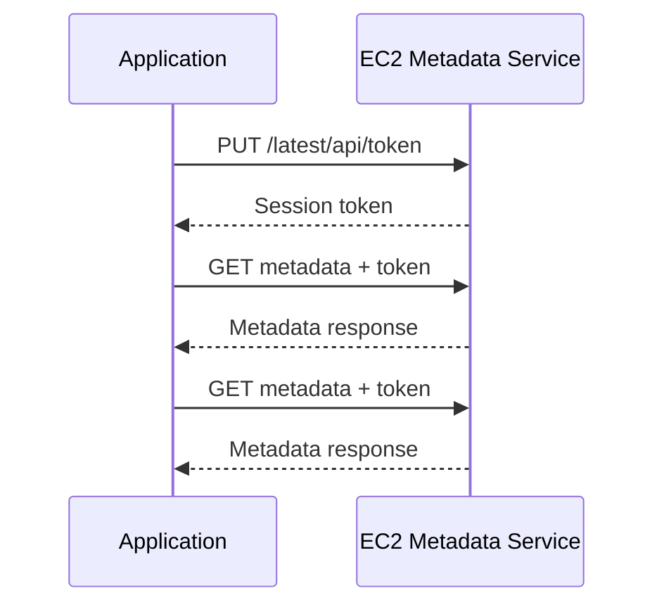
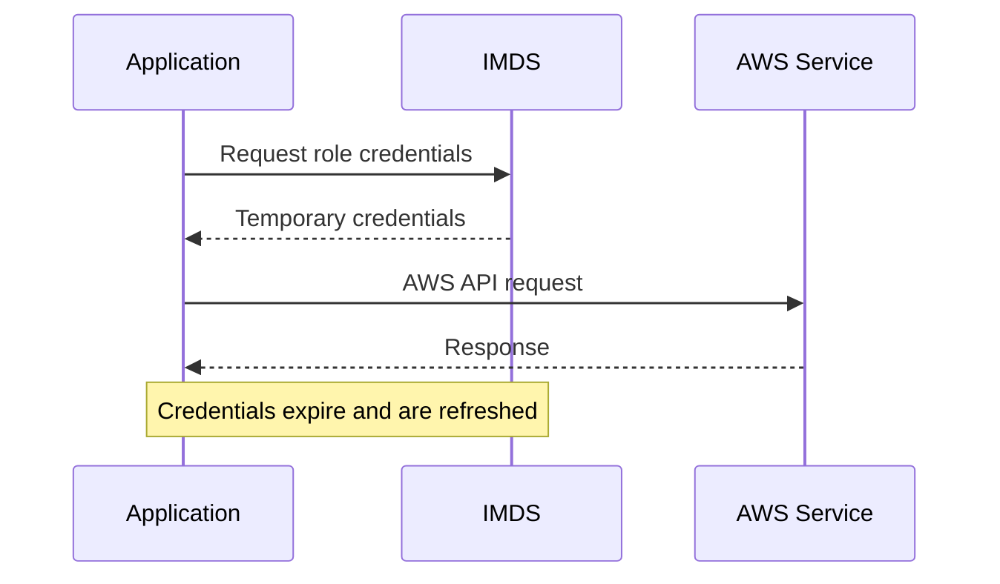

# 03- Instance Metadata

## Overview

EC2 instance metadata is information about the running EC2 instance and its execution environment that is made available through the Amazon EC2 Instance Metadata Service (IMDS).

Applications running on an EC2 instance can use IMDS to discover information such as:

- Instance identity
- Instance ID
- Instance type
- Availability Zone
- Region
- Network interfaces
- Private IP addresses
- IAM role information
- Temporary IAM credentials associated with the instance role
- Instance configuration and lifecycle information

For backend engineers, instance metadata is particularly important for automation, environment discovery, AWS SDK authentication, operational tooling, and security.

The metadata service is exposed through a link-local endpoint and is accessed from within the EC2 instance rather than through the public Internet.

---

## Instance Metadata Service

The EC2 Instance Metadata Service is available through:

```text
http://169.254.169.254
```

This address is link-local and is reachable from the instance itself.

The current recommended approach is **IMDSv2**, which uses a session-oriented request flow.

Conceptually:

```text
Application
    |
    | Request metadata
    v
EC2 Instance
    |
    | HTTP request to link-local endpoint
    v
IMDS
    |
    +--> Instance metadata
    +--> Instance identity
    +--> IAM role information
    +--> Temporary credentials
```

IMDS should be treated as an infrastructure interface rather than a general-purpose application API.

---

## Why Instance Metadata Exists

An EC2 instance often needs to know information about its own environment without requiring that information to be hard-coded into the application.

For example, an application may need to determine:

- Which AWS Region it is running in
- Which Availability Zone it belongs to
- Which instance it is running on
- Which IAM role is attached
- Which network interfaces are available
- Which temporary AWS credentials should be used

Without metadata, this information would have to be injected manually through configuration.

That creates unnecessary configuration management and can introduce drift.

For example:

```text
Without Metadata

Application
    |
    +--> Hard-coded Region
    +--> Hard-coded Instance ID
    +--> Static AWS credentials
    +--> Manually configured environment

With Metadata

Application
    |
    v
Instance Metadata Service
    |
    +--> Environment information
    +--> IAM role credentials
```

---

## IMDSv1 vs IMDSv2

EC2 supports two metadata access approaches:

| Characteristic | IMDSv1 | IMDSv2 |
|---|---|---|
| Request model | Direct request | Session-oriented |
| Authentication mechanism | No session token | Requires session token |
| SSRF resistance | Weaker | Stronger |
| Recommended for new workloads | No | Yes |
| Operational complexity | Lower | Slightly higher |

IMDSv2 requires the client to obtain a session token before retrieving metadata.

The token is then included in subsequent metadata requests.

---

## IMDSv2 Request Flow

The basic IMDSv2 flow is:



The initial `PUT` request establishes a metadata session.

The token is then supplied using the `X-aws-ec2-metadata-token` header.

---

## Accessing IMDSv2 from Linux

A basic IMDSv2 request can be performed using `curl`.

First obtain a token:

```bash
TOKEN=$(curl \
  -X PUT \
  -H "X-aws-ec2-metadata-token-ttl-seconds: 21600" \
  http://169.254.169.254/latest/api/token)
```

Then retrieve metadata:

```bash
curl \
  -H "X-aws-ec2-metadata-token: $TOKEN" \
  http://169.254.169.254/latest/meta-data/
```

The token lifetime can be selected according to the operational requirement, up to the service-supported limit.

For a specific value:

```bash
curl \
  -H "X-aws-ec2-metadata-token: $TOKEN" \
  http://169.254.169.254/latest/meta-data/instance-id
```

Example result:

```text
i-0123456789abcdef0
```

The actual value will depend on the instance.

---

## Common Metadata Categories

The metadata service exposes several categories of information.

Common paths include:

| Metadata path | Purpose |
|---|---|
| `instance-id` | Identifies the EC2 instance |
| `instance-type` | Identifies the instance type |
| `placement/availability-zone` | Identifies the Availability Zone |
| `placement/region` | Identifies the AWS Region |
| `local-ipv4` | Private IPv4 address |
| `public-ipv4` | Public IPv4 address when assigned |
| `hostname` | Instance hostname |
| `network/interfaces/` | Network interface information |
| `iam/security-credentials/` | IAM role and temporary credentials |

Metadata availability depends on the resource and configuration.

Do not assume that every instance has a public IPv4 address or every metadata field is populated.

---

## Instance Identity

The instance identity information allows software to identify the instance and its environment.

For example:

```bash
TOKEN=$(curl \
  -X PUT \
  -H "X-aws-ec2-metadata-token-ttl-seconds: 21600" \
  http://169.254.169.254/latest/api/token)

curl \
  -H "X-aws-ec2-metadata-token: $TOKEN" \
  http://169.254.169.254/latest/meta-data/instance-id
```

An operational script could use this value when:

- Tagging resources
- Writing logs
- Reporting health information
- Registering a worker
- Identifying the host during diagnostics

For example, an application log might include:

```text
instance_id=i-0123456789abcdef0
```

This makes it easier to correlate application behavior with infrastructure.

---

## Availability Zone and Region

Applications can discover their execution location.

For example:

```bash
TOKEN=$(curl \
  -X PUT \
  -H "X-aws-ec2-metadata-token-ttl-seconds: 21600" \
  http://169.254.169.254/latest/api/token)

curl \
  -H "X-aws-ec2-metadata-token: $TOKEN" \
  http://169.254.169.254/latest/meta-data/placement/availability-zone
```

An application may use this information for:

- Diagnostics
- Logging
- Topology awareness
- Operational decisions
- Region-aware configuration

However, infrastructure placement decisions should generally be managed through infrastructure configuration rather than hidden application assumptions.

---

## IAM Role Credentials

One of the most important capabilities associated with EC2 metadata is access to temporary credentials for an attached IAM role.

The conceptual flow is:

```text
Application
    |
    v
EC2 Metadata Service
    |
    v
IAM Role Credentials
    |
    v
AWS API
```

For example, an EC2 instance can have an IAM role allowing access to an S3 bucket.

The application can then use the AWS SDK without storing an access key and secret access key in the application configuration.

This is a major production advantage.

---

## IAM Role Credential Flow

A simplified credential flow is:



The credentials are temporary and associated with the IAM role attached to the instance.

AWS SDKs normally handle credential retrieval and refresh automatically when using the standard credential provider chain.

---

## Using IAM Roles from Python

A Python application using `boto3` generally does not need to manually query IMDS.

For example:

```python
import boto3

s3 = boto3.client("s3")

response = s3.list_buckets()

for bucket in response["Buckets"]:
    print(bucket["Name"])
```

When running on EC2 with an appropriate IAM role, the AWS SDK can obtain credentials through the instance metadata credential provider.

This is preferable to code such as:

```python
import boto3

s3 = boto3.client(
    "s3",
    aws_access_key_id="hard-coded-access-key",
    aws_secret_access_key="hard-coded-secret-key",
)
```

Long-lived credentials should not be embedded in application code.

---

## Metadata and Django

A Django application running on EC2 may use the AWS SDK to access services such as S3.

For example:

```text
Django
   |
   | boto3
   v
Credential Provider Chain
   |
   v
EC2 IAM Role
   |
   v
IMDS
   |
   v
Temporary Credentials
   |
   v
Amazon S3
```

The application does not need to know the actual credential values.

This is especially useful when the same application is deployed across multiple environments.

For example:

```text
Development
    -> local developer credentials

CI/CD
    -> CI identity

EC2 Production
    -> EC2 IAM role
```

The application can use the AWS SDK credential provider chain instead of implementing environment-specific authentication logic.

---

## Metadata and FastAPI

The same model applies to FastAPI services.

For example, an application can simply initialize an AWS client:

```python
import boto3
from fastapi import FastAPI

app = FastAPI()

s3 = boto3.client("s3")


@app.get("/health")
def health():
    return {"status": "ok"}
```

The AWS SDK determines how to obtain credentials.

The application should generally avoid directly implementing IMDS calls when the AWS SDK already provides the required functionality.

Direct metadata access is more appropriate for infrastructure-specific information that the SDK does not abstract.

---

## Credential Provider Chain

AWS SDKs typically use a credential provider chain rather than requiring applications to manually retrieve credentials.

A simplified model is:

```text
Application
    |
    v
AWS SDK
    |
    +--> Environment credentials
    |
    +--> Shared credential/configuration sources
    |
    +--> Task/container credentials
    |
    +--> EC2 instance role credentials
              |
              v
             IMDS
```

The exact provider order and available providers depend on the SDK and execution environment.

The important engineering principle is to let the AWS SDK handle credential retrieval whenever possible.

---

## Security: SSRF Risk

One major security concern with instance metadata is Server-Side Request Forgery (SSRF).

Consider a vulnerable backend:

```text
Internet
    |
    v
Web Application
    |
    | Attacker-controlled URL
    v
169.254.169.254
    |
    v
Metadata Service
```

If an attacker can make the application issue arbitrary HTTP requests, they may attempt to access metadata.

Historically, this could expose valuable information, including temporary IAM credentials.

IMDSv2 improves protection by requiring a session token obtained through a `PUT` request with a specific header.

This does not mean that an application with an SSRF vulnerability is safe.

The correct approach is defense in depth:

- Prevent SSRF vulnerabilities.
- Use IMDSv2.
- Apply least-privilege IAM policies.
- Restrict unnecessary outbound connectivity where appropriate.
- Avoid exposing sensitive metadata unnecessarily.
- Monitor suspicious behavior.

---

## IMDSv2 Configuration

For production EC2 environments, configure instances to require IMDSv2 where compatible with the workload.

Using AWS CLI, instance metadata options can be configured with:

```bash
aws ec2 modify-instance-metadata-options \
  --instance-id i-0123456789abcdef0 \
  --http-tokens required \
  --http-endpoint enabled
```

This requires an appropriate IAM permission.

You can inspect the configuration with:

```bash
aws ec2 describe-instances \
  --instance-ids i-0123456789abcdef0 \
  --query 'Reservations[].Instances[].MetadataOptions'
```

A production environment should verify metadata settings as part of its infrastructure baseline.

---

## Metadata Hop Limit

IMDSv2 also supports a metadata response hop limit.

This controls the number of network hops that metadata responses can traverse.

A lower hop limit can help reduce metadata exposure from network namespaces and certain container configurations.

For example:

```bash
aws ec2 modify-instance-metadata-options \
  --instance-id i-0123456789abcdef0 \
  --http-tokens required \
  --http-endpoint enabled \
  --http-put-response-hop-limit 1
```

The correct value depends on the workload.

Containerized applications require particular attention because network namespaces and container networking can affect how metadata requests reach the service.

Do not blindly change the hop limit in a production environment without validating the application's access model.

---

## Containers and Instance Metadata

Containers running directly on EC2 can potentially interact with the host's metadata service depending on network configuration.

This matters because multiple workloads may share the same EC2 host.

Consider:

```text
EC2 Host
 |
 +-- Container A
 |
 +-- Container B
 |
 +-- Container C
 |
 +-- IMDS
```

If an application inside a container can access metadata and the instance role has broad permissions, compromise of that application can potentially expose credentials available to the instance role.

This is one reason least-privilege IAM policies are essential.

For containerized workloads, prefer task or pod-level identity mechanisms where the orchestration platform supports them instead of giving every workload access to the EC2 instance role.

---

## Metadata and Kubernetes

When Kubernetes workloads run on EC2 nodes, metadata access deserves additional consideration.

A node-level IAM role should not automatically become the credential source for every workload running on that node.

Modern AWS container architectures can use workload-specific identity mechanisms so that:

```text
Pod A
  |
  +--> Identity A
  |
  +--> AWS permissions A

Pod B
  |
  +--> Identity B
  |
  +--> AWS permissions B
```

rather than:

```text
All Pods
    |
    v
EC2 Node IAM Role
    |
    v
Broad AWS Permissions
```

This reduces the blast radius if one application is compromised.

---

## When to Access Metadata Directly

Direct metadata access is appropriate when the application or operational tooling genuinely needs EC2-specific information.

Examples include:

- Discovering the instance ID
- Discovering the Availability Zone
- Detecting the Region
- Retrieving instance identity information
- Infrastructure diagnostics
- Specialized bootstrap scripts

Direct metadata access is generally unnecessary when an AWS SDK already abstracts the functionality.

For example, do not manually query metadata for AWS credentials in a Python application when `boto3` can retrieve them automatically.

---

## Metadata and User Data

Instance metadata and user data are related but serve different purposes.

| Feature | Instance metadata | User data |
|---|---|---|
| Primary purpose | Describe instance/environment | Bootstrap/configure instance |
| Direction | Application reads metadata | Instance executes supplied bootstrap data |
| Typical use | Environment discovery | Initialization |
| Credential access | Can expose IAM role credentials | Not a credential store |
| Runtime access | Available through IMDS | Usually accessed through instance mechanisms |
| Security sensitivity | Potentially high | Depends on contents |

A useful distinction is:

```text
Metadata
    = "What environment am I running in?"

User Data
    = "What should happen when this instance starts?"
```

---

## Operational Use Cases

Instance metadata can be useful for operational automation.

For example, a diagnostic script can identify the current host:

```bash
TOKEN=$(curl \
  -X PUT \
  -H "X-aws-ec2-metadata-token-ttl-seconds: 21600" \
  http://169.254.169.254/latest/api/token)

INSTANCE_ID=$(curl \
  -s \
  -H "X-aws-ec2-metadata-token: $TOKEN" \
  http://169.254.169.254/latest/meta-data/instance-id)

AZ=$(curl \
  -s \
  -H "X-aws-ec2-metadata-token: $TOKEN" \
  http://169.254.169.254/latest/meta-data/placement/availability-zone)

printf 'instance_id=%s availability_zone=%s\n' "$INSTANCE_ID" "$AZ"
```

This can help when troubleshooting a host-specific problem.

For more complex automation, however, AWS CLI, Systems Manager, CloudWatch, or other management services may provide better operational interfaces.

---

## Performance Considerations

Metadata requests are lightweight, but applications should not repeatedly query metadata unnecessarily.

For example, avoid making a metadata request on every API request:

```text
HTTP Request
    |
    v
Django
    |
    +--> IMDS request
    |
    +--> Application logic
```

If the value changes infrequently, cache it appropriately:

```text
Application Startup
       |
       v
Retrieve Instance ID
       |
       v
Cache locally
       |
       v
Application Requests
       |
       +--> Use cached value
```

Credential refresh should generally be delegated to the AWS SDK rather than implemented manually.

---

## Common Mistakes

### Using IMDSv1 for New Production Workloads

IMDSv1 does not provide the same session-oriented protection as IMDSv2.

Prefer IMDSv2 and configure:

```text
HttpTokens = required
```

where compatible with the workload.

### Hard-Coding AWS Credentials

An EC2 application does not need long-lived access keys simply because it needs to call AWS services.

Use an IAM role and the AWS SDK credential provider chain.

### Giving the EC2 Role Excessive Permissions

If metadata credentials are compromised, the permissions of the instance role determine the potential blast radius.

Follow least privilege.

### Querying Metadata on Every Request

Metadata is infrastructure information, not an application database.

Cache static values and let SDKs manage credential refresh.

### Assuming Public IPs Always Exist

An EC2 instance can operate entirely with private addressing.

Do not build application logic around the assumption that `public-ipv4` is always available.

### Exposing Metadata Through an API

Never create an endpoint such as:

```text
GET /debug/metadata
```

that blindly returns metadata responses to clients.

This can expose infrastructure information or credentials.

### Assuming IMDSv2 Eliminates SSRF Risk

IMDSv2 provides an additional security control but does not fix the underlying application vulnerability.

An application should still validate and restrict user-controlled URLs and outbound requests.

### Sharing Broad Node Credentials with Containers

Containerized workloads should not automatically inherit broad permissions from the underlying EC2 node role.

Use workload-specific identity mechanisms where available.

---

## Production Best Practices

For production EC2 environments:

- Prefer IMDSv2.
- Require tokens unless a documented compatibility requirement prevents it.
- Use least-privilege IAM roles.
- Let AWS SDKs handle credential retrieval and refresh.
- Avoid long-lived AWS credentials on instances.
- Do not expose metadata through application endpoints.
- Treat metadata credentials as sensitive.
- Review metadata access when deploying containers.
- Consider the metadata hop limit based on the workload.
- Avoid unnecessary direct metadata calls.
- Monitor and investigate unexpected access patterns.
- Include metadata configuration in infrastructure-as-code baselines.
- Test applications when changing metadata settings.
- Use workload-specific AWS identities for containerized platforms where appropriate.

---

## Troubleshooting Metadata Access

If an application cannot access metadata, check the following:

### Verify the Metadata Endpoint

```bash
curl \
  http://169.254.169.254/latest/meta-data/
```

If IMDSv2 is required, this direct request may fail because it does not contain a valid token.

### Request an IMDSv2 Token

```bash
TOKEN=$(curl \
  -X PUT \
  -H "X-aws-ec2-metadata-token-ttl-seconds: 21600" \
  http://169.254.169.254/latest/api/token)
```

Then retry the metadata request with the token.

### Check Instance Metadata Options

```bash
aws ec2 describe-instances \
  --instance-ids i-0123456789abcdef0 \
  --query 'Reservations[].Instances[].MetadataOptions'
```

Check:

- `HttpEndpoint`
- `HttpTokens`
- `HttpPutResponseHopLimit`

### Check Container Networking

If the application runs inside Docker or another container runtime, verify whether its network namespace can reach IMDS and whether the configured hop limit is compatible with the architecture.

### Check IAM Role Configuration

If the problem involves AWS credentials rather than ordinary metadata, verify:

- An IAM role is attached.
- The role has the required permissions.
- The application is using the expected AWS SDK credential provider chain.
- Credentials have not expired unexpectedly.
- Metadata access is not being blocked by the workload configuration.

---

## Interview Considerations

### What is EC2 instance metadata?

It is information about the EC2 instance and its execution environment exposed through the EC2 Instance Metadata Service.

### What is IMDS?

IMDS is the service through which an EC2 instance can retrieve instance metadata and, when an IAM role is attached, temporary role credentials.

### Why is IMDSv2 preferred?

IMDSv2 uses a session-token-based request flow that provides stronger protection against certain metadata abuse scenarios, including some SSRF exploitation paths.

### How does an EC2 application obtain AWS credentials?

When an IAM role is attached, supported AWS SDKs can obtain temporary credentials through the EC2 metadata credential provider.

### Should applications call IMDS directly for AWS credentials?

Generally no. Use the AWS SDK credential provider chain so credential retrieval and refresh are handled by the SDK.

### What happens if the EC2 IAM role has excessive permissions?

If an attacker obtains the role's temporary credentials, the attacker may be able to perform any actions permitted by that role. Least-privilege IAM therefore limits the potential blast radius.

### Why is metadata access important for containers?

Containers sharing an EC2 host may potentially reach the instance metadata service. If all workloads inherit a powerful node role, compromise of one workload can expose broader AWS permissions.

---

## Key Takeaways

- EC2 Instance Metadata Service provides runtime information about the instance and can provide temporary IAM role credentials.
- IMDSv2 should be preferred and, where compatible, configured with `HttpTokens` set to `required`.
- AWS SDKs should normally handle IAM credential retrieval and refresh rather than application code directly querying IMDS.
- Instance metadata is security-sensitive; least-privilege IAM, SSRF protection, and careful container identity design are essential.
- Metadata should be used for genuine infrastructure discovery and automation, not as a general application data source.