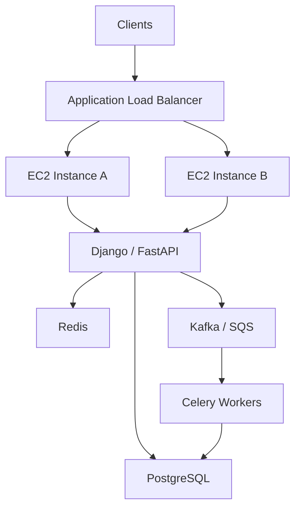

# README

## Overview

This directory contains the foundational concepts required to understand Amazon EC2 before moving into architecture, security, CLI, operations, troubleshooting, and interview-specific material.

EC2 is AWS's core virtual compute service. Understanding EC2 at an engineering level requires more than knowing how to launch an instance. A production backend engineer should understand instance sizing, purchasing models, networking, storage, access, lifecycle management, metadata, availability, and how EC2 participates in larger architectures.

The fundamentals are organized into focused topics so that each concept can be studied independently while still forming a coherent EC2 knowledge base.

## Navigation

| # | File | Description |
|---|---|---|
| 01 | [01- EC2 Basics](./01-%20EC2%20Basics.md) | Core EC2 concepts, instances, AMIs, regions, Availability Zones, lifecycle, and fundamental architecture |
| 02 | [02- Instance Types](./02-%20Instance%20Types.md) | CPU, memory, networking, storage characteristics, instance families, architecture, sizing, and workload selection |
| 03 | [03- Instance Metadata](./03-%20Instance%20Metadata.md) | Instance metadata service, IMDSv2, IAM role credentials, metadata security, and operational access |
| 04 | [04- Purchasing Options](./04-%20Purchasing%20Options.md) | On-Demand, Savings Plans, Reserved Instances, Spot, Dedicated Hosts, Dedicated Instances, and Capacity Reservations |

## Topics

| File | Topic | Primary Focus |
|---|---|---|
| `01- EC2 Basics.md` | EC2 Basics | Core EC2 concepts, instances, AMIs, regions, Availability Zones, lifecycle, and fundamental architecture |
| `02- Instance Types.md` | Instance Types | CPU, memory, networking, storage characteristics, instance families, architecture, sizing, and workload selection |
| `03- Instance Metadata.md` | Instance Metadata | Instance metadata service, IMDSv2, IAM role credentials, metadata security, and operational access |
| `04- Purchasing Options.md` | Purchasing Options | On-Demand, Savings Plans, Reserved Instances, Spot, Dedicated Hosts, Dedicated Instances, and Capacity Reservations |

## Recommended Reading Order

The topics are intentionally ordered from core concepts toward operational and architectural decisions.


### EC2 Basics

Start with the fundamental EC2 model:

- What an EC2 instance is
- AMIs
- Regions and Availability Zones
- Instance lifecycle
- Basic instance architecture
- Public and private networking concepts
- EBS fundamentals
- Security groups
- Instance termination and recovery concepts

This establishes the vocabulary required for the remaining topics.

### Instance Types

Next, learn how EC2 compute capacity is selected.

Focus on:

- General-purpose instances
- Compute-optimized instances
- Memory-optimized instances
- Storage-optimized instances
- Accelerated computing
- CPU architecture
- Instance sizing
- Network performance
- EBS performance
- Burstable instances
- Right-sizing

The goal is to understand **why a particular instance type is appropriate for a workload**, rather than memorizing instance names.

### Instance Metadata

Then study how an EC2 instance can obtain information about itself and access AWS-provided instance credentials.

Focus on:

- Instance Metadata Service
- IMDSv1 vs IMDSv2
- Metadata categories
- IAM role credentials
- Metadata security
- SSRF risks
- Containers and metadata access
- Metadata configuration
- Operational inspection

This topic becomes particularly important when working with IAM roles, Docker, Kubernetes, and production security.

### Purchasing Options

Finally, understand how EC2 capacity can be purchased and priced.

Focus on:

- On-Demand Instances
- Savings Plans
- Reserved Instances
- Spot Instances
- Dedicated Hosts
- Dedicated Instances
- Capacity Reservations
- Commitment planning
- Baseline vs burst capacity
- Cost optimization

The objective is to connect workload characteristics with an appropriate purchasing strategy.

## How the Fundamentals Fit Together

The four topics answer different questions about an EC2 workload.

| Question | Topic |
|---|---|
| What is EC2 and how does an instance work? | EC2 Basics |
| What compute configuration should I choose? | Instance Types |
| How does the instance identify itself and access AWS-provided credentials? | Instance Metadata |
| How should the compute capacity be purchased? | Purchasing Options |

Together they form the basic decision model:

```text
                    EC2 Workload
                         |
          +--------------+--------------+
          |              |              |
          v              v              v
       Compute        Identity       Capacity
      Selection        Access        Economics
          |              |              |
          v              v              v
   Instance Types   Metadata/IAM   Purchasing Options
                         |
                         v
                    EC2 Basics
```

## Backend Engineering Context

EC2 fundamentals become more useful when connected to the backend systems running on top of them.

A typical production backend might look like:



EC2 fundamentals affect decisions throughout this architecture:

- Instance type affects API and worker performance.
- Instance metadata affects instance identity and IAM access.
- Purchasing options affect compute cost.
- Availability Zones affect high availability.
- EBS affects persistent instance storage.
- Security groups affect network access.
- Instance lifecycle affects deployment and recovery.
- Auto Scaling determines how compute capacity changes with demand.

## Relationship to Other EC2 Topics

The fundamentals directory should be treated as the foundation for the remaining EC2 material.

```text
EC2
|
+-- Fundamentals
|   |
|   +-- EC2 Basics
|   +-- Instance Types
|   +-- Instance Metadata
|   +-- Purchasing Options
|
+-- Access
+-- Networking
+-- Storage
+-- Auto Scaling
+-- Load Balancing
|
+-- Architecture
+-- Security
+-- CLI
+-- Troubleshooting
+-- Operations
+-- Interview
```

The later topics should build on these fundamentals rather than repeating their detailed explanations.

## Practical Learning Approach

For each fundamentals topic, focus on four levels of understanding.

### Conceptual

Understand what the EC2 feature does and why AWS provides it.

### Implementation

Understand the AWS resources, configuration, APIs, CLI commands, and relationships involved.

### Production

Understand how the feature behaves under:

- Failure
- Scaling
- Security constraints
- Deployment changes
- Cost pressure
- Operational incidents

### Architectural

Understand how the feature affects a larger backend system.

For example, learning EC2 instance types should progress from:

```text
"What instance types exist?"
        |
        v
"What resources differ?"
        |
        v
"Which workload characteristics matter?"
        |
        v
"How do I measure the workload?"
        |
        v
"How do I right-size production capacity?"
        |
        v
"How does the choice affect scaling and cost?"
```

## Production Perspective

EC2 should not be treated as an isolated virtual machine.

In production, an EC2-based service normally depends on several surrounding systems:

| Concern | Typical AWS / Backend Component |
|---|---|
| Compute | EC2 |
| Image | AMI |
| Networking | VPC, subnet, route tables |
| Network security | Security groups, NACLs |
| Persistent storage | EBS |
| Load balancing | ALB / NLB |
| Scaling | Auto Scaling Groups |
| Identity | IAM roles |
| Monitoring | CloudWatch |
| Secrets | Secrets Manager / Systems Manager Parameter Store |
| DNS | Route 53 |
| Deployment | CI/CD |
| Application runtime | Django / FastAPI / gRPC |
| Background processing | Celery |
| Cache | Redis |
| Database | PostgreSQL |
| Messaging | Kafka / SQS |

Understanding EC2 means understanding how these components interact rather than treating the instance as the entire system.

## Common Learning Mistakes

### Memorizing Instance Names

Knowing that an instance is from a particular family is less valuable than understanding:

- CPU requirements
- Memory requirements
- Network requirements
- EBS requirements
- Workload characteristics
- Cost constraints

### Treating EC2 as a Traditional Server

Production EC2 instances should generally be treated as replaceable compute capacity.

Application state should be externalized whenever practical.

### Ignoring Availability Zones

A single EC2 instance in one Availability Zone creates a single point of failure.

Production architectures should use multiple instances and Availability Zones where availability requirements justify the additional complexity and cost.

### Ignoring Instance Metadata Security

Metadata is a legitimate operational interface, but unrestricted metadata access can become a security risk, particularly when applications are vulnerable to SSRF.

IMDSv2 and least-privilege IAM roles should be part of the production security model.

### Optimizing Cost Before Understanding Usage

Purchasing commitments or selecting specialized instance types before understanding workload behavior can create unnecessary financial and operational constraints.

Measure first, then optimize.

## Production Checklist

Before considering an EC2 workload production-ready, evaluate:

- [ ] Appropriate instance family selected
- [ ] Instance size validated against measured workload requirements
- [ ] Appropriate CPU architecture selected
- [ ] IAM role configured instead of static AWS credentials
- [ ] IMDSv2 enforced where appropriate
- [ ] Security groups follow least-privilege access
- [ ] Persistent data is stored appropriately
- [ ] Monitoring and alarms are configured
- [ ] Instance health is monitored
- [ ] Backup and recovery requirements are defined
- [ ] Multi-AZ deployment is considered where required
- [ ] Auto Scaling requirements are evaluated
- [ ] Load balancing requirements are evaluated
- [ ] Purchasing strategy matches workload characteristics
- [ ] Cost and utilization are monitored
- [ ] Instance lifecycle and replacement procedures are documented

## Navigation

### Fundamentals

- [01- EC2 Basics](./01-%20EC2%20Basics.md)
- [02- Instance Types](./02-%20Instance%20Types.md)
- [03- Instance Metadata](./03-%20Instance%20Metadata.md)
- [04- Purchasing Options](./04-%20Purchasing%20Options.md)

### Related EC2 Topics

- [Access](../access/README.md)
- [Networking](../networking/README.md)
- [Storage](../storage/README.md)
- [Auto Scaling](../autoscaling/README.md)
- [Load Balancing](../load-balancing/README.md)
- [Architecture](../../architecture/README.md)
- [Security](../../security/README.md)
- [CLI](../../cli/README.md)
- [Troubleshooting](../../troubleshooting/README.md)
- [Operations](../../operations/README.md)
- [Interview](../../interview/README.md)

## Key Takeaways

- EC2 fundamentals should cover compute characteristics, instance identity, purchasing models, lifecycle, and the surrounding AWS architecture.
- Instance selection should be driven by measured workload requirements rather than instance-name familiarity or CPU count alone.
- EC2 instances should generally be treated as replaceable compute capacity, with application state and critical data externalized appropriately.
- Production EC2 design requires consideration of IAM, networking, storage, monitoring, scaling, availability, recovery, and cost together.
- These fundamentals provide the foundation for the deeper EC2 access, networking, storage, architecture, security, CLI, troubleshooting, and operations topics.