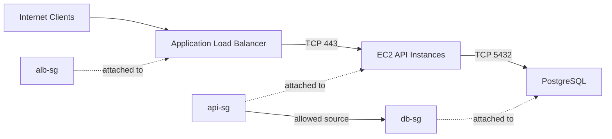
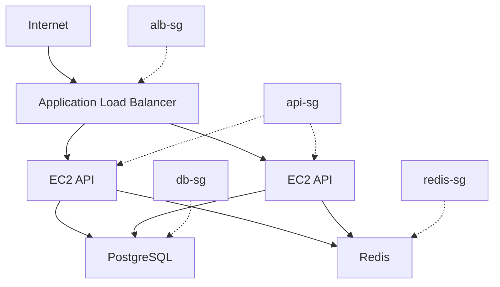
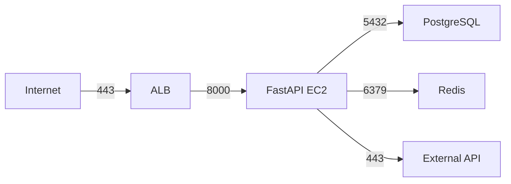
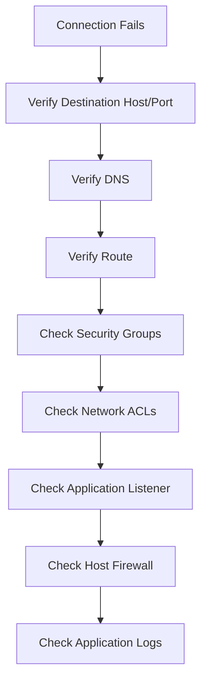

# 01- Security Groups

## Overview

An Amazon EC2 security group is a **stateful virtual firewall** that controls inbound and outbound network traffic for resources such as EC2 instances and network interfaces.

Security groups are one of the primary network security controls in an AWS VPC. They determine which traffic is allowed to reach an instance and which traffic the instance can initiate.

For backend systems, security groups commonly enforce boundaries such as:

```text
Internet
   |
   v
Application Load Balancer
   |
   | TCP 443
   v
EC2 Application Instances
   |
   | TCP 5432
   v
PostgreSQL
```

A typical security-group design allows:

- Clients to reach the load balancer.
- The load balancer to reach application instances.
- Application instances to reach the database.
- Application instances to reach required AWS services or external systems.

The key principle is to allow **only the traffic that the workload actually requires**.

---

## What Is a Security Group?

A security group is a logical collection of firewall rules associated with an Elastic Network Interface (ENI).

Because an EC2 instance normally has one or more ENIs, security-group rules ultimately control traffic to and from those network interfaces.

A security group contains:

- Inbound rules
- Outbound rules
- Protocol
- Port or port range
- Source or destination
- Optional description
- References to other security groups
- IPv4 and IPv6 CIDR ranges

Example:

| Direction | Protocol | Port | Source | Purpose |
|---|---|---:|---|---|
| Inbound | TCP | 443 | `0.0.0.0/0` | HTTPS from clients |
| Inbound | TCP | 22 | Admin CIDR | SSH administration |
| Outbound | TCP | 5432 | Database SG | PostgreSQL access |

Security groups operate at the instance/ENI level rather than being subnet-wide firewall rules.

---

## Why Security Groups Exist

A VPC provides the networking environment, but networking alone does not determine which applications are allowed to communicate.

Security groups provide workload-level network access control.

For example, two EC2 instances may be in the same subnet:

```text
Private Subnet
+--------------------------------------+
|                                      |
|  API Instance       Database         |
|  SG: api-sg          SG: db-sg       |
|      |                  |            |
|      +------ TCP 5432 --+            |
|                                      |
+--------------------------------------+
```

The subnet provides network connectivity.

The security groups determine whether the specific traffic is permitted.

This separation is important:

```text
VPC
 |
 +-- Subnet
 |    |
 |    +-- Routing
 |
 +-- Security Group
      |
      +-- Workload-level traffic policy
```

---

## Core Characteristics

### Stateful

Security groups are **stateful**.

If an inbound request is allowed, the response traffic is automatically allowed, regardless of whether an explicit outbound rule exists for that response.

Similarly, when an instance initiates an allowed outbound connection, the response traffic is automatically permitted.

For example:

```text
Client
  |
  | TCP SYN :443
  v
EC2
  |
  | TCP SYN-ACK
  v
Client
```

If the inbound HTTPS connection is allowed by the security group, the response does not require a separate inbound rule.

This differs from stateless network controls such as Network ACLs.

---

## Allow Rules Only

Security groups support **allow rules**.

They do not provide explicit deny rules.

For example:

```text
Allow TCP 443 from 0.0.0.0/0
```

You cannot add:

```text
Deny TCP 443 from 203.0.113.10
```

inside the same security group.

If you need explicit deny behavior, consider other controls such as:

- AWS WAF
- Network ACLs
- Application-level authorization
- Firewall services
- Routing architecture

The absence of deny rules is an important design characteristic.

---

## Inbound Rules

Inbound rules control traffic entering the resource through its network interface.

Example:

```text
Inbound
-----------------------------------
Protocol    Port    Source
TCP         443     0.0.0.0/0
TCP         22      10.0.10.0/24
```

This means:

- HTTPS is permitted from IPv4 clients anywhere.
- SSH is permitted only from the specified private CIDR.

A production application should avoid broad administrative access such as:

```text
TCP 22 -> 0.0.0.0/0
```

unless there is a specific and well-understood requirement.

---

## Outbound Rules

Outbound rules control traffic initiated from the resource.

A common default security-group configuration allows all outbound traffic.

For example:

```text
Outbound
-----------------------------------
Protocol    Port    Destination
All         All     0.0.0.0/0
```

Although convenient, unrestricted outbound access may not satisfy stricter security requirements.

For sensitive workloads, outbound traffic can be restricted to required destinations.

Example:

```text
EC2 Application
     |
     +---- TCP 5432 ----> Database
     |
     +---- TCP 443 -----> Required AWS/API endpoints
```

The appropriate level of outbound restriction depends on the application's architecture and security requirements.

---

## Security Group Evaluation

Security-group rules are evaluated collectively.

There is no rule ordering such as:

```text
Rule 1 -> Rule 2 -> Rule 3
```

Instead, if any applicable rule allows the traffic, it is permitted.

For example:

```text
Rule A:
TCP 443 from 10.0.0.0/16

Rule B:
TCP 443 from 192.168.1.0/24
```

Traffic from either source range is allowed.

There is no explicit deny rule that can override Rule A.

---

## Security Group References

One of the most important production features is the ability to reference another security group as the traffic source or destination.

Instead of allowing:

```text
TCP 5432 from 10.0.10.0/24
```

you can allow:

```text
TCP 5432 from api-sg
```

This creates an application-level relationship.



This is generally more maintainable than hardcoding instance IP addresses.

---

## Security Group References vs CIDR Rules

| Approach | Example | Best Use |
|---|---|---|
| Security group reference | `api-sg` → `db-sg:5432` | Service-to-service communication |
| CIDR | `10.0.10.0/24` → `db:5432` | Network-based access |
| Public CIDR | `0.0.0.0/0` → `443` | Public web traffic |
| Specific host CIDR | `203.0.113.10/32` → `22` | Narrow administrative access |

For dynamic EC2 fleets, security-group references are usually preferable to instance IP-based rules.

When instances are replaced by Auto Scaling, the relationship remains valid as long as the appropriate security group remains attached.

---

## Example: Three-Tier Backend Architecture

A common production architecture separates security groups by application tier.



The corresponding policy might be:

| Security Group | Direction | Port | Source |
|---|---|---:|---|
| `alb-sg` | Inbound | 443 | Internet |
| `api-sg` | Inbound | 8000 | `alb-sg` |
| `db-sg` | Inbound | 5432 | `api-sg` |
| `redis-sg` | Inbound | 6379 | `api-sg` |

This expresses the architecture directly:

```text
Internet
   |
  443
   |
 alb-sg
   |
  8000
   |
 api-sg
   |
 +---- 5432 ----> db-sg
 |
 +---- 6379 ----> redis-sg
```

The application instances do not need to be publicly reachable.

---

## Security Group Association

An EC2 instance can have one or more security groups associated with its network interfaces.

The effective permissions are the union of the applicable security-group rules.

For example:

```text
EC2 Instance
   |
   +-- sg-common
   |
   +-- sg-monitoring
   |
   +-- sg-application
```

If any associated security group allows the traffic, that traffic is allowed.

This has an important operational consequence:

> Adding another security group can unintentionally broaden access.

Always inspect **all** attached security groups before troubleshooting or changing access.

---

## Default Security Group

Every VPC has a default security group.

Its default behavior generally allows:

- Inbound traffic from resources associated with the same security group.
- Outbound traffic to anywhere.

The default security group should not automatically be used for production workloads.

A better approach is to create purpose-specific security groups.

For example:

```text
default
   |
   +-- Avoid using as application policy

alb-sg
api-sg
worker-sg
db-sg
redis-sg
```

Purpose-specific groups make access relationships easier to audit.

---

## Security Group Design Principles

### One Responsibility Per Security Group

Prefer groups with clear responsibilities.

Examples:

```text
alb-sg
api-sg
worker-sg
db-sg
redis-sg
```

Avoid a generic group such as:

```text
production-everything-sg
```

that permits unrelated services to communicate with each other.

### Reference Security Groups

For internal service communication, prefer:

```text
api-sg -> db-sg :5432
```

over:

```text
10.0.0.0/16 -> db :5432
```

when the architecture is based on workload identity rather than broad network membership.

### Restrict Administrative Ports

Avoid:

```text
0.0.0.0/0 -> TCP 22
```

Prefer:

- Systems Manager Session Manager
- Controlled administrative networks
- VPN
- Bastion architecture where justified
- Narrow source CIDRs

### Avoid Unnecessary Public Access

A backend API instance normally does not need:

```text
0.0.0.0/0 -> TCP 8000
```

if an Application Load Balancer is the public entry point.

Instead:

```text
Internet -> ALB :443
ALB SG -> API SG :8000
```

---

## Port Selection

Security groups should expose only the ports required by the application.

Common backend ports include:

| Port | Protocol | Typical Service |
|---:|---|---|
| 22 | TCP | SSH |
| 80 | TCP | HTTP |
| 443 | TCP | HTTPS |
| 8000 | TCP | Django/FastAPI application |
| 5432 | TCP | PostgreSQL |
| 6379 | TCP | Redis |
| 9092 | TCP | Kafka |
| 50051 | TCP | gRPC |

The actual port should match the service configuration.

Do not open a port merely because a framework commonly uses it.

---

## Security Group and Load Balancer Design

A common mistake is to expose the application instances directly to the internet because the load balancer is also public.

Instead:

```text
                    Internet
                       |
                    TCP 443
                       |
                       v
                +--------------+
                |     ALB      |
                |    alb-sg    |
                +--------------+
                       |
                    TCP 8000
                       |
                       v
                +--------------+
                | EC2 API      |
                |    api-sg    |
                +--------------+
```

Rules:

```text
alb-sg:
  inbound  TCP 443 from 0.0.0.0/0

api-sg:
  inbound  TCP 8000 from alb-sg
```

This creates a clean network boundary.

---

## Security Group and PostgreSQL

For PostgreSQL:

```text
db-sg:
    inbound TCP 5432 from api-sg
```

Do not use:

```text
db-sg:
    inbound TCP 5432 from 0.0.0.0/0
```

A database should generally be placed in private subnets and should not be directly accessible from the public internet.

The application layer should provide the controlled path:

```text
Client
  |
  v
ALB
  |
  v
API
  |
  v
PostgreSQL
```

---

## Security Group and Redis

Redis should similarly be restricted to workloads that require it.

```text
redis-sg:
    inbound TCP 6379 from api-sg
```

For a Celery architecture:

```text
Django / FastAPI
       |
       v
     Redis
       ^
       |
 Celery Workers
```

The Redis security group might therefore allow traffic from both:

```text
api-sg -> redis-sg :6379
worker-sg -> redis-sg :6379
```

Only workloads that genuinely require Redis access should be included.

---

## Security Group and gRPC

For internal gRPC communication:

```text
service-a-sg
      |
      | TCP 50051
      v
service-b-sg
```

The destination security group can allow:

```text
TCP 50051 from service-a-sg
```

This is preferable to allowing the entire VPC CIDR when only one service should communicate with the gRPC endpoint.

---

## Security Groups and Kubernetes

When EC2 hosts Kubernetes nodes, there are multiple networking layers:

```text
Internet
   |
   v
AWS Network
   |
Security Groups
   |
   v
Kubernetes Nodes
   |
   v
Pods / Services
   |
   v
Application
```

Security groups provide infrastructure-level network controls, while Kubernetes networking and NetworkPolicies can provide additional workload-level controls depending on the Kubernetes networking implementation.

Do not assume that an EC2 security group alone provides complete Kubernetes application isolation.

---

## Inbound and Outbound Example

Suppose a FastAPI application requires:

- HTTPS through an ALB
- PostgreSQL
- Redis
- HTTPS access to an external API

A possible configuration is:

```text
api-sg

Inbound:
  TCP 8000 from alb-sg

Outbound:
  TCP 5432 to db-sg
  TCP 6379 to redis-sg
  TCP 443 to required destinations
```

The traffic model becomes:



The security group should reflect this actual dependency graph.

---

## AWS CLI

### List Security Groups

```bash
aws ec2 describe-security-groups
```

### Describe a Specific Security Group

```bash
aws ec2 describe-security-groups \
  --group-ids sg-0123456789abcdef0
```

### List Security Group IDs and Names

```bash
aws ec2 describe-security-groups \
  --query 'SecurityGroups[*].[GroupId,GroupName,VpcId]' \
  --output table
```

### Find a Security Group by Name

```bash
aws ec2 describe-security-groups \
  --filters Name=group-name,Values=api-sg
```

### Find Security Groups in a VPC

```bash
aws ec2 describe-security-groups \
  --filters Name=vpc-id,Values=vpc-0123456789abcdef0
```

---

## Creating a Security Group

```bash
aws ec2 create-security-group \
  --group-name api-sg \
  --description "Security group for API instances" \
  --vpc-id vpc-0123456789abcdef0
```

Always provide a meaningful description.

In production environments, security-group creation should preferably be managed through Infrastructure as Code such as Terraform, CloudFormation, or AWS CDK rather than ad-hoc CLI commands.

---

## Authorizing an Inbound Rule

For example, allow HTTPS:

```bash
aws ec2 authorize-security-group-ingress \
  --group-id sg-0123456789abcdef0 \
  --protocol tcp \
  --port 443 \
  --cidr 0.0.0.0/0
```

For internal service communication using a security-group reference:

```bash
aws ec2 authorize-security-group-ingress \
  --group-id sg-db \
  --protocol tcp \
  --port 5432 \
  --source-group sg-api
```

The exact security-group IDs must be supplied in real commands.

---

## Revoking an Inbound Rule

```bash
aws ec2 revoke-security-group-ingress \
  --group-id sg-0123456789abcdef0 \
  --protocol tcp \
  --port 443 \
  --cidr 0.0.0.0/0
```

Be careful when revoking rules from shared production security groups.

A rule change can immediately affect live traffic.

---

## Modifying Outbound Rules

A restrictive security model may require explicit outbound rules.

For example:

```bash
aws ec2 authorize-security-group-egress \
  --group-id sg-0123456789abcdef0 \
  --protocol tcp \
  --port 443 \
  --cidr 0.0.0.0/0
```

In highly controlled environments, outbound rules should be designed based on actual application dependencies rather than blindly allowing everything.

---

## Inspecting Rules

Use:

```bash
aws ec2 describe-security-group-rules \
  --filters Name=group-id,Values=sg-0123456789abcdef0
```

This is useful during troubleshooting because it exposes the individual security-group rules and their identifiers.

---

## Rule IDs

Modern EC2 security-group rules have unique rule IDs.

This makes it possible to identify and manage individual rules more precisely.

For example:

```text
sgr-0123456789abcdef0
```

Rule IDs are useful for:

- Auditing
- Automation
- Change tracking
- Targeted rule revocation
- Infrastructure tooling

Avoid treating a security group as an unstructured collection of anonymous rules.

---

## Infrastructure as Code

For production infrastructure, define security groups declaratively.

A Terraform-style example:

```hcl
resource "aws_security_group" "api" {
  name        = "api-sg"
  description = "Security group for API instances"
  vpc_id      = var.vpc_id

  ingress {
    description     = "Application traffic from ALB"
    protocol        = "tcp"
    from_port       = 8000
    to_port         = 8000
    security_groups = [aws_security_group.alb.id]
  }

  egress {
    description = "HTTPS outbound"
    protocol    = "tcp"
    from_port   = 443
    to_port     = 443
    cidr_blocks = ["0.0.0.0/0"]
  }
}
```

The important engineering principle is not the specific IaC tool.

It is that production network policy should be:

- Version controlled
- Reviewable
- Reproducible
- Auditable
- Tested through CI/CD

---

## Security Groups and Deployment

Security groups should normally remain stable while application instances are replaced.

For example:

```text
Auto Scaling Group
        |
        +-- Instance A -> api-sg
        +-- Instance B -> api-sg
        +-- Instance C -> api-sg
```

During a deployment:

```text
Instance A
    |
    v
Terminated

Instance D
    |
    v
Launched with api-sg
```

The security policy remains attached to the workload role rather than being manually recreated for each instance.

This is one reason security-group references work well with Auto Scaling.

---

## Security Groups and High Availability

Security groups do not provide high availability themselves.

They enable the network policy required by a highly available architecture.

For example:

```text
             Internet
                |
                v
          Application LB
                |
        +-------+-------+
        |               |
       AZ-A            AZ-B
        |               |
     EC2 API          EC2 API
        |               |
        +-------+-------+
                |
            Database
```

The same logical security policy can be applied across instances in multiple Availability Zones.

High availability comes from the architecture; security groups enforce the permitted communication paths.

---

## Security Considerations

### Avoid `0.0.0.0/0` Unless Required

Public access is appropriate for services intentionally exposed to the internet, such as HTTPS on a public load balancer.

It is usually inappropriate for:

- PostgreSQL
- Redis
- Kafka brokers
- Internal APIs
- Administrative ports

### Restrict SSH

Prefer Systems Manager Session Manager where appropriate.

If SSH is required, restrict it to a controlled source:

```text
TCP 22
Source: administrative CIDR
```

### Avoid Broad Internal Access

This:

```text
10.0.0.0/16 -> TCP 5432
```

may be easier initially, but it permits every resource in that CIDR to attempt access.

Prefer workload-specific security-group references where practical.

### Review Outbound Access

Unrestricted outbound access can increase the blast radius of a compromised instance.

For security-sensitive workloads, consider which destinations the application actually requires.

---

## Scalability Considerations

Security groups scale well with EC2 and Auto Scaling architectures because policies can be attached to instances through launch templates or other provisioning mechanisms.

For example:

```text
Launch Template
       |
       v
api-sg
       |
       v
Auto Scaling Group
       |
 +-----+-----+-----+
 |     |     |     |
 EC2  EC2   EC2   EC2
```

When instances are added or replaced, the same security policy is applied automatically.

Avoid architectures where every new instance requires manually adding an IP address to a database security group.

---

## Monitoring and Auditing

Security-group changes should be observable.

Useful AWS services include:

- AWS CloudTrail for API activity
- AWS Config for configuration tracking
- VPC Flow Logs for network-flow visibility
- Security Hub and related security tooling where applicable

A useful operational model is:

```text
Security Group Change
        |
        v
CloudTrail
        |
        v
Audit / Investigation
        |
        v
Configuration Review
```

VPC Flow Logs can help answer questions such as:

- Which source attempted to reach an instance?
- Which destination port was targeted?
- Was traffic accepted or rejected?
- Which interface was involved?

Flow logs provide network-flow visibility; they do not replace security-group configuration inspection.

---

## Troubleshooting Connectivity

When an application cannot connect to another service, do not immediately modify the security group.

Use a structured investigation.

### Check the Application

Verify:

- Destination hostname
- Destination port
- Protocol
- DNS resolution
- Application configuration

### Check Routing

Verify:

- Subnet
- Route table
- Internet/NAT gateway where applicable
- VPC connectivity
- Peering or Transit Gateway configuration where applicable

### Check Security Groups

Verify:

- Source security group
- Destination security group
- Inbound rules
- Outbound rules
- Attached security groups

### Check Network ACLs

Remember that Network ACLs are separate from security groups.

### Check the Application Listener

An EC2 application may have a security-group rule allowing:

```text
TCP 8000
```

while the application is actually listening only on:

```text
127.0.0.1:8000
```

The network policy can therefore be correct while the application is unreachable.

---

## Connectivity Troubleshooting Flow



Security groups are only one layer of the networking stack.

---

## Common Mistakes

### Opening the Database to the Internet

Incorrect:

```text
0.0.0.0/0 -> TCP 5432
```

Why it happens:

- Troubleshooting is easier initially.
- Developers confuse network reachability with application accessibility.

Better:

```text
api-sg -> db-sg :5432
```

### Opening the Application Port Publicly

Incorrect:

```text
0.0.0.0/0 -> TCP 8000
```

when an ALB is already the public entry point.

Better:

```text
Internet -> ALB :443
ALB SG -> API SG :8000
```

### Using IP Addresses for Dynamic Services

Hardcoding EC2 private IPs creates maintenance problems when instances are replaced.

Prefer security-group references for workload-to-workload communication.

### Assuming Security Groups Are Stateless

A separate inbound rule for response traffic is normally unnecessary because security groups are stateful.

### Assuming Security Groups Have Deny Rules

They do not.

If traffic is allowed by an applicable security-group rule, another security-group rule cannot explicitly deny it.

### Forgetting Multiple Attached Security Groups

The effective policy is based on all associated security groups.

A restrictive rule in one group does not override an allow rule in another.

### Changing Production Rules Manually

Manual changes can create configuration drift.

Use Infrastructure as Code and controlled deployment workflows for persistent production policies.

---

## Production Best Practices

- Create security groups around workload responsibilities.
- Use descriptive names and descriptions.
- Prefer security-group references for service-to-service communication.
- Keep public exposure limited to intentional entry points.
- Avoid exposing databases and caches publicly.
- Restrict administrative access.
- Prefer Systems Manager Session Manager where appropriate.
- Minimize unnecessary outbound access for sensitive workloads.
- Manage production rules through Infrastructure as Code.
- Review security-group changes through code review and CI/CD.
- Use CloudTrail and configuration auditing for change visibility.
- Use VPC Flow Logs when network-flow investigation is required.
- Regularly remove obsolete rules.
- Avoid using the default security group as a general production policy.
- Document why sensitive rules exist.

---

## Interview Considerations

### Are security groups stateful or stateless?

Security groups are stateful. Response traffic for an allowed connection is automatically permitted.

### Do security groups support deny rules?

No. Security groups support allow rules only.

### Can an EC2 instance have multiple security groups?

Yes. Multiple security groups can be associated with the instance's network interfaces, and their effective permissions are combined.

### Security Group vs Network ACL?

| Feature | Security Group | Network ACL |
|---|---|---|
| Scope | ENI/resource | Subnet |
| Stateful | Yes | No |
| Rules | Allow | Allow and deny |
| Rule evaluation | No rule ordering | Rule number/order matters |
| Typical use | Workload-level access control | Subnet-level network control |
| Best for | Application communication boundaries | Broader subnet traffic controls |

### Why use a security-group reference instead of a CIDR?

A security-group reference expresses a workload relationship rather than a fixed network location.

For example:

```text
api-sg -> db-sg :5432
```

continues to work as API instances scale or are replaced, provided the new instances use `api-sg`.

### Can a security group block traffic explicitly?

No. Security groups do not provide explicit deny rules. To implement deny-oriented network controls, use an appropriate layer such as Network ACLs, AWS WAF, or another firewall/security mechanism.

### Does a security group replace application authentication?

No.

A security group answers:

> "Can network traffic reach this resource?"

Application authentication answers:

> "Is this caller authorized to use this resource?"

Both controls are required in a secure backend architecture.

---

## Key Takeaways

- Security groups are stateful, allow-only virtual firewalls associated with EC2 network interfaces and other supported resources.
- Prefer workload-specific security groups and security-group references for service-to-service communication.
- Keep public access limited to intentional entry points such as an Application Load Balancer; databases, caches, and internal services should normally remain private.
- Security groups are only one layer of AWS networking; routing, Network ACLs, host firewalls, application listeners, and application authorization must also be considered.
- Manage production security-group policies as code, monitor changes, and regularly remove unnecessary or overly broad access.