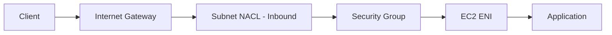
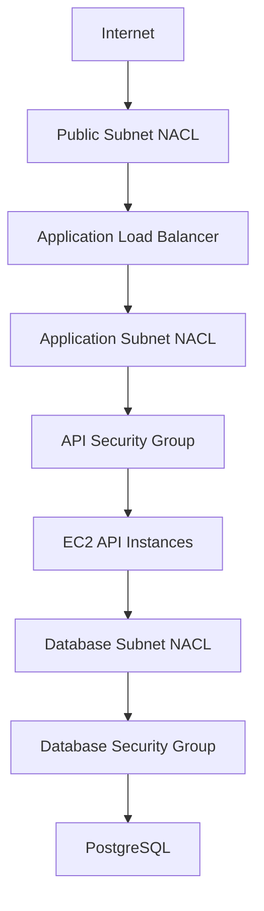
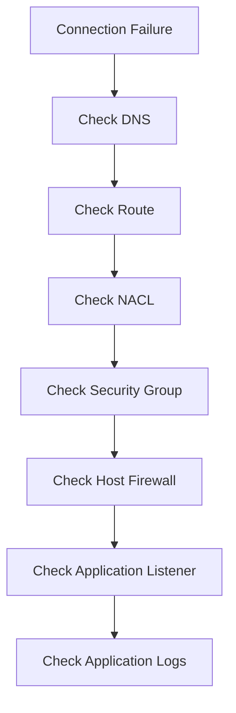

# 02- NACL vs Security Groups

## Overview

AWS provides multiple network security controls for VPC workloads. Two of the most important are:

- **Security Groups (SGs)** — stateful, resource-level traffic controls.
- **Network Access Control Lists (NACLs)** — stateless, subnet-level traffic controls.

They are complementary rather than interchangeable.

A typical request path may look like:

```text
Internet
   |
   v
Internet Gateway
   |
   v
Subnet NACL
   |
   v
EC2 Network Interface
   |
   v
Security Group
   |
   v
Application
```

For return traffic, the behavior differs:

```text
Security Group
    |
    +-- Stateful
    +-- Connection state is tracked
    +-- Response traffic is automatically allowed
       when associated with an allowed flow

Network ACL
    |
    +-- Stateless
    +-- Return traffic must be explicitly permitted
    +-- Rules are evaluated independently in each direction
```

Understanding this distinction is critical when designing, troubleshooting, and securing EC2 networking.

---

## Security Groups

A security group is a **stateful virtual firewall associated with a network interface**.

It controls traffic entering and leaving resources such as EC2 instances.

Example:

```text
api-sg

Inbound:
  TCP 8000 from alb-sg

Outbound:
  TCP 5432 to db-sg
  TCP 443 to required destinations
```

Security groups:

- Support allow rules.
- Do not support explicit deny rules.
- Are stateful.
- Are associated with ENIs.
- Can reference other security groups.
- Are commonly used for application-level network segmentation.

For most EC2 application architectures, security groups are the primary network access-control mechanism.

---

## Network ACLs

A Network Access Control List is a **stateless, subnet-level firewall**.

A subnet can have one associated network ACL.

NACLs control traffic entering and leaving the subnet.

Example:

```text
Public Subnet
      |
      v
+-------------+
|    NACL     |
|             |
| Inbound     |
| Outbound    |
+-------------+
      |
      v
+-------------+
| EC2 / ENI   |
+-------------+
```

NACLs support:

- Allow rules
- Deny rules
- Separate inbound and outbound rules
- Rule numbers
- Ordered evaluation
- Stateless traffic filtering

They operate at a different layer from security groups.

---

## Core Difference

The most important distinction is:

> Security groups protect resources and are stateful. NACLs protect subnets and are stateless.

| Feature | Security Group | Network ACL |
|---|---|---|
| Scope | ENI/resource | Subnet |
| Stateful | Yes | No |
| Rules | Allow only | Allow and deny |
| Rule ordering | No | Yes |
| Evaluation | All applicable rules | Lowest-number matching rule |
| Association | One or more per ENI | One per subnet |
| Security-group references | Yes | No |
| Typical use | Workload-level access control | Subnet-level boundary |
| Return traffic | Automatically handled | Must be explicitly allowed |
| Common application use | Primary | Additional defense layer |

---

## Stateful vs Stateless

This is the most important operational difference.

### Security Group: Stateful

Suppose an EC2 instance allows inbound HTTPS:

```text
Inbound:
TCP 443 from 0.0.0.0/0
```

A client establishes:

```text
Client
   |
   | TCP 443
   v
EC2
```

The response traffic:

```text
EC2
   |
   | Response
   v
Client
```

is automatically permitted as part of the tracked connection.

You do not normally need to create a separate rule allowing ephemeral response ports.

---

## NACL: Stateless

A NACL does not track connection state.

Suppose a client connects to:

```text
Server:443
```

The server's response will use the client's ephemeral source port.

Therefore, the NACL must allow the required traffic in both directions.

Conceptually:

```text
Client ephemeral port
        |
        | ---> TCP 443
        |
     Inbound NACL
        |
      Server

     Outbound NACL
        |
        | <--- TCP ephemeral port
        |
Client
```

If the NACL permits only TCP 443 inbound but does not permit the corresponding return traffic, the connection can fail.

This is one of the most common NACL troubleshooting mistakes.

---

## NACL Rule Evaluation

NACL rules are evaluated in ascending rule-number order.

For example:

```text
100  ALLOW TCP 443  0.0.0.0/0
110  DENY  TCP 443  203.0.113.0/24
*
```

Traffic is evaluated against the rules in order.

The first matching rule determines the result.

Therefore:

```text
Rule 100 -> matches -> ALLOW
Rule 110 -> never evaluated
```

This means rule ordering matters.

A broad allow rule placed before a more specific deny can make the deny ineffective.

---

## Security Group Rule Evaluation

Security groups do not use the same ordered rule model.

Consider:

```text
Rule A:
ALLOW TCP 443 from 10.0.0.0/16

Rule B:
ALLOW TCP 443 from 203.0.113.0/24
```

Traffic matching either rule is allowed.

There is no concept of:

```text
Rule 100 -> evaluate
Rule 110 -> evaluate
Rule 120 -> stop
```

There is also no explicit deny rule that overrides an allow rule.

---

## Traffic Flow Through Both Controls

Consider an EC2 instance in a subnet with:

```text
NACL: application-subnet-nacl
SG: api-sg
```

A packet entering the subnet must pass through the applicable network controls before reaching the application.

Conceptually:



For outbound traffic:


The exact packet path depends on the VPC architecture and routing, but the conceptual distinction remains:

- NACL = subnet-level stateless filtering
- Security group = ENI/resource-level stateful filtering

---

## Why Both Exist

The two controls solve different problems.

### Security Groups

Security groups are designed around **resource relationships**.

For example:

```text
ALB SG
   |
   | TCP 8000
   v
API SG
   |
   | TCP 5432
   v
Database SG
```

This expresses:

> The API can communicate with the database.

### NACLs

NACLs are designed around **subnet boundaries**.

For example:

```text
Public Subnet
      |
  public-nacl
      |
Private Subnet
      |
  private-nacl
```

This allows an organization to apply a broader network boundary to an entire subnet.

---

## Example: Three-Tier Application

Consider:

```text
                    Internet
                       |
                       v
                  Public ALB
                       |
                       v
              +----------------+
              | Application    |
              | Private Subnet |
              +----------------+
                       |
                       v
              +----------------+
              | PostgreSQL     |
              | Private Subnet |
              +----------------+
```

A security-group design could be:

```text
alb-sg
  -> inbound 443 from Internet

api-sg
  -> inbound 8000 from alb-sg

db-sg
  -> inbound 5432 from api-sg
```

NACLs could provide broader subnet-level controls:

```text
Public Subnet
    |
public-nacl
    |
Private Application Subnet
    |
application-nacl
    |
Private Database Subnet
    |
database-nacl
```

The security groups express application dependencies.

The NACLs can provide an additional subnet-level boundary.

---

## When to Use Security Groups

Security groups should generally be the first network access-control mechanism considered for EC2 workloads.

Use them for:

- EC2-to-EC2 communication
- ALB-to-EC2 communication
- Application-to-database communication
- Application-to-Redis communication
- Microservice communication
- gRPC traffic
- Internal APIs
- Administrative access
- Workload segmentation

For example:

```text
api-sg -> db-sg :5432
worker-sg -> redis-sg :6379
service-a-sg -> service-b-sg :50051
```

These relationships remain useful even when EC2 instances are replaced or scaled automatically.

---

## When to Use NACLs

NACLs are useful when you need subnet-level controls such as:

- Explicit deny rules
- Broad subnet-level restrictions
- Additional defense in depth
- Blocking known CIDR ranges
- Enforcing a subnet boundary
- Compliance-driven network segmentation

NACLs are particularly useful when the requirement is about the **network location** rather than a specific workload identity.

---

## Security Group References

Security groups can reference other security groups.

For example:

```text
api-sg
   |
   | TCP 5432
   v
db-sg
```

The database does not need to know the private IP addresses of the API instances.

This is especially useful with Auto Scaling:

```text
Auto Scaling Group
       |
       +-- EC2 A -> api-sg
       +-- EC2 B -> api-sg
       +-- EC2 C -> api-sg
```

The database rule:

```text
db-sg <- TCP 5432 <- api-sg
```

continues to apply as instances are replaced.

NACLs cannot reference security groups.

They use IP-based rules.

---

## NACL CIDR Rules

NACL rules operate using network addresses and CIDR ranges.

For example:

```text
ALLOW TCP 443
Source: 10.0.0.0/16
```

or:

```text
DENY ALL
Source: 203.0.113.0/24
```

This makes NACLs useful for subnet-level network policy.

However, it also means that NACL rules can become difficult to maintain if they attempt to model every individual application dependency.

---

## Ephemeral Ports

Ephemeral ports are particularly important when working with NACLs.

A client usually connects from a temporary source port to a destination service port.

For example:

```text
Client:
10.0.1.20:49152

Server:
10.0.2.10:443
```

The request is:

```text
10.0.1.20:49152
        |
        | TCP
        v
10.0.2.10:443
```

The response reverses the direction:

```text
10.0.2.10:443
        |
        | TCP
        v
10.0.1.20:49152
```

Because NACLs are stateless, both directions must be allowed appropriately.

A security group does not require manually defining a corresponding ephemeral-port rule for the response of an allowed stateful connection.

---

## NACL Example for HTTPS

A simplified NACL configuration for an HTTPS service may require rules similar to:

### Inbound

```text
100  ALLOW TCP 443        from 0.0.0.0/0
110  ALLOW TCP 1024-65535 from 0.0.0.0/0
```

### Outbound

```text
100  ALLOW TCP 443        to 0.0.0.0/0
110  ALLOW TCP 1024-65535 to 0.0.0.0/0
```

The exact ephemeral-port ranges and rules should be designed for the actual traffic pattern and operating environment rather than copied blindly.

This is one reason NACL configuration requires more care than security-group configuration.

---

## Explicit Deny

One of the strongest differences is the ability to explicitly deny traffic with NACLs.

Example:

```text
100  DENY  TCP 22  203.0.113.0/24
110  ALLOW TCP 22  0.0.0.0/0
```

Traffic from `203.0.113.0/24` matches rule 100 and is denied.

Other sources may match rule 110 and be allowed.

This type of deny rule cannot be implemented inside a security group.

---

## Default NACL vs Custom NACL

The default NACL associated with a VPC is configured to allow inbound and outbound traffic by default.

Custom NACLs can be created for more restrictive subnet-level controls.

A common operational strategy is:

```text
Default NACL
    |
    v
Simple AWS networking

Custom NACL
    |
    v
Explicit subnet-level security policy
```

Do not create restrictive NACLs merely for the sake of having another firewall.

Additional controls increase operational complexity and can make troubleshooting harder.

---

## NACL and Security Group Together

A packet can be blocked by either layer.

```text
              Packet
                 |
                 v
          +--------------+
          |     NACL     |
          +--------------+
                 |
              allowed
                 |
                 v
          +--------------+
          | Security     |
          | Group        |
          +--------------+
                 |
              allowed
                 |
                 v
            Application
```

If the NACL denies the packet:

```text
Packet
  |
  v
NACL
  |
  X
Dropped
```

If the NACL allows it but the security group does not:

```text
Packet
  |
  v
NACL
  |
  | allowed
  v
Security Group
  |
  X
Dropped
```

Both controls therefore need to permit the traffic.

---

## Security Group vs NACL Architecture

A useful production model is:



Here:

- NACLs provide subnet-level controls.
- Security groups provide resource-level controls.
- Routing determines where traffic can travel.
- The application provides authentication and authorization.

These layers should be designed independently but understood together.

---

## Comparison by Use Case

| Requirement | Security Group | NACL |
|---|---:|---:|
| Allow HTTPS to EC2 | Yes | Yes |
| Allow API to PostgreSQL | Yes | Possible |
| Reference another workload's SG | Yes | No |
| Explicit deny | No | Yes |
| Stateful connections | Yes | No |
| Subnet-wide policy | No | Yes |
| Dynamic Auto Scaling relationships | Excellent | IP/CIDR-based |
| Block a CIDR range | Not with deny | Yes |
| Fine-grained workload policy | Yes | Limited |
| Typical EC2 application control | Primary | Secondary |

---

## Backend Microservices Example

Suppose a backend platform has:

```text
API
Worker
Redis
PostgreSQL
Kafka
```

A security-group architecture might be:

```text
api-sg
   |
   +---- 5432 ----> db-sg
   |
   +---- 6379 ----> redis-sg
   |
   +---- 9092 ----> kafka-sg

worker-sg
   |
   +---- 6379 ----> redis-sg
   +---- 9092 ----> kafka-sg
   +---- 5432 ----> db-sg
```

This provides service-level relationships.

NACLs can then provide broader subnet controls:

```text
Application Subnet
    |
application-nacl
    |
    +-- Permit required application traffic
    +-- Block known unwanted CIDRs
    +-- Enforce subnet-level boundaries
```

Do not try to encode every microservice dependency in the NACL.

Security groups are better suited for that level of control.

---

## Kubernetes Considerations

When EC2 hosts Kubernetes nodes, security groups and NACLs operate below Kubernetes networking.

A simplified stack is:

```text
AWS VPC
   |
NACL
   |
Security Group
   |
EC2 Node
   |
Kubernetes Networking
   |
NetworkPolicy
   |
Pod
```

Depending on the Kubernetes networking implementation, additional controls may exist.

A production engineer should distinguish:

- AWS subnet-level filtering
- AWS ENI/security-group controls
- Kubernetes node networking
- Kubernetes NetworkPolicy
- Application authentication

A security group should not be assumed to replace Kubernetes NetworkPolicies.

---

## Performance Considerations

Security groups and NACLs are infrastructure-level networking controls and generally should not be treated as application performance bottlenecks.

However, operational complexity can affect system reliability.

Overly complicated NACL configurations can introduce:

- Unexpected drops
- Difficult troubleshooting
- Rule-order mistakes
- Return-path failures
- Deployment dependencies
- Configuration drift

The performance concern is therefore usually less about raw firewall processing time and more about designing predictable network paths.

---

## High Availability Considerations

Security groups and NACLs do not provide high availability by themselves.

They must support a highly available architecture.

For example:

```text
                    ALB
                 /       \
               AZ-A      AZ-B
                |          |
             API-1       API-2
                \          /
                 \        /
                  Database
```

Security groups should allow the required traffic regardless of which Availability Zone contains the workload.

NACLs should be applied consistently across equivalent subnets.

Inconsistent subnet policies can cause AZ-specific failures that are difficult to diagnose.

---

## Security Considerations

### Use Security Groups for Workload Relationships

Prefer:

```text
api-sg -> db-sg :5432
```

over broad:

```text
10.0.0.0/16 -> TCP 5432
```

when the intended relationship is specifically between the API and database tiers.

### Use NACL Denies Carefully

NACL deny rules can affect many workloads simultaneously because they operate at subnet level.

A single incorrect deny can break multiple services.

### Avoid Public Database Access

Neither a security group nor a NACL should be used as justification for making a database publicly reachable.

Prefer private subnets and narrowly scoped access.

### Protect Administrative Ports

Use controlled access mechanisms for SSH and other administrative ports.

---

## Troubleshooting Methodology

When connectivity fails, determine which layer is responsible.

### Check Routing

Verify:

- Route tables
- Internet Gateway
- NAT Gateway
- VPC peering
- Transit Gateway
- VPN or Direct Connect where applicable

### Check NACLs

Verify:

- Inbound rule
- Outbound rule
- Rule number
- First matching rule
- Source/destination CIDR
- Protocol
- Port
- Ephemeral return ports

### Check Security Groups

Verify:

- Inbound rule
- Outbound rule
- Attached security groups
- Security-group references
- Protocol and port

### Check the Host

Verify:

- OS firewall
- Listening address
- Listening port
- Process health

### Check the Application

Verify:

- DNS
- Application configuration
- TLS
- Authentication
- Application logs

---

## Troubleshooting Flow



A useful diagnostic question is:

> At which network-control layer was the packet dropped?

Do not randomly open ports until that question is answered.

---

## AWS CLI Inspection

### Describe Security Groups

```bash
aws ec2 describe-security-groups \
  --group-ids sg-0123456789abcdef0
```

### Describe Security Group Rules

```bash
aws ec2 describe-security-group-rules \
  --filters Name=group-id,Values=sg-0123456789abcdef0
```

### List Network ACLs

```bash
aws ec2 describe-network-acls
```

### Inspect a Specific NACL

```bash
aws ec2 describe-network-acls \
  --network-acl-ids acl-0123456789abcdef0
```

### Inspect NACL Entries

```bash
aws ec2 describe-network-acls \
  --network-acl-ids acl-0123456789abcdef0 \
  --query 'NetworkAcls[0].Entries'
```

For production investigations, combine these commands with route-table, subnet, ENI, and VPC Flow Logs inspection.

---

## Common Mistakes

### Treating NACLs Like Security Groups

Incorrect assumption:

> "If HTTPS is allowed inbound, the response automatically works."

That is true for stateful security-group behavior but not for stateless NACLs.

### Forgetting Ephemeral Ports

A NACL may permit the destination service port but block the return traffic.

This commonly causes confusing connection failures.

### Using NACLs for Every Application Rule

NACLs operate at subnet level. Encoding detailed microservice relationships there can create unnecessary complexity.

Use security groups for workload-level relationships.

### Putting a Deny Rule After a Matching Allow

Because NACLs use ordered evaluation:

```text
100 ALLOW 443 0.0.0.0/0
110 DENY 443 203.0.113.0/24
```

the deny rule never gets a chance to match traffic already allowed by rule 100.

### Assuming Security Groups Can Deny

Security groups cannot explicitly deny traffic.

### Ignoring Multiple Security Groups

An EC2 instance can have multiple security groups. An allow in any applicable group can permit traffic.

### Applying Inconsistent NACLs Across Availability Zones

Equivalent application subnets should normally have consistent network policies.

Otherwise, one AZ may behave differently from another.

### Changing NACLs Without Dependency Analysis

A subnet-level NACL change can affect many instances simultaneously.

Treat NACL changes as potentially broad-impact changes.

---

## Production Best Practices

- Use security groups as the primary workload-level network control.
- Use security-group references for service-to-service communication where appropriate.
- Use NACLs for subnet-level controls and explicit deny requirements.
- Keep NACL rules simple and intentional.
- Document NACL rule numbers and their purpose.
- Account for return traffic when designing stateless NACL rules.
- Review ephemeral-port requirements carefully.
- Avoid broad NACL rules unless they are intentional.
- Apply equivalent NACL policies consistently across Availability Zones.
- Manage production networking through Infrastructure as Code.
- Use VPC Flow Logs for difficult network investigations.
- Review CloudTrail and configuration changes during incidents.
- Do not rely on NACLs or security groups as replacements for application authentication and authorization.
- Test network-policy changes before applying them to critical production subnets.

---

## Interview Considerations

### What is the biggest difference between a security group and a NACL?

A security group is **stateful and resource-level**, while a NACL is **stateless and subnet-level**.

### Which one supports deny rules?

NACLs support both allow and deny rules. Security groups support allow rules only.

### Which one is stateful?

Security groups are stateful. NACLs are stateless.

### Do NACLs require return traffic to be explicitly allowed?

Yes. Because NACLs are stateless, the return direction must also be permitted.

### Can a NACL reference a security group?

No. NACL rules use IP/CIDR-based traffic definitions.

### Can an EC2 instance have multiple security groups?

Yes. Multiple security groups can be attached to its network interfaces, and their effective rules are combined.

### Can a subnet have multiple NACLs?

A subnet is associated with one NACL at a time.

### Should NACLs replace security groups?

No. They solve different problems. Security groups are generally the primary control for workload-level access, while NACLs provide subnet-level filtering and explicit deny capability.

### Why can a connection fail even when the security group allows it?

Possible causes include:

- NACL rules
- Missing return-path rules
- Routing
- Network ACL rule ordering
- Host firewall
- Application listener
- DNS
- Incorrect destination port

The security group is only one layer of the network path.

---

## Key Takeaways

- Security groups are stateful, resource-level allow controls; NACLs are stateless, subnet-level controls that support both allow and deny rules.
- Security groups automatically handle response traffic for allowed stateful connections, while NACLs require both traffic directions to be explicitly permitted.
- Use security groups for workload relationships such as `api-sg -> db-sg:5432`, and use NACLs for broader subnet-level policy and explicit deny requirements.
- NACL rule ordering and ephemeral return ports are common sources of production connectivity failures.
- Treat security groups and NACLs as complementary network layers alongside routing, host firewalls, application security, and observability.