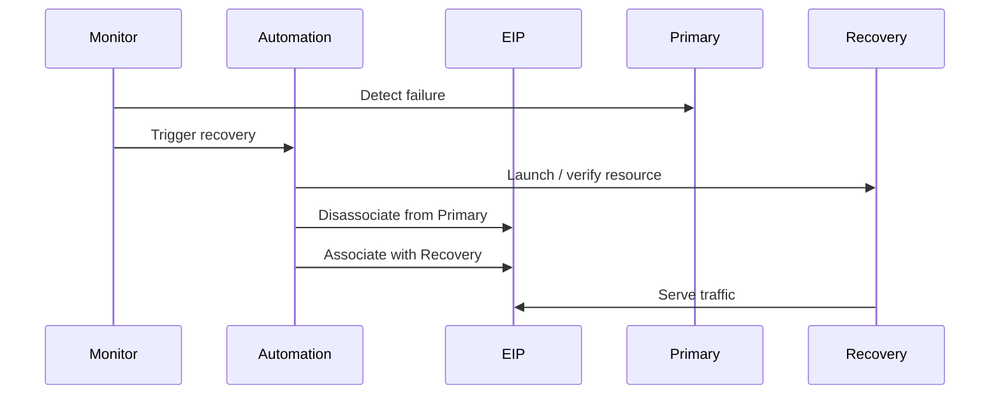

# 03- Elastic IP

## Overview

An **Elastic IP address (EIP)** is a static public IPv4 address allocated to an AWS account and associated with an EC2 instance, network interface, or supported AWS resource.

Unlike an automatically assigned public IPv4 address, an Elastic IP remains allocated to your account until you explicitly release it. This makes it possible to preserve a stable public IPv4 address while replacing or moving the underlying compute resource. :contentReference[oaicite:0]{index=0}

The basic model is:

```text
AWS Account
    |
    v
Elastic IP
    |
    v
Network Interface
    |
    v
EC2 Instance
```

Elastic IPs are useful when a workload genuinely requires a stable public IPv4 address. They should not be treated as the default way to expose production applications.

For most production web applications, a better architecture is often:

```text
Internet
    |
    v
ALB
    |
    v
Private EC2 Instances
```

An Elastic IP becomes more relevant when a specific resource needs a stable public IPv4 identity.

---

## What Is an Elastic IP?

An Elastic IP is a **static public IPv4 address** associated with your AWS account.

It differs from an automatically assigned EC2 public IPv4 address.

| Characteristic | Auto-assigned Public IPv4 | Elastic IP |
|---|---|---|
| Static | No | Yes |
| Persists across stop/start | No | Yes |
| Allocated to account | No | Yes |
| Can be reassociated | Limited | Yes |
| Publicly routable | Yes | Yes |
| IPv4 only | Yes | Yes |
| Region-specific | Yes | Yes |
| Charged | Yes | Yes |

AWS states that Elastic IP addresses are regional and do not support IPv6. :contentReference[oaicite:1]{index=1}

---

## Why Elastic IPs Exist

An automatically assigned public IPv4 address can change when an EC2 instance is stopped and started.

For example:

```text
Before Stop

EC2 Instance
Public IP: 203.0.113.10


Stop + Start


After Start

EC2 Instance
Public IP: 198.51.100.25
```

That can break systems that depend on the old address.

With an Elastic IP:

```text
Elastic IP
203.0.113.10
      |
      v
EC2 Instance A
```

If Instance A fails and is replaced:

```text
Elastic IP
203.0.113.10
      |
      v
EC2 Instance B
```

The public IP remains the same while the underlying instance changes.

This remapping capability is one of the primary reasons Elastic IPs exist. :contentReference[oaicite:2]{index=2}

---

## Public IPv4 vs Elastic IP

It is important to distinguish the two.

### Automatically Assigned Public IPv4

An EC2 instance can receive a public IPv4 address based on the subnet's public IPv4 addressing configuration or launch configuration.

That address belongs to the instance's network interface and can be released when the instance is stopped, hibernated, or terminated. A new public IPv4 address can be assigned when the instance starts again. :contentReference[oaicite:3]{index=3}

### Elastic IP

An Elastic IP is allocated separately to the AWS account.

```text
Account
   |
   +-- EIP: 203.0.113.10
   |
   +-- EC2 Instance A
```

The EIP can be reassociated when required.

---

## How Elastic IP Association Works

The simplified relationship is:

```text
                    Elastic IP
                         |
                         v
                Elastic Network Interface
                         |
                         v
                    Private IPv4
                         |
                         v
                     EC2 Instance
```

AWS maps the public Elastic IP to the private IPv4 address associated with the network interface. The public address is not configured directly inside the EC2 operating system as a normal interface address. :contentReference[oaicite:4]{index=4}

For example:

```text
EC2 ENI

Private IP:
10.0.10.25

Elastic IP:
203.0.113.10
```

Conceptually:

```text
Internet
   |
203.0.113.10
   |
AWS networking / NAT mapping
   |
10.0.10.25
   |
EC2 ENI
```

Inside the operating system, you normally work with the private address rather than configuring the Elastic IP manually.

---

## Elastic IP Lifecycle

The normal lifecycle is:


The major operations are:

1. Allocate
2. Associate
3. Describe
4. Disassociate
5. Reassociate
6. Release

The important distinction is:

> **Disassociate** removes the EIP from a resource but keeps the EIP allocated to your account.

> **Release** returns the EIP to AWS's public IPv4 pool.

After release, AWS can allocate that address to another account. :contentReference[oaicite:5]{index=5}

---

## Allocate an Elastic IP

Using AWS CLI:

```bash
aws ec2 allocate-address \
  --domain vpc
```

Example response:

```json
{
  "PublicIp": "203.0.113.10",
  "AllocationId": "eipalloc-0123456789abcdef0",
  "Domain": "vpc"
}
```

The important identifier is the **Allocation ID**:

```text
eipalloc-0123456789abcdef0
```

Use this identifier for later EIP management.

---

## Describe Elastic IPs

List allocated Elastic IPs:

```bash
aws ec2 describe-addresses
```

Useful filtered output:

```bash
aws ec2 describe-addresses \
  --query 'Addresses[*].[PublicIp,AllocationId,AssociationId,InstanceId,NetworkInterfaceId]' \
  --output table
```

This is particularly useful during operational investigations.

---

## Associate an Elastic IP

An EIP can be associated with an EC2 instance or network interface.

### Associate with an Instance

```bash
aws ec2 associate-address \
  --allocation-id eipalloc-0123456789abcdef0 \
  --instance-id i-0123456789abcdef0
```

### Associate with a Network Interface

```bash
aws ec2 associate-address \
  --allocation-id eipalloc-0123456789abcdef0 \
  --network-interface-id eni-0123456789abcdef0
```

When using network interfaces directly, the association can also involve a specific private IP where the resource supports it.

For production automation, prefer using stable resource identifiers rather than hardcoded public IP strings.

---

## Disassociate an Elastic IP

To remove an EIP from a resource while retaining the EIP in the account:

```bash
aws ec2 disassociate-address \
  --association-id eipassoc-0123456789abcdef0
```

After disassociation:

```text
AWS Account
    |
    +-- Elastic IP
         |
         +-- Not associated
```

The address remains allocated.

This is useful when preparing to move an EIP between instances.

---

## Release an Elastic IP

Release an EIP only when it is no longer required.

```bash
aws ec2 release-address \
  --allocation-id eipalloc-0123456789abcdef0
```

After release:

```text
Account
   |
   X
EIP released
```

The address returns to AWS's public IPv4 pool and can later be allocated to another AWS customer. :contentReference[oaicite:6]{index=6}

Do not release an EIP merely because an instance is temporarily stopped.

---

## Reassociating an Elastic IP

One of the important operational uses of EIPs is moving a stable public address between resources.

Example:

```text
                    EIP
              203.0.113.10
                     |
                     v
                Instance A
                     |
                 Failure
                     |
                     X

                    EIP
              203.0.113.10
                     |
                     v
                Instance B
```

This can support recovery procedures where an application or external system expects a fixed public IPv4 address.

However, for highly available applications, relying on a manually moved EIP is usually less robust than using managed load balancing and DNS-based architectures.

---

## Elastic IP and DNS

An Elastic IP can be used as the target of a DNS record.

For example:

```text
api.example.com
       |
       v
203.0.113.10
       |
       v
EC2
```

This can be useful for simple infrastructure or systems that require a fixed IP.

However, production web applications should generally prefer:

```text
api.example.com
       |
       v
Application Load Balancer
       |
       v
EC2 Auto Scaling Group
```

This provides better support for:

- Horizontal scaling
- Health checks
- Multi-AZ deployment
- Instance replacement
- Rolling deployments
- Traffic distribution

An Elastic IP solves **stable addressing**, not **application high availability**.

---

## Elastic IP and EC2 Failure Recovery

Consider a single-instance application:

```text
Internet
   |
EIP
   |
EC2-A
```

If EC2-A fails, an operational workflow can be:

```text
Detect failure
      |
      v
Launch replacement
      |
      v
Disassociate EIP
      |
      v
Associate EIP with replacement
      |
      v
Start application
```

This can reduce the impact of instance replacement.

However, the workflow introduces operational dependencies and potential downtime.

For a highly available service, prefer multiple instances behind a load balancer.

---

## Elastic IP with Auto Scaling

An Elastic IP does not naturally map to the concept of a horizontally scaling Auto Scaling Group.

For example:

```text
                Elastic IP
                    |
                    v
                  EC2-A
```

An Auto Scaling Group might instead contain:

```text
             Auto Scaling Group
              /       |       \
             /        |        \
          EC2-A     EC2-B     EC2-C
```

Trying to maintain a fixed EIP for every dynamically created instance creates unnecessary complexity.

For scalable HTTP workloads, use:

```text
Internet
    |
    v
ALB
    |
    +---- EC2-A
    +---- EC2-B
    +---- EC2-C
```

The ALB provides the stable public entry point while EC2 instances remain replaceable.

---

## When to Use an Elastic IP

Use an EIP when the workload has a genuine requirement for a stable public IPv4 address.

Common examples include:

- A legacy integration requiring source-IP allowlisting
- A standalone public service
- A fixed administrative endpoint
- A controlled failover workflow
- A network appliance
- A resource that must retain the same public IPv4 address during replacement
- Certain partner integrations that require IP-based access controls

The requirement should be explicit.

---

## When Not to Use an Elastic IP

Do not automatically assign an EIP to every EC2 instance.

Avoid using EIPs simply because:

- The instance is production.
- The instance needs internet access.
- SSH is convenient with a public IP.
- The application is a web API.
- A public IP "looks more accessible."

Better alternatives may include:

- Application Load Balancer
- Network Load Balancer
- NAT Gateway
- AWS Systems Manager
- EC2 Instance Connect Endpoint
- Private connectivity
- Route 53

For example, private EC2 instances can use a load balancer for inbound application traffic:

```text
Internet
   |
   v
ALB
   |
   v
Private EC2
```

And NAT can provide outbound internet access without giving each application instance a public IPv4 address.

---

## Elastic IP and Private Subnets

An EC2 instance in a private subnet should normally not have a public IPv4 address.

A typical architecture is:

```text
                    Internet
                       |
                       v
                      ALB
                       |
                Private Subnet
                       |
            +----------+----------+
            |                     |
          EC2-A                 EC2-B
            |                     |
            +----------+----------+
                       |
                     NAT
                       |
                    Internet
```

The EC2 instances use private addresses.

The ALB handles inbound traffic.

The NAT Gateway handles appropriate outbound internet access.

This architecture generally avoids assigning EIPs directly to application instances.

---

## Elastic IP and NAT Gateway

A NAT Gateway uses a public IPv4 address for internet connectivity.

The application instances behind it can remain private:

```text
Private EC2
10.0.10.20
     |
     v
NAT Gateway
EIP / Public IPv4
     |
     v
Internet
```

This is fundamentally different from assigning an EIP directly to the EC2 instance.

With an EIP on the EC2 instance:

```text
Internet
   |
EIP
   |
EC2
```

With NAT:

```text
Private EC2
   |
NAT Gateway
   |
Public IPv4
   |
Internet
```

The second pattern is generally more appropriate for private application workloads.

---

## Elastic IP and Load Balancers

Do not assume that an Elastic IP is required for a public load balancer.

Application Load Balancers use AWS-managed public addresses and DNS.

A Network Load Balancer can support static IP requirements and has additional options for fixed addresses, including Elastic IP association depending on its configuration.

For most HTTP/HTTPS applications:

```text
DNS
 |
 v
ALB
 |
 +---- EC2
 +---- EC2
```

is preferable to:

```text
DNS
 |
 v
EIP
 |
 v
Single EC2
```

because the load balancer provides health-aware traffic distribution and supports horizontal scaling.

---

## Elastic IP and Security Groups

An Elastic IP does not replace security groups.

For example:

```text
Internet
   |
EIP
   |
EC2
   |
Security Group
```

The EIP provides public addressing.

The security group controls whether traffic is allowed.

A public EIP does not automatically mean:

```text
All traffic allowed
```

The security group, network ACLs, routing, host firewall, and application listener still determine actual connectivity.

---

## Elastic IP and Network ACLs

The traffic path can involve:

```text
Internet
   |
   v
Elastic IP
   |
   v
VPC networking
   |
   v
Subnet NACL
   |
   v
Security Group
   |
   v
EC2
```

Therefore, an EIP does not bypass:

- NACLs
- Security groups
- Route tables
- Host firewalls
- Application-level controls

When an EIP-connected application is unreachable, troubleshoot the entire network path.

---

## Cost Considerations

AWS charges for public IPv4 addresses, including Elastic IP addresses, whether they are in use or idle. The current AWS public IPv4 pricing is **$0.005 per public IPv4 address-hour** for standard in-use and idle public IPv4 addresses. :contentReference[oaicite:7]{index=7}

This means:

```text
EIP allocated and used
        |
        v
Public IPv4 charge

EIP allocated but idle
        |
        v
Public IPv4 charge
```

For example, using one standard public IPv4 address continuously for approximately 730 hours:

```text
730 hours × $0.005/hour
≈ $3.65/month
```

Actual billing depends on the AWS pricing model and account/region conditions.

The important engineering point is that unused public IPv4 addresses should not be retained indefinitely.

AWS also charges for automatically assigned public IPv4 addresses, so replacing every EIP with another public IPv4 address does not eliminate the public IPv4 cost. :contentReference[oaicite:8]{index=8}

---

## Public IPv4 Optimization

AWS recommends reducing unnecessary public IPv4 usage.

For example:

```text
Less desirable:

Internet
   |
Public IPv4
   |
EC2-1

Internet
   |
Public IPv4
   |
EC2-2

Internet
   |
Public IPv4
   |
EC2-3
```

A common production design is:

```text
             Internet
                |
                v
               ALB
                |
       +--------+--------+
       |                 |
    Private EC2       Private EC2
       |                 |
       +--------+--------+
                |
              NAT
                |
             Internet
```

This reduces the number of public IPv4 addresses attached directly to application instances.

AWS specifically recommends considering load balancers and private instances when optimizing public IPv4 usage. :contentReference[oaicite:9]{index=9}

---

## Availability and Reliability

An EIP itself does not make an application highly available.

Consider:

```text
Single EC2 + EIP

Internet
   |
 EIP
   |
 EC2
```

If the instance fails, the EIP still exists, but the application is unavailable until another resource is ready.

Compare that with:

```text
                    ALB
                 /       \
               EC2       EC2
              AZ-A       AZ-B
```

The second architecture provides redundancy.

Use an EIP for stable addressing requirements, not as a substitute for:

- Auto Scaling
- Multi-AZ deployment
- Load balancing
- Health checks
- Automated replacement

---

## Disaster Recovery

An EIP can be useful in certain disaster recovery scenarios.

For example:

```text
Primary
   |
EIP
   |
EC2-A


Disaster
   |
   v

Recovery
   |
EIP
   |
EC2-B
```

The same public IP can be reassociated with the recovery resource.

However, a production DR strategy should consider:

- RTO
- RPO
- DNS
- Data replication
- Application state
- Database recovery
- Infrastructure provisioning
- Security groups
- Route tables
- Monitoring
- Automation

An EIP is only one component of the recovery process.

---

## Failover Workflow

A controlled failover process might look like:



In production, automate the workflow where possible and validate the replacement before switching traffic.

---

## Security Considerations

An Elastic IP is publicly reachable at the network level.

That does not mean the associated application should accept unrestricted traffic.

Use:

- Security groups
- NACLs where appropriate
- Host firewalls
- TLS
- Application authentication
- Least-privilege IAM
- Monitoring and logging

Avoid exposing administrative services broadly.

For example, avoid:

```text
EIP
 |
TCP 22
 |
0.0.0.0/0
```

Prefer controlled administrative access through mechanisms such as AWS Systems Manager Session Manager or tightly restricted administrative networks.

AWS also provides EC2 Instance Connect Endpoint, which can allow access to instances without requiring the instances themselves to have public IPv4 addresses. :contentReference[oaicite:10]{index=10}

---

## Operational Management

Track EIPs as managed infrastructure.

Useful information includes:

| Attribute | Example |
|---|---|
| Public IP | `203.0.113.10` |
| Allocation ID | `eipalloc-0123456789abcdef0` |
| Association ID | `eipassoc-0123456789abcdef0` |
| Instance ID | `i-0123456789abcdef0` |
| Network Interface | `eni-0123456789abcdef0` |
| Region | `ap-south-1` |
| Purpose | Legacy partner allowlist |
| Environment | Production |

This makes it easier to identify why an EIP exists and whether it can safely be released.

---

## Monitoring and Auditing

Useful operational controls include:

- AWS CloudTrail for API activity
- AWS Config for configuration tracking
- AWS Cost Explorer for public IPv4 usage
- VPC IP Address Manager (IPAM) for public IP visibility
- Infrastructure as Code for desired state

AWS IPAM can provide visibility into public IPv4 addresses across an account or organization when integrated appropriately. :contentReference[oaicite:11]{index=11}

For cost analysis, AWS exposes public IPv4 usage types such as:

```text
PublicIPv4InUseAddress
PublicIPv4IdleAddress
```

These can be inspected through Cost Explorer. :contentReference[oaicite:12]{index=12}

---

## AWS CLI Reference

### Allocate

```bash
aws ec2 allocate-address \
  --domain vpc
```

### List EIPs

```bash
aws ec2 describe-addresses
```

### Find EIPs and Associations

```bash
aws ec2 describe-addresses \
  --query 'Addresses[*].[PublicIp,AllocationId,AssociationId,InstanceId]' \
  --output table
```

### Associate

```bash
aws ec2 associate-address \
  --allocation-id eipalloc-0123456789abcdef0 \
  --instance-id i-0123456789abcdef0
```

### Disassociate

```bash
aws ec2 disassociate-address \
  --association-id eipassoc-0123456789abcdef0
```

### Release

```bash
aws ec2 release-address \
  --allocation-id eipalloc-0123456789abcdef0
```

The allocation ID and association ID should be obtained from AWS rather than guessed.

---

## Safe EIP Operational Workflow

Before releasing an EIP:

1. Identify the allocation ID.
2. Determine whether it is associated.
3. Identify the associated resource.
4. Determine why the address exists.
5. Check DNS records.
6. Check external allowlists.
7. Check firewall/security-group dependencies.
8. Check monitoring and alerting dependencies.
9. Confirm that no production workflow depends on the address.
10. Release it only after validation.

Example:

```text
EIP
 |
 +-- DNS dependency?
 |
 +-- Partner allowlist?
 |
 +-- Firewall rule?
 |
 +-- Monitoring dependency?
 |
 +-- DR dependency?
 |
 +-- Production application?
 |
 +-- Safe to release?
```

This prevents accidental loss of an address that external systems depend on.

---

## Common Mistakes

### Assigning an EIP to Every EC2 Instance

This increases public IPv4 usage and expands the public attack surface.

Use private instances behind a load balancer where appropriate.

### Assuming EIP Means High Availability

An EIP is an addressing mechanism, not a redundancy mechanism.

### Forgetting Idle EIPs

An allocated but unused EIP still incurs public IPv4 charges. :contentReference[oaicite:13]{index=13}

### Releasing an EIP Without Checking Dependencies

External systems may have:

- IP allowlists
- Firewall rules
- DNS dependencies
- Monitoring rules
- Partner integrations

Once released, the address can return to AWS's pool. :contentReference[oaicite:14]{index=14}

### Using EIPs for Auto Scaling

Auto Scaling creates and replaces instances dynamically.

Using individual EIPs for each instance complicates the architecture.

Prefer:

```text
ALB
 |
Auto Scaling Group
 |
EC2
```

for scalable web applications.

### Using an EIP Instead of DNS

Hardcoding an IP address into applications creates coupling.

Prefer stable DNS names where the integration permits them.

### Confusing EIP With Private IP

An EIP is public IPv4 addressing.

The application still operates through the instance's private network interface and private IP inside the VPC.

---

## Production Architecture Patterns

### Pattern: Standalone Public Service

```text
Internet
   |
 EIP
   |
EC2
   |
Application
```

Suitable for specific standalone workloads that genuinely require a fixed public IPv4 address.

### Pattern: Highly Available Web Application

```text
                 Internet
                    |
                    v
                   ALB
                 /     \
               AZ-A    AZ-B
                |        |
              EC2      EC2
```

No EIP is required on each application instance.

### Pattern: Private Application With Outbound Internet

```text
Private EC2
     |
     v
NAT Gateway
     |
Public IPv4
     |
     v
Internet
```

This keeps application instances private.

### Pattern: Fixed-IP Partner Integration

```text
Partner
   |
IP allowlist
   |
Stable EIP
   |
EC2 / Network Appliance
```

This is a legitimate use case when an external system requires source or destination IP stability.

---

## Interview Considerations

### What is an Elastic IP?

An Elastic IP is a static public IPv4 address allocated to an AWS account that can be associated and reassociated with supported AWS resources.

### Why use an Elastic IP instead of an automatically assigned public IP?

An automatically assigned public IPv4 address can change when an instance is stopped and started. An Elastic IP remains allocated to the account until released and can be reassociated with another resource. :contentReference[oaicite:15]{index=15}

### Is an Elastic IP private or public?

Public. An Elastic IP is a public IPv4 address.

### Is an Elastic IP regional?

Yes. An Elastic IP is associated with a specific AWS Region and cannot simply be moved between Regions. :contentReference[oaicite:16]{index=16}

### Does an Elastic IP support IPv6?

No. Elastic IP addresses are IPv4 addresses. :contentReference[oaicite:17]{index=17}

### What happens when an EC2 instance with an EIP is stopped?

The EIP remains allocated to the account and remains associated according to the EIP association model. However, the associated resource is not serving traffic while stopped. Public IPv4 address charges still apply to the EIP. :contentReference[oaicite:18]{index=18}

### What is the difference between disassociate and release?

**Disassociate** removes the EIP from its resource but keeps the address allocated to your account.

**Release** returns the address to AWS's public IPv4 pool. :contentReference[oaicite:19]{index=19}

### Should every production EC2 instance have an EIP?

No. Most scalable web applications should use load balancers and private EC2 instances rather than assigning a public EIP to every instance.

### Is an EIP free?

No. AWS currently charges for public IPv4 addresses, including Elastic IP addresses, at the applicable public IPv4 hourly rate. The standard current rate shown by AWS is $0.005 per public IPv4 address-hour. :contentReference[oaicite:20]{index=20}

### Does an EIP provide failover?

An EIP can support a failover workflow because it can be reassociated with another resource, but the EIP itself does not provide automatic application high availability.

---

## Key Takeaways

- An Elastic IP is a static, regional public IPv4 address that can be reassociated with supported AWS resources.
- Use EIPs when a workload genuinely requires a stable public IPv4 address; do not assign them to every EC2 instance by default.
- EIPs provide stable addressing, not high availability; scalable applications should generally use load balancers, private instances, and Auto Scaling.
- Disassociating preserves the EIP in your account, while releasing returns it to AWS's public IPv4 pool.
- AWS charges for public IPv4 addresses, including both in-use and idle EIPs, so unused public IPv4 capacity should be actively managed. :contentReference[oaicite:21]{index=21}