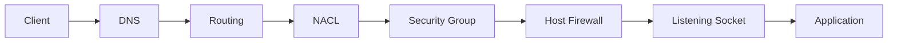
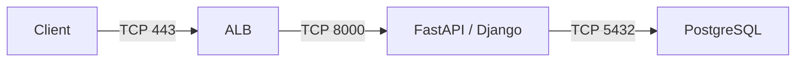
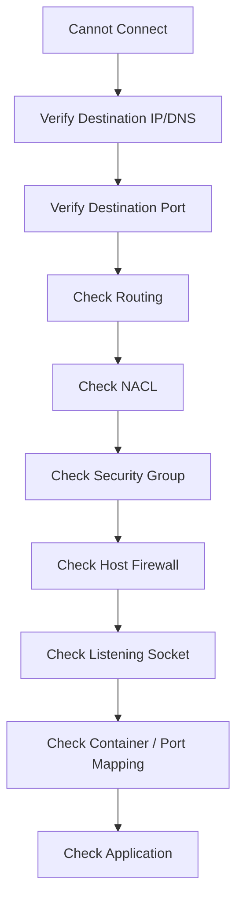

# 04- Ports

## Overview

A network port identifies a logical endpoint for a transport-layer service. In backend systems, ports determine where applications such as Nginx, Django, FastAPI, PostgreSQL, Redis, Kafka, and gRPC servers accept network connections.

A port does not by itself make a service reachable. Actual connectivity depends on multiple layers:

```text
Client
  |
  v
DNS
  |
  v
Routing
  |
  v
NACL
  |
  v
Security Group
  |
  v
Host Firewall
  |
  v
Listening Socket
  |
  v
Application
```

For EC2 workloads, understanding ports is essential for:

- Security-group design
- NACL configuration
- Load-balancer configuration
- Service-to-service communication
- Docker networking
- Kubernetes networking
- Connectivity troubleshooting
- Security hardening

The key principle is:

> A port should be exposed only when a service needs to receive traffic on that port, and access to that port should be restricted to the required sources.

---

## What Is a Network Port?

A port is a 16-bit number used by TCP and UDP to identify a logical communication endpoint.

Valid port numbers range from:

```text
0 - 65535
```

A network connection is commonly identified by a combination of:

```text
Source IP
Source Port
Destination IP
Destination Port
Protocol
```

For example:

```text
Client
10.0.1.20:51842
      |
      | TCP
      v
Server
10.0.2.10:443
```

Here:

- `10.0.1.20` is the source IP.
- `51842` is the source port.
- `10.0.2.10` is the destination IP.
- `443` is the destination port.
- `TCP` is the transport protocol.

---

## TCP and UDP Ports

Ports exist in the context of transport protocols.

The two most common are:

- TCP
- UDP

| Characteristic | TCP | UDP |
|---|---|---|
| Connection-oriented | Yes | No |
| Reliable delivery | Yes | No |
| Ordered delivery | Yes | No |
| Retransmission | Yes | No |
| Connection setup | TCP handshake | None |
| Common uses | HTTP, HTTPS, PostgreSQL, SSH | DNS, streaming, some telemetry and real-time protocols |

The same port number can exist independently for TCP and UDP.

For example:

```text
TCP 443
UDP 443
```

are different transport endpoints.

A security-group rule allowing TCP 443 does not automatically allow UDP 443.

---

## Port Ranges

Ports are divided into commonly recognized ranges:

| Range | Common Description | Typical Usage |
|---:|---|---|
| `0-1023` | Well-known ports | Standard infrastructure services |
| `1024-49151` | Registered ports | Applications and services |
| `49152-65535` | Dynamic/private ports | Often used for ephemeral client ports |

The exact ephemeral-port range can vary by operating system and networking stack, so infrastructure rules should not blindly assume one universal range.

---

## Common Backend Ports

| Port | Protocol | Common Service |
|---:|---|---|
| 22 | TCP | SSH |
| 25 | TCP | SMTP |
| 53 | TCP/UDP | DNS |
| 80 | TCP | HTTP |
| 123 | UDP | NTP |
| 443 | TCP | HTTPS |
| 50051 | TCP | gRPC |
| 5432 | TCP | PostgreSQL |
| 5672 | TCP | RabbitMQ |
| 6379 | TCP | Redis |
| 8000 | TCP | Django/FastAPI development or application server |
| 8080 | TCP | Common application/proxy port |
| 9092 | TCP | Kafka |
| 9200 | TCP | Elasticsearch |
| 3306 | TCP | MySQL |
| 27017 | TCP | MongoDB |

These are conventions rather than requirements.

For example, PostgreSQL can listen on a different port if configured accordingly.

---

## Port vs IP Address

An IP address identifies a network endpoint at the host/interface level.

A port identifies a service endpoint on that host.

For example:

```text
10.0.10.25:443
```

can be interpreted as:

```text
10.0.10.25 -> Host
443         -> HTTPS service
```

The same host can expose multiple services:

```text
10.0.10.25:22    -> SSH
10.0.10.25:443   -> HTTPS
10.0.10.25:5432  -> PostgreSQL
10.0.10.25:6379  -> Redis
```

This is why security policies need both addressing and port information.

---

## Port and Socket

At the operating-system level, applications bind sockets to local addresses and ports.

For example:

```text
FastAPI
   |
   v
0.0.0.0:8000
```

means the application is listening on port `8000` on all IPv4 interfaces available to the process.

A socket can be represented conceptually as:

```text
Protocol + Local IP + Local Port
```

A TCP connection additionally involves the remote endpoint.

For example:

```text
TCP
Local:  10.0.10.25:8000
Remote: 10.0.1.20:52144
```

---

## Listening vs Open

These terms are often confused.

### Listening

An application has created a socket and is waiting for connections.

Example:

```text
FastAPI
   |
   v
TCP 8000 LISTEN
```

### Open Through the Network

Network controls permit traffic to reach the host.

For example:

```text
Security Group
TCP 8000
Source: ALB SG
```

A port can therefore be:

```text
Application listening
        +
Network policy allows
        =
Reachable service
```

If either condition is missing, connectivity can fail.

---

## The Port Connectivity Model

A useful troubleshooting model is:



For a connection to succeed, each relevant layer must permit the traffic.

For example, an EC2 security group can allow TCP 8000 while the application listens only on `127.0.0.1:8000`.

The security group is correct, but the service is still unreachable from another host.

---

## Binding Addresses

The address an application binds to is important.

### Loopback

```text
127.0.0.1:8000
```

The service accepts connections only from the local host.

This is useful when:

- Nginx is running on the same host.
- The application should not be directly reachable from the network.
- A local reverse-proxy architecture is being used.

### All IPv4 Interfaces

```text
0.0.0.0:8000
```

The service listens on all IPv4 interfaces available to the process.

This is commonly required when another machine, container, load balancer, or network namespace needs to reach the application.

### IPv6

A service may also bind to an IPv6 address such as:

```text
[::]:8000
```

The exact behavior of dual-stack binding depends on the operating system and socket configuration.

---

## Python Example

A FastAPI application might run with Uvicorn:

```bash
uvicorn app.main:app --host 0.0.0.0 --port 8000
```

The important distinction is:

```text
--host 0.0.0.0
    |
    +-- Listen on all IPv4 interfaces

--port 8000
    |
    +-- Listen on TCP port 8000
```

The application is still not necessarily reachable externally.

The EC2 security group, NACL, routing, host firewall, and application configuration must also permit the connection.

---

## Django Example

A development Django server might use:

```bash
python manage.py runserver 0.0.0.0:8000
```

For production, Django is normally deployed behind a production application server and often a reverse proxy:

```text
Internet
   |
   v
ALB / Nginx
   |
   v
Gunicorn / Uvicorn
   |
   v
Django / FastAPI
```

Do not use Django's development server as the production application server.

---

## Nginx and Application Ports

A common EC2 backend architecture is:

```text
Internet
   |
 TCP 443
   |
   v
Nginx
   |
 TCP 8000
   |
   v
Gunicorn / Uvicorn
   |
   v
Django / FastAPI
```

In this design:

- Port `443` is externally exposed.
- Port `8000` is internal.
- The application does not need to be publicly reachable.

Security-group policy can reflect this:

```text
Public entry:
TCP 443 from Internet

Application:
TCP 8000 from Nginx SG
```

This creates a clear network boundary.

---

## Load Balancer and Ports

A load balancer commonly exposes one port while forwarding traffic to another port.

For example:

```text
Client
  |
  | HTTPS :443
  v
ALB
  |
  | HTTP :8000
  v
EC2
```

The client does not need direct access to port `8000`.

A typical security-group relationship is:

```text
alb-sg
  |
  | TCP 443
  | from Internet
  v
ALB

api-sg
  |
  | TCP 8000
  | from alb-sg
  v
EC2
```

This is preferable to:

```text
Internet
   |
TCP 8000
   |
EC2
```

when the ALB is the intended public entry point.

---

## Port Translation

A load balancer or proxy can expose one port and forward to another.

Example:

```text
External:
api.example.com:443

        |
        v

ALB

        |
        v

Internal:
10.0.10.25:8000
```

The external and internal ports do not have to match.

This is common in production architectures.

---

## Security Groups and Ports

Security groups use protocol and port information to control traffic.

Example:

```text
Inbound:
TCP 443 from 0.0.0.0/0
```

means TCP traffic destined for port 443 is allowed from the specified source.

For an internal service:

```text
Inbound:
TCP 8000 from alb-sg
```

means instances associated with `alb-sg` can initiate connections to port 8000 on the destination resource.

Security groups are stateful, so response traffic for an allowed connection is automatically handled.

---

## NACLs and Ports

NACLs are stateless.

This makes port configuration more complex.

For example, if a client connects to:

```text
Server:443
```

the client may use an ephemeral source port:

```text
Client:52000 -> Server:443
```

The response is:

```text
Server:443 -> Client:52000
```

Because the NACL is stateless, the relevant return traffic must also be allowed.

This is one reason NACL troubleshooting often requires examining both service ports and ephemeral-port ranges.

---

## Security Group vs NACL Port Handling

| Characteristic | Security Group | NACL |
|---|---|---|
| Port-based rules | Yes | Yes |
| Stateful | Yes | No |
| Response traffic automatically handled | Yes | No |
| Explicit deny | No | Yes |
| Rule order | Not applicable | Important |
| Typical application use | Primary | Additional subnet-level control |

---

## Common Service Flow

Consider:

```text
Client
  |
  | TCP 443
  v
ALB
  |
  | TCP 8000
  v
FastAPI
  |
  | TCP 5432
  v
PostgreSQL
```

The corresponding port policies might be:

```text
ALB:
  443 <- Internet

API:
  8000 <- ALB SG

PostgreSQL:
  5432 <- API SG
```

The application dependency graph is:



This is a better model than simply opening a broad range of ports.

---

## Internal Microservice Communication

Suppose a system has:

```text
API
Worker
Payment Service
Notification Service
```

A possible communication model is:

```text
API
 |
 | gRPC :50051
 v
Payment Service

API
 |
 | HTTP :8080
 v
Notification Service

Worker
 |
 | HTTP :8080
 v
Notification Service
```

Security groups should represent these relationships.

For example:

```text
api-sg -> payment-sg :50051
api-sg -> notification-sg :8080
worker-sg -> notification-sg :8080
```

Avoid exposing every internal service to:

```text
0.0.0.0/0
```

---

## PostgreSQL Port

PostgreSQL commonly listens on:

```text
TCP 5432
```

A production EC2-based architecture might use:

```text
api-sg
   |
   | TCP 5432
   v
db-sg
```

The database should normally not be publicly exposed.

Incorrect:

```text
0.0.0.0/0 -> TCP 5432
```

Preferred:

```text
api-sg -> TCP 5432 -> db-sg
```

---

## Redis Port

Redis commonly uses:

```text
TCP 6379
```

A typical architecture:

```text
Django / FastAPI
      |
      | TCP 6379
      v
    Redis
      ^
      |
 Celery Workers
```

Security groups might permit:

```text
api-sg -> redis-sg :6379
worker-sg -> redis-sg :6379
```

Redis should not normally be publicly exposed.

---

## Kafka Ports

Kafka deployments can use multiple listener ports depending on the deployment configuration.

A simplified example might use:

```text
TCP 9092
```

But Kafka's advertised listeners and client connectivity are more important than memorizing a single port.

The effective architecture may be:

```text
Producer
   |
   | Kafka protocol
   v
Broker :9092
   |
   v
Consumer
```

Security groups must allow the actual listener ports configured by the Kafka deployment.

---

## gRPC Port

gRPC commonly runs over HTTP/2 and often uses:

```text
TCP 50051
```

Example:

```text
service-a-sg
      |
      | TCP 50051
      v
service-b-sg
```

The port number is conventional, not mandatory.

A gRPC service can listen on another port if configured accordingly.

---

## Docker and Ports

Docker introduces another port-mapping layer.

For example:

```text
EC2 Host
  |
  | TCP 8000
  v
Docker Container
  |
  | TCP 8000
  v
FastAPI
```

A Docker command might publish:

```bash
docker run \
  --publish 8000:8000 \
  my-api:latest
```

The format is:

```text
HOST_PORT:CONTAINER_PORT
```

Therefore:

```text
8000:8000
```

means:

```text
EC2 host port 8000
        |
        v
Container port 8000
```

The container's listening port and the EC2 security-group port are separate concepts.

---

## Docker Port Troubleshooting

Consider:

```text
Security Group
TCP 8000 allowed
        |
        v
EC2 host
TCP 8000
        |
        v
Docker
        |
        X
Container not publishing port
```

The security group can be completely correct while the service remains unreachable.

Check:

```bash
docker ps
```

Look for a mapping such as:

```text
0.0.0.0:8000->8000/tcp
```

Also verify that the application inside the container listens on the appropriate interface.

---

## Kubernetes and Ports

Kubernetes introduces additional port abstractions:

```text
Pod
 |
 +-- containerPort
 |
Service
 |
 +-- port
 +-- targetPort
 |
Ingress / LoadBalancer
```

For example:

```text
Internet
   |
   v
Load Balancer :443
   |
   v
Service :80
   |
   v
Pod :8000
```

These are different port concepts.

Do not assume that:

```text
EC2 security-group port
=
Kubernetes Service port
=
container port
```

They may be different.

---

## Port Mapping Example

```text
External Client
      |
      | 443
      v
ALB
      |
      | 80
      v
Kubernetes Service
      |
      | 8000
      v
Pod
      |
      | 8000
      v
FastAPI
```

When troubleshooting, trace the complete mapping.

---

## Ephemeral Ports

Client applications typically do not choose a permanent source port for every connection.

Instead, the operating system assigns an ephemeral port.

Example:

```text
Client:
10.0.1.20:51542

Server:
10.0.2.10:443
```

The connection is:

```text
10.0.1.20:51542
        |
        v
10.0.2.10:443
```

A second connection might use:

```text
10.0.1.20:51543
        |
        v
10.0.2.10:443
```

This allows many concurrent connections to the same server port.

---

## Why Ephemeral Ports Matter

Ephemeral ports matter when configuring:

- NACLs
- Firewalls
- Stateful vs stateless filtering
- NAT
- Load balancers
- Client connection pools

For example:

```text
API
 |
 | source port 51000
 | destination 5432
 v
PostgreSQL
```

The database sees traffic arriving at port 5432, but the API's source port may be dynamically assigned.

---

## Port Ranges and Security

Avoid unnecessarily broad port ranges.

For example:

```text
TCP 1-65535 from 0.0.0.0/0
```

is almost always an inappropriate public security-group rule.

Prefer:

```text
TCP 443 from 0.0.0.0/0
```

and specific internal rules such as:

```text
TCP 8000 from alb-sg
TCP 5432 from api-sg
TCP 6379 from worker-sg
```

The smaller the allowed network surface, the smaller the potential attack surface.

---

## Host-Level Port Inspection

On Linux, inspect listening sockets with:

```bash
ss -lntup
```

Example output may contain:

```text
LISTEN 0 4096 0.0.0.0:8000 0.0.0.0:*
```

This tells you that a process is listening on TCP port 8000.

For a specific port:

```bash
ss -lntp | grep ':8000'
```

You can also use:

```bash
sudo lsof -i :8000
```

to identify the process using the port.

---

## Testing Port Connectivity

From another Linux host:

```bash
nc -vz 10.0.10.25 8000
```

For HTTPS:

```bash
curl -v https://api.example.com
```

For a TCP endpoint:

```bash
nc -vz db.internal.example 5432
```

A successful TCP connection does not necessarily mean the application protocol is healthy.

For example:

```text
TCP connection succeeds
        |
        v
TLS handshake fails
        |
        v
Application unavailable
```

Always test at the appropriate protocol layer.

---

## Port Troubleshooting Flow



This prevents the common mistake of changing security-group rules without checking whether the service is actually listening.

---

## Example: Connection Refused vs Timeout

These two errors often provide useful diagnostic clues.

### Connection Refused

A connection reaches the destination host but no process accepts the connection, or a host-level mechanism actively rejects it.

Typical causes:

- Application not running
- Wrong port
- Application listening only on localhost
- Host firewall rejecting traffic

### Connection Timeout

Traffic may be blocked or unable to reach the destination.

Typical causes:

- Incorrect route
- Security group
- NACL
- Network firewall
- Incorrect IP
- Network path failure

These are not absolute rules, but they are useful first diagnostic signals.

---

## Port Security

A port should be considered part of the application's attack surface.

For every exposed port, ask:

1. Why is this port open?
2. Which protocol is used?
3. Who needs access?
4. Is the service public or private?
5. Does it require TLS?
6. Is authentication enforced?
7. Is the port exposed directly or through a proxy/load balancer?
8. Can the access be restricted to a security-group reference?
9. Is the port still required?

A useful inventory is:

| Port | Service | Exposure | Allowed Source | Authentication |
|---:|---|---|---|---|
| 443 | ALB | Public | Internet | TLS + application auth |
| 8000 | FastAPI | Private | ALB SG | Application layer |
| 5432 | PostgreSQL | Private | API SG | DB authentication |
| 6379 | Redis | Private | API/Worker SG | Redis security controls |

---

## TLS and Ports

HTTPS normally uses:

```text
TCP 443
```

The port identifies the transport endpoint, while TLS provides encryption and server authentication.

Do not assume:

```text
Port 443 = secure
```

A service listening on port 443 can still be incorrectly configured.

Security depends on:

- TLS configuration
- Certificates
- Protocol versions
- Cipher configuration
- Application authentication
- Authorization
- Network access controls

Similarly, HTTPS can technically be configured on another TCP port.

---

## Port 80 vs Port 443

A common production architecture is:

```text
HTTP :80
   |
   v
Redirect
   |
   v
HTTPS :443
```

For example:

```text
Client
  |
  | HTTP 80
  v
ALB
  |
  | Redirect
  v
HTTPS 443
  |
  v
Application
```

The application itself may only receive HTTPS traffic from the load balancer.

---

## Port and High Availability

Ports are configuration details, not availability mechanisms.

A highly available service might expose:

```text
ALB :443
   |
   +---- EC2-A :8000
   |
   +---- EC2-B :8000
```

Both instances listen on the same application port.

The load balancer provides distribution and health-aware routing.

Do not create unique public ports for each backend instance such as:

```text
Server A :8001
Server B :8002
Server C :8003
```

when a load balancer can provide a stable service endpoint.

---

## Port Management in CI/CD

Application port changes should be treated as infrastructure changes when they affect:

- Security groups
- Load balancers
- Target groups
- NACLs
- Kubernetes Services
- Docker port mappings
- Reverse proxies

For example, changing:

```text
Application: 8000
```

to:

```text
Application: 8080
```

may require synchronized changes:

```text
Application
    |
    v
Container
    |
    v
EC2 / Service
    |
    v
Security Group
    |
    v
Target Group
    |
    v
Load Balancer
```

A deployment that changes only the application listener can produce a production outage.

---

## Common Mistakes

### Opening All Ports

Avoid:

```text
TCP 0-65535 from 0.0.0.0/0
```

This creates an unnecessarily large attack surface.

### Confusing Listening With Reachability

An application can listen on port 8000 while a security group blocks all external traffic.

### Binding to `127.0.0.1`

An application listening on:

```text
127.0.0.1:8000
```

cannot normally accept connections from another host.

For services that must receive network traffic, verify the appropriate bind address.

### Assuming Port Numbers Define Security

Using port `8443` instead of `443` does not make a service more secure.

Security depends on the entire network and application architecture.

### Forgetting Protocol

Allowing:

```text
TCP 443
```

does not automatically allow:

```text
UDP 443
```

### Ignoring Ephemeral Ports

This is especially problematic with stateless NACLs and certain firewall configurations.

### Exposing Internal Services Publicly

Do not expose:

```text
5432
6379
9092
```

to the public internet unless there is an exceptional, explicitly justified architecture.

### Changing Application Ports Without Updating Infrastructure

The application, container, load balancer, target group, security group, and health checks may all depend on the same port configuration.

---

## Production Best Practices

- Expose only required ports.
- Prefer HTTPS for public HTTP traffic.
- Keep databases, caches, and internal services private.
- Use security-group references for internal service communication.
- Avoid broad CIDR ranges where workload-specific access is possible.
- Verify the application listening address and port.
- Treat port changes as coordinated infrastructure changes.
- Keep Docker and Kubernetes port mappings explicit.
- Account for ephemeral ports when configuring stateless network controls.
- Use load balancers for scalable public services instead of exposing every EC2 instance directly.
- Maintain an inventory of production ports and their owners.
- Remove obsolete security-group and NACL rules.
- Monitor network traffic and investigate unexpected exposed services.
- Prefer Infrastructure as Code for persistent network configuration.

---

## Interview Considerations

### What is a port?

A port is a 16-bit transport-layer identifier used to distinguish logical services on a network endpoint.

### What is the difference between an IP address and a port?

An IP address identifies a network endpoint, while a port identifies a logical service endpoint on that host.

```text
10.0.10.25:5432
     |       |
     |       +-- Port
     +---------- IP
```

### Can TCP and UDP use the same port number?

Yes. TCP and UDP maintain separate transport namespaces.

```text
TCP 443
UDP 443
```

are different endpoints.

### What is an ephemeral port?

An ephemeral port is a dynamically assigned client-side port commonly used for outbound connections.

For example:

```text
10.0.1.20:51842 -> 10.0.2.10:443
```

Here `51842` is the ephemeral source port.

### Why does `0.0.0.0:8000` matter?

It means the service is listening on TCP port 8000 on all IPv4 interfaces available to the process, rather than only the loopback interface.

### Why can a port be listening but unreachable?

Possible causes include:

- Security-group rules
- NACL rules
- Routing
- Host firewall
- Network path
- Incorrect bind address
- Docker port mapping
- Kubernetes Service configuration

### What is the difference between port 443 and HTTPS?

`443` is a conventional TCP port. HTTPS is the application protocol using HTTP over TLS. HTTPS commonly uses port 443, but the protocol and port are separate concepts.

### Why are ports important for security groups?

Security groups use protocol and port information to control which services can receive or initiate network traffic.

### Why are ports especially important for NACLs?

NACLs are stateless, so both service ports and return traffic, including ephemeral ports where applicable, must be considered.

### Does changing a service from port 8000 to 9000 make it more secure?

No. The numerical port itself does not provide security. Security depends on who can reach the port, the protocol, encryption, authentication, authorization, and the surrounding network controls.

---

## Key Takeaways

- A port identifies a logical transport-layer service endpoint; actual reachability depends on routing, NACLs, security groups, host configuration, and the application.
- Security groups should expose only the required service ports to the required sources, while internal services such as PostgreSQL and Redis should normally remain private.
- Always distinguish the application's listening port from external ports exposed by load balancers, Docker, Kubernetes Services, or reverse proxies.
- Ephemeral source ports are critical when troubleshooting return traffic and configuring stateless controls such as NACLs.
- Treat port changes as coordinated infrastructure changes because security groups, load balancers, containers, Kubernetes Services, health checks, and applications can all depend on the same port configuration.