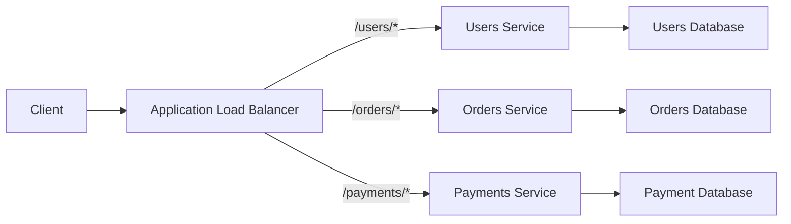
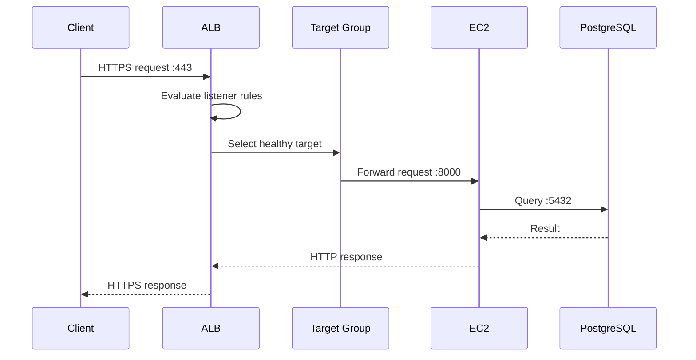
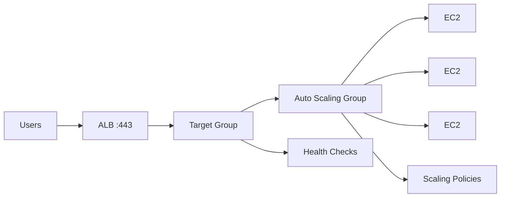
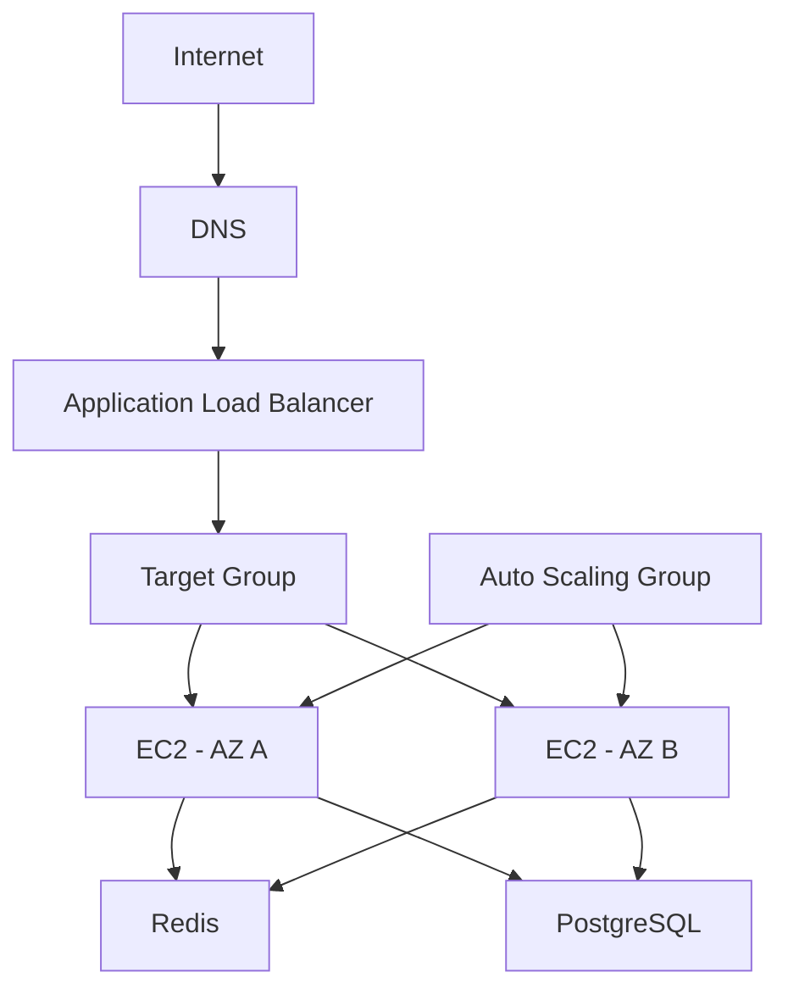

# 05- Load Balancers

## Overview

An AWS load balancer distributes incoming network traffic across multiple backend targets such as EC2 instances, containers, or IP addresses.

For EC2-based backend systems, load balancing provides a stable service endpoint while allowing backend instances to scale, fail, restart, or be replaced independently.

A typical production architecture is:

```text
                    Internet
                       |
                       | HTTPS :443
                       v
              +-------------------+
              | Application       |
              | Load Balancer     |
              +-------------------+
                 /       |       \
                /        |        \
               v         v         v
            EC2-A      EC2-B     EC2-C
           :8000      :8000      :8000
              \         |         /
               \        |        /
                +-------+-------+
                        |
                        v
                   PostgreSQL
```

The load balancer becomes the stable entry point while EC2 instances remain replaceable infrastructure.

For backend engineering, load balancers are important for:

- High availability
- Horizontal scaling
- Health-based traffic routing
- Zero-downtime deployments
- TLS termination
- Connection management
- Service discovery
- Failure isolation
- Blue/green and rolling deployments

---

## What Is a Load Balancer?

A load balancer accepts client traffic and forwards requests or connections to backend targets.

Instead of clients connecting directly to individual EC2 instances:

```text
Client
  |
  +----> EC2-A
  |
  +----> EC2-B
  |
  +----> EC2-C
```

clients connect to a stable load-balancer endpoint:

```text
Client
  |
  v
Load Balancer
  |
  +----> EC2-A
  |
  +----> EC2-B
  |
  +----> EC2-C
```

The load balancer decides which healthy target should receive each request or connection.

---

## Why Load Balancers Exist

Without a load balancer, a production service can become tightly coupled to individual server addresses.

For example:

```text
api.example.com
      |
      v
EC2-A
```

If EC2-A fails, the service becomes unavailable unless another mechanism changes the endpoint.

With a load balancer:

```text
api.example.com
      |
      v
ALB
  /   \
 v     v
EC2-A EC2-B
```

If EC2-A becomes unhealthy:

```text
api.example.com
      |
      v
ALB
      |
      +----X EC2-A
      |
      +------> EC2-B
```

The load balancer can stop routing new traffic to the unhealthy target.

---

## AWS Elastic Load Balancing

AWS provides Elastic Load Balancing (ELB), which supports several load-balancer types.

| Type | Layer / Protocol | Typical Use |
|---|---|---|
| Application Load Balancer | Layer 7 | HTTP/HTTPS applications and APIs |
| Network Load Balancer | Layer 4 | TCP, TLS, UDP, high-performance network traffic |
| Gateway Load Balancer | Layer 3/4-oriented appliance insertion | Network/security appliances |
| Classic Load Balancer | Older generation | Legacy workloads |

For modern EC2 backend applications, the primary choices are usually:

- Application Load Balancer (ALB)
- Network Load Balancer (NLB)

Classic Load Balancer is generally relevant only when maintaining legacy systems.

---

## Application Load Balancer

An Application Load Balancer operates at the HTTP/HTTPS application layer.

It can make routing decisions based on information such as:

- Hostname
- URL path
- HTTP headers
- Query parameters
- HTTP method in supported routing configurations
- Source-related conditions where applicable

Example:

```text
api.example.com/users
        |
        v
      ALB
        |
        +----> Users Service

api.example.com/orders
        |
        v
      ALB
        |
        +----> Orders Service
```

This makes ALB particularly useful for REST APIs and microservice architectures.

---

## ALB Request Routing

A common architecture is:



The ALB provides a shared public entry point while routing requests to different target groups.

---

## Network Load Balancer

A Network Load Balancer operates primarily at Layer 4.

It handles network connections rather than making general HTTP application-level routing decisions.

Typical protocols include:

- TCP
- TLS
- UDP

NLB is useful when you need:

- Very high connection throughput
- Low network-level latency
- TCP-based services
- UDP workloads
- Static IP requirements in appropriate architectures
- TLS pass-through or TLS handling at the load balancer

Example:

```text
Client
  |
  | TCP
  v
NLB
  |
  +----> Service A
  |
  +----> Service B
```

---

## ALB vs NLB

| Characteristic | ALB | NLB |
|---|---|---|
| Primary layer | Layer 7 | Layer 4 |
| HTTP/HTTPS awareness | Yes | No general HTTP routing |
| Path-based routing | Yes | No |
| Host-based routing | Yes | No |
| TCP | Not the primary purpose | Yes |
| UDP | No | Yes |
| TLS support | Yes | Yes |
| Typical backend | REST APIs, web applications | TCP/gRPC/network services |
| Advanced HTTP routing | Yes | No |
| WebSocket support | Yes | Supports TCP-level traffic |
| Typical use | Application routing | Network-level load balancing |

The correct choice depends on the protocol and routing requirements rather than simply choosing the service with the highest throughput.

---

## Core Load Balancer Components

For an ALB, the important components are:

```text
Load Balancer
      |
      +-- Listener
      |
      +-- Listener Rules
      |
      +-- Target Group
              |
              +-- Targets
```

Each component has a distinct responsibility.

---

## Load Balancer

The load balancer provides the client-facing entry point.

For example:

```text
https://api.example.com
        |
        v
ALB
```

The ALB is deployed across multiple Availability Zones for high availability.

Clients should normally use the load balancer's DNS name rather than depending on individual EC2 public IP addresses.

---

## Listener

A listener defines the protocol and port on which the load balancer accepts connections.

For example:

```text
HTTPS :443
```

or:

```text
HTTP :80
```

A listener receives the connection and evaluates its configured rules.

Example:

```text
Client
  |
  | HTTPS :443
  v
ALB Listener
```

---

## Listener Rules

Listener rules determine where requests should go.

For example:

```text
Host: api.example.com
Path: /users/*
        |
        v
Users Target Group
```

Another rule:

```text
Host: api.example.com
Path: /orders/*
        |
        v
Orders Target Group
```

Rules typically contain:

1. Conditions
2. Priority
3. Action

The action may forward the request to a target group or perform another supported listener action.

---

## Target Groups

A target group represents a collection of backend targets.

Example:

```text
ALB
 |
 +---- Target Group: API
 |       |
 |       +---- EC2-A:8000
 |       +---- EC2-B:8000
 |       +---- EC2-C:8000
 |
 +---- Target Group: Admin
         |
         +---- EC2-D:9000
         +---- EC2-E:9000
```

Target groups also define important behavior such as:

- Target type
- Backend port
- Protocol
- Health checks
- Deregistration behavior

---

## Targets

Targets are the actual destinations receiving traffic.

Depending on the load-balancer configuration, targets can include:

- EC2 instances
- IP addresses
- Containers through supported integrations
- Other supported target types

For an EC2 target group:

```text
Target Group
     |
     +---- i-abc123
     +---- i-def456
     +---- i-ghi789
```

Each target has a health state.

---

## Health Checks

Health checks allow the load balancer to determine whether a target can receive traffic.

For an HTTP application:

```text
ALB
 |
 | GET /health
 v
EC2 :8000
 |
 +---- 200 OK
```

If the target repeatedly fails its health-check requirements, the load balancer can mark it unhealthy and stop sending new traffic to it.

A dedicated endpoint is usually preferable:

```text
GET /health
```

rather than using a complex business endpoint.

---

## Health Check Design

A good health endpoint should be:

- Fast
- Deterministic
- Cheap
- Authentication-aware where necessary
- Independent of expensive business operations

For example:

```http
GET /health
```

could return:

```json
{
  "status": "ok"
}
```

A deeper readiness endpoint may separately check dependencies when appropriate:

```http
GET /ready
```

The distinction between liveness and readiness becomes particularly important in containerized systems.

---

## Health Check Dependencies

Avoid making a basic health check depend on every downstream system unless that behavior is intentional.

For example:

```text
ALB
 |
 +---- /health
        |
        +---- PostgreSQL
        +---- Redis
        +---- Kafka
        +---- External API
```

A temporary Redis outage could cause every application instance to become unhealthy even if the API can still serve many requests.

A better model is to distinguish:

```text
/health
    |
    +-- Process is alive

/ready
    |
    +-- Can safely receive traffic
```

The exact implementation depends on the service's failure semantics.

---

## Load-Balanced Request Lifecycle

For an HTTPS API:



The load balancer therefore sits between the client and the application tier.

---

## TLS Termination

A common architecture is TLS termination at the ALB:

```text
Client
   |
   | HTTPS :443
   v
ALB
   |
   | HTTP :8000
   v
EC2
```

The ALB handles the public TLS connection.

The ALB-to-EC2 connection can then use HTTP or HTTPS depending on the security requirements.

For sensitive workloads, encryption can also be maintained between the ALB and targets:

```text
Client
   |
 HTTPS
   v
ALB
   |
 HTTPS
   v
EC2
```

TLS termination is a security and architecture decision, not merely a performance optimization.

---

## Security Group Design

A strong security-group design separates client access from backend access.

Example:

```text
Internet
   |
   | TCP 443
   v
alb-sg
   |
   | TCP 8000
   v
api-sg
   |
   | TCP 5432
   v
db-sg
```

Rules:

```text
alb-sg:
  Inbound TCP 443 from required clients

api-sg:
  Inbound TCP 8000 from alb-sg

db-sg:
  Inbound TCP 5432 from api-sg
```

This is preferable to exposing all backend ports publicly.

---

## Security Group References

When possible, use security-group references for EC2-to-EC2 communication instead of hardcoding instance IP addresses.

For example:

```text
Source:
alb-sg

Destination:
api-sg

Port:
8000
```

This remains stable as EC2 instances are replaced or their private IP addresses change.

---

## Load Balancer Subnets

An internet-facing ALB should be deployed across multiple Availability Zones.

Conceptually:

```text
                Internet
                    |
             +------+------+
             |             |
           AZ-A           AZ-B
             |             |
          ALB node       ALB node
             |             |
          EC2-A          EC2-B
```

This prevents a single Availability Zone failure from becoming a complete load-balancer failure.

The exact subnet design depends on the architecture, but multi-AZ deployment should be the default for production workloads.

---

## Public vs Internal Load Balancers

Load balancers can be:

- Internet-facing
- Internal

### Internet-Facing

Used when clients outside the VPC need access.

```text
Internet
   |
   v
Internet-facing ALB
   |
   v
Private EC2
```

### Internal

Used for private service-to-service traffic.

```text
Service A
   |
   v
Internal ALB
   |
   +---- Service B
   +---- Service C
```

Internal load balancers are useful for microservice architectures where services should not be directly exposed to the internet.

---

## Load Balancing Algorithms

The load balancer determines how traffic is distributed among eligible targets.

The exact behavior depends on the load-balancer type and configuration.

For HTTP applications, request routing can also be influenced by:

- Target health
- Listener rules
- Target-group configuration
- Connection behavior
- Session persistence where configured

Do not assume that traffic will always be distributed in a perfectly equal round-robin pattern.

Long-lived connections can produce uneven connection or request distribution.

---

## Sticky Sessions

Sticky sessions attempt to keep a client's requests associated with the same backend target for a period of time.

Example:

```text
Client A
   |
   +----> EC2-A
   +----> EC2-A
   +----> EC2-A
```

Without stickiness:

```text
Client A
   |
   +----> EC2-A
   +----> EC2-B
   +----> EC2-C
```

Sticky sessions can be useful for legacy stateful applications, but they introduce operational trade-offs.

For scalable backend systems, prefer stateless application instances where possible.

Instead of storing session state in process memory:

```text
EC2-A memory
    |
    +-- Session
```

use an external store when appropriate:

```text
EC2-A ----+
          |
EC2-B ----+----> Redis / Database
          |
EC2-C ----+
```

---

## Connection Draining and Deregistration

When an instance is removed from service, existing connections may need time to complete.

A production deployment should avoid immediately terminating an instance that is still serving active requests.

The lifecycle is conceptually:

```text
Healthy
   |
   v
Deregister
   |
   v
Draining
   |
   v
No active traffic
   |
   v
Terminate
```

This is especially important for:

- Long-running HTTP requests
- Streaming responses
- WebSockets
- Graceful deployments
- Auto Scaling replacements

The exact behavior and configuration depend on the load-balancer type.

---

## Auto Scaling Integration

A common EC2 architecture combines:

- ALB
- Target group
- Auto Scaling Group
- Launch template



The Auto Scaling Group manages capacity while the load balancer manages traffic distribution.

These are complementary responsibilities.

---

## Load Balancer and Auto Scaling Responsibilities

| Component | Responsibility |
|---|---|
| Load Balancer | Receive and distribute traffic |
| Target Group | Group targets and define health-check behavior |
| Auto Scaling Group | Maintain desired instance capacity |
| Launch Template | Define how instances are created |
| Health Check | Determine whether targets are eligible for traffic |
| CloudWatch | Provide metrics and alarms |

A load balancer does not replace Auto Scaling.

Similarly, Auto Scaling does not replace a load balancer.

---

## Zero-Downtime Deployment

A common deployment pattern is:

```text
Version A
EC2-A
EC2-B

       |
       | Deploy
       v

Version A + Version B
EC2-A
EC2-B
EC2-C

       |
       | Health checks pass
       v

Version B
EC2-C
EC2-D
```

The load balancer ensures that only healthy targets receive new traffic.

A deployment controller or CI/CD system manages the replacement strategy.

---

## Blue/Green Deployment

Blue/green deployment separates environments:

```text
                    ALB
                     |
              +------+------+
              |             |
            Blue          Green
              |             |
           Version A      Version B
```

Traffic can initially remain on Blue.

After Green passes validation:

```text
ALB
 |
 +----> Green
 |
 X---- Blue
```

This provides a clear rollback boundary.

The exact implementation may use separate target groups, listener rules, or deployment services.

---

## Canary Deployments

Canary deployment gradually exposes a new version.

Conceptually:

```text
ALB
 |
 +---- 95% ----> Version A
 |
 +----  5% ----> Version B
```

After observing:

- Error rates
- Latency
- Throughput
- Application metrics
- Business metrics

traffic can be shifted further.

The load balancer is one component of the deployment architecture; automated validation and rollback logic remain necessary.

---

## Path-Based Routing

ALB can route requests based on URL paths.

Example:

```text
/api/users/*
       |
       v
Users Target Group

/api/orders/*
       |
       v
Orders Target Group
```

This can support modular service architectures without requiring separate public domains for every service.

However, path-based routing can also create coupling between infrastructure and service boundaries.

For larger microservice systems, dedicated service discovery or an API gateway may be more appropriate.

---

## Host-Based Routing

ALB can route based on hostnames.

Example:

```text
api.example.com
      |
      v
API Target Group

admin.example.com
      |
      v
Admin Target Group
```

This is useful for separating applications while sharing load-balancer infrastructure.

---

## gRPC and Load Balancers

gRPC uses HTTP/2 and can be load balanced using appropriate AWS load-balancer configurations.

A simplified architecture is:

```text
Service A
    |
    | gRPC
    v
Load Balancer
    |
    +---- Service B
    +---- Service B
```

When designing gRPC traffic, consider:

- HTTP/2 support
- TLS
- Long-lived connections
- Health checks
- Connection reuse
- Streaming behavior
- Target registration
- Load-balancing characteristics

Long-lived gRPC connections can behave differently from short-lived REST requests because a connection may remain associated with a target for an extended period.

---

## WebSockets and Long-Lived Connections

WebSocket workloads introduce different operational characteristics from ordinary request/response APIs.

A connection may remain open for a long period:

```text
Client
  |
  | WebSocket
  |-------------------------|
  |                         |
  v                         v
ALB                      EC2
```

Capacity planning should consider:

- Concurrent connections
- Connection duration
- Idle timeouts
- Target capacity
- Deployment draining
- Connection termination behavior

Do not size a WebSocket service based only on requests per second.

---

## Load Balancer Timeouts

Timeout behavior is important for backend applications.

Consider:

```text
Client
  |
  v
ALB
  |
  v
FastAPI
  |
  v
Long-running operation
```

If the load balancer's timeout is shorter than the application's expected response time, the client may receive an error even though the backend eventually completes the operation.

For long-running work, prefer asynchronous patterns:

```text
Client
   |
   v
API
   |
   +----> Celery / SQS / Kafka
             |
             v
          Worker
```

Instead of holding an HTTP request open for a long computation.

---

## Stateless Application Design

Load balancing works best when application instances are interchangeable.

Prefer:

```text
EC2-A \
EC2-B  ---> Shared external state
EC2-C /
```

rather than:

```text
EC2-A
  |
  +-- Important local state

EC2-B
  |
  +-- Different important local state
```

Externalize state where appropriate:

- PostgreSQL
- Redis
- S3
- DynamoDB
- Kafka
- Other managed or shared systems

This makes scaling and instance replacement safer.

---

## Logging and Observability

A production load-balancer setup should provide visibility at multiple layers.

Monitor:

### Load Balancer

- Request count
- Request latency
- HTTP error rates
- Target errors
- Rejected connections where applicable
- Healthy/unhealthy target counts
- Connection metrics
- TLS-related metrics where applicable

### Application

- Request latency
- Application errors
- Database latency
- Dependency failures
- CPU and memory
- Worker saturation

### Infrastructure

- EC2 status checks
- Network traffic
- Instance capacity
- Auto Scaling events

A useful mental model is:

```text
Client
  |
  v
Load Balancer Metrics
  |
  v
Application Metrics
  |
  v
Infrastructure Metrics
  |
  v
Dependency Metrics
```

---

## Access Logs

Load-balancer access logs can help investigate:

- Client requests
- Response status
- Target behavior
- Latency
- Request paths
- User-agent information
- Source information

For production systems, centralize logs and define retention according to operational and compliance requirements.

Avoid relying solely on application logs when diagnosing traffic-routing problems.

---

## Common Failure Scenarios

### Targets Are Unhealthy

Possible causes:

- Wrong health-check path
- Wrong target port
- Security group blocks load-balancer traffic
- Application not listening
- Application bound to `127.0.0.1`
- Application returns an unexpected status code
- Network routing problem

Troubleshooting sequence:

```text
ALB
 |
 +-- Listener correct?
 |
 +-- Target group correct?
 |
 +-- Target registered?
 |
 +-- Health check correct?
 |
 +-- Security group allows traffic?
 |
 +-- Application listening?
 |
 +-- Application endpoint healthy?
```

---

## 502 and 503 Errors

Load-balancer errors must be interpreted in context.

Common causes can include:

- No healthy targets
- Backend connection failures
- Incorrect target port
- Application crashes
- Protocol mismatch
- TLS configuration problems
- Backend timeout behavior

Do not assume every `502` or `503` is caused by the load balancer itself.

Trace the request through:

```text
Client
  |
  v
Load Balancer
  |
  v
Target
  |
  v
Application
  |
  v
Dependency
```

---

## Security Considerations

### Restrict Backend Ports

Do not expose the application port publicly when the load balancer is the intended entry point.

Prefer:

```text
Internet -> ALB :443
ALB SG   -> API SG :8000
```

over:

```text
Internet -> EC2 :8000
```

### Use TLS

Public APIs should normally use HTTPS.

### Protect Administrative Interfaces

Do not expose:

```text
/admin
/metrics
/debug
```

without appropriate access controls.

### Avoid Security Group Over-Permissions

Do not allow:

```text
api-sg -> db-sg :0-65535
```

when only PostgreSQL is required.

Prefer:

```text
api-sg -> db-sg :5432
```

---

## Performance Considerations

Load balancers introduce an additional network hop:

```text
Client -> Load Balancer -> Application
```

This adds some processing and network overhead but enables capabilities that are usually more important at scale:

- Horizontal scaling
- Health-aware routing
- TLS termination
- Traffic distribution
- Centralized ingress

Performance tuning should focus on end-to-end latency rather than attempting to eliminate the load balancer purely because it adds a network hop.

---

## Capacity Planning

Do not size an EC2 service only by CPU.

Consider:

- Requests per second
- Concurrent connections
- Request size
- Response size
- CPU
- Memory
- Network bandwidth
- Database capacity
- Connection pools
- External dependencies
- Long-running requests

For example:

```text
10,000 requests/sec
```

does not provide enough information to determine required EC2 capacity without understanding request complexity and latency requirements.

---

## Cost Considerations

Load balancers introduce infrastructure cost.

When designing an architecture, consider:

- Number of load balancers
- Traffic volume
- Load-balancer processing capacity
- Cross-AZ traffic patterns
- Idle or unnecessary load balancers
- Logging and storage costs

Do not create a separate load balancer for every small service without an architectural reason.

Conversely, avoid forcing unrelated workloads behind a single load balancer if that creates operational coupling or an unnecessarily large failure domain.

---

## Disaster Recovery

A load balancer does not by itself provide disaster recovery.

For regional disaster recovery, the architecture may require:

```text
Region A
  |
  +-- Load Balancer
  +-- EC2
  +-- Database

Region B
  |
  +-- Load Balancer
  +-- EC2
  +-- Database
```

Traffic-management services can then direct users to an appropriate healthy region.

The correct design depends on:

- RTO
- RPO
- Data replication
- Application state
- Deployment strategy
- DNS architecture
- Regional dependencies

---

## Operational Best Practices

- Deploy production load balancers across multiple Availability Zones.
- Use ALB for HTTP/HTTPS application routing when Layer 7 features are required.
- Use NLB for appropriate Layer 4 workloads.
- Keep backend EC2 instances private when public access is not required.
- Use dedicated security groups for load balancers and application targets.
- Allow backend ports from the load balancer security group rather than broad CIDRs where practical.
- Configure meaningful health checks.
- Keep health-check endpoints lightweight.
- Design application instances to be stateless where possible.
- Use graceful deregistration during deployments and scaling operations.
- Monitor target health and load-balancer error metrics.
- Use Auto Scaling for capacity management.
- Test failure scenarios instead of assuming health checks are sufficient.
- Treat listener, target-group, and port changes as deployment-sensitive infrastructure changes.
- Document listener-to-target port mappings.
- Use Infrastructure as Code for repeatable load-balancer configuration.

---

## Common Mistakes and Pitfalls

### Sending Traffic Directly to EC2 Public IPs

This bypasses the load-balancing layer and makes instance replacement more difficult.

### Exposing Backend Ports Publicly

Opening port `8000` to the internet simply because the API uses port 8000 increases the attack surface.

### Incorrect Health Check Path

The application may be healthy while the configured health-check endpoint returns an unexpected status.

### Wrong Target Port

The target group may forward to port `8000` while the application listens on `8080`.

### Security Group Mismatch

The ALB can be healthy while every target remains inaccessible because the target security group does not allow traffic from the load balancer security group.

### Stateful Application Design

Keeping critical session or application state in EC2 memory can create problems when requests move between instances.

### Ignoring Long-Lived Connections

WebSockets, streaming APIs, and gRPC can have connection behavior very different from short REST requests.

### Treating Load Balancer Health as Application Health

A target passing a basic TCP or HTTP health check does not necessarily mean the entire application dependency graph is healthy.

### Ignoring Deployment Draining

Immediately terminating instances during deployment can interrupt active requests.

---

## Troubleshooting Checklist

When an EC2-backed service behind a load balancer is unavailable, inspect the path in order:

```text
DNS
  |
  v
Load Balancer
  |
  +-- Listener
  |
  +-- Listener Rules
  |
  v
Target Group
  |
  +-- Target Registration
  |
  +-- Health Check
  |
  v
Security Group
  |
  v
Network Routing
  |
  v
EC2
  |
  +-- Listening Port
  |
  +-- Host Firewall
  |
  v
Application
  |
  +-- Dependencies
```

Useful EC2-side commands include:

```bash
ss -lntp
```

```bash
curl -v http://127.0.0.1:8000/health
```

```bash
curl -v http://10.0.10.25:8000/health
```

If localhost works but the private IP does not, investigate the bind address and host-level networking.

If the EC2 private IP works but the load balancer reports the target as unhealthy, investigate the target-group health check, security group, routing, and load-balancer configuration.

---

## AWS CLI Inspection

Load-balancer configuration can be inspected through the AWS CLI.

List load balancers:

```bash
aws elbv2 describe-load-balancers
```

List target groups:

```bash
aws elbv2 describe-target-groups
```

Inspect listeners:

```bash
aws elbv2 describe-listeners \
  --load-balancer-arn <load-balancer-arn>
```

Inspect registered targets:

```bash
aws elbv2 describe-target-health \
  --target-group-arn <target-group-arn>
```

The target-health command is particularly useful during troubleshooting.

---

## Example Production Architecture

A common EC2 backend architecture is:



The responsibilities are separated:

```text
DNS
  -> Service discovery

ALB
  -> Traffic distribution

Target Group
  -> Target membership + health

Auto Scaling
  -> Capacity management

EC2
  -> Application execution

Redis
  -> Shared cache/state where appropriate

PostgreSQL
  -> Persistent relational data
```

This separation makes the architecture easier to scale and operate.

---

## Interview Considerations

### What is the difference between ALB and NLB?

ALB operates at the application layer and provides HTTP-aware features such as host- and path-based routing. NLB operates at the network layer and is designed for TCP, TLS, UDP, and high-performance connection-oriented workloads.

### What is a target group?

A target group is a logical collection of backend targets together with configuration such as protocol, port, and health-check behavior.

### Why are health checks required?

They allow the load balancer to determine which targets are eligible to receive traffic.

### Does a load balancer replace Auto Scaling?

No.

```text
Load Balancer -> Traffic distribution
Auto Scaling  -> Capacity management
```

They solve different problems.

### Why use separate security groups for ALB and EC2?

It allows the backend tier to accept traffic only from the load balancer rather than directly from arbitrary clients.

### Why should EC2 instances usually be stateless behind a load balancer?

Because any healthy instance should be able to process a request. This makes horizontal scaling, replacement, and failure recovery significantly easier.

### What happens when an EC2 target becomes unhealthy?

The load balancer can stop sending new traffic to that target while healthy targets continue serving requests.

### Why can an ALB return an error even when EC2 is running?

The EC2 instance can be running while the application is not listening, the health check is misconfigured, the target port is incorrect, or network/security controls prevent the load balancer from reaching the application.

### Why can an application work on localhost but fail through the ALB?

The application may be bound only to `127.0.0.1`, the target port may be wrong, or security-group/network configuration may prevent the load balancer from reaching the instance.

### Why is a load balancer useful for zero-downtime deployments?

It can route traffic only to healthy targets while instances are added, validated, drained, and replaced.

## Key Takeaways

- A load balancer provides a stable entry point while distributing traffic across replaceable backend targets.
- ALB is suited to HTTP/HTTPS application routing, while NLB is designed for Layer 4 workloads such as TCP, TLS, and UDP.
- Production EC2 architectures should separate load-balancer and backend security groups, allowing application ports only from trusted load-balancer sources.
- Health checks, graceful deregistration, stateless application design, and Auto Scaling work together to support reliable horizontal scaling and deployments.
- Troubleshooting should follow the complete request path: DNS, listener, rules, target group, health check, security groups, networking, EC2 listener, application, and dependencies.