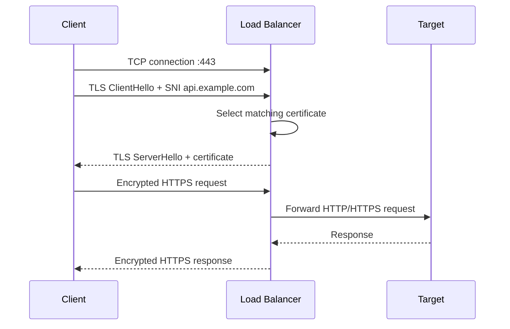
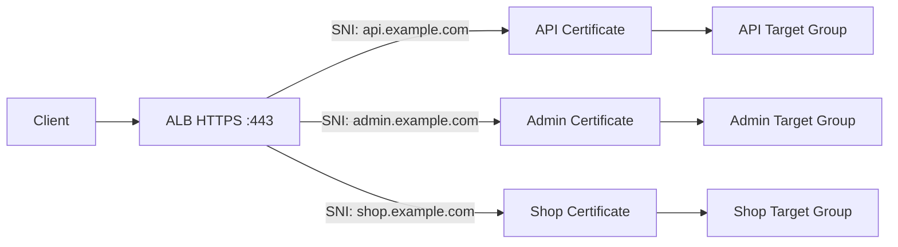

# 06- SNI

## Overview

Server Name Indication (SNI) is a TLS extension that allows a client to tell a server which hostname it is trying to connect to during the TLS handshake.

SNI is important when multiple HTTPS services share the same IP address and TCP port, typically:

```text
IP:443
```

Without SNI, a server receiving a TLS connection may not know which hostname's certificate should be presented before the encrypted HTTP request is available.

With SNI:

```text
Client
  |
  | TLS ClientHello
  | server_name = api.example.com
  v
Load Balancer
  |
  +-- api.example.com certificate
  |
  +-- admin.example.com certificate
  |
  +-- payments.example.com certificate
```

AWS Application Load Balancers and Network Load Balancers support SNI for secure listeners with multiple certificates. AWS automatically enables SNI when more than one server certificate is associated with a secure listener. :contentReference[oaicite:0]{index=0}

SNI is therefore a key concept when designing:

- Multi-domain HTTPS architectures
- AWS ALB/NLB TLS termination
- Shared load balancers
- Reverse proxies such as Nginx
- Microservice ingress
- Certificate management
- Multi-tenant platforms

---

## Why SNI Exists

Historically, a server could use one IP address and one certificate for a secure endpoint.

For example:

```text
203.0.113.10:443
        |
        v
api.example.com
```

If multiple HTTPS domains shared the same endpoint:

```text
203.0.113.10:443
        |
        +---- api.example.com
        |
        +---- admin.example.com
        |
        +---- shop.example.com
```

the server needed a way to determine which certificate to present.

The problem occurs during the TLS handshake, before the HTTP request containing the `Host` header is available.

SNI solves this by placing the requested hostname into the TLS handshake.

---

## TLS Without SNI

Conceptually:

```text
Client
  |
  | TLS ClientHello
  v
Server
  |
  | Which certificate?
  |
  +---- ????
```

The server may have multiple certificates:

```text
api.example.com
admin.example.com
shop.example.com
```

but the client has not yet provided enough hostname information through HTTP.

---

## TLS With SNI

With SNI:

```text
Client
  |
  | ClientHello
  | SNI = api.example.com
  v
Server
  |
  | Select certificate
  v
api.example.com certificate
```

The server can select the appropriate certificate before completing the TLS handshake.

---

## SNI Request Flow

A simplified HTTPS connection looks like:



The critical point is that SNI is available during the TLS handshake, before the encrypted HTTP request is processed.

---

## What SNI Contains

The SNI value is normally a hostname such as:

```text
api.example.com
```

It is not:

```text
https://api.example.com/users
```

and it does not contain:

- HTTP method
- URL path
- Query parameters
- HTTP headers
- Request body

Conceptually:

```text
SNI
 |
 +-- Hostname
       |
       +-- api.example.com
```

The HTTP request comes later after TLS negotiation.

---

## SNI vs HTTP Host Header

SNI and the HTTP `Host` header serve different purposes.

| Characteristic | SNI | HTTP Host |
|---|---|---|
| Protocol layer | TLS | HTTP |
| Sent during | TLS handshake | HTTP request |
| Available before TLS completes | Yes | No |
| Used for certificate selection | Yes | No |
| Used for HTTP routing | Indirectly / as input to architecture | Yes |
| Encrypted with normal TLS | The hostname is exposed in the TLS handshake | Yes, after TLS establishment |

For example:

```text
TLS ClientHello
SNI: api.example.com
        |
        v
Certificate selection
        |
        v
TLS established
        |
        v
HTTP Request
Host: api.example.com
GET /users
```

A load balancer can therefore use SNI to choose the appropriate certificate and then use HTTP information for application-level routing.

---

## SNI and Certificate Selection

Suppose an ALB has one HTTPS listener:

```text
HTTPS :443
```

and three certificates:

```text
api.example.com
admin.example.com
payments.example.com
```

A client connecting to:

```text
https://api.example.com
```

sends:

```text
SNI = api.example.com
```

The load balancer can select:

```text
api.example.com certificate
```

while clients connecting to other hostnames can receive their corresponding certificates.

AWS uses a certificate-selection algorithm for listeners with certificate lists. When a hostname matches multiple certificates, AWS considers characteristics such as public-key algorithm, hashing algorithm, key length, and validity period when selecting the certificate. :contentReference[oaicite:1]{index=1}

---

## SNI on AWS Load Balancers

AWS supports SNI on secure listeners.

For an Application Load Balancer:

```text
ALB
 |
 +-- HTTPS :443
       |
       +-- Certificate A
       +-- Certificate B
       +-- Certificate C
```

For a Network Load Balancer:

```text
NLB
 |
 +-- TLS :443
       |
       +-- Certificate A
       +-- Certificate B
       +-- Certificate C
```

AWS automatically enables SNI when multiple certificates are associated with a secure listener. :contentReference[oaicite:2]{index=2}

---

## ALB SNI Architecture

A typical multi-domain architecture is:



The certificate selection and HTTP routing are related but separate stages.

---

## SNI and ALB Listener Rules

Consider:

```text
api.example.com
admin.example.com
```

Both use:

```text
HTTPS :443
```

The ALB can use:

```text
SNI
 |
 +-- Select appropriate certificate
 |
 v
TLS established
 |
 v
HTTP Host
 |
 +-- Route to appropriate target group
```

For example:

```text
api.example.com
        |
        +-- Certificate: API certificate
        |
        +-- Target Group: API

admin.example.com
        |
        +-- Certificate: Admin certificate
        |
        +-- Target Group: Admin
```

SNI handles certificate selection; listener rules can then handle HTTP routing.

---

## One Listener, Multiple Domains

Without SNI, a simple architecture might require separate endpoints:

```text
api.example.com
    |
    v
IP-A:443

admin.example.com
    |
    v
IP-B:443
```

With SNI:

```text
api.example.com -----+
                     |
admin.example.com ---+--> ALB :443
                     |
shop.example.com ----+
```

Multiple secure domains can therefore share the same listener and network endpoint.

This can simplify infrastructure and reduce the number of load balancers required.

---

## SNI vs Wildcard Certificates

SNI is not a replacement for wildcard certificates.

They solve different problems.

### Wildcard Certificate

A certificate such as:

```text
*.example.com
```

can cover:

```text
api.example.com
admin.example.com
shop.example.com
```

subject to the certificate's hostname-matching rules.

### SNI

SNI allows the server to select among multiple certificates:

```text
api.example.com       -> API certificate
admin.example.com     -> Admin certificate
payments.example.com  -> Payments certificate
```

The two techniques can also be combined.

---

## SNI vs SAN Certificates

A Subject Alternative Name (SAN) certificate can contain multiple hostnames.

For example:

```text
Certificate:
    DNS:api.example.com
    DNS:admin.example.com
    DNS:shop.example.com
```

SNI and SAN solve different problems:

| Mechanism | Purpose |
|---|---|
| SNI | Tells server which hostname the client wants |
| SAN | Allows one certificate to contain multiple hostnames |
| Wildcard | Covers matching subdomains |
| Multiple SNI certificates | Allows different certificates for different hostnames |

The correct certificate strategy depends on domain ownership, isolation requirements, certificate lifecycle, and architecture.

---

## When to Use SNI

SNI is particularly useful when:

- Multiple HTTPS domains share one load balancer.
- Multiple certificates are required on one listener.
- Different customers have different certificates.
- A multi-tenant platform uses custom domains.
- Multiple applications share an ingress endpoint.
- You want to avoid separate load balancers for every hostname.
- Certificates need independent lifecycle management.

---

## Multi-Tenant SaaS Example

A SaaS platform might support:

```text
customer-a.example.com
customer-b.example.com
customer-c.example.com
```

A shared ALB can terminate TLS:

```text
Clients
   |
   | HTTPS :443
   v
ALB
   |
   +-- customer-a certificate
   +-- customer-b certificate
   +-- customer-c certificate
```

The application can then route based on the hostname:

```text
Host: customer-a.example.com
        |
        v
Tenant A

Host: customer-b.example.com
        |
        v
Tenant B
```

At scale, certificate lifecycle automation becomes critical.

---

## SNI in Nginx

Nginx can also serve multiple TLS certificates based on the requested hostname.

Conceptually:

```nginx
server {
    listen 443 ssl;
    server_name api.example.com;

    ssl_certificate /etc/nginx/certs/api/fullchain.pem;
    ssl_certificate_key /etc/nginx/certs/api/privkey.pem;
}

server {
    listen 443 ssl;
    server_name admin.example.com;

    ssl_certificate /etc/nginx/certs/admin/fullchain.pem;
    ssl_certificate_key /etc/nginx/certs/admin/privkey.pem;
}
```

Both servers can listen on:

```text
443
```

Nginx uses the hostname information provided through SNI during the TLS handshake to select the appropriate server configuration and certificate.

---

## SNI and Reverse Proxy Architecture

A common architecture is:

```text
Internet
   |
   | HTTPS :443
   v
ALB
   |
   | HTTPS/HTTP
   v
Nginx
   |
   +---- Django
   |
   +---- FastAPI
   |
   +---- Other services
```

There may therefore be multiple TLS termination points.

For example:

```text
Client
  |
 HTTPS
  v
ALB
  |
 HTTPS
  v
Nginx
  |
 HTTP
  v
FastAPI
```

If TLS is terminated at both ALB and Nginx, the two TLS connections are independent.

---

## TLS Termination and SNI

SNI is relevant to the endpoint that performs TLS negotiation.

Example:

```text
Client
   |
   | TLS + SNI
   v
ALB
   |
   | HTTP
   v
EC2
```

Here:

```text
Client -> ALB
```

is the TLS connection where SNI is used.

The ALB then forwards decrypted HTTP traffic to the target.

If TLS is also used between ALB and EC2:

```text
Client
   |
   | TLS + SNI
   v
ALB
   |
   | TLS
   v
EC2
```

the backend TLS connection is separate from the client-side TLS session.

---

## SNI Does Not Encrypt the Hostname

An important security detail is that traditional TLS SNI is sent in the initial TLS handshake.

Therefore, a network observer can generally see the hostname from ordinary SNI even though the HTTP request itself is encrypted.

Conceptually:

```text
Encrypted:
    HTTP headers
    HTTP path
    Request body
    Response body

Historically visible in TLS handshake:
    SNI hostname
```

This is one reason technologies such as Encrypted ClientHello (ECH) exist, but ECH support and deployment considerations are separate from ordinary AWS ALB/NLB SNI configuration.

Do not describe SNI as an encryption mechanism.

---

## SNI and Certificate Validation

SNI does not replace certificate validation.

A client still validates that the certificate presented by the server is appropriate for the requested hostname.

For example:

```text
Requested hostname:
api.example.com

Presented certificate:
admin.example.com
```

The client can reject the connection because the certificate does not match the requested hostname.

Therefore:

```text
SNI
  |
  +-- Helps server choose certificate

Certificate validation
  |
  +-- Helps client verify server identity
```

These are complementary mechanisms.

---

## Default Certificate

A secure AWS listener has a default certificate.

If the client does not provide SNI, the listener uses the default certificate. AWS documentation also specifies that the default certificate is used when there is no matching certificate in the listener's certificate list. :contentReference[oaicite:3]{index=3}

Example:

```text
ALB :443

Default:
    default.example.com

Certificate list:
    api.example.com
    admin.example.com
```

A client using:

```text
SNI = api.example.com
```

can receive the API certificate.

A client without SNI may receive:

```text
default.example.com
```

If that certificate does not match the requested hostname, certificate validation can fail.

---

## Certificate List

AWS secure listeners support a certificate list in addition to the default certificate.

Conceptually:

```text
HTTPS Listener :443
        |
        +-- Default Certificate
        |
        +-- Certificate List
              |
              +-- api.example.com
              +-- admin.example.com
              +-- payments.example.com
```

AWS provides APIs and CLI operations to inspect and manage these certificates. :contentReference[oaicite:4]{index=4}

---

## AWS Certificate Manager

For AWS load balancers, AWS Certificate Manager (ACM) is commonly used to provision or import certificates.

A typical architecture is:

```text
Route 53
   |
   v
api.example.com
   |
   v
ALB :443
   |
   +-- ACM Certificate
```

ACM integrates with Elastic Load Balancing for certificate deployment. :contentReference[oaicite:5]{index=5}

Using ACM can simplify:

- Certificate issuance
- Renewal
- Load-balancer attachment
- Certificate lifecycle management

Certificate lifecycle automation is preferable to manually managing private keys on EC2 instances when AWS-managed certificates meet the architecture's requirements.

---

## AWS CLI: Inspect Listener Certificates

List load balancers:

```bash
aws elbv2 describe-load-balancers
```

List listeners:

```bash
aws elbv2 describe-listeners \
  --load-balancer-arn <load-balancer-arn>
```

Inspect certificates attached to a listener:

```bash
aws elbv2 describe-listener-certificates \
  --listener-arn <listener-arn>
```

The API returns the default certificate and the listener certificate list. :contentReference[oaicite:6]{index=6}

---

## AWS CLI: Add an SNI Certificate

Add another certificate to an HTTPS or TLS listener:

```bash
aws elbv2 add-listener-certificates \
  --listener-arn <listener-arn> \
  --certificates CertificateArn=<certificate-arn>
```

AWS exposes `AddListenerCertificates` specifically for adding certificates to the certificate list of HTTPS or TLS listeners. :contentReference[oaicite:7]{index=7}

---

## AWS CLI: Replace the Default Certificate

To replace the default certificate:

```bash
aws elbv2 modify-listener \
  --listener-arn <listener-arn> \
  --certificates CertificateArn=<new-certificate-arn>
```

AWS documents `modify-listener` for replacing the default certificate. :contentReference[oaicite:8]{index=8}

The default certificate should be managed carefully because it is the fallback certificate for connections that do not use a matching SNI certificate.

---

## AWS CLI: Remove an SNI Certificate

Remove a certificate from the listener certificate list:

```bash
aws elbv2 remove-listener-certificates \
  --listener-arn <listener-arn> \
  --certificates CertificateArn=<certificate-arn>
```

Do not remove a certificate until you have confirmed that no production hostname still depends on it. :contentReference[oaicite:9]{index=9}

---

## Testing SNI

OpenSSL can be used to inspect certificate selection.

Example:

```bash
openssl s_client \
  -connect api.example.com:443 \
  -servername api.example.com \
  -showcerts
```

The important option is:

```text
-servername api.example.com
```

which supplies the SNI hostname.

You can compare certificate selection by changing the hostname:

```bash
openssl s_client \
  -connect api.example.com:443 \
  -servername admin.example.com
```

This is useful when debugging multi-domain TLS configuration.

---

## Testing Without SNI

For troubleshooting legacy clients or unexpected default-certificate behavior:

```bash
openssl s_client \
  -connect api.example.com:443
```

Without `-servername`, the client does not explicitly send the requested SNI hostname.

The server may therefore return its default certificate.

This is a useful diagnostic technique for understanding why a client sees an unexpected certificate.

---

## Certificate Rotation

SNI architectures make certificate lifecycle management more granular.

Suppose:

```text
api.example.com -> Certificate A
admin.example.com -> Certificate B
```

Rotating only the API certificate does not require replacing the admin certificate.

A safe workflow is:

```text
Request / import new certificate
          |
          v
Validate certificate
          |
          v
Add certificate to listener
          |
          v
Test hostname
          |
          v
Promote / replace where appropriate
          |
          v
Remove obsolete certificate
```

Automated certificate management is preferable for large environments.

---

## Certificate Rotation Pitfall

A common mistake is to replace the default certificate and assume that all SNI certificates have also been replaced.

They are separate concepts.

For example:

```text
Default:
old-default.example.com

Certificate list:
api.example.com
admin.example.com
```

Changing the default certificate does not automatically rotate every certificate in the listener's certificate list.

Each certificate must have an appropriate lifecycle.

AWS explicitly documents managing the default certificate separately from certificates in the listener certificate list. :contentReference[oaicite:10]{index=10}

---

## SNI and Security

SNI itself does not provide authentication or encryption.

Security comes from the TLS protocol and certificate validation.

A secure architecture should consider:

- Valid certificates
- Strong TLS security policies
- Certificate lifecycle
- Private-key protection
- Domain validation
- HTTPS-only public access
- Appropriate load-balancer security groups
- Application authentication and authorization

AWS secure listeners use TLS security policies to determine supported protocols and cipher suites. :contentReference[oaicite:11]{index=11}

---

## SNI and Multi-Tenant Security

Multi-tenant systems require additional isolation beyond certificate selection.

For example:

```text
tenant-a.example.com
tenant-b.example.com
```

SNI can select different certificates, but it does not automatically prevent:

```text
tenant A request
      |
      v
tenant B application data
```

Application-level tenant isolation is still required.

SNI provides:

```text
Hostname
   |
   v
Certificate selection
```

It does not provide:

```text
Hostname
   |
   v
Authorization
```

---

## SNI and ALB vs NLB

Both ALB and NLB can use multiple certificates on secure listeners.

| Capability | ALB | NLB |
|---|---|---|
| Secure listener | HTTPS | TLS |
| Multiple certificates | Yes | Yes |
| SNI | Yes | Yes |
| HTTP host/path routing | Yes | No general Layer 7 routing |
| Certificate selection | TLS layer | TLS layer |
| Typical use | Web/API applications | TCP/TLS network services |

AWS documents certificate lists and SNI behavior for both ALB HTTPS listeners and NLB TLS listeners. :contentReference[oaicite:12]{index=12}

---

## SNI and TLS Passthrough

SNI is relevant when the endpoint performing TLS negotiation can inspect the ClientHello.

Consider two NLB architectures.

### TLS Termination at NLB

```text
Client
  |
  | TLS + SNI
  v
NLB TLS Listener
  |
  | Decrypted traffic
  v
EC2
```

The NLB can select the appropriate certificate.

### TLS Passthrough

```text
Client
  |
  | Encrypted TLS
  v
NLB TCP Listener
  |
  | Encrypted TLS
  v
EC2
```

The NLB is not terminating TLS in this configuration. The backend becomes responsible for certificate selection and TLS handling.

AWS specifically documents using a TCP listener on port 443 when encrypted traffic should pass through without the NLB decrypting it. :contentReference[oaicite:13]{index=13}

---

## SNI and HTTP Routing Are Different Decisions

Consider:

```text
Client
  |
  | SNI = api.example.com
  v
ALB
  |
  +-- Select API certificate
  |
  v
TLS established
  |
  +-- Host: api.example.com
  +-- Path: /orders
  |
  v
Orders target group
```

The first decision is:

```text
Which certificate?
```

The second decision is:

```text
Which backend?
```

Do not treat SNI as equivalent to ALB listener routing.

---

## Performance Considerations

SNI itself is lightweight compared with the rest of a TLS handshake.

The larger operational concerns are:

- TLS handshake rate
- Certificate count
- Certificate management
- Connection reuse
- TLS session resumption
- Load-balancer capacity
- Backend connection management

For high-throughput services, connection reuse and TLS termination architecture can have a more significant effect than the hostname lookup performed for SNI certificate selection.

---

## Monitoring and Operations

For production SNI deployments, monitor:

- Certificate expiration
- Certificate renewal status
- Listener certificate configuration
- TLS handshake failures
- Hostname/certificate mismatches
- Load-balancer TLS errors
- Unexpected default-certificate usage
- Certificate deployment failures

A useful operational inventory is:

| Hostname | Certificate | Listener | Target Group | Renewal |
|---|---|---|---|---|
| `api.example.com` | API certificate | HTTPS :443 | API | ACM-managed |
| `admin.example.com` | Admin certificate | HTTPS :443 | Admin | ACM-managed |
| `payments.example.com` | Payment certificate | HTTPS :443 | Payments | ACM-managed |

This becomes especially important in multi-tenant systems with many custom domains.

---

## Common Mistakes

### Assuming SNI Is the Certificate

SNI is a hostname sent by the client.

The certificate is a separate TLS object selected by the server.

```text
SNI
 |
 +-- Requested hostname

Certificate
 |
 +-- Server identity
```

### Assuming SNI Encrypts the Hostname

Traditional SNI is sent during the TLS handshake and should not be treated as a mechanism for hiding the requested hostname.

### Forgetting the Default Certificate

Clients that do not provide SNI or do not match a certificate may receive the default certificate.

### Using the Wrong Certificate

The certificate must cover the requested hostname through its valid names, such as CN/SAN entries.

### Confusing SNI With HTTP Host

SNI is part of TLS negotiation.

`Host` is an HTTP header sent after TLS establishment.

### Rotating Only the Default Certificate

Other certificates in the listener's certificate list have independent lifecycles.

### Assuming SNI Provides Tenant Isolation

SNI selects certificates. It does not enforce authorization or tenant boundaries.

### Forgetting Legacy Clients

Clients that do not support SNI may receive the default certificate and fail hostname validation.

### Treating Wildcard Certificates and SNI as Alternatives

A wildcard certificate can cover many hostnames, while SNI allows different certificates to be selected. They can be used together.

---

## Troubleshooting SNI

When a client receives the wrong certificate, check the following:

```text
Client
  |
  +-- Sends SNI?
  |
  v
Load Balancer
  |
  +-- Correct secure listener?
  |
  +-- Certificate attached?
  |
  +-- Hostname covered by certificate?
  |
  +-- Correct default certificate?
  |
  v
TLS Handshake
```

Useful checks:

```bash
openssl s_client \
  -connect api.example.com:443 \
  -servername api.example.com
```

Inspect the listener:

```bash
aws elbv2 describe-listeners \
  --load-balancer-arn <load-balancer-arn>
```

Inspect listener certificates:

```bash
aws elbv2 describe-listener-certificates \
  --listener-arn <listener-arn>
```

If the expected certificate is not present, investigate ACM certificate status, listener configuration, and certificate-list membership.

---

## Production Best Practices

- Use ACM-managed certificates where appropriate.
- Associate only certificates required by the listener.
- Maintain an inventory of hostname-to-certificate mappings.
- Automate certificate issuance and renewal.
- Monitor certificate expiration and renewal failures.
- Keep a deliberate default certificate.
- Test certificate rotation before production rollout.
- Use HTTPS listeners for public web/API traffic.
- Keep backend security groups restricted to trusted sources.
- Distinguish certificate selection from HTTP routing.
- Do not rely on SNI for authentication or tenant isolation.
- Test clients that may not support SNI if legacy compatibility matters.
- Use Infrastructure as Code for listener and certificate configuration.
- Remove obsolete certificates after verifying that no hostname depends on them.

---

## Interview Considerations

### What is SNI?

Server Name Indication is a TLS extension that allows a client to send the hostname it wants to connect to during the TLS handshake.

### Why is SNI required?

It allows a server or load balancer to select the appropriate TLS certificate when multiple HTTPS domains share the same IP address and port.

### Does SNI happen before HTTP?

Yes.

```text
TCP
  |
  v
TLS ClientHello + SNI
  |
  v
Certificate selection
  |
  v
TLS established
  |
  v
HTTP request
```

### What is the difference between SNI and Host header?

SNI is part of TLS negotiation and is available before the encrypted HTTP request. The HTTP `Host` header is part of the HTTP request and becomes available after TLS is established.

### Can multiple certificates be attached to an AWS ALB listener?

Yes. AWS supports certificate lists for HTTPS listeners, allowing multiple domains to share a secure listener using SNI. :contentReference[oaicite:14]{index=14}

### What happens when the client does not send SNI?

The load balancer uses the default certificate. If that certificate does not match the hostname the client expects, certificate validation can fail. :contentReference[oaicite:15]{index=15}

### Does SNI encrypt traffic?

No. SNI helps with certificate selection. TLS provides encryption and authentication.

### Can SNI be used with NLB?

Yes. AWS Network Load Balancers support SNI for TLS listeners with certificate lists. :contentReference[oaicite:16]{index=16}

### Does SNI perform HTTP routing?

No. SNI primarily provides the hostname during TLS negotiation. ALB listener rules can subsequently use HTTP information such as the host and path for application-level routing.

### What is the difference between SNI and wildcard certificates?

A wildcard certificate covers a set of matching hostnames with one certificate. SNI allows the server to select among multiple certificates based on the hostname supplied by the client.

## Key Takeaways

- SNI is a TLS extension that sends the requested hostname during the TLS handshake, allowing a load balancer or server to select the appropriate certificate before HTTP is available.
- AWS ALB HTTPS and NLB TLS listeners can use multiple certificates on the same listener, with SNI selecting the appropriate certificate for matching hostnames.
- SNI certificate selection and HTTP routing are separate decisions: SNI selects the TLS certificate, while ALB listener rules can route the resulting HTTP request.
- SNI does not provide encryption, authentication, or tenant isolation; those responsibilities belong to TLS, application security, and authorization controls.
- Production SNI architectures require deliberate certificate lifecycle management, monitoring, default-certificate handling, and automated rotation.