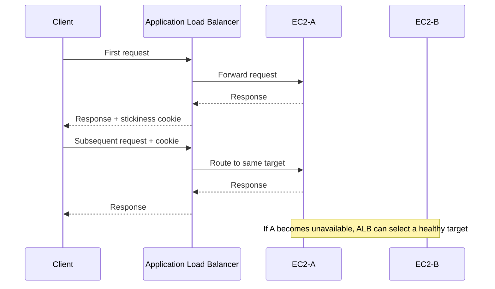
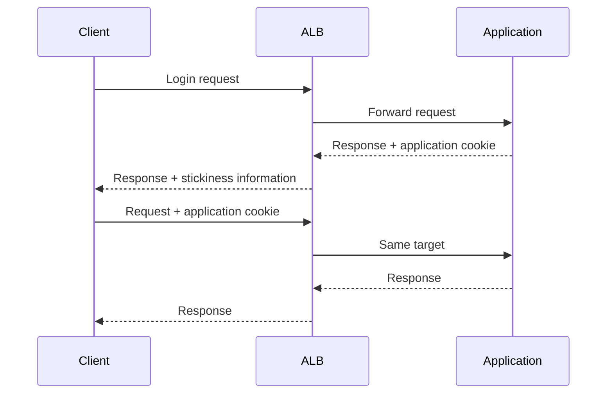
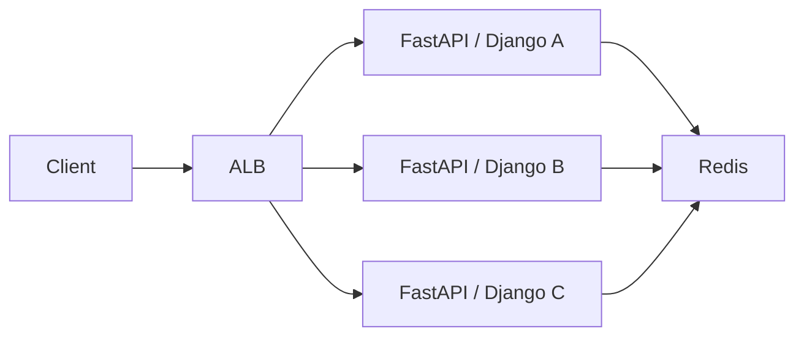
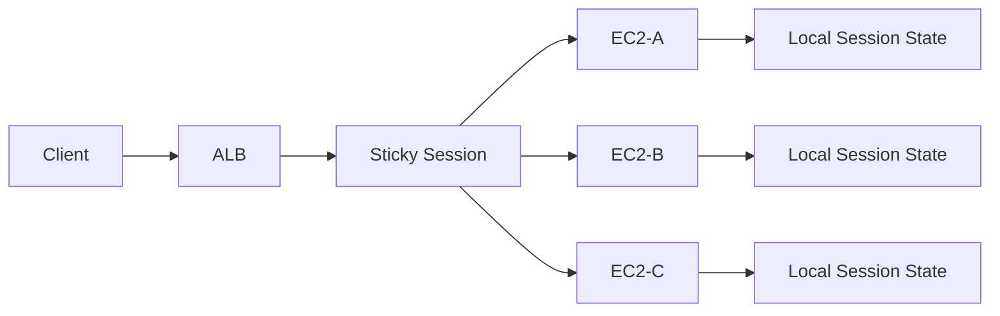
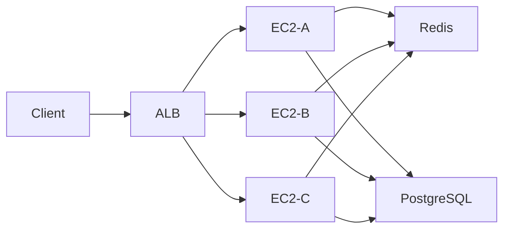

# 07- Sticky Sessions

## Overview

Sticky sessions, also called **session affinity**, cause a load balancer to route subsequent requests from a client to the same backend target for a configured period.

Without stickiness:

```text
Client
  |
  v
Load Balancer
  |
  +----> EC2-A
  +----> EC2-B
  +----> EC2-C
```

With stickiness:

```text
Client A
  |
  v
Load Balancer
  |
  +----> EC2-B
  +----> EC2-B
  +----> EC2-B
```

Sticky sessions are primarily useful when an application maintains state locally on an individual server.

However, stickiness is generally a **compatibility mechanism for stateful applications**, not the preferred architecture for modern horizontally scalable backend systems. Stateless applications with externally stored state are usually easier to scale, deploy, and recover.

AWS Application Load Balancers support duration-based and application-based cookie stickiness at the target-group level. Network Load Balancers support source-IP-based stickiness for applicable target groups. :contentReference[oaicite:0]{index=0}

---

## Why Sticky Sessions Exist

Consider a Django application with in-memory session state:

```text
Client
  |
  v
ALB
  |
  +----> EC2-A
           |
           +-- Session state
```

The client logs in and receives a session:

```text
Client
   |
   | Login
   v
EC2-A
   |
   +-- user_session = authenticated
```

If the next request is routed to EC2-B:

```text
Client
   |
   | API request
   v
ALB
   |
   v
EC2-B
   |
   +-- Session not found
```

The application may treat the client as unauthenticated.

Sticky sessions solve this by attempting to keep the client on EC2-A:

```text
Client
   |
   v
ALB
   |
   +----> EC2-A
   +----> EC2-A
   +----> EC2-A
```

---

## Sticky Sessions vs Stateless Architecture

There are two fundamentally different approaches.

### Stateful Backend

```text
Client
  |
  v
ALB
  |
  +----> EC2-A
           |
           +-- Session in memory
```

Requires affinity.

### Stateless Backend

```text
Client
  |
  v
ALB
  |
  +----> EC2-A
  +----> EC2-B
  +----> EC2-C
          |
          v
   Shared state store
```

State can be stored in:

- Redis
- PostgreSQL
- DynamoDB
- S3
- Other appropriate external systems

This allows any healthy instance to process the request.

For modern backend systems, the second architecture is generally easier to operate.

---

## How Sticky Sessions Work

For cookie-based stickiness, the basic flow is:



The first request is routed using the normal target-selection algorithm.

The load balancer then establishes the affinity relationship.

Subsequent requests containing the relevant cookie are routed to the same target while the stickiness relationship remains valid. :contentReference[oaicite:1]{index=1}

---

## Types of Sticky Sessions

For AWS Application Load Balancers, the main target-group stickiness mechanisms are:

| Type | Mechanism | Typical Use |
|---|---|---|
| Duration-based | Load-balancer-generated cookie | Simple application affinity |
| Application-based | Application cookie + ALB cookie | Application controls session lifetime |
| Target-group stickiness | Cookie-based selection between weighted target groups | Blue/green or weighted routing |
| WebSocket | Connection itself remains associated with target | Long-lived connections |

ALB supports duration-based and application-based stickiness. Target-group stickiness is a separate feature used when forwarding traffic across multiple target groups. :contentReference[oaicite:2]{index=2}

---

## Duration-Based Stickiness

Duration-based stickiness uses a load-balancer-generated cookie.

For ALB, the relevant cookie is:

```text
AWSALB
```

For applicable CORS requests, ALB also generates:

```text
AWSALBCORS
```

The client sends the cookie back on subsequent requests, allowing the ALB to associate those requests with the same target. :contentReference[oaicite:3]{index=3}

Conceptually:

```text
First request
    |
    v
ALB
    |
    v
EC2-A
    |
    v
Set-Cookie: AWSALB=...
```

Then:

```text
Client
    |
    | Cookie: AWSALB=...
    v
ALB
    |
    v
EC2-A
```

The load-balancer-generated cookie is encrypted and cannot be modified or decoded by the application. :contentReference[oaicite:4]{index=4}

---

## Duration-Based Configuration

The stickiness duration determines how long requests from a client should remain associated with the same target.

For ALB, the configured duration can range from:

```text
1 second
    |
    v
7 days
```

The configured duration is different from the browser cookie's implementation details, so application teams should reason about the effective affinity behavior rather than assuming the cookie is simply a fixed server-side session record. AWS documents that ALB resets the expiry of the generated cookie after requests. :contentReference[oaicite:5]{index=5}

A practical configuration might be:

```text
Stickiness:
    Enabled

Type:
    Load balancer generated cookie

Duration:
    300 seconds
```

---

## AWS CLI: Enable Duration-Based Stickiness

For an ALB target group:

```bash
aws elbv2 modify-target-group-attributes \
  --target-group-arn <target-group-arn> \
  --attributes \
    Key=stickiness.enabled,Value=true \
    Key=stickiness.type,Value=lb_cookie \
    Key=stickiness.lb_cookie.duration_seconds,Value=300
```

AWS exposes these target-group attributes through `modify-target-group-attributes`. :contentReference[oaicite:6]{index=6}

---

## Inspect Stickiness Configuration

Inspect target-group attributes:

```bash
aws elbv2 describe-target-group-attributes \
  --target-group-arn <target-group-arn>
```

Look for values such as:

```text
stickiness.enabled
stickiness.type
stickiness.lb_cookie.duration_seconds
```

This is useful when investigating whether an unexpected routing pattern is caused by stickiness. :contentReference[oaicite:7]{index=7}

---

## Application-Based Stickiness

Application-based stickiness is useful when the application already manages a session cookie.

Conceptually:

```text
Client
  |
  | Application session cookie
  v
ALB
  |
  +----> EC2-A
```

The application returns its own cookie:

```http
Set-Cookie: session_id=abc123
```

The ALB uses the application cookie in conjunction with its own stickiness mechanism to maintain affinity.

This approach gives the application more control over the session lifecycle.

AWS requires an application cookie name for application-based stickiness, and cookie names beginning with `AWSALB`, `AWSALBAPP`, or `AWSALBTG` are reserved. :contentReference[oaicite:8]{index=8}

---

## Application-Based Stickiness Flow



The application controls its own session cookie, while the load balancer uses the configured application-based stickiness mechanism to maintain affinity.

---

## Application Cookie Example

A Django application might create a session cookie:

```text
sessionid=abc123
```

The architecture could be:

```text
Client
  |
  | sessionid
  v
ALB
  |
  v
EC2-A
  |
  +-- Django
```

Subsequent requests can remain associated with EC2-A while the stickiness relationship is valid.

The important distinction is:

```text
Application cookie
    |
    +-- Represents application/session state

ALB stickiness
    |
    +-- Controls target affinity
```

These are related but not identical responsibilities.

---

## AWS CLI: Application-Based Stickiness

A target group can be configured with an application cookie:

```bash
aws elbv2 modify-target-group-attributes \
  --target-group-arn <target-group-arn> \
  --attributes \
    Key=stickiness.enabled,Value=true \
    Key=stickiness.type,Value=app_cookie \
    Key=stickiness.app_cookie.cookie_name,Value=sessionid \
    Key=stickiness.app_cookie.duration_seconds,Value=3600
```

The application cookie duration supported by ALB is configurable from 1 second through 7 days. :contentReference[oaicite:9]{index=9}

---

## When Sticky Sessions Are Useful

Sticky sessions can be appropriate when:

- A legacy application stores session state locally.
- Refactoring the application to stateless operation is not immediately practical.
- A temporary compatibility layer is required.
- Certain workloads benefit from target affinity.
- A deployment architecture explicitly requires target persistence.
- A stateful application maintains temporary local context.

AWS Prescriptive Guidance specifically identifies applications that maintain temporary state, such as some legacy web applications, as use cases for stickiness. :contentReference[oaicite:10]{index=10}

---

## When Sticky Sessions Are Usually Unnecessary

Avoid stickiness when:

- Every application instance is stateless.
- Sessions are stored in Redis or a database.
- Requests can safely reach any instance.
- The application is designed for horizontal scaling.
- You want maximum flexibility during deployments.
- Traffic distribution should remain as balanced as possible.

For example:

```text
Client
  |
  v
ALB
  |
  +---- EC2-A
  +---- EC2-B
  +---- EC2-C
        |
        v
      Redis
```

Any instance can retrieve the session state.

---

## Django and Sticky Sessions

Django can use server-side sessions.

A problematic architecture is:

```text
ALB
 |
 +---- EC2-A
 |       |
 |       +-- Local session
 |
 +---- EC2-B
         |
         +-- Different local session
```

A more scalable architecture is:

```text
ALB
 |
 +---- EC2-A
 +---- EC2-B
 +---- EC2-C
       |
       v
     Redis
```

For example, Django can use Redis-backed session storage so that session state is shared across instances.

The exact session backend configuration depends on the application's requirements and chosen Django/Redis integration.

---

## FastAPI and Sticky Sessions

FastAPI applications should generally be designed to avoid local request state that must survive between requests.

For example:

```text
FastAPI-A
FastAPI-B
FastAPI-C
      |
      v
Redis
```

can support:

- Session state
- Rate-limit state
- Temporary workflow state
- Distributed locks where appropriate

This allows the load balancer to distribute requests without requiring client affinity.

---

## Redis as an Alternative

A common pattern is:



Instead of:

```text
Client -> same EC2 instance
```

the architecture becomes:

```text
Client -> any healthy EC2
              |
              v
           Redis
```

This improves horizontal scalability because backend instances are interchangeable.

---

## Sticky Sessions and Auto Scaling

Sticky sessions complicate scaling.

Without stickiness:

```text
EC2-A
EC2-B
EC2-C

Traffic:
  A -> B -> C -> A -> B -> C
```

With stickiness:

```text
Client A -> EC2-A
Client B -> EC2-B
Client C -> EC2-C
```

When a new instance is added:

```text
EC2-A
EC2-B
EC2-C
EC2-D
```

existing sticky clients may continue using their original targets until the affinity relationship changes.

Therefore, newly added capacity may not immediately receive an evenly distributed share of traffic.

This can reduce the effectiveness of horizontal scaling for workloads with highly uneven client distributions.

---

## Load Imbalance

Suppose:

```text
1000 clients
```

are distributed:

```text
EC2-A -> 700 clients
EC2-B -> 200 clients
EC2-C -> 100 clients
```

Even though the instances are identical, the load is not.

This can happen because stickiness preserves client-to-target affinity.

The problem becomes more severe when individual clients have very different traffic volumes.

For example:

```text
Client A -> 1000 requests/sec
Client B -> 5 requests/sec
Client C -> 2 requests/sec
```

If Client A is pinned to EC2-A, that instance can become a hotspot.

---

## Scaling Implications

Sticky sessions change the relationship between:

```text
Number of instances
```

and:

```text
Effective capacity
```

Adding instances does not necessarily rebalance existing sticky clients immediately.

Therefore, autoscaling decisions should consider:

- Per-target request rate
- Per-target CPU
- Memory
- Connection count
- Latency
- Uneven client distribution

Do not evaluate only aggregate service metrics.

---

## Failure Handling

Stickiness does not mean a client is permanently bound to one instance.

If the selected target becomes unhealthy or is deregistered, the load balancer can select another healthy target.

For ALB duration-based and application-based stickiness, AWS documents that if a cookie refers to a target that is unhealthy or has been deregistered, the load balancer selects a new target and updates the cookie. :contentReference[oaicite:11]{index=11}

Conceptually:

```text
Client
  |
  | Sticky -> EC2-A
  v
EC2-A
  |
  X
Unhealthy
  |
  v
ALB
  |
  +----> EC2-B
```

The client therefore experiences a target transition.

Applications must tolerate this transition correctly.

---

## Why Local State Is Dangerous

Suppose a user starts a multi-step workflow:

```text
Step 1 -> EC2-A
Step 2 -> EC2-A
Step 3 -> EC2-A
```

The application stores workflow state in memory:

```text
EC2-A
 |
 +-- workflow_state
```

If EC2-A fails:

```text
Step 4 -> EC2-B
```

The state is gone.

Sticky sessions did not solve the fundamental durability problem.

They only reduced the probability of a request reaching another instance.

For durable workflows, externalize state:

```text
EC2-A \
EC2-B  ---> Redis / PostgreSQL
EC2-C /
```

---

## Sticky Sessions and High Availability

Sticky sessions can reduce flexibility during failures.

A healthy load-balanced architecture should be able to tolerate target replacement:

```text
Target A
   |
   X
Failure
   |
   v
Target B
```

If the application depends heavily on local state, the target transition may cause user-visible failures.

Therefore:

> Stickiness should not be used as a substitute for state management.

---

## Sticky Sessions and Deployments

Consider a rolling deployment:

```text
Version A:
EC2-A
EC2-B
EC2-C
```

During deployment:

```text
EC2-A -> Version B
```

Clients previously pinned to EC2-A may be affected by the target's draining and replacement lifecycle.

A well-designed deployment should use:

- Health checks
- Graceful deregistration
- Connection draining
- Backward-compatible application changes
- Externalized state

AWS documents that when a target is draining and a new request arrives, ALB routes that request to a healthy target rather than the draining target. :contentReference[oaicite:12]{index=12}

---

## Blue/Green Deployments

Sticky sessions can affect blue/green deployments.

Consider:

```text
ALB
 |
 +---- Blue target group
 |
 +---- Green target group
```

If traffic is moved from Blue to Green while clients maintain target or target-group affinity, the traffic transition may not behave like a simple instantaneous percentage split.

AWS provides target-group stickiness specifically for scenarios involving weighted target groups. When enabled, the ALB can use the `AWSALBTG` cookie to keep a client associated with the selected target group. :contentReference[oaicite:13]{index=13}

For deployments, always distinguish:

```text
Target stickiness
```

from:

```text
Target-group stickiness
```

They solve different routing problems.

---

## Target Stickiness vs Target-Group Stickiness

| Feature | Target Stickiness | Target-Group Stickiness |
|---|---|---|
| Purpose | Keep client on same backend target | Keep client on same target group |
| Scope | EC2/IP target | Target group |
| Example | Client stays on EC2-A | Client stays on Blue group |
| Typical use | Stateful backend | Weighted/blue-green routing |
| Cookie example | `AWSALB` | `AWSALBTG` |

AWS documents target-group stickiness separately from target-level cookie stickiness. :contentReference[oaicite:14]{index=14}

---

## WebSockets

WebSocket connections are inherently associated with the target that accepts the connection upgrade.

For example:

```text
Client
  |
  | HTTP Upgrade
  v
ALB
  |
  v
EC2-A
  |
  | 101 Switching Protocols
  v
WebSocket connection
```

After the WebSocket upgrade, the connection remains associated with that target.

AWS documents that cookie-based stickiness is not used after a WebSocket connection is established because the WebSocket connection itself is inherently sticky. :contentReference[oaicite:15]{index=15}

This is different from ordinary HTTP request-level stickiness.

---

## Network Load Balancer Stickiness

NLB supports source-IP-based stickiness for applicable target groups.

Conceptually:

```text
Client IP
   |
   v
NLB
   |
   +----> EC2-A
```

Subsequent connections from the same source IP can be directed to the same target.

This has an important limitation:

```text
Many clients
     |
     v
NAT Gateway / Corporate NAT
     |
     v
NLB
     |
     v
EC2-A
```

Many users can appear to originate from the same source IP.

AWS explicitly notes that source-IP stickiness can produce uneven connection distribution when multiple clients are behind the same NAT device. :contentReference[oaicite:16]{index=16}

---

## NLB Source-IP Stickiness

NLB source-IP stickiness is fundamentally different from ALB cookie-based stickiness.

| Characteristic | ALB Cookie Stickiness | NLB Source-IP Stickiness |
|---|---|---|
| Mechanism | Cookie | Source IP |
| Layer | Application/TLS-aware architecture | Network |
| Client support required | Cookie support | No cookie |
| Stateful web sessions | Good fit when required | Not directly session-aware |
| NAT sensitivity | Lower | Higher |
| Protocol scope | HTTP/HTTPS | Applicable NLB target-group traffic |

NLB source-IP stickiness should therefore be evaluated against the actual client network topology.

---

## Security Considerations

Sticky-session cookies can influence routing, but they should not be treated as authentication credentials.

Do not design the application around:

```text
AWSALB cookie = authenticated user
```

Authentication should remain independent:

```text
Authentication
    |
    +-- Session/token

Routing affinity
    |
    +-- Stickiness cookie
```

For application-managed cookies, use appropriate security attributes such as:

```text
Secure
HttpOnly
SameSite
```

according to the application's browser and API requirements.

Also remember that ALB-generated stickiness cookies are load-balancer routing mechanisms, not authorization mechanisms.

---

## Cookie Considerations

For browser-based applications, cookie behavior can be affected by:

- Domain
- Path
- `Secure`
- `HttpOnly`
- `SameSite`
- CORS
- Cross-origin requests
- Browser cookie policies

AWS documents that CORS requests may require `SameSite=None; Secure` behavior and that ALB generates `AWSALBCORS` for duration-based stickiness. :contentReference[oaicite:17]{index=17}

If stickiness appears inconsistent in a browser, inspect the actual request and response cookies before changing load-balancer configuration.

---

## Performance Considerations

Sticky sessions can improve locality when a target maintains useful in-memory state.

For example:

```text
Client
  |
  v
EC2-A
  |
  +-- Local cache
```

Repeated requests may benefit from that local state.

However, the trade-off is reduced traffic flexibility.

Potential problems include:

- Uneven load
- Hot targets
- Reduced scaling efficiency
- Poor failure locality
- More complicated deployments
- Increased operational coupling

For most stateless APIs, distributing requests freely is usually preferable.

---

## Cost Considerations

Sticky sessions do not usually introduce a major direct infrastructure cost by themselves.

The larger cost implications are architectural.

For example, if stickiness prevents efficient scaling:

```text
3 instances
   |
   +-- Underutilized
```

while one instance becomes overloaded:

```text
EC2-A -> 90%
EC2-B -> 30%
EC2-C -> 25%
```

additional instances may not solve the hotspot efficiently.

Externalizing state into Redis or another shared service introduces its own cost, but may improve overall scalability and operational reliability.

---

## Monitoring Sticky Sessions

Monitor stickiness indirectly through target-level behavior.

Useful metrics include:

- Requests per target
- Active connections per target
- Target CPU
- Target memory
- Target latency
- Error rate
- Healthy target count
- Auto Scaling activity

Look for patterns such as:

```text
Target A -> 70% traffic
Target B -> 20%
Target C -> 10%
```

when the service is expected to distribute traffic more evenly.

For NLB source-IP stickiness, investigate NAT-heavy client populations when a target receives disproportionate connection volume. :contentReference[oaicite:18]{index=18}

---

## Troubleshooting Sticky Sessions

When a client unexpectedly changes targets, check:

```text
Client
  |
  +-- Cookie present?
  |
  +-- Cookie accepted by client?
  |
  v
Load Balancer
  |
  +-- Stickiness enabled?
  |
  +-- Correct target group?
  |
  +-- Cookie type correct?
  |
  v
Target
  |
  +-- Healthy?
  |
  +-- Registered?
```

For ALB, inspect target-group attributes:

```bash
aws elbv2 describe-target-group-attributes \
  --target-group-arn <target-group-arn>
```

Then inspect the client request for:

```text
Cookie: AWSALB=...
```

or, depending on the architecture:

```text
Cookie: AWSALBCORS=...
```

For weighted target-group stickiness, inspect:

```text
AWSALBTG
```

AWS documents these cookies as part of its stickiness mechanisms. :contentReference[oaicite:19]{index=19}

---

## Common Mistakes

### Using Sticky Sessions Instead of Externalizing State

This is the most important architectural mistake.

Incorrect:

```text
Session state
    |
    v
EC2-A memory
    |
    v
Sticky sessions
```

Prefer:

```text
Session state
    |
    v
Redis / Database
    |
    v
Any healthy EC2
```

### Setting Excessively Long Stickiness

Long affinity periods can reduce the effectiveness of scaling and deployments.

Use the shortest duration that satisfies the actual application requirement.

### Assuming Stickiness Means Permanent Affinity

Targets can fail, become unhealthy, or be deregistered.

The application must tolerate target changes.

### Ignoring Load Imbalance

A service can have healthy instances while traffic is heavily concentrated on one target.

### Using Local Sessions With Auto Scaling

A new instance does not automatically contain the session state stored in another instance.

### Forgetting NAT Effects

NLB source-IP stickiness can cause many clients behind one NAT address to converge on the same target. :contentReference[oaicite:20]{index=20}

### Treating Sticky Cookies as Authentication

Routing cookies should never replace authentication or authorization.

### Ignoring Deployment Behavior

Sticky clients can interact differently with rolling and blue/green deployments than non-sticky clients.

### Using Stickiness Without a Business Requirement

If any healthy instance can safely serve the request, stickiness adds complexity without solving a real problem.

---

## Production Architecture

A stateful legacy application might use:



A more scalable architecture is:



The second architecture removes the requirement for client-to-instance affinity for shared application state.

---

## Decision Framework

Use the following decision process:

```text
Does the application require a request
to reach the same target?
        |
       No
        |
        v
Do not enable sticky sessions.

        |
       Yes
        |
        v
Can the state be externalized?
        |
       Yes
        |
        v
Externalize state and avoid stickiness.

        |
       No
        |
        v
Is stickiness operationally acceptable?
        |
       Yes
        |
        v
Configure the shortest practical
stickiness duration.
```

This keeps stickiness as an explicit architectural choice rather than a default configuration.

---

## Interview Considerations

### What are sticky sessions?

Sticky sessions are a load-balancer feature that attempts to route requests from the same client to the same backend target for a period of time.

### Why are sticky sessions needed?

They are primarily used when application state is tied to a specific backend instance.

### Why are sticky sessions generally avoided in stateless applications?

Because they reduce routing flexibility, can create uneven load, complicate scaling, and make deployments and failure recovery more dependent on individual targets.

### How does ALB implement sticky sessions?

ALB supports duration-based stickiness using load-balancer-generated cookies and application-based stickiness using application cookies. :contentReference[oaicite:21]{index=21}

### What is the `AWSALB` cookie?

It is a load-balancer-generated cookie used by ALB for duration-based target stickiness. Its contents are encrypted by AWS. :contentReference[oaicite:22]{index=22}

### What happens if a sticky target becomes unhealthy?

ALB can select another healthy target and update the stickiness relationship rather than continuing to send new requests to the unhealthy target. :contentReference[oaicite:23]{index=23}

### Do sticky sessions guarantee that a client will always use the same EC2 instance?

No. Target health, deregistration, expiration, and other load-balancer behavior can cause the client to be routed to another target.

### What is the difference between target stickiness and target-group stickiness?

Target stickiness keeps a client associated with a specific backend target. Target-group stickiness keeps a client associated with a selected target group, which is useful in weighted or blue/green routing scenarios. :contentReference[oaicite:24]{index=24}

### Are WebSockets sticky?

WebSocket connections are inherently associated with the target that accepts the connection upgrade; ALB does not use cookie-based stickiness after the WebSocket upgrade. :contentReference[oaicite:25]{index=25}

### How does NLB stickiness differ from ALB stickiness?

NLB can use source-IP-based stickiness, while ALB provides cookie-based target stickiness for HTTP/HTTPS workloads. Source-IP stickiness can create uneven distribution when many clients share a NAT address. :contentReference[oaicite:26]{index=26}

### How would you remove the need for sticky sessions in Django?

Move session and other shared state out of individual EC2 instances, for example into Redis or a database, and make application instances stateless.

## Key Takeaways

- Sticky sessions provide client-to-target affinity and are primarily useful when an application depends on state tied to a specific backend instance.
- ALB supports duration-based and application-based cookie stickiness, while NLB supports source-IP stickiness for applicable target groups. :contentReference[oaicite:27]{index=27}
- Stickiness can cause uneven load, reduce scaling efficiency, and complicate deployments, so it should not replace proper externalized state management.
- Stateless Django, FastAPI, and microservice applications should generally store shared session or workflow state in systems such as Redis or PostgreSQL rather than relying on instance-local memory.
- Always design for target failure and replacement: sticky affinity is temporary routing behavior, not a durability or high-availability mechanism.