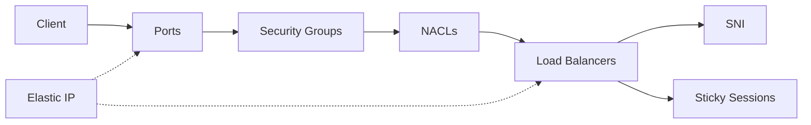
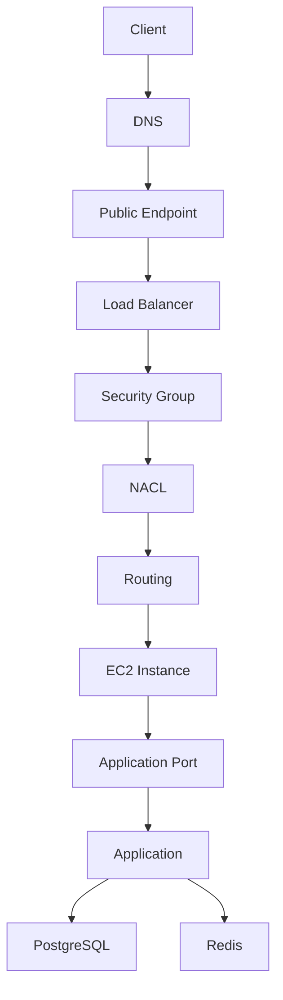
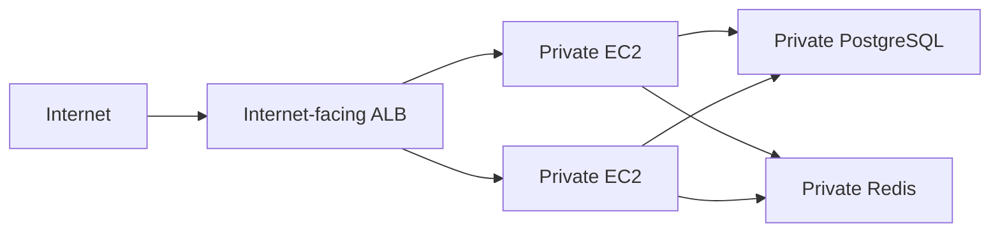
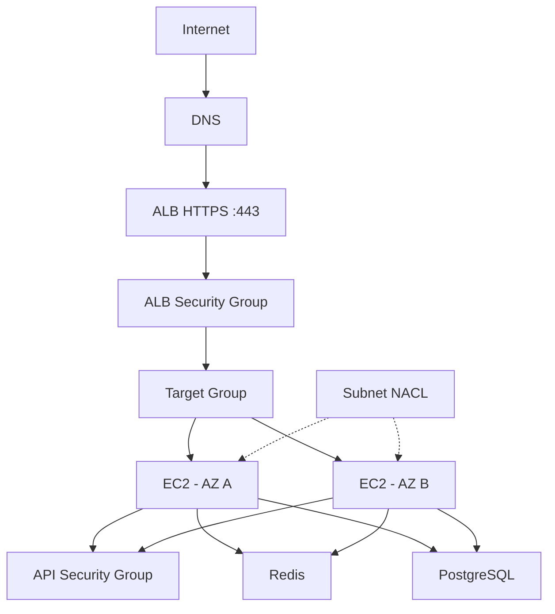

# README

## Overview

The EC2 networking section covers the network controls and traffic-management concepts required to expose, isolate, route, and operate EC2-based backend services safely.

The topics progress from fundamental traffic controls to higher-level application delivery patterns:



The section focuses on understanding the complete traffic path rather than treating each networking component independently.

A typical production request path may look like:

```text
Client
  |
  | HTTPS :443
  v
Load Balancer
  |
  | Application port
  v
EC2
  |
  | Database port
  v
PostgreSQL
```

Each layer has a different responsibility:

| Component | Primary Responsibility |
|---|---|
| Ports | Identify transport-layer service endpoints |
| Security Groups | Stateful instance/network-interface traffic control |
| NACLs | Stateless subnet-level traffic control |
| Elastic IP | Stable public IPv4 addressing |
| Load Balancer | Traffic distribution and application/network ingress |
| SNI | TLS hostname-based certificate selection |
| Sticky Sessions | Client-to-target affinity |

---

## Navigation

| # | File | Description |
|---|---|---|
| 01 | [01- Security Groups](./01-%20Security%20Groups.md) | Stateful instance-level traffic filtering, ingress/egress rules, security-group references, and production security patterns |
| 02 | [02- NACL vs Security Groups](./02-%20NACL%20vs%20Security%20Groups.md) | Stateful vs stateless filtering, subnet-level controls, rule ordering, ephemeral ports, and design differences |
| 03 | [03- Elastic IP](./03-%20Elastic%20IP.md) | Static public IPv4 addresses, allocation, association, lifecycle, cost, and production use cases |
| 04 | [04- Ports](./04-%20Ports.md) | TCP/UDP ports, listening sockets, ephemeral ports, service exposure, connectivity, and troubleshooting |
| 05 | [05- Load Balancers](./05-%20Load%20Balancers.md) | ALB, NLB, listeners, target groups, health checks, routing, high availability, and EC2 integration |
| 06 | [06- SNI](./06-%20SNI.md) | TLS hostname indication, certificate selection, multi-domain HTTPS, ACM, and AWS load-balancer integration |
| 07 | [07- Sticky Sessions](./07-%20Sticky%20Sessions.md) | Client-to-target affinity, ALB cookie stickiness, stateful applications, scaling implications, and alternatives |

---

## Recommended Learning Order

The concepts are best understood in the following order:

```text
Security Groups
      |
      v
NACL vs Security Groups
      |
      v
Elastic IP
      |
      v
Ports
      |
      v
Load Balancers
      |
      v
SNI
      |
      v
Sticky Sessions
```

### Security Groups

Start with security groups because they are the primary traffic-control mechanism for EC2 network interfaces.

Understand:

- Inbound rules
- Outbound rules
- Stateful behavior
- Protocol and port restrictions
- CIDR-based access
- Security-group references
- Application-tier isolation

### NACL vs Security Groups

Next, understand how subnet-level NACLs differ from security groups.

Focus on:

- Stateful vs stateless behavior
- Explicit deny rules
- Rule ordering
- Ephemeral ports
- Subnet-level filtering
- When NACLs are appropriate

### Elastic IP

Then learn how public IPv4 addressing works when a stable public address is required.

Focus on:

- Allocation
- Association
- Disassociation
- Release
- Public vs private addressing
- Failure recovery
- Cost implications

### Ports

Understand how applications expose network services.

Focus on:

- TCP and UDP
- Listening sockets
- Source and destination ports
- Ephemeral ports
- Bind addresses
- Application ports
- Docker and Kubernetes port mappings

### Load Balancers

After understanding traffic controls and ports, move to load balancing.

Focus on:

- ALB vs NLB
- Listeners
- Listener rules
- Target groups
- Health checks
- Target registration
- Multi-AZ deployment
- Auto Scaling integration
- TLS termination

### SNI

SNI should be learned after load balancers because it explains how multiple HTTPS hostnames and certificates can share a secure listener.

Focus on:

- TLS ClientHello
- Hostname indication
- Certificate selection
- Default certificates
- ACM
- Multi-domain HTTPS
- ALB/NLB certificate lists

### Sticky Sessions

Finish with sticky sessions because they depend on understanding load balancers and target routing.

Focus on:

- Target affinity
- ALB cookie-based stickiness
- Application-based stickiness
- Stateful vs stateless applications
- Scaling implications
- Failure behavior
- Session externalization

---

## Traffic Flow Model

A useful way to reason about EC2 networking is to trace traffic from the client to the application.



Not every architecture contains every component, but the model is useful for troubleshooting.

For example, an API failure should not immediately be assumed to be a security-group problem.

Check the complete path:

```text
DNS
  |
Load Balancer
  |
Listener
  |
Target Group
  |
Security Group
  |
NACL
  |
Routing
  |
EC2
  |
Listening Port
  |
Application
  |
Dependencies
```

---

## Security Group and NACL Relationship

Security groups and NACLs operate at different scopes.

```text
VPC
 |
 +-- Subnet A
 |     |
 |     +-- NACL
 |           |
 |           +-- EC2
 |                |
 |                +-- Security Group
 |
 +-- Subnet B
       |
       +-- NACL
             |
             +-- EC2
```

A packet may therefore encounter both subnet-level and resource-level controls.

The key distinction is:

```text
NACL
  -> Subnet-level
  -> Stateless
  -> Ordered rules
  -> Supports explicit deny

Security Group
  -> Resource/network-interface-level
  -> Stateful
  -> No explicit deny rules
```

---

## Public and Private Architecture

A common production EC2 architecture keeps application instances private.



The network exposure becomes:

```text
Internet
   |
   | HTTPS :443
   v
ALB
   |
   | Application port
   v
Private EC2
   |
   +---- PostgreSQL
   |
   +---- Redis
```

This is generally preferable to exposing every EC2 instance directly to the internet.

---

## Load Balancer and Security Group Pattern

A common security-group structure is:

```text
Internet
   |
   | TCP 443
   v
ALB SG
   |
   | TCP 8000
   v
API SG
   |
   | TCP 5432
   v
DB SG
```

Example:

| Security Group | Allowed Source | Port | Purpose |
|---|---|---:|---|
| ALB SG | Required external clients | 443 | HTTPS ingress |
| API SG | ALB SG | 8000 | Application traffic |
| DB SG | API SG | 5432 | PostgreSQL |
| Redis SG | API SG / Worker SG | 6379 | Redis |

This creates explicit trust relationships between application tiers.

---

## Stateless vs Stateful Networking

The networking section also introduces an important architectural distinction.

### Stateless Application

```text
Client
  |
  v
Load Balancer
  |
  +---- EC2-A
  +---- EC2-B
  +---- EC2-C
          |
          v
       Redis
```

Any healthy instance can handle the request.

### Stateful Application

```text
Client
  |
  v
Load Balancer
  |
  +----> EC2-A
           |
           +-- Local session state
```

This may require sticky sessions and creates additional scaling and failure considerations.

The preferred production direction for most APIs is to externalize shared state and keep application instances replaceable.

---

## Networking and Backend Technologies

The concepts in this section map directly to common backend infrastructure.

| Technology | Networking Relevance |
|---|---|
| Django | HTTP application ports, sessions, reverse proxies, ALB integration |
| FastAPI | HTTP/HTTP2 ports, Uvicorn, load balancing, health checks |
| gRPC | HTTP/2, service ports, TLS, internal load balancing |
| Nginx | Reverse proxy, TLS termination, upstream ports |
| Docker | Container-to-host port mapping |
| Kubernetes | Services, target ports, ingress, load balancing |
| PostgreSQL | Database port and private service access |
| Redis | Cache/session port and internal access |
| Kafka | Broker/listener ports and service-to-service networking |
| Celery | Worker-to-broker/result-backend connectivity |
| CI/CD | Deployment, target registration, health checks, and graceful replacement |

---

## Production Networking Principles

### Minimize Public Exposure

Only expose services that genuinely require public access.

Prefer:

```text
Internet
   |
 443
   |
ALB
   |
8000
   |
EC2
```

over:

```text
Internet
   |
8000
   |
EC2
```

### Use Explicit Trust Boundaries

Prefer:

```text
ALB SG -> API SG
API SG -> DB SG
```

over broad CIDR-based access when security-group references are appropriate.

### Keep Application Instances Replaceable

Avoid designs where important state exists only on one EC2 instance.

### Use Multi-AZ Architecture

For production workloads:

```text
AZ-A                 AZ-B
 |                     |
EC2-A                 EC2-B
 \                     /
  +---- Load Balancer-+
```

Avoid making a single Availability Zone a mandatory part of the request path.

### Monitor the Complete Path

Observe:

```text
Load Balancer
      |
      v
EC2
      |
      v
Application
      |
      v
Database / Cache / Queue
```

A network-level metric alone does not explain application health.

---

## Troubleshooting Approach

When an EC2-backed service is unreachable, troubleshoot from the outside inward.

```text
1. DNS
   |
2. Load Balancer
   |
3. Listener
   |
4. Target Group
   |
5. Health Check
   |
6. Security Group
   |
7. NACL
   |
8. Route
   |
9. EC2
   |
10. Listening Port
   |
11. Application
   |
12. Dependency
```

Useful host-level commands include:

```bash
ss -lntup
```

```bash
nc -vz <host> <port>
```

```bash
curl -v http://<private-ip>:<port>/health
```

For TLS/SNI troubleshooting:

```bash
openssl s_client \
  -connect <hostname>:443 \
  -servername <hostname>
```

The goal is to identify the first layer at which the request fails rather than changing multiple infrastructure controls simultaneously.

---

## Common Architectural Mistakes

- Opening application, database, or Redis ports directly to the internet.
- Treating security groups and NACLs as interchangeable.
- Forgetting that NACLs are stateless.
- Binding applications only to `127.0.0.1` when remote access is required.
- Assuming a running EC2 instance means the application is reachable.
- Using public EC2 IPs as permanent application endpoints.
- Storing important application state only in EC2 memory.
- Enabling sticky sessions when the application can be made stateless.
- Using an Elastic IP as a substitute for high availability.
- Deploying a production load balancer or application tier in only one Availability Zone.
- Changing application ports without updating load-balancer, security-group, container, or health-check configuration.
- Allowing broad port ranges when a small set of service ports is sufficient.

---

## Navigation by Responsibility

The networking files can also be grouped by responsibility.

### Traffic Control

- [01- Security Groups](01-%20Security%20Groups.md)
- [02- NACL vs Security Groups](02-%20NACL%20vs%20Security%20Groups.md)
- [04- Ports](04-%20Ports.md)

### Addressing

- [03- Elastic IP](03-%20Elastic%20IP.md)

### Traffic Distribution

- [05- Load Balancers](05-%20Load%20Balancers.md)
- [07- Sticky Sessions](07-%20Sticky%20Sessions.md)

### TLS and HTTPS

- [06- SNI](06-%20SNI.md)
- [05- Load Balancers](05-%20Load%20Balancers.md)

---

## Reference Architecture

The concepts in this section come together in a typical production backend architecture:



Relevant concepts:

```text
DNS
 |
 +-- Endpoint discovery

ALB
 |
 +-- Traffic distribution

SNI
 |
 +-- TLS certificate selection

Sticky Sessions
 |
 +-- Optional target affinity

Security Groups
 |
 +-- Stateful resource-level access control

NACL
 |
 +-- Stateless subnet-level filtering

Ports
 |
 +-- Service endpoints

Elastic IP
 |
 +-- Stable public IPv4 when specifically required
```

---

## Key Takeaways

- EC2 networking should be understood as a complete traffic path involving addressing, ports, routing, NACLs, security groups, load balancers, and application listeners.
- Security groups provide the primary resource-level access control, while NACLs provide stateless subnet-level filtering with different operational characteristics.
- Production architectures should minimize public exposure, use load balancers for scalable ingress, and keep databases and internal services private.
- Stateless application design, multi-AZ deployment, health checks, and explicit security-group trust relationships provide a stronger foundation than relying on instance-local state or sticky sessions.
- The most effective networking troubleshooting method is to trace the request layer by layer and identify the first point where connectivity or application behavior diverges from the expected architecture.