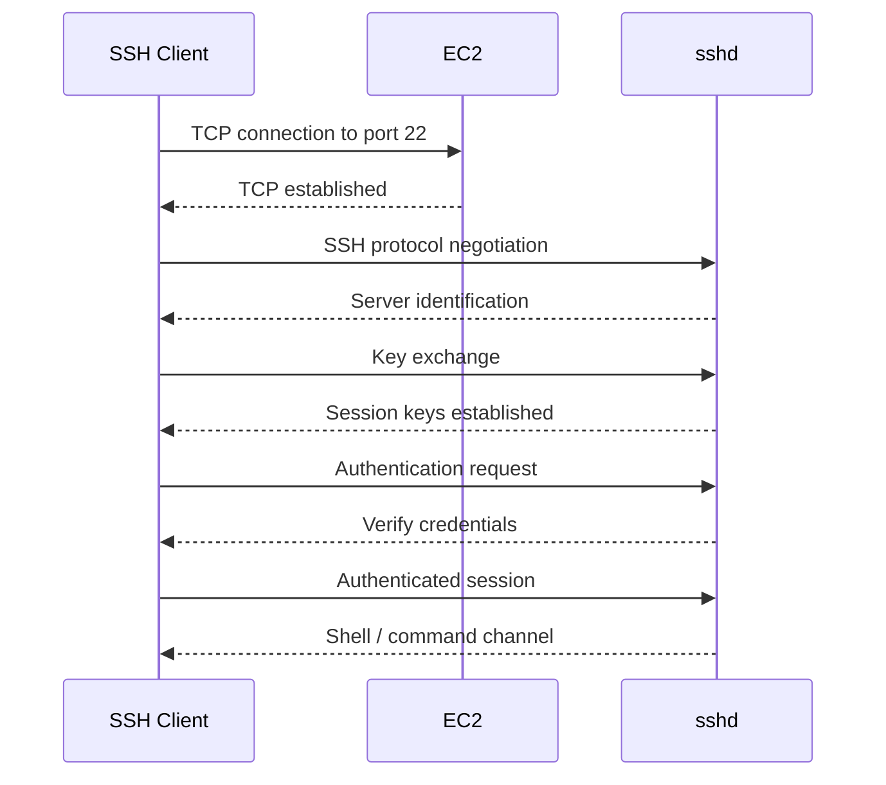
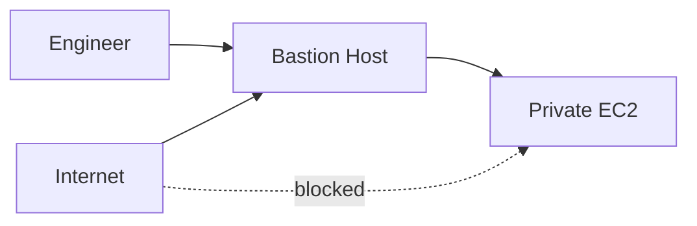
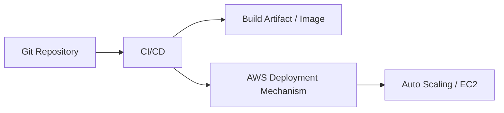
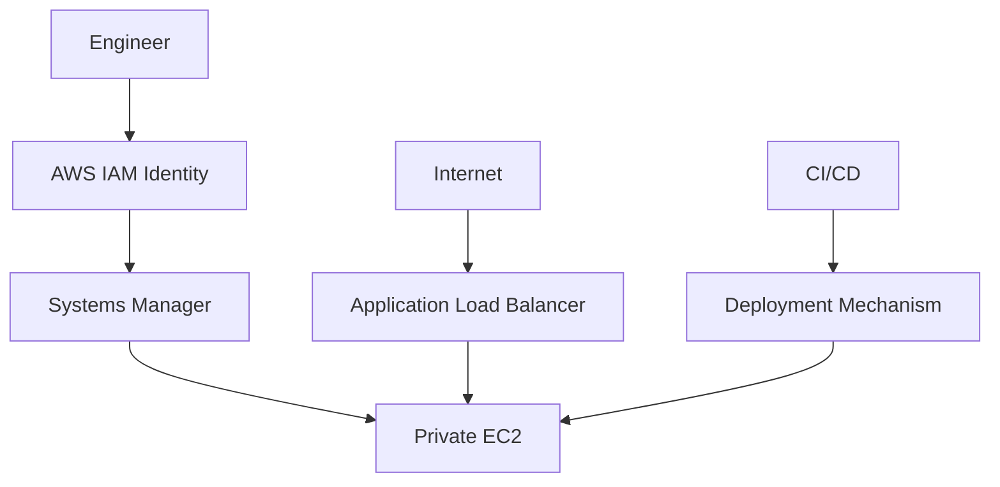

# 02- SSH

## Overview

SSH (Secure Shell) is a secure remote-access protocol commonly used to administer Linux-based EC2 instances. It provides encrypted communication and supports public-key authentication, making it useful for controlled operational access, troubleshooting, and emergency administration.

For EC2, SSH is only one part of the access path:

```text
Engineer
   |
   | SSH
   v
Network
   |
   | TCP 22
   v
Security Group
   |
   v
EC2 Instance
   |
   v
sshd
   |
   v
Linux User
```

Successful access therefore requires both **network reachability** and **successful authentication**.

In modern production environments, SSH should generally be treated as a controlled administrative capability rather than the primary mechanism for routine deployments or operations. AWS Systems Manager Session Manager, automated deployments, centralized identity, and immutable infrastructure can reduce the need for direct SSH access.

---

## SSH Architecture

SSH follows a client-server model.


The major components are:

| Component | Responsibility |
|---|---|
| SSH client | Initiates the connection |
| `sshd` | Server-side SSH daemon |
| Private key | Proves possession of the authentication credential |
| Public key | Trusted authentication material |
| Linux user | Determines the OS identity after authentication |
| Security group | Controls network reachability |
| NACL | Provides subnet-level stateless filtering |
| Route table | Determines packet routing |
| Firewall | May provide additional host-level filtering |

A failure at any layer can prevent access.

---

## SSH Connection Lifecycle

A simplified SSH connection consists of several stages.



At a high level:

1. DNS or an IP address resolves to the target.
2. TCP connectivity to port `22` is established.
3. SSH protocol versions and algorithms are negotiated.
4. Cryptographic key exchange establishes session encryption.
5. The client authenticates.
6. `sshd` authorizes the requested Linux user.
7. A shell or requested command is started.

The private key is not simply transmitted to the server as a password replacement. SSH uses cryptographic operations to prove possession of the corresponding private key.

---

## SSH and EC2 Key Pairs

SSH public-key authentication commonly uses the EC2 key-pair mechanism described in [01- Key Pairs](01-%20Key%20Pairs.md).

When an instance is provisioned with a key pair, the corresponding public key is typically installed for the AMI's default administrative user.

For example:

```text
Private Key
    |
    | retained by operator
    v
SSH Client
    |
    | authentication
    v
EC2
    |
    v
~/.ssh/authorized_keys
    |
    v
Public Key
```

The private key should never be copied onto the EC2 instance merely to authenticate through SSH.

---

## Network Requirements

Before troubleshooting SSH authentication, verify network connectivity.

A typical public SSH path is:


The actual path depends on the architecture.

A private instance may instead require:

```text
Engineer
   |
   v
VPN / Direct Connect / Bastion / Session Manager
   |
   v
Private EC2
```

---

## Security Group Requirements

A traditional public SSH connection requires an inbound security-group rule allowing TCP port `22` from the client's source address.

Example:

```text
Protocol: TCP
Port: 22
Source: trusted administrative CIDR
```

A restrictive rule might be:

```text
TCP 22
203.0.113.10/32
```

rather than:

```text
TCP 22
0.0.0.0/0
```

The latter exposes the SSH service to the entire IPv4 internet and should generally be avoided for production administrative access.

Security groups are stateful, so the response traffic for an accepted connection does not require a separate inbound rule for the ephemeral client port.

---

## Public vs Private SSH Access

### Public EC2

A public instance may be reachable directly:

```text
Engineer
   |
   | SSH :22
   v
Internet
   |
   v
Public EC2
```

This is operationally simple but increases the public attack surface.

### Private EC2

A private instance has no direct public route:

```text
Engineer
   |
   v
VPN / Bastion / SSM
   |
   v
Private EC2
```

This is often preferable for production application servers.

### Load-Balanced Applications

Application instances normally should not require inbound SSH from application clients:

```text
Internet
   |
   | HTTPS :443
   v
ALB
   |
   | Application port
   v
Private EC2
```

SSH is an administrative path, not the application traffic path.

---

## Connecting to EC2

A standard Linux connection is:

```bash
ssh -i ~/.ssh/backend-prod.pem ec2-user@<public-ip>
```

For Ubuntu:

```bash
ssh -i ~/.ssh/backend-prod.pem ubuntu@<public-ip>
```

For a hostname:

```bash
ssh -i ~/.ssh/backend-prod.pem ec2-user@ec2.example.com
```

The username must match the AMI and OS configuration.

---

## SSH Configuration

For repeated access, use an SSH client configuration.

Example:

```sshconfig
Host production-api
    HostName ec2.example.com
    User ec2-user
    IdentityFile ~/.ssh/backend-prod.pem
    IdentitiesOnly yes
```

Then connect with:

```bash
ssh production-api
```

This avoids repeatedly typing connection parameters and makes operational workflows easier to standardize.

A configuration can also define bastion-based access:

```sshconfig
Host production-api
    HostName 10.0.10.25
    User ec2-user
    IdentityFile ~/.ssh/backend-prod.pem
    ProxyJump production-bastion
```

The engineer connects to the bastion first, while SSH establishes the final connection to the private instance through it.

---

## SSH Through a Bastion Host

A bastion host provides a controlled administrative entry point.



A common security-group design is:

```text
Bastion SG
    |
    +-- SSH from trusted admin network

Application EC2 SG
    |
    +-- SSH from Bastion SG
```

This reduces direct exposure of private instances.

However, a bastion introduces another operational component that must be:

- Patched
- Monitored
- Access-controlled
- Logged
- Highly available if operationally critical

Modern AWS environments may instead use Systems Manager Session Manager to avoid maintaining a traditional bastion.

---

## SSH ProxyJump

`ProxyJump` allows SSH to traverse a bastion without manually opening a separate interactive session.

```bash
ssh \
    -J ec2-user@bastion.example.com \
    -i ~/.ssh/backend-prod.pem \
    ec2-user@10.0.10.25
```

Equivalent configuration:

```sshconfig
Host production-api
    HostName 10.0.10.25
    User ec2-user
    IdentityFile ~/.ssh/backend-prod.pem
    ProxyJump production-bastion

Host production-bastion
    HostName bastion.example.com
    User ec2-user
    IdentityFile ~/.ssh/bastion-prod.pem
```

This is useful when the application instance is private but SSH remains an approved administrative mechanism.

---

## Host Key Verification

SSH authenticates the server to the client using host keys.

This protects against connecting to an unexpected server.

The client commonly stores known host information in:

```text
~/.ssh/known_hosts
```

A typical connection may display:

```text
The authenticity of host 'example.com' can't be established.
ED25519 key fingerprint is SHA256:...
Are you sure you want to continue connecting (yes/no/[fingerprint])?
```

Do not blindly accept unexpected host-key changes.

An unexpected change can indicate:

- Instance replacement
- DNS/IP reuse
- Host reinstallation
- Bastion replacement
- Configuration changes
- Potential man-in-the-middle activity

In production, verify the expected fingerprint through a trusted source before accepting a changed key.

---

## Host Key Changes and EC2

EC2 instances can be ephemeral.

When an instance is terminated and another instance later receives the same public hostname or address, its host key may differ.

SSH may then report:

```text
WARNING: REMOTE HOST IDENTIFICATION HAS CHANGED!
```

Do not solve this by blindly disabling host-key verification.

Instead:

1. Confirm the instance was intentionally replaced.
2. Verify the new host fingerprint through a trusted mechanism.
3. Remove the obsolete entry if appropriate.
4. Reconnect and validate the new fingerprint.

For automated infrastructure, consider how host identity should be managed when instances are intentionally ephemeral.

---

## SSH Authentication Methods

Common SSH authentication mechanisms include:

| Method | Typical Use |
|---|---|
| Public key | Standard administrative authentication |
| Password | Generally avoided for EC2 administration |
| SSH certificates | Larger managed environments |
| Hardware-backed credentials | High-security environments |
| Agent-backed keys | Convenient key management |
| Centralized access mechanisms | Modern production operations |

For EC2 Linux administration, public-key authentication is generally preferable to password authentication.

---

## SSH Agent

An SSH agent can hold private keys in memory.

Start an agent:

```bash
eval "$(ssh-agent -s)"
```

Add a key:

```bash
ssh-add ~/.ssh/backend-prod.pem
```

List loaded keys:

```bash
ssh-add -l
```

Then:

```bash
ssh ec2-user@ec2.example.com
```

Use agent forwarding cautiously.

Avoid enabling agent forwarding globally:

```sshconfig
ForwardAgent yes
```

A compromised remote host can potentially abuse a forwarded agent to request authentication operations.

Prefer forwarding only when it is explicitly required.

---

## File Permissions

On Linux and macOS, private-key permissions should be restrictive.

Example:

```bash
chmod 400 ~/.ssh/backend-prod.pem
```

Check:

```bash
ls -l ~/.ssh/backend-prod.pem
```

A private key that is readable by other local users is a security risk.

SSH may reject keys with overly permissive permissions depending on the platform and client configuration.

---

## SSH Server Configuration

The SSH server is usually managed by `sshd`.

Configuration is commonly located at:

```text
/etc/ssh/sshd_config
```

Some distributions also use:

```text
/etc/ssh/sshd_config.d/
```

Useful settings include:

```text
PubkeyAuthentication yes
PasswordAuthentication no
PermitRootLogin no
```

The exact production configuration should account for the distribution, recovery strategy, organizational requirements, and available administrative access mechanisms.

Before restarting or reloading SSH configuration, validate it.

For OpenSSH:

```bash
sudo sshd -t
```

Then reload where appropriate:

```bash
sudo systemctl reload sshd
```

Some distributions use the service name `ssh` instead of `sshd`.

---

## Root Login

Direct root SSH access should generally be avoided.

Prefer:

```text
SSH
 |
 v
ec2-user / ubuntu
 |
 sudo
 |
 v
Administrative command
```

rather than:

```text
SSH
 |
 v
root
```

This provides better user-level accountability and reduces the risk associated with direct root authentication.

---

## Sudo and Privilege Escalation

After connecting as the default administrative user:

```bash
sudo systemctl status nginx
```

or:

```bash
sudo journalctl -u nginx
```

The SSH identity and Linux privilege level are separate concepts:

```text
SSH Authentication
        |
        v
Linux User
        |
        v
sudo authorization
        |
        v
Privileged operation
```

This separation is important for auditing and least-privilege administration.

---

## SSH Commands for Operations

Run a command without opening an interactive shell:

```bash
ssh production-api 'systemctl status nginx'
```

Run multiple commands:

```bash
ssh production-api '
    uptime &&
    df -h &&
    free -m
'
```

Inspect application processes:

```bash
ssh production-api 'ps aux --sort=-%cpu | head'
```

Inspect listening sockets:

```bash
ssh production-api 'sudo ss -lntup'
```

Inspect recent system logs:

```bash
ssh production-api 'sudo journalctl -n 100 --no-pager'
```

This is useful for controlled diagnostics and automation.

---

## SSH Port Forwarding

SSH can create encrypted tunnels between systems.

### Local Port Forwarding

```bash
ssh -L 15432:10.0.20.15:5432 production-bastion
```

This means:

```text
Local machine :15432
       |
       | SSH tunnel
       v
Bastion
       |
       v
10.0.20.15:5432
```

A developer can then connect to:

```text
localhost:15432
```

instead of exposing PostgreSQL publicly.

This can be useful for controlled administrative access, but should not become a substitute for proper private networking and access architecture.

### Remote Port Forwarding

SSH also supports remote forwarding:

```bash
ssh -R 8080:localhost:8000 production-bastion
```

Remote forwarding should be tightly controlled because it can create unexpected network paths.

### Dynamic Forwarding

SSH can also provide SOCKS proxying:

```bash
ssh -D 1080 production-bastion
```

This is powerful and should be restricted to approved administrative workflows.

---

## SSH and Database Access

A common backend development pattern is accessing a private database through a controlled bastion:


The database remains private.

However, production database access should still use appropriate authentication, authorization, auditing, and temporary access controls.

An SSH tunnel does not automatically make database access secure from every perspective; it only creates an encrypted network path.

---

## SSH and Application Deployments

SSH can be used for deployment:

```text
CI/CD
   |
   | SSH
   v
EC2
   |
   +-- pull artifact
   +-- restart service
   +-- update configuration
```

However, long-lived deployment keys create operational and security concerns.

A more mature deployment model is:



Benefits include:

- Reduced SSH credential exposure
- Repeatable deployments
- Better auditability
- Easier rollback
- Instance replacement
- Reduced configuration drift

SSH remains useful for emergency troubleshooting, but should not become a dependency for normal application deployment when automated alternatives exist.

---

## SSH and Docker

If an EC2 host runs Docker, SSH provides host-level access:

```text
Engineer
   |
   v
SSH
   |
   v
EC2 Host
   |
   v
Docker
   |
   +-- Django
   +-- FastAPI
   +-- Nginx
```

A common mistake is exposing Docker application ports directly to the internet merely to make debugging easier.

Prefer:

```text
Internet
   |
   v
ALB / Nginx
   |
   v
Docker container
```

and use SSH or a centralized management mechanism only for host administration.

---

## SSH and Kubernetes

If EC2 nodes are part of a Kubernetes cluster, direct SSH should generally be reserved for node-level troubleshooting.

Application access should normally flow through Kubernetes abstractions:

```text
Client
   |
   v
Ingress / Load Balancer
   |
   v
Service
   |
   v
Pod
```

SSH into the worker node only when investigating node-level issues such as:

- Disk exhaustion
- Kernel problems
- Container runtime issues
- Network configuration
- Node-level logs

Do not use SSH as the normal mechanism for deploying application workloads to Kubernetes.

---

## SSH Troubleshooting

Troubleshoot from the network layer toward authentication.

```text
DNS / IP
   |
   v
Route
   |
   v
Security Group
   |
   v
NACL
   |
   v
TCP 22
   |
   v
sshd
   |
   v
Username
   |
   v
Private Key
   |
   v
Authorization
```

### Test Port Connectivity

```bash
nc -vz <host> 22
```

or:

```bash
timeout 5 bash -c '</dev/tcp/<host>/22'
```

### Verbose SSH Output

```bash
ssh -vvv -i ~/.ssh/backend-prod.pem ec2-user@<host>
```

Useful output includes:

- DNS resolution
- Connection establishment
- Key exchange
- Authentication methods
- Offered identities
- Authentication failures

Avoid pasting verbose SSH output into public channels without reviewing it for sensitive information.

---

## Common SSH Errors

### `Connection timed out`

Usually indicates a network-path problem.

Investigate:

- Public/private reachability
- Route tables
- Security groups
- NACLs
- Network ACL ephemeral ports
- VPN/bastion path
- Instance availability

### `Connection refused`

Usually means the host is reachable but nothing is accepting the connection on the requested port, or a host firewall is rejecting it.

Check:

```bash
sudo ss -lntp
```

and:

```bash
sudo systemctl status sshd
```

### `Permission denied (publickey)`

Usually indicates an authentication or authorization problem.

Check:

- Private key
- Username
- Public key
- `authorized_keys`
- File permissions
- SSH server configuration

### `UNPROTECTED PRIVATE KEY FILE`

The private key permissions are too permissive.

On Linux/macOS:

```bash
chmod 400 ~/.ssh/backend-prod.pem
```

### `REMOTE HOST IDENTIFICATION HAS CHANGED`

The server host key differs from the previously recorded key.

Do not automatically bypass verification. First determine whether the instance was intentionally replaced.

---

## Server-Side Troubleshooting

If network connectivity works but authentication fails, inspect the SSH service.

Check service status:

```bash
sudo systemctl status sshd
```

Validate configuration:

```bash
sudo sshd -t
```

Inspect recent logs:

```bash
sudo journalctl -u sshd -n 100 --no-pager
```

On some distributions, authentication logs may be available through files such as:

```text
/var/log/auth.log
/var/log/secure
```

The exact location depends on the operating system.

---

## SSH Monitoring

SSH access should be observable in production.

Monitor:

- Authentication failures
- Successful administrative access
- Unexpected source addresses
- Changes to SSH configuration
- Changes to authorized keys
- Root login attempts
- Excessive connection attempts
- Bastion activity

Combine:

```text
AWS CloudTrail
      +
OS Authentication Logs
      +
Centralized Logging
      +
Security Monitoring
```

This provides better visibility than relying on SSH logs alone.

---

## Security Hardening

A production SSH configuration should consider:

| Control | Purpose |
|---|---|
| Public-key authentication | Avoid password-based access |
| Restricted source networks | Reduce attack surface |
| Non-root login | Improve accountability |
| `sudo` | Controlled privilege escalation |
| Host-key verification | Protect server identity |
| MFA through access layer | Strengthen administrative access |
| Session logging | Improve auditability |
| Key rotation | Limit credential lifetime |
| Centralized access | Reduce credential sprawl |
| Fail2ban / equivalent controls | Additional protection where appropriate |

Do not apply hardening blindly.

For example, disabling an authentication mechanism before verifying an alternate recovery path can lock administrators out of an instance.

---

## SSH vs Systems Manager Session Manager

For AWS-managed EC2 environments, SSH and Systems Manager Session Manager solve related but different operational problems.

| Capability | SSH | Session Manager |
|---|---|---|
| Traditional shell | Yes | Yes |
| Requires inbound port 22 | Usually | No |
| Requires SSH key | Usually | No |
| IAM-based access | Not inherently | Yes |
| Centralized AWS access control | Limited | Stronger |
| Private instance access | Requires network path | Can work without inbound SSH |
| Session logging | Requires additional configuration | Supported through AWS mechanisms |
| Port forwarding | Yes | Supported through session features |
| Operational model | Host/network-centric | AWS identity-centric |

For AWS production environments, Session Manager can significantly reduce the need to expose SSH.

---

## Production Access Architecture

A mature EC2 environment can minimize inbound SSH:



The resulting separation is:

```text
Application Traffic
    |
    v
ALB
    |
    v
Private EC2

Administrative Access
    |
    v
IAM / Session Manager
    |
    v
Private EC2

Deployment
    |
    v
CI/CD / AWS APIs
    |
    v
Private EC2
```

This reduces the number of reasons to expose TCP port `22`.

---

## High Availability Considerations

SSH itself is not usually part of an application's high-availability request path.

For production EC2 fleets:

```text
ALB
 |
 +-- EC2-A
 +-- EC2-B
 +-- EC2-C
```

Administrative access should remain possible if one instance fails.

Use:

- Multiple instances
- Multi-AZ deployment
- Centralized management
- Automation
- Recovery procedures
- Infrastructure as Code

Do not make one bastion or one administrator's private key the only path to the environment.

---

## Disaster Recovery Considerations

SSH access should be included in recovery planning.

A recovery plan should answer:

- How do administrators access replacement instances?
- Where are credentials stored?
- How are replacement public keys provisioned?
- Is there an alternate access mechanism?
- Can private instances be accessed during a network failure?
- Can administrative access work before application-level services are restored?

A resilient model separates application recovery from host-access recovery.

```text
Infrastructure Recovery
        |
        +-- Network
        +-- IAM
        +-- Access Mechanism
        +-- EC2
        +-- Storage
        +-- Application
```

---

## Cost Considerations

SSH itself has negligible direct cost.

The surrounding architecture may introduce costs:

| Component | Potential Cost |
|---|---|
| Bastion EC2 | Instance and storage charges |
| NAT Gateway | Hourly and data-processing charges |
| VPN | Service and data-processing costs |
| Systems Manager | Service-specific charges depending on features |
| Logging | Log ingestion and retention |
| Public IPv4 | Applicable public IPv4 charges |

Do not deploy a bastion merely because SSH is familiar. Evaluate the complete operational and security requirements.

---

## Common Mistakes

### Opening Port 22 to the Internet

```text
0.0.0.0/0 -> TCP 22
```

This unnecessarily increases exposure.

Use restricted administrative networks or centralized access mechanisms.

### Using the Wrong Username

The private key may be correct while the username is wrong.

For example:

```bash
ssh -i key.pem root@<host>
```

may fail even though:

```bash
ssh -i key.pem ec2-user@<host>
```

works.

### Disabling Host-Key Verification

Avoid:

```bash
-o StrictHostKeyChecking=no
```

as a blanket production setting.

It removes an important server-identity protection.

### Using SSH for Every Operational Task

Routine deployments, configuration changes, and fleet operations should be automated where possible.

### Using One SSH Key Everywhere

A single key creates a large blast radius.

Separate credentials by environment, role, or administrative identity as appropriate.

### Changing `sshd_config` Without Validation

A syntax or configuration error can prevent the SSH daemon from restarting correctly.

Always validate:

```bash
sudo sshd -t
```

before applying significant changes.

### Locking Out the Only Administrative Path

Never disable the current authentication or network path until the replacement path has been tested.

---

## Interview Considerations

### Why can an EC2 instance be running but SSH still fail?

Instance state only indicates that the VM is running. SSH also depends on routing, security groups, NACLs, port `22`, the SSH daemon, host firewall configuration, the username, and authentication credentials.

### What is the difference between a key pair and SSH?

A key pair provides the cryptographic credentials used by SSH public-key authentication. SSH is the protocol that establishes the secure connection and performs authentication and session management.

### Why does `Connection timed out` differ from `Permission denied (publickey)`?

A timeout generally points toward connectivity or network filtering. `Permission denied (publickey)` indicates that the network connection reached the SSH service but authentication was unsuccessful.

### Why use a bastion host?

A bastion can provide a controlled administrative entry point into private subnets, reducing direct exposure of private instances. It also introduces an additional component that must be secured and operated.

### Why might Session Manager be preferable to SSH?

It can provide IAM-controlled access to managed EC2 instances without requiring inbound TCP port `22`, reducing public network exposure and centralizing access management.

### Should SSH be used for application deployment?

It can be used, but production systems generally benefit from automated deployment mechanisms that reduce long-lived credentials, configuration drift, and dependence on individual host access.

---

## Key Takeaways

- SSH access to EC2 requires both network reachability and successful authentication; a running instance alone does not guarantee connectivity.
- Secure production SSH requires restrictive network access, protected private keys, host-key verification, controlled privileges, and auditable administrative access.
- Bastion hosts can provide controlled access to private instances, but centralized mechanisms such as Systems Manager can reduce the need for inbound SSH.
- SSH is valuable for administration and troubleshooting, but routine deployments and fleet operations should be automated rather than dependent on manual host access.
- Always troubleshoot SSH layer by layer—from DNS and routing through TCP `22`, `sshd`, user authorization, and key authentication—before changing infrastructure configuration.