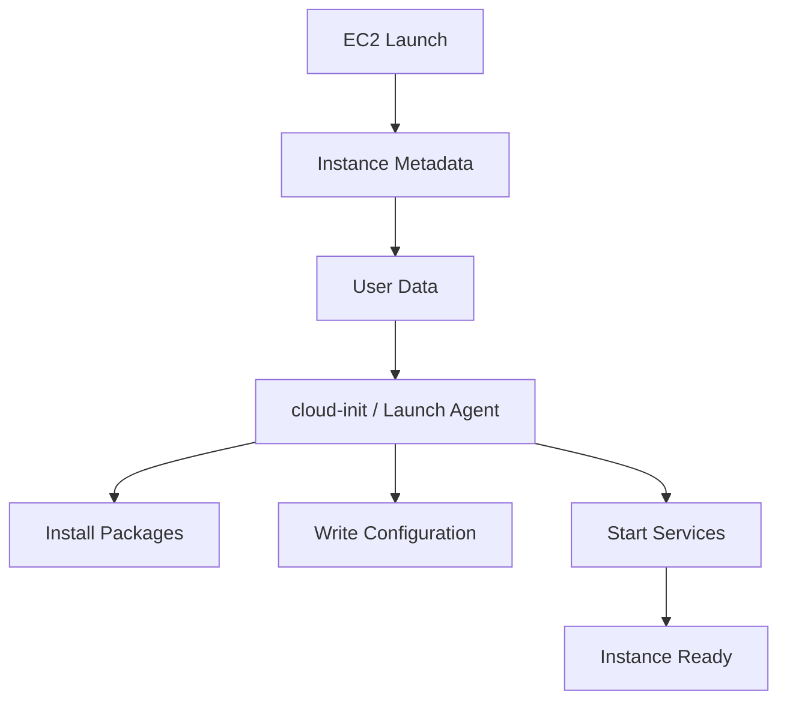
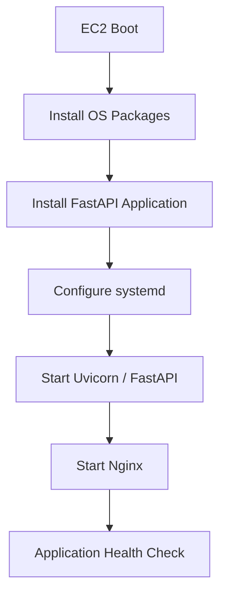
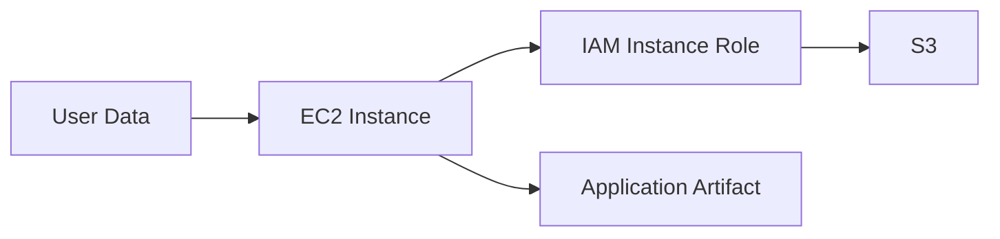
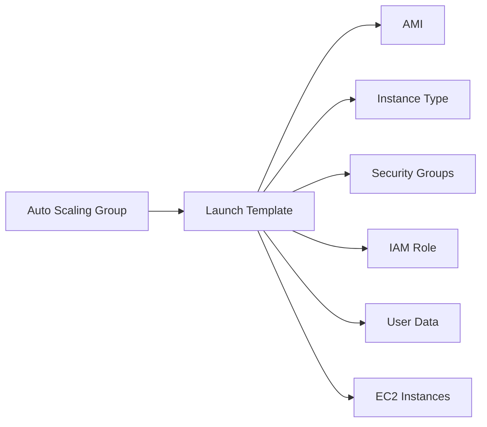
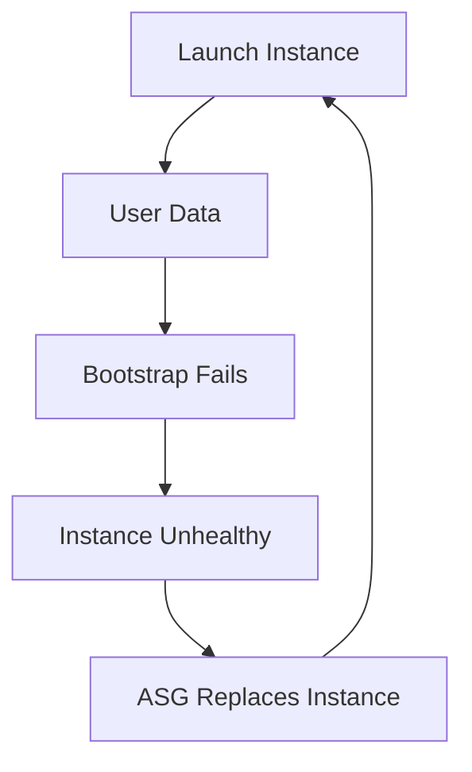

# 03- User Data

## Overview

EC2 User Data is instance-specific data supplied when an EC2 instance is launched. It is commonly used to bootstrap an instance by installing packages, creating configuration files, starting services, registering the instance with another system, or performing other initialization tasks.

On Linux, User Data is commonly interpreted by `cloud-init`. It can contain shell scripts, cloud-init configuration, or multipart MIME content. On Windows, the EC2 launch agents process User Data. :contentReference[oaicite:0]{index=0}

A typical bootstrapping flow is:



User Data is particularly useful for **first-boot configuration** and immutable infrastructure workflows. It should not become a large collection of arbitrary operational scripts that are difficult to test, observe, and reproduce.

---

## Why User Data Exists

An EC2 instance can be launched from an AMI that contains the operating system and common software, but environment-specific configuration often needs to happen after launch.

For example:

```text
Base AMI
   |
   +-- OS
   +-- Python
   +-- Nginx
   |
   v
EC2 Launch
   |
   v
User Data
   |
   +-- Configure environment
   +-- Install application
   +-- Register instance
   +-- Start services
   |
   v
Ready Instance
```

This allows the same AMI to be reused across:

- Development
- Staging
- Production
- Multiple Availability Zones
- Auto Scaling Groups
- Different environments

The important distinction is:

> An AMI provides the base machine image; User Data provides instance-specific initialization.

---

## User Data Execution Model

For Linux instances, User Data is normally processed during the first boot cycle. By default, shell scripts and cloud-init directives run only during the initial launch. :contentReference[oaicite:1]{index=1}

A simplified lifecycle is:

```text
EC2 created
    |
    v
Operating system boots
    |
    v
cloud-init starts
    |
    v
User Data retrieved
    |
    v
User Data interpreted
    |
    v
Bootstrap commands execute
    |
    v
cloud-init completes
    |
    v
Application becomes ready
```

The exact execution stages depend on the operating system, AMI, and cloud-init configuration.

User Data is therefore part of the **instance boot lifecycle**, not a general-purpose remote execution mechanism.

---

## Linux User Data

A basic shell script must begin with a shebang.

```bash
#!/bin/bash

dnf update -y
dnf install -y nginx

systemctl enable nginx
systemctl start nginx
```

The script is executed as `root`, so `sudo` is normally unnecessary inside User Data. AWS also notes that User Data execution is non-interactive, so commands requiring interactive input must be configured for unattended execution. :contentReference[oaicite:2]{index=2}

For example:

```bash
dnf install -y nginx
```

is appropriate, while a command that waits for interactive confirmation can cause the bootstrap process to hang.

---

## Shell Script vs Cloud-Init

Linux User Data commonly uses two approaches.

| Approach | Best For |
|---|---|
| Shell script | Imperative installation and bootstrapping |
| `cloud-config` | Declarative instance configuration |
| Multipart MIME | Combining multiple User Data content types |

### Shell Script

```bash
#!/bin/bash

dnf install -y nginx
systemctl enable nginx
systemctl start nginx
```

### Cloud-Config

```yaml
#cloud-config

package_update: true

packages:
  - nginx

runcmd:
  - systemctl enable nginx
  - systemctl start nginx
```

Cloud-init provides structured configuration capabilities such as:

- Package installation
- File creation
- User configuration
- Commands
- Service configuration
- SSH configuration
- Boot-time actions

The choice should be based on maintainability rather than personal preference.

---

## Practical Backend Example

Suppose an EC2 instance hosts a FastAPI application behind Nginx.

A simple bootstrap might:

1. Install required OS packages.
2. Create the application directory.
3. Install Python dependencies.
4. Create a systemd service.
5. Start the application.
6. Start Nginx.



A simplified User Data script:

```bash
#!/bin/bash
set -euo pipefail

dnf install -y python3 nginx

mkdir -p /opt/backend-api

python3 -m venv /opt/backend-api/venv

/opt/backend-api/venv/bin/pip install \
    --upgrade pip

systemctl enable nginx
systemctl start nginx
```

In production, application artifacts and configuration should generally come from a controlled deployment mechanism rather than being embedded directly into a large User Data script.

---

## User Data and Instance Profiles

User Data scripts sometimes need to call AWS APIs.

For example:

```bash
#!/bin/bash

aws s3 cp \
    s3://backend-artifacts/app.tar.gz \
    /opt/backend-api/app.tar.gz
```

The instance should use an IAM role through an instance profile rather than hard-coded AWS credentials. AWS explicitly recommends using an instance profile when User Data needs to call AWS APIs. :contentReference[oaicite:3]{index=3}

The architecture should look like:



Avoid:

```bash
aws configure
```

inside User Data with static access keys.

Never embed:

```text
AWS_ACCESS_KEY_ID=...
AWS_SECRET_ACCESS_KEY=...
```

in User Data.

---

## User Data and Instance Metadata

User Data is associated with the EC2 instance and can be retrieved through the instance metadata service.

On Linux, the metadata endpoint for User Data is:

```text
http://169.254.169.254/latest/user-data
```

With IMDSv2, obtain a metadata token first:

```bash
TOKEN=$(curl -sS \
    -X PUT \
    -H "X-aws-ec2-metadata-token-ttl-seconds: 21600" \
    http://169.254.169.254/latest/api/token)

curl -sS \
    -H "X-aws-ec2-metadata-token: $TOKEN" \
    http://169.254.169.254/latest/user-data
```

This is important from a security perspective:

> User Data should not be treated as a secure secret store.

If sensitive information is placed in User Data, it may be retrievable by principals or processes with appropriate access to the instance or instance metadata. Use AWS Secrets Manager, Systems Manager Parameter Store, or another appropriate secret-management mechanism for secrets.

---

## User Data Size Limit

EC2 User Data is limited to **16 KB in raw form before Base64 encoding**. Base64 encoding increases the transmitted size, but the limit applies to the raw User Data content. :contentReference[oaicite:4]{index=4}

This makes the following pattern undesirable:

```text
User Data
    |
    +-- Huge application source tree
    +-- Large configuration files
    +-- Dependencies
    +-- Certificates
    +-- Deployment logic
```

Prefer:

```text
User Data
    |
    +-- Small bootstrap script
             |
             +-- S3 / Artifact repository
             +-- Secrets Manager
             +-- Parameter Store
             +-- Configuration service
```

User Data should generally act as a **bootstrap entry point**, not a complete application distribution mechanism.

---

## Base64 Encoding

At the API level, EC2 User Data is represented as Base64-encoded data. AWS tooling can handle encoding for you in common workflows. The AWS CLI performs the appropriate encoding for `run-instances --user-data`, while lower-level API usage requires attention to encoding requirements. :contentReference[oaicite:5]{index=5}

For example:

```bash
aws ec2 run-instances \
    --image-id ami-xxxxxxxx \
    --instance-type t3.micro \
    --user-data file://user-data.sh
```

The AWS CLI handles the User Data encoding for this operation.

Avoid manually Base64-encoding the file unless the specific API/tool invocation requires it.

---

## User Data with AWS CLI

Launch an instance with a User Data file:

```bash
aws ec2 run-instances \
    --image-id ami-xxxxxxxx \
    --instance-type t3.medium \
    --subnet-id subnet-xxxxxxxx \
    --security-group-ids sg-xxxxxxxx \
    --key-name backend-prod \
    --user-data file://user-data.sh
```

A production launch would typically also specify or inherit:

- IAM instance profile
- EBS configuration
- Monitoring configuration
- Metadata options
- Tags
- Network placement
- Launch template configuration

A launch template is usually preferable to maintaining long command lines for recurring EC2 deployments.

---

## User Data in Launch Templates

User Data is commonly associated with an EC2 launch template.



This becomes particularly valuable with Auto Scaling.

Every replacement instance can execute the same bootstrap logic:

```text
Auto Scaling Group
        |
        v
Launch Template
        |
        v
New EC2
        |
        v
User Data
        |
        v
Configured Instance
```

This supports repeatable instance creation.

---

## User Data and Auto Scaling

User Data is especially useful for dynamically created instances.

For example:

```text
ASG desired capacity = 3

        |
        v

EC2-A -> bootstrap
EC2-B -> bootstrap
EC2-C -> bootstrap
```

If EC2-B becomes unhealthy:

```text
EC2-B
  |
  v
Terminated
  |
  v
Replacement EC2
  |
  v
Same Launch Template
  |
  v
Same User Data
  |
  v
Configured replacement
```

This is one of the strongest use cases for User Data.

The bootstrap process must therefore be:

- Repeatable
- Idempotent
- Observable
- Fast enough for scaling requirements
- Independent of a specific instance ID

---

## Idempotency

A production bootstrap script should ideally be safe to execute more than once.

Poor example:

```bash
mkdir /opt/backend
```

If the directory already exists, behavior may differ depending on the command and error handling.

Prefer:

```bash
mkdir -p /opt/backend
```

Similarly:

```bash
systemctl enable nginx
systemctl start nginx
```

is generally safer than blindly assuming the service is in a specific state.

Idempotency matters because cloud-init behavior, recovery workflows, image creation, automation, and manual re-execution can expose scripts to conditions different from the original launch.

---

## Error Handling

Shell User Data should fail predictably.

A useful baseline is:

```bash
#!/bin/bash
set -euo pipefail
```

This enables:

- `-e`: exit on command failures
- `-u`: detect unset variables
- `pipefail`: propagate failures through pipelines

Example:

```bash
#!/bin/bash
set -euo pipefail

LOG_FILE=/var/log/backend-bootstrap.log

exec > >(tee -a "$LOG_FILE") 2>&1

echo "Starting bootstrap"

dnf install -y nginx

systemctl enable nginx
systemctl start nginx

echo "Bootstrap completed"
```

Be careful with `set -e` in complex scripts because shell error semantics can be surprising in conditionals, command substitutions, and pipelines. Test the complete script rather than assuming `set -e` provides comprehensive error handling.

---

## Logging and Troubleshooting

On Linux, cloud-init output is commonly available in:

```text
/var/log/cloud-init-output.log
```

AWS documents this as an important location for troubleshooting User Data execution. :contentReference[oaicite:6]{index=6}

Additional cloud-init logs commonly include:

```text
/var/log/cloud-init.log
```

Inspect output:

```bash
sudo tail -n 200 /var/log/cloud-init-output.log
```

Follow logs:

```bash
sudo tail -f /var/log/cloud-init-output.log
```

Check cloud-init status where supported:

```bash
cloud-init status --long
```

The exact commands and log behavior depend on the AMI and installed cloud-init version.

---

## Debugging a Failed Bootstrap

When an instance launches but the application is unavailable:

```text
EC2 Launch
    |
    v
User Data
    |
    +-- Did it execute?
    |
    +-- Did it fail?
    |
    +-- Which command failed?
    |
    v
Application
    |
    +-- Is service running?
    |
    +-- Is port listening?
    |
    +-- Is health check passing?
```

Start with:

```bash
sudo cloud-init status --long
```

Then:

```bash
sudo tail -n 200 /var/log/cloud-init-output.log
```

Check services:

```bash
sudo systemctl --failed
```

Check listening ports:

```bash
sudo ss -lntup
```

Check the application:

```bash
curl -f http://127.0.0.1:8000/health
```

This separates bootstrap failures from networking and application failures.

---

## User Data and Application Readiness

A successful User Data execution does not necessarily mean that the application is healthy.

For example:

```text
User Data
   |
   +-- installs Python
   +-- creates virtualenv
   +-- starts systemd service
   |
   v
User Data complete

          !=

Application healthy
```

A production deployment should combine bootstrap completion with service-level health checks.

For an ALB-backed application:


The load balancer should only send production traffic when the application is actually ready.

---

## Waiting for Dependencies

Bootstrap scripts sometimes need to wait for dependencies.

For example, an application may depend on a private artifact repository or another service.

Avoid arbitrary sleeps:

```bash
sleep 60
```

A fixed sleep creates unpredictable startup behavior.

Prefer bounded retries:

```bash
#!/bin/bash
set -euo pipefail

for attempt in {1..12}; do
    if curl -fsS https://artifact.example.com/health; then
        break
    fi

    if [ "$attempt" -eq 12 ]; then
        echo "Dependency did not become available"
        exit 1
    fi

    sleep 5
done
```

This makes the failure condition explicit and keeps startup bounded.

---

## User Data and Secrets

Never use User Data as a secret-management system.

Avoid:

```bash
export DATABASE_PASSWORD='super-secret-password'
```

because User Data can be retrieved and may also be present in instance-side files or logs depending on how it is processed.

Prefer:

```text
EC2
 |
 +-- IAM Instance Role
       |
       +-- Secrets Manager
       |
       +-- Parameter Store
```

The application can retrieve secrets using temporary IAM credentials.

For example, the bootstrap process might retrieve a non-secret configuration value:

```bash
aws ssm get-parameter \
    --name /backend/prod/API_LOG_LEVEL \
    --query 'Parameter.Value' \
    --output text
```

For sensitive values, use `--with-decryption` only when required and grant the instance role the minimum required permission.

---

## IAM Permissions

A bootstrap role should follow least privilege.

Avoid:

```text
EC2 Instance Role
    |
    +-- AdministratorAccess
```

Prefer:

```text
EC2 Instance Role
    |
    +-- s3:GetObject
    |     specific artifact bucket/prefix
    |
    +-- ssm:GetParameter
    |     specific parameter path
    |
    +-- secretsmanager:GetSecretValue
          specific secret
```

User Data is only as secure as the IAM permissions available to the instance.

If an attacker gains code execution on the instance, excessively broad instance-role permissions can increase the blast radius.

---

## User Data and AMIs

User Data is an instance attribute and is not included when creating an AMI from the instance. :contentReference[oaicite:7]{index=7}

This distinction is important:

```text
AMI
 |
 +-- OS
 +-- Installed packages
 +-- Files
 +-- Application components

User Data
 |
 +-- Instance-specific bootstrap
```

An AMI created from an instance does not automatically carry that instance's User Data.

This makes it possible to reuse the same AMI with different bootstrap configuration.

---

## AMI and User Data Design

A useful production split is:

```text
AMI
 |
 +-- OS
 +-- Runtime
 +-- Common system packages
 +-- Common monitoring agent
 +-- Application artifact where appropriate
 |
 v
User Data
 |
 +-- Environment configuration
 +-- Instance-specific registration
 +-- Runtime configuration
 +-- Service startup
```

Avoid putting large installation processes into User Data if they can be moved into the image-building process.

A useful rule is:

> Put stable, expensive-to-install components into the image; keep environment-specific and instance-specific configuration in User Data.

---

## Immutable Infrastructure

User Data works well with immutable infrastructure.


Instead of modifying an existing production server repeatedly:

```text
Old Instance
    |
    X modify manually
```

prefer:

```text
New AMI
   |
   v
New Instance
   |
   v
Validate
   |
   v
Receive Traffic
```

This reduces configuration drift and improves rollback.

---

## User Data and Configuration Management

User Data should not replace configuration-management systems for complex environments.

Consider:

| Approach | Suitable Responsibility |
|---|---|
| AMI | Base OS and stable software |
| User Data | Initial bootstrap and instance-specific setup |
| SSM Parameter Store | Configuration values |
| Secrets Manager | Secrets |
| Ansible / configuration management | Complex host configuration |
| CloudFormation / Terraform | Infrastructure |
| CI/CD | Application deployment |
| Systems Manager | Operational management |

A mature system assigns each concern to the appropriate layer.

---

## Multipart User Data

AWS supports multipart MIME User Data for combining multiple content types, such as cloud-config and shell scripts. :contentReference[oaicite:8]{index=8}

Conceptually:

```text
Multipart User Data
 |
 +-- cloud-config
 |
 +-- shell script
 |
 +-- additional supported content
```

Example:

```text
Content-Type: multipart/mixed; boundary="//"
MIME-Version: 1.0

--//
Content-Type: text/cloud-config

#cloud-config

packages:
  - nginx

--//
Content-Type: text/x-shellscript

#!/bin/bash

systemctl enable nginx
systemctl start nginx

--//--
```

Multipart User Data is useful when different initialization mechanisms have distinct responsibilities.

However, complexity should be justified. A single well-structured cloud-config or shell script is often easier to maintain.

---

## Windows User Data

Windows EC2 instances use AWS launch agents such as EC2Launch to process User Data. AWS documents PowerShell and batch-script forms as well as launch-agent-specific behavior. :contentReference[oaicite:9]{index=9}

Example:

```xml
<powershell>
    New-Item -Path "C:\ProgramData\backend" -ItemType Directory -Force
    Set-Content -Path "C:\ProgramData\backend\bootstrap.txt" -Value "Initialized"
</powershell>
```

Windows execution behavior differs from Linux cloud-init, so scripts should be designed and tested against the specific Windows AMI and launch-agent version.

---

## User Data Execution Frequency

For Linux, User Data scripts and cloud-init directives normally run during the initial boot cycle. AWS documents mechanisms for configuring subsequent execution, but the exact behavior depends on the cloud-init/AMI configuration. :contentReference[oaicite:10]{index=10}

Do not assume:

```text
Stop
  |
Start
  |
User Data automatically runs again
```

For ordinary Linux User Data, that assumption is incorrect.

If a task must execute on every boot, use an appropriate service, systemd unit, cloud-init configuration, or other explicit mechanism rather than relying on accidental re-execution.

---

## Updating User Data

User Data can be viewed after launch and can be modified for a stopped instance. AWS notes that changing User Data does not automatically mean the updated script will execute when the instance starts; execution behavior depends on the configured launch mechanism. :contentReference[oaicite:11]{index=11}

This means:

```text
Edit User Data
      |
      X
does not necessarily mean
      |
      v
execute immediately
```

For production infrastructure, changing a launch template and replacing instances is usually more predictable than manually modifying User Data on individual running servers.

---

## Safe User Data Design

A production User Data script should generally have:

- Explicit interpreter
- Strict error handling
- Deterministic package versions where practical
- Idempotent operations
- Bounded retries
- Structured logging
- Minimal external dependencies
- Least-privilege IAM access
- No hard-coded secrets
- Clear failure behavior
- Health verification

Example structure:

```bash
#!/bin/bash
set -euo pipefail

LOG_FILE=/var/log/backend-bootstrap.log

exec > >(tee -a "$LOG_FILE") 2>&1

echo "Bootstrap started"

install_dependencies() {
    dnf install -y python3 nginx
}

configure_application() {
    mkdir -p /opt/backend-api
}

start_services() {
    systemctl enable nginx
    systemctl start nginx
}

install_dependencies
configure_application
start_services

echo "Bootstrap completed"
```

Keep the script readable enough to debug from a failed instance.

---

## Performance and Startup Time

User Data runs during instance initialization and adds work to the boot process. AWS explicitly notes that User Data tasks can increase the time required for an instance to become ready. :contentReference[oaicite:12]{index=12}

This matters for Auto Scaling.

For example:

```text
Traffic spike
    |
    v
ASG launches 10 instances
    |
    v
10 x User Data execution
    |
    v
Instances become ready
```

If bootstrap takes five minutes, scaling responsiveness is constrained by that initialization time.

Improve startup performance by:

- Building common dependencies into the AMI
- Avoiding unnecessary package upgrades
- Downloading only required artifacts
- Minimizing external calls
- Avoiding large scripts
- Using health checks correctly
- Measuring bootstrap duration

---

## Cost and Reliability Considerations

User Data itself generally has no separate charge, but poorly designed bootstrap processes can create indirect costs.

Examples include:

- Repeated package downloads
- Slow scale-out
- Failed instances repeatedly replaced by Auto Scaling
- Excessive API calls
- Unnecessary data transfer
- Long-lived partially configured instances

A bootstrap failure in an Auto Scaling Group can become a loop:



Monitor and alert on this pattern.

---

## Security Considerations

Treat User Data as configuration that may be accessible from the instance.

Do not store:

- Database passwords
- API keys
- Private SSH keys
- Long-lived AWS credentials
- TLS private keys
- Application secrets

Use:

- IAM instance roles
- Secrets Manager
- Parameter Store
- KMS-backed encryption
- Least-privilege policies

Also remember that User Data scripts may appear in instance-side files after execution. AWS documents that Linux User Data scripts are copied under the cloud-init instance directory and are not automatically deleted after execution. :contentReference[oaicite:13]{index=13}

Before creating an AMI from a manually bootstrapped instance, inspect and clean up any bootstrap artifacts that should not be propagated.

---

## Common Mistakes

### Treating User Data as a Secret Store

User Data is not designed for secret management.

**Avoid it:** retrieve secrets at runtime using an IAM role and an appropriate secret-management service.

### Writing Huge Bootstrap Scripts

Large scripts are difficult to test and are constrained by the 16 KB raw User Data limit.

**Avoid it:** use AMIs, artifacts, configuration management, and external configuration stores.

### Assuming User Data Runs on Every Reboot

Linux User Data normally runs during initial launch.

**Avoid it:** use explicit recurring mechanisms when boot-time execution is required.

### Using `sudo` Everywhere

Linux User Data scripts run as root.

**Avoid it:** execute privileged operations directly and explicitly switch users only when required.

### Using Interactive Commands

Bootstrap is non-interactive.

**Avoid it:** provide all required flags and configuration programmatically.

### Hard-Coding AWS Credentials

This creates a serious credential-management problem.

**Avoid it:** attach an IAM instance profile with only the required permissions.

### Using Arbitrary `sleep`

Fixed delays make startup unreliable.

**Avoid it:** implement bounded readiness checks and retries.

### Ignoring Bootstrap Logs

An application failure may actually be a User Data failure.

**Avoid it:** inspect cloud-init logs and application/service status before changing networking configuration.

### Putting Everything in User Data

Using User Data to build an entire production server from scratch can make scale-out slow and fragile.

**Avoid it:** move stable dependencies into a versioned AMI.

### Assuming Successful Script Execution Means Application Readiness

The script may complete while the application is unhealthy.

**Avoid it:** validate service health and integrate with load-balancer health checks.

---

## Operational Checklist

When reviewing an EC2 User Data implementation, verify:

```text
[ ] Script has an explicit interpreter
[ ] Script is idempotent
[ ] Errors are handled
[ ] Logs are available
[ ] No secrets are embedded
[ ] IAM permissions are least-privilege
[ ] User Data is within the size limit
[ ] Bootstrap duration is measured
[ ] Dependencies have bounded retries
[ ] Application health is verified
[ ] Auto Scaling replacement behavior is understood
[ ] AMI/User Data responsibilities are clearly separated
[ ] Launch template contains the intended version
[ ] Recovery does not depend on manual SSH
```

---

## Interview Considerations

### What is EC2 User Data?

It is instance-specific data supplied during EC2 launch and commonly used for automated instance initialization and configuration.

### Does User Data run every time an EC2 instance reboots?

Not by default for standard Linux User Data. Initial execution is the normal behavior; recurring execution requires explicit configuration or another boot-time mechanism.

### What is the difference between User Data and an AMI?

An AMI is the reusable machine image containing the base operating system and software. User Data is instance-specific initialization supplied at launch.

### Why use User Data with Auto Scaling?

Because replacement instances can execute the same bootstrap logic automatically, allowing dynamically created instances to become configured without manual intervention.

### Why should secrets not be stored in User Data?

User Data is not a secret store and can be retrieved from the instance metadata path and may also persist in instance-side files. Sensitive values should come from managed secret/configuration systems.

### What happens if User Data fails?

The EC2 instance can still exist, but it may remain partially configured or unhealthy. In an Auto Scaling environment, health checks may cause the instance to be replaced, potentially creating a repeated bootstrap-failure loop.

### When should configuration move from User Data into an AMI?

When the configuration is stable, expensive to install, or required on every instance. Keeping stable components in the AMI reduces boot time and makes Auto Scaling more predictable.

---

## Key Takeaways

- EC2 User Data is primarily a first-boot bootstrap mechanism used to automate instance initialization and configuration.
- Keep User Data small, idempotent, observable, and environment-aware; move stable dependencies into versioned AMIs and use external services for artifacts and configuration.
- Never treat User Data as a secret store; use IAM instance roles, Parameter Store, and Secrets Manager for credentials and sensitive configuration.
- User Data is especially valuable with launch templates and Auto Scaling, but bootstrap duration and failure behavior directly affect scaling and reliability.
- Debug User Data through cloud-init or launch-agent logs, service health, and application checks rather than assuming that a successful EC2 launch means successful application initialization.