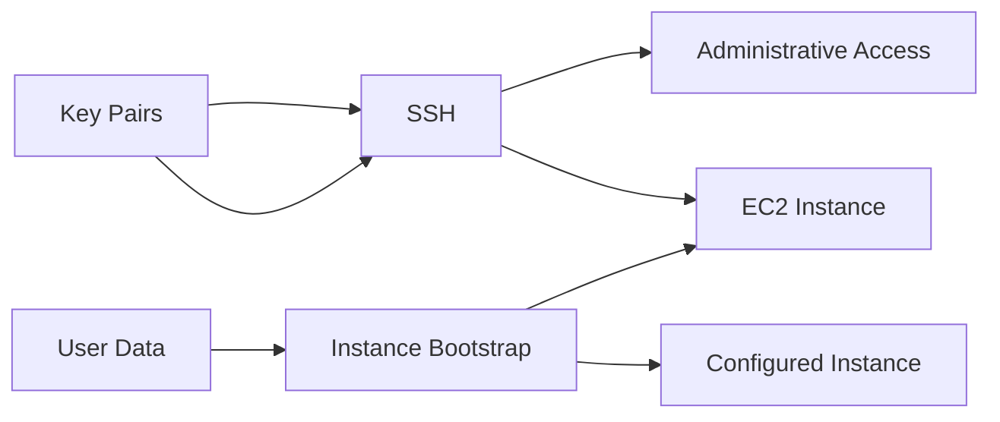
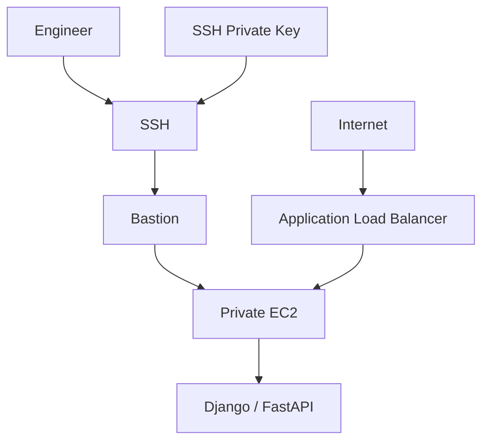
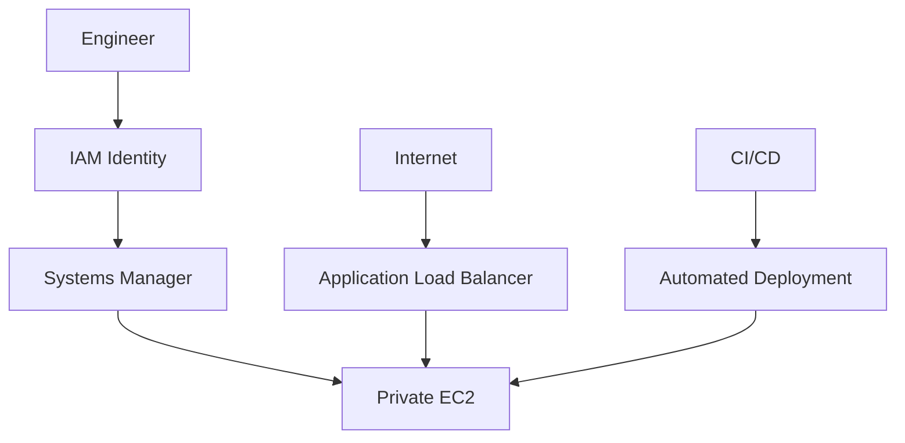
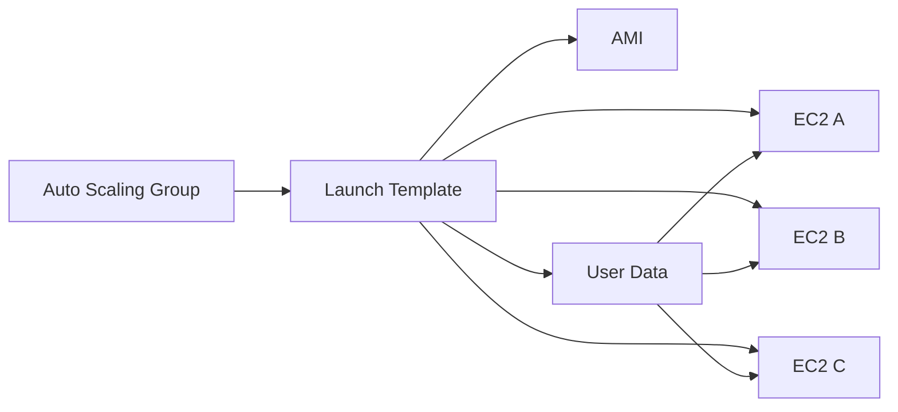

# README

## Overview

The EC2 Access section covers the mechanisms used to authenticate to, initialize, administer, and operationally access EC2 instances.

The main topics are:



These mechanisms solve different problems:

| Topic | Primary Responsibility |
|---|---|
| Key Pairs | Cryptographic identity for EC2/SSH authentication |
| SSH | Secure remote administration and command execution |
| User Data | Automated instance initialization and bootstrap |

Understanding the separation between these mechanisms is important for designing secure and repeatable EC2 environments.

---

## Navigation

| # | File | Description |
|---|---|---|
| 01 | [01- Key Pairs](./01-%20Key%20Pairs.md) | Public/private keys, key lifecycle, rotation, protection, AWS CLI, and production access patterns |
| 02 | [02- SSH](./02-%20SSH.md) | SSH architecture, authentication, connectivity, bastion hosts, troubleshooting, hardening, and operational access |
| 03 | [03- User Data](./03-%20User%20Data.md) | Instance bootstrap, cloud-init, initialization scripts, automation, Auto Scaling, and production bootstrapping |

---

## Recommended Learning Order

Learn the access concepts in this order:

```text
Key Pairs
    |
    v
SSH
    |
    v
User Data
```

### Key Pairs

Start with key pairs because they establish the cryptographic identity used by traditional SSH access.

Focus on:

- Public and private keys
- EC2 key-pair lifecycle
- Key creation and import
- Private-key protection
- Key rotation
- Key compromise
- Individual administrator credentials
- AWS CLI management

The important distinction is:

```text
Key Pair
    |
    +-- Authentication identity
```

A key pair does not determine whether the instance is reachable over the network.

---

### SSH

After understanding key pairs, learn how SSH uses those credentials to establish secure administrative sessions.

Focus on:

- SSH client/server architecture
- TCP port 22
- Public-key authentication
- Host-key verification
- Linux users
- `sudo`
- SSH configuration
- Bastion hosts
- ProxyJump
- Port forwarding
- Troubleshooting
- SSH hardening

The complete access path is:

```text
Engineer
   |
   v
Network Connectivity
   |
   v
TCP 22
   |
   v
Security Group / NACL / Routing
   |
   v
sshd
   |
   v
SSH Authentication
   |
   v
Linux User
```

A valid private key does not bypass network controls.

---

### User Data

Finally, learn User Data because it addresses **instance initialization**, not interactive administration.

Focus on:

- First-boot initialization
- Shell scripts
- cloud-init
- Package installation
- Configuration
- Service startup
- IAM instance profiles
- Secret management
- Idempotency
- Logging
- Auto Scaling
- Launch templates
- AMI/User Data separation

The model is:

```text
AMI
 |
 | Base operating system
 | Runtime
 | Common software
 v
EC2 Launch
 |
 v
User Data
 |
 | Environment-specific initialization
 | Instance-specific configuration
 v
Ready Instance
```

---

## Access vs Bootstrap

The most important conceptual distinction in this section is between **access** and **bootstrap**.

```text
             EC2
              |
      +-------+-------+
      |               |
      v               v
   Access          Bootstrap
      |               |
      v               v
Key Pair           User Data
      |
      v
    SSH
```

### Access

Access mechanisms answer:

> How does an administrator interact with an existing instance?

Examples:

- SSH
- Systems Manager Session Manager
- Bastion hosts
- Private connectivity

### Bootstrap

Bootstrap mechanisms answer:

> How does a newly launched instance configure itself?

Examples:

- User Data
- cloud-init
- AMIs
- Configuration management
- Initialization services

These responsibilities should not be mixed.

---

## Production Access Architecture

A traditional EC2 environment may look like:



A more AWS-native operational model can reduce direct SSH usage:



The application traffic path and administrative access path should be treated as separate concerns.

```text
Application Traffic
    |
    v
ALB
    |
    v
Private EC2

Administrative Access
    |
    v
IAM / SSH / SSM
    |
    v
Private EC2
```

---

## Key Pairs and SSH Relationship

Key pairs and SSH are closely related but are not the same thing.

| Concept | Responsibility |
|---|---|
| Private key | Proves possession of an identity |
| Public key | Trusted authentication material |
| SSH | Secure communication protocol |
| `sshd` | SSH server process |
| Security Group | Network access control |
| Linux user | OS-level identity |
| `sudo` | Privilege escalation |

A successful SSH connection generally requires:

```text
Correct Network Path
        +
Correct Host
        +
SSH Service Available
        +
Correct Username
        +
Valid Private Key
        +
Trusted Public Key
        +
Authorized User
```

---

## User Data and Auto Scaling

User Data becomes especially important when instances are created dynamically.



Each replacement instance should be able to bootstrap itself without requiring an administrator to SSH into the machine.

This is a key principle of scalable EC2 operations:

> New instances should be reproducible rather than manually configured.

---

## AMI vs User Data vs SSH

These three concepts fit into different stages of the instance lifecycle.

```text
                 Instance Lifecycle

Build
  |
  v
AMI
  |
  | Base OS + stable dependencies
  v
Launch
  |
  v
User Data
  |
  | Instance-specific initialization
  v
Running
  |
  v
SSH / SSM
  |
  | Administration / troubleshooting
  v
Operations
```

A useful production separation is:

| Concern | Preferred Mechanism |
|---|---|
| Base OS | AMI |
| Stable software | AMI |
| Instance bootstrap | User Data / cloud-init |
| Environment configuration | Parameter Store / configuration management |
| Secrets | Secrets Manager / appropriate secret store |
| Application deployment | CI/CD / deployment mechanism |
| Emergency administration | SSH / Session Manager |
| Routine operations | Automation / Systems Manager |
| Fleet replacement | Auto Scaling / launch templates |

---

## Security Model

The access layer should follow least privilege.

```text
External Network
      |
      v
Security Group
      |
      v
Access Mechanism
      |
      v
Identity
      |
      v
Linux User
      |
      v
Privilege
```

Recommended controls include:

- Restrict inbound SSH sources.
- Avoid unnecessary public SSH exposure.
- Protect private keys.
- Use individual administrative identities.
- Avoid shared credentials.
- Use IAM roles instead of static AWS credentials.
- Store secrets in managed secret stores.
- Prefer centralized access mechanisms for production.
- Audit administrative activity.
- Maintain a tested recovery path.

---

## Development vs Production Access

Access requirements often differ by environment.

| Environment | Typical Access Pattern |
|---|---|
| Development | SSH may be convenient |
| Staging | SSH plus centralized operational access |
| Production | Prefer IAM/SSM and controlled emergency SSH |
| Auto Scaling fleet | Automated management with minimal manual SSH |
| Private subnet | Session Manager, VPN, bastion, or equivalent |

The goal is not to eliminate SSH everywhere. The goal is to avoid making manual SSH a dependency for normal production operation.

---

## Common Operational Workflow

A typical production workflow should look like:

```text
1. Detect issue
      |
2. Inspect metrics and logs
      |
3. Identify affected instance
      |
4. Determine whether remote access is necessary
      |
5. Use centralized access or SSH
      |
6. Diagnose
      |
7. Fix through automation where possible
      |
8. Validate service health
      |
9. Document / automate the permanent fix
```

Avoid:

```text
Alert
  |
  v
SSH
  |
  v
Manual fix
  |
  v
Forget what changed
```

Manual fixes can create configuration drift and make future instance replacement unreliable.

---

## Troubleshooting Access

When an EC2 instance cannot be accessed, troubleshoot in layers.

```text
Instance State
      |
      v
Network Reachability
      |
      v
Security Group
      |
      v
NACL / Routing
      |
      v
Port
      |
      v
SSH Service
      |
      v
Username
      |
      v
Authentication
      |
      v
Authorization
```

Useful checks include:

```bash
aws ec2 describe-instances \
    --instance-ids i-xxxxxxxx \
    --query 'Reservations[].Instances[].{State:State.Name,PrivateIP:PrivateIpAddress,PublicIP:PublicIpAddress}'
```

For SSH connectivity:

```bash
nc -vz <host> 22
```

For detailed SSH diagnostics:

```bash
ssh -vvv -i ~/.ssh/backend-prod.pem ec2-user@<host>
```

For User Data/cloud-init:

```bash
sudo cloud-init status --long
```

```bash
sudo tail -n 200 /var/log/cloud-init-output.log
```

Each command answers a different question; avoid changing multiple infrastructure controls before identifying the failing layer.

---

## Production Best Practices

### Keep Access Credentials Separate

Do not use one private key across every environment.

Prefer:

```text
Development
    |
    +-- Development credentials

Staging
    |
    +-- Staging credentials

Production
    |
    +-- Production credentials
```

### Minimize Public SSH

Prefer:

```text
Engineer
    |
    v
IAM / Session Manager / VPN
    |
    v
Private EC2
```

over exposing port `22` broadly.

### Make Instances Replaceable

A production instance should not contain irreplaceable configuration that exists only because someone manually configured it over SSH.

Prefer:

```text
AMI
+
Launch Template
+
User Data
+
Configuration Store
+
Automated Deployment
```

### Protect Secrets

Do not put secrets in:

- SSH configuration
- Private Git repositories
- User Data
- AMIs
- Shell history
- Application source code

Use appropriate secret-management mechanisms instead.

### Maintain Recovery Access

Before changing SSH configuration or access controls, verify an alternative access path.

A secure system that administrators cannot recover is not operationally useful.

---

## Common Mistakes

### Treating Key Pairs as Network Access

A private key does not open port `22`.

**Correct model:**

```text
Network Access
    +
SSH Authentication
    =
SSH Session
```

### Using SSH for Routine Deployment

Manual deployment through SSH increases configuration drift.

**Prefer:** CI/CD and repeatable deployment mechanisms.

### Putting Secrets in User Data

User Data is not a secure secret store.

**Prefer:** IAM roles, Secrets Manager, and Parameter Store.

### Exposing Port 22 Globally

Opening SSH to the entire internet unnecessarily increases the attack surface.

**Prefer:** restricted source networks or centralized access.

### Building Every Server From Scratch

A huge User Data script can increase startup time and failure probability.

**Prefer:** a versioned AMI for stable dependencies and small bootstrap logic for instance-specific configuration.

### Ignoring Instance Replacement

An instance that only works because of manual SSH changes will often fail when Auto Scaling replaces it.

**Prefer:** reproducible infrastructure.

---

## Interview Considerations

### What is the difference between an EC2 key pair and SSH?

A key pair provides the cryptographic credentials, while SSH is the protocol used to establish a secure remote session.

### What is User Data used for?

It is primarily used to initialize and configure an EC2 instance during its launch lifecycle.

### Does User Data replace SSH?

No. User Data bootstraps the instance; SSH provides an interactive administrative access mechanism.

### Should production EC2 instances be publicly accessible through SSH?

Not necessarily. Private instances combined with Systems Manager, VPNs, bastions, or other controlled access mechanisms can reduce direct exposure.

### Why should instances be replaceable?

Replaceable instances reduce configuration drift and make Auto Scaling, disaster recovery, deployments, and infrastructure changes more predictable.

### What is the relationship between AMI and User Data?

The AMI provides the reusable machine baseline, while User Data performs launch-time initialization that may vary by environment or instance.

---

## Key Takeaways

- Key pairs, SSH, and User Data solve different problems: authentication, administrative access, and instance initialization respectively.
- Production EC2 access should minimize public SSH exposure, protect individual credentials, and provide a tested recovery mechanism.
- User Data should bootstrap reproducible instances rather than become a replacement for AMIs, configuration management, CI/CD, or secret management.
- Auto Scaling works best when new instances can initialize and become healthy without manual SSH intervention.
- A mature EC2 access model separates application traffic, administrative access, bootstrap configuration, and secret management into distinct operational responsibilities.