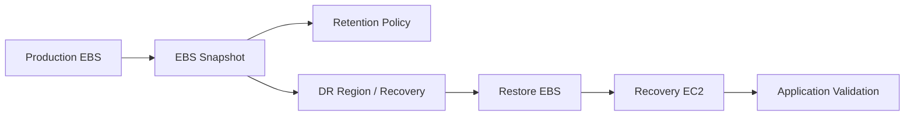
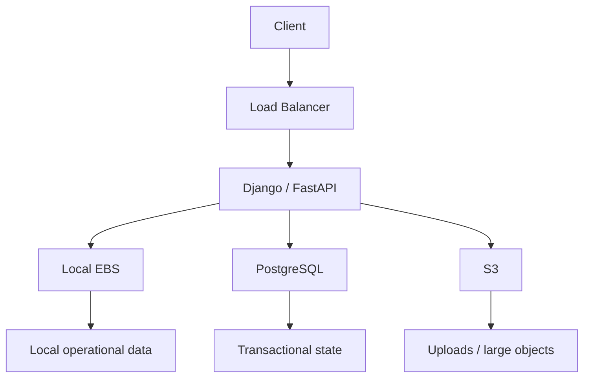

# 01- EBS

## Overview

Amazon Elastic Block Store (EBS) provides persistent block-level storage for EC2 instances. An EBS volume behaves like a virtual block device that can be attached to an EC2 instance and used for operating-system storage, application data, databases, logs, or other workloads requiring persistent block storage. :contentReference[oaicite:0]{index=0}

Unlike ephemeral instance storage, an EBS volume exists independently from the lifecycle of the EC2 instance. A volume can be detached from one instance and attached to another instance, subject to Availability Zone and attachment constraints. :contentReference[oaicite:1]{index=1}

The basic architecture is:


EBS is therefore an important boundary between **compute lifecycle** and **persistent storage lifecycle**.

---

## EBS Architecture

An EBS volume is created in a specific Availability Zone and must normally be attached to an EC2 instance in the same Availability Zone. :contentReference[oaicite:2]{index=2}

```text
Region
 |
 +-- Availability Zone A
 |     |
 |     +-- EC2
 |     |
 |     +-- EBS Volume
 |
 +-- Availability Zone B
       |
       +-- EC2
       |
       +-- EBS Volume
```

An EBS volume cannot simply be attached across Availability Zones.

For example:

```text
EC2-A / us-east-1a
        |
        +-- EBS-A / us-east-1a   ✓

EC2-B / us-east-1b
        |
        +-- EBS-A / us-east-1a   ✗
```

To move data between Availability Zones, common approaches include:

- EBS snapshots
- Creating a new volume from a snapshot
- Application-level replication
- Database replication
- Multi-AZ database services

---

## EBS vs Instance Store

EBS and instance store solve different storage problems.

| Characteristic | EBS | Instance Store |
|---|---|---|
| Persistence | Persistent | Ephemeral |
| Independent of instance lifecycle | Yes | No |
| Detachable | Yes | No |
| Snapshot support | Yes | No |
| Typical use | OS, databases, application data | Cache, temporary data |
| Survives instance stop | Yes | Depends on lifecycle; generally ephemeral |
| Survives instance termination | Can, depending on delete-on-termination setting | No |
| Performance model | Provisioned volume characteristics | Instance-specific local storage |

Use EBS when data must survive the replacement of an EC2 instance.

Use instance store when data can safely be reconstructed or discarded.

---

## EBS Volume Lifecycle

The normal lifecycle is:


Typical workflow:

```text
Create
  |
  v
Available
  |
  v
Attach
  |
  v
In-use
  |
  v
Mount / Use
  |
  v
Unmount
  |
  v
Detach
  |
  v
Available
  |
  v
Delete
```

AWS exposes volume states such as `creating`, `available`, `in-use`, `deleting`, `deleted`, and `error`. :contentReference[oaicite:3]{index=3}

---

## Root and Data Volumes

An EC2 instance commonly has at least one root EBS volume.

```text
EC2
 |
 +-- /dev/root
 |     |
 |     +-- Operating System
 |
 +-- /dev/data
       |
       +-- Application Data
```

A production application may separate operating-system and application data:

```text
Root Volume
    |
    +-- OS
    +-- Runtime
    +-- System packages

Data Volume
    |
    +-- PostgreSQL data
    +-- Application uploads
    +-- Persistent application files
```

This separation can simplify:

- Backup
- Restoration
- Storage resizing
- Data migration
- Instance replacement
- Capacity management

---

## EBS Volume Types

Current EBS volume types include SSD-backed and HDD-backed options. :contentReference[oaicite:4]{index=4}

| Type | Category | Typical Workload |
|---|---|---|
| `gp3` | General Purpose SSD | General workloads, boot volumes, APIs, moderate databases |
| `gp2` | General Purpose SSD | Legacy general-purpose workloads |
| `io2` | Provisioned IOPS SSD | High-performance databases and latency-sensitive workloads |
| `io1` | Provisioned IOPS SSD | Legacy/high-IOPS workloads |
| `st1` | Throughput Optimized HDD | Large sequential throughput workloads |
| `sc1` | Cold HDD | Infrequently accessed large sequential data |
| `standard` | Previous-generation HDD | Legacy workloads |

For most general-purpose modern EC2 workloads, `gp3` is the default starting point.

---

## General Purpose SSD

### gp3

`gp3` separates storage capacity from provisioned IOPS and throughput, allowing performance to be adjusted independently of volume size. It provides a baseline of 3,000 IOPS and 125 MiB/s throughput, with higher performance available through provisioning. Current AWS documentation lists maximums of 80,000 IOPS and 2,000 MiB/s throughput for gp3. :contentReference[oaicite:5]{index=5}

This is useful for workloads such as:

- Django applications
- FastAPI services
- PostgreSQL on EC2
- Redis persistence where appropriate
- CI/CD build hosts
- General application storage
- Boot volumes

Example:

```bash
aws ec2 create-volume \
    --volume-type gp3 \
    --size 100 \
    --availability-zone us-east-1a
```

AWS supports creating a gp3 volume directly through the EC2 API/CLI. :contentReference[oaicite:6]{index=6}

### gp2

`gp2` is an older general-purpose SSD type whose performance is more closely tied to volume size.

For new deployments, evaluate `gp3` first unless there is a specific compatibility or workload reason to use `gp2`.

---

## Provisioned IOPS SSD

`io2` is intended for workloads requiring sustained high IOPS and predictable low latency.

Typical examples include:

- High-performance relational databases
- Large transactional systems
- Latency-sensitive storage workloads
- I/O-intensive backend systems

Current AWS documentation lists `io2` Block Express at up to 256,000 IOPS and 4,000 MiB/s throughput on supported configurations. :contentReference[oaicite:7]{index=7}

Use provisioned IOPS only when workload requirements justify the additional cost and operational complexity.

Do not select `io2` simply because it is technically more powerful.

---

## HDD Volume Types

### st1

Throughput Optimized HDD is intended for workloads dominated by large, sequential I/O.

Examples include:

- Log processing
- Large data scans
- Batch processing
- Streaming-style sequential workloads

### sc1

Cold HDD is intended for large datasets that are accessed infrequently.

The key principle is:

```text
Random / low-latency I/O
    |
    v
SSD

Large sequential throughput
    |
    v
HDD
```

AWS notes that HDD-backed EBS volumes perform optimally with large, sequential I/O operations. :contentReference[oaicite:8]{index=8}

---

## Choosing an EBS Volume Type

A practical decision model is:

```text
Is the workload latency-sensitive?
        |
       Yes
        |
        v
Consider io2

        No
        |
        v
Is it a general application workload?
        |
       Yes
        |
        v
gp3

        No
        |
        v
Is it large sequential I/O?
        |
       Yes
        |
        v
st1 / sc1
```

Do not choose a volume type based only on capacity.

Consider:

- IOPS
- Throughput
- Latency
- I/O pattern
- Capacity
- Instance limits
- Application requirements
- Cost
- Availability requirements

---

## IOPS vs Throughput

These are different performance dimensions.

### IOPS

IOPS means **input/output operations per second**.

It is especially important for workloads performing many relatively small I/O operations.

```text
Many small database operations
        |
        v
High IOPS requirement
```

### Throughput

Throughput represents the amount of data transferred over time.

```text
Large sequential reads/writes
        |
        v
High throughput requirement
```

A workload can require:

```text
High IOPS + Low Latency
```

or:

```text
High Throughput + Large Sequential I/O
```

AWS recommends evaluating I/O size, demand, IOPS, throughput, and latency together rather than looking at one metric in isolation. :contentReference[oaicite:9]{index=9}

---

## EBS Performance Is Not Only About the Volume

The instance can also become the bottleneck.

```text
Application
    |
    v
Filesystem
    |
    v
EBS Volume
    |
    v
EC2 Instance EBS Limits
```

For example, provisioning a very high-performance EBS volume does not guarantee that the application can consume the full performance if the EC2 instance's EBS bandwidth or I/O limits are lower.

AWS specifically notes that instance configuration and workload demand can affect achievable EBS performance. :contentReference[oaicite:10]{index=10}

Therefore:

> Optimize the instance and volume as a combined storage path.

---

## Creating an EBS Volume

Create a 100 GiB gp3 volume:

```bash
aws ec2 create-volume \
    --volume-type gp3 \
    --size 100 \
    --availability-zone us-east-1a \
    --tag-specifications \
    'ResourceType=volume,Tags=[{Key=Name,Value=backend-data}]'
```

Inspect it:

```bash
aws ec2 describe-volumes \
    --volume-ids vol-xxxxxxxx
```

List available volumes:

```bash
aws ec2 describe-volumes \
    --filters Name=status,Values=available \
    --query 'Volumes[].{ID:VolumeId,Size:Size,Type:VolumeType,AZ:AvailabilityZone}' \
    --output table
```

---

## Attaching a Volume

Attach an available volume to an EC2 instance:

```bash
aws ec2 attach-volume \
    --volume-id vol-xxxxxxxx \
    --instance-id i-xxxxxxxx \
    --device /dev/sdf
```

The volume and instance must normally be in the same Availability Zone. :contentReference[oaicite:11]{index=11}

After attachment, the operating system may expose the device under a different name, particularly on Nitro-based instances where NVMe device naming is common.

Do not assume that:

```text
AWS device name = Linux device name
```

Always inspect the instance.

For example:

```bash
lsblk
```

```bash
sudo blkid
```

---

## Making an EBS Volume Usable

Attaching an EBS volume at the AWS level does not automatically mean that a filesystem is mounted.

The complete workflow is:

```text
AWS Volume
    |
    v
Attach
    |
    v
OS Device
    |
    v
Partition
    |
    v
Filesystem
    |
    v
Mount Point
```

For a new filesystem:

```bash
sudo mkfs.ext4 /dev/nvme1n1
```

Create a mount point:

```bash
sudo mkdir -p /data
```

Mount:

```bash
sudo mount /dev/nvme1n1 /data
```

Verify:

```bash
df -h /data
```

For production, configure persistent mounting through `/etc/fstab` using a stable identifier such as a UUID rather than relying on an unstable device name.

---

## Persistent Mounts

Get the UUID:

```bash
sudo blkid /dev/nvme1n1
```

Example:

```text
/dev/nvme1n1: UUID="abcd-1234" TYPE="ext4"
```

Add an entry to `/etc/fstab`:

```fstab
UUID=abcd-1234 /data ext4 defaults,nofail 0 2
```

Then validate:

```bash
sudo mount -a
```

The `nofail` option can prevent a boot failure if the volume is temporarily unavailable, but whether it is appropriate depends on the workload.

For a database volume, blindly using `nofail` can hide a serious storage dependency. The mount strategy should reflect the application's availability requirements.

---

## Formatting Risks

Formatting destroys existing filesystem data.

Never run:

```bash
mkfs.ext4 /dev/nvme1n1
```

on a volume until you have verified that the device is the intended empty volume.

Before formatting:

```bash
lsblk
```

```bash
sudo blkid
```

```bash
sudo file -s /dev/nvme1n1
```

A common operational mistake is confusing an attached existing volume with a newly created empty volume.

---

## Resizing EBS Volumes

EBS supports Elastic Volumes operations that can increase volume size, change volume type, and adjust provisioned performance on supported configurations without necessarily detaching the volume or restarting the instance. :contentReference[oaicite:12]{index=12}

Example:

```bash
aws ec2 modify-volume \
    --volume-id vol-xxxxxxxx \
    --size 200
```

Check modification status:

```bash
aws ec2 describe-volumes-modifications \
    --volume-ids vol-xxxxxxxx
```

A critical distinction is:

```text
EBS volume resized
        |
        v
Block device larger
        |
        v
Partition may need expansion
        |
        v
Filesystem may need expansion
```

Increasing the EBS volume size does not automatically guarantee that the filesystem immediately uses the additional capacity.

---

## Linux Filesystem Expansion

For an ext4 filesystem:

```bash
sudo resize2fs /dev/nvme1n1
```

For XFS:

```bash
sudo xfs_growfs /data
```

If a partition exists, the partition itself may need to be extended before the filesystem.

Inspect first:

```bash
lsblk
```

A safe workflow is:

```text
1. Increase EBS size
2. Verify AWS volume modification
3. Inspect block device
4. Extend partition if necessary
5. Extend filesystem
6. Verify filesystem capacity
```

EBS volume size cannot be decreased through the normal Elastic Volumes modification workflow. AWS documents increasing size as supported, while shrinking requires a migration strategy such as creating a smaller volume and copying data. :contentReference[oaicite:13]{index=13}

---

## Changing Volume Type and Performance

Elastic Volumes can also modify performance characteristics and volume type for supported volumes. :contentReference[oaicite:14]{index=14}

For example, migrating from gp2 to gp3:

```bash
aws ec2 modify-volume \
    --volume-id vol-xxxxxxxx \
    --volume-type gp3
```

You can explicitly specify performance where required:

```bash
aws ec2 modify-volume \
    --volume-id vol-xxxxxxxx \
    --volume-type gp3 \
    --iops 6000 \
    --throughput 250
```

Performance changes should be based on observed workload requirements rather than arbitrary over-provisioning.

---

## Detaching a Volume

Before detaching a data volume:

```text
Application
    |
    v
Flush / Stop Writes
    |
    v
Unmount Filesystem
    |
    v
Detach EBS
```

For example:

```bash
sudo umount /data
```

Then:

```bash
aws ec2 detach-volume \
    --volume-id vol-xxxxxxxx
```

Do not detach a filesystem that is actively being written to without understanding the filesystem and application consistency implications.

For databases, use the database's shutdown or backup procedure rather than treating a volume detach as a safe application-level backup mechanism.

---

## Delete on Termination

An EBS volume attached to an EC2 instance can have a `DeleteOnTermination` behavior.

Conceptually:

```text
EC2 Terminates
      |
      +-- Root Volume
      |      |
      |      +-- Delete
      |
      +-- Data Volume
             |
             +-- Preserve
```

For important application data, verify this setting before terminating instances.

Inspect block device mappings:

```bash
aws ec2 describe-instances \
    --instance-ids i-xxxxxxxx \
    --query 'Reservations[].Instances[].BlockDeviceMappings[].{Device:DeviceName,Volume: Ebs.VolumeId,DeleteOnTermination:Ebs.DeleteOnTermination}' \
    --output table
```

Do not rely on memory or assumptions when terminating production instances.

---

## EBS Encryption

EBS supports encryption for both boot and data volumes.

AWS EBS encryption protects:

- Data at rest
- Data moving between the volume and instance
- Snapshots created from encrypted volumes
- Volumes created from encrypted snapshots :contentReference[oaicite:15]{index=15}

The encryption architecture involves AWS KMS and EBS data keys.


Encryption should generally be the default for production workloads.

---

## KMS Considerations

AWS provides an AWS-managed EBS KMS key in each Region, commonly represented by:

```text
alias/aws/ebs
```

Customer-managed KMS keys may be appropriate when organizations require:

- Customer-controlled key policies
- Cross-account sharing workflows
- Explicit key rotation policies
- Compliance controls
- Separation of key administration

If a customer-managed key becomes inaccessible or is disabled, encrypted EBS operations can be affected.

Treat KMS availability and permissions as part of the storage dependency chain.

---

## EBS Snapshots

An EBS snapshot is a point-in-time backup of an EBS volume. Snapshot creation is asynchronous, and AWS stores the snapshot data in managed snapshot storage rather than exposing an ordinary S3 bucket for direct access. :contentReference[oaicite:16]{index=16}

The relationship is:

```text
EBS Volume
    |
    | snapshot
    v
EBS Snapshot
    |
    | restore
    v
New EBS Volume
```

Snapshots are useful for:

- Backup
- Disaster recovery
- Volume migration
- Creating new environments
- AMI workflows
- Cross-Availability-Zone recovery
- Regional recovery workflows

Snapshot operations are covered in greater detail in the dedicated EBS Snapshot documentation.

---

## Snapshot Consistency

A snapshot captures data that has been written to the volume at the time the snapshot is requested, but application-level consistency requires additional consideration. AWS recommends pausing writes or unmounting where appropriate for consistent snapshots; for root volumes, stopping the instance is recommended when practical. :contentReference[oaicite:17]{index=17}

For a database:

```text
Database
   |
   +-- Flush / checkpoint
   |
   +-- Consistent state
   |
   v
EBS Snapshot
```

Do not assume:

```text
Snapshot
    =
Application-consistent backup
```

Storage-level consistency and application-level consistency are different concepts.

---

## EBS and Databases

EBS is commonly used for self-managed databases on EC2.

For PostgreSQL:

```text
EC2
 |
 +-- Root EBS
 |
 +-- PostgreSQL Data EBS
 |
 +-- Optional WAL / backup storage
```

Database performance depends on:

- IOPS
- Throughput
- Latency
- Queue depth
- Filesystem
- PostgreSQL configuration
- Instance EBS limits
- Query workload
- Connection and transaction patterns

For many PostgreSQL workloads, `gp3` is a reasonable starting point, while I/O-intensive systems may require provisioned IOPS.

Do not choose the EBS type independently from the database workload.

---

## EBS and Django/FastAPI

For a Django or FastAPI application, EBS may be used for:

- Application logs
- Uploaded files
- Local temporary data
- Self-managed PostgreSQL
- Build artifacts
- Persistent application state

For horizontally scaled API instances:

```text
ALB
 |
 +-- EC2-A
 +-- EC2-B
 +-- EC2-C
```

Avoid storing shared user uploads only on one instance's local EBS volume.

Instead consider:

```text
API
 |
 v
S3
 |
 v
Object Storage
```

EBS is attached to an instance; it is not automatically shared storage for a fleet.

---

## EBS and Auto Scaling

Auto Scaling changes how persistent storage should be designed.

A replacement instance does not automatically inherit the previous instance's arbitrary data volume unless the architecture explicitly handles it.

Prefer:

```text
Auto Scaling Group
 |
 +-- Immutable EC2
 +-- Immutable EC2
 +-- Immutable EC2
       |
       +-- Shared durable data -> S3 / database / managed storage
```

rather than:

```text
EC2-A
 |
 +-- Important customer data

EC2-A fails

    X

Data unavailable
```

When state must persist independently of compute, decouple the storage lifecycle from the instance lifecycle.

---

## EBS Multi-Attach

EBS Multi-Attach allows supported EBS volumes to be attached to multiple EC2 instances in the same Availability Zone. AWS documents Multi-Attach for supported `io1` and `io2` configurations, with current supported configurations allowing attachment to multiple instances. :contentReference[oaicite:18]{index=18}

A conceptual architecture is:

```text
             +-- EC2-A
             |
EBS Volume --+-- EC2-B
             |
             +-- EC2-C
```

This does **not** mean that arbitrary filesystems can safely be mounted read/write from multiple instances.

The application or filesystem must support concurrent multi-host access correctly.

Use Multi-Attach only when the workload and storage stack explicitly support the required concurrency semantics.

---

## EBS Performance Monitoring

Important EBS/EC2 storage metrics include:

- Read operations
- Write operations
- Read bytes
- Write bytes
- Read latency
- Write latency
- Queue depth
- Burst balance where applicable
- Volume throughput
- Volume IOPS
- Instance-level EBS bandwidth

A useful mental model is:

```text
Application
    |
    v
I/O Demand
    |
    v
Queue
    |
    v
EBS Volume
    |
    v
EC2 EBS Bandwidth
```

If the application is slow, determine whether the bottleneck is:

- Volume IOPS
- Volume throughput
- Volume latency
- Queue depth
- Filesystem
- Instance EBS limits
- Application I/O pattern

---

## Storage Capacity Monitoring

Monitor filesystem utilization separately from EBS volume size.

For example:

```bash
df -h
```

shows filesystem capacity.

Whereas:

```bash
lsblk
```

shows block devices and their sizes.

These can disagree during a resize:

```text
EBS = 200 GiB
Filesystem = 100 GiB
```

until the partition/filesystem expansion is completed.

Therefore:

```text
Cloud Storage Capacity
        +
OS Filesystem Capacity
        +
Application Storage Usage
```

should all be monitored.

---

## Backup Strategy

A production EBS backup strategy should consider:

- Snapshot frequency
- Retention
- Encryption
- Cross-Region recovery
- Backup consistency
- Restore testing
- Recovery Point Objective
- Recovery Time Objective
- Application-level backups

A snapshot strategy alone is not a complete disaster-recovery strategy.

Example:



A backup that has never been restored is an assumption, not a tested recovery process.

---

## Disaster Recovery

Because an EBS volume is Availability Zone-specific, disaster recovery planning must account for failure beyond a single instance.

For example:

```text
Production
us-east-1a
   |
   v
EBS Snapshot
   |
   v
Recovery
us-east-1b / another Region
   |
   v
New EBS Volume
   |
   v
Recovery EC2
```

For critical systems, evaluate:

- Cross-AZ recovery
- Cross-Region snapshot copies
- Database replication
- Backup retention
- Recovery automation
- DNS failover
- Application consistency
- KMS key availability

---

## Cost Optimization

EBS cost is influenced by factors such as:

- Provisioned storage capacity
- Provisioned IOPS
- Provisioned throughput
- Volume type
- Snapshot storage
- Snapshot retention
- Data transfer for related workflows
- Unused volumes

A common waste pattern is:

```text
EC2 terminated
      |
      X
EBS volume remains
      |
      v
Unattached volume
      |
      v
Ongoing cost
```

Find unattached volumes:

```bash
aws ec2 describe-volumes \
    --filters Name=status,Values=available \
    --query 'Volumes[].{ID:VolumeId,Size:Size,Type:VolumeType,AZ:AvailabilityZone}' \
    --output table
```

Before deleting anything, verify ownership and retention requirements.

---

## Production Storage Architecture

A scalable backend architecture often separates storage responsibilities:



Use each storage system for the type of state it handles best.

For example:

| Data | Suitable Storage |
|---|---|
| OS | EBS |
| PostgreSQL data on EC2 | EBS |
| Application logs | Centralized logging / EBS for local buffering |
| User uploads | S3 |
| Session/cache data | Redis |
| Transactional relational data | PostgreSQL |
| Large immutable artifacts | S3 |
| Temporary scratch data | Instance store or EBS depending on requirements |

Do not turn EBS into a general-purpose shared filesystem for an entire backend fleet.

---

## Common Mistakes

### Assuming EBS Is Shared Storage

An EBS volume is attached to EC2 instances; it is not automatically a shared filesystem.

**Avoid it:** use S3, EFS, or another appropriate shared-storage architecture when multiple instances need shared data.

### Choosing Volume Type by Size Alone

A 1 TiB volume does not tell you whether the workload needs high IOPS or high throughput.

**Avoid it:** measure the workload and provision capacity and performance independently where supported.

### Resizing the EBS Volume but Not the Filesystem

Increasing the AWS volume size does not necessarily expand the filesystem.

**Avoid it:** verify the block device, partition, and filesystem after every resize.

### Formatting the Wrong Device

Running `mkfs` against an existing production volume can destroy data.

**Avoid it:** verify device identity using `lsblk`, UUIDs, filesystem signatures, and AWS volume IDs.

### Deleting an EC2 Instance Without Checking Volumes

Important data volumes may be preserved or deleted depending on their configuration.

**Avoid it:** inspect `DeleteOnTermination` before terminating instances.

### Treating Snapshots as Application-Consistent Backups

A storage-level snapshot does not automatically represent an application-consistent database backup.

**Avoid it:** coordinate snapshots with application/database consistency requirements.

### Over-Provisioning IOPS

More IOPS is not automatically better.

**Avoid it:** use CloudWatch and workload measurements to determine actual requirements.

### Ignoring Instance-Level Storage Limits

A high-performance EBS volume can still be constrained by the EC2 instance.

**Avoid it:** evaluate volume and instance limits together.

### Keeping Important State on One EC2 Instance

A single instance-local EBS volume can become a recovery dependency.

**Avoid it:** separate compute and durable application state where the architecture requires horizontal scaling or high availability.

---

## Operational Checklist

Before deploying a production EBS-backed workload, verify:

```text
[ ] Correct volume type selected
[ ] Capacity sized from measured requirements
[ ] IOPS and throughput requirements understood
[ ] EC2 instance storage limits checked
[ ] Encryption enabled
[ ] Appropriate KMS key selected
[ ] Volume and instance Availability Zones match
[ ] Filesystem and mount configuration are persistent
[ ] DeleteOnTermination behavior is intentional
[ ] Backup policy exists
[ ] Snapshot consistency requirements are understood
[ ] Restore procedure has been tested
[ ] Capacity monitoring is configured
[ ] IOPS / throughput / latency monitoring is configured
[ ] Unattached volumes are periodically reviewed
[ ] Application state is not unnecessarily coupled to one instance
```

---

## Interview Considerations

### What is EBS?

EBS is persistent block-level storage designed to be attached to EC2 instances.

### Is EBS shared storage?

Normally, no. A standard EBS volume is attached to an EC2 instance. Supported Multi-Attach configurations allow multiple instances to attach to a volume, but the application/filesystem must support the required concurrent-access semantics. :contentReference[oaicite:19]{index=19}

### Can an EBS volume be attached to an instance in another Availability Zone?

No. The volume and instance must normally be in the same Availability Zone. :contentReference[oaicite:20]{index=20}

### What is the difference between EBS and instance store?

EBS provides persistent block storage that exists independently from the EC2 instance lifecycle. Instance store provides local ephemeral storage associated with the instance.

### Why is gp3 commonly preferred for general workloads?

It provides general-purpose SSD performance while allowing IOPS and throughput to be provisioned independently of volume size, making performance and capacity easier to optimize separately. :contentReference[oaicite:21]{index=21}

### What happens when you increase an EBS volume from 100 GiB to 200 GiB?

The EBS block device becomes larger, but the operating-system partition and filesystem may also need to be expanded before applications can use the additional capacity.

### Can EBS volume size be decreased?

Not through the normal Elastic Volumes resize operation. EBS supports increasing size; shrinking generally requires creating a smaller volume and migrating the data. :contentReference[oaicite:22]{index=22}

### Are EBS snapshots backups?

They are point-in-time storage backups, but application-level consistency and recovery requirements still need to be addressed. Database workloads may require coordinated backup procedures. :contentReference[oaicite:23]{index=23}

### Does encrypting an EBS volume encrypt its snapshots?

Snapshots created from encrypted EBS volumes are automatically encrypted, and volumes created from those snapshots remain encrypted. :contentReference[oaicite:24]{index=24}

---

## Key Takeaways

- EBS is persistent block storage for EC2, with volume lifecycle and storage lifecycle managed independently from compute.
- Choose EBS volume type based on workload characteristics such as IOPS, throughput, latency, access pattern, capacity, and cost rather than capacity alone.
- EBS volumes are Availability Zone-specific, and resizing the volume may require separate partition and filesystem expansion inside the operating system.
- Production EBS designs should include encryption, monitoring, backup and restore testing, intentional lifecycle settings, and explicit separation of durable application state from replaceable EC2 instances.
- EBS performance must be evaluated together with EC2 instance limits, filesystem behavior, and application I/O patterns; a high-performance volume does not guarantee high application performance by itself.