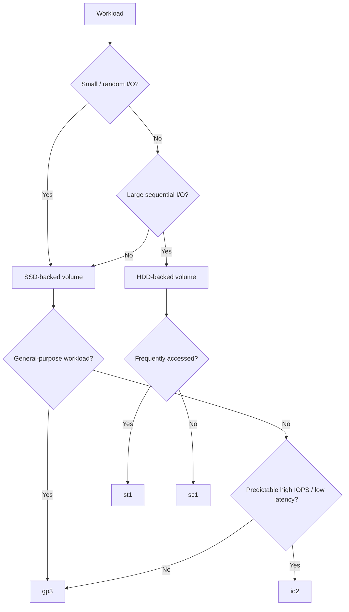
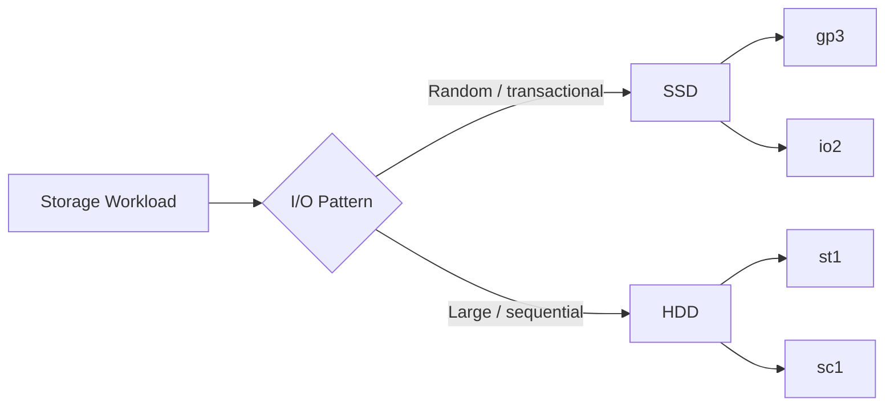
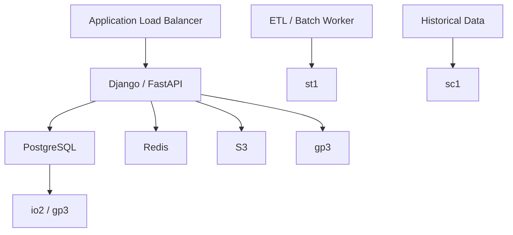
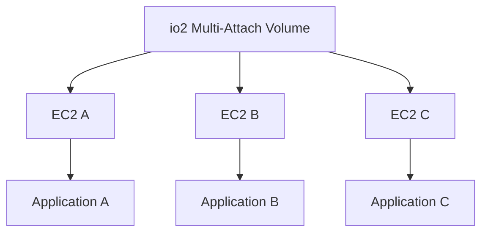

# 02- EBS Volume Types

## Overview

Amazon EBS provides multiple volume types optimized for different combinations of latency, IOPS, throughput, capacity, durability, and cost. Selecting the correct type is a workload-design decision, not simply a storage-capacity decision.

The current EBS families are:

- General Purpose SSD: `gp3`, `gp2`
- Provisioned IOPS SSD: `io2`, `io1`
- Throughput Optimized HDD: `st1`
- Cold HDD: `sc1`
- Previous-generation Magnetic: `standard`

AWS describes SSD-backed volumes as appropriate for transactional workloads with frequent reads/writes, while HDD-backed volumes are optimized for large sequential workloads. :contentReference[oaicite:0]{index=0}

A useful selection model is:



For most modern general-purpose EC2 workloads, `gp3` is the practical default starting point. Workloads with stringent IOPS or latency requirements may justify `io2`, while large sequential workloads may be better suited to `st1` or `sc1`.

---

## Volume Type Comparison

| Volume Type | Media | Primary Performance Dimension | Typical Workload | Boot Volume | Multi-Attach |
|---|---|---|---|---|---|
| `gp3` | SSD | IOPS + throughput | General-purpose applications, APIs, databases | Yes | No |
| `gp2` | SSD | IOPS tied to size | Existing general-purpose workloads | Yes | No |
| `io2` | SSD | Provisioned IOPS + low latency | I/O-intensive databases, critical transactional systems | Yes | Yes |
| `io1` | SSD | Provisioned IOPS | Legacy/high-IOPS workloads | Yes | Yes |
| `st1` | HDD | Throughput | Big data, ETL, log processing, sequential workloads | No | No |
| `sc1` | HDD | Throughput | Infrequently accessed sequential data | No | No |
| `standard` | Magnetic | Low-cost legacy storage | Legacy workloads | Yes | No |

AWS currently lists `gp3`, `gp2`, `io2`, `io1`, `st1`, `sc1`, and `standard` as EBS volume types. :contentReference[oaicite:1]{index=1}

---

## Understanding IOPS

IOPS means **input/output operations per second**.

It measures the number of I/O operations a storage volume can process over time.

```text
Application
    |
    +-- Read
    +-- Read
    +-- Write
    +-- Read
    +-- Write
    |
    v
Storage
```

A workload performing many small database operations is usually more sensitive to IOPS and latency than to raw sequential throughput.

Examples:

- PostgreSQL transactional workloads
- Redis persistence workloads
- Django/FastAPI applications with database-heavy traffic
- Metadata-heavy applications
- CI/CD systems performing many small file operations

IOPS should not be considered independently of I/O size.

For example:

```text
10,000 IOPS × 16 KiB
```

and

```text
10,000 IOPS × 256 KiB
```

represent very different throughput requirements.

---

## Understanding Throughput

Throughput measures how much data can be transferred over time.

Typical units are:

```text
MiB/s
GiB/s
```

A workload performing large sequential reads may care much more about throughput than raw IOPS.

For example:

```text
Large log files
       |
       v
Sequential reads
       |
       v
High throughput
```

HDD-backed EBS volumes are specifically optimized for large sequential I/O. AWS notes that `st1` and `sc1` perform optimally with large sequential operations rather than small random operations. :contentReference[oaicite:2]{index=2}

---

## IOPS vs Throughput

| Workload | Dominant Requirement |
|---|---|
| PostgreSQL OLTP | IOPS + latency |
| Django API database | IOPS + latency |
| FastAPI service with PostgreSQL | IOPS + latency |
| Large ETL scans | Throughput |
| Log processing | Throughput |
| Data warehouse sequential scans | Throughput |
| Object-like archival data | Capacity + low cost |
| High-performance transactional database | IOPS + latency |

The relationship can be approximated as:

```text
Throughput ≈ IOPS × I/O Size
```

For example:

```text
4,000 IOPS × 64 KiB
≈ 250 MiB/s
```

The actual achievable performance is subject to the EBS volume and EC2 instance limits.

---

## Latency

Latency is the time required to complete an I/O operation.

For backend systems, latency often matters more than peak throughput.

Consider PostgreSQL:

```text
API Request
    |
    v
PostgreSQL Query
    |
    v
Storage Read
    |
    v
Transaction Completion
```

If storage latency increases, database query latency can increase even when CPU utilization appears normal.

For latency-sensitive workloads, `io2` is designed for consistent high performance and low latency. AWS documents `io2` Block Express as targeting average latency below 500 microseconds for 16 KiB I/O on supported configurations. :contentReference[oaicite:3]{index=3}

---

## gp3

`gp3` is the general-purpose SSD volume type to evaluate first for most modern EC2 workloads.

It is designed for workloads such as:

- Web applications
- REST APIs
- Django
- FastAPI
- PostgreSQL
- Development environments
- CI/CD workloads
- Application servers
- General-purpose boot volumes

A key advantage is that gp3 separates storage capacity from provisioned IOPS and throughput.

The baseline is:

```text
3,000 IOPS
125 MiB/s throughput
```

with higher IOPS and throughput available through configuration. AWS currently documents gp3 up to 80,000 IOPS and 2,000 MiB/s on supported configurations. :contentReference[oaicite:4]{index=4}

This separation makes gp3 easier to right-size.

For example:

```text
100 GiB
+
6,000 IOPS
+
250 MiB/s
```

can be provisioned without artificially increasing capacity simply to obtain more performance.

---

## Why gp3 Is a Strong Default

A common historical pattern with `gp2` was:

```text
Need more IOPS
      |
      v
Increase volume size
      |
      v
Pay for unused capacity
```

With gp3:

```text
Capacity requirement
        |
        +----> Size
        |
        +----> IOPS
        |
        +----> Throughput
```

This makes performance tuning more explicit.

For a typical backend service:

```text
Django / FastAPI
       |
       v
PostgreSQL
       |
       v
gp3 EBS
```

start with gp3 and validate actual I/O behavior before moving to provisioned-IOPS storage.

---

## gp2

`gp2` is a previous general-purpose SSD volume type.

Its performance model is more tightly associated with volume size than gp3.

Conceptually:

```text
gp2
 |
 +-- Capacity
 |
 +-- Baseline IOPS derived from size
 |
 +-- Burst behavior for eligible volumes
```

This can make performance planning less flexible.

Existing gp2 volumes may still be perfectly functional, but when designing new workloads, evaluate gp3 first.

A migration from gp2 to gp3 can often be performed using Elastic Volumes:

```bash
aws ec2 modify-volume \
    --volume-id vol-0123456789abcdef0 \
    --volume-type gp3
```

The exact migration should still be validated against workload performance and cost.

---

## io2

`io2` is a Provisioned IOPS SSD volume designed for workloads where predictable high IOPS, low latency, and high durability are important.

Typical workloads include:

- High-performance PostgreSQL
- Critical transactional databases
- High-I/O enterprise applications
- Latency-sensitive storage
- Specialized clustered applications
- Multi-Attach workloads

AWS currently documents `io2` Block Express configurations up to 256,000 IOPS and 4,000 MiB/s. :contentReference[oaicite:5]{index=5}

The architectural model is:

```text
Application
     |
     v
High I/O demand
     |
     v
io2
     |
     +-- Provisioned IOPS
     +-- Predictable performance
     +-- Low latency
```

Use `io2` when workload measurements justify it.

Do not choose it simply because it has a higher specification than gp3.

---

## io1

`io1` is an older Provisioned IOPS SSD volume type.

It remains relevant for existing workloads and certain compatibility scenarios, but new designs should evaluate `io2` first when provisioned IOPS storage is required.

AWS also supports Multi-Attach for `io1` and `io2`, subject to documented regional and platform constraints. :contentReference[oaicite:6]{index=6}

---

## st1

`st1` is a Throughput Optimized HDD volume designed for large sequential workloads.

Typical examples include:

- Big data processing
- ETL pipelines
- Log processing
- Data warehouse workloads
- Large sequential reads/writes

AWS specifically identifies EMR, ETL, data warehouses, and log processing as suitable `st1` use cases. :contentReference[oaicite:7]{index=7}

Architecture:

```text
Large Dataset
     |
     v
Sequential I/O
     |
     v
st1
     |
     v
High Throughput
```

`st1` is not intended for workloads dominated by small random I/O.

For example, using `st1` for PostgreSQL transactional storage would generally be a poor fit because the database may issue many small random reads and writes.

---

## sc1

`sc1` is Cold HDD storage intended for large datasets that are accessed infrequently and where minimizing storage cost is important.

Typical workloads include:

- Infrequently accessed logs
- Historical datasets
- Large sequential archives
- Low-access analytical data

The key distinction is:

```text
st1
 |
 +-- Large sequential
 +-- Frequently accessed

sc1
 |
 +-- Large sequential
 +-- Infrequently accessed
```

AWS documents `sc1` as a throughput-oriented storage option for infrequently accessed data. :contentReference[oaicite:8]{index=8}

---

## standard

`standard` is the previous-generation Magnetic EBS volume type.

It is intended primarily for legacy workloads.

AWS identifies it as a previous-generation volume type and recommends current-generation volume types when higher performance or performance consistency is required. :contentReference[oaicite:9]{index=9}

For new backend systems:

```text
New workload
     |
     X
standard
     |
     v
Evaluate gp3 / io2 / st1 / sc1
```

Do not introduce `standard` into a new production architecture without a specific compatibility requirement.

---

## SSD vs HDD

The fundamental distinction is workload access pattern.



| Characteristic | SSD | HDD |
|---|---|---|
| Random I/O | Strong fit | Poor fit |
| Sequential I/O | Strong | Strong |
| Latency-sensitive workload | Strong | Poor fit |
| Database OLTP | Strong | Poor fit |
| Large sequential processing | Possible | Strong fit |
| Cost-focused archival | Usually not ideal | Strong fit |
| Typical metric | IOPS + latency | Throughput |

AWS states that SSD-backed volumes provide consistent performance for random and sequential I/O, while HDD-backed volumes are optimized for large sequential I/O. :contentReference[oaicite:10]{index=10}

---

## Choosing a Volume Type by Workload

| Workload | Starting Point | Reason |
|---|---|---|
| Django application server | `gp3` | General-purpose SSD |
| FastAPI application server | `gp3` | General-purpose SSD |
| PostgreSQL transactional workload | `gp3` | Good general-purpose starting point |
| High-IOPS PostgreSQL | `io2` | Provisioned IOPS and latency |
| Large ETL workload | `st1` | Sequential throughput |
| Log processing | `st1` | Sequential throughput |
| Infrequently accessed large dataset | `sc1` | Lower-cost HDD |
| Legacy workload | `standard` | Compatibility only |
| High-performance shared storage | `io2` Multi-Attach | Specialized shared-access design |

The table is a starting point, not a substitute for workload measurements.

---

## Backend Architecture Example

A production backend may use different storage types for different services:



The principle is:

> Select storage based on the workload consuming it, not based on the application name alone.

A Django application might use gp3 for its filesystem while PostgreSQL requires a different EBS configuration.

---

## Volume Type Selection for PostgreSQL

For PostgreSQL on EC2, the decision should start with workload characteristics.

### General workload

```text
PostgreSQL
    |
    v
gp3
```

Suitable when:

- Transaction volume is moderate
- Latency requirements are normal
- IOPS requirements fit gp3
- Cost efficiency matters

### High-performance workload

```text
PostgreSQL
    |
    v
io2
```

Consider when:

- Sustained high IOPS are required
- Storage latency is a critical application requirement
- Workload measurements justify provisioned IOPS
- The EC2 instance can provide sufficient EBS bandwidth

Do not use `io2` as a replacement for database tuning.

Poor SQL queries, missing indexes, excessive connections, inefficient transactions, or inadequate PostgreSQL configuration cannot be fixed simply by selecting a more expensive EBS volume.

---

## EBS Performance Is a System Property

Volume type alone does not determine application performance.

The storage path looks like:

```text
Application
    |
    v
Filesystem
    |
    v
EBS Volume
    |
    v
EC2 EBS Interface
    |
    v
Instance EBS Limit
```

AWS explicitly notes that achievable EBS performance is bounded by the EC2 instance's performance limits and the aggregate performance of its attached volumes. :contentReference[oaicite:11]{index=11}

For example:

```text
Volume capability = 80,000 IOPS
Instance capability = 40,000 IOPS

Effective ceiling ≈ 40,000 IOPS
```

The reverse can also happen:

```text
Instance capability = 80,000 IOPS
Volume capability = 20,000 IOPS

Effective ceiling ≈ 20,000 IOPS
```

Therefore, performance tuning must evaluate both sides.

---

## EBS-Optimized Instances

An EBS-optimized EC2 instance provides dedicated capacity for EBS I/O and reduces contention between storage traffic and other instance traffic. :contentReference[oaicite:12]{index=12}

When designing high-performance workloads, verify:

- Instance EBS bandwidth
- Maximum EBS IOPS
- Number of attached volumes
- Aggregate volume performance
- Network characteristics
- Workload I/O size

A high-performance `io2` volume attached to an undersized instance can still underperform.

---

## Queue Depth

Queue depth represents outstanding I/O waiting to be processed.

Conceptually:

```text
Application
    |
    v
I/O Requests
    |
    v
+------------------+
| Request Queue    |
| R1               |
| R2               |
| R3               |
| R4               |
+------------------+
    |
    v
EBS
```

A consistently high queue depth can indicate that the workload is generating more I/O demand than the storage path can currently service.

Do not automatically respond by increasing IOPS.

Investigate:

- Application behavior
- Query patterns
- I/O size
- Filesystem behavior
- Volume limits
- Instance limits
- Database configuration

---

## I/O Size Matters

The same IOPS value can produce very different throughput.

For example:

```text
10,000 IOPS × 16 KiB
```

is approximately:

```text
156 MiB/s
```

while:

```text
10,000 IOPS × 256 KiB
```

is approximately:

```text
2.5 GiB/s
```

This is why:

```text
IOPS
+
I/O Size
+
Latency
+
Throughput
```

must be considered together.

For HDD volumes, large sequential I/O is particularly important. AWS notes that `st1` and `sc1` are optimized for large sequential operations and that small random I/O can significantly reduce their effectiveness. :contentReference[oaicite:13]{index=13}

---

## Multi-Attach and Volume Types

EBS Multi-Attach is available for supported `io1` and `io2` volumes and allows a volume to be attached to multiple EC2 instances in the same Availability Zone. Current AWS documentation states that supported Multi-Attach volumes can be attached to up to 16 Nitro-based instances. :contentReference[oaicite:14]{index=14}

Architecture:



However, Multi-Attach is not equivalent to ordinary shared filesystem storage.

Standard filesystems such as XFS and ext4 are not designed for simultaneous read/write access from multiple independent servers. AWS recommends using an appropriate clustered filesystem and coordinating concurrent access for production workloads. :contentReference[oaicite:15]{index=15}

For supported `io2` Multi-Attach configurations, NVMe reservations can provide storage fencing mechanisms for coordinating access between instances. :contentReference[oaicite:16]{index=16}

---

## Multi-Attach Performance

Multi-Attach does not multiply the provisioned IOPS indefinitely.

For example:

```text
io2 volume
80,000 provisioned IOPS

EC2-A -> 30,000 IOPS
EC2-B -> 30,000 IOPS
EC2-C -> 30,000 IOPS
```

The aggregate demand cannot exceed the volume's provisioned performance.

AWS explicitly documents that the aggregate IOPS driven by attached instances is bounded by the volume's provisioned IOPS. :contentReference[oaicite:17]{index=17}

Therefore:

```text
Per-instance capacity
        +
Volume capacity
        =
Actual system ceiling
```

---

## Performance Monitoring

The correct volume type should be validated through production measurements.

Monitor:

- Read operations
- Write operations
- Read bytes
- Write bytes
- Read latency
- Write latency
- Queue depth
- IOPS utilization
- Throughput utilization
- Burst balance where applicable
- EC2 EBS bandwidth

AWS provides CloudWatch metrics for monitoring EBS I/O characteristics. :contentReference[oaicite:18]{index=18}

A useful investigation sequence is:

```text
Application latency increases
        |
        v
Check database latency
        |
        v
Check filesystem I/O
        |
        v
Check EBS IOPS
        |
        v
Check EBS throughput
        |
        v
Check queue depth
        |
        v
Check EC2 EBS limits
```

---

## Cost Considerations

EBS cost is not determined solely by GiB.

Depending on the volume type and configuration, cost can also be affected by:

- Provisioned IOPS
- Provisioned throughput
- Volume capacity
- Snapshot storage
- Volume type
- Unused volumes

For example:

```text
gp3
 |
 +-- Storage
 +-- Additional IOPS
 +-- Additional throughput
```

Whereas a provisioned-IOPS workload such as `io2` has a different performance and pricing model.

The engineering goal is not:

```text
Lowest storage price
```

It is:

```text
Lowest total cost that satisfies
performance + reliability + operational requirements
```

---

## Migration Between Volume Types

Elastic Volumes allow supported EBS volumes to be modified without the traditional detach-and-recreate workflow in many cases.

For example, migrating gp2 to gp3:

```bash
aws ec2 modify-volume \
    --volume-id vol-0123456789abcdef0 \
    --volume-type gp3
```

Inspect the modification:

```bash
aws ec2 describe-volumes-modifications \
    --volume-ids vol-0123456789abcdef0
```

A production migration should include:

1. Establish baseline performance.
2. Modify the volume.
3. Monitor modification state.
4. Compare application performance.
5. Validate cost impact.
6. Confirm filesystem and application health.

Do not treat a volume-type migration as purely a configuration change. Storage performance changes can affect database latency, application throughput, and operating cost.

---

## Practical CLI Examples

### Create gp3

```bash
aws ec2 create-volume \
    --availability-zone us-east-1a \
    --volume-type gp3 \
    --size 100 \
    --iops 6000 \
    --throughput 250 \
    --tag-specifications \
    'ResourceType=volume,Tags=[{Key=Name,Value=backend-data}]'
```

### Create io2

```bash
aws ec2 create-volume \
    --availability-zone us-east-1a \
    --volume-type io2 \
    --size 200 \
    --iops 20000 \
    --tag-specifications \
    'ResourceType=volume,Tags=[{Key=Name,Value=postgres-data}]'
```

### Inspect volume type

```bash
aws ec2 describe-volumes \
    --volume-ids vol-0123456789abcdef0 \
    --query 'Volumes[0].{ID:VolumeId,Type:VolumeType,Size:Size,IOPS:Iops,Throughput:Throughput,AZ:AvailabilityZone,Encrypted:Encrypted}' \
    --output table
```

### Find all gp3 volumes

```bash
aws ec2 describe-volumes \
    --filters Name=volume-type,Values=gp3 \
    --query 'Volumes[].{ID:VolumeId,Size:Size,IOPS:Iops,Throughput:Throughput,State:State}' \
    --output table
```

### Find unattached volumes

```bash
aws ec2 describe-volumes \
    --filters Name=status,Values=available \
    --query 'Volumes[].{ID:VolumeId,Type:VolumeType,Size:Size,AZ:AvailabilityZone}' \
    --output table
```

---

## Production Selection Checklist

Before choosing an EBS volume type, evaluate:

```text
[ ] Is the workload random or sequential?
[ ] Is latency important?
[ ] Is IOPS the primary constraint?
[ ] Is throughput the primary constraint?
[ ] What is the average I/O size?
[ ] What is the peak I/O demand?
[ ] What capacity is actually required?
[ ] What performance is actually required?
[ ] Does the EC2 instance support the required EBS performance?
[ ] Is encryption required?
[ ] Is Multi-Attach actually necessary?
[ ] What is the backup and recovery requirement?
[ ] What is the monthly cost?
[ ] Can performance be validated with CloudWatch?
[ ] Is the workload suitable for horizontal scaling?
```

---

## Common Mistakes

### Choosing `io2` Because It Is "Faster"

`io2` provides capabilities that are valuable for specific workloads, but higher specifications do not automatically improve an application.

**Avoid it:** measure IOPS, latency, throughput, and workload behavior first.

### Using HDD for Random Database Workloads

HDD-backed `st1` and `sc1` are optimized for large sequential operations.

**Avoid it:** use SSD-backed storage for transactional and random-I/O workloads. :contentReference[oaicite:19]{index=19}

### Assuming More IOPS Means More Throughput

IOPS and throughput are related through I/O size but are not interchangeable.

**Avoid it:** evaluate IOPS, I/O size, throughput, and latency together.

### Ignoring EC2 Instance Limits

A volume may advertise more performance than the attached EC2 instance can consume.

**Avoid it:** check the instance's EBS bandwidth and IOPS limits. :contentReference[oaicite:20]{index=20}

### Treating Multi-Attach as a Shared Filesystem

Multiple EC2 instances having access to a volume does not make arbitrary filesystems safe for concurrent writes.

**Avoid it:** use an appropriate clustered filesystem and application coordination when Multi-Attach is genuinely required. :contentReference[oaicite:21]{index=21}

### Using `standard` for New Workloads

`standard` is a previous-generation volume type.

**Avoid it:** evaluate current-generation volume types for new architectures. :contentReference[oaicite:22]{index=22}

### Optimizing Capacity Instead of Workload Performance

A storage requirement of 500 GiB does not tell you whether the workload needs 3,000 IOPS or 50,000 IOPS.

**Avoid it:** model capacity and performance as separate dimensions.

---

## Interview Considerations

### What is the difference between `gp3` and `gp2`?

`gp3` separates storage capacity from provisioned IOPS and throughput, while `gp2` ties baseline performance more closely to volume size.

### When would you choose `io2` over `gp3`?

Choose `io2` when the workload requires predictable high IOPS, low latency, or other provisioned-IOPS characteristics that justify the additional cost and complexity.

### When would you use `st1`?

For large, sequential, throughput-oriented workloads such as ETL, log processing, and large data scans. :contentReference[oaicite:23]{index=23}

### When would you use `sc1`?

For large, sequential datasets that are accessed infrequently and where lower storage cost is important.

### Why isn't `st1` a good PostgreSQL volume?

Transactional databases generally perform many small random reads and writes. HDD-backed volumes are optimized for large sequential I/O rather than this access pattern.

### What is the difference between IOPS and throughput?

IOPS measures the number of I/O operations per second, while throughput measures the amount of data transferred per second.

### Can a high-IOPS EBS volume guarantee high application performance?

No. Application performance can be limited by the EC2 instance's EBS bandwidth/IOPS limits, filesystem behavior, I/O size, application behavior, database configuration, or other bottlenecks. :contentReference[oaicite:24]{index=24}

### What EBS volume types support Multi-Attach?

Supported Multi-Attach configurations use `io1` or `io2` volumes, with documented instance, operating-system, Region, and filesystem constraints. :contentReference[oaicite:25]{index=25}

---

## Key Takeaways

- `gp3` is the practical starting point for most modern general-purpose EC2 workloads because capacity, IOPS, and throughput can be provisioned independently.
- `io2` is intended for workloads that genuinely require high provisioned IOPS, predictable performance, and low latency; `st1` and `sc1` target large sequential workloads.
- EBS performance depends on the entire storage path, including I/O size, volume limits, and EC2 instance EBS limits—not the volume type alone.
- Select volume types from measured workload characteristics such as IOPS, throughput, latency, access pattern, capacity, reliability requirements, and cost.
- Multi-Attach is a specialized `io1`/`io2` capability and requires explicit coordination at the filesystem/application level; it should not be treated as generic shared storage.