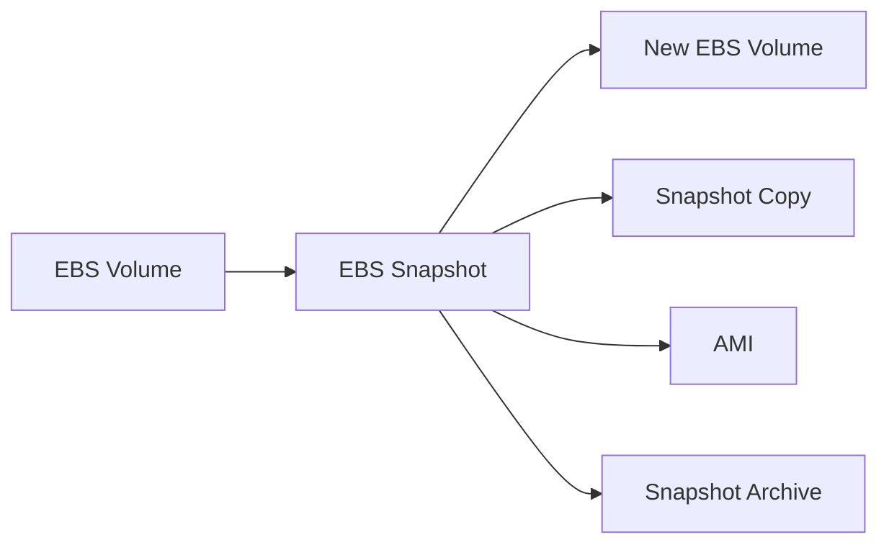
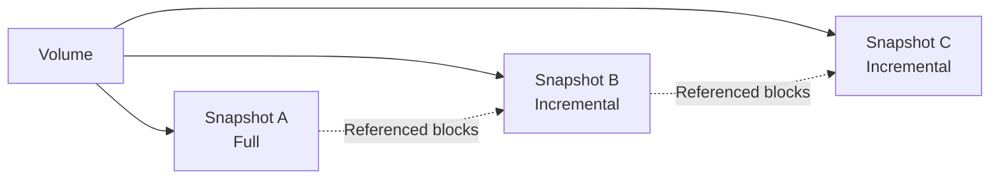
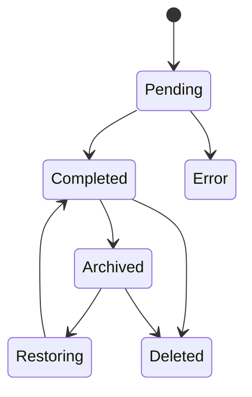
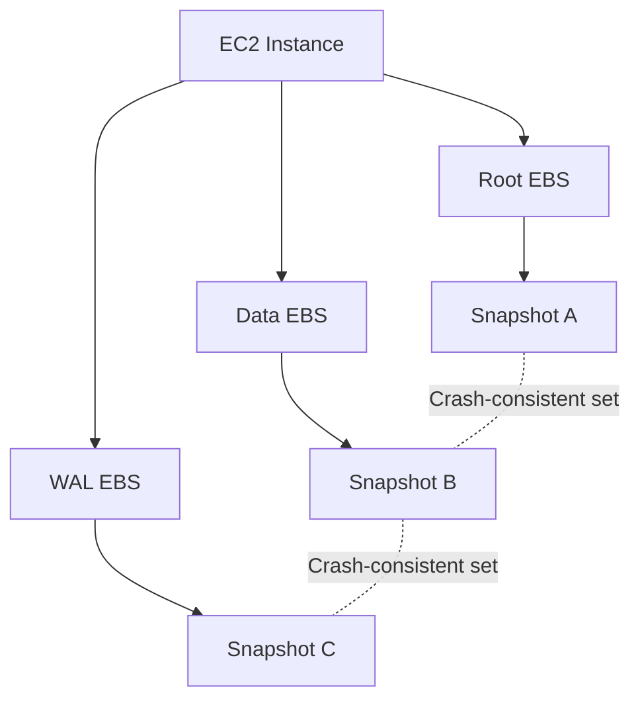
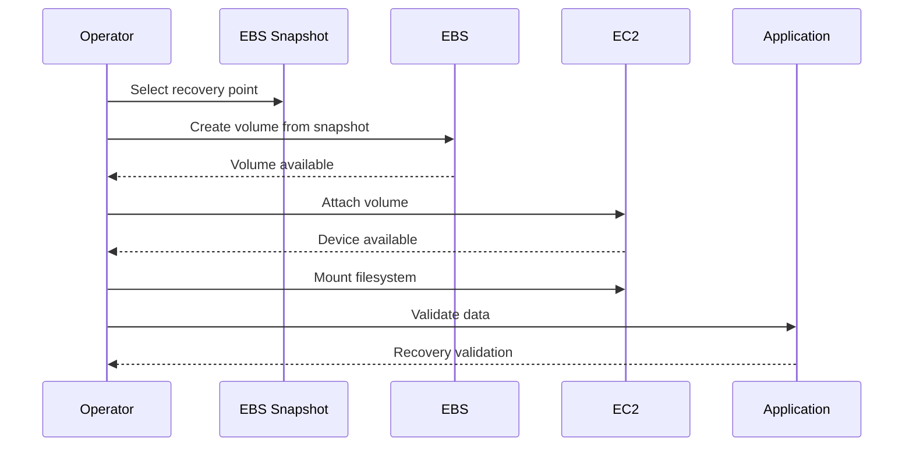
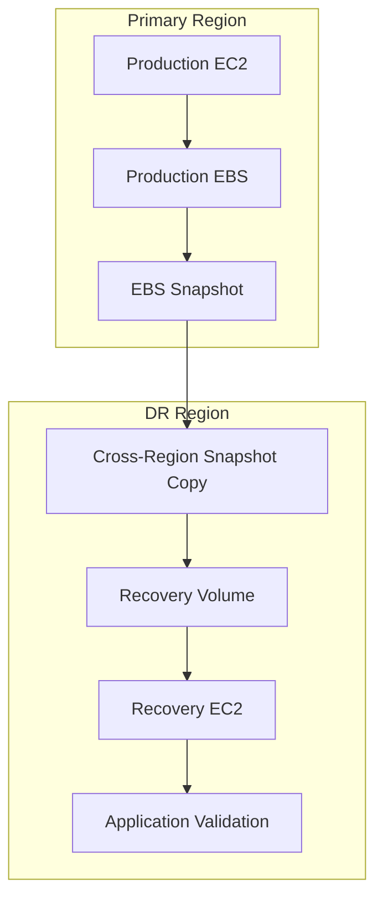

# 03- EBS Snapshots

## Overview

Amazon EBS snapshots provide point-in-time backups of EBS volumes. They are a core building block for backup, disaster recovery, volume migration, environment cloning, AMI workflows, and operational recovery.

An EBS snapshot is not simply a traditional full-disk copy. The first snapshot of a volume is full, while subsequent snapshots of the same volume are incremental and store only blocks that changed since the previous snapshot. AWS manages the underlying snapshot storage and stores snapshot data in Amazon S3 infrastructure that customers cannot access directly through the S3 console or S3 API. :contentReference[oaicite:0]{index=0}

The fundamental relationship is:



Snapshots are regional resources by default. A snapshot created from a Regional EBS volume is created in the same Region as that volume. Snapshot copies can be used to move backup data across Regions. :contentReference[oaicite:1]{index=1}

---

## Why EBS Snapshots Matter

An EC2 instance can be replaced, terminated, corrupted, or become unavailable. EBS provides persistent storage, but persistence alone is not the same as backup.

```text
EC2 Instance
     |
     v
EBS Volume
     |
     +---- Failure / Corruption / Operator Error
     |
     v
EBS Snapshot
     |
     v
Recovery Volume
     |
     v
Recovery EC2
```

Snapshots provide a mechanism to preserve a recoverable point in time independently from the running EC2 instance.

Typical uses include:

| Use Case | Snapshot Role |
|---|---|
| Backup | Preserve volume state |
| Disaster recovery | Restore storage after failure |
| EC2 replacement | Recreate persistent volumes |
| Environment cloning | Create test/staging volumes |
| AMI creation | Capture root/data volume state |
| Cross-Region DR | Copy snapshots to another Region |
| Long-term retention | Archive infrequently accessed snapshots |
| Pre-change protection | Capture a recovery point before risky changes |

AWS does not automatically back up EBS volumes. Backup creation must be implemented through snapshots, Amazon Data Lifecycle Manager, AWS Backup, or another appropriate backup process. :contentReference[oaicite:2]{index=2}

---

## How EBS Snapshots Work

The snapshot model is incremental.

```text
Volume
 |
 +-- Snapshot A
 |      Full snapshot
 |
 +-- Changes
 |
 +-- Snapshot B
 |      Changed blocks
 |
 +-- Changes
 |
 +-- Snapshot C
        Changed blocks
```

Suppose a 200 GiB volume contains 50 GiB of actual written data.

```text
Snapshot A
    |
    +-- 50 GiB written data
```

Later, 20 GiB is modified and 10 GiB is newly written:

```text
Snapshot B
    |
    +-- 30 GiB changed/new blocks
```

AWS determines snapshot storage based on the blocks stored for the snapshot rather than simply charging for the provisioned size of the source volume. :contentReference[oaicite:3]{index=3}

This means:

```text
EBS Volume Size
        !=
Snapshot Storage Size
```

A 1 TiB volume does not necessarily produce a 1 TiB snapshot.

---

## Snapshot Lineage

Snapshots from the same source volume form a logical lineage.



Although individual snapshots are incremental internally, each snapshot represents a complete point-in-time view when restored.

AWS manages the underlying block dependencies.

This has an important operational implication:

> Deleting an older snapshot does not necessarily remove all storage associated with that snapshot.

If blocks are still referenced by later snapshots, AWS retains the blocks required by those later snapshots. Therefore, deleting snapshots does not guarantee an equivalent reduction in billed snapshot storage. :contentReference[oaicite:4]{index=4}

---

## Snapshot Lifecycle

A typical snapshot lifecycle is:



A newly created snapshot initially enters the `pending` state.

Once the required data transfer has completed, it becomes `completed`.

AWS documents snapshot states including:

- `pending`
- `completed`
- `error`
- `recoverable`
- `recovering`

depending on the snapshot operation and lifecycle. :contentReference[oaicite:5]{index=5}

Snapshot creation is asynchronous.

```text
CreateSnapshot
      |
      v
Pending
      |
      | Data processing
      v
Completed
```

You can continue using the source volume while a snapshot is being created, but multiple concurrent pending snapshots can affect volume performance. :contentReference[oaicite:6]{index=6}

---

## Creating a Snapshot

Create a snapshot from an EBS volume:

```bash
aws ec2 create-snapshot \
    --volume-id vol-0123456789abcdef0 \
    --description "Production PostgreSQL backup"
```

Example with tags:

```bash
aws ec2 create-snapshot \
    --volume-id vol-0123456789abcdef0 \
    --description "Production PostgreSQL backup" \
    --tag-specifications \
    'ResourceType=snapshot,Tags=[{Key=Name,Value=postgresql-prod},{Key=Environment,Value=production},{Key=BackupType,Value=manual}]'
```

Inspect it:

```bash
aws ec2 describe-snapshots \
    --snapshot-ids snap-0123456789abcdef0
```

The snapshot creation API is asynchronous and the snapshot remains `pending` until processing completes. :contentReference[oaicite:7]{index=7}

---

## Snapshot Consistency

One of the most important production considerations is the difference between **crash consistency** and **application consistency**.

An EBS snapshot captures blocks that have been written to the volume at the time the snapshot is requested. It does not automatically understand application-level transactions or data cached by the operating system/application. AWS recommends pausing writes where possible and, when necessary, unmounting the volume before creating a snapshot. For root volumes, AWS recommends stopping the instance when practical. :contentReference[oaicite:8]{index=8}

Consider PostgreSQL:

```text
Application
    |
    v
PostgreSQL
    |
    v
Filesystem Cache
    |
    v
EBS
    |
    v
Snapshot
```

The snapshot system understands the EBS block layer, not PostgreSQL transaction semantics.

Therefore:

```text
Storage-consistent snapshot
        !=
Application-consistent database backup
```

For critical databases, combine EBS snapshots with database-aware backup procedures.

---

## Crash-Consistent Multi-Volume Snapshots

For applications using multiple EBS volumes, independently creating snapshots can produce different points in time.

For example:

```text
EC2
 |
 +-- Root Volume
 |
 +-- Data Volume
 |
 +-- WAL Volume
```

Taking individual snapshots independently can produce:

```text
Root  -> T1
Data  -> T2
WAL   -> T3
```

A multi-volume snapshot operation can instead create crash-consistent snapshots across the EBS volumes attached to an EC2 instance. AWS's `CreateSnapshots` API creates one snapshot per selected attached volume while maintaining crash consistency across the instance. :contentReference[oaicite:9]{index=9}

Example:

```bash
aws ec2 create-snapshots \
    --instance-specification InstanceId=i-0123456789abcdef0 \
    --description "Production multi-volume backup"
```

Conceptually:



Crash consistency is useful, but it still does not automatically make the result application-consistent.

---

## Database Backup Strategy

For PostgreSQL running on EC2, consider combining:

```text
PostgreSQL-native backup
        +
EBS snapshots
        +
Cross-Region recovery
```

Each protects against different failure modes.

For example:

```text
PostgreSQL
   |
   +-- pg_dump / WAL backup
   |
   +-- EBS snapshot
          |
          +-- Cross-Region copy
```

A database-native backup understands:

- Transactions
- WAL
- Recovery points
- Database objects
- Logical consistency

An EBS snapshot provides:

- Fast volume-level recovery
- Infrastructure-level rollback
- Full filesystem restoration

Neither should automatically be treated as a replacement for the other.

---

## Snapshot Encryption

A snapshot inherits the encryption status of its source volume.

```text
Encrypted EBS Volume
        |
        v
Encrypted EBS Snapshot
```

```text
Unencrypted EBS Volume
        |
        v
Unencrypted EBS Snapshot
```

AWS states that snapshots created from encrypted volumes are automatically encrypted using the same KMS key as the source volume. :contentReference[oaicite:10]{index=10}

If an encrypted snapshot must use a different KMS key, create an encrypted snapshot copy using the required key.

---

## Snapshot Copy

A snapshot can be copied to another Region.

This is an important building block for disaster recovery:


A cross-Region copy provides an independent recovery location.

Example:

```bash
aws ec2 copy-snapshot \
    --source-region us-east-1 \
    --source-snapshot-id snap-0123456789abcdef0 \
    --region us-west-2 \
    --description "DR copy of production snapshot"
```

Snapshot copies are separate snapshot resources in the destination Region.

This makes them useful for:

- Regional disaster recovery
- Data migration
- Environment creation
- Compliance-oriented geographic separation

---

## Cross-Region Disaster Recovery

A production DR architecture might look like:

```text
Primary Region
    |
    +-- EC2
    +-- EBS
    |
    v
EBS Snapshot
    |
    v
Cross-Region Snapshot Copy
    |
    v
DR Region
    |
    +-- New EBS Volume
    |
    +-- Recovery EC2
```

The snapshot itself is only one component.

A complete DR process also requires:

- Recovery EC2 configuration
- IAM roles
- Security groups
- Networking
- KMS keys
- Application configuration
- DNS strategy
- Database recovery
- Validation
- Automation

A snapshot without a tested restoration procedure is not a complete DR solution.

---

## Restoring a Volume from a Snapshot

Create a new EBS volume from a snapshot:

```bash
aws ec2 create-volume \
    --snapshot-id snap-0123456789abcdef0 \
    --availability-zone us-east-1a \
    --volume-type gp3
```

The new volume is created from the point-in-time state represented by the snapshot.

The recovery flow is:

```text
Snapshot
   |
   v
Create Volume
   |
   v
Attach to EC2
   |
   v
Detect Device
   |
   v
Mount Filesystem
   |
   v
Validate Application Data
```

The restored volume must be created in an Availability Zone compatible with the target EC2 instance.

---

## Snapshot Initialization

A volume restored from a snapshot may initially experience latency while blocks are fetched or initialized on first access.

For latency-sensitive workloads, Amazon EBS Fast Snapshot Restore (FSR) can create volumes that are fully initialized at creation and immediately deliver their provisioned performance. :contentReference[oaicite:11]{index=11}

Without FSR:

```text
Snapshot
   |
   v
New Volume
   |
   v
First access to block
   |
   v
Initialization / retrieval
   |
   v
Application I/O
```

With FSR:

```text
Snapshot
   |
   v
FSR-enabled restore
   |
   v
Fully initialized volume
   |
   v
Application
```

This can be important for:

- Large database volumes
- Rapid Auto Scaling
- Disaster recovery
- High-performance workloads
- Time-sensitive instance replacement

---

## Fast Snapshot Restore

FSR is enabled for a specific snapshot in a specific Availability Zone.

```text
Snapshot A
   |
   +-- FSR enabled: us-east-1a
   |
   +-- FSR enabled: us-east-1b
```

A snapshot being FSR-enabled in one Availability Zone does not automatically enable it in another.

AWS currently documents FSR as supporting snapshots up to 16 TiB and provides full performance benefits for volumes provisioned up to 64,000 IOPS and 1,000 MiB/s throughput; higher-performance volumes may require initialization for full performance. :contentReference[oaicite:12]{index=12}

FSR has additional cost and should therefore be reserved for workloads where rapid, predictable restoration justifies the expense.

---

## Fast Snapshot Restore CLI

Enable FSR:

```bash
aws ec2 enable-fast-snapshot-restores \
    --availability-zones us-east-1a \
    --source-snapshot-ids snap-0123456789abcdef0
```

Inspect FSR state:

```bash
aws ec2 describe-fast-snapshot-restores \
    --filters \
    Name=snapshot-id,Values=snap-0123456789abcdef0
```

Disable it when no longer required:

```bash
aws ec2 disable-fast-snapshot-restores \
    --availability-zones us-east-1a \
    --source-snapshot-ids snap-0123456789abcdef0
```

FSR billing is based on the snapshot/AZ combinations for which FSR is enabled, so enabling it across several Availability Zones can materially increase cost. :contentReference[oaicite:13]{index=13}

---

## Snapshot Archive

Amazon EBS Snapshots Archive provides a lower-cost storage tier for snapshots that are rarely accessed and intended for long-term retention.

```text
Standard Tier
     |
     | Archive
     v
Archive Tier
     |
     | Restore
     v
Standard Tier
```

When an incremental snapshot is archived, AWS converts it to a full snapshot before moving it to the archive tier. :contentReference[oaicite:14]{index=14}

Typical use cases include:

- Monthly backups
- Quarterly backups
- Yearly backups
- Compliance retention
- End-of-project snapshots

AWS recommends considering the archive tier for snapshots retained for 90 days or longer and rarely accessed. :contentReference[oaicite:15]{index=15}

---

## Snapshot Archive Trade-Offs

Archive storage is not appropriate for operational recovery that requires immediate access.

Important characteristics include:

| Characteristic | Standard Tier | Archive Tier |
|---|---|---|
| Normal operational use | Yes | No |
| Create volume directly | Yes | No |
| Fast Snapshot Restore | Supported | Disabled |
| Sharing | Supported where applicable | Not supported |
| Copy | Supported | Must restore first |
| Access latency | Normal | Restore required |
| Intended use | Active backups | Long-term retention |

AWS documents a minimum archive period of 90 days and notes that restoring an archived snapshot can take up to 72 hours depending on snapshot size. :contentReference[oaicite:16]{index=16}

Therefore:

```text
Hot / operational backup
        |
        v
Standard tier

Long-term / rarely accessed backup
        |
        v
Archive tier
```

---

## Restoring an Archived Snapshot

An archived snapshot must first be restored to the standard tier before it can be used to create an EBS volume.

```bash
aws ec2 restore-snapshot-tier \
    --snapshot-id snap-0123456789abcdef0
```

AWS supports both permanent and temporary restoration. A temporary restoration keeps the snapshot in the archive tier while making a restored copy available in the standard tier for a specified period. :contentReference[oaicite:17]{index=17}

This distinction matters for long-term retention:

```text
Archive
   |
   +-- Temporary restore
   |      |
   |      +-- Available for restore period
   |      +-- Automatically removed from standard tier
   |
   +-- Permanent restore
          |
          +-- Remains in standard tier
```

Do not archive a snapshot that your incident-response process expects to restore immediately.

---

## Snapshot Deletion

Delete a snapshot with:

```bash
aws ec2 delete-snapshot \
    --snapshot-id snap-0123456789abcdef0
```

Before deletion, verify:

- Snapshot ownership
- Environment
- Backup policy
- Retention requirements
- AMI dependencies
- DR dependencies
- Compliance requirements
- Snapshot lineage

Deleting a snapshot does not necessarily eliminate all underlying stored blocks because blocks can be referenced by other snapshots. :contentReference[oaicite:18]{index=18}

Therefore, do not estimate cost savings simply by counting deleted snapshot IDs.

---

## Snapshot Retention

A production retention policy should distinguish between operational recovery and long-term retention.

Example:

```text
Frequent
  |
  +-- Short-term snapshots
  |
  v
Standard Tier

Periodic
  |
  +-- Monthly snapshots
  |
  v
Standard / Archive

Long-term
  |
  +-- Quarterly / yearly snapshots
  |
  v
Archive Tier
```

A practical policy may use:

- Frequent short-term backups
- Daily retention for operational recovery
- Weekly or monthly retention for broader rollback
- Longer-term archive for compliance or historical recovery

The exact schedule should be derived from:

- RPO
- RTO
- Business requirements
- Regulatory requirements
- Storage cost
- Recovery frequency

---

## Data Lifecycle Manager

Amazon Data Lifecycle Manager can automate EBS snapshot creation and retention.

A typical workflow is:

```text
EC2 / EBS
    |
    v
Tags
    |
    v
Data Lifecycle Manager
    |
    +-- Snapshot Schedule
    |
    +-- Retention
    |
    +-- Lifecycle
```

Tag-based policies are particularly useful for fleets.

Example tagging model:

```text
Environment=production
Backup=true
Application=payments
BackupTier=critical
```

The backup system can then apply lifecycle policies consistently across resources.

Automation is preferable to relying on engineers to remember manual snapshot creation.

---

## AWS Backup

AWS Backup provides centralized backup management across supported AWS resources.

For larger environments, it can provide:

- Centralized backup policies
- Retention policies
- Backup vaults
- Cross-Region backup workflows
- Compliance-oriented controls
- Centralized monitoring

The important architectural distinction is:

```text
Manual snapshots
        |
        v
Operator-driven

Data Lifecycle Manager
        |
        v
EBS lifecycle automation

AWS Backup
        |
        v
Centralized backup governance
```

Choose the mechanism based on organizational backup requirements rather than treating all three as interchangeable.

---

## Snapshot Tags

Tag snapshots with enough metadata to identify ownership and purpose.

Example:

```text
Name=payments-prod-db
Environment=production
Application=payments
BackupType=scheduled
Retention=30d
Owner=platform
```

Tags help with:

- Ownership
- Cost allocation
- Automation
- Retention policies
- Incident response
- Cleanup
- Auditing

Avoid creating snapshots with descriptions such as:

```text
backup
```

Prefer metadata that remains useful months later.

---

## Snapshot Security

EBS snapshots can contain sensitive data.

A snapshot of a PostgreSQL volume can contain:

- User information
- Credentials stored in files
- Application data
- Logs
- Database records
- Configuration files

Treat snapshots as production data.

Important controls include:

- Encryption
- KMS key management
- IAM permissions
- Snapshot sharing controls
- Resource tags
- Retention policies
- Audit logging
- Public-access controls

Do not share snapshots casually across AWS accounts.

---

## Snapshot Sharing

Snapshot sharing allows authorized AWS accounts to access snapshots where supported.

Before sharing:

```text
Snapshot
   |
   +-- Contains sensitive data?
   |
   +-- Correct recipient account?
   |
   +-- Correct encryption/KMS permissions?
   |
   +-- Required by architecture?
```

Sharing should be explicit and controlled.

For encrypted snapshots using customer-managed KMS keys, the recipient must also have appropriate permissions to use the relevant KMS key.

Long-lived sharing relationships should be reviewed periodically.

---

## Snapshot Lock and Immutability

For environments with strong retention requirements, snapshot protection mechanisms can reduce the risk of accidental or malicious deletion.

The architectural goal is:

```text
Backup
   |
   v
Protected Retention
   |
   +-- Application compromise
   +-- Operator mistake
   +-- Accidental deletion
   |
   v
Recoverable Data
```

A backup strategy should consider not only infrastructure failure but also destructive operational events.

For high-value systems, evaluate mechanisms such as AWS Backup controls and EBS snapshot protection features against organizational recovery requirements.

---

## Snapshot and AMI Relationship

An EBS-backed AMI references EBS snapshots.

Conceptually:

```text
AMI
 |
 +-- Snapshot: Root
 |
 +-- Snapshot: Data
```

Therefore, snapshot lifecycle decisions can affect AMI lifecycle management.

Before deleting a snapshot, determine whether it is referenced by an AMI.

Useful investigation:

```bash
aws ec2 describe-images \
    --owners self \
    --query 'Images[].{ImageId:ImageId,Name:Name,State:State,BlockMappings:BlockDeviceMappings}'
```

Do not delete snapshots solely because the source EC2 instance no longer exists.

---

## Snapshot-Based Environment Cloning

Snapshots are useful for creating isolated environments.

Example:

```text
Production EBS
      |
      v
Snapshot
      |
      v
Development Volume
      |
      v
Development EC2
```

This can simplify:

- Reproducing production issues
- Performance testing
- Migration testing
- Disaster-recovery testing

However, production data copied into non-production environments introduces security and privacy concerns.

Before using production snapshots in development:

- Restrict access
- Encrypt appropriately
- Consider data masking
- Remove unnecessary credentials
- Review compliance requirements
- Use isolated accounts where appropriate

---

## Snapshot-Based Recovery Workflow

A practical EC2 recovery workflow is:



A production recovery runbook should explicitly define:

1. Which snapshot to use.
2. How to identify the correct Region.
3. Which Availability Zone to use.
4. Which volume type to restore.
5. Which KMS key is required.
6. How to attach the volume.
7. How to mount the filesystem.
8. How to validate application data.
9. How to reconfigure the application.
10. How to switch traffic back to the recovered system.

---

## Snapshot Recovery Testing

Backup validation should be automated or regularly exercised.

A useful test is:

```text
Scheduled Snapshot
       |
       v
Create Recovery Volume
       |
       v
Attach to Test EC2
       |
       v
Mount
       |
       v
Validate Files / Database
       |
       v
Record Result
       |
       v
Destroy Test Resources
```

For databases, validate more than filesystem readability.

For PostgreSQL, for example:

```text
Volume restored
      |
      v
PostgreSQL starts
      |
      v
Database opens
      |
      v
Expected schemas exist
      |
      v
Sample queries succeed
      |
      v
Application connectivity succeeds
```

A backup process without restore testing can silently fail until the first real incident.

---

## Performance Considerations

Snapshot creation is asynchronous, so creating a snapshot does not mean the backup has immediately finished.

Monitor:

```bash
aws ec2 describe-snapshots \
    --snapshot-ids snap-0123456789abcdef0 \
    --query 'Snapshots[0].{ID:SnapshotId,State:State,Progress:Progress,StartTime:StartTime}' \
    --output table
```

Example state:

```text
State      Progress
---------  --------
pending    47%
```

Repeatedly creating snapshots while earlier snapshots remain pending can reduce volume performance. AWS explicitly warns that multiple pending snapshots for the same volume can result in reduced performance until they complete. :contentReference[oaicite:19]{index=19}

Avoid creating excessive manual snapshots during peak application load.

---

## Cost Optimization

Snapshot storage is based on stored snapshot data rather than simply the provisioned size of the source volume.

Cost optimization strategies include:

- Delete obsolete snapshots
- Apply retention policies automatically
- Avoid redundant manual snapshots
- Archive rarely accessed long-term snapshots
- Review cross-Region copies
- Remove unused recovery artifacts
- Use tags for ownership and lifecycle automation

A subtle point is that incremental snapshots share underlying block storage.

```text
Snapshot A
    |
    +-- Blocks A
    |
Snapshot B
    |
    +-- Blocks B
    |
Snapshot C
    |
    +-- Blocks C
```

Deleting Snapshot B does not necessarily remove all blocks associated with B if those blocks are still referenced elsewhere. :contentReference[oaicite:20]{index=20}

---

## Disaster Recovery Design

For critical EC2 workloads, a snapshot-based DR architecture can look like:



Snapshots help with storage recovery, but a real DR design must also handle:

- Compute
- Networking
- IAM
- Security groups
- KMS
- DNS
- Application configuration
- Database recovery
- Secrets
- Observability
- Traffic switching

The recovery process should be documented and tested against the defined RTO.

---

## Recovery Point Objective and Recovery Time Objective

Snapshots directly influence RPO and RTO.

### RPO

Recovery Point Objective answers:

> How much data can the business afford to lose?

If snapshots are created every hour:

```text
Maximum snapshot-based RPO ≈ 1 hour
```

Actual recoverability depends on the backup workflow and application consistency.

### RTO

Recovery Time Objective answers:

> How quickly must the service be restored?

Without FSR:

```text
Snapshot
  |
  v
Create volume
  |
  v
Initialization
  |
  v
Application startup
```

With FSR:

```text
Snapshot
  |
  v
Fast restore
  |
  v
Application startup
```

FSR can therefore be useful where rapid volume restoration is part of the RTO requirement. :contentReference[oaicite:21]{index=21}

---

## Snapshot Operations with AWS CLI

### List snapshots

```bash
aws ec2 describe-snapshots \
    --owner-ids self \
    --output table
```

### Find snapshots for a volume

```bash
aws ec2 describe-snapshots \
    --filters Name=volume-id,Values=vol-0123456789abcdef0 \
    --query 'Snapshots[].{ID:SnapshotId,State:State,Start:StartTime,Size:VolumeSize}' \
    --output table
```

### Find completed snapshots

```bash
aws ec2 describe-snapshots \
    --owner-ids self \
    --filters Name=status,Values=completed \
    --query 'Snapshots[].{ID:SnapshotId,Volume:VolumeId,Size:VolumeSize,Start:StartTime}' \
    --output table
```

### Delete a snapshot

```bash
aws ec2 delete-snapshot \
    --snapshot-id snap-0123456789abcdef0
```

### Copy a snapshot

```bash
aws ec2 copy-snapshot \
    --source-region us-east-1 \
    --source-snapshot-id snap-0123456789abcdef0 \
    --region us-west-2 \
    --description "Cross-Region DR snapshot"
```

### Create a volume from a snapshot

```bash
aws ec2 create-volume \
    --snapshot-id snap-0123456789abcdef0 \
    --availability-zone us-east-1a \
    --volume-type gp3
```

---

## Safe Snapshot Workflow

For a production volume:

```text
Identify Volume
      |
      v
Verify Application State
      |
      v
Establish Consistency
      |
      v
Create Snapshot
      |
      v
Wait for Completion
      |
      v
Tag Snapshot
      |
      v
Verify Backup
      |
      v
Apply Retention
```

For a critical database:

```text
Database-aware backup
        +
EBS snapshot
        +
Cross-Region copy
        +
Restore validation
```

This provides stronger recovery coverage than relying on a single storage snapshot.

---

## Common Mistakes

### Treating Every Snapshot as a Full Independent Copy

Subsequent snapshots are incremental.

**Avoid it:** understand snapshot lineage and shared block storage before estimating storage costs or deletion effects. :contentReference[oaicite:22]{index=22}

### Assuming Snapshot Creation Means Backup Completion

Snapshot creation is asynchronous.

**Avoid it:** verify the snapshot reaches `completed` and monitor failures. :contentReference[oaicite:23]{index=23}

### Assuming EBS Snapshots Are Application-Consistent

A snapshot does not understand database transactions or application caches.

**Avoid it:** coordinate database/application consistency requirements with snapshot creation.

### Taking Independent Snapshots of Multi-Volume Applications

Different volumes can represent different points in time.

**Avoid it:** use crash-consistent multi-volume snapshots where appropriate, and still apply application-level consistency procedures. :contentReference[oaicite:24]{index=24}

### Archiving Operational Backups

Archived snapshots require restoration before they can be used.

**Avoid it:** keep frequently needed recovery points in the standard tier. :contentReference[oaicite:25]{index=25}

### Enabling FSR Everywhere

FSR has additional cost and is configured per snapshot/AZ combination.

**Avoid it:** enable FSR only for workloads with a meaningful low-latency recovery requirement. :contentReference[oaicite:26]{index=26}

### Deleting Snapshots Without Checking Dependencies

A snapshot may be associated with an AMI or required by a retention/DR policy.

**Avoid it:** inspect AMIs, tags, ownership, and retention rules before deletion.

### Using Production Snapshots in Development Without Controls

Snapshots can contain sensitive production data.

**Avoid it:** apply encryption, access controls, data masking, and environment isolation.

### Assuming Snapshots Alone Provide Disaster Recovery

A storage backup does not recreate the entire application environment.

**Avoid it:** automate and test compute, network, IAM, KMS, configuration, and traffic recovery.

---

## Production Best Practices

### Automate Snapshot Creation

Use:

- Amazon Data Lifecycle Manager
- AWS Backup
- Infrastructure automation

Avoid relying on manual snapshots for recurring production backups.

### Tag Everything

Use consistent metadata for:

- Environment
- Application
- Owner
- Backup class
- Retention
- Criticality

### Encrypt Backups

Use encrypted EBS volumes and snapshots for production data, with KMS policies managed according to organizational requirements.

### Separate Operational and Long-Term Retention

Use:

```text
Standard Tier
    |
    +-- Frequently accessed recovery points

Archive Tier
    |
    +-- Long-term, rarely accessed snapshots
```

### Test Recovery

Regularly verify that snapshots can produce:

- A usable EBS volume
- A bootable or mountable filesystem
- A functioning database where applicable
- A working application environment

### Monitor Snapshot Failures

A backup system should generate alerts for:

- Snapshot creation failures
- Copy failures
- Backup policy failures
- Unexpected retention changes
- KMS permission problems
- Recovery-test failures

### Treat Snapshots as Sensitive Data

Apply the same security expectations to snapshots as to the original production volume.

---

## Advanced: EBS Direct APIs

EBS Direct APIs expose block-level operations against EBS snapshots.

They can:

- Create snapshots
- Read snapshot blocks
- Write snapshot blocks
- Identify changed blocks between snapshots

The `ListChangedBlocks` operation can identify differences between snapshots in the same lineage, while `GetSnapshotBlock` can retrieve individual blocks. :contentReference[oaicite:27]{index=27}

This is primarily useful for specialized backup, migration, and disaster-recovery products rather than ordinary EC2 administration.

A conceptual workflow is:

```text
Snapshot A
    |
    +----------------+
                     |
                     v
              Compare Blocks
                     ^
                     |
    +----------------+
    |
Snapshot B
```

For normal backend infrastructure, use standard EBS snapshot APIs unless there is a specific requirement for block-level snapshot access.

---

## Operational Checklist

```text
[ ] Snapshot policy defined
[ ] RPO documented
[ ] RTO documented
[ ] Snapshot encryption enabled
[ ] KMS permissions validated
[ ] Snapshot tags standardized
[ ] Retention policy automated
[ ] Application consistency requirements documented
[ ] Multi-volume consistency requirements evaluated
[ ] Cross-Region copies configured where required
[ ] Snapshot failures monitored
[ ] Restore procedure documented
[ ] Recovery testing performed
[ ] FSR evaluated for time-sensitive recovery
[ ] Archive tier evaluated for long-term retention
[ ] Snapshot dependencies checked before deletion
[ ] Production snapshot access restricted
[ ] Backup costs reviewed regularly
```

## Interview Considerations

### Are EBS snapshots full or incremental?

The first snapshot of a volume is full. Subsequent snapshots are incremental and store only blocks changed since the previous snapshot. :contentReference[oaicite:28]{index=28}

### Where are EBS snapshots stored?

AWS manages snapshot storage in Amazon S3 infrastructure, but customers cannot access the underlying snapshot data through the S3 console or S3 API. :contentReference[oaicite:29]{index=29}

### Does deleting an old snapshot delete all of its data?

Not necessarily. Blocks referenced by later snapshots remain stored, so deleting one snapshot may not reduce storage costs by an equivalent amount. :contentReference[oaicite:30]{index=30}

### Are EBS snapshots application-consistent?

Not automatically. They capture written block state, but they do not understand application transaction semantics. Application-aware procedures may be required for databases. :contentReference[oaicite:31]{index=31}

### How do you snapshot multiple EBS volumes consistently?

Use the EC2 multi-volume `CreateSnapshots` operation for crash-consistent snapshots across selected volumes, then apply application-specific consistency procedures where required. :contentReference[oaicite:32]{index=32}

### What is Fast Snapshot Restore?

FSR allows volumes created from an enabled snapshot in a configured Availability Zone to be fully initialized at creation, eliminating the normal first-access initialization latency. :contentReference[oaicite:33]{index=33}

### When should you use EBS Snapshot Archive?

Use it for snapshots that are rarely accessed and intended for long-term retention. Archived snapshots must be restored to the standard tier before they can be used, and the archive tier has a minimum 90-day storage period. :contentReference[oaicite:34]{index=34}

### Can an archived snapshot be used directly to create a volume?

No. It must first be restored to the standard tier. :contentReference[oaicite:35]{index=35}

### Can snapshots be copied across Regions?

Yes. Snapshot copies can be created in another Region and are commonly used for cross-Region disaster recovery.

### Are EBS snapshots automatically created?

No. AWS does not automatically back up EBS volumes. You must configure snapshots or an appropriate backup service such as Data Lifecycle Manager or AWS Backup. :contentReference[oaicite:36]{index=36}

## Key Takeaways

- EBS snapshots provide point-in-time recovery for EBS volumes, with the first snapshot being full and subsequent snapshots using incremental block storage.
- Snapshot consistency is a critical production concern: storage-level snapshots do not automatically provide application-consistent database backups.
- Cross-Region copies, restore testing, retention automation, encryption, and documented recovery procedures are essential components of a production backup strategy.
- Fast Snapshot Restore is useful for workloads requiring rapid, predictable volume initialization, while Snapshot Archive is intended for rarely accessed long-term retention.
- Treat snapshots as production data: secure them, tag them, monitor them, control retention, and verify recovery rather than assuming that successful snapshot creation guarantees recoverability.