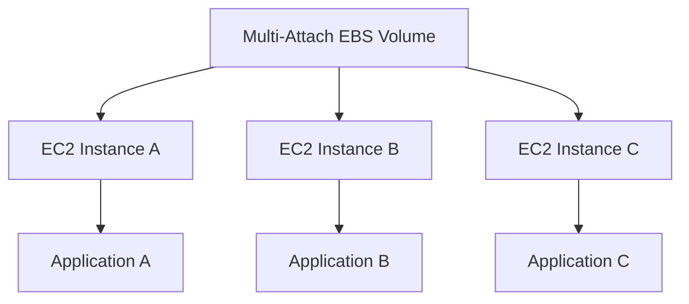
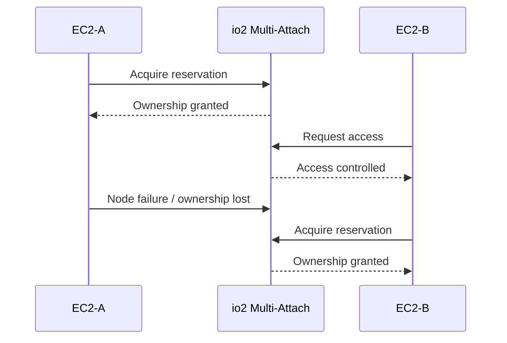
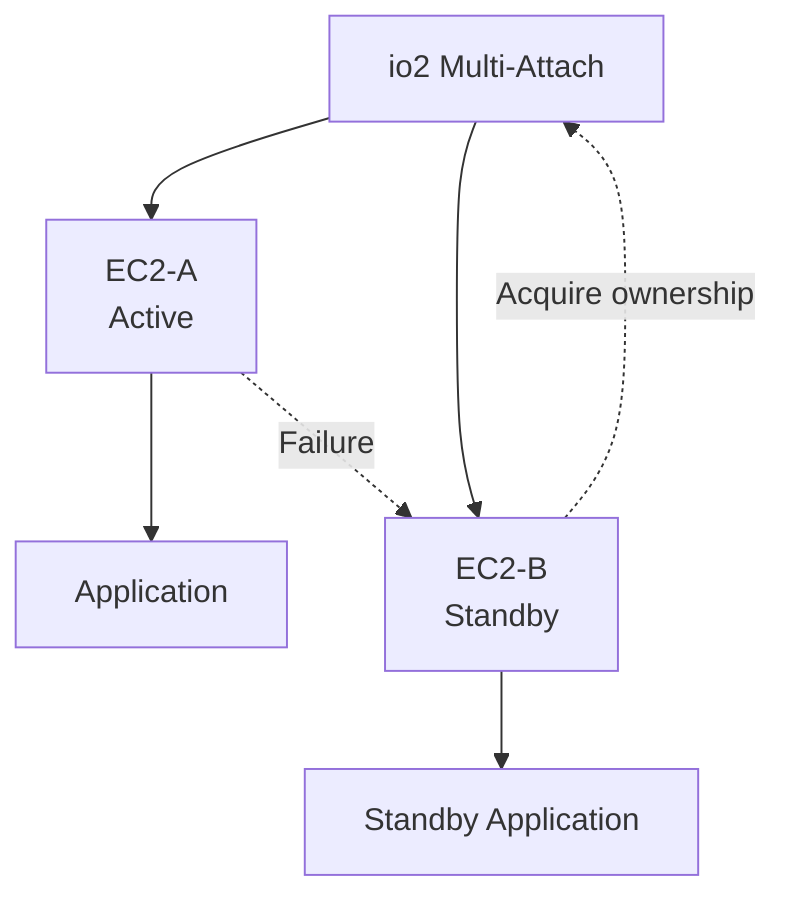

# 04- EBS Multi-Attach

## Overview

Amazon EBS Multi-Attach allows a single Provisioned IOPS SSD (`io1` or `io2`) volume to be attached to multiple EC2 instances simultaneously. The attached instances have read/write access to the shared block device. Multi-Attach is designed for specialized applications that understand concurrent access to shared block storage and need availability or coordination characteristics that ordinary single-instance EBS attachment does not provide. ([docs.aws.amazon.com](https://docs.aws.amazon.com/ebs/latest/userguide/ebs-volumes-multi.html?utm_source=chatgpt.com))

The basic architecture is:



The critical engineering distinction is:

> Multi-Attach provides shared block-device access; it does not automatically provide a shared filesystem, distributed locking, or application-level consistency.

Standard filesystems such as ext4 and XFS are not designed for simultaneous read/write access from multiple independent servers. Production workloads requiring concurrent access need an appropriate clustered filesystem or an application architecture that explicitly coordinates access. ([docs.aws.amazon.com](https://docs.aws.amazon.com/en_en/ebs/latest/userguide/ebs-volumes-multi.html?utm_source=chatgpt.com))

---

## Why Multi-Attach Exists

A normal EBS volume has a single-instance attachment model:

```text
EBS Volume
    |
    v
EC2-A
```

If EC2-A fails, another instance cannot simply use the same volume concurrently.

Multi-Attach changes the storage topology:

```text
             +-- EC2-A
             |
EBS Volume --+-- EC2-B
             |
             +-- EC2-C
```

This can be useful for applications that implement their own shared-storage coordination.

Typical scenarios include:

- Clustered applications
- Shared block-storage applications
- Specialized high-availability systems
- Cluster-aware filesystems
- Applications using storage fencing
- Certain distributed database architectures

Multi-Attach should not be introduced merely because an application has multiple EC2 instances.

For ordinary web applications, alternatives such as:

- Amazon S3
- Amazon EFS
- Amazon RDS/Aurora
- DynamoDB
- Redis
- Application-level replication

are often more appropriate depending on the data model.

---

## Supported Volume Types

Multi-Attach is supported exclusively for Provisioned IOPS SSD volumes:

- `io1`
- `io2`

It is not supported for:

- `gp2`
- `gp3`
- `st1`
- `sc1`
- `standard`

AWS recommends `io2` for new Multi-Attach designs because of its performance, consistency, and durability characteristics. ([docs.aws.amazon.com](https://docs.aws.amazon.com/ebs/latest/userguide/ebs-volumes-multi.html?utm_source=chatgpt.com))

| Capability | `io1` Multi-Attach | `io2` Multi-Attach |
|---|---:|---:|
| Multi-Attach | Yes | Yes |
| Nitro instances | Supported with documented restrictions | Yes |
| Linux | Yes | Yes |
| Windows | No | Yes |
| Same-AZ requirement | Yes | Yes |
| Maximum attached Nitro instances | 16 | 16 |
| NVMe reservations | No | Yes |
| Enable after creation | No | Yes, when unattached |
| Disable after creation | No | Yes, when conditions are met |
| New-design preference | Legacy/specialized | Preferred |

Current AWS documentation states that Multi-Attach volumes can be attached to up to 16 Nitro-based instances in the same Availability Zone. Linux supports `io1` and `io2`; Windows supports `io2`. ([docs.aws.amazon.com](https://docs.aws.amazon.com/ebs/latest/userguide/ebs-volumes-multi.html?utm_source=chatgpt.com))

---

## Availability Zone Requirement

All instances attached to a Multi-Attach volume must be in the same Availability Zone as the volume.

```text
Region
 |
 +-- us-east-1a
 |     |
 |     +-- EBS Multi-Attach
 |     +-- EC2-A
 |     +-- EC2-B
 |     +-- EC2-C
 |
 +-- us-east-1b
       |
       +-- EC2-D
```

The following architecture is not supported:

```text
EBS Volume: us-east-1a

       |
       +-- EC2-A: us-east-1a   ✓
       |
       +-- EC2-B: us-east-1b   ✗
```

AWS EBS volumes are Availability Zone-specific, and Multi-Attach does not remove this fundamental placement constraint. ([docs.aws.amazon.com](https://docs.aws.amazon.com/ebs/latest/userguide/ebs-volumes-multi.html?utm_source=chatgpt.com))

This is an important distinction from services designed for regional or multi-AZ data access.

---

## Multi-Attach Is Not a Shared Filesystem

This is the most common conceptual mistake.

Consider:

```text
             +-- EC2-A -- ext4
             |
EBS Volume --+
             |
             +-- EC2-B -- ext4
```

Both instances may see the same block device, but the two independent filesystem instances do not coordinate metadata updates.

This can cause:

- Filesystem corruption
- Metadata corruption
- Lost writes
- Stale caches
- Inconsistent directory structures
- Data corruption

AWS explicitly warns that standard filesystems such as XFS and ext4 are not designed for simultaneous access by multiple servers. A clustered filesystem is required for shared filesystem semantics. ([docs.aws.amazon.com](https://docs.aws.amazon.com/en_en/ebs/latest/userguide/ebs-volumes-multi.html?utm_source=chatgpt.com))

The distinction is:

```text
Multi-Attach
    |
    v
Shared block device
```

versus:

```text
Shared filesystem
    |
    v
Coordinated filesystem semantics
```

These are different layers.

---

## Block Storage vs Filesystem

The storage stack can be visualized as:

```text
Application
    |
    v
Filesystem
    |
    v
Block Device
    |
    v
EBS
```

Multi-Attach operates at the block-storage layer:

```text
                +-- Filesystem A
                |
EBS Block ------+
                |
                +-- Filesystem B
```

The filesystem and application are responsible for safely interpreting concurrent block access.

This is why Multi-Attach should only be used when the software stack has been designed for it.

---

## Concurrent Read and Write Access

Each attached instance receives read/write access to the Multi-Attach volume. ([docs.aws.amazon.com](https://docs.aws.amazon.com/ebs/latest/userguide/ebs-volumes-multi.html?utm_source=chatgpt.com))

Conceptually:

```text
EC2-A
  |
  +-- WRITE block 100
  |
  v
EBS Volume
  ^
  |
  +-- READ block 100
  |
EC2-B
```

Without coordination, concurrent writes can create application-level inconsistency.

For example:

```text
EC2-A:
    WRITE X = 100

EC2-B:
    WRITE X = 200

Result:
    Depends on ordering and application semantics
```

Multi-Attach does not automatically provide distributed transaction semantics.

---

## Data Consistency

A production Multi-Attach architecture needs an explicit consistency model.

Possible mechanisms include:

- Application-level locking
- Distributed coordination
- Clustered filesystems
- Storage fencing
- Leader election
- Database locking
- NVMe reservations
- Application-specific write ordering

The architecture should define:

```text
Who may write?
When may they write?
Who owns a resource?
What happens when a node fails?
How is stale ownership removed?
How are writes ordered?
```

If these questions cannot be answered clearly, Multi-Attach is probably not the correct storage primitive.

---

## I/O Fencing

`io2` Multi-Attach supports NVMe reservations, which provide storage fencing mechanisms for coordinating access to shared storage. ([docs.aws.amazon.com](https://docs.aws.amazon.com/ebs/latest/userguide/nvme-reservations.html?utm_source=chatgpt.com))

The purpose is to prevent an unhealthy or stale node from continuing to access shared storage when another node has taken ownership.

Conceptually:



The exact reservation behavior depends on the supported NVMe reservation implementation and operating system.

---

## NVMe Reservations

NVMe reservations are supported with Multi-Attach-enabled `io2` volumes. They are industry-standard storage fencing protocols that help coordinate access from multiple instances. ([docs.aws.amazon.com](https://docs.aws.amazon.com/ebs/latest/userguide/nvme-reservations.html?utm_source=chatgpt.com))

The conceptual model is:

```text
Shared io2 Volume
       |
       v
Reservation State
       |
       +-- Node A owns access
       |
       +-- Node B waits
       |
       +-- Node A fails
       |
       +-- Node B takes ownership
```

This is particularly relevant to clustered applications where a node must be prevented from writing after it has lost leadership.

NVMe reservations are not available for Multi-Attach `io1` volumes. ([docs.aws.amazon.com](https://docs.aws.amazon.com/ebs/latest/userguide/nvme-reservations.html?utm_source=chatgpt.com))

---

## Multi-Attach Architecture Patterns

### Active/Passive Cluster

One node owns the shared storage at a time.



This is often easier to reason about than unrestricted concurrent writes.

The standby node can take ownership when the active node fails.

### Active/Active Cluster

Multiple nodes actively process workloads against shared storage.

```text
             +-- EC2-A --+
             |            |
             +-- EC2-B --+-- Shared io2
             |            |
             +-- EC2-C --+
```

This requires substantially stronger coordination.

The application or filesystem must correctly handle:

- Concurrent writes
- Locking
- Cache coherency
- Failure detection
- Fencing
- Recovery
- Write ordering

Active/active should therefore be treated as a specialized architecture, not the default Multi-Attach pattern.

---

## Multi-Attach and High Availability

Multi-Attach can improve availability for applications designed around shared block storage.

Without Multi-Attach:

```text
Application
    |
    v
EC2-A
    |
    v
EBS
```

With Multi-Attach:

```text
             +-- EC2-A
             |
Application -+-- EC2-B
             |
             +-- EC2-C
                   |
                   v
              Shared EBS
```

However, Multi-Attach does not eliminate every failure domain.

If the EBS infrastructure layer has a problem affecting the shared volume, all attached instances can lose access to that volume. AWS explicitly notes that infrastructure-level issues can make a Multi-Attach volume unavailable to all attached instances, while EC2 or networking failures may affect only some attached instances. ([docs.aws.amazon.com](https://docs.aws.amazon.com/en_en/ebs/latest/userguide/ebs-volumes-multi.html?utm_source=chatgpt.com))

Therefore:

```text
Multi-Attach
    !=
No single point of failure
```

---

## Multi-Attach and Availability Zones

Multi-Attach provides multiple compute nodes within one Availability Zone, not cross-AZ storage replication.

```text
Availability Zone A

    Shared EBS
       |
       +-- EC2-A
       +-- EC2-B
       +-- EC2-C
```

It does not provide:

```text
AZ-A Shared EBS
       |
       +------------------+
                          |
                          v
                       AZ-B
```

For cross-AZ resilience, consider architectures based on:

- Database replication
- Synchronous/asynchronous application replication
- Regional services
- EFS where appropriate
- S3
- Managed databases
- Cross-Region backup and recovery

---

## Multi-Attach Performance

A Multi-Attach volume has one aggregate performance ceiling.

Suppose:

```text
io2
80,000 provisioned IOPS
```

and:

```text
EC2-A -> 30,000 IOPS
EC2-B -> 30,000 IOPS
EC2-C -> 30,000 IOPS
```

The combined demand cannot exceed the volume's provisioned 80,000 IOPS.

Conceptually:

```text
EC2-A 30k
     \
EC2-B 30k ----> io2 80k IOPS
     /
EC2-C 30k

Demand = 90k
Effective volume ceiling = 80k
```

AWS explicitly states that aggregate performance across attached instances cannot exceed the volume's provisioned performance. ([docs.aws.amazon.com](https://docs.aws.amazon.com/ebs/latest/userguide/ebs-multi-attach-perf.html?utm_source=chatgpt.com))

---

## Instance and Volume Limits

The effective performance is bounded by both the volume and the attached instances.

```text
Volume IOPS
     +
Instance EBS IOPS
     |
     v
Effective Performance
```

For example:

```text
Volume = 80,000 IOPS

EC2-A = 40,000 IOPS
EC2-B = 60,000 IOPS
```

Each instance can potentially drive its instance-level maximum, but their aggregate demand cannot exceed the volume's 80,000 IOPS. ([docs.aws.amazon.com](https://docs.aws.amazon.com/ebs/latest/userguide/ebs-multi-attach-perf.html?utm_source=chatgpt.com))

AWS also notes that EBS performance is bounded by the lower of instance performance limits and the aggregate performance of attached volumes. ([docs.aws.amazon.com](https://docs.aws.amazon.com/ec2/latest/instancetypes/gp.html?utm_source=chatgpt.com))

---

## I/O Distribution

AWS recommends balancing I/O driven by attached instances across the sectors of a Multi-Attach volume for consistent performance. ([docs.aws.amazon.com](https://docs.aws.amazon.com/ebs/latest/userguide/ebs-multi-attach-perf.html?utm_source=chatgpt.com))

A poorly distributed workload may look like:

```text
Volume
+----------------------------------+
| Hot region | Cold | Cold | Cold |
+----------------------------------+
       ^
       |
   EC2-A heavy I/O
```

A better workload distribution is:

```text
Volume
+----------------------------------+
| Active | Active | Active | Active|
+----------------------------------+
   ^         ^        ^       ^
   |         |        |       |
 EC2-A     EC2-B    EC2-C   EC2-D
```

The actual distribution strategy depends on the application.

---

## Enabling Multi-Attach

Multi-Attach is disabled by default when creating a volume.

For `io2`, it can be enabled when creating the volume or later when the volume is not attached to any instances. `io1` Multi-Attach must be configured at creation and cannot be enabled later. ([docs.aws.amazon.com](https://docs.aws.amazon.com/ebs/latest/userguide/working-with-multi-attach.html?utm_source=chatgpt.com))

Create an `io2` Multi-Attach volume:

```bash
aws ec2 create-volume \
    --availability-zone us-east-1a \
    --volume-type io2 \
    --size 100 \
    --iops 10000 \
    --multi-attach-enabled \
    --tag-specifications \
    'ResourceType=volume,Tags=[{Key=Name,Value=shared-cluster-storage}]'
```

Inspect the volume:

```bash
aws ec2 describe-volumes \
    --volume-ids vol-0123456789abcdef0 \
    --query 'Volumes[0].{ID:VolumeId,Type:VolumeType,MultiAttach:MultiAttachEnabled,AZ:AvailabilityZone,State:State}' \
    --output table
```

---

## Attaching a Multi-Attach Volume

Once Multi-Attach is enabled, attach the volume to instances in the same Availability Zone.

```bash
aws ec2 attach-volume \
    --volume-id vol-0123456789abcdef0 \
    --instance-id i-0123456789abcdef0 \
    --device /dev/sdf
```

Attach to another instance:

```bash
aws ec2 attach-volume \
    --volume-id vol-0123456789abcdef0 \
    --instance-id i-0123456789abcdef1 \
    --device /dev/sdf
```

Verify attachments:

```bash
aws ec2 describe-volumes \
    --volume-ids vol-0123456789abcdef0 \
    --query 'Volumes[0].Attachments[].{Instance:InstanceId,Device:Device,State:State}' \
    --output table
```

The operating system may expose the device using a different device name, particularly on Nitro-based instances. Always inspect the actual device using OS-level tools.

---

## Enabling Multi-Attach After Creation

For `io2`, Multi-Attach can be enabled after creation when the volume is not attached.

```bash
aws ec2 modify-volume \
    --volume-id vol-0123456789abcdef0 \
    --multi-attach-enabled
```

The volume must not be attached when enabling the feature after creation. AWS does not support enabling Multi-Attach after creation for `io1`. ([docs.aws.amazon.com](https://docs.aws.amazon.com/ebs/latest/userguide/working-with-multi-attach.html?utm_source=chatgpt.com))

---

## Disabling Multi-Attach

For `io2`, Multi-Attach can be disabled when the volume is attached to no more than one instance. AWS does not support disabling Multi-Attach after creation for `io1`. ([docs.aws.amazon.com](https://docs.aws.amazon.com/ebs/latest/userguide/disable-multi-attach.html?utm_source=chatgpt.com))

Example:

```bash
aws ec2 modify-volume \
    --volume-id vol-0123456789abcdef0 \
    --no-multi-attach-enabled
```

Before disabling:

```bash
aws ec2 describe-volumes \
    --volume-ids vol-0123456789abcdef0 \
    --query 'Volumes[0].Attachments[].InstanceId'
```

Do not disable the feature until the application has safely transitioned away from shared access.

---

## Boot Volumes

Multi-Attach-enabled volumes cannot be used as boot volumes. ([docs.aws.amazon.com](https://docs.aws.amazon.com/en_en/ebs/latest/userguide/ebs-volumes-multi.html?utm_source=chatgpt.com))

A common architecture is therefore:

```text
EC2-A
 |
 +-- Root EBS
 |
 +-- Shared io2 Multi-Attach
```

```text
EC2-B
 |
 +-- Root EBS
 |
 +-- Shared io2 Multi-Attach
```

Each instance has its own operating-system volume while the specialized shared storage is provided through a separate Multi-Attach volume.

---

## Delete on Termination

Multi-Attach introduces an important lifecycle consideration.

If the last attached instance terminates and its block-device mapping has `DeleteOnTermination=true`, the Multi-Attach volume can be deleted. If attached instances have different `DeleteOnTermination` settings, the last attached instance's setting determines the behavior. ([docs.aws.amazon.com](https://docs.aws.amazon.com/en_en/ebs/latest/userguide/ebs-volumes-multi.html?utm_source=chatgpt.com))

For shared production storage:

```text
EC2-A ----\
EC2-B -----+---- Shared EBS
EC2-C ----/
```

Make the deletion behavior intentional across all instances.

Inspect it:

```bash
aws ec2 describe-instances \
    --instance-ids i-0123456789abcdef0 i-0123456789abcdef1 \
    --query 'Reservations[].Instances[].{Instance:InstanceId,BlockDevices:BlockDeviceMappings}' \
    --output json
```

For critical shared data, explicitly protect the volume lifecycle rather than relying on instance termination behavior.

---

## Modification Constraints

Multi-Attach has additional modification constraints.

For current supported configurations:

| Operation | `io2` Multi-Attach | `io1` Multi-Attach |
|---|---:|---:|
| Modify volume type | No | No |
| Modify size | Yes | No |
| Modify IOPS | Yes | No |
| Enable Multi-Attach after creation | Yes, when unattached | No |
| Disable Multi-Attach after creation | Yes, under attachment constraints | No |

AWS documents these restrictions for Multi-Attach volume modifications. ([docs.aws.amazon.com](https://docs.aws.amazon.com/ebs/latest/userguide/ebs-modify-volume.html?utm_source=chatgpt.com))

This makes `io2` a substantially more flexible choice for new Multi-Attach architectures.

---

## Monitoring

CloudWatch EBS metrics for a Multi-Attach volume are aggregated across all attached instances. AWS does not provide those volume metrics separately per attached instance. ([docs.aws.amazon.com](https://docs.aws.amazon.com/en_en/ebs/latest/userguide/ebs-volumes-multi.html?utm_source=chatgpt.com))

Monitor:

- Read operations
- Write operations
- Read bytes
- Write bytes
- Read latency
- Write latency
- Queue depth
- Volume IOPS utilization
- Volume throughput

Also monitor each EC2 instance independently for:

- CPU
- Network
- Instance-level EBS performance
- Application errors
- Cluster health
- Leadership/ownership state

The observability model should therefore be:

```text
                 Shared EBS
                    |
          +---------+---------+
          |                   |
    Volume Metrics       Instance Metrics
          |                   |
          v                   v
 Aggregate I/O         Per-node behavior
```

---

## Application Monitoring

Storage metrics alone are insufficient.

For a clustered backend application, monitor:

```text
Application
    |
    +-- Request latency
    +-- Error rate
    +-- Lock contention
    +-- Leader state
    +-- Failover state
    +-- Data consistency
    |
    v
Shared Storage
    |
    +-- IOPS
    +-- Throughput
    +-- Latency
    +-- Queue depth
```

For example, a database cluster might have healthy EBS metrics while experiencing severe lock contention.

The storage layer should therefore be correlated with application-level telemetry.

---

## Failure Scenarios

### Single Instance Failure

```text
EC2-A fails
   |
   v
EC2-B remains
   |
   v
Shared EBS remains accessible
```

This can support rapid application failover if the application implements appropriate ownership and recovery mechanisms.

### Network Failure

```text
EC2-A
   X
Network failure

EC2-B
   |
   v
Shared EBS
```

The remaining instances may continue operating depending on the failure.

### EBS Infrastructure Failure

```text
Shared EBS
    X
Infrastructure issue
    |
    +-- EC2-A affected
    +-- EC2-B affected
    +-- EC2-C affected
```

Multi-Attach does not eliminate the shared volume as a common failure dependency. AWS explicitly documents that EBS infrastructure issues can make the Multi-Attach volume unavailable to all attached instances. ([docs.aws.amazon.com](https://docs.aws.amazon.com/en_en/ebs/latest/userguide/ebs-volumes-multi.html?utm_source=chatgpt.com))

---

## Multi-Attach and Auto Scaling

Multi-Attach is not a generic replacement for stateless Auto Scaling.

A typical Django/FastAPI architecture should normally look like:

```text
                 ALB
                  |
        +---------+---------+
        |         |         |
      EC2-A     EC2-B     EC2-C
        |         |         |
        +---------+---------+
                  |
             PostgreSQL
                  |
                Redis
                  |
                 S3
```

rather than:

```text
                 ALB
                  |
        +---------+---------+
        |         |         |
      EC2-A     EC2-B     EC2-C
        \         |        /
         +---- Shared EBS
```

The second design introduces shared block-storage coordination that ordinary web applications do not need.

For horizontally scaled APIs, use purpose-built shared or replicated services for shared application state.

---

## When Multi-Attach Makes Sense

Multi-Attach becomes reasonable when all of the following are true:

```text
Need shared block storage
        +
Multiple compute nodes need direct access
        +
Application/filesystem supports concurrent access
        +
Failure ownership can be coordinated
        +
Same-AZ topology is acceptable
        +
io1/io2 performance is justified
```

Examples may include:

- Cluster-aware filesystems
- Specialized HA applications
- Applications requiring shared block semantics
- Clustered systems designed around fencing
- Certain high-availability storage architectures

---

## When Multi-Attach Is the Wrong Choice

Avoid Multi-Attach when the requirement is simply:

> "Several EC2 instances need to read and write the same files."

Depending on the workload, consider:

| Requirement | Better Candidate |
|---|---|
| Shared filesystem | EFS |
| Object storage | S3 |
| Relational database | RDS/Aurora |
| Distributed key-value state | DynamoDB |
| Cache/session state | Redis |
| Message/event state | Kafka |
| Application replication | Application/database replication |
| Specialized shared block cluster | EBS Multi-Attach |

The right storage service should match the consistency and access semantics required by the application.

---

## Security Considerations

All attached instances have block-level read/write access to the Multi-Attach volume.

Therefore:

```text
EC2-A compromise
      |
      v
Potential access to shared volume
```

Security controls should include:

- Least-privilege IAM
- Restricted instance access
- Encrypted EBS volumes
- KMS key controls
- Hardened operating systems
- Cluster authentication
- Filesystem permissions
- Application-level authorization
- Audit logging

Encryption protects data at rest, but it does not prevent an authorized attached instance from reading the decrypted block device.

---

## Cost Considerations

AWS does not charge an additional Multi-Attach fee. You pay the normal charges associated with the underlying Provisioned IOPS SSD volume. ([docs.aws.amazon.com](https://docs.aws.amazon.com/ebs/latest/userguide/ebs-volumes-multi.html?utm_source=chatgpt.com))

However, total architecture cost includes:

- `io2`/`io1` storage
- Provisioned IOPS
- EC2 instances
- Clustered filesystem/software
- Monitoring
- Backup
- Operational complexity
- Engineering effort

Therefore:

```text
Low AWS feature surcharge
        !=
Low total architecture cost
```

A simpler managed service may be cheaper operationally even when its direct storage price is higher.

---

## Backup and Disaster Recovery

Multi-Attach does not change the need for EBS snapshots.

```text
Shared io2
    |
    v
EBS Snapshot
    |
    +-- Retention
    +-- Cross-Region copy
    +-- Recovery testing
```

The snapshot strategy must account for the shared workload's consistency model.

For a clustered application, determine:

- Whether the filesystem is quiesced
- Which node owns writes
- Whether the application must be stopped
- Whether multi-volume snapshots are required
- How cluster state is restored
- How fencing state is recovered

A snapshot that restores blocks successfully may still leave the application cluster in an invalid state if its coordination metadata is not handled correctly.

---

## Operational Runbook

Before attaching a Multi-Attach volume:

```text
[ ] Confirm io1/io2 volume
[ ] Confirm Multi-Attach is enabled
[ ] Confirm all instances are in the same AZ
[ ] Confirm supported instance types
[ ] Confirm operating-system support
[ ] Confirm filesystem supports shared access
[ ] Confirm locking/fencing design
[ ] Confirm application write-ordering behavior
[ ] Confirm KMS permissions
[ ] Confirm backup strategy
[ ] Confirm DeleteOnTermination behavior
[ ] Confirm monitoring
```

Before removing an instance:

```text
[ ] Determine whether it currently owns shared storage
[ ] Transfer ownership if required
[ ] Confirm fencing
[ ] Stop application writes if required
[ ] Verify another node can safely continue
[ ] Verify DeleteOnTermination behavior
[ ] Remove the instance
[ ] Validate cluster health
```

---

## Common Mistakes

### Treating Multi-Attach as EFS

Multi-Attach provides shared block access, not a managed shared filesystem.

**Avoid it:** use EFS when the requirement is ordinary shared filesystem access.

### Mounting ext4 or XFS Read/Write on Multiple Instances

Standard filesystems are not designed for concurrent multi-host access.

**Avoid it:** use a supported clustered filesystem and proper coordination. ([docs.aws.amazon.com](https://docs.aws.amazon.com/en_en/ebs/latest/userguide/ebs-volumes-multi.html?utm_source=chatgpt.com))

### Ignoring Fencing

A failed node may continue writing after another node assumes ownership.

**Avoid it:** implement fencing and, for supported `io2` architectures, evaluate NVMe reservations.

### Assuming Multi-Attach Provides Cross-AZ HA

All attached instances must be in the same Availability Zone.

**Avoid it:** use replication or regional/multi-AZ services for cross-AZ resilience.

### Using Multi-Attach for a Stateless API

Django and FastAPI API fleets generally do not need shared block storage.

**Avoid it:** keep API instances stateless and use PostgreSQL, Redis, S3, or other purpose-built shared services.

### Ignoring Aggregate IOPS

Each instance can generate I/O, but the volume has a shared performance ceiling.

**Avoid it:** size the volume based on aggregate workload requirements. ([docs.aws.amazon.com](https://docs.aws.amazon.com/ebs/latest/userguide/ebs-multi-attach-perf.html?utm_source=chatgpt.com))

### Assuming EC2 Failure Means the Volume Is Automatically Safe

The storage may remain available, but the application may require ownership transfer or fencing.

**Avoid it:** design and test the node-failure workflow.

### Forgetting Delete-on-Termination Behavior

The last attached instance's configuration can affect whether the volume is deleted.

**Avoid it:** standardize lifecycle settings across all instances. ([docs.aws.amazon.com](https://docs.aws.amazon.com/en_en/ebs/latest/userguide/ebs-volumes-multi.html?utm_source=chatgpt.com))

---

## Production Best Practices

### Prefer `io2` for New Multi-Attach Designs

AWS recommends `io2` for better performance, consistency, and durability characteristics. ([docs.aws.amazon.com](https://docs.aws.amazon.com/ebs/latest/userguide/ebs-volumes-multi.html?utm_source=chatgpt.com))

### Keep the Cluster Small

Do not attach the volume to the maximum number of instances simply because AWS permits it.

Use the smallest cluster that satisfies:

- Availability
- Performance
- Failover
- Coordination requirements

### Explicitly Define Ownership

Document:

```text
Active node
Standby node
Ownership transition
Fencing mechanism
Recovery procedure
```

### Test Node Failure

Test:

```text
EC2-A fails
    |
    v
Detect failure
    |
    v
Fence stale node
    |
    v
EC2-B acquires ownership
    |
    v
Application recovers
```

Do not assume failover works because attachment succeeds.

### Monitor Aggregate and Per-Node Behavior

Use:

- CloudWatch EBS metrics
- EC2 metrics
- Application metrics
- Cluster metrics
- Logs
- Alerts

### Keep Backups Independent

Snapshots should remain part of the recovery strategy even when Multi-Attach provides compute-level redundancy.

---

## Interview Considerations

### What is EBS Multi-Attach?

It allows a supported `io1` or `io2` EBS volume to be attached simultaneously to multiple EC2 instances in the same Availability Zone. ([docs.aws.amazon.com](https://docs.aws.amazon.com/ebs/latest/userguide/ebs-volumes-multi.html?utm_source=chatgpt.com))

### Which EBS volume types support Multi-Attach?

`io1` and `io2`.

### How many instances can attach to a Multi-Attach volume?

Up to 16 Nitro-based instances in the same Availability Zone. ([docs.aws.amazon.com](https://docs.aws.amazon.com/ebs/latest/userguide/ebs-volumes-multi.html?utm_source=chatgpt.com))

### Can Multi-Attach be used across Availability Zones?

No. All attached instances must be in the same Availability Zone as the volume.

### Can ext4 be mounted read/write on multiple EC2 instances?

Not safely as an ordinary shared filesystem. Standard filesystems such as ext4 and XFS are not designed for simultaneous multi-server access. A clustered filesystem or another appropriate coordination mechanism is required. ([docs.aws.amazon.com](https://docs.aws.amazon.com/en_en/ebs/latest/userguide/ebs-volumes-multi.html?utm_source=chatgpt.com))

### What is the difference between Multi-Attach and EFS?

Multi-Attach provides shared block storage with specialized concurrency requirements. EFS provides a managed shared network filesystem designed for concurrent access from multiple compute instances.

### Does Multi-Attach provide distributed locking?

No. The application or filesystem architecture must provide the required coordination. `io2` Multi-Attach additionally supports NVMe reservations for storage fencing. ([docs.aws.amazon.com](https://docs.aws.amazon.com/ebs/latest/userguide/nvme-reservations.html?utm_source=chatgpt.com))

### Does Multi-Attach multiply IOPS by the number of instances?

No. The aggregate I/O cannot exceed the volume's provisioned performance. ([docs.aws.amazon.com](https://docs.aws.amazon.com/ebs/latest/userguide/ebs-multi-attach-perf.html?utm_source=chatgpt.com))

### Can a Multi-Attach volume be used as a boot volume?

No. Multi-Attach-enabled volumes cannot be created as boot volumes. ([docs.aws.amazon.com](https://docs.aws.amazon.com/en_en/ebs/latest/userguide/ebs-volumes-multi.html?utm_source=chatgpt.com))

### When should a backend engineer use Multi-Attach?

Use it when the workload specifically requires shared block storage and the application or filesystem has explicit semantics for concurrent access, ownership, locking, fencing, and failure recovery.

For ordinary Django, FastAPI, microservice, or stateless API fleets, purpose-built shared services such as S3, EFS, PostgreSQL, Redis, or managed databases are usually a more appropriate abstraction.

## Key Takeaways

- EBS Multi-Attach allows supported `io1` and `io2` volumes to be attached to multiple Nitro-based EC2 instances in the same Availability Zone, with a maximum of 16 supported instances.
- Multi-Attach provides shared **block storage**, not a shared filesystem; standard ext4 and XFS filesystems are not safe for simultaneous multi-host read/write access.
- Production Multi-Attach designs require explicit concurrency, ownership, fencing, failure-recovery, and write-ordering mechanisms; `io2` additionally supports NVMe reservations for storage fencing.
- The volume has one aggregate performance ceiling, so total I/O from all attached instances must be sized against the volume's provisioned IOPS and the EBS capabilities of the instances.
- Multi-Attach is a specialized HA/storage primitive, not a general solution for horizontally scaled Django or FastAPI applications; choose storage based on the application's required access and consistency semantics.