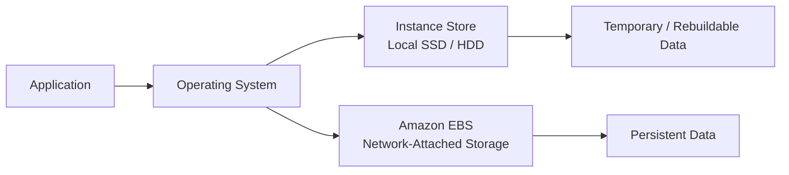
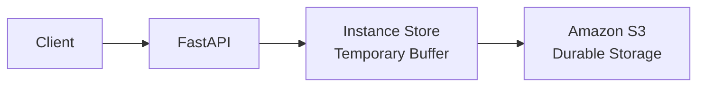
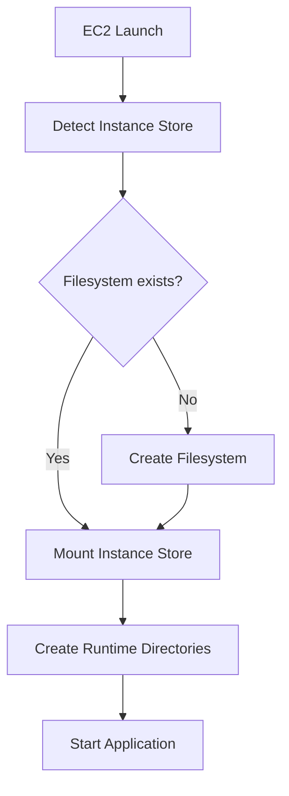
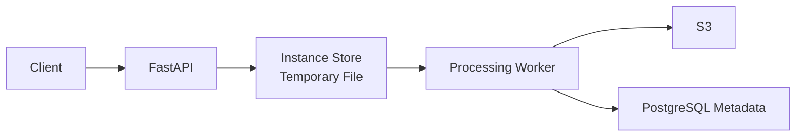
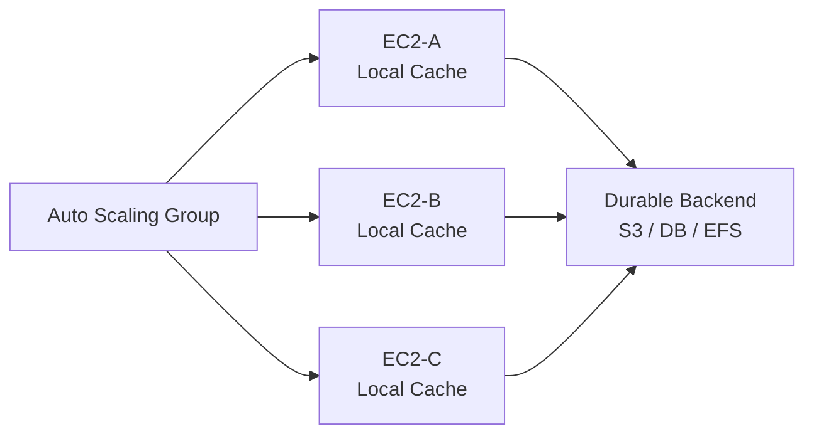
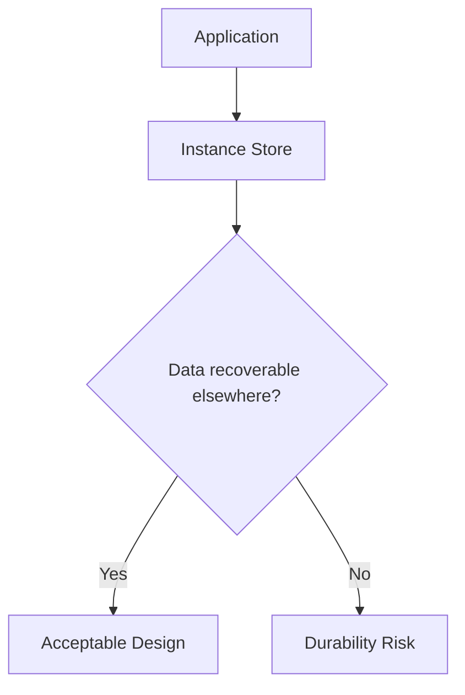
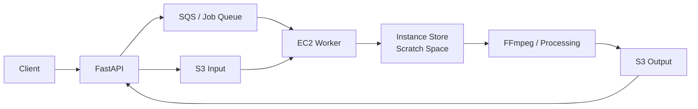

# 05- Instance Store

## Overview

Amazon EC2 Instance Store provides temporary block-level storage physically attached to the host computer running an EC2 instance. Unlike Amazon EBS, which provides network-attached persistent block storage, Instance Store is tied directly to the lifecycle and placement of the EC2 instance.

Instance Store is optimized for workloads that benefit from low-latency, high-throughput local storage and can tolerate data loss when the instance stops, hibernates, terminates, or otherwise loses its underlying host. Data survives an ordinary reboot, but it does not survive stop, hibernate, or termination operations. :contentReference[oaicite:0]{index=0}

The fundamental architecture is:



The most important design rule is:

> Treat Instance Store as disposable storage. Any data that must survive instance loss must exist somewhere else.

Instance Store is therefore well suited to caches, temporary processing data, scratch space, replicated data, shuffle files, and other workloads where persistence is handled at another layer.

---

## How Instance Store Works

Instance Store disks are physically attached to the host computer that runs the EC2 instance.

Conceptually:

```text
EC2 Host
|
+-- CPU
+-- Memory
+-- Local Instance Store
|
+-- EC2 Instance
        |
        +-- /dev/nvme...
```

This differs fundamentally from EBS:

```text
EC2 Instance
     |
     | Network storage path
     v
Amazon EBS
```

Because Instance Store is local to the host, its lifecycle is inseparable from the EC2 instance's underlying host placement.

AWS determines the number, size, and storage technology of Instance Store devices based on the selected instance type. You do not independently provision an arbitrary Instance Store volume as you would an EBS volume. :contentReference[oaicite:1]{index=1}

---

## Instance Store vs EBS

Instance Store and EBS solve different storage problems.

| Characteristic | Instance Store | EBS |
|---|---|---|
| Storage location | Physically attached to EC2 host | Network-attached AWS storage |
| Persistence | Temporary | Persistent |
| Survives reboot | Yes | Yes |
| Survives stop/start | No | Yes |
| Survives hibernation | No | Yes |
| Survives termination | No | Depends on deletion policy |
| Independent volume lifecycle | No | Yes |
| Attach after launch | No | Yes |
| Detach and move to another instance | No | Yes |
| Snapshots | Not directly | Yes |
| Capacity | Determined by instance type | Provisioned separately |
| Primary strength | Local storage performance | Durable persistent block storage |
| Typical use | Cache, scratch, replicated data | OS, databases, persistent application data |

AWS documents that Instance Store volumes can only be attached at instance launch and cannot later be detached and attached to another instance. :contentReference[oaicite:2]{index=2}

A useful engineering distinction is:

```text
Need durable block storage?
        |
        +-- Yes --> EBS
        |
        +-- No
             |
             v
Need high-performance local temporary storage?
             |
             +-- Yes --> Instance Store
```

---

## Data Persistence

Instance Store data persists while the instance continues running on its current host and also survives a normal reboot.

It does not persist when the instance is:

- Stopped
- Hibernated
- Terminated

AWS cryptographically erases the Instance Store blocks when these lifecycle events occur. :contentReference[oaicite:3]{index=3}

| Instance Operation | Instance Store Data |
|---|---|
| Reboot | Preserved |
| OS restart | Preserved |
| Stop | Lost |
| Start after stop | Previous data unavailable |
| Hibernate | Lost |
| Terminate | Lost |

This distinction is frequently tested in interviews:

```text
Reboot
  |
  +--> Same host
  +--> Instance Store survives

Stop / Hibernate / Terminate
  |
  +--> Instance Store data erased
```

AWS also documents that a normal reboot keeps the instance on the same host, while stop/start can move the instance to another host. :contentReference[oaicite:4]{index=4}

---

## Instance Store Is Ephemeral

The term **ephemeral storage** means that the storage lifetime is tied to the compute resource rather than being independently durable.

Suppose a FastAPI service writes uploaded files to:

```text
/mnt/local/uploads
```

and that path resides on Instance Store.

If the instance terminates:

```text
Client
  |
  v
FastAPI
  |
  v
Instance Store
  |
  X
Instance terminated
  |
  v
Files lost
```

If those files are business data, this architecture is incorrect.

A safer design is:



The application can use local storage for processing while ensuring the authoritative data resides in durable storage.

---

## Supported Instance Types

Instance Store is not available on every EC2 instance type.

The amount and type of local storage are characteristics of the instance type itself. AWS instance families can provide different combinations of:

- NVMe SSD
- SSD
- NVMe HDD
- HDD

For example, storage-optimized instance families provide configurations with large amounts of local storage, while some general-purpose and compute-optimized instance variants include local NVMe SSDs. :contentReference[oaicite:5]{index=5}

Always inspect the current instance-type specification before choosing an architecture.

Do not assume:

```text
Instance family
    =
Instance Store available
```

Different variants within related families can have different storage configurations.

---

## Instance Naming Conventions

AWS instance families often use suffixes that indicate additional capabilities.

For example, some instance families use a `d` suffix for variants containing local Instance Store.

Examples include families such as:

```text
m5d
c5d
r5d
```

However, naming conventions should be treated as a useful hint rather than a replacement for checking the current EC2 instance-type specification.

The actual Instance Store characteristics can vary significantly by generation and instance size.

---

## NVMe Instance Store

Modern Nitro-based EC2 instances commonly expose local SSD Instance Store devices through NVMe.

On Linux:

```bash
lsblk
```

Example output may resemble:

```text
NAME         SIZE TYPE MOUNTPOINT
nvme0n1       30G disk
└─nvme0n1p1   30G part /
nvme1n1      900G disk
```

Inspect NVMe devices:

```bash
sudo nvme list
```

The root EBS volume and Instance Store devices may both appear as NVMe devices on Nitro instances.

Do not determine storage durability solely from a device name such as:

```text
/dev/nvme0n1
```

Instead, identify the actual device and storage type before formatting, mounting, or modifying it.

---

## Discovering Instance Store Devices

Start with:

```bash
lsblk -o NAME,SIZE,TYPE,FSTYPE,MOUNTPOINTS
```

Inspect filesystems:

```bash
sudo blkid
```

Inspect NVMe devices:

```bash
sudo nvme list
```

Check mounted filesystems:

```bash
df -hT
```

For automation, device discovery should be deterministic.

Avoid hardcoding assumptions such as:

```text
/dev/nvme1n1 is always Instance Store
```

Device enumeration can vary with instance configuration.

---

## Formatting an Instance Store Device

Before formatting any device, verify that it is actually the intended Instance Store disk.

Example:

```bash
lsblk
sudo nvme list
```

Create an XFS filesystem:

```bash
sudo mkfs.xfs /dev/nvme1n1
```

Create a mount point:

```bash
sudo mkdir -p /mnt/instance-store
```

Mount it:

```bash
sudo mount /dev/nvme1n1 /mnt/instance-store
```

Verify:

```bash
df -hT /mnt/instance-store
```

For ext4:

```bash
sudo mkfs.ext4 /dev/nvme1n1
```

Never run `mkfs` against a device until its identity has been verified. Formatting the wrong NVMe device can destroy an EBS root or data filesystem.

---

## Mount Configuration

For systems where the local device should be mounted automatically during boot, configuration can be handled through:

- `/etc/fstab`
- cloud-init
- EC2 User Data
- configuration-management tooling
- custom bootstrap scripts

However, remember that Instance Store contents are disposable.

An application bootstrap process should therefore be capable of recreating:

- Filesystem structure
- Directories
- Permissions
- Cache state
- Temporary data
- Application indexes

The mount should not contain irreplaceable configuration or application state.

---

## Example Bootstrap Workflow

A production initialization process might look like:



The important principle is that the application must be able to start correctly with an empty Instance Store.

If application startup depends on previously existing Instance Store contents, the architecture is not treating the storage as ephemeral.

---

## Practical Backend Use Cases

Instance Store works well when data can be reconstructed, downloaded, replicated, or discarded.

Common use cases include:

| Workload | Instance Store Role |
|---|---|
| API servers | Temporary request-processing files |
| Nginx | Temporary cache |
| Redis | Specialized replicated/cache workloads |
| Kafka | Specialized replicated local storage architectures |
| ETL | Intermediate processing files |
| Data processing | Scratch space |
| Build systems | Temporary build artifacts |
| CI/CD runners | Workspace/cache |
| Search systems | Rebuildable local indexes |
| Distributed systems | Replicated local data |
| ML/HPC | Temporary high-performance datasets |

The important qualifier is always recoverability.

---

## Temporary API Processing

Consider a FastAPI application processing large uploads.

Instead of keeping the entire upload in memory:



Instance Store can provide high-performance temporary staging without requiring the temporary object to remain durable.

If the EC2 instance fails halfway through processing, the job should be retried from the durable source.

---

## Celery Worker Scratch Space

CPU-intensive Celery jobs may generate large temporary files.

```text
S3 Input
   |
   v
Celery Worker
   |
   v
Instance Store
   |
   +-- Extract
   +-- Transform
   +-- Compress
   |
   v
S3 Output
```

This architecture works well because:

```text
Source = Durable
Temporary Processing = Ephemeral
Output = Durable
```

A failed worker can be replaced and the job retried.

---

## Nginx Cache

Instance Store can be appropriate for disposable Nginx cache data.

```text
Client
  |
  v
Nginx
  |
  +-- Instance Store Cache
  |
  v
Backend
```

If the instance is replaced:

```text
Cache lost
   |
   v
Cache warms again
```

This is acceptable because the cache is not authoritative data.

---

## Redis Considerations

Instance Store can be useful for specialized Redis deployments where:

- Redis is primarily used as a cache
- Data can be rebuilt
- Replication exists
- Persistence is handled elsewhere
- Loss of a node's local storage is acceptable

It is inappropriate when a single Redis instance's local data is the only authoritative copy.

A safer distributed model is:

```text
Application
     |
     v
Redis Cluster / Replication
     |
     +-- Node A: local storage
     +-- Node B: local storage
     +-- Node C: local storage
```

Even then, recovery behavior must be designed around node replacement.

---

## Kafka Considerations

Kafka is designed around replication between brokers, which makes local storage an important architectural option for some deployments.

Conceptually:

```text
Partition P0
   |
   +-- Broker A
   +-- Broker B
   +-- Broker C
```

If Broker A loses its local Instance Store:

```text
Broker A lost
     |
     v
Replicas remain
     |
     v
Replacement broker
     |
     v
Partition replicated again
```

This illustrates the correct way to use ephemeral storage:

> Durability comes from the distributed system, not from the individual disk.

Using Instance Store for Kafka still requires careful analysis of replication, replacement time, failure domains, capacity, operational complexity, and expected recovery traffic.

---

## Database Considerations

Instance Store should not normally be the only storage location for a standalone PostgreSQL database.

This architecture is dangerous:

```text
PostgreSQL
    |
    v
Instance Store
    |
    X
Instance lost
    |
    v
Database lost
```

For ordinary PostgreSQL on EC2:

```text
PostgreSQL
    |
    v
EBS
```

is generally more appropriate because the database requires durable block storage.

Instance Store can still appear in specialized database architectures where data durability is provided by:

- Synchronous replication
- Multiple database nodes
- WAL replication
- External backup
- Distributed consensus
- Application-specific recovery mechanisms

Such designs require explicit failure engineering.

---

## Docker Considerations

Docker can use Instance Store for disposable container data.

Example:

```text
EC2
 |
 +-- EBS
 |    |
 |    +-- OS
 |    +-- Durable configuration
 |
 +-- Instance Store
      |
      +-- Container scratch
      +-- Build cache
      +-- Temporary layers
```

Do not place irreplaceable container state on Instance Store.

For containerized applications:

```text
Container
    |
    +-- Temporary state --> Instance Store
    |
    +-- Durable state --> EBS / EFS / S3 / Database
```

This keeps the container host replaceable.

---

## Kubernetes Considerations

Instance Store maps naturally to the concept of node-local ephemeral storage.

A Kubernetes workload can use node-local storage for:

- Temporary processing
- Cache
- Build workspace
- Scratch files

However, node replacement means local data disappears.

Conceptually:

```text
Kubernetes Node
      |
      +-- Pod A
      +-- Pod B
      |
      +-- Local Instance Store
```

If the node disappears:

```text
Node lost
   |
   +-- Pods recreated elsewhere
   |
   +-- Local data lost
```

Applications requiring durable Kubernetes storage should use appropriate persistent storage rather than depending on local Instance Store.

---

## Performance Characteristics

Instance Store can provide very high local I/O performance because the storage device is physically attached to the EC2 host.

AWS publishes instance-specific performance characteristics, including aggregate random read/write IOPS for many NVMe SSD-backed instance types. Actual capabilities depend heavily on the selected instance family and size. :contentReference[oaicite:6]{index=6}

The general path is:

```text
Application
    |
    v
Filesystem
    |
    v
Local NVMe
    |
    v
Physical Host Storage
```

Compared conceptually with EBS:

```text
Application
    |
    v
Filesystem
    |
    v
EBS Device
    |
    v
EC2 Storage Network
    |
    v
EBS
```

This makes Instance Store attractive for workloads where local-storage performance matters and data can be reconstructed.

---

## Performance Is Instance-Type Specific

Do not use a generic statement such as:

```text
Instance Store = X IOPS
```

Performance varies by:

- Instance family
- Instance size
- Number of local devices
- SSD vs HDD
- NVMe support
- Block size
- Queue depth
- Read/write pattern
- Filesystem
- RAID configuration
- Device utilization

AWS publishes Instance Store specifications per instance family rather than defining one universal performance level. :contentReference[oaicite:7]{index=7}

Always benchmark the actual instance type using a workload representative of production.

---

## SSD Write Performance

SSD Instance Store performance can decline as devices become full because SSD garbage collection and write amplification increase.

AWS notes that smaller or unaligned writes can increase write amplification and latency. For SSD Instance Store, AWS recommends leaving approximately 10% of the device unpartitioned when over-provisioning is useful for sustaining write performance. :contentReference[oaicite:8]{index=8}

Conceptually:

```text
Nearly Empty SSD
      |
      v
More free blocks
      |
      v
Efficient writes
```

versus:

```text
Nearly Full SSD
      |
      v
Garbage collection
      |
      v
Write amplification
      |
      v
Higher latency
```

For sustained write-heavy systems, capacity planning must include performance headroom rather than targeting 100% disk utilization.

---

## TRIM

Many SSD/NVMe Instance Store configurations support TRIM.

TRIM informs the SSD controller that blocks are no longer needed:

```text
Filesystem deletes data
        |
        v
TRIM
        |
        v
SSD marks blocks reusable
        |
        v
Reduced garbage collection pressure
```

AWS notes that TRIM can reduce write amplification and improve performance on supported devices. :contentReference[oaicite:9]{index=9}

On Linux, check TRIM support and filesystem behavior before enabling operational policies such as periodic `fstrim`.

Example:

```bash
sudo fstrim -av
```

Do not assume every Instance Store device or instance family supports the same behavior.

---

## Device Initialization

Some older or specific Instance Store configurations can experience slower first writes until storage locations have been initialized.

AWS recommends pre-initializing such drives when predictable high disk performance is required. Direct-attached SSD devices with TRIM support can provide maximum performance immediately and do not require this initialization process. :contentReference[oaicite:10]{index=10}

Conceptually:

```text
Uninitialized Device
        |
        v
First Write
        |
        v
Additional Work
        |
        v
Higher Initial Latency
```

Always check the current instance-type storage specification before adding initialization procedures to bootstrap scripts.

---

## RAID with Instance Store

Some EC2 instance types expose multiple local Instance Store devices.

For example:

```text
EC2
 |
 +-- NVMe0
 +-- NVMe1
 +-- NVMe2
 +-- NVMe3
```

These can potentially be combined using software RAID depending on workload requirements.

### RAID 0

```text
        RAID 0
      /   |   |   \
 NVMe0 NVMe1 NVMe2 NVMe3
```

Advantages:

- Aggregate capacity
- Higher throughput
- Parallel I/O

Limitation:

- Failure of one device invalidates the array

Because Instance Store is already ephemeral, RAID 0 can be appropriate for scratch workloads where performance matters more than local durability.

### RAID 1

```text
       RAID 1
       /    \
   NVMe0   NVMe1
```

RAID 1 provides local redundancy against an individual device failure but does not make the data survive loss, stop, or termination of the EC2 instance.

Therefore:

```text
RAID redundancy
    !=
Durable storage
```

---

## Instance Store and Auto Scaling

Instance Store works naturally with immutable and replaceable compute architectures.



When an instance is replaced:

```text
Old instance
    |
    X
Local data lost
    |
    v
New instance
    |
    v
Cache / temporary state rebuilt
```

Applications should assume that every newly launched instance starts with empty local storage.

This aligns well with Auto Scaling because instance replacement does not require moving local persistent data.

---

## Instance Store and Immutable Infrastructure

A strong Instance Store architecture usually follows:

```text
Infrastructure defines instance
        |
        v
Instance launches
        |
        v
Local storage initialized
        |
        v
Temporary state generated
        |
        v
Instance replaced
        |
        v
Temporary state discarded
```

The system should not depend on manually preserving local files between instances.

Use:

- AMIs
- Launch templates
- User Data
- CI/CD
- Configuration management
- S3
- Databases
- Persistent storage services

to reconstruct the application environment.

---

## Failure Model

Instance Store should be designed around failure rather than treated as durable local disk.

Consider:



Failure scenarios include:

- EC2 termination
- Stop/start
- Hibernation
- Host failure
- Auto Scaling replacement
- Spot interruption
- Manual operator action

The application should remain recoverable after any of these events.

---

## Spot Instances

Instance Store and Spot Instances can work well together for fault-tolerant workloads.

Example:

```text
S3 Input
   |
   v
Spot EC2
   |
   v
Instance Store Scratch
   |
   v
Processing
   |
   v
S3 Output
```

If the Spot instance disappears:

```text
Local data lost
     |
     v
Replacement instance
     |
     v
Job retried
```

This architecture is suitable when processing is idempotent or checkpointed to durable storage.

It is dangerous when the only copy of intermediate business-critical state exists locally.

---

## Backup Strategy

Instance Store cannot be snapshotted using the EBS snapshot mechanism.

If data must be preserved, copy it to durable storage before the instance disappears.

Possible destinations include:

- Amazon S3
- Amazon EBS
- Amazon EFS
- Database systems
- Another replicated node

Example:

```text
Instance Store
      |
      | Important result
      v
Amazon S3
      |
      v
Durable copy
```

The application should determine what data is disposable and what must be persisted.

---

## Disaster Recovery

Instance Store should not itself be considered part of the durable DR state.

A recovery architecture should look like:

```text
Production EC2
    |
    +-- Instance Store
    |      |
    |      +-- Disposable
    |
    +-- Durable State
           |
           +-- S3
           +-- EBS
           +-- Database
           +-- Replicated Service
```

After disaster recovery:

```text
Durable State
     |
     v
New EC2
     |
     v
New Instance Store
     |
     v
Temporary state rebuilt
```

Recovery should not depend on recovering the previous Instance Store device.

---

## Encryption

AWS automatically encrypts data stored on NVMe Instance Store volumes using XTS-AES-256 implemented in hardware. The encryption keys are generated for the storage device, remain in hardware, and are destroyed when the relevant instance lifecycle causes the local storage to be erased. Customers cannot disable this encryption or supply their own encryption key for NVMe Instance Store. :contentReference[oaicite:11]{index=11}

Conceptually:

```text
Application Data
      |
      v
Local NVMe
      |
      v
Hardware Encryption
      |
      v
Physical Storage
```

This differs from EBS encryption, where customer-managed AWS KMS keys can be used.

Therefore:

```text
EBS
 |
 +-- AWS managed key
 +-- Customer managed KMS key

Instance Store
 |
 +-- Automatic hardware encryption
 +-- No customer-supplied storage encryption key
```

Application-level encryption can still be used where additional control is required.

---

## Security Considerations

Ephemeral does not mean unimportant.

Instance Store can contain:

- Temporary uploads
- Decompressed archives
- API payloads
- Database extracts
- Build artifacts
- Cache entries
- Application logs
- Authentication material
- Temporary credentials

Apply appropriate controls:

- Restrictive filesystem permissions
- Least-privilege application users
- Avoid unnecessary secrets on disk
- Application-level encryption where required
- Secure temporary-file handling
- Logging controls
- Cleanup policies

AWS resets Instance Store blocks when the instance is stopped, hibernated, or terminated, preventing a subsequent instance from accessing the previous data through that device. :contentReference[oaicite:12]{index=12}

---

## Monitoring

Instance Store is local storage, so monitoring differs from EBS.

EBS exposes native volume-level CloudWatch metrics. For filesystem and operating-system metrics on Instance Store, collect metrics from inside the instance using tools such as:

- CloudWatch Agent
- `df`
- `iostat`
- `iotop`
- `vmstat`
- node exporters or equivalent monitoring agents

Useful metrics include:

```text
Disk utilization
Filesystem utilization
Read IOPS
Write IOPS
Read throughput
Write throughput
I/O latency
Queue depth
Inode utilization
```

Example:

```bash
df -hT
```

```bash
iostat -xz 1
```

A production alert should fire before the filesystem reaches full capacity.

---

## Capacity Monitoring

A common failure mode is treating temporary storage as unlimited.

For example:

```text
Worker receives jobs
      |
      v
Temporary files accumulate
      |
      v
Instance Store reaches 100%
      |
      v
Application failures
```

Monitor:

```text
Used %
Free bytes
Inodes
Growth rate
Cleanup success
```

Temporary data should have lifecycle controls.

For example:

```text
Job starts
   |
   v
Create workspace
   |
   v
Process
   |
   v
Persist result
   |
   v
Delete workspace
```

Cleanup should occur on both success and failure paths.

---

## Cost Considerations

Instance Store capacity is included as part of the EC2 instance configuration rather than provisioned and billed as an independent EBS volume.

The practical cost model is therefore:

```text
Selected EC2 Instance Type
          |
          +-- CPU
          +-- Memory
          +-- Network
          +-- Local Instance Store
```

You generally choose an instance type containing the required local-storage configuration.

This creates an important capacity-planning trade-off:

> Selecting an oversized EC2 instance only to obtain more Instance Store can waste CPU and memory capacity.

Evaluate total instance economics rather than treating the local disk as independently scalable storage.

---

## Scaling Considerations

Instance Store scales with compute instances.

If an Auto Scaling Group grows:

```text
3 EC2 instances
    |
    +-- 3 local stores
```

to:

```text
10 EC2 instances
     |
     +-- 10 local stores
```

aggregate local storage grows naturally.

However, each disk remains node-local:

```text
EC2-A -> Store A
EC2-B -> Store B
EC2-C -> Store C
```

Store A is not automatically accessible from B or C.

Applications requiring a common shared namespace need a different storage architecture.

---

## Instance Store vs EFS

A common architectural mistake is choosing Instance Store when shared filesystem access is required.

| Requirement | Instance Store | EFS |
|---|---|---|
| Node-local storage | Yes | No |
| Shared across instances | No | Yes |
| Persistent | No | Yes |
| Low-latency local scratch | Strong fit | Usually not the goal |
| Managed filesystem | No | Yes |
| Survives EC2 replacement | No | Yes |
| Typical use | Cache/scratch | Shared application files |

Use Instance Store for local temporary data.

Use EFS when multiple instances need persistent shared filesystem semantics.

---

## Instance Store vs S3

Instance Store and S3 operate at different storage layers.

```text
Instance Store
    |
    +-- Block storage
    +-- Local
    +-- Temporary

S3
    |
    +-- Object storage
    +-- Network accessed
    +-- Durable
```

A common production pattern combines both:

```text
S3
 |
 | Download input
 v
Instance Store
 |
 | High-performance processing
 v
S3
 |
 | Upload output
 v
Durable Result
```

This is particularly effective for ETL, media processing, ML, and large temporary workloads.

---

## Instance Store vs Memory

Instance Store is also different from RAM.

| Characteristic | RAM | Instance Store |
|---|---|---|
| Latency | Lowest | Higher |
| Capacity | Usually smaller | Potentially much larger |
| Filesystem | No direct requirement | Common |
| Survives process restart | Yes, if memory remains allocated elsewhere | Yes |
| Survives OS reboot | No | Yes |
| Survives stop | No | No |
| Cost relationship | Instance memory | Instance storage configuration |

Instance Store is useful when data is too large for memory but does not need durable storage.

---

## Production Architecture Example

Consider a media-processing platform:



The architecture intentionally separates:

```text
Durable input  -> S3
Job metadata   -> Database / Queue
Scratch data   -> Instance Store
Durable output -> S3
```

If the worker disappears, only disposable processing state is lost.

---

## Operational Checklist

Before using Instance Store:

```text
[ ] Confirm the selected instance type provides Instance Store
[ ] Confirm number and capacity of local devices
[ ] Confirm SSD/HDD and NVMe characteristics
[ ] Confirm performance requirements
[ ] Confirm all stored data is disposable or replicated
[ ] Define device discovery
[ ] Define filesystem creation and mounting
[ ] Define startup initialization
[ ] Define temporary-file cleanup
[ ] Monitor filesystem capacity
[ ] Monitor disk I/O performance
[ ] Persist required results externally
[ ] Test instance replacement
[ ] Test stop/termination assumptions
[ ] Document recovery behavior
```

The most important validation is:

```text
Terminate the instance.
Can the system recover automatically?
```

If the answer is no because required data disappeared with Instance Store, the storage architecture needs redesign.

---

## Common Mistakes

### Treating Instance Store as Persistent Storage

Data disappears after stop, hibernate, or termination.

**Avoid it:** keep authoritative data in EBS, S3, EFS, a database, or another durable system. :contentReference[oaicite:13]{index=13}

### Assuming Stop/Start Preserves Data

A reboot preserves Instance Store data, but stop/start does not.

**Avoid it:** distinguish reboot from stop/start when designing operational procedures.

### Running a Standalone Database on Instance Store

A single PostgreSQL instance using only Instance Store can lose its entire database with the instance.

**Avoid it:** use durable storage or a properly replicated database architecture.

### Hardcoding NVMe Device Names

Nitro instances can expose both EBS and Instance Store through NVMe.

**Avoid it:** discover and verify devices before formatting or mounting them.

### Assuming All EC2 Types Have Instance Store

Instance Store configuration is instance-type specific.

**Avoid it:** check the current EC2 instance-type specification before deployment.

### Using Local Storage for Shared Application State

Other EC2 instances cannot directly use the same local Instance Store.

**Avoid it:** use EFS, S3, databases, or another shared service when shared access is required.

### Ignoring Disk Capacity

Caches and temporary files can still fill the disk.

**Avoid it:** monitor utilization and implement cleanup policies.

### Assuming RAID Makes Instance Store Durable

RAID can improve local performance or device-level redundancy but cannot make data survive loss of the EC2 instance.

**Avoid it:** maintain durable copies elsewhere.

### Persisting Job Results Too Late

A worker may complete expensive processing and then fail before the result is uploaded.

**Avoid it:** persist durable checkpoints or final outputs as soon as practical.

---

## Production Best Practices

### Treat Local Storage as Disposable

Design every instance so it can start with an empty Instance Store.

### Keep Authoritative State Elsewhere

Use durable services for:

- Database records
- Uploaded files
- Business events
- User-generated content
- Configuration
- Secrets
- Backups

### Automate Device Initialization

Use launch-time automation to:

1. Detect the correct device.
2. Create or validate the filesystem.
3. Mount it.
4. Apply ownership and permissions.
5. Create runtime directories.
6. Start dependent services.

### Monitor Storage Exhaustion

Temporary storage still needs capacity alarms.

### Design for Replacement

Test:

```text
Instance terminated
      |
      v
Replacement launched
      |
      v
Instance Store initialized
      |
      v
Application starts
      |
      v
State rebuilt
```

### Benchmark Real Workloads

Do not choose Instance Store solely because it is described as fast.

Benchmark:

- Read/write ratio
- Block sizes
- Queue depth
- Filesystem
- Concurrency
- Capacity utilization
- Sustained writes

### Persist Important Results Early

Use Instance Store as a processing layer, not the final system of record.

---

## Interview Considerations

### What is EC2 Instance Store?

Instance Store is temporary block-level storage physically attached to the host running an EC2 instance. Its capacity and storage technology are determined by the selected instance type. :contentReference[oaicite:14]{index=14}

### Does Instance Store survive a reboot?

Yes. Data persists through a normal instance reboot. :contentReference[oaicite:15]{index=15}

### Does Instance Store survive stop/start?

No. Instance Store data is erased when the instance is stopped. :contentReference[oaicite:16]{index=16}

### Does Instance Store survive termination?

No. Instance Store data is permanently lost when the instance terminates. :contentReference[oaicite:17]{index=17}

### Can an Instance Store volume be detached and attached to another EC2 instance?

No. Instance Store is tied to its instance and host and cannot be moved between instances like an EBS volume. :contentReference[oaicite:18]{index=18}

### Can Instance Store be snapshotted using EBS snapshots?

No. It is not an EBS volume. Data that must be preserved must first be copied to durable storage.

### When should Instance Store be used?

Use it for temporary, rebuildable, replicated, or disposable data where local storage performance is valuable.

Examples include:

- Cache
- Scratch space
- ETL intermediate files
- Temporary uploads
- CI/CD workspace
- Distributed-system replicas

### Why can Instance Store be faster than EBS?

Instance Store is physically attached to the EC2 host, avoiding the network-attached storage path used by EBS. Actual performance still depends on the instance type and device configuration.

### Is Instance Store encrypted?

Modern NVMe Instance Store is automatically encrypted using hardware-based XTS-AES-256 encryption. AWS manages the encryption keys, and customers cannot supply their own storage encryption key. :contentReference[oaicite:19]{index=19}

### Should PostgreSQL use Instance Store?

Not as the only copy of a standalone production database. It can be considered only in specialized replicated architectures where durability is explicitly provided elsewhere.

### What is the most important difference between EBS and Instance Store?

EBS has an independent persistent storage lifecycle. Instance Store is temporary local storage whose data is tied to the lifetime and host placement of the EC2 instance.

## Key Takeaways

- EC2 Instance Store provides high-performance local block storage whose capacity and characteristics are determined by the selected instance type.
- Instance Store data survives a reboot but is lost on stop, hibernate, or termination, so authoritative application data must be persisted or replicated elsewhere.
- Use Instance Store for disposable or recoverable workloads such as caches, scratch space, ETL intermediates, temporary processing files, and appropriately replicated distributed-system data.
- Instance Store differs fundamentally from EBS: it cannot be independently provisioned, detached, moved between instances, or protected with EBS snapshots.
- Production designs should automate device initialization, monitor local capacity and I/O, persist important results promptly, and prove that the application can recover after complete instance replacement.