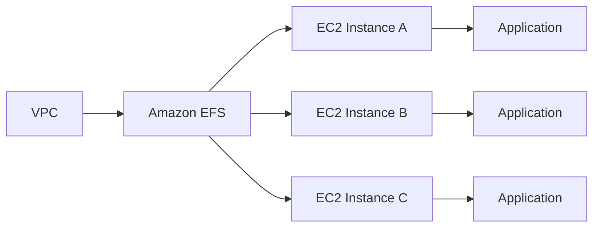
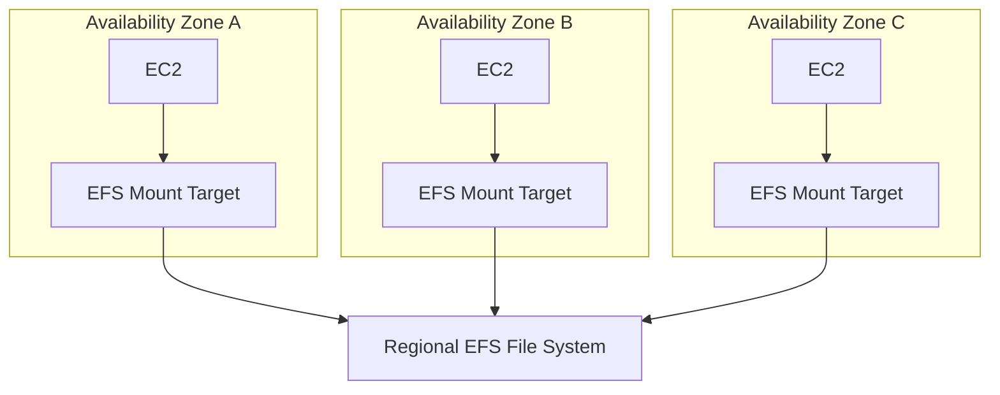
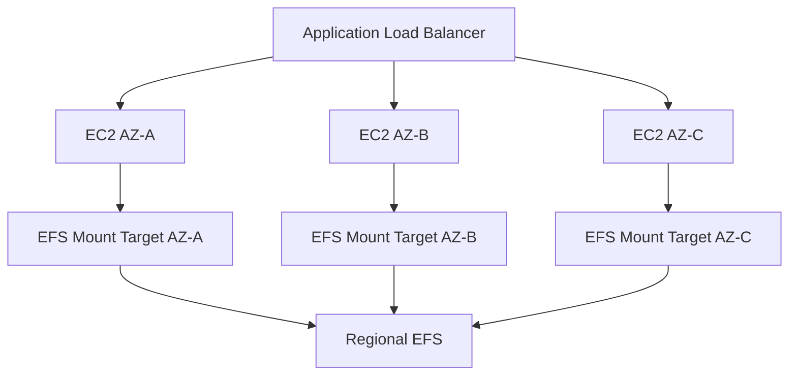
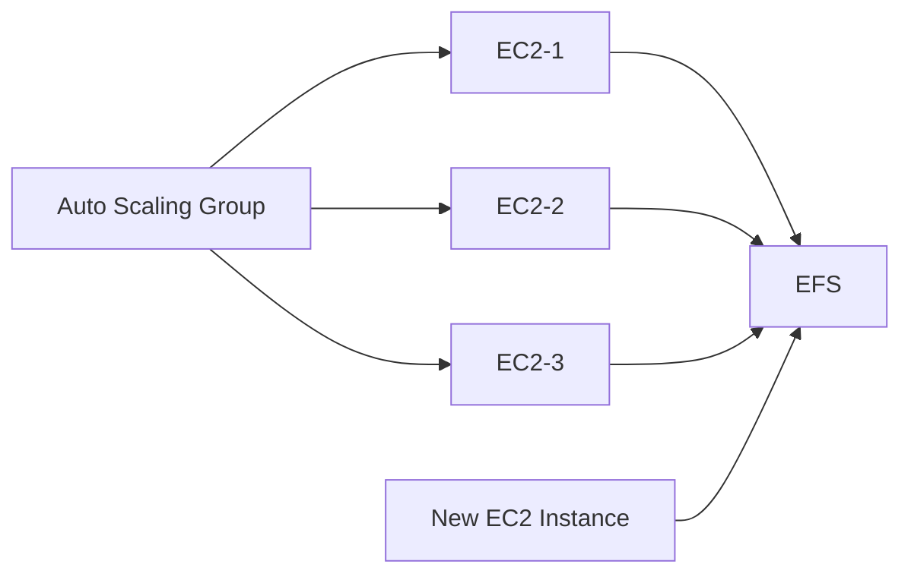
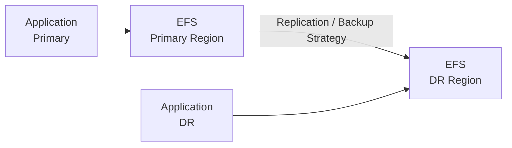
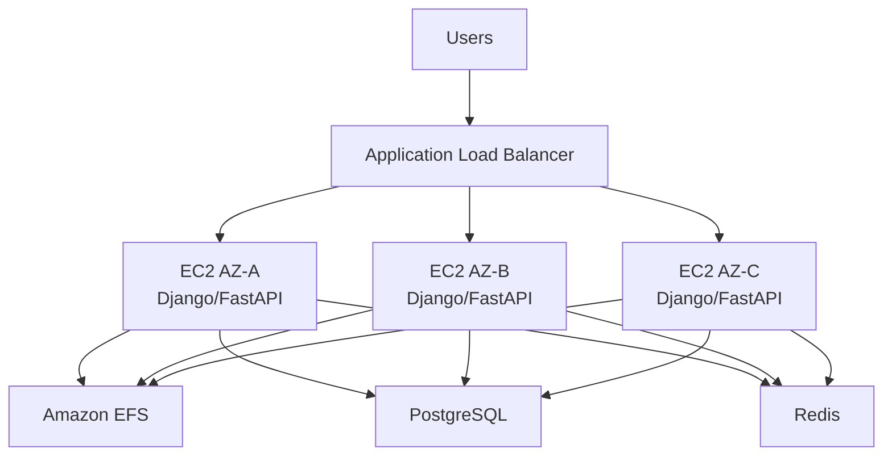

# 06- EFS

## Overview

Amazon Elastic File System (EFS) is a managed, elastic NFS file system designed to provide shared filesystem access across multiple compute resources.

Unlike EBS, which normally provides block storage to an individual EC2 instance, EFS provides a shared filesystem that multiple EC2 instances, containers, and other supported AWS compute resources can mount concurrently.

A typical architecture is:



The primary reason to use EFS with EC2 is shared, persistent filesystem access without manually managing a file server.

For backend systems, EFS is particularly useful when multiple application instances need access to the same files:

- User uploads
- Shared media
- Generated reports
- Configuration artifacts
- Shared application assets
- Processing workspaces
- Legacy applications requiring POSIX filesystem semantics

EFS is regional and can provide highly available access across multiple Availability Zones within an AWS Region.

---

## EFS vs EBS vs Instance Store

The most important distinction is the storage access model.

| Characteristic | EBS | Instance Store | EFS |
|---|---|---|---|
| Storage model | Block | Block | File |
| Access protocol | Block device | Local block device | NFS |
| Shared across EC2 instances | Normally no | No | Yes |
| Persistent | Yes | No | Yes |
| Regional | Volume-specific AZ | Host-specific | Regional |
| Survives EC2 replacement | Yes | No | Yes |
| Mountable by multiple instances | Limited/specialized cases | No | Yes |
| Local to host | No | Yes | No |
| Automatic capacity scaling | Provisioned | Instance-specific | Elastic |
| Typical use | OS, databases, persistent block storage | Scratch/cache | Shared filesystem |
| Snapshots | EBS snapshots | No | EFS backups / replication mechanisms |
| Typical backend use | PostgreSQL data | Temporary processing | Shared uploads/media |

A useful decision model is:

```text
Need storage?
      |
      +-- Block device for one instance
      |       |
      |       +--> EBS
      |
      +-- High-performance temporary local storage
      |       |
      |       +--> Instance Store
      |
      +-- Shared filesystem for multiple compute nodes
              |
              +--> EFS
```

---

## Core Architecture

EFS consists of a regional file system that is accessed through mount targets placed in VPC Availability Zones.



The file system itself is regional, while mount targets provide network endpoints for clients in their respective Availability Zones.

For production deployments, clients should generally mount EFS through a mount target in the same Availability Zone to avoid unnecessary cross-AZ traffic and associated network charges.

---

## Why EFS Exists

Traditional shared filesystems require operational infrastructure:

```text
EC2 File Server
     |
     +-- EBS
     |
     +-- NFS Server
     |
     +-- Failover
     |
     +-- Backups
     |
     +-- Scaling
```

EFS removes much of this infrastructure management:

```text
EC2 Clients
     |
     v
EFS
     |
     +-- Managed capacity
     +-- Regional availability
     +-- Shared access
     +-- Managed infrastructure
```

This is particularly useful when application instances are dynamically created and destroyed.

---

## EFS File System

The EFS file system is the primary storage resource.

Create one with the AWS CLI:

```bash
aws efs create-file-system \
    --creation-token backend-app-efs \
    --performance-mode generalPurpose \
    --throughput-mode elastic \
    --encrypted
```

The important configuration dimensions include:

- Encryption
- Performance mode
- Throughput mode
- Availability
- Storage classes
- Lifecycle policies
- Access points
- File-system policy
- Backup configuration

Inspect the filesystem:

```bash
aws efs describe-file-systems
```

---

## Regional Storage Model

EFS is a regional service.

You do not create an EFS filesystem independently inside one Availability Zone.

Instead:

```text
Region
|
+-- AZ-A
|    |
|    +-- Mount Target
|
+-- AZ-B
|    |
|    +-- Mount Target
|
+-- AZ-C
     |
     +-- Mount Target
```

This makes EFS suitable for workloads distributed across multiple Availability Zones.

A web application running across three Availability Zones can mount the same filesystem:

```text
ALB
 |
 +-- EC2-AZ-A --+
 +-- EC2-AZ-B --+--> EFS
 +-- EC2-AZ-C --+
```

---

## Mount Targets

An EFS mount target is the network endpoint through which a client accesses the filesystem.

Each Availability Zone where EFS clients operate should generally have a corresponding mount target.

Inspect mount targets:

```bash
aws efs describe-mount-targets \
    --file-system-id fs-0123456789abcdef0
```

Create one:

```bash
aws efs create-mount-target \
    --file-system-id fs-0123456789abcdef0 \
    --subnet-id subnet-0123456789abcdef0 \
    --security-groups sg-0123456789abcdef0
```

A mount target is associated with:

- EFS filesystem
- Subnet
- Security group
- Availability Zone

The subnet determines the Availability Zone in which the mount target is created.

---

## Networking Requirements

EFS uses NFS over TCP.

The standard NFS port is:

```text
TCP 2049
```

A typical network flow is:

```text
EC2
 |
 | TCP 2049
 v
EFS Mount Target
 |
 v
EFS
```

The EC2 security group must be able to communicate with the EFS mount target security group.

A common security-group design is:

```text
EC2 Security Group
        |
        | TCP 2049
        v
EFS Security Group
```

EFS security group inbound rule:

```text
Protocol: TCP
Port: 2049
Source: EC2 application security group
```

Avoid:

```text
Source: 0.0.0.0/0
```

for production EFS access.

Use security-group-to-security-group rules where possible.

---

## VPC Requirements

EFS clients require network connectivity to the EFS mount target.

For EC2:

```text
EC2
 |
 +-- VPC
      |
      +-- Subnet
      |
      +-- Route / network connectivity
      |
      +-- EFS Mount Target
```

EFS does not require public internet access for ordinary EC2-to-EFS communication.

A private-subnet architecture is typical:

```text
Internet
   |
   v
ALB
   |
   v
Private EC2
   |
   | TCP 2049
   v
Private EFS Mount Target
```

---

## Mounting EFS on Linux

Install the EFS mount helper where required.

On Amazon Linux:

```bash
sudo dnf install -y amazon-efs-utils
```

Depending on the operating system and version, the package manager may differ.

Mount using the EFS DNS name:

```bash
sudo mkdir -p /mnt/efs

sudo mount -t efs \
    -o tls \
    fs-0123456789abcdef0:/ \
    /mnt/efs
```

Verify:

```bash
df -hT /mnt/efs
```

Check the mount:

```bash
mount | grep efs
```

---

## EFS Mount Helper

The `amazon-efs-utils` package provides the EFS mount helper.

It simplifies:

- TLS mounting
- EFS-specific configuration
- DNS-based mounting
- IAM authorization integration
- CloudWatch logging integration in supported configurations

A common production mount is:

```bash
sudo mount -t efs \
    -o tls \
    fs-0123456789abcdef0:/ \
    /mnt/efs
```

For IAM-authorized mounts:

```bash
sudo mount -t efs \
    -o tls,iam \
    fs-0123456789abcdef0:/ \
    /mnt/efs
```

IAM authorization should be combined with an appropriate EFS file-system policy and access-point configuration.

---

## Persistent Mounts

For EC2 instances that should automatically mount EFS after reboot, `/etc/fstab` can be used.

Example:

```text
fs-0123456789abcdef0:/ /mnt/efs efs _netdev,tls 0 0
```

The `_netdev` option is important because EFS is a network filesystem.

Test before rebooting:

```bash
sudo mount -a
```

Then verify:

```bash
df -hT /mnt/efs
```

A production deployment should test both:

```text
EC2 boot
   |
   v
Network available
   |
   v
EFS mounted
   |
   v
Application starts
```

The application should not start in a partially configured state where it accidentally writes data to the underlying local directory because the EFS mount failed.

---

## EFS Performance Modes

EFS provides performance modes that determine filesystem performance characteristics.

The main modes are:

| Performance Mode | Characteristics | Typical Use |
|---|---|---|
| General Purpose | Lower latency and general workloads | Most applications |
| Max I/O | Higher aggregate scalability with higher latency characteristics | Highly parallel workloads |

General Purpose is the default choice for most modern workloads.

For typical Django, FastAPI, or microservice applications:

```text
EFS General Purpose
```

is normally the starting point.

Do not select Max I/O simply because the workload is large. Evaluate application latency and concurrency requirements first.

---

## Throughput Modes

EFS throughput mode controls how filesystem throughput is provided.

Common modes include:

- Elastic
- Provisioned
- Bursting

Elastic throughput is useful when workloads have variable or unpredictable throughput requirements because throughput automatically adapts to workload demand.

Provisioned throughput is useful when a workload requires a known throughput level independent of the amount of data stored.

Bursting throughput uses a model based on filesystem size and accumulated burst credits.

The appropriate choice depends on workload characteristics and current AWS service capabilities and pricing.

---

## Elastic Throughput

Elastic throughput is particularly useful for workloads with unpredictable traffic.

For example:

```text
Normal traffic
   |
   v
Low filesystem throughput

Traffic spike
   |
   v
Higher filesystem throughput
```

This can simplify capacity planning because the filesystem does not require manually tuned throughput for every traffic pattern.

Typical candidates include:

- Variable API traffic
- Shared application files
- Development environments
- Intermittent data processing
- Unpredictable workloads

---

## Provisioned Throughput

Provisioned throughput allows the filesystem to be configured for a specific throughput requirement independent of the amount of data stored.

This is useful when:

```text
Small dataset
+
High sustained throughput requirement
```

makes size-based throughput insufficient.

Example:

```text
100 GB data
+
Required throughput: high
```

Provisioned throughput can provide a predictable throughput configuration rather than relying solely on filesystem size.

---

## Storage Classes

EFS supports multiple storage classes designed for different access patterns.

Common classes include:

- EFS Standard
- EFS Infrequent Access
- EFS Archive

The lower-cost storage classes are intended for files that are accessed less frequently.

EFS lifecycle management can move files between storage classes based on access patterns.

Conceptually:

```text
Frequently accessed
       |
       v
EFS Standard
       |
       | Lifecycle policy
       v
Infrequent Access
       |
       | Longer inactivity
       v
Archive
```

The exact lifecycle behavior and minimum storage durations should be checked against current AWS documentation and pricing before designing cost-sensitive workloads.

---

## Lifecycle Management

EFS lifecycle policies can automatically transition files between storage classes.

Example policy concept:

```text
File not accessed
      |
      v
Lifecycle threshold
      |
      v
Move to EFS IA
```

This is useful when the filesystem contains a mixture of:

- Hot files
- Warm files
- Cold files

A production configuration should be based on actual access patterns rather than arbitrary lifecycle periods.

---

## Access Patterns

EFS is most valuable when multiple clients need filesystem semantics.

Example:

```text
EC2-A ----+
          |
EC2-B ----+----> EFS
          |
EC2-C ----+
```

All clients can access the same namespace.

For example:

```text
/mnt/efs/media/profile.jpg
```

can be available from multiple application instances.

This is fundamentally different from:

```text
EC2-A -> EBS
EC2-B -> different EBS
```

where the instances have independent block devices.

---

## POSIX Filesystem Semantics

EFS provides a filesystem interface with POSIX-style ownership and permissions.

Example:

```bash
ls -la /mnt/efs
```

Permissions can be managed using:

```bash
chmod
chown
umask
```

For example:

```bash
sudo chown -R appuser:appuser /mnt/efs/app
sudo chmod 750 /mnt/efs/app
```

This makes EFS useful for applications that expect traditional filesystem operations rather than object-storage APIs.

---

## EFS Access Points

EFS Access Points provide application-specific entry points into an EFS filesystem.

They can define:

- Root directory
- POSIX user
- POSIX group
- Directory creation permissions
- Application-specific filesystem boundaries

Conceptually:

```text
EFS
 |
 +-- Access Point A --> /apps/service-a
 |
 +-- Access Point B --> /apps/service-b
 |
 +-- Access Point C --> /apps/service-c
```

This is particularly useful when multiple applications share the same EFS filesystem but should have separate filesystem roots and identities.

---

## Access Point Example

Create an access point:

```bash
aws efs create-access-point \
    --file-system-id fs-0123456789abcdef0 \
    --posix-user Uid=1000,Gid=1000 \
    --root-directory 'Path=/apps/backend,CreationInfo={OwnerUid=1000,OwnerGid=1000,Permissions=750}'
```

Mount through the access point:

```bash
sudo mount -t efs \
    -o tls,accesspoint=fsap-0123456789abcdef0 \
    fs-0123456789abcdef0:/ \
    /mnt/backend
```

Access points are especially useful for ECS, EKS, and multi-tenant application architectures.

---

## IAM Authorization

EFS supports IAM-based authorization for client access.

This enables authentication and authorization based on AWS identities rather than relying solely on network-level access.

A production architecture can use:

```text
EC2 IAM Role
      |
      v
EFS Mount Helper
      |
      v
EFS Access Point
      |
      v
Filesystem
```

The security model can combine:

- Security groups
- IAM policies
- EFS file-system policies
- Access points
- POSIX permissions

Defense in depth is preferable to relying on a single control.

---

## EFS File System Policies

An EFS resource policy controls access to the filesystem.

A policy can restrict operations such as:

- Client mount
- Root access
- IAM authorization
- Specific AWS principals
- Specific access points

A simplified conceptual policy might look like:

```json
{
  "Version": "2012-10-17",
  "Statement": [
    {
      "Effect": "Allow",
      "Principal": "*",
      "Action": [
        "elasticfilesystem:ClientMount"
      ],
      "Resource": "arn:aws:elasticfilesystem:region:account-id:file-system/fs-0123456789abcdef0"
    }
  ]
}
```

Production policies should use explicit principals and conditions rather than broad wildcard access whenever possible.

---

## Encryption

EFS supports encryption at rest.

Create an encrypted filesystem:

```bash
aws efs create-file-system \
    --creation-token backend-efs \
    --encrypted
```

A customer-managed AWS KMS key can be selected when required:

```bash
aws efs create-file-system \
    --creation-token backend-efs \
    --encrypted \
    --kms-key-id arn:aws:kms:region:account-id:key/key-id
```

Encryption in transit can be enabled through TLS when mounting:

```bash
sudo mount -t efs \
    -o tls \
    fs-0123456789abcdef0:/ \
    /mnt/efs
```

Production systems handling sensitive data should generally use both:

```text
Encryption at rest
        +
Encryption in transit
```

---

## Security Group Design

A clean EFS network design uses separate security groups.

```text
sg-backend
    |
    | TCP 2049
    v
sg-efs
```

EFS security group:

```text
Inbound:
TCP 2049
Source: sg-backend
```

Backend security group does not need to allow inbound TCP 2049 from the internet.

This is preferable to:

```text
TCP 2049
Source: 0.0.0.0/0
```

which unnecessarily exposes the filesystem endpoint to broad network sources.

---

## DNS and Mounting

EFS provides DNS-based mounting.

A client typically mounts:

```text
fs-0123456789abcdef0.efs.region.amazonaws.com
```

The EFS mount helper resolves the appropriate mount target.

DNS therefore becomes part of the EFS client configuration.

Common problems include:

- DNS disabled in the VPC
- Incorrect resolver configuration
- Missing mount target
- Incorrect security group
- Network ACL restrictions
- Incorrect subnet routing

When troubleshooting a mount failure, inspect the complete network path rather than only the filesystem configuration.

---

## Network ACL Considerations

Security groups are stateful, while network ACLs are stateless.

If restrictive NACLs are used, both directions of the relevant traffic must be allowed.

Conceptually:

```text
EC2
 |
 | TCP 2049
 v
NACL
 |
 v
EFS Mount Target
```

Do not make NACLs unnecessarily restrictive without understanding the return traffic requirements.

---

## High Availability

For production workloads distributed across multiple Availability Zones:

```text
AZ-A EC2 --> AZ-A EFS Mount Target
AZ-B EC2 --> AZ-B EFS Mount Target
AZ-C EC2 --> AZ-C EFS Mount Target
```

This keeps client access aligned with local Availability Zone infrastructure.

A typical application architecture is:



This avoids making one Availability Zone's mount target a single operational dependency for all application instances.

---

## Django Example

EFS can be used for Django media files when multiple application instances need shared filesystem access.

Example:

```text
ALB
 |
 +-- Django EC2 A --+
 +-- Django EC2 B --+--> EFS /media
 +-- Django EC2 C --+
```

Django configuration might use:

```python
from pathlib import Path

BASE_DIR = Path(__file__).resolve().parent.parent

MEDIA_ROOT = "/mnt/efs/media"
MEDIA_URL = "/media/"
```

An uploaded file can then be available to every application instance.

However, for cloud-native architectures, S3 is often preferable for user-uploaded media because it provides object-storage semantics, simpler global distribution patterns, and better separation between compute and file storage.

EFS is most appropriate when the application specifically requires filesystem semantics.

---

## FastAPI Example

A FastAPI service can similarly use an EFS-mounted directory:

```python
from pathlib import Path

UPLOAD_DIR = Path("/mnt/efs/uploads")
UPLOAD_DIR.mkdir(parents=True, exist_ok=True)
```

The important architectural property is:

```text
FastAPI A
   |
   +-- EFS
   |
FastAPI B
   |
   +-- Same files
```

Without EFS, storing uploads on local EC2 storage creates instance-specific state:

```text
Request -> EC2-A -> local disk
Request -> EC2-B -> file unavailable
```

EFS removes that inconsistency by providing a shared filesystem.

---

## When EFS Is Not the Right Choice

EFS should not automatically be selected whenever an application needs storage.

Avoid EFS when:

- The application only needs local scratch space.
- A single instance needs persistent block storage.
- The workload is primarily object storage.
- The workload requires database storage semantics.
- Very low local-storage latency is the primary requirement.
- The application does not actually require filesystem semantics.

Alternatives include:

| Requirement | Better Candidate |
|---|---|
| Persistent block storage | EBS |
| Local temporary storage | Instance Store |
| Object storage | S3 |
| Shared persistent filesystem | EFS |
| Managed relational database | RDS / Aurora |
| Cache | Redis / ElastiCache |

---

## EFS and S3

A common architectural decision is EFS vs S3.

| Requirement | EFS | S3 |
|---|---|---|
| Filesystem interface | Yes | No |
| POSIX permissions | Yes | No |
| Shared mount | Yes | No |
| Object API | No | Yes |
| Random filesystem operations | Yes | Object-based |
| Large object storage | Possible | Strong fit |
| Application media | Possible | Often preferred |
| Shared application filesystem | Strong fit | Not equivalent |
| Static assets | Possible | Often preferred |
| Compute-local processing | Mount filesystem | API/download |

Use EFS when the application expects:

```text
open()
read()
write()
rename()
chmod()
chown()
```

Use S3 when the application naturally operates on objects:

```text
PUT object
GET object
DELETE object
LIST objects
```

---

## EFS and Kubernetes

EFS can provide shared persistent storage for Kubernetes workloads, including EKS.

Conceptually:

```text
EKS
 |
 +-- Pod A
 +-- Pod B
 +-- Pod C
      |
      v
     EFS
```

A Kubernetes application can use EFS through the AWS EFS CSI driver.

This is useful for workloads requiring:

- Shared persistent files
- Read/write access from multiple pods
- Cross-node filesystem access
- Application data that should survive pod replacement

However, not every Kubernetes workload requires shared filesystem storage. Databases and object storage should still use storage systems appropriate to their access model.

---

## EFS and Docker

With Docker on EC2, EFS can be mounted on the host and provided to containers:

```text
EFS
 |
 v
EC2 Host
 |
 v
Docker Container
```

Example:

```bash
docker run \
    --mount type=bind,source=/mnt/efs,target=/app/data \
    backend-api:latest
```

This allows multiple EC2 hosts to expose the same EFS-backed path to their containers.

In production, ensure container processes use appropriate UID/GID mappings and filesystem permissions.

---

## EFS and Auto Scaling

EFS is particularly useful with Auto Scaling because new EC2 instances can mount the same filesystem automatically.



When an instance is replaced:

```text
Old EC2
   |
   X
Instance removed
   |
   v
New EC2
   |
   v
Mount EFS
   |
   v
Existing files available
```

This is one of the strongest architectural differences between EFS and Instance Store.

---

## Performance Considerations

EFS performance is influenced by:

- Performance mode
- Throughput mode
- Number of clients
- File access pattern
- Metadata operations
- Directory structure
- File sizes
- Concurrent operations
- Network characteristics

Filesystem workloads are not all equivalent.

For example:

```text
Large sequential files
```

can behave very differently from:

```text
Millions of small files
+
High metadata activity
```

Applications with large numbers of small files can become metadata-bound even when aggregate throughput appears sufficient.

Benchmark the actual workload.

---

## Small-File Workloads

A common EFS performance pitfall is assuming:

```text
High aggregate throughput
=
Every filesystem operation is fast
```

It does not.

Workloads involving:

- `stat()`
- `open()`
- `close()`
- directory traversal
- permission checks
- many tiny reads/writes

can have different latency characteristics from large sequential I/O.

If a Django application stores millions of tiny files:

```text
/media/
    |
    +-- millions of small files
```

consider whether S3 or another data model would be more appropriate.

---

## Directory Structure

Large shared directories can create operational and metadata overhead.

Instead of:

```text
/media/
    +-- millions of files
```

applications may use hierarchical paths:

```text
/media/
    /2026/
        /09/
            /19/
                file-a
                file-b
```

The exact layout should reflect access patterns and application requirements.

This is not an EFS-specific rule, but good filesystem organization becomes increasingly important as shared file counts grow.

---

## Monitoring

EFS provides CloudWatch metrics for filesystem-level monitoring.

Useful metrics include:

- Throughput
- IO utilization
- Storage utilization
- Client connections
- Burst credit balance where applicable
- Metadata-related operational signals where exposed

A production monitoring strategy should combine AWS metrics with application-level metrics.

For example:

```text
EFS
 |
 +-- CloudWatch
 |    +-- Throughput
 |    +-- IO
 |    +-- Storage
 |
 +-- Application
      +-- Upload latency
      +-- File operation latency
      +-- Error rate
```

Monitor the user-facing impact rather than relying exclusively on infrastructure metrics.

---

## Client Connection Monitoring

An unusual increase in EFS client connections can indicate:

- Auto Scaling activity
- Deployment behavior
- Application restart loops
- Connection leaks
- Kubernetes pod churn
- Unexpected clients

Correlate EFS metrics with:

```text
EC2 metrics
ALB metrics
Application logs
Deployment events
Auto Scaling events
```

to identify the actual cause.

---

## Backup

EFS integrates with AWS Backup for managed backup workflows.

Backups should be configured based on business requirements such as:

- Recovery Point Objective
- Recovery Time Objective
- Retention
- Compliance
- Cross-account recovery
- Cross-region recovery

A production backup strategy should also verify restoration.

```text
Backup configured
      |
      X
      |
Restore never tested
      |
      v
Unknown recovery quality
```

A backup that has never been restored should not be treated as fully validated.

---

## Disaster Recovery

EFS provides regional storage, but disaster recovery requirements may extend beyond a single AWS Region.

For stronger DR requirements, consider:

- AWS Backup
- EFS replication
- Cross-account backup
- Cross-region recovery architecture

Conceptually:



The correct mechanism depends on RPO/RTO requirements and current AWS service capabilities.

---

## Cost Considerations

EFS pricing is primarily influenced by:

- Storage consumed
- Storage class
- Throughput configuration where applicable
- Data access patterns
- Backup usage
- Data transfer

Cost optimization techniques include:

- Lifecycle management
- Appropriate storage classes
- Removing obsolete files
- Avoiding unnecessary duplicate data
- Selecting an appropriate throughput mode
- Monitoring unused storage
- Using S3 when object storage is a better fit

Do not use EFS as a generic dumping ground for application data.

---

## Security Best Practices

Use multiple layers of security:

```text
Network
   |
   +-- Private subnets
   +-- Security groups
   +-- NACLs where required

Identity
   |
   +-- IAM
   +-- EFS file-system policy
   +-- Access points

Filesystem
   |
   +-- POSIX UID/GID
   +-- Permissions

Data
   |
   +-- Encryption at rest
   +-- TLS in transit
```

Important practices include:

- Encrypt EFS at rest.
- Use TLS for sensitive traffic.
- Restrict TCP 2049 to trusted security groups.
- Avoid public exposure.
- Use access points for application isolation where appropriate.
- Apply least-privilege IAM policies.
- Avoid broad EFS resource policies.
- Separate application directories where practical.

---

## Common Mistakes

### Treating EFS Like EBS

EFS is a network filesystem, not a block device.

**Avoid it:** choose EBS when the application requires block-storage semantics.

### Opening Port 2049 to the Internet

This creates unnecessary exposure.

**Avoid it:** allow NFS traffic only from trusted application security groups.

### Using EFS Without Mount Targets

Clients need network endpoints to access the filesystem.

**Avoid it:** create appropriate mount targets in the Availability Zones where clients operate.

### Mounting Across Availability Zones Unnecessarily

An EC2 instance can access a mount target in another Availability Zone, but this can introduce unnecessary network latency and cross-AZ data-transfer costs.

**Avoid it:** provide local-AZ mount targets for production clients.

### Storing Everything in EFS

EFS is not automatically the best storage layer for every file.

**Avoid it:** use S3 for object storage, EBS for persistent block storage, and Instance Store for disposable local scratch space.

### Ignoring POSIX Permissions

A network filesystem still enforces filesystem permissions.

**Avoid it:** standardize application UIDs, GIDs, directory ownership, and access-point configuration.

### Starting the Application Before EFS Is Mounted

The application may write to the local mount directory instead.

**Avoid it:** ensure the mount is established before the application starts and validate the mounted filesystem.

### Ignoring Small-File Performance

Millions of small files can create significant metadata activity.

**Avoid it:** benchmark the actual access pattern and consider object storage when appropriate.

### Using a Wildcard EFS Policy

Broad policies can allow unintended access.

**Avoid it:** use explicit principals, access points, IAM conditions, and least privilege.

---

## Production Architecture Pattern

For a multi-instance Django or FastAPI application requiring shared filesystem access:



Use EFS for shared filesystem state only.

Keep other responsibilities in specialized services:

```text
Filesystem      -> EFS
Relational data -> PostgreSQL
Cache           -> Redis
Object storage  -> S3
Message queue   -> SQS / Kafka
```

This separation reduces coupling and makes scaling more predictable.

---

## EFS CLI Reference

### List Filesystems

```bash
aws efs describe-file-systems
```

### Describe a Specific Filesystem

```bash
aws efs describe-file-systems \
    --file-system-id fs-0123456789abcdef0
```

### List Mount Targets

```bash
aws efs describe-mount-targets \
    --file-system-id fs-0123456789abcdef0
```

### List Access Points

```bash
aws efs describe-access-points \
    --file-system-id fs-0123456789abcdef0
```

### Create an Encrypted Filesystem

```bash
aws efs create-file-system \
    --creation-token backend-efs \
    --encrypted
```

### Create a Mount Target

```bash
aws efs create-mount-target \
    --file-system-id fs-0123456789abcdef0 \
    --subnet-id subnet-0123456789abcdef0 \
    --security-groups sg-0123456789abcdef0
```

### Delete a Mount Target

```bash
aws efs delete-mount-target \
    --mount-target-id fsmt-0123456789abcdef0
```

### Delete a Filesystem

```bash
aws efs delete-file-system \
    --file-system-id fs-0123456789abcdef0
```

Before deleting a filesystem, verify that no production workload depends on it and that required data has been backed up or migrated.

---

## Operational Troubleshooting

When an EC2 instance cannot mount EFS, inspect the problem systematically.

### Check DNS

```bash
getent hosts fs-0123456789abcdef0.efs.region.amazonaws.com
```

If DNS resolution fails, investigate VPC DNS settings and resolver configuration.

### Check Network Connectivity

```bash
nc -zv <efs-mount-target-ip> 2049
```

If TCP 2049 is unreachable, inspect:

- Security groups
- NACLs
- Subnet routing
- Mount target state
- VPC configuration

### Check Mount Helper

```bash
which mount.efs
```

### Check Mounted Filesystems

```bash
mount | grep efs
```

### Check Kernel Logs

```bash
dmesg | tail -n 50
```

### Check EFS Mount Logs

Depending on the operating system and `amazon-efs-utils` configuration:

```bash
sudo journalctl -u amazon-efs-mount-watchdog
```

The troubleshooting sequence should be:

```text
DNS
 |
 v
Network
 |
 v
Security Groups / NACLs
 |
 v
Mount Target
 |
 v
EFS Mount Helper
 |
 v
IAM / Access Point
 |
 v
POSIX Permissions
```

This is usually more effective than repeatedly retrying the mount command.

---

## Production Checklist

Before deploying EFS with EC2:

```text
[ ] Confirm EFS is actually required
[ ] Select appropriate performance mode
[ ] Select appropriate throughput mode
[ ] Enable encryption at rest
[ ] Plan TLS for data in transit
[ ] Create mount targets in required AZs
[ ] Restrict TCP 2049 using security groups
[ ] Validate VPC DNS configuration
[ ] Define POSIX ownership and permissions
[ ] Consider EFS Access Points
[ ] Define IAM authorization where appropriate
[ ] Configure lifecycle policies
[ ] Configure backups
[ ] Define DR requirements
[ ] Monitor filesystem utilization
[ ] Monitor throughput and I/O
[ ] Test EC2 replacement
[ ] Test application startup with EFS unavailable
[ ] Test backup restoration
[ ] Review EFS cost regularly
```

The key operational test is:

```text
Terminate one application instance.
        |
        v
Auto Scaling launches replacement.
        |
        v
Replacement mounts EFS.
        |
        v
Existing shared files remain available.
```

If this workflow is not automated, the application is not fully benefiting from the shared-storage architecture.

---

## Interview Considerations

### What is EFS?

EFS is a managed, elastic network filesystem that provides shared file access using NFS semantics across multiple supported compute resources.

### Why use EFS instead of EBS?

Use EFS when multiple instances need concurrent access to the same persistent filesystem.

EBS is primarily block storage attached to an instance, while EFS provides a shared filesystem.

### Is EFS regional?

Yes. The filesystem is regional, while mount targets provide network access within Availability Zones.

### What port does EFS use?

EFS uses NFS over TCP port `2049`.

### Can multiple EC2 instances mount the same EFS filesystem?

Yes. This is one of the primary use cases for EFS.

### Does EFS survive EC2 termination?

Yes. EFS has an independent lifecycle from the EC2 instances that mount it.

### Does EFS require public subnets?

No. Production EFS deployments commonly use private networking.

### What is an EFS mount target?

A mount target is a network endpoint in a VPC subnet through which clients access an EFS filesystem.

### What is an EFS Access Point?

An Access Point provides an application-specific entry point into an EFS filesystem with configurable root-directory and POSIX identity behavior.

### EFS or S3 for Django media?

If Django requires filesystem semantics and shared POSIX-style access, EFS can be appropriate.

For ordinary user-uploaded media in a cloud-native architecture, S3 is often a better fit because the data naturally behaves as objects rather than a shared filesystem.

### EFS or Instance Store?

Use EFS when storage must be persistent and shared across instances.

Use Instance Store when storage is local, temporary, and rebuildable.

### EFS or EBS?

Use EBS when an application needs persistent block storage, such as a database filesystem.

Use EFS when multiple compute nodes need a shared filesystem.

## Key Takeaways

- EFS is a managed, regional NFS filesystem designed for persistent shared access across multiple EC2 instances and other supported compute workloads.
- Production EC2 clients should use appropriate Availability Zone mount targets and tightly controlled TCP `2049` security-group rules.
- EFS is most useful when applications require filesystem semantics; use S3 for object storage, EBS for block storage, and Instance Store for disposable local storage.
- Access Points, IAM authorization, POSIX permissions, encryption, TLS, lifecycle policies, backups, and monitoring provide the controls needed for production EFS deployments.
- EFS works especially well with Auto Scaling and multi-AZ architectures because replacement EC2 instances can remount the same persistent shared filesystem.