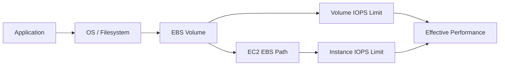
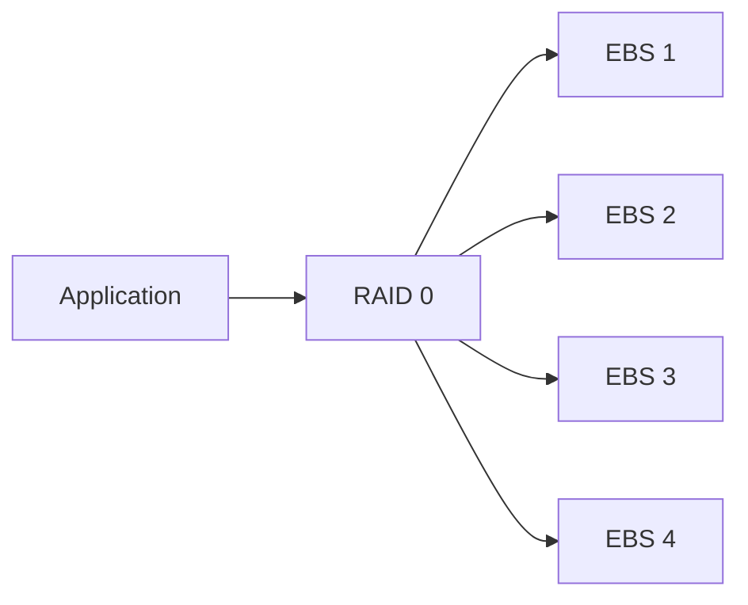
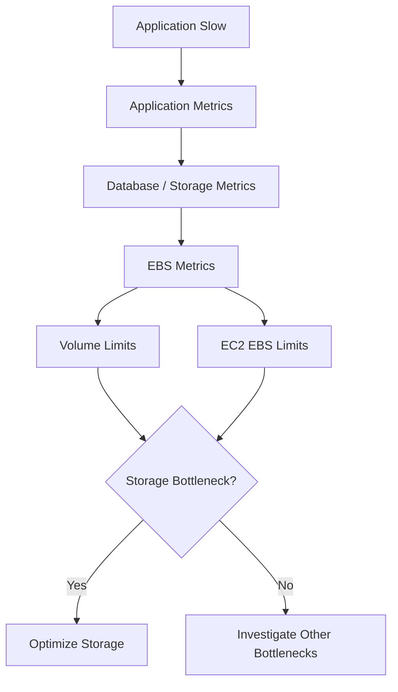
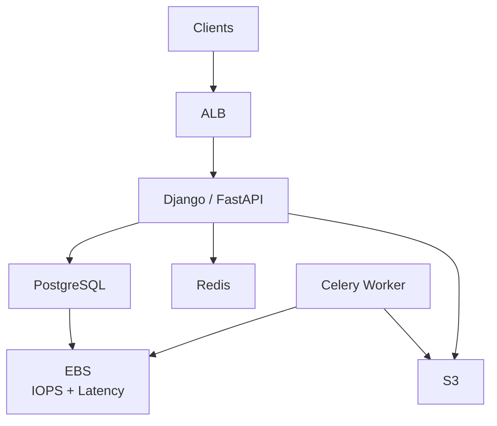
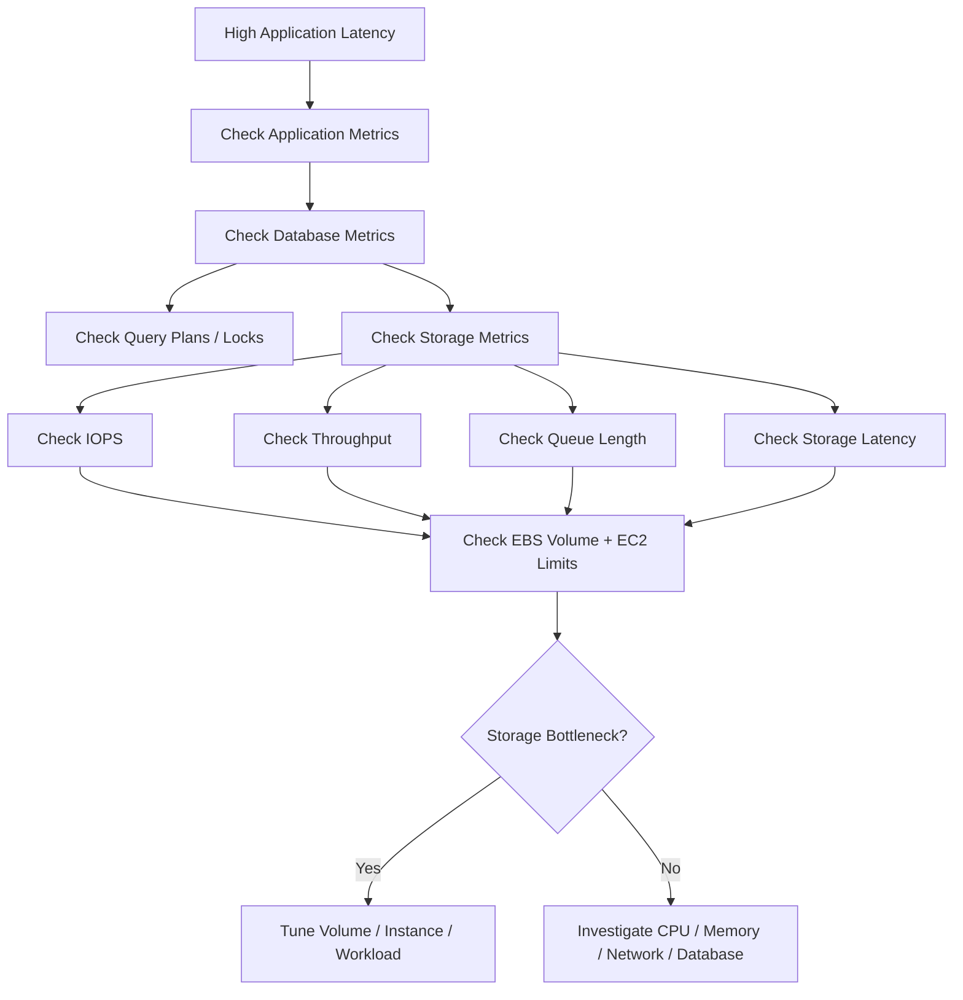

# 07- IOPS

## Overview

IOPS stands for **Input/Output Operations Per Second**. It measures how many storage I/O operations a storage system can complete per second.

For Amazon EC2, IOPS is particularly important when using Amazon EBS for workloads such as:

- PostgreSQL
- MySQL
- Redis persistence
- Kafka
- Search indexes
- High-volume transactional applications
- File-processing workloads
- Systems performing many small random reads and writes

IOPS is not the same as throughput or latency.

```text
IOPS       -> How many I/O operations per second
Throughput -> How much data per second
Latency    -> How long an individual I/O takes
```

A storage system can have high IOPS but insufficient throughput for large sequential transfers, or high throughput but poor performance for workloads dominated by small random I/O.

AWS defines IOPS as a measure of I/O operations per second, with the counted operation size depending on the EBS volume type and workload. :contentReference[oaicite:0]{index=0}

For EC2/EBS architecture, the practical question is not simply:

> "How many IOPS does my volume provide?"

It is:

> "What I/O pattern does my application generate, and can both the EBS volume and EC2 instance sustain that pattern?"

---

## IOPS, Throughput, and Latency

These three metrics describe different dimensions of storage performance.

| Metric | Meaning | Important For |
|---|---|---|
| IOPS | Operations per second | Small random I/O |
| Throughput | Data transferred per second | Large sequential I/O |
| Latency | Time required for an operation | Interactive and transactional workloads |
| Queue depth | Outstanding I/O requests | Saturated storage systems |

A useful mental model is:

```text
Application
    |
    +-- Request size
    +-- Read/write ratio
    +-- Random/sequential pattern
    +-- Concurrency
    |
    v
Storage subsystem
    |
    +-- IOPS
    +-- Throughput
    +-- Latency
```

All of these characteristics interact.

---

## What Is an I/O Operation?

An I/O operation is a read or write request issued to storage.

For example:

```text
Application
    |
    | Read 16 KiB
    v
EBS
```

If the workload performs:

```text
10,000 operations/second
```

then the workload is generating approximately:

```text
10,000 IOPS
```

However, the amount of data transferred depends on the size of each operation.

For example:

```text
10,000 IOPS × 16 KiB
```

is approximately:

```text
156.25 MiB/s
```

while:

```text
10,000 IOPS × 256 KiB
```

is approximately:

```text
2,500 MiB/s
```

Therefore, IOPS alone does not describe storage bandwidth.

---

## IOPS and Throughput Relationship

A useful approximation is:

```text
Throughput = IOPS × I/O Size
```

When using binary units:

```text
Throughput (MiB/s)
    = IOPS × I/O size (KiB) / 1024
```

Example:

```text
20,000 IOPS
× 16 KiB
----------------
312.5 MiB/s
```

Another example:

```text
20,000 IOPS
× 128 KiB
----------------
2,500 MiB/s
```

If the volume has a throughput ceiling below the calculated value, the workload cannot actually achieve that theoretical throughput.

Therefore:

```text
Effective performance
    =
min(
    IOPS capability,
    throughput capability,
    EC2 EBS capability,
    workload capability
)
```

This is one of the most important concepts in EBS performance engineering.

---

## Why IOPS Matters

IOPS becomes especially important when an application performs many relatively small operations.

Typical examples include:

```text
PostgreSQL
    |
    +-- Index lookups
    +-- Random page reads
    +-- WAL writes
    +-- Checkpoint activity
```

or:

```text
Redis
    |
    +-- Persistence
    +-- AOF writes
```

or:

```text
Application
    |
    +-- Many small file operations
```

These workloads can generate a large number of I/O operations without transferring enormous amounts of data.

---

## Random vs Sequential I/O

Storage workload patterns strongly influence the importance of IOPS.

### Random I/O

```text
Block 100
Block 9000
Block 52
Block 4300
Block 17
```

Random workloads frequently access unrelated locations.

Examples:

- Database indexes
- OLTP workloads
- Metadata-heavy applications
- Key-value stores

IOPS and latency are usually more important.

### Sequential I/O

```text
Block 100
Block 101
Block 102
Block 103
Block 104
```

Sequential workloads access adjacent data.

Examples:

- Large file reads
- Backups
- Data exports
- Media processing
- Large sequential scans

Throughput is usually more important.

AWS notes that SSD-backed EBS volumes are designed for both random and sequential workloads, while `st1` and `sc1` HDD volumes are optimized for large sequential I/O. :contentReference[oaicite:1]{index=1}

---

## IOPS and I/O Size

IOPS is always meaningful only in combination with I/O size.

Consider:

```text
10,000 IOPS × 4 KiB
```

versus:

```text
10,000 IOPS × 256 KiB
```

The operation count is identical, but the amount of transferred data is dramatically different.

This is why AWS EBS performance specifications often state the I/O size used for the advertised IOPS or throughput figures.

For example, current EBS specifications use 16 KiB I/O when describing maximum IOPS for many SSD volume types. :contentReference[oaicite:2]{index=2}

---

## IOPS and Latency

IOPS and latency are related but not interchangeable.

A simplified relationship is:

```text
IOPS ≈ concurrency / latency
```

More precisely, using consistent units:

```text
IOPS ≈ Outstanding I/O / Average latency
```

For example:

```text
100 outstanding requests
10 ms average latency

100 / 0.010
= 10,000 IOPS
```

This relationship explains why increasing concurrency can increase achieved IOPS until another bottleneck is reached.

However, increasing concurrency beyond the storage system's useful capacity can increase queue depth and latency without improving useful throughput.

---

## Queue Depth

Queue depth represents the number of outstanding I/O requests waiting to be processed.

Conceptually:

```text
Application
   |
   +-- I/O 1
   +-- I/O 2
   +-- I/O 3
   +-- I/O 4
   |
   v
I/O Queue
   |
   v
EBS
```

Low queue depth can indicate an application that is not generating enough concurrent I/O to fully utilize the volume.

Very high queue depth can indicate:

- Storage saturation
- Insufficient IOPS
- Insufficient throughput
- Application concurrency problems
- CPU scheduling limitations
- EBS instance bottlenecks

Queue depth should therefore be interpreted together with latency and utilization.

---

## EBS Volume Types and IOPS

The primary SSD EBS volume types relevant to IOPS are:

- `gp3`
- `gp2`
- `io1`
- `io2`

Current AWS limits include:

| Volume Type | Maximum IOPS per Volume | Maximum Throughput |
|---|---:|---:|
| `gp3` | 80,000 | 2,000 MiB/s |
| `gp2` | 16,000 | 250 MiB/s |
| `io1` | 64,000 | 1,000 MiB/s |
| `io2` | 256,000 | 4,000 MiB/s |

These are current EBS volume-level limits and actual achievable performance can also be constrained by the EC2 instance. :contentReference[oaicite:3]{index=3}

---

## gp3 IOPS

`gp3` separates storage capacity from IOPS and throughput.

A gp3 volume provides:

```text
Baseline:
3,000 IOPS
125 MiB/s
```

Additional IOPS and throughput can be provisioned independently, subject to current limits.

Current gp3 limits are:

```text
IOPS:
3,000 - 80,000

Throughput:
125 - 2,000 MiB/s
```

AWS states that gp3 does not use burst performance and can sustain its full provisioned IOPS and throughput indefinitely. :contentReference[oaicite:4]{index=4}

This separation is important.

For example:

```text
1 TiB gp3
+
16,000 IOPS
+
500 MiB/s
```

does not require the application to increase storage capacity simply to obtain additional IOPS.

---

## gp2 IOPS

`gp2` performance is tied to volume size.

The baseline relationship is approximately:

```text
3 IOPS per GiB
```

with a baseline of at least 100 IOPS and a maximum of 16,000 IOPS per volume.

Historically, gp2 also uses burst credits for volumes below the size required for sustained maximum baseline performance.

This creates an important architectural difference:

```text
gp2:
Capacity
   |
   v
Baseline IOPS
```

versus:

```text
gp3:
Capacity
   +
IOPS
   +
Throughput
```

For new general-purpose workloads, gp3 is often easier to size because capacity, IOPS, and throughput can be considered separately.

---

## io1 IOPS

`io1` is a Provisioned IOPS SSD volume designed for workloads requiring sustained IOPS performance.

Current maximum:

```text
64,000 IOPS per volume
```

with a maximum throughput of:

```text
1,000 MiB/s
```

AWS positions Provisioned IOPS volumes for I/O-intensive workloads, particularly workloads sensitive to consistent storage performance. :contentReference[oaicite:5]{index=5}

---

## io2 IOPS

`io2` is designed for demanding, latency-sensitive workloads.

Current `io2` Block Express capabilities include:

```text
Up to 256,000 IOPS
Up to 4,000 MiB/s
```

on supported Nitro-based configurations. AWS states that `io2` Block Express is designed for average latency below 500 microseconds for 16 KiB I/O operations. :contentReference[oaicite:6]{index=6}

Typical workloads include:

- High-performance databases
- Mission-critical transactional systems
- I/O-intensive enterprise applications
- Systems requiring consistent low latency

---

## Choosing IOPS vs Throughput

A common mistake is selecting a volume based solely on the largest IOPS number.

Instead, identify the workload.

| Workload | Primary Concern |
|---|---|
| PostgreSQL OLTP | IOPS + latency |
| MySQL OLTP | IOPS + latency |
| Large database scans | Throughput |
| Backup generation | Throughput |
| Log streaming | Throughput |
| Kafka broker storage | Throughput + latency + IOPS |
| Large ETL files | Throughput |
| Search indexes | IOPS + latency |
| Small-file workload | IOPS + latency |
| Media processing | Throughput |

For example:

```text
PostgreSQL
    |
    +-- Random 8-16 KiB reads/writes
    |
    +-- High concurrency
    |
    +-- Latency-sensitive
```

IOPS and latency matter more than simply maximizing sequential throughput.

---

## EBS Performance Has Multiple Bottlenecks

A volume's provisioned IOPS does not guarantee that an EC2 instance can consume all of them.

The effective performance is constrained by both:

```text
EBS volume
+
EC2 EBS bandwidth / IOPS limits
```

AWS explicitly states that an instance's EBS performance is bounded by the lower of the instance's performance limit and the aggregate performance of its attached EBS volumes. :contentReference[oaicite:7]{index=7}

Conceptually:



The lower limit wins.

---

## Example: Volume Bottleneck

Suppose:

```text
EC2 maximum EBS IOPS = 80,000

EBS volume:
20,000 IOPS
```

The application cannot obtain 80,000 IOPS from that single volume.

Effective ceiling:

```text
20,000 IOPS
```

---

## Example: Instance Bottleneck

Suppose:

```text
EBS volume:
80,000 provisioned IOPS

EC2 instance:
40,000 maximum EBS IOPS
```

The instance becomes the bottleneck.

Effective performance:

```text
40,000 IOPS
```

Provisioning more IOPS on the volume does not solve the problem.

The EC2 instance itself must support the required EBS performance.

---

## Multiple EBS Volumes

Multiple EBS volumes can be attached to an EC2 instance.

Conceptually:

```text
EC2
 |
 +-- EBS 1 -> 20,000 IOPS
 +-- EBS 2 -> 20,000 IOPS
 +-- EBS 3 -> 20,000 IOPS
 +-- EBS 4 -> 20,000 IOPS
 |
 v
Aggregate = 80,000 IOPS
```

AWS documents that the aggregate performance of attached volumes can be used to reach the instance's EBS performance ceiling. :contentReference[oaicite:8]{index=8}

However, the application must actually be able to distribute I/O across those volumes.

This can involve:

- LVM
- RAID
- Database-level striping
- Multiple mount points
- Application-specific distribution

Simply attaching four volumes does not automatically make one filesystem four times faster.

---

## RAID 0 for IOPS Scaling

For specialized workloads, multiple EBS volumes can be striped using RAID 0.



Potential benefits:

- Higher aggregate IOPS
- Higher aggregate throughput
- Larger aggregate capacity

Major limitation:

```text
RAID 0
  +
Any volume failure
  =
Array failure
```

For persistent data, backups and recovery procedures remain essential.

For many workloads, selecting a larger or more capable single EBS volume may be operationally simpler than building a striped array.

---

## PostgreSQL Example

Consider PostgreSQL running on EC2.

```text
Application
    |
    v
PostgreSQL
    |
    +-- Data files
    +-- Indexes
    +-- WAL
    |
    v
EBS
```

An OLTP workload may generate:

```text
Many small random reads
+
Many small random writes
+
WAL writes
```

This makes:

```text
IOPS
+
Latency
```

more important than simply maximizing sequential throughput.

A useful investigation sequence is:

```text
Database latency
      |
      v
PostgreSQL I/O statistics
      |
      v
EBS CloudWatch metrics
      |
      v
Volume IOPS / throughput
      |
      v
EC2 EBS limits
```

Do not immediately increase IOPS without establishing that storage is actually the bottleneck.

---

## IOPS and PostgreSQL

PostgreSQL can generate significant random I/O through:

- Index lookups
- Shared-buffer misses
- WAL activity
- Checkpoints
- Autovacuum
- Temporary files
- Sequential scans

Before increasing EBS IOPS, inspect PostgreSQL behavior.

For example:

```sql
SELECT
    datname,
    blks_read,
    blks_hit
FROM pg_stat_database;
```

A storage bottleneck may actually be caused by:

- Poor indexes
- Inefficient queries
- Insufficient PostgreSQL shared buffers
- Excessive sequential scans
- Poor connection management
- Checkpoint configuration

Storage optimization should therefore be performed after application and database-level investigation.

---

## IOPS and Redis

Redis is primarily memory-based, so EBS IOPS are usually not the primary runtime performance metric.

However, storage becomes relevant for:

- RDB snapshots
- AOF persistence
- Replication-related disk activity
- Restart/recovery
- Background persistence

For Redis persistence:

```text
Redis
 |
 +-- RAM -> Primary runtime path
 |
 +-- EBS -> Persistence path
```

A storage bottleneck may affect persistence and recovery without directly representing normal Redis command latency.

---

## IOPS and Kafka

Kafka storage performance depends on:

- Sequential writes
- Sequential reads
- Page cache behavior
- Replication
- Segment rolling
- Consumer fetch patterns

Kafka should not be evaluated using IOPS alone.

For many Kafka workloads:

```text
Throughput
+
Latency
+
Disk utilization
```

are more informative than a single IOPS number.

Kafka's distributed replication model also means storage architecture must be evaluated together with:

- Broker count
- Replication factor
- Partition distribution
- Recovery traffic
- Network bandwidth

---

## Measuring IOPS on Linux

Use `iostat` to inspect device-level behavior.

Install the relevant package if necessary:

```bash
sudo dnf install -y sysstat
```

Run:

```bash
iostat -xz 1
```

Important columns include:

- `r/s`
- `w/s`
- `rkB/s`
- `wkB/s`
- `await`
- `%util`

Interpret these in context.

For example:

```text
r/s + w/s
```

approximates the number of completed read/write operations per second observed by the device.

`await` provides an indication of I/O request latency.

High `%util` can indicate a busy device, but it should not be treated as a universal definition of saturation across every storage configuration.

---

## Benchmarking with fio

`fio` is commonly used to benchmark storage behavior.

Example random-read test:

```bash
sudo fio \
    --name=randread \
    --filename=/mnt/ebs/testfile \
    --size=10G \
    --bs=16k \
    --rw=randread \
    --iodepth=32 \
    --numjobs=4 \
    --direct=1 \
    --runtime=60 \
    --time_based \
    --group_reporting
```

Example random-write test:

```bash
sudo fio \
    --name=randwrite \
    --filename=/mnt/ebs/testfile \
    --size=10G \
    --bs=16k \
    --rw=randwrite \
    --iodepth=32 \
    --numjobs=4 \
    --direct=1 \
    --runtime=60 \
    --time_based \
    --group_reporting
```

For production testing:

- Use a non-production volume.
- Use a workload representative of the real application.
- Test different block sizes.
- Test realistic read/write ratios.
- Test different queue depths.
- Monitor CPU and network usage.
- Account for filesystem and caching behavior.
- Avoid destructive testing against live application data.

---

## Benchmarking Pitfalls

A benchmark can produce misleading results.

### Testing an Empty Cache

The operating-system page cache can make reads appear faster than actual storage performance.

### Using Unrealistic I/O Sizes

A database workload using 8–16 KiB I/O should not be benchmarked only with 1 MiB sequential requests.

### Insufficient Queue Depth

A benchmark may fail to generate enough concurrent requests to saturate the storage.

### Excessive Queue Depth

Artificially high concurrency may produce unrealistic latency and queueing behavior.

### Testing the Wrong Device

On Nitro instances, EBS devices commonly appear as NVMe devices.

Always verify the target device before running tests.

---

## CloudWatch Monitoring

EBS publishes volume-level CloudWatch metrics that are useful for diagnosing I/O performance.

Important metrics include:

- `VolumeReadOps`
- `VolumeWriteOps`
- `VolumeReadBytes`
- `VolumeWriteBytes`
- `VolumeQueueLength`
- `VolumeThroughputPercentage`
- `VolumeConsumedReadWriteOps`
- `BurstBalance` where applicable

The exact metrics available depend on the volume type.

A useful operational view is:

```text
IOPS
 |
 +-- Read operations
 +-- Write operations
 |
Throughput
 |
 +-- Read bytes
 +-- Write bytes
 |
Queue
 |
 +-- Outstanding I/O
 |
Latency
 |
 +-- Application/database latency
```

---

## Monitoring the Bottleneck

Suppose an application is slow.

Do not immediately increase EBS IOPS.

Investigate:



Potential non-storage bottlenecks include:

- CPU
- Memory
- Database locks
- Network
- Application code
- Connection pools
- Garbage collection
- External services

---

## EBS Volume Queue Length

Queue length measures pending I/O.

Conceptually:

```text
Application
     |
     v
+----------------+
| I/O Queue      |
|                |
|  request 1     |
|  request 2     |
|  request 3     |
+----------------+
     |
     v
EBS
```

If queue length consistently increases while latency increases, the storage system may not be keeping up with workload demand.

However, queue length alone is not enough to diagnose an IOPS shortage.

Always correlate it with:

- Provisioned IOPS
- Actual IOPS
- Throughput
- Latency
- Instance EBS limits
- Application workload

---

## IOPS Saturation

A simplified saturation pattern is:

```text
Demand
  |
  v
10k -> 20k -> 30k -> 40k -> 50k
                              |
                              v
                        IOPS ceiling
                              |
                              v
                         Queue grows
                              |
                              v
                         Latency grows
```

Once storage reaches its effective limit:

```text
More requests
    !=
More completed I/O
```

Instead, requests wait longer.

---

## IOPS and Latency Trade-offs

Increasing provisioned IOPS can reduce queueing when IOPS is the actual bottleneck.

But it does not guarantee lower application latency.

For example:

```text
Application
   |
   +-- CPU-bound
   +-- Lock-bound
   +-- Network-bound
   +-- Storage-bound
```

Increasing storage performance only helps the last case.

Senior-level performance analysis starts with identifying the bottleneck rather than tuning the most visible metric.

---

## EBS-Optimized EC2 Instances

EBS-optimized instances provide dedicated bandwidth for EBS traffic and reduce contention between EBS I/O and other instance traffic.

AWS states that an EBS-optimized instance's EBS performance is bounded by the lower of:

```text
Instance EBS performance
```

and:

```text
Aggregate attached-volume performance
```

:contentReference[oaicite:9]{index=9}

Modern EC2 instance types are commonly EBS-optimized by default, but instance-specific limits still matter.

Before selecting an EC2 instance for a high-IOPS workload, inspect:

- Maximum EBS IOPS
- Maximum EBS throughput
- Baseline EBS performance
- Number of supported EBS volumes
- Nitro support

---

## Instance-Level IOPS Bottleneck

Consider:

```text
EBS Volume:
80,000 IOPS

EC2:
60,000 maximum EBS IOPS
```

The application cannot obtain 80,000 IOPS through that instance.

The effective ceiling is approximately:

```text
60,000 IOPS
```

Provisioning a more capable volume without changing the instance does not solve the bottleneck.

---

## Volume-Level IOPS Bottleneck

Conversely:

```text
EC2:
100,000 maximum EBS IOPS

EBS:
20,000 provisioned IOPS
```

The volume becomes the bottleneck.

Effective performance:

```text
20,000 IOPS
```

The solution may be:

- Increase volume IOPS
- Use a more suitable volume type
- Stripe multiple volumes
- Change the workload
- Optimize the application

---

## Cost Considerations

Higher IOPS generally increases EBS cost for volume types where IOPS is separately provisioned.

This creates an optimization problem:

```text
Required performance
        |
        v
Minimum required IOPS
        |
        v
Minimum required EC2 EBS capability
        |
        v
Minimum required cost
```

Avoid:

```text
Maximum IOPS
+
Maximum throughput
+
Oversized EC2
```

unless the workload actually requires it.

For example, a workload needing:

```text
8,000 IOPS
+
300 MiB/s
```

does not automatically benefit from:

```text
80,000 IOPS
+
2,000 MiB/s
```

Provisioning should be based on measured requirements.

---

## IOPS Right-Sizing

A practical right-sizing process is:

1. Measure current IOPS.
2. Measure peak IOPS.
3. Measure latency.
4. Measure throughput.
5. Identify read/write ratio.
6. Identify I/O size.
7. Check EBS volume limits.
8. Check EC2 EBS limits.
9. Add appropriate headroom.
10. Re-test under realistic load.

Example:

```text
Observed peak:
12,000 IOPS

Required headroom:
25%

Target:
15,000 IOPS
```

The exact headroom should be based on workload variability and business requirements rather than a universal percentage.

---

## Storage Architecture for Backend Systems

A production backend might look like:



Each storage system serves a different purpose:

```text
PostgreSQL -> transactional persistent storage
EBS        -> database block storage
Redis      -> memory/cache
S3         -> object storage
```

IOPS tuning belongs primarily to the storage paths where persistent block I/O is actually a bottleneck.

---

## IOPS and Application Architecture

Storage performance should be considered at the entire request path.

For a Django API:

```text
HTTP Request
    |
    v
Nginx / ALB
    |
    v
Django
    |
    v
PostgreSQL
    |
    v
EBS
```

An API request may experience:

```text
Network latency
+
Application processing
+
Database query time
+
Storage latency
```

If the database query is poorly indexed, increasing EBS IOPS may have little impact.

For example:

```sql
SELECT *
FROM orders
WHERE customer_id = 12345;
```

If `customer_id` lacks an appropriate index, the database may perform excessive reads.

Adding an index can reduce I/O demand more effectively than increasing EBS IOPS.

---

## Common Mistakes

### Treating IOPS as Throughput

```text
50,000 IOPS
```

does not mean:

```text
50,000 MB/s
```

**Avoid it:** always consider I/O size and throughput limits.

### Ignoring I/O Size

A workload using 4 KiB operations behaves differently from one using 256 KiB operations.

**Avoid it:** benchmark and monitor with realistic I/O sizes.

### Provisioning More IOPS Than the EC2 Instance Can Use

The EBS volume may support more IOPS than the instance.

**Avoid it:** check both volume and instance limits. :contentReference[oaicite:10]{index=10}

### Increasing IOPS Without Finding the Bottleneck

Application latency may be caused by CPU, memory, locks, queries, or network issues.

**Avoid it:** establish a measured storage bottleneck first.

### Ignoring Throughput

A volume can reach its throughput limit before reaching its IOPS limit.

**Avoid it:** monitor both IOPS and throughput.

### Assuming More Volumes Automatically Increase Performance

Multiple volumes help only when I/O can actually be distributed across them.

**Avoid it:** use appropriate striping or application-level distribution.

### Benchmarking With Unrealistic Workloads

A sequential benchmark does not represent a random database workload.

**Avoid it:** reproduce the application's actual read/write pattern.

### Ignoring Queue Depth

High latency can result from queued I/O even when provisioned IOPS appear sufficient.

**Avoid it:** inspect queue length and latency together.

### Using Maximum IOPS by Default

Maximum performance is not automatically the correct configuration.

**Avoid it:** right-size IOPS based on measurements and business requirements.

---

## Production Best Practices

### Measure Before Tuning

Collect:

```text
IOPS
Throughput
Latency
Queue depth
I/O size
Read/write ratio
CPU
Memory
Application latency
Database latency
```

### Monitor Both Volume and Instance Limits

A high-performance volume attached to an undersized EC2 instance can still be bottlenecked.

### Use gp3 Deliberately

For general-purpose SSD workloads, gp3 allows storage capacity, IOPS, and throughput to be considered independently. Current gp3 limits are 80,000 IOPS and 2,000 MiB/s. :contentReference[oaicite:11]{index=11}

### Use io2 for Demanding Workloads

Consider `io2` when the workload requires very high sustained IOPS, high durability, or consistent low latency. Current io2 Block Express volumes can provide up to 256,000 IOPS and 4,000 MiB/s on supported configurations. :contentReference[oaicite:12]{index=12}

### Keep Application and Storage Metrics Together

Correlate:

```text
API latency
    +
Database latency
    +
EBS latency
    +
EBS IOPS
    +
EBS throughput
```

This makes root-cause analysis substantially easier.

### Test Capacity Changes

When changing IOPS or volume types:

1. Establish a baseline.
2. Apply the change.
3. Re-run representative workloads.
4. Compare latency and throughput.
5. Confirm the bottleneck moved or disappeared.
6. Review the resulting cost.

---

## Practical Troubleshooting Workflow

When a production application reports high database latency:



This prevents storage tuning from becoming guesswork.

---

## Interview Considerations

### What is IOPS?

IOPS is the number of input/output operations that a storage system can process per second.

### Is higher IOPS always better?

No. The correct IOPS level depends on workload characteristics, I/O size, latency requirements, throughput requirements, and cost.

### What is the difference between IOPS and throughput?

IOPS measures operation count per second.

Throughput measures data transferred per second.

A useful approximation is:

```text
Throughput = IOPS × I/O Size
```

subject to storage and infrastructure limits.

### Which workloads care most about IOPS?

Workloads dominated by small random operations, such as OLTP databases and metadata-heavy applications, commonly care strongly about IOPS and latency.

### Which workloads care more about throughput?

Large sequential reads and writes, such as backups, large exports, and some data-processing workloads, commonly care more about throughput.

### Can an EBS volume provide its provisioned IOPS automatically?

Not necessarily at the application level. The EC2 instance's EBS performance limits can become the bottleneck. AWS states that effective EBS performance is bounded by the lower of aggregate volume performance and instance performance. :contentReference[oaicite:13]{index=13}

### Can multiple EBS volumes increase IOPS?

Yes, potentially. Their aggregate performance can exceed the performance of a single volume, but the EC2 instance and the application's storage architecture must also support the combined workload.

### Why might an application have high storage latency even when IOPS are below the provisioned maximum?

Possible causes include:

- High queue depth
- Instance EBS bottleneck
- Throughput saturation
- CPU contention
- Database locks
- Filesystem behavior
- Application-level serialization
- Network or infrastructure issues

### Why is gp3 easier to size than gp2?

gp3 separates storage capacity from provisioned IOPS and throughput, whereas gp2's baseline IOPS scales with volume size.

### When would io2 be appropriate?

For workloads requiring very high sustained IOPS, consistent low latency, or high durability requirements, particularly demanding database workloads. Current io2 Block Express volumes support up to 256,000 IOPS and 4,000 MiB/s on supported configurations. :contentReference[oaicite:14]{index=14}

## Key Takeaways

- IOPS measures storage operations per second; it must be evaluated together with I/O size, throughput, latency, and queue depth.
- EBS performance is constrained by both the volume's capabilities and the EC2 instance's EBS performance limits; the lower effective ceiling determines actual performance. :contentReference[oaicite:15]{index=15}
- `gp3` separates capacity, IOPS, and throughput, while `io2` is designed for demanding high-IOPS and low-latency workloads. :contentReference[oaicite:16]{index=16}
- Database and backend performance tuning should identify the actual bottleneck before increasing IOPS; query plans, CPU, memory, locks, network, and application behavior can all dominate latency.
- Production IOPS sizing should be measurement-driven, using realistic workload benchmarks and continuous monitoring of IOPS, throughput, latency, queue depth, and EC2 EBS limits.