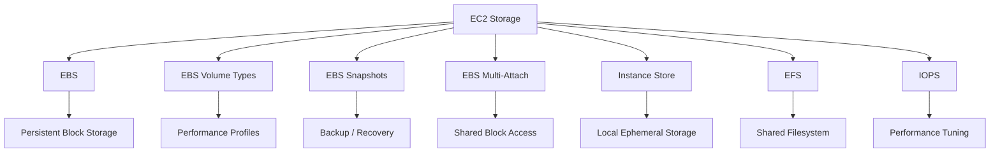
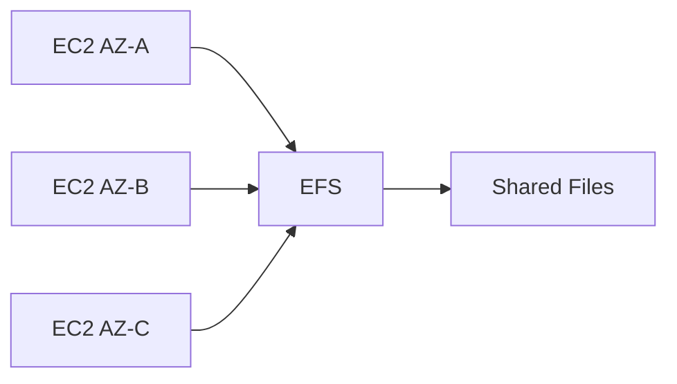
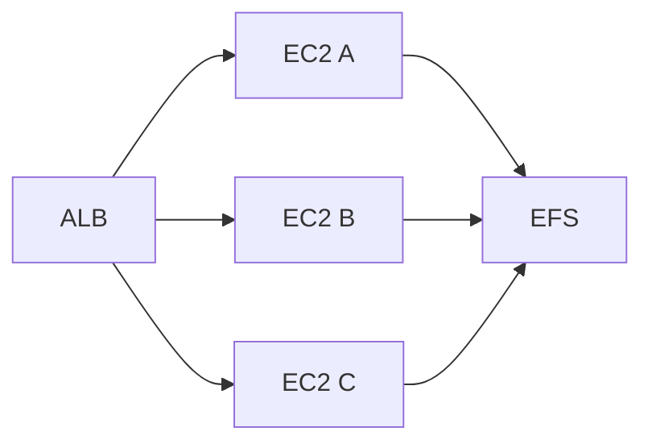
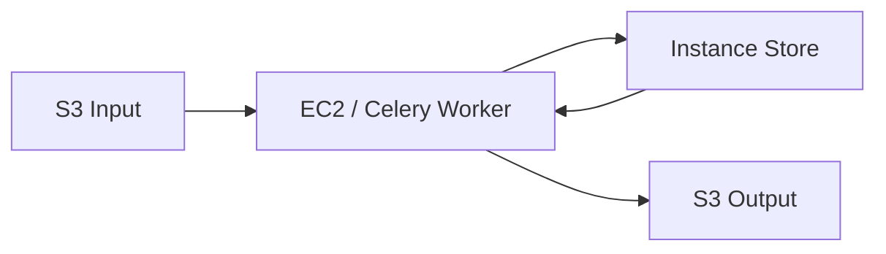

# README

## Overview

This section covers EC2 storage technologies and the performance characteristics that determine how applications should store, access, and scale data.

The focus is on understanding the differences between persistent block storage, temporary local storage, shared filesystems, and storage performance requirements.



The storage model should be selected based on:

- Persistence requirements
- Access pattern
- Block vs file vs object semantics
- Single-instance vs shared access
- IOPS requirements
- Throughput requirements
- Latency requirements
- Availability requirements
- Backup and recovery requirements
- Cost

---

## Navigation

| # | File | Description |
|---|---|---|
| 01 | [01- EBS](./01-%20EBS.md) | Persistent EC2 block storage, core EBS architecture, volumes, and lifecycle |
| 02 | [02- EBS Volume Types](./02-%20EBS%20Volume%20Types.md) | EBS volume types, performance characteristics, and workload selection |
| 03 | [03- EBS Snapshots](./03-%20EBS%20Snapshots.md) | Snapshot creation, backup, restore, and disaster recovery |
| 04 | [04- EBS Multi-Attach](./04-%20EBS%20Multi-Attach.md) | Multi-instance EBS attachment and shared-block-storage considerations |
| 05 | [05- Instance Store](./05-%20Instance%20Store.md) | Ephemeral local storage and high-performance scratch workloads |
| 06 | [06- EFS](./06-%20EFS.md) | Managed shared filesystem for multi-instance workloads |
| 07 | [07- IOPS](./07-%20IOPS.md) | IOPS, throughput, latency, queue depth, and storage performance |

## Storage Topics

| File | Topic | Primary Focus |
|---|---|---|
| `01- EBS.md` | Amazon EBS | Persistent block storage for EC2 |
| `02- EBS Volume Types.md` | EBS Volume Types | `gp3`, `gp2`, `io1`, `io2`, `st1`, `sc1`, and workload selection |
| `03- EBS Snapshots.md` | EBS Snapshots | Backup, restore, recovery, and snapshot lifecycle |
| `04- EBS Multi-Attach.md` | EBS Multi-Attach | Sharing supported EBS volumes across multiple EC2 instances |
| `05- Instance Store.md` | Instance Store | High-performance temporary local storage |
| `06- EFS.md` | Amazon EFS | Managed shared filesystem across EC2 and other compute resources |
| `07- IOPS.md` | IOPS | Storage performance, I/O patterns, throughput, latency, and sizing |

---

## Storage Decision Model

Use the storage access model rather than the product name as the starting point.

```text
What does the application need?
        |
        +-- Persistent block storage
        |       |
        |       +--> EBS
        |
        +-- Temporary local block storage
        |       |
        |       +--> Instance Store
        |
        +-- Shared persistent filesystem
        |       |
        |       +--> EFS
        |
        +-- Shared block access for specialized workloads
        |       |
        |       +--> EBS Multi-Attach
        |
        +-- Object storage
                |
                +--> S3
```

For most EC2-backed backend systems:

```text
PostgreSQL data       -> EBS
Temporary processing  -> Instance Store
Shared application FS -> EFS
User-uploaded objects -> S3
Cache                 -> Redis
```

The storage technology should match the application's data model rather than forcing every workload into a filesystem.

---

## EBS

`01- EBS.md` covers Amazon Elastic Block Store and its role as persistent block storage for EC2.

Key concepts include:

- EBS architecture
- Volume lifecycle
- Root and data volumes
- Volume attachment
- Volume resizing
- Encryption
- Performance
- Availability
- Backup
- Recovery
- Auto Scaling considerations

EBS is commonly used for:

- PostgreSQL
- MySQL
- Application state
- Persistent application files
- EC2 operating-system volumes

The key architectural property is that the EBS volume has an independent lifecycle from the compute instance.

```text
EC2 Instance
     |
     v
EBS Volume
     |
     v
Persistent Data
```

---

## EBS Volume Types

`02- EBS Volume Types.md` focuses on selecting the appropriate EBS volume type.

Important families include:

```text
General Purpose SSD
    |
    +-- gp3
    +-- gp2

Provisioned IOPS SSD
    |
    +-- io2
    +-- io1

HDD
    |
    +-- st1
    +-- sc1
```

Selection should consider:

- IOPS
- Throughput
- Latency
- Capacity
- Workload pattern
- Durability
- Cost

For new general-purpose workloads, `gp3` is often attractive because storage capacity, IOPS, and throughput can be configured independently.

For demanding database workloads requiring high sustained IOPS and low latency, `io2` may be appropriate.

---

## EBS Snapshots

`03- EBS Snapshots.md` covers EBS snapshot-based backup and recovery.

Important topics include:

- Incremental snapshots
- Snapshot consistency
- Snapshot lifecycle
- Multi-volume backups
- Cross-Region copies
- Encryption
- Restore workflows
- Fast Snapshot Restore
- Data Lifecycle Manager
- AWS Backup
- Recovery Point Objective
- Recovery Time Objective

The architectural model is:

```text
EBS Volume
    |
    v
EBS Snapshot
    |
    +-- Backup
    +-- Restore
    +-- Copy
    +-- Disaster Recovery
```

Snapshots should be treated as part of a tested recovery strategy rather than simply as a backup checkbox.

---

## EBS Multi-Attach

`04- EBS Multi-Attach.md` covers specialized EBS configurations that allow supported EBS volumes to be attached to multiple EC2 instances within the same Availability Zone.

The critical design concern is concurrency.

```text
EC2-A ----+
          |
EC2-B ----+----> Multi-Attach EBS
          |
EC2-C ----+
```

Multi-Attach does not automatically make an ordinary filesystem safe for concurrent writes.

Applications need an appropriate coordination mechanism, such as:

- Cluster-aware filesystems
- Storage fencing
- Application-level coordination
- Distributed locking

This is a specialized architecture and should not be confused with EFS, which provides shared filesystem semantics.

---

## Instance Store

`05- Instance Store.md` covers temporary local storage physically attached to the EC2 host.

The fundamental characteristic is:

```text
High-performance local storage
        +
Ephemeral lifecycle
```

Instance Store is appropriate for:

- Cache
- Scratch space
- Temporary processing
- ETL intermediates
- Build workspace
- Rebuildable indexes
- Replicated distributed-system data

It should not be the only location for authoritative business data.

```text
Instance Store
      |
      +-- Temporary data
      +-- Rebuildable data
      +-- Cached data

Durable state
      |
      +-- EBS
      +-- EFS
      +-- S3
      +-- Database
```

A production system should remain recoverable when an EC2 instance and all of its local Instance Store data disappear.

---

## EFS

`06- EFS.md` covers Amazon Elastic File System.

EFS provides a managed shared filesystem that can be mounted concurrently by multiple compute resources.



EFS is useful when applications require:

- Shared filesystem access
- Persistent files
- POSIX filesystem semantics
- Multi-instance access
- Multi-AZ application architectures
- Shared application media
- Shared processing directories

For cloud-native object storage use cases, S3 may be more appropriate than EFS.

---

## IOPS

`07- IOPS.md` covers storage performance and how to reason about EBS I/O.

Important concepts include:

```text
IOPS
Throughput
Latency
I/O Size
Queue Depth
Random I/O
Sequential I/O
```

The basic relationship is:

```text
Throughput ≈ IOPS × I/O Size
```

subject to the limits of the volume, EC2 instance, filesystem, and workload.

IOPS is particularly important for:

- OLTP databases
- PostgreSQL
- MySQL
- Random-read workloads
- Random-write workloads
- Metadata-heavy applications

Throughput may matter more for:

- Large sequential reads
- Large sequential writes
- Backups
- Data exports
- ETL
- Media processing

Storage performance should always be measured against the actual application workload.

---

## Storage Comparison

| Requirement | EBS | Instance Store | EFS | S3 |
|---|---|---|---|---|
| Persistent | Yes | No | Yes | Yes |
| Block storage | Yes | Yes | No | No |
| Filesystem | Via OS filesystem | Via OS filesystem | Yes | No |
| Shared across EC2 | Normally no | No | Yes | API-based |
| Local to EC2 host | No | Yes | No | No |
| High local performance | No | Yes | No | No |
| Database storage | Strong fit | Specialized only | Usually not | No |
| Shared application files | Limited | No | Strong fit | Alternative |
| Object storage | No | No | No | Strong fit |
| Temporary scratch | Possible | Strong fit | Possible | Possible |
| Independent lifecycle | Yes | No | Yes | Yes |

---

## Backend Engineering Patterns

### Stateful Database


Use EBS for persistent database storage and select volume performance based on measured database I/O requirements.

### Shared Application Files



Use EFS when multiple application instances require the same filesystem.

### Temporary Processing



Use Instance Store for temporary high-performance processing while keeping authoritative data in durable storage.

---

## Storage Selection Checklist

Before selecting an EC2 storage technology, determine:

```text
[ ] Does the data need to survive EC2 replacement?
[ ] Is block storage required?
[ ] Is filesystem semantics required?
[ ] Does more than one instance need concurrent access?
[ ] Is the data temporary or authoritative?
[ ] What is the expected I/O size?
[ ] Is the workload random or sequential?
[ ] What IOPS are required?
[ ] What throughput is required?
[ ] What latency is acceptable?
[ ] What are the EC2 instance EBS limits?
[ ] What backup strategy is required?
[ ] What is the recovery objective?
[ ] What are the security requirements?
[ ] What is the expected storage growth?
[ ] What is the cost model?
```

---

## Production Considerations

Storage architecture should be evaluated together with the rest of the system.

For a typical backend platform:

```text
                    +-- PostgreSQL
                    |       |
                    |      EBS
                    |
API --> Services ---+-- Redis
                    |
                    +-- S3
                    |
                    +-- EFS
```

Each storage system should have a clearly defined responsibility.

Avoid using one storage technology simply because it is already available.

Production storage design should account for:

- Availability
- Durability
- Performance
- Scalability
- Security
- Monitoring
- Backup
- Disaster recovery
- Cost
- Operational complexity

---

## Navigation

| Resource | Description |
|---|---|
| [01- EBS](01-%20EBS.md) | Persistent EC2 block storage and core EBS architecture |
| [02- EBS Volume Types](02-%20EBS%20Volume%20Types.md) | EBS volume types, performance characteristics, and selection |
| [03- EBS Snapshots](03-%20EBS%20Snapshots.md) | Snapshot creation, backup, restore, and disaster recovery |
| [04- EBS Multi-Attach](04-%20EBS%20Multi-Attach.md) | Multi-instance EBS attachment and shared-block-storage considerations |
| [05- Instance Store](05-%20Instance%20Store.md) | Ephemeral local storage and high-performance scratch workloads |
| [06- EFS](06-%20EFS.md) | Managed shared filesystem for multi-instance workloads |
| [07- IOPS](07-%20IOPS.md) | IOPS, throughput, latency, queue depth, and storage performance |
| [README](README.md) | Storage section overview |

## Key Takeaways

- **EBS** provides persistent block storage, **Instance Store** provides ephemeral local storage, and **EFS** provides a persistent shared filesystem.
- Storage selection should be driven by access semantics, persistence, sharing requirements, IOPS, throughput, latency, reliability, and cost.
- EBS performance must be evaluated at both the volume and EC2 instance levels; IOPS alone does not describe storage performance.
- Multi-AZ and Auto Scaling architectures require storage that remains independent of individual EC2 instance lifecycles.
- Production storage designs should include monitoring, backup, recovery testing, security controls, capacity planning, and explicit failure handling.