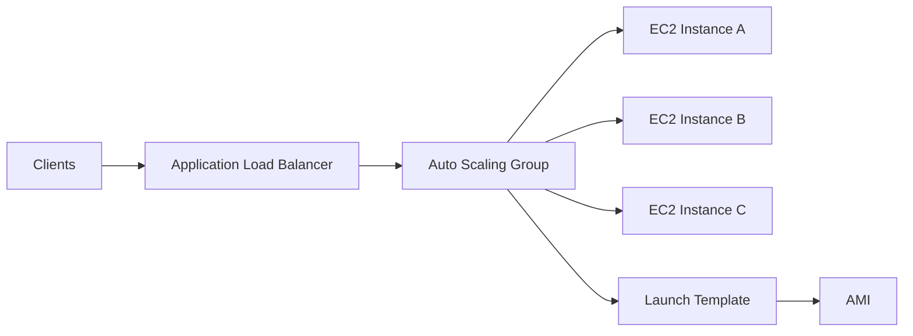
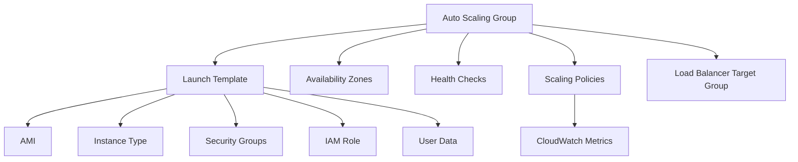
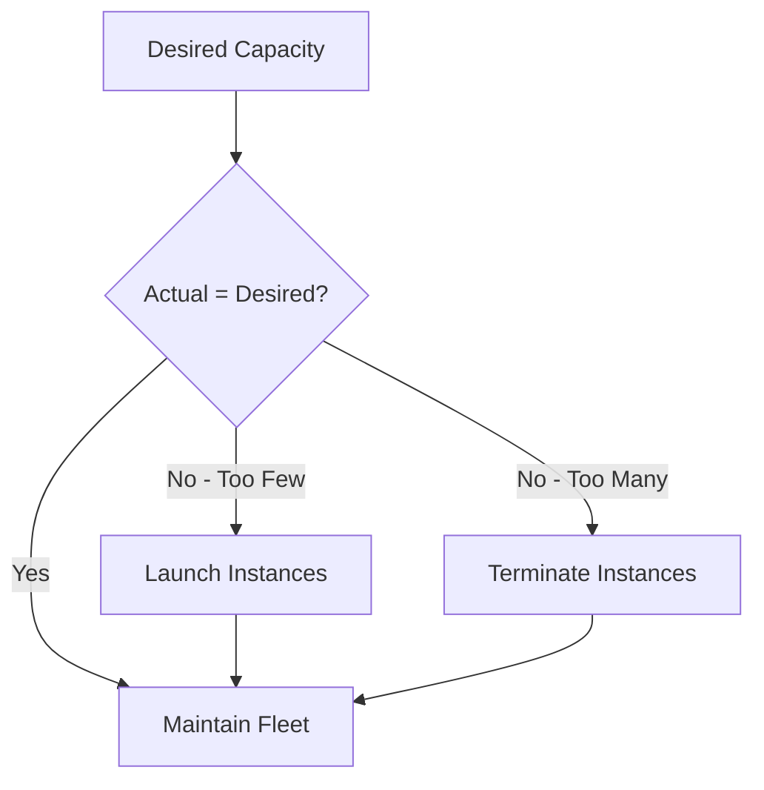
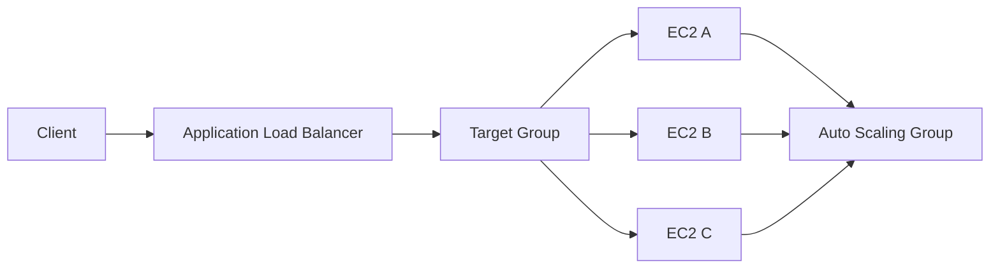
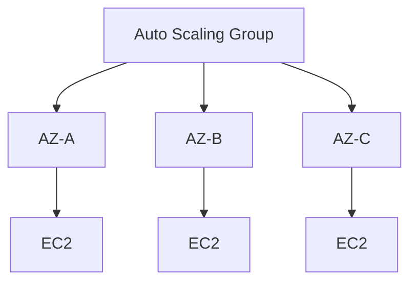
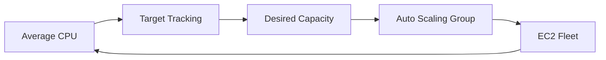
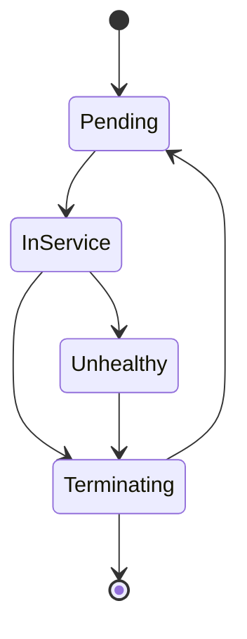
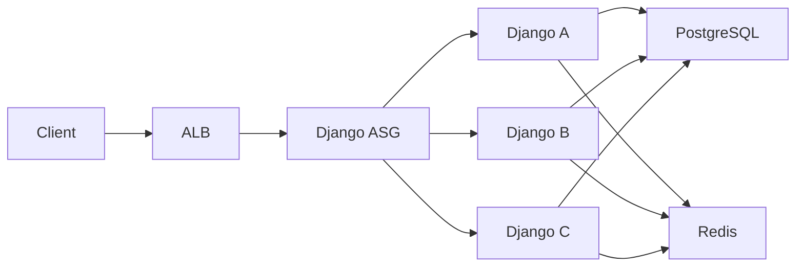
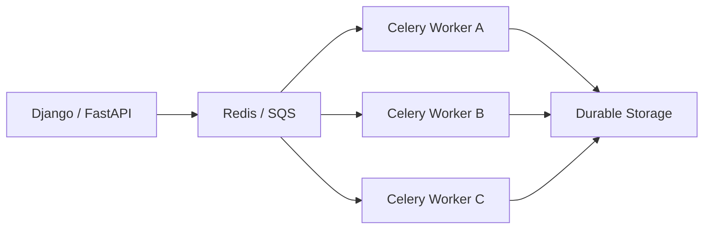
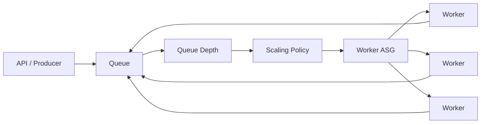

# 01- Auto Scaling Groups

## Overview

Amazon EC2 Auto Scaling Groups (ASGs) provide a managed mechanism for maintaining a fleet of EC2 instances at a desired capacity while automatically replacing unhealthy instances and adjusting capacity based on demand.

An Auto Scaling Group is not simply an instance launcher. It is a control plane for managing a fleet of interchangeable EC2 instances.

A typical production architecture is:



The ASG determines:

- How many instances should exist
- The minimum capacity
- The maximum capacity
- The desired capacity
- Which launch configuration to use
- Which Availability Zones to use
- How unhealthy instances are replaced
- How instances are added or removed
- Which scaling policies control capacity changes

For backend systems, the most important architectural principle is:

> An Auto Scaling Group should manage replaceable, preferably stateless compute.

Persistent state should generally live outside the individual EC2 instance.

---

## Why Auto Scaling Groups Exist

Without an ASG, an application fleet might require manual operations:

```text
Traffic increases
    |
    v
Application overloaded
    |
    v
Engineer launches another EC2
    |
    v
Engineer configures instance
    |
    v
Engineer registers instance
```

With an ASG:

```text
Traffic increases
    |
    v
Scaling policy
    |
    v
Desired capacity increases
    |
    v
ASG launches EC2 instances
    |
    v
Instances register with target group
```

Similarly, if an instance becomes unhealthy:

```text
EC2 unhealthy
    |
    v
ASG detects failure
    |
    v
Instance terminated/replaced
    |
    v
New EC2 launched
```

This reduces manual intervention and makes the compute layer more resilient.

---

## Core Auto Scaling Group Components

An ASG typically works together with several AWS components:



| Component | Responsibility |
|---|---|
| Auto Scaling Group | Fleet lifecycle and desired capacity |
| Launch Template | Defines how instances are launched |
| AMI | Base operating-system/application image |
| Instance Type | CPU, memory, network, and EBS capabilities |
| Subnets | Availability Zone placement |
| Security Groups | Network access control |
| IAM Role | Instance permissions |
| Target Group | Load balancer registration |
| Health Checks | Instance health evaluation |
| Scaling Policies | Capacity adjustment |
| CloudWatch | Metrics and alarms |

---

## Desired, Minimum, and Maximum Capacity

An ASG has three fundamental capacity settings.

| Setting | Meaning |
|---|---|
| Desired capacity | Number of instances the ASG attempts to maintain |
| Minimum capacity | Lowest number of instances normally allowed |
| Maximum capacity | Highest number of instances the ASG can scale to |

Example:

```text
Min = 2
Desired = 4
Max = 10
```

The normal state is:

```text
4 instances
```

The ASG should not normally scale below:

```text
2 instances
```

or above:

```text
10 instances
```

unless an operational action explicitly changes these limits.

---

## Capacity Control Model

The ASG continuously attempts to converge actual capacity toward desired capacity.



For example:

```text
Desired = 4
Actual  = 3

ASG
 |
 +--> Launch 1 instance
 |
 v
Actual = 4
```

If an instance terminates unexpectedly:

```text
Desired = 4
Actual  = 3
      |
      v
ASG launches replacement
      |
      v
Actual = 4
```

This reconciliation behavior is fundamental to Auto Scaling.

---

## Launch Templates

A Launch Template defines how new EC2 instances should be created.

Typical configuration includes:

- AMI
- Instance type
- Key pair
- Security groups
- IAM instance profile
- EBS configuration
- User Data
- Network configuration
- Metadata options
- Monitoring configuration

Conceptually:

```text
Launch Template
       |
       +-- AMI
       +-- Instance Type
       +-- Security Group
       +-- IAM Role
       +-- EBS
       +-- User Data
       |
       v
EC2 Instance
```

Create a launch template:

```bash
aws ec2 create-launch-template \
    --launch-template-name backend-api \
    --launch-template-data '{
        "ImageId": "ami-0123456789abcdef0",
        "InstanceType": "t3.medium",
        "SecurityGroupIds": ["sg-0123456789abcdef0"],
        "IamInstanceProfile": {
            "Name": "backend-ec2-role"
        }
    }'
```

Launch templates should be treated as versioned infrastructure definitions rather than manually modified server configurations.

---

## Launch Template Versions

Launch templates support versions.

For example:

```text
Version 1
    |
    +-- AMI A
    +-- Python 3.11

Version 2
    |
    +-- AMI B
    +-- Python 3.12
```

An ASG can reference a specific version or a version-selection strategy.

A controlled deployment might use:

```text
Launch Template
      |
      +-- v1 -> old application
      +-- v2 -> new application
      |
      v
ASG
```

This supports predictable instance replacement and infrastructure rollouts.

---

## Immutable Infrastructure

ASGs work particularly well with immutable infrastructure.

Instead of:

```text
Existing EC2
    |
    +-- SSH
    +-- Update Python
    +-- Update packages
    +-- Deploy code
```

prefer:

```text
Build AMI
   |
   v
New Launch Template Version
   |
   v
ASG rollout
   |
   v
New EC2 instances
```

This reduces configuration drift.

For backend platforms, an AMI can contain:

- Operating system
- Python runtime
- Nginx
- Application dependencies
- Monitoring agent
- Application release

Then User Data can perform only environment-specific initialization.

---

## Auto Scaling and Load Balancers

ASGs commonly integrate with Elastic Load Balancing.



When the ASG launches a new instance:

```text
ASG launches instance
       |
       v
Instance initializes
       |
       v
Instance registered with target group
       |
       v
Health check passes
       |
       v
ALB sends traffic
```

This allows application capacity to scale without manually updating the load balancer.

---

## Health Checks

ASGs use health checks to determine whether instances should remain in service.

Common health check sources include:

- EC2 status checks
- Elastic Load Balancing health checks

EC2 status checks determine whether the instance and underlying system are functioning correctly.

ELB health checks can verify application-level availability.

For example:

```text
EC2 Status
    |
    v
Instance infrastructure healthy

ALB Health Check
    |
    v
Application endpoint healthy
```

These checks answer different questions.

---

## Application Health Checks

Suppose a FastAPI application exposes:

```http
GET /health
```

A simple endpoint might return:

```json
{
  "status": "ok"
}
```

The load balancer can use this endpoint to determine whether the application is ready to receive traffic.

A stronger production design may distinguish:

```text
/health/live
/health/ready
```

For example:

```text
Liveness
    |
    +-- Process is running

Readiness
    |
    +-- Application initialized
    +-- Required dependencies available
```

Be careful not to make readiness checks depend on every optional downstream service, or temporary dependency degradation can remove the entire fleet from service.

---

## Health Check Grace Period

A newly launched instance may require time to:

- Boot
- Mount storage
- Start Docker
- Start Nginx
- Start Django/FastAPI
- Load configuration
- Warm caches
- Register with monitoring

The ASG health check grace period allows the instance time to initialize before health evaluation triggers replacement.

Without appropriate initialization time:

```text
Instance launches
    |
    v
Application still starting
    |
    v
Health check fails
    |
    v
ASG terminates instance
    |
    v
New instance launches
```

This can create a replacement loop.

---

## Availability Zones

A production ASG should normally span multiple Availability Zones.



This protects the application from losing all compute capacity when one Availability Zone experiences an issue.

For example:

```text
AZ-A -> 2 instances
AZ-B -> 2 instances
AZ-C -> 2 instances
```

is generally more resilient than:

```text
AZ-A -> 6 instances
```

for a multi-AZ production application.

---

## Subnet Selection

An ASG is associated with subnets that determine where instances can launch.

Example:

```text
ASG
 |
 +-- private-subnet-a
 +-- private-subnet-b
 +-- private-subnet-c
```

For a typical backend:

```text
Internet
    |
    v
ALB
    |
    v
Private EC2 ASG
```

Instances generally do not need public IP addresses when traffic enters through an ALB.

---

## Scaling Policies

Scaling policies determine when and how the ASG changes desired capacity.

Common strategies include:

- Target tracking
- Step scaling
- Simple scaling
- Scheduled scaling
- Predictive scaling

The policy should reflect the workload rather than simply increasing instances whenever CPU changes.

---

## Target Tracking

Target tracking attempts to maintain a target metric value.

For example:

```text
Target CPU = 50%
```

Conceptually:



If CPU rises significantly:

```text
CPU ↑
 |
 v
Scaling policy
 |
 v
Desired capacity ↑
 |
 v
Instances launched
 |
 v
Average CPU ↓
```

Target tracking is often a good starting point for straightforward workloads.

---

## Target Tracking with ALB Request Count

CPU is not always a good proxy for application load.

For web applications, request count per target can sometimes be more representative.

Example:

```text
ALB Request Count per Target
             |
             v
      Target Tracking
             |
             v
        ASG Capacity
```

This can be useful when:

- Requests are CPU-light
- Request volume varies substantially
- Application latency correlates with request concurrency
- CPU is not the primary bottleneck

The best metric is the one that correlates with user-facing capacity.

---

## Step Scaling

Step scaling changes capacity by different amounts depending on how far a metric moves beyond a threshold.

Example:

```text
CPU < 60%
    -> no scaling

CPU 60-75%
    -> +1 instance

CPU 75-90%
    -> +2 instances

CPU > 90%
    -> +4 instances
```

This allows more aggressive scaling during large demand spikes.

---

## Scheduled Scaling

Scheduled scaling changes capacity at known times.

Example:

```text
09:00 -> desired 10
18:00 -> desired 3
```

Useful for predictable workloads such as:

- Business-hour traffic
- Batch-processing windows
- Known daily peaks
- Scheduled campaigns

Scheduled scaling should complement dynamic scaling rather than replace it when demand remains unpredictable.

---

## Predictive Scaling

Predictive scaling can use historical workload patterns to forecast capacity requirements.

This can be useful for workloads with recurring demand patterns.

Conceptually:

```text
Historical Metrics
       |
       v
Forecast
       |
       v
Expected Capacity
       |
       v
ASG
```

Predictive scaling should be validated against actual workload behavior and should not be treated as a substitute for proper dynamic scaling and capacity limits.

---

## Desired Capacity Changes

Desired capacity can be modified directly through the AWS CLI.

```bash
aws autoscaling set-desired-capacity \
    --auto-scaling-group-name backend-api-asg \
    --desired-capacity 6
```

The ASG then attempts to converge to the new desired capacity.

```text
Desired = 6
Actual  = 3
    |
    v
Launch 3 instances
```

Direct desired-capacity changes are useful for operational tasks but should not replace automated scaling policies for normal production behavior.

---

## Minimum and Maximum Capacity

Modify minimum and maximum capacity:

```bash
aws autoscaling update-auto-scaling-group \
    --auto-scaling-group-name backend-api-asg \
    --min-size 2 \
    --max-size 10
```

Set desired capacity separately:

```bash
aws autoscaling set-desired-capacity \
    --auto-scaling-group-name backend-api-asg \
    --desired-capacity 4
```

A useful production configuration might be:

```text
Minimum = 2
Desired = 4
Maximum = 20
```

The actual values should be derived from:

- Baseline traffic
- Failure tolerance
- Startup time
- Maximum expected load
- Cost constraints
- Downstream capacity

---

## Scaling Cooldowns and Stabilization

Scaling decisions should not cause continuous oscillation.

A problematic pattern is:

```text
Scale out
   |
   v
CPU falls
   |
   v
Scale in
   |
   v
CPU rises
   |
   v
Scale out
```

This is known as scaling thrashing.

Stabilization mechanisms, target tracking behavior, instance warm-up, and appropriate policy configuration help prevent unnecessary oscillation.

Scaling should account for instance startup time.

If an EC2 instance takes three minutes to become useful, scaling logic should not assume capacity becomes available immediately.

---

## Instance Warm-Up

New instances often require time before contributing meaningful capacity.

Example:

```text
Launch
  |
  v
OS boot
  |
  v
Application startup
  |
  v
Health check
  |
  v
Traffic
```

The scaling system should account for this warm-up period.

This is especially important for:

- Large Docker images
- JVM applications
- Python applications with substantial startup work
- Large cache warm-up
- Model loading
- Dependency initialization

---

## Instance Lifecycle

An ASG controls the lifecycle of its instances.

A simplified lifecycle is:



The actual AWS lifecycle contains additional states and behavior, but the important concept is that the ASG continuously manages fleet membership.

---

## Instance Refresh

Instance Refresh provides a mechanism for replacing existing instances with instances based on a newer launch template configuration.

Typical use case:

```text
Current Fleet
    |
    +-- AMI v1
    |
    v
New AMI v2
    |
    v
Launch Template v2
    |
    v
Instance Refresh
    |
    v
Fleet gradually replaced
```

This is useful for:

- OS updates
- Application releases
- Runtime upgrades
- Security patches
- Configuration changes

Instance Refresh is preferable to manually replacing production instances one by one.

---

## Rolling Replacement

A production refresh should avoid taking the entire fleet offline.

Conceptually:

```text
Before:
A v1
B v1
C v1
D v1

Refresh:
A v2
B v1
C v1
D v1

A v2
B v2
C v1
D v1

A v2
B v2
C v2
D v1

After:
A v2
B v2
C v2
D v2
```

The exact replacement behavior depends on the configured instance-refresh strategy and health requirements.

---

## Deployment Strategy

ASGs can be part of a broader deployment strategy.

For example:

```text
CI/CD
  |
  v
Build AMI
  |
  v
Create Launch Template Version
  |
  v
Instance Refresh
  |
  v
Health Checks
  |
  v
New Fleet
```

This separates application deployment from manual server modification.

For more advanced release strategies, ASGs can also participate in:

- Blue/green deployments
- Canary releases
- Weighted traffic migration
- CodeDeploy workflows

---

## Stateless Application Design

ASGs work best when instances are disposable.

A typical backend architecture should look like:

```text
EC2 Instance
    |
    +-- Application code
    +-- Temporary files
    +-- Local cache
    |
    X
    |
No authoritative business state
```

Durable state should live in managed or separately persistent services:

```text
PostgreSQL -> Database state
S3         -> Object state
Redis      -> Cache
SQS/Kafka  -> Messages
EFS/EBS    -> Persistent filesystem/block state where required
```

This allows the ASG to terminate and replace instances safely.

---

## Stateful Applications

Stateful workloads require additional design.

For example:

```text
EC2-A
  |
  +-- Local database state

EC2-B
  |
  +-- Local database state
```

does not automatically provide a consistent database cluster.

ASGs should generally manage compute nodes while state management is handled by:

- RDS/Aurora
- Distributed databases
- Replicated storage
- External caches
- Durable queues
- Shared filesystems

If a workload cannot tolerate instance replacement, the ASG design requires careful state and recovery engineering.

---

## User Data

User Data can bootstrap an EC2 instance when the ASG launches it.

Example:

```bash
#!/bin/bash

dnf update -y
dnf install -y nginx

systemctl enable nginx
systemctl start nginx
```

For production systems, avoid putting large deployment logic directly into User Data.

Prefer:

```text
AMI
 |
 +-- Base OS
 +-- Runtime
 +-- Dependencies
 +-- Monitoring

User Data
 |
 +-- Environment-specific configuration
 +-- Registration
 +-- Startup
```

This reduces startup time and makes launches more deterministic.

---

## Auto Scaling with Django

A common architecture is:



The Django instances should ideally be stateless.

Do not store important session state only on the local filesystem.

Use:

- Database-backed sessions
- Redis-backed sessions
- JWT or another appropriate authentication mechanism
- S3 for user-uploaded objects

---

## Auto Scaling with FastAPI

A similar architecture applies to FastAPI:

```text
ALB
 |
 v
FastAPI ASG
 |
 +-- Instance A
 +-- Instance B
 +-- Instance C
 |
 +-- PostgreSQL
 +-- Redis
 +-- S3
```

A request can reach any instance.

Therefore:

```text
Request 1 -> EC2-A
Request 2 -> EC2-C
Request 3 -> EC2-B
```

must not depend on local instance state.

---

## Auto Scaling and Celery

Celery workers can also be scaled horizontally.



An ASG can manage worker instances when workload is driven by queue depth.

For worker fleets, queue-based metrics can be more useful than CPU utilization.

For example:

```text
Queue depth ↑
      |
      v
More workers
      |
      v
Queue drains
      |
      v
Fewer workers
```

This is often a better representation of worker capacity than average CPU.

---

## Scaling Metrics

The correct scaling metric depends on the workload.

| Workload | Potential Scaling Metric |
|---|---|
| CPU-heavy API | CPU utilization |
| Request-driven API | ALB request count per target |
| Queue workers | Queue depth / backlog per instance |
| Memory-heavy application | Memory utilization via custom metrics |
| Batch jobs | Pending jobs |
| Network-heavy workload | Network throughput |
| Scheduled workload | Time-based scaling |

No single metric is universally correct.

---

## Queue-Based Scaling

For Celery or other workers:



A useful metric may be:

```text
Backlog per instance
```

rather than absolute queue depth.

For example:

```text
Queue depth = 1,000
Instances = 2
Backlog/instance = 500
```

versus:

```text
Queue depth = 1,000
Instances = 20
Backlog/instance = 50
```

The second state may be much healthier.

---

## Termination Policies

When scaling in, the ASG must determine which instance to terminate.

Termination policies influence this decision.

Production considerations include:

- Instance age
- Availability Zone balance
- Launch template version
- Instance lifecycle
- Protection settings

Do not assume that scaling in means "terminate the oldest instance" in every situation.

Understand the configured termination policy before relying on specific behavior.

---

## Instance Protection

Instance scale-in protection prevents selected instances from being terminated during normal ASG scale-in operations.

This can be useful temporarily for:

- Long-running jobs
- Special operational tasks
- Controlled migration
- Stateful workflows

However, instance protection can prevent the fleet from scaling in.

Avoid using it as a substitute for proper workload design.

For long-running jobs, a better architecture may be:

```text
Job
 |
v
Queue
 |
v
Worker
 |
v
Checkpoint / Durable State
```

rather than protecting a particular EC2 instance indefinitely.

---

## Lifecycle Hooks

Lifecycle hooks allow custom actions during instance launch or termination.

Conceptually:

```text
Instance Launch
      |
      v
Pending:Wait
      |
      v
Bootstrap / Register / Prepare
      |
      v
InService
```

During termination:

```text
InService
    |
    v
Terminating:Wait
    |
    v
Drain / Cleanup / Deregister
    |
    v
Terminated
```

Lifecycle hooks are useful for:

- Log flushing
- Connection draining
- Deregistration
- Configuration
- Cleanup
- Work handoff

They should not be used to create long-lived manual dependencies on individual instances.

---

## Connection Draining

When an instance is being terminated behind an ALB:

```text
ASG decides to terminate
        |
        v
Target deregistration
        |
        v
Existing requests drain
        |
        v
Instance termination
```

This prevents abrupt termination of active requests.

Applications should also handle termination signals correctly.

For Python applications:

```text
SIGTERM
   |
   v
Stop accepting new work
   |
   v
Finish active work
   |
   v
Exit
```

This is especially important for:

- Gunicorn
- Uvicorn
- Celery
- Long-running background workers

---

## Monitoring

An ASG should be monitored as a fleet rather than only as individual instances.

Important signals include:

- Desired capacity
- Current capacity
- In-service instances
- Pending instances
- Terminating instances
- Scaling activities
- Failed launches
- Unhealthy instances
- Instance refresh status
- Scaling policy actions

A useful operational dashboard is:

```text
ASG Capacity
    |
    +-- Desired
    +-- Current
    +-- InService

Health
    |
    +-- Healthy
    +-- Unhealthy

Scaling
    |
    +-- Scale-out events
    +-- Scale-in events
    +-- Failed activities

Application
    |
    +-- Request rate
    +-- Error rate
    +-- Latency
```

---

## Scaling Activities

Inspect scaling activities:

```bash
aws autoscaling describe-scaling-activities \
    --auto-scaling-group-name backend-api-asg
```

This is one of the first commands to use when an ASG behaves unexpectedly.

Typical failure reasons include:

- Invalid AMI
- Insufficient capacity
- Invalid subnet
- Security group issues
- IAM permissions
- Launch template errors
- Quota limits
- Unsupported instance configuration

---

## Inspect an Auto Scaling Group

```bash
aws autoscaling describe-auto-scaling-groups \
    --auto-scaling-group-names backend-api-asg
```

Useful information includes:

- Desired capacity
- Min/max capacity
- Instances
- Availability Zones
- Launch template
- Health check type
- Health check grace period
- Target groups
- Termination policy

---

## Update an Auto Scaling Group

Example:

```bash
aws autoscaling update-auto-scaling-group \
    --auto-scaling-group-name backend-api-asg \
    --min-size 2 \
    --max-size 10 \
    --desired-capacity 4
```

Be careful when changing desired capacity manually in production.

An automated scaling policy may subsequently change it again.

---

## Common Failure Scenario

Suppose an ASG repeatedly launches and terminates instances:

```text
Launch
  |
  v
Health check fails
  |
  v
Terminate
  |
  v
Launch replacement
  |
  v
Health check fails
```

Possible causes include:

- Application failed to start
- Incorrect security group
- Wrong port
- Health endpoint returns non-200
- Application startup takes too long
- Missing environment variable
- IAM permission failure
- EBS mount failure
- Dependency unavailable

Troubleshoot in this order:

```text
ASG activity
    |
    v
EC2 system status
    |
    v
Application logs
    |
    v
Target health
    |
    v
Security groups / networking
    |
    v
Launch template
    |
    v
User Data
```

---

## Deployment and Launch Template Drift

A common production problem is that the launch template changes but existing instances do not automatically become identical.

For example:

```text
Launch Template v2
       |
       +-- New AMI

Existing ASG
       |
       +-- Old instances still running
```

The fleet may temporarily contain:

```text
AMI v1
AMI v1
AMI v2
AMI v2
```

This is normal during controlled rollouts, but the deployment process should explicitly manage the transition.

Use Instance Refresh or another controlled deployment mechanism.

---

## Security Considerations

An ASG inherits the security configuration of its launch template and network environment.

Production practices include:

- Use private subnets for backend instances where appropriate.
- Use IAM roles instead of static AWS credentials.
- Restrict security-group access.
- Keep operating systems patched.
- Prefer immutable AMI-based deployments.
- Require IMDSv2 where appropriate.
- Avoid SSH access from the public internet.
- Store secrets in appropriate secret-management systems.
- Monitor instance and application activity.

A common architecture is:

```text
Internet
   |
   v
ALB
   |
   v
Private EC2 ASG
   |
   +-- IAM Role
   +-- SSM
   +-- PostgreSQL
   +-- Redis
   +-- S3
```

---

## Cost Considerations

Auto Scaling can reduce cost by matching compute capacity to demand.

```text
Low demand
    |
    v
Fewer instances

High demand
    |
    v
More instances
```

However, poor scaling configuration can increase cost.

Examples:

- Maximum capacity set excessively high
- Instances never scale in
- Slow startup causing temporary over-provisioning
- Incorrect scaling metric
- Large instances used for small workloads
- Duplicate capacity during deployment
- Idle instances protected from scale-in

Cost optimization should consider both:

```text
Infrastructure cost
+
Application performance
```

Scaling down too aggressively can increase latency and error rates.

---

## High Availability

A production ASG should normally:

- Span multiple Availability Zones.
- Maintain sufficient minimum capacity.
- Use health checks.
- Integrate with a load balancer where appropriate.
- Automatically replace unhealthy instances.
- Use immutable or reproducible instance configuration.
- Keep persistent state outside individual instances.

A common pattern is:

```text
                 ALB
                  |
       +----------+----------+
       |          |          |
      AZ-A       AZ-B       AZ-C
       |          |          |
      EC2        EC2        EC2
       |          |          |
       +----------+----------+
                  |
        Shared / Durable State
```

---

## Disaster Recovery

An ASG improves compute recovery but is not itself a complete disaster recovery solution.

It can replace failed instances:

```text
Instance failure
       |
       v
ASG replacement
```

But if the entire Region or critical dependency fails, additional DR mechanisms are required.

Consider:

- Multi-AZ architecture
- AMI availability
- Infrastructure as Code
- Database replication
- S3 durability
- Cross-Region backups
- Cross-Region deployment
- Route 53 failover where appropriate

The ASG is one component of the recovery architecture, not the complete DR system.

---

## Production Checklist

Before putting an EC2 ASG into production:

```text
[ ] Launch Template is versioned
[ ] AMI is reproducible
[ ] Instances are stateless where possible
[ ] Minimum capacity is defined
[ ] Desired capacity is defined
[ ] Maximum capacity is capacity-tested
[ ] Multiple AZs are configured
[ ] Health checks are configured
[ ] Health check grace period is appropriate
[ ] Application readiness endpoint exists
[ ] ALB target group is configured where applicable
[ ] Security groups follow least privilege
[ ] IAM role is used instead of static credentials
[ ] IMDS configuration is reviewed
[ ] Scaling metrics reflect workload behavior
[ ] Scale-out behavior is tested
[ ] Scale-in behavior is tested
[ ] Instance termination is graceful
[ ] Deployment refresh strategy is defined
[ ] CloudWatch monitoring is configured
[ ] Scaling activities are monitored
[ ] Launch failures are observable
[ ] Capacity quotas are reviewed
[ ] Cost limits are understood
[ ] Recovery behavior is tested
```

---

## Common Mistakes

### Treating the ASG as a Load Balancer

An ASG manages compute capacity. It does not distribute HTTP traffic.

**Avoid it:** use an Application Load Balancer or another appropriate load-balancing service for traffic distribution.

### Storing Application State Locally

If sessions, uploads, or business data exist only on one EC2 instance, scale-out can produce inconsistent behavior.

**Avoid it:** use databases, Redis, S3, EFS, or other appropriate shared/durable services.

### Scaling Only on CPU

CPU may not correlate with user demand.

**Avoid it:** evaluate request count, latency, queue depth, memory, or custom business metrics where appropriate.

### Setting Maximum Capacity Arbitrarily

A large maximum does not guarantee that downstream systems can handle the resulting load.

**Avoid it:** capacity-test databases, caches, queues, and external dependencies.

### Ignoring Startup Time

Instances do not become useful immediately after launch.

**Avoid it:** configure warm-up and health-check behavior based on actual startup time.

### Incorrect Health Endpoints

A health endpoint that always returns `200` may declare a broken application healthy.

**Avoid it:** design meaningful readiness checks without making them excessively dependent on optional services.

### Manual SSH-Based Deployments

Manual modifications create configuration drift between instances.

**Avoid it:** use AMIs, Launch Template versions, CI/CD, and Instance Refresh.

### Ignoring Scale-In Behavior

Applications may receive termination while processing work.

**Avoid it:** implement graceful shutdown, connection draining, and durable job processing.

### Overusing Instance Protection

Protection can prevent expected scale-in and increase costs.

**Avoid it:** use durable queues and checkpoints for long-running workloads.

### Ignoring Quotas

The ASG may request more instances than account or regional quotas allow.

**Avoid it:** monitor service quotas and capacity constraints.

---

## Interview Considerations

### What is an Auto Scaling Group?

An ASG is an EC2 fleet-management construct that maintains a desired number of instances, replaces unhealthy instances, and adjusts capacity according to configured scaling mechanisms.

### What are minimum, desired, and maximum capacity?

```text
Minimum  -> lowest normal capacity
Desired  -> target number of instances
Maximum  -> highest allowed scaling capacity
```

### Does an ASG automatically distribute traffic?

No.

The ASG manages instances. A load balancer distributes application traffic.

### What happens when an ASG instance becomes unhealthy?

The ASG can terminate the unhealthy instance and launch a replacement to restore desired capacity.

### What is a Launch Template?

A Launch Template defines how EC2 instances should be launched, including AMI, instance type, security groups, IAM role, storage, User Data, and other instance configuration.

### Why use multiple Availability Zones?

To avoid concentrating the entire compute fleet in a single Availability Zone and to improve application availability.

### What is target tracking?

Target tracking automatically adjusts ASG capacity to maintain a configured target metric, such as average CPU utilization or another supported metric.

### Why is CPU not always the best scaling metric?

CPU measures one resource dimension. Application capacity may instead be constrained by:

- Request rate
- Request latency
- Queue depth
- Memory
- Network
- Database capacity

### What is Instance Refresh?

Instance Refresh is a mechanism for replacing existing ASG instances using a newer configuration, such as a new Launch Template version or AMI.

### Why should ASG instances be stateless?

Because ASGs are designed to replace and scale instances. If important state is tied to an individual instance, replacement can cause data loss or inconsistent behavior.

### How does ASG work with an ALB?

```text
Client
  |
  v
ALB
  |
  v
Target Group
  |
  v
EC2 instances managed by ASG
```

The ASG manages fleet membership while the ALB manages traffic distribution.

### How would you troubleshoot an ASG that continuously replaces instances?

Inspect:

1. Scaling activities.
2. EC2 system status.
3. Target-group health.
4. Application logs.
5. User Data logs.
6. Security groups and networking.
7. Launch Template configuration.
8. IAM permissions.
9. Startup and health-check timing.

## Key Takeaways

- An Auto Scaling Group manages a replaceable EC2 fleet by maintaining desired capacity, replacing unhealthy instances, and adjusting capacity according to scaling policies.
- Production ASGs should normally span multiple Availability Zones and use versioned Launch Templates, meaningful health checks, and reproducible instance configuration.
- Stateless application architecture is critical: persistent business state should live outside individual EC2 instances so instances can be safely replaced.
- Scaling metrics should represent the application's actual capacity constraint; CPU is useful in some workloads but request rate, queue depth, latency, memory, or custom metrics may be better signals.
- Reliable ASG operations require graceful termination, controlled instance refreshes, monitoring, capacity limits, downstream dependency planning, and tested failure/recovery behavior.