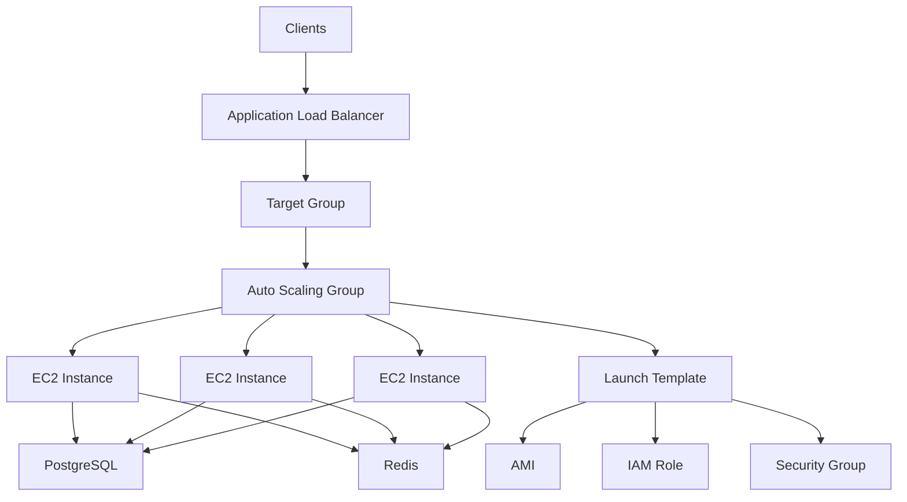
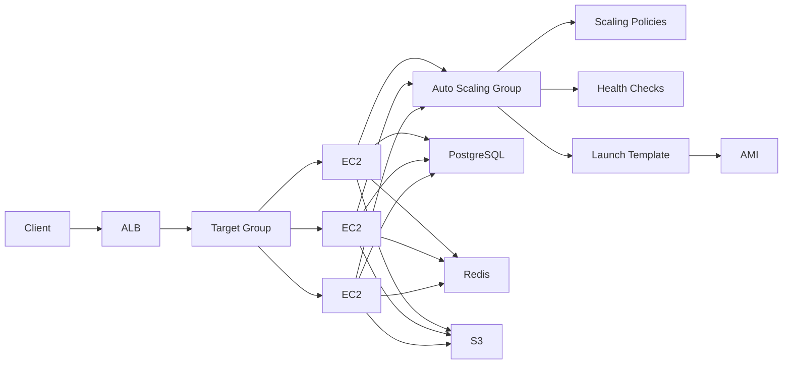
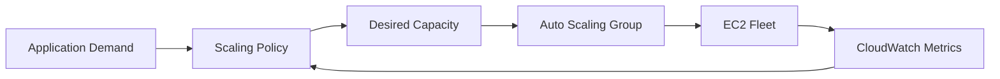
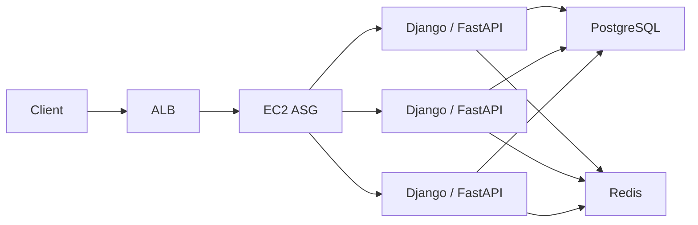
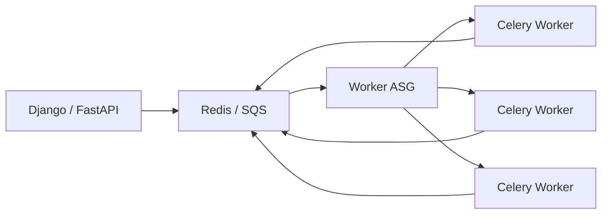

# README

## Overview

This folder contains documentation for Amazon EC2 Auto Scaling, with a focus on Auto Scaling Groups (ASGs) and the mechanisms used to automatically maintain, scale, replace, and operate EC2 compute capacity.

Auto Scaling Groups are a core building block for production backend infrastructure. They allow EC2 instances to be treated as a disposable fleet rather than individually managed servers.

The primary concepts covered here include:

- Auto Scaling Groups
- Desired, minimum, and maximum capacity
- Launch Templates
- Health checks and instance replacement
- Availability Zone distribution
- Scaling policies
- Target tracking
- Step scaling
- Scheduled scaling
- Instance Refresh
- Lifecycle Hooks
- Instance protection
- Load balancer integration
- Stateless backend architecture
- Production scaling and operational practices

The intended architecture is:



---

## Navigation

| # | File | Description |
|---|---|---|
| 01 | [01- Auto Scaling Groups](./01-%20Auto%20Scaling%20Groups.md) | Auto Scaling Groups, desired/min/max capacity, Launch Templates, scaling policies, health checks, and lifecycle management |

## Folder Structure

```text
05- Autoscaling/
    01- Auto Scaling Groups.md
    README.md
```

---

## Topics

| File | Coverage |
|---|---|
| [01- Auto Scaling Groups](./01-%20Auto%20Scaling%20Groups.md) | Auto Scaling Groups, capacity management, health checks, scaling policies, Launch Templates, Instance Refresh, lifecycle management, load balancer integration, production architecture, monitoring, security, cost, and operational practices |

---

## Auto Scaling Architecture

An Auto Scaling Group manages the lifecycle of EC2 instances while other AWS services handle traffic distribution, monitoring, persistent state, and application dependencies.



The important separation of responsibilities is:

| Component | Responsibility |
|---|---|
| Auto Scaling Group | Maintains and scales EC2 capacity |
| Launch Template | Defines how EC2 instances are created |
| AMI | Provides reproducible instance software |
| ALB | Distributes application traffic |
| Target Group | Tracks backend targets and health |
| CloudWatch | Provides metrics and monitoring |
| PostgreSQL/RDS | Persistent relational state |
| Redis | Cache/session/coordination workloads |
| S3 | Durable object storage |

---

## Capacity Model

An ASG primarily operates around three capacity values:

| Capacity | Purpose |
|---|---|
| Minimum | Lowest normal fleet capacity |
| Desired | Target number of instances |
| Maximum | Upper scaling boundary |

For example:

```text
Minimum  = 2
Desired  = 4
Maximum  = 10
```

The ASG attempts to maintain four instances under normal conditions while allowing automated scaling between two and ten instances.



---

## Launch Templates

Launch Templates define the configuration used when the ASG launches new instances.

Typical configuration includes:

- AMI
- Instance type
- Security groups
- IAM instance profile
- EBS volumes
- User Data
- Instance metadata configuration
- Network configuration
- Monitoring configuration

Launch Templates should generally be versioned and treated as infrastructure definitions.

```text
Launch Template
    |
    +-- AMI
    +-- Instance Type
    +-- Security Group
    +-- IAM Role
    +-- EBS
    +-- User Data
    |
    v
EC2 Instance
```

This enables reproducible instance creation and supports controlled deployments through new Launch Template versions.

---

## Scaling Policies

Scaling policies determine how an ASG responds to workload changes.

Common approaches include:

| Policy | Typical Use |
|---|---|
| Target tracking | Maintain a target metric |
| Step scaling | Scale by different amounts based on metric thresholds |
| Scheduled scaling | Predictable time-based demand |
| Predictive scaling | Forecast recurring workload patterns |

The scaling metric should represent the actual capacity constraint of the workload.

Examples:

```text
Web API
    -> Request count per target

CPU-bound service
    -> CPU utilization

Celery workers
    -> Queue backlog

Memory-bound service
    -> Memory utilization

Scheduled workload
    -> Scheduled scaling
```

---

## Backend Scaling Patterns

### Django or FastAPI API



The API instances should be horizontally scalable and should not depend on local instance state.

### Celery Workers



For worker fleets, queue depth or backlog per instance may be more meaningful than CPU utilization.

---

## Health and Replacement

An ASG can replace unhealthy instances automatically.

```text
EC2 becomes unhealthy
        |
        v
Health check detects failure
        |
        v
ASG marks instance unhealthy
        |
        v
Instance is terminated/replaced
        |
        v
New EC2 launched
        |
        v
Health check passes
        |
        v
Instance enters service
```

Health checks can include:

- EC2 health checks
- Elastic Load Balancing health checks

Application-level readiness should be designed carefully so that an instance is not added to production traffic before the application is actually ready.

---

## Availability Zones

Production ASGs should normally span multiple Availability Zones.

```text
Auto Scaling Group
    |
    +-- AZ-A
    |    +-- EC2
    |    +-- EC2
    |
    +-- AZ-B
    |    +-- EC2
    |    +-- EC2
    |
    +-- AZ-C
         +-- EC2
         +-- EC2
```

Multi-AZ placement improves resilience against an Availability Zone failure and prevents the entire application fleet from depending on a single zone.

---

## Stateless Architecture

ASGs are most effective when instances are disposable.

Avoid making an individual EC2 instance the authoritative owner of application state.

Prefer:

```text
Application
    |
    +-- PostgreSQL -> Persistent data
    +-- Redis      -> Cache / session / coordination
    +-- S3         -> Objects
    +-- SQS/Kafka  -> Messages
```

rather than:

```text
EC2
    |
    +-- Local database
    +-- Local user uploads
    +-- Important local state
```

This architecture allows instances to be terminated and replaced without losing business state.

---

## Deployment and Instance Refresh

When a new AMI or Launch Template version is available, existing instances do not automatically become identical to the new configuration.

A controlled rollout can use Instance Refresh:

```text
New AMI
   |
   v
Launch Template Version
   |
   v
Instance Refresh
   |
   v
Gradual Instance Replacement
   |
   v
Health Validation
   |
   v
Updated Fleet
```

This supports:

- OS updates
- Runtime upgrades
- Application releases
- Security patches
- Infrastructure configuration changes

Immutable replacement is generally preferable to manually modifying individual production servers.

---

## Lifecycle Management

Important ASG lifecycle mechanisms include:

- Health checks
- Instance Refresh
- Termination policies
- Instance protection
- Lifecycle hooks
- Connection draining
- Graceful application shutdown

A production termination flow should resemble:

```text
Scale-in / Replacement
        |
        v
Deregister from load balancer
        |
        v
Drain active connections
        |
        v
Stop accepting new work
        |
        v
Finish or hand off work
        |
        v
Terminate instance
```

This is particularly important for long-running HTTP requests and Celery workloads.

---

## Production Considerations

### High Availability

Use:

- Multiple Availability Zones
- Appropriate minimum capacity
- Load balancer integration
- Health checks
- Automated instance replacement
- Externalized persistent state

### Security

Use:

- Private subnets where appropriate
- IAM instance roles
- Least-privilege security groups
- IMDSv2
- Systems Manager instead of unnecessary public SSH
- Managed secret storage
- Regular AMI and OS patching

### Monitoring

Monitor:

- Desired capacity
- Current capacity
- In-service instances
- Pending instances
- Unhealthy instances
- Scaling activities
- Failed launches
- Application latency
- Application errors
- Load balancer target health
- Instance Refresh status

### Cost

Review:

- Minimum and maximum capacity
- Idle capacity
- Scaling behavior
- Instance sizes
- Purchasing options
- Storage
- Elastic IP usage
- Duplicate capacity during deployments

Maximum capacity should be based on tested application and dependency capacity rather than an arbitrary large number.

---

## Common Pitfalls

| Problem | Why It Happens | Better Practice |
|---|---|---|
| Instances constantly replaced | Health check fails during startup | Tune startup and health-check behavior |
| Fleet does not scale correctly | Poor scaling metric | Choose a metric tied to workload capacity |
| Data disappears | State stored locally | Externalize persistent state |
| Deployment leaves mixed versions | Existing instances retain old configuration | Use Instance Refresh |
| Database overload during scale-out | Compute scales faster than database | Capacity-test downstream dependencies |
| Instances never scale in | Protection or policy configuration | Review termination and scale-in behavior |
| High costs | Excessive minimum/max capacity | Measure demand and right-size |
| Requests fail during termination | No connection draining | Implement graceful shutdown and deregistration |
| New instances fail to launch | Launch Template or quota problems | Inspect scaling activities and service quotas |

---

## Navigation

| Topic | File |
|---|---|
| Auto Scaling Groups | [01- Auto Scaling Groups](./01-%20Auto%20Scaling%20Groups.md) |

---

## Key Takeaways

- Auto Scaling Groups manage EC2 fleets by maintaining capacity, replacing unhealthy instances, and responding to scaling policies.
- Launch Templates, health checks, multi-AZ placement, and stateless application design form the foundation of reliable EC2 autoscaling.
- Scaling metrics should represent the application's real capacity constraint rather than relying on CPU utilization by default.
- Production deployments should use controlled instance replacement mechanisms such as Instance Refresh instead of manually modifying individual instances.
- Effective autoscaling requires coordinated design across compute, load balancing, databases, queues, monitoring, security, and cost controls.