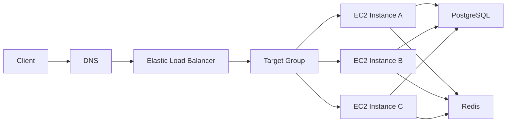
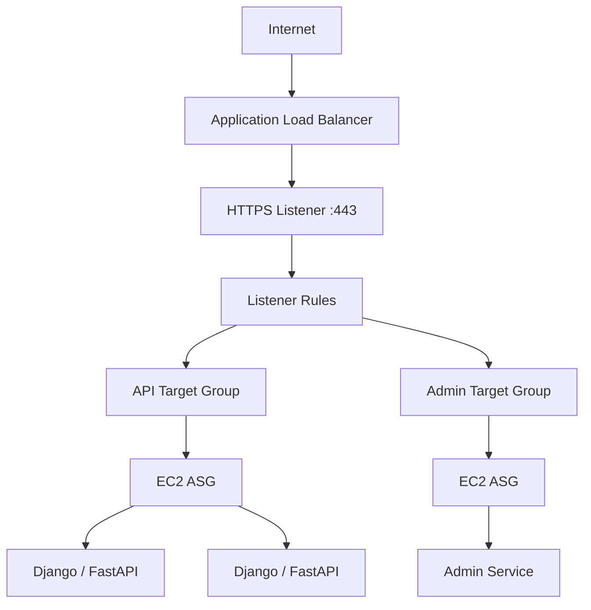
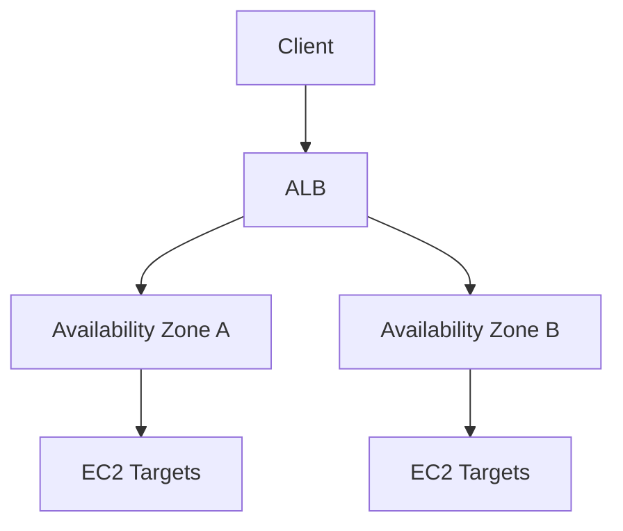
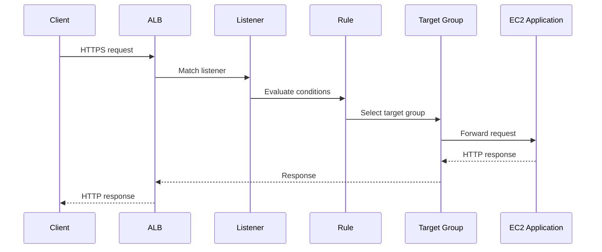
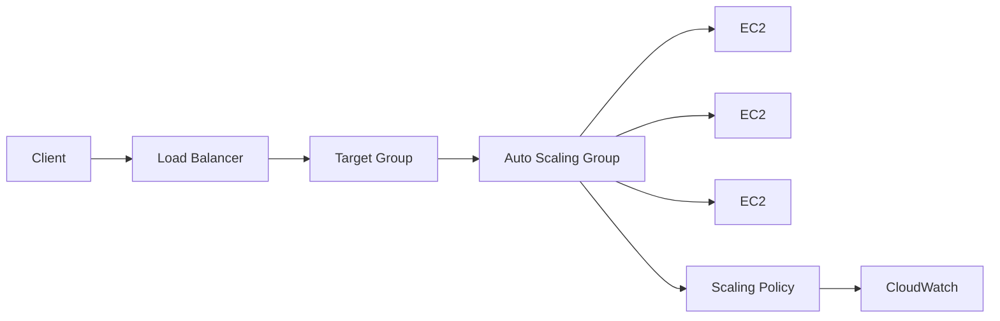
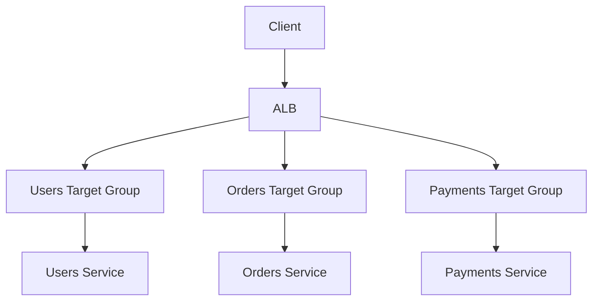
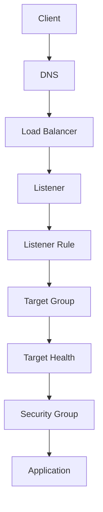

# 01- Elastic Load Balancer

## Overview

Elastic Load Balancing (ELB) distributes incoming network or application traffic across multiple targets such as EC2 instances, containers, IP addresses, and Lambda functions.

For EC2-based backend systems, a load balancer provides a stable entry point while allowing the compute fleet behind it to scale, fail, and change independently.

A typical architecture is:



The load balancer is responsible for traffic distribution and target health, while the backend instances remain responsible for application processing.

For production systems, ELB commonly works together with:

- Auto Scaling Groups
- Target Groups
- Route 53
- TLS certificates
- Security Groups
- CloudWatch
- ECS or EKS
- Django and FastAPI applications
- Microservices

---

## Why Load Balancing Exists

Without a load balancer, clients may connect directly to individual EC2 instances.

```text
Client
  |
  +----> EC2-A
  |
  +----> EC2-B
  |
  +----> EC2-C
```

This creates several problems:

- Clients need to know individual instance addresses.
- Instances can be replaced dynamically.
- Failed instances may continue receiving traffic.
- Scaling becomes harder.
- TLS termination becomes decentralized.
- Traffic distribution must be implemented elsewhere.

With a load balancer:

```text
                    +--> EC2-A
                    |
Client --> ALB -----+--> EC2-B
                    |
                    +--> EC2-C
```

The client communicates with a stable endpoint while the backend fleet can change underneath it.

---

## Elastic Load Balancing Components

The core concepts are:

| Component | Responsibility |
|---|---|
| Load Balancer | Receives client traffic |
| Listener | Accepts traffic on a protocol and port |
| Listener Rule | Determines how traffic should be routed |
| Target Group | Defines the backend targets |
| Target | Backend destination receiving traffic |
| Health Check | Determines whether a target can receive traffic |
| Security Group | Controls network access |

The request flow is typically:

```text
Client
   |
   v
Load Balancer
   |
   v
Listener
   |
   v
Listener Rule
   |
   v
Target Group
   |
   v
Healthy Target
```

---

## Types of Elastic Load Balancers

AWS provides multiple load-balancing options.

| Type | Primary Layer | Typical Use |
|---|---|---|
| Application Load Balancer | Layer 7 | HTTP/HTTPS applications and APIs |
| Network Load Balancer | Layer 4 | TCP, TLS, UDP, high-performance network workloads |
| Gateway Load Balancer | Layer 3/4 appliance traffic | Network security appliances |
| Classic Load Balancer | Older generation | Legacy workloads |

For modern Django, FastAPI, REST, and HTTP microservices, the Application Load Balancer is usually the relevant starting point.

---

## Application Load Balancer

An Application Load Balancer (ALB) operates at the HTTP/HTTPS application layer.

It understands concepts such as:

- HTTP methods
- Host headers
- URL paths
- HTTP headers
- Cookies
- TLS termination
- HTTP status codes

This enables routing decisions such as:

```text
api.example.com
        |
        v
ALB
        |
        +--> API Target Group

admin.example.com
        |
        v
ALB
        |
        +--> Admin Target Group
```

Or:

```text
/api/*
    |
    v
API Target Group

/web/*
    |
    v
Web Target Group
```

---

## Network Load Balancer

A Network Load Balancer (NLB) operates primarily at Layer 4.

It is designed for network-level traffic such as:

- TCP
- TLS
- UDP
- High-throughput workloads
- Low-latency network services

A simplified flow is:

```text
Client
  |
  v
NLB
  |
  +--> EC2-A
  +--> EC2-B
  +--> EC2-C
```

NLB is appropriate when application-layer routing is not required and the workload needs Layer 4 behavior.

---

## Gateway Load Balancer

Gateway Load Balancer is designed for deploying and scaling network appliances.

Typical examples include:

- Firewalls
- Intrusion detection systems
- Deep packet inspection systems
- Security appliances

It is fundamentally different from using an ALB for HTTP application traffic.

---

## Load Balancer Comparison

| Capability | ALB | NLB | GWLB |
|---|---|---|---|
| Primary layer | L7 | L4 | Network appliance traffic |
| HTTP routing | Yes | No application-level routing | No |
| Path-based routing | Yes | No | No |
| Host-based routing | Yes | No | No |
| TCP | Limited to supported listener patterns | Yes | Appliance-oriented |
| UDP | No | Yes | Appliance-oriented |
| TLS termination | Yes | Yes | Depends on appliance architecture |
| Typical backend API use | Excellent fit | Specialized | Not typical |
| Network appliance use | No | No | Primary use case |

---

## Application Load Balancer Architecture

A common EC2 backend architecture is:



This allows the frontend entry point to remain stable while the EC2 fleet scales independently.

---

## Load Balancer Scheme

A load balancer can be:

- Internet-facing
- Internal

### Internet-Facing Load Balancer

Used when clients outside the VPC need to access the application.

```text
Internet
   |
   v
Internet-facing ALB
   |
   v
Private EC2 instances
```

This is a common architecture for public APIs.

### Internal Load Balancer

Used for internal service-to-service traffic.

```text
Service A
    |
    v
Internal ALB
    |
    v
Service B
```

Internal load balancers are useful for microservices and private application tiers.

---

## Availability Zones

Load balancers are designed for high availability across Availability Zones.

A production architecture should normally use subnets across multiple Availability Zones.



This reduces dependence on a single Availability Zone.

For an EC2 ASG, the load balancer and backend fleet should be designed together so that healthy capacity exists across the enabled zones.

---

## Listeners

A listener defines how the load balancer accepts incoming connections.

Typical examples:

```text
HTTP  :80
HTTPS :443
```

A common production configuration is:

```text
HTTP :80
   |
   v
Redirect to HTTPS :443
```

Then:

```text
HTTPS :443
   |
   v
Listener Rules
   |
   v
Target Groups
```

---

## Listener Rules

ALB listener rules allow application-layer routing.

Examples:

```text
Host:
api.example.com
    |
    v
API Target Group
```

```text
Path:
/api/*
    |
    v
API Target Group
```

```text
Path:
/admin/*
    |
    v
Admin Target Group
```

Rules can also use combinations of conditions such as:

- Host headers
- URL paths
- HTTP headers
- Query strings
- Source IP conditions where supported

This makes ALB useful for HTTP microservice architectures.

---

## Target Groups

A target group represents a logical collection of backend targets.

Example:

```text
ALB
 |
 +-- /api/*
       |
       v
   API Target Group
       |
       +-- EC2-A
       +-- EC2-B
       +-- EC2-C
```

Target groups also define important backend behavior such as:

- Protocol
- Port
- Health checks
- Target type
- Deregistration behavior

A single ALB can route traffic to multiple target groups.

---

## Target Types

Target groups can work with different target types depending on the load balancer and architecture.

Common target types include:

| Target Type | Example |
|---|---|
| Instance | EC2 instances |
| IP | Private IP addresses |
| Lambda | Lambda functions |

For an EC2 ASG architecture, instance targets are common.

Containerized architectures often use IP targets.

---

## Health Checks

Health checks determine whether a target should receive traffic.

For an HTTP backend:

```text
ALB
 |
 v
GET /health
 |
 v
EC2
 |
 v
HTTP 200
```

If the target fails health checks:

```text
Target unhealthy
      |
      v
Removed from load-balancing rotation
      |
      v
Healthy targets continue serving traffic
```

This is one of the most important reliability mechanisms in an ELB architecture.

---

## Health Check Configuration

Important parameters include:

- Protocol
- Port
- Path
- Health check interval
- Timeout
- Healthy threshold
- Unhealthy threshold
- Success codes

Example:

```text
Protocol: HTTP
Port: 8000
Path: /health
Success: 200
```

The endpoint should be fast and deterministic.

Avoid using an unnecessarily expensive endpoint for frequent load balancer health checks.

---

## Health Endpoint Design

A FastAPI application might expose:

```python
from fastapi import FastAPI

app = FastAPI()


@app.get("/health")
def health() -> dict[str, str]:
    return {"status": "ok"}
```

For Django, the same principle applies: provide a lightweight endpoint that can determine whether the application process is available.

A more advanced architecture may separate:

```text
/health/live
/health/ready
```

where:

- Liveness determines whether the process is functioning.
- Readiness determines whether the instance should receive traffic.

Do not make readiness depend on every optional dependency. Otherwise, a non-critical downstream issue can cause the entire fleet to be removed from service.

---

## Request Routing

A typical ALB request lifecycle is:



The application generally sees the request after the load balancer has performed connection handling, listener processing, and target selection.

---

## TLS Termination

A common production design terminates TLS at the ALB.

```text
Client
   |
   | HTTPS
   v
ALB
   |
   | HTTP or HTTPS
   v
EC2
```

The ALB can use an AWS Certificate Manager certificate.

Benefits include:

- Centralized certificate management
- Simplified application configuration
- TLS termination outside application processes
- Easier certificate rotation
- Consistent HTTPS enforcement

For sensitive internal traffic, HTTPS can also be used between the ALB and backend targets.

---

## HTTPS Redirect

A common configuration is:

```text
HTTP :80
    |
    v
Redirect
    |
    v
HTTPS :443
```

This ensures clients use encrypted transport.

Applications should also correctly understand the original protocol when operating behind a TLS-terminating proxy.

---

## Security Groups

A common security-group model is:

```text
Internet
   |
   v
ALB Security Group
   |
   | TCP 443
   v
EC2 Security Group
```

The EC2 security group should generally allow application traffic from the load balancer security group rather than from the entire internet.

For example:

```text
ALB SG
  |
  +-- inbound TCP 443 from Internet

EC2 SG
  |
  +-- inbound TCP 8000 from ALB SG
```

This establishes a clear trust boundary.

---

## Backend Port

Suppose Uvicorn runs on:

```text
0.0.0.0:8000
```

The ALB can forward:

```text
ALB :443
   |
   v
EC2 :8000
```

For a Django application behind Gunicorn:

```text
ALB :443
   |
   v
EC2 :8000
   |
   v
Gunicorn
   |
   v
Django
```

Nginx can also be placed between the load balancer and application server when its capabilities are required:

```text
ALB
 |
 v
Nginx
 |
 v
Gunicorn/Uvicorn
 |
 v
Django/FastAPI
```

However, adding Nginx should be justified by requirements such as local reverse proxying, static-file handling, buffering, or additional routing rather than being added automatically.

---

## Load Balancer and Auto Scaling

ELB and Auto Scaling solve different problems.



| Component | Responsibility |
|---|---|
| Load Balancer | Distributes traffic |
| Target Group | Tracks backend targets |
| Health Check | Determines target availability |
| Auto Scaling Group | Adjusts fleet capacity |
| Scaling Policy | Determines when capacity changes |

The load balancer does not automatically replace EC2 instances. The ASG handles instance lifecycle.

---

## Load Balancer and Connection Distribution

The load balancer distributes incoming connections or requests according to the configured load-balancing behavior.

For HTTP workloads, the important distinction is that the application should not assume a specific client always reaches the same EC2 instance.

```text
Request 1 -> EC2-A
Request 2 -> EC2-C
Request 3 -> EC2-B
Request 4 -> EC2-A
```

Therefore, application state should generally be externalized.

---

## Sticky Sessions

Sticky sessions can maintain client affinity to a target.

Conceptually:

```text
Client A
   |
   +----> EC2-A
   +----> EC2-A
   +----> EC2-A
```

This can be useful for legacy stateful applications.

However, it introduces trade-offs:

- Uneven load distribution
- More difficult instance replacement
- Reduced flexibility during scaling
- Session affinity to potentially unhealthy targets

For modern Django and FastAPI applications, externalizing session state is usually preferable when practical.

---

## Client IP and Proxy Headers

When traffic passes through a load balancer, the backend needs a reliable way to understand the original client connection information.

Applications may receive forwarding information such as:

```text
X-Forwarded-For
X-Forwarded-Proto
X-Forwarded-Port
```

Frameworks must be configured carefully when trusting proxy headers.

Incorrect proxy configuration can cause:

- Incorrect client IP logging
- HTTPS detection problems
- Incorrect redirect behavior
- Security issues around trusted proxy information

Only trust forwarding headers from infrastructure that you control and configure.

---

## Django Behind a Load Balancer

Django applications commonly need correct proxy and HTTPS configuration.

Important areas include:

- `SECURE_PROXY_SSL_HEADER`
- `ALLOWED_HOSTS`
- CSRF trusted origins
- Secure cookies
- Session storage
- Static/media file handling

For example, when TLS terminates at the ALB, Django must correctly understand that the original client request was HTTPS.

Do not blindly trust arbitrary client-supplied forwarding headers.

---

## FastAPI Behind a Load Balancer

FastAPI/Uvicorn applications may need proxy-header configuration depending on the deployment architecture.

Example:

```bash
uvicorn app.main:app \
    --host 0.0.0.0 \
    --port 8000 \
    --proxy-headers
```

Proxy-header trust should be aligned with the actual trusted network topology.

Do not enable proxy behavior without understanding which upstream components can inject those headers.

---

## WebSockets

Application Load Balancers support WebSocket connections.

The architecture becomes:

```text
Client
  |
  | WebSocket
  v
ALB
  |
  v
Target Group
  |
  v
WebSocket Application
```

Production considerations include:

- Idle timeout configuration
- Connection lifecycle
- Target draining
- Application shutdown
- Horizontal scaling
- Shared state where required

Long-lived connections require different operational thinking from short HTTP requests.

---

## gRPC

gRPC uses HTTP/2 and has different requirements from conventional REST traffic.

An AWS load-balancing architecture for gRPC should be selected based on the required protocol and routing behavior.

Conceptually:

```text
gRPC Client
    |
    v
Load Balancer
    |
    v
gRPC Service
```

The important engineering principle is to verify protocol support and end-to-end HTTP/2 behavior rather than assuming that a load balancer configured for ordinary HTTP traffic will automatically provide the desired gRPC behavior.

---

## Microservices Routing

ALB can support path- and host-based routing.

Example:

```text
api.example.com/users/*
        |
        v
Users Service

api.example.com/orders/*
        |
        v
Orders Service

api.example.com/payments/*
        |
        v
Payments Service
```

Architecture:



This can be useful for smaller microservice environments, although larger architectures may use dedicated API gateways or service-mesh patterns depending on requirements.

---

## Load Balancer and Kubernetes

In Kubernetes environments, load balancing may be managed through Kubernetes Services and AWS integrations such as AWS Load Balancer Controller.

The conceptual model is:

```text
Client
   |
   v
AWS Load Balancer
   |
   v
Kubernetes Service / Targets
   |
   v
Pods
```

The exact architecture depends on whether traffic is exposed through an ALB, NLB, ingress configuration, or another mechanism.

The important distinction is that Kubernetes manages workloads while the AWS load-balancing layer manages network traffic according to the configured integration.

---

## Deregistration and Connection Draining

When a target is removed, active connections should be handled gracefully.

```text
Target selected for termination
          |
          v
Deregister target
          |
          v
Stop new traffic
          |
          v
Allow existing requests/connections to drain
          |
          v
Terminate instance
```

This is particularly important for:

- Long HTTP requests
- File uploads
- WebSockets
- Streaming
- Background jobs triggered synchronously

Graceful draining should be part of the instance lifecycle design.

---

## Health Check vs Application Monitoring

A load balancer health check is not a complete observability solution.

For example:

```text
ALB Health Check
    |
    +-- HTTP 200
```

does not tell you:

- Request latency
- Error rate
- Database saturation
- Queue backlog
- Memory pressure
- Business-level failures

Production monitoring should combine:

```text
Load Balancer
   +
EC2
   +
Application
   +
Database
   +
Dependencies
```

---

## Monitoring

Important load-balancer signals include:

- Request count
- Request latency
- HTTP 4xx responses
- HTTP 5xx responses
- Target response time
- Healthy target count
- Unhealthy target count
- Rejected connections where applicable
- Connection behavior
- Target registration state

A useful monitoring model is:

```text
Traffic
  |
  +-- Request count
  +-- Latency
  +-- Error rate

Targets
  |
  +-- Healthy
  +-- Unhealthy
  +-- Registration changes

Infrastructure
  |
  +-- EC2 capacity
  +-- CPU
  +-- Network
```

---

## Access Logging

Load balancer access logs provide request-level visibility useful for troubleshooting and auditing.

They can help investigate:

- Client IPs
- Requested paths
- Response status
- Target response time
- Request processing behavior
- Unexpected traffic patterns

Logs should be retained according to operational, security, and compliance requirements.

---

## Cost Considerations

Load balancers introduce additional infrastructure costs.

Cost optimization should focus on architecture rather than simply removing load balancing.

A production backend often needs a load balancer because it provides:

- High availability
- Health-based routing
- TLS termination
- Horizontal scaling
- Stable application endpoints

Avoid deploying separate load balancers unnecessarily for every small service unless the architecture requires that isolation.

---

## High Availability

Production load-balancing architecture should generally include:

- Multiple Availability Zones
- At least multiple healthy backend targets
- Auto Scaling where appropriate
- Health checks
- Proper security groups
- TLS
- Monitoring and alarms
- Graceful target deregistration
- Externalized application state

A resilient architecture looks like:

```text
                    Internet
                       |
                       v
              +----------------+
              |      ALB       |
              +----------------+
                 /          \
                /            \
             AZ-A            AZ-B
              |                |
          EC2 Target       EC2 Target
              |                |
              +-------+--------+
                      |
                 PostgreSQL
```

---

## Disaster Recovery

A load balancer improves availability but is not a complete disaster recovery strategy.

It does not automatically protect against:

- Region-wide failures
- Database corruption
- Application deployment failures
- Data loss
- Dependency outages

A broader DR strategy may include:

- Multi-AZ architecture
- Database backups and replication
- AMI or image management
- Infrastructure as Code
- Cross-Region recovery
- DNS failover
- Tested restoration procedures

---

## AWS CLI Examples

List load balancers:

```bash
aws elbv2 describe-load-balancers
```

List target groups:

```bash
aws elbv2 describe-target-groups
```

Inspect target health:

```bash
aws elbv2 describe-target-health \
    --target-group-arn arn:aws:elasticloadbalancing:region:account-id:targetgroup/example/1234567890abcdef
```

List listeners:

```bash
aws elbv2 describe-listeners \
    --load-balancer-arn arn:aws:elasticloadbalancing:region:account-id:loadbalancer/app/example/1234567890abcdef
```

These commands are particularly useful during operational troubleshooting.

---

## Troubleshooting Workflow

When an application is unreachable through an ALB, investigate from the outside inward.



A practical workflow is:

1. Verify DNS resolves to the expected load balancer.
2. Verify the listener exists on the expected port.
3. Verify listener rules route to the intended target group.
4. Inspect target health.
5. Verify security groups.
6. Verify the EC2 application is listening on the expected port.
7. Verify application logs.
8. Verify the application's health endpoint.
9. Verify downstream dependencies.
10. Check load balancer and application metrics.

---

## Common Failure Scenarios

| Symptom | Likely Area |
|---|---|
| DNS works but connection fails | Listener, security group, network |
| ALB returns 503 | No healthy targets or routing issue |
| Targets unhealthy | Health check, application, port, security group |
| ALB returns 502 | Backend connection/application response issue |
| HTTP works but HTTPS fails | TLS certificate/listener configuration |
| HTTPS redirects incorrectly | Proxy-header/application configuration |
| Requests reach wrong service | Listener rule configuration |
| One instance receives unexpected traffic | Health, registration, or balancing behavior |
| Requests fail during deployments | Draining/graceful shutdown |
| Clients lose sessions | Local session state or affinity assumptions |

---

## Common Mistakes

### Exposing EC2 Directly to the Internet

Allowing direct public access to every backend instance unnecessarily increases the attack surface.

Prefer:

```text
Internet
   |
   v
ALB
   |
   v
Private EC2
```

### Allowing Backend Traffic from Anywhere

Do not configure the application security group to accept its backend port from `0.0.0.0/0` unless there is a specific architectural requirement.

Prefer allowing traffic from the load balancer security group.

### Using an Expensive Health Check

Health checks run repeatedly across targets.

Keep them lightweight and deterministic.

### Storing Sessions Locally

With multiple EC2 instances:

```text
Request 1 -> EC2-A
Request 2 -> EC2-B
```

local sessions can cause inconsistent behavior.

Use shared session storage or another architecture that does not depend on a specific instance.

### Assuming the Load Balancer Replaces Failed EC2 Instances

The load balancer can stop sending traffic to unhealthy targets, but the Auto Scaling Group is responsible for maintaining EC2 capacity.

### Ignoring Connection Draining

Immediate termination can interrupt active requests.

Use deregistration, draining, and graceful application shutdown.

### Blindly Trusting Forwarded Headers

Client-controlled headers can be spoofed if proxy trust is configured incorrectly.

Only trust forwarding information from known infrastructure.

### Adding Nginx Without a Requirement

An ALB already provides reverse-proxy and traffic-distribution functionality.

Add Nginx only when its specific capabilities provide value.

---

## Production Checklist

```text
[ ] Load balancer spans appropriate Availability Zones
[ ] Correct load balancer type selected
[ ] Listener ports are defined
[ ] HTTPS is configured for public traffic
[ ] TLS certificates are managed appropriately
[ ] HTTP-to-HTTPS redirect is configured where required
[ ] Target groups are correctly configured
[ ] Health checks use a lightweight endpoint
[ ] Health-check thresholds are appropriate
[ ] Backend security group trusts the load balancer security group
[ ] Backend instances are private where appropriate
[ ] Application state is externalized
[ ] Auto Scaling is integrated where required
[ ] Connection draining is configured
[ ] Application graceful shutdown is implemented
[ ] Proxy headers are handled correctly
[ ] CloudWatch monitoring is configured
[ ] Access logging is considered
[ ] Target health is monitored
[ ] Capacity of downstream dependencies is tested
[ ] Failure scenarios have been tested
```

---

## Interview Considerations

### What is Elastic Load Balancing?

Elastic Load Balancing is AWS's managed load-balancing service for distributing traffic across healthy backend targets.

### What is the difference between ALB and NLB?

ALB operates at the application layer and provides HTTP-aware routing such as host- and path-based routing. NLB operates primarily at the transport layer and is designed for high-performance TCP, TLS, and UDP workloads.

### What is a Target Group?

A target group is a logical collection of backend targets associated with a load-balancing configuration. It also defines target health checks and backend connection behavior.

### What is a Listener?

A listener accepts connections on a configured protocol and port and evaluates how incoming traffic should be handled.

### What happens when a target becomes unhealthy?

The load balancer stops routing new traffic to the unhealthy target. If the target belongs to an ASG, the ASG can independently detect the unhealthy instance and replace it according to its health-check configuration.

### Why use an ALB in front of an EC2 Auto Scaling Group?

The ALB provides a stable application endpoint, distributes traffic across healthy instances, supports HTTP-aware routing and TLS termination, while the ASG manages backend capacity.

### Why should EC2 security groups allow traffic from the ALB security group?

It limits backend access to traffic originating from the intended load-balancing layer rather than exposing the application port directly to arbitrary network sources.

### Why are health checks important?

They prevent traffic from being sent to targets that cannot correctly serve requests and provide an important signal for automated recovery and fleet management.

### How would you troubleshoot an ALB returning 503?

Check:

1. Target-group health.
2. Registered targets.
3. Health-check path and port.
4. EC2 application status.
5. Security groups.
6. Listener rules.
7. Availability and capacity of the backend fleet.

### Why should applications behind a load balancer be stateless?

Because requests can reach different backend instances and instances can be replaced or scaled dynamically. Persistent application state should therefore be stored in appropriate shared or durable systems.

## Key Takeaways

- Elastic Load Balancing provides a stable entry point and distributes traffic across healthy backend targets while allowing EC2 instances to scale and change independently.
- ALB is the primary choice for HTTP/HTTPS backend applications requiring application-layer routing, while NLB is designed for Layer 4 workloads and specialized network requirements.
- Target groups, health checks, listeners, listener rules, and security groups form the core operational model of an EC2 load-balancing architecture.
- Production applications behind a load balancer should externalize state, support graceful shutdown and connection draining, and integrate with Auto Scaling for reliable horizontal capacity management.
- Reliable ELB operation requires multi-AZ design, TLS, least-privilege network access, meaningful health checks, observability, and systematic troubleshooting of the full request path.