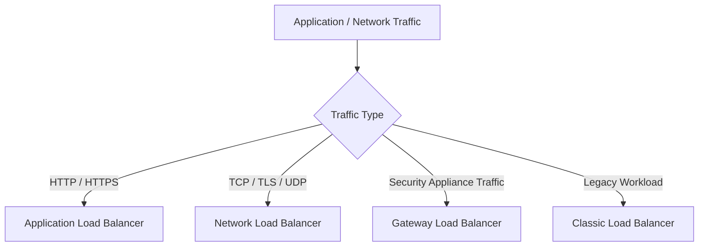
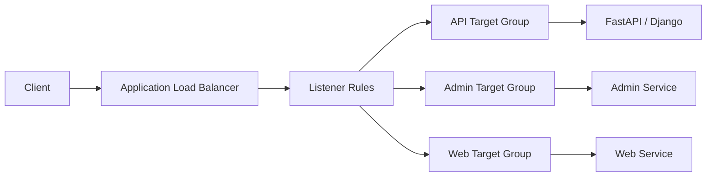
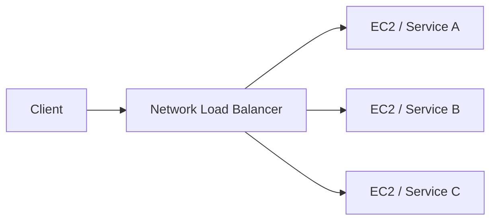
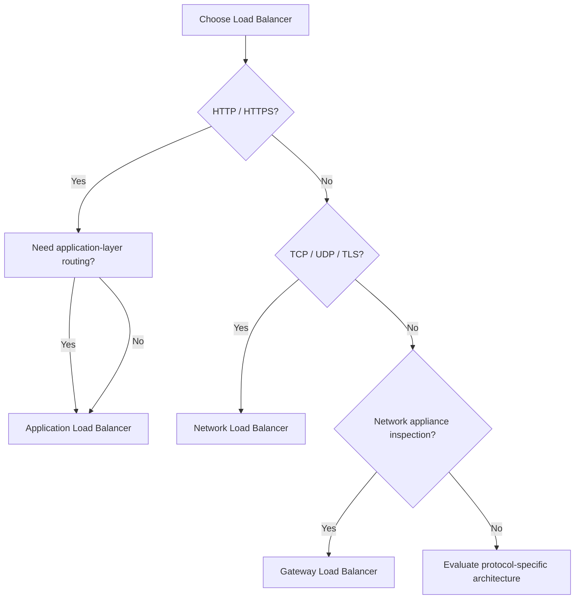

# 02- Load Balancer Types

## Overview

AWS Elastic Load Balancing provides several load balancer types designed for different network layers, protocols, routing requirements, and workload characteristics.

The primary types are:

- Application Load Balancer (ALB)
- Network Load Balancer (NLB)
- Gateway Load Balancer (GWLB)
- Classic Load Balancer (CLB)

For modern backend engineering, the practical decision is usually between **ALB and NLB**. Gateway Load Balancer serves a specialized network-security-appliance use case, while Classic Load Balancer is a legacy option that should generally not be selected for new architectures.

The load balancer type should be selected based on the traffic model rather than simply choosing the highest-performance option.



---

## Load Balancer Types

| Type | Primary Layer | Main Protocol Model | Typical Use |
|---|---|---|---|
| Application Load Balancer | Layer 7 | HTTP/HTTPS | REST APIs, web applications, microservices |
| Network Load Balancer | Layer 4 | TCP/TLS/UDP | High-performance network services, static IP requirements |
| Gateway Load Balancer | Network appliance integration | GENEVE | Firewalls, IDS/IPS, inspection appliances |
| Classic Load Balancer | Older Layer 4/7 model | HTTP/HTTPS/TCP | Legacy applications |

The most important distinction is:

```text
ALB  -> Understands HTTP application semantics
NLB  -> Primarily forwards network connections
GWLB -> Integrates network security appliances
CLB  -> Legacy load-balancing model
```

---

## OSI Layer Perspective

Understanding the layer at which a load balancer operates explains most of its capabilities.

```text
Layer 7
    |
    +-- HTTP
    +-- HTTPS
    +-- Host
    +-- Path
    +-- Headers
    |
    v
ALB

Layer 4
    |
    +-- TCP
    +-- UDP
    +-- TLS
    |
    v
NLB

Network Appliance
    |
    +-- Security inspection
    +-- Firewall
    +-- IDS/IPS
    |
    v
GWLB
```

Layer 7 load balancing provides more application-aware routing but requires understanding of the application protocol.

Layer 4 load balancing operates closer to the network connection and is appropriate when application-level routing is unnecessary or when specific network behavior is required.

---

## Application Load Balancer

Application Load Balancer is designed for HTTP and HTTPS applications.

It operates at Layer 7 and can make routing decisions using application-level information.

Common capabilities include:

- Host-based routing
- Path-based routing
- HTTP header conditions
- Query-string conditions
- TLS termination
- HTTP redirects
- Authentication integrations
- WebSocket support
- gRPC support
- Target health checks
- Integration with Auto Scaling

A typical architecture is:



---

## ALB Routing

ALB can route requests based on HTTP information.

For example:

```text
api.example.com
        |
        v
API Target Group

admin.example.com
        |
        v
Admin Target Group
```

Or:

```text
/api/*
    |
    v
API Target Group

/admin/*
    |
    v
Admin Target Group
```

This makes ALB particularly useful for HTTP microservices.

---

## Host-Based Routing

Host-based routing examines the HTTP `Host` header.

Example:

```text
api.example.com
    |
    v
Users / API Service

admin.example.com
    |
    v
Admin Service
```

This allows multiple domains or subdomains to share the same ALB while routing to different backend services.

---

## Path-Based Routing

Path-based routing examines the request path.

Example:

```text
example.com/users/*
        |
        v
Users Service

example.com/orders/*
        |
        v
Orders Service

example.com/payments/*
        |
        v
Payments Service
```

This is useful for smaller microservice environments.

For larger systems, routing requirements may justify an API Gateway or dedicated service-discovery architecture instead.

---

## ALB Listener Model

A typical ALB has listeners such as:

```text
HTTPS :443
     |
     v
Listener Rules
     |
     +--> Target Group A
     +--> Target Group B
     +--> Target Group C
```

An HTTP listener can commonly redirect clients:

```text
HTTP :80
   |
   v
Redirect
   |
   v
HTTPS :443
```

The listener is responsible for accepting connections and determining how requests should be handled.

---

## ALB Target Groups

A target group defines the backend targets that receive traffic.

Example:

```text
ALB
 |
 +-- HTTPS Listener
       |
       +-- /api/*
              |
              v
          API Target Group
              |
              +-- EC2-A
              +-- EC2-B
              +-- EC2-C
```

Target groups also define health-check behavior and backend connection configuration.

---

## ALB Health Checks

For an HTTP backend, an ALB can periodically request an endpoint such as:

```text
GET /health
```

A healthy target might return:

```http
HTTP/1.1 200 OK
Content-Type: application/json
```

with:

```json
{
  "status": "ok"
}
```

If the target fails the configured health checks, ALB stops routing new traffic to it.

This is distinct from an Auto Scaling Group replacing the instance. The ALB controls traffic eligibility; the ASG controls instance fleet capacity.

---

## ALB with Django

A common Django architecture is:

```text
Client
  |
  v
ALB
  |
  v
Target Group
  |
  v
EC2
  |
  v
Gunicorn
  |
  v
Django
```

The Django application should generally remain stateless across instances.

Persistent state belongs in systems such as:

- PostgreSQL
- Redis
- S3
- Other durable storage

---

## ALB with FastAPI

A FastAPI service might run behind Gunicorn/Uvicorn or another production ASGI deployment.

```text
Client
   |
   v
HTTPS ALB
   |
   v
EC2 Target
   |
   v
Uvicorn / Gunicorn
   |
   v
FastAPI
```

The application should listen on the internal application port rather than exposing the service directly to the internet.

---

## ALB and WebSockets

ALB supports WebSocket connections.

Typical architecture:

```text
WebSocket Client
       |
       v
      ALB
       |
       v
WebSocket Target
```

Production considerations include:

- Idle timeout
- Connection lifetime
- Graceful target deregistration
- Application shutdown
- Horizontal scaling
- Shared state when required

Long-lived connections can affect scaling behavior because a target may retain active connections while the fleet changes.

---

## ALB and gRPC

ALB can be used with gRPC workloads.

A simplified architecture is:

```text
gRPC Client
     |
     v
ALB
     |
     v
gRPC Target
```

gRPC routing and health-check behavior should be designed around HTTP/2 and the actual service architecture.

Do not treat a gRPC workload as an ordinary HTTP/1.1 REST application when validating compatibility and operational behavior.

---

## Network Load Balancer

Network Load Balancer operates primarily at Layer 4.

It is intended for network-level traffic where the load balancer does not need to interpret HTTP application semantics.

Common protocols include:

- TCP
- TLS
- UDP

A simplified architecture is:



---

## When to Use NLB

NLB is appropriate when requirements include:

- TCP traffic
- UDP traffic
- TLS pass-through or network-level TLS handling
- High-performance network traffic
- Very low connection-processing overhead
- Static IP requirements
- Network-level load balancing
- Protocols that are not HTTP

Typical workloads include:

- Custom TCP services
- UDP services
- Network services
- Certain gRPC architectures
- Services requiring static IP addresses

---

## NLB vs ALB Request Model

The conceptual difference is:

```text
ALB

Client
  |
  v
HTTP Request
  |
  +-- Method
  +-- Path
  +-- Host
  +-- Headers
  |
  v
Routing Decision
```

versus:

```text
NLB

Client
  |
  v
Network Connection
  |
  +-- TCP / UDP / TLS
  |
  v
Target
```

ALB can make decisions based on application semantics.

NLB primarily forwards network connections.

---

## NLB Static IP Consideration

One important NLB use case is stable IP addressing.

Some systems require known IP addresses because of:

- External allowlists
- Legacy integrations
- Network policies
- Firewall configuration
- Private connectivity requirements

ALB is DNS-oriented, while NLB supports static IP address capabilities appropriate for these network-level requirements.

Do not select NLB solely because of the word "performance." Determine whether the application's actual requirements justify Layer 4 behavior.

---

## NLB TLS Handling

NLB can participate in TLS architectures.

Possible patterns include:

```text
Client
  |
  | TLS
  v
NLB
  |
  | TLS
  v
Application
```

or a TLS termination architecture where the NLB handles the frontend TLS connection and forwards according to the configured listener and target behavior.

The appropriate model depends on certificate management, encryption requirements, application protocol, and whether the backend needs to receive encrypted traffic.

---

## NLB Health Checks

NLB supports health checks appropriate to its target and protocol configuration.

Depending on the architecture, checks can use network-level protocols or supported application-level health checks.

The important operational distinction remains:

```text
Health Check
     |
     v
Should this target receive traffic?
```

It does not automatically imply:

```text
Should this EC2 instance continue to exist?
```

An ASG or other orchestration mechanism handles instance lifecycle.

---

## NLB and Long-Lived Connections

NLB is often useful for workloads with long-lived network connections.

Examples include:

- Persistent TCP connections
- Streaming protocols
- Custom network protocols
- Certain real-time services

However, long-lived connections require careful consideration of:

- Connection draining
- Target replacement
- Connection distribution
- Client reconnect behavior
- Failure recovery

A load balancer cannot eliminate the need for application-level reconnection logic.

---

## Gateway Load Balancer

Gateway Load Balancer is designed to deploy, scale, and integrate network security appliances.

Typical architecture:


Common use cases include:

- Firewalls
- Intrusion detection systems
- Intrusion prevention systems
- Deep packet inspection
- Network traffic inspection
- Third-party virtual appliances

GWLB is not a replacement for ALB in a Django or FastAPI application architecture.

---

## Gateway Load Balancer Architecture

A more complete architecture may look like:

```text
Application Traffic
        |
        v
Gateway Load Balancer
        |
        v
Security Appliance Fleet
        |
        v
Destination
```

The appliances can be scaled independently from the traffic source.

This separation is useful when security inspection needs to be centralized without tightly coupling the application network to individual appliance instances.

---

## GENEVE

Gateway Load Balancer uses the GENEVE protocol for communication with supported appliances.

The important architectural concept is:

```text
Traffic
   |
   v
GWLB
   |
   v
Appliance
   |
   v
GWLB
   |
   v
Destination
```

The appliance participates in traffic inspection without requiring application developers to implement security inspection logic inside the application.

---

## Classic Load Balancer

Classic Load Balancer is an older generation of AWS load balancing.

It supports legacy Layer 4 and Layer 7 use cases but does not provide the modern routing and feature model available in ALB and NLB.

For new architectures, use ALB or NLB based on workload requirements.

Classic Load Balancer may still appear in existing environments and therefore remains useful to recognize during migration and operational work.

---

## Load Balancer Selection

A practical decision model is:



---

## ALB vs NLB

| Characteristic | ALB | NLB |
|---|---|---|
| Layer | 7 | 4 |
| HTTP/HTTPS | Primary use case | Supported in relevant configurations |
| TCP | Not primary | Primary |
| UDP | No | Yes |
| Path routing | Yes | No |
| Host routing | Yes | No |
| HTTP headers | Yes | No application-level routing |
| Query-string routing | Yes | No |
| TLS termination | Yes | Yes |
| Static IP requirements | Not the primary model | Strong use case |
| WebSockets | Yes | Supports network-level connections |
| gRPC | Yes | Can support appropriate network-level gRPC architectures |
| Application-aware routing | Yes | No |
| Network-level protocols | Limited | Strong fit |
| Typical REST API | Excellent | Usually unnecessary |
| Custom TCP service | Poor fit | Excellent |
| UDP service | Not supported | Excellent |

---

## ALB vs NLB vs GWLB

| Requirement | ALB | NLB | GWLB |
|---|---:|---:|---:|
| Django/FastAPI REST API | Yes | Possible but usually unnecessary | No |
| Path-based routing | Yes | No | No |
| Host-based routing | Yes | No | No |
| TCP service | Not primary | Yes | Appliance use |
| UDP service | No | Yes | Appliance use |
| Network firewall | No | No | Yes |
| IDS/IPS | No | No | Yes |
| Static IP-oriented architecture | Not primary | Yes | Specialized |
| HTTP microservices | Yes | Limited application awareness | No |
| Security appliance fleet | No | No | Yes |

---

## Performance Considerations

Load balancer selection should be based on workload characteristics rather than theoretical performance alone.

Consider:

- Requests per second
- Connections per second
- Concurrent connections
- Payload size
- Protocol
- TLS processing
- Connection duration
- Routing complexity
- Target response latency

For example:

```text
REST API
    |
    v
ALB
    |
    +-- HTTP routing
    +-- Health checks
    +-- TLS
```

versus:

```text
Custom TCP Service
    |
    v
NLB
    |
    +-- TCP connections
    +-- Network-level forwarding
```

The application protocol is often a more important selection factor than raw throughput.

---

## Security Considerations

### ALB

Common security practices include:

- HTTPS listeners
- AWS Certificate Manager certificates
- Redirect HTTP to HTTPS
- Restrictive security groups
- Private backend instances
- Controlled proxy-header trust
- Access logging
- WAF integration where appropriate

### NLB

Security considerations include:

- Security groups where applicable to the architecture
- TLS configuration
- Network ACLs
- Target security groups
- Private subnets
- Network-level allowlists

### GWLB

Security architecture focuses on:

- Appliance trust boundaries
- Traffic inspection
- Routing correctness
- Appliance availability
- Failure handling
- Centralized security policy

---

## High Availability

All production load-balancing architectures should consider:

- Multiple Availability Zones
- Multiple healthy targets
- Target health checks
- Automated target replacement
- Capacity planning
- Monitoring
- Graceful target deregistration

A typical ALB architecture is:

```text
                 ALB
              /       \
             /         \
          AZ-A         AZ-B
           |             |
        EC2-A          EC2-B
        EC2-C          EC2-D
```

The load balancer should not become the only highly available component while the backend remains concentrated in one Availability Zone.

---

## Cost Considerations

Different load balancer types have different pricing models and usage dimensions.

Evaluate:

- Number of load balancers
- Traffic volume
- New connections
- Active connections
- Rule complexity
- Processed bytes
- Number of target groups
- Required network appliances

Cost should be evaluated against architectural requirements.

Creating many independent load balancers for small services can increase operational and infrastructure overhead, while consolidating everything onto one load balancer can eventually create routing, ownership, or blast-radius concerns.

---

## Migration from Classic Load Balancer

A migration commonly follows:

```text
Classic Load Balancer
        |
        v
Identify workload
        |
        v
Select ALB or NLB
        |
        v
Create new load balancer
        |
        v
Create target groups
        |
        v
Configure listeners
        |
        v
Validate health and traffic
        |
        v
Migrate DNS / clients
        |
        v
Retire legacy load balancer
```

Do not migrate solely by copying configuration. Re-evaluate:

- Routing requirements
- Health checks
- TLS
- Security groups
- Logging
- Monitoring
- Deployment strategy
- Backend architecture

---

## Common Mistakes

### Choosing NLB for Every High-Traffic Application

High traffic does not automatically mean NLB is appropriate.

If the application requires HTTP-aware routing, ALB may be the more suitable architecture.

### Choosing ALB for Non-HTTP Protocols

ALB is designed primarily for application-layer HTTP workloads.

Custom TCP or UDP workloads should be evaluated for NLB.

### Confusing Load Balancing with Auto Scaling

A load balancer distributes traffic.

An Auto Scaling Group manages compute capacity.

They solve different problems.

### Using Sticky Sessions to Hide Stateful Design

Sticky sessions can mask application-state problems while reducing scaling flexibility.

Prefer externalized state when practical.

### Ignoring Health Checks

A target can be reachable at the network level while the application itself is broken.

Health checks should verify meaningful application availability.

### Using a Single Availability Zone

A load balancer does not make a single-AZ backend highly available.

The targets also need appropriate multi-AZ placement.

### Adding Nginx Automatically

ALB already provides managed load-balancing and reverse-proxy capabilities for HTTP applications.

Add Nginx only when there is a specific requirement.

---

## Interview Considerations

### What are the main AWS load balancer types?

The main Elastic Load Balancing types are:

- Application Load Balancer
- Network Load Balancer
- Gateway Load Balancer
- Classic Load Balancer

### ALB vs NLB?

Use ALB when application-layer HTTP/HTTPS routing is required.

Use NLB when network-layer behavior such as TCP, UDP, TLS, high-performance connection handling, or static IP requirements is important.

### When would you use Gateway Load Balancer?

When deploying and scaling third-party or custom network security appliances such as firewalls, IDS/IPS, or inspection systems.

### Can ALB route based on URL path?

Yes. ALB supports path-based routing.

### Can ALB route based on hostname?

Yes. ALB supports host-based routing.

### Can NLB perform path-based routing?

No. NLB operates primarily at Layer 4 and does not provide ALB-style HTTP path routing.

### Does a load balancer replace an Auto Scaling Group?

No.

```text
Load Balancer
    -> Traffic distribution

Auto Scaling Group
    -> Compute capacity
```

They are complementary components.

### Which load balancer is appropriate for a FastAPI REST API?

An ALB is generally the natural fit when the service requires HTTP/HTTPS application-layer capabilities such as path or host routing.

### Which load balancer is appropriate for a custom TCP service?

NLB is generally the appropriate category to evaluate because it operates at the network/transport layer.

### Which load balancer is used for firewall appliances?

Gateway Load Balancer is designed for this use case.

## Key Takeaways

- **ALB** is designed for HTTP/HTTPS workloads and provides application-aware features such as host-based and path-based routing.
- **NLB** operates primarily at Layer 4 and is appropriate for TCP, UDP, TLS, static-IP, and specialized high-performance network workloads.
- **GWLB** is specialized for deploying and scaling network security appliances such as firewalls and inspection systems.
- **Classic Load Balancer** is a legacy option; new architectures should generally evaluate ALB or NLB instead.
- Choose the load balancer based on protocol, routing requirements, connection behavior, security architecture, and operational needs rather than simply selecting the highest-performance option.