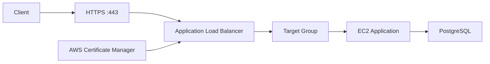
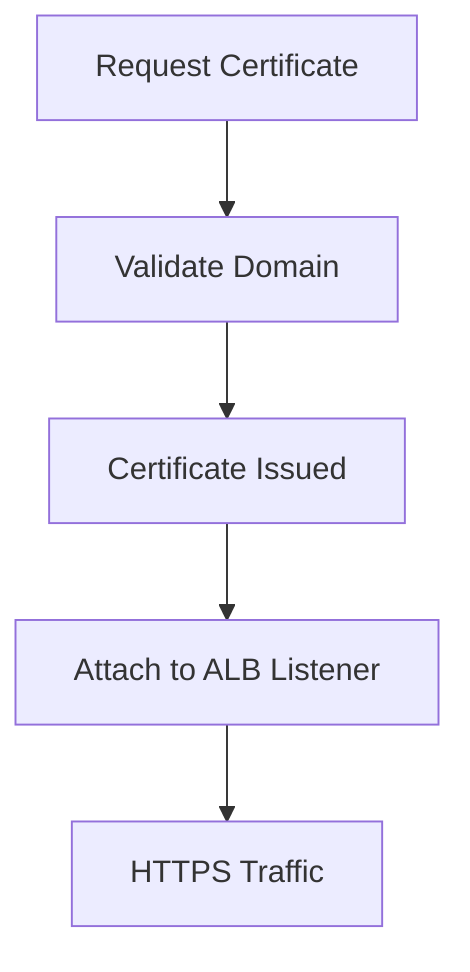
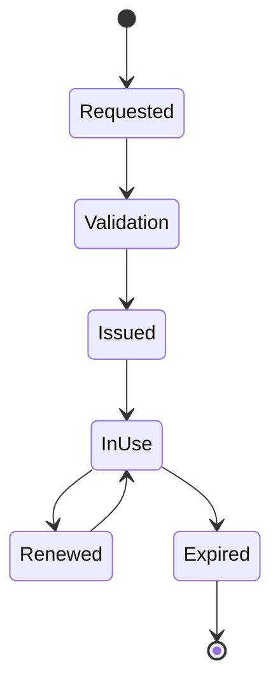
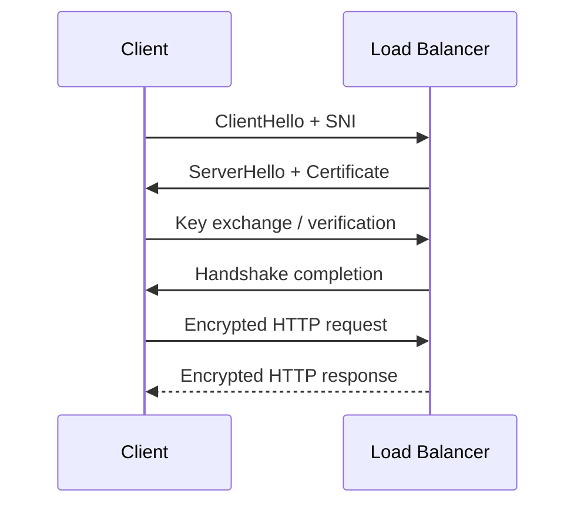
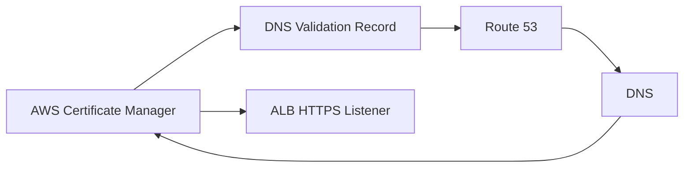
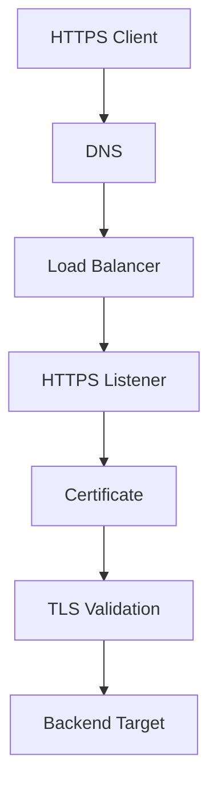

# 03- SSL Certificates

## Overview

SSL/TLS certificates provide cryptographic identity and encrypted communication between clients and services.

In AWS EC2 architectures, TLS is commonly terminated at an Application Load Balancer (ALB), Network Load Balancer (NLB), or another managed edge component rather than directly inside every EC2 application process.

A common production architecture is:



The certificate establishes the identity of the server and enables encrypted communication.

For an EC2-backed API, the typical flow is:

```text
Client
   |
   | HTTPS
   v
ALB :443
   |
   | HTTP/HTTPS
   v
EC2 :8000
   |
   v
Django / FastAPI
```

The important distinction is that **TLS termination and application processing are separate concerns**.

---

## TLS and SSL

SSL is the historical predecessor to TLS.

Modern systems should use **TLS**, not obsolete SSL protocols.

The term "SSL certificate" is still commonly used, but technically the certificate is used as part of a TLS connection.

```text
SSL
 |
 +-- Historical protocol family

TLS
 |
 +-- Modern encrypted transport protocol
 +-- Uses certificates for server identity
```

When configuring AWS infrastructure, prefer modern TLS versions and current security policies rather than legacy SSL terminology or protocols.

---

## What a TLS Certificate Provides

A server certificate primarily provides:

- Server identity
- Domain-name validation
- Public-key information
- A chain of trust
- Cryptographic material used during TLS establishment

It does not by itself provide:

- Application authentication
- Authorization
- User identity
- Database encryption
- Application-level access control

For example:

```text
HTTPS
  |
  +-- Encrypts transport
  +-- Authenticates server identity

Application Authentication
  |
  +-- JWT
  +-- Session
  +-- OAuth/OIDC
```

These are separate security layers.

---

## Certificate and Domain Name

Suppose the application is:

```text
api.example.com
```

The certificate must cover the hostname used by the client.

For example:

```text
Certificate
    |
    +-- api.example.com
```

A client connecting to:

```text
https://api.example.com
```

can validate that the certificate is valid for that hostname.

If the certificate does not match the requested hostname, clients may reject the connection.

---

## Subject Alternative Names

Modern certificates commonly use Subject Alternative Names (SANs) to specify the DNS names covered by the certificate.

For example:

```text
Certificate
 |
 +-- api.example.com
 +-- www.example.com
 +-- admin.example.com
```

This allows one certificate to cover multiple explicitly specified names.

---

## Wildcard Certificates

A wildcard certificate can cover multiple subdomains under a domain.

For example:

```text
*.example.com
```

can cover:

```text
api.example.com
admin.example.com
www.example.com
```

but it does not generally cover deeper names such as:

```text
api.internal.example.com
```

unless the certificate explicitly covers that name through an appropriate SAN entry or another certificate.

Wildcard certificates should be used deliberately because compromise of a broadly scoped private key can affect multiple services.

---

## AWS Certificate Manager

AWS Certificate Manager (ACM) is the AWS service commonly used to provision and manage TLS certificates for AWS services.

Typical workflow:



ACM can simplify:

- Certificate provisioning
- Domain validation
- Certificate deployment to supported AWS services
- Renewal management
- Certificate lifecycle management

For an ALB-based EC2 application, ACM is generally preferable to manually storing certificate files on EC2 when the architecture permits it.

---

## Public Certificates

A public ACM certificate is intended for publicly trusted DNS names.

For example:

```text
api.example.com
```

The certificate can be used by supported AWS services such as an Application Load Balancer.

Public certificates are commonly validated using DNS validation.

---

## Private Certificates

AWS Certificate Manager Private Certificate Authority (ACM Private CA) can be used for private PKI requirements.

Typical use cases include:

- Internal services
- Private APIs
- Service-to-service TLS
- Corporate PKI
- Internal device identity

Architecture:

```text
Private CA
    |
    +-- Service Certificate
    +-- Internal API Certificate
    +-- Internal Load Balancer
```

Private certificates should not be confused with publicly trusted certificates. Clients must trust the corresponding private CA.

---

## DNS Validation

DNS validation proves control over a domain by requiring a specific DNS record.

Conceptually:

```text
ACM
 |
 | "Create this DNS record"
 v
Route 53
 |
 | Validation record
 v
ACM
 |
 v
Certificate issued
```

DNS validation is generally preferable for long-lived AWS infrastructure because it can support automated certificate renewal without repeatedly performing manual validation.

---

## Email Validation

Certificate validation can also use email-based validation in supported workflows.

However, DNS validation is generally better suited to automated infrastructure because it avoids operational dependency on specific administrative mailboxes.

For infrastructure managed through Terraform, CloudFormation, or CI/CD, DNS validation fits naturally into an automated workflow.

---

## Certificate Lifecycle

A production certificate lifecycle looks like:



The goal of managed certificate services is to minimize the possibility of reaching the `Expired` state.

---

## Certificate Renewal

Certificate expiration is a major operational risk.

An expired certificate can cause:

```text
Client
   |
   v
HTTPS
   |
   X
Certificate validation failure
```

Symptoms may include:

- Browser security warnings
- API clients rejecting requests
- Mobile applications failing API calls
- Monitoring failures
- Integration outages

Use managed renewal mechanisms whenever possible.

---

## Certificate Deployment Model

For an ALB-based application:

```text
Client
  |
  | TLS
  v
ALB
  |
  | HTTP/HTTPS
  v
EC2
```

The certificate is attached to the ALB HTTPS listener.

The application does not need to manage the public certificate private key in this architecture.

This reduces certificate-management responsibility on EC2.

---

## TLS Termination at the Load Balancer

TLS termination means the load balancer decrypts the client connection.

```text
Client
   |
   | HTTPS
   v
ALB
   |
   | HTTP
   v
EC2
```

Advantages include:

- Centralized certificate management
- Simplified EC2 configuration
- Easier certificate rotation
- Reduced TLS configuration across application instances
- Consistent HTTPS behavior

This is a common architecture for Django and FastAPI APIs.

---

## End-to-End TLS

Some environments require encryption between the load balancer and the backend as well.

```text
Client
   |
   | HTTPS
   v
ALB
   |
   | HTTPS
   v
EC2
   |
   v
Application
```

This provides encryption on both network segments.

End-to-end TLS may be important when:

- Backend traffic crosses trust boundaries
- Security policies require encryption in transit
- Compliance requirements mandate encrypted internal traffic
- Internal networks are not considered inherently trusted

The backend target must have a certificate and appropriate TLS configuration in this model.

---

## TLS Architecture Comparison

| Architecture | Client → LB | LB → EC2 | Typical Use |
|---|---|---|---|
| TLS termination | HTTPS | HTTP | Common internal/private backend network |
| Re-encryption | HTTPS | HTTPS | Higher internal transport security |
| TLS pass-through | TLS | TLS | Specialized Layer 4 architecture |

The appropriate model depends on security requirements and the capabilities of the selected load balancer.

---

## ALB HTTPS Listener

An HTTPS ALB listener commonly looks like:

```text
Client
  |
  | HTTPS :443
  v
ALB
  |
  +-- Certificate
  +-- TLS Policy
  +-- Listener Rules
  |
  v
Target Group
```

Conceptually, the certificate is associated with the listener rather than with an individual EC2 instance.

---

## Multiple Certificates

An ALB HTTPS listener can support multiple certificates through Server Name Indication (SNI).

For example:

```text
HTTPS :443
    |
    +-- api.example.com certificate
    +-- admin.example.com certificate
    +-- shop.example.com certificate
```

The client provides the requested hostname during TLS negotiation.

The load balancer can then select the appropriate certificate.

This allows multiple HTTPS domains to share the same listener.

---

## SNI

Server Name Indication allows the client to communicate the hostname it is trying to reach during TLS negotiation.

Conceptually:

```text
Client
  |
  | TLS ClientHello
  | Server Name = api.example.com
  v
ALB
  |
  +-- Select api.example.com certificate
  |
  v
TLS established
```

Without SNI, hosting multiple unrelated certificates on a single TLS endpoint is significantly more constrained.

Modern browsers and most current API clients support SNI.

---

## Certificate Selection

For multiple certificates:

```text
ALB HTTPS Listener :443
        |
        +-- api.example.com
        |       |
        |       +-- API certificate
        |
        +-- admin.example.com
                |
                +-- Admin certificate
```

This is useful for multi-domain architectures.

Certificate organization should still remain manageable. Excessive domain consolidation can make certificate ownership and lifecycle management harder.

---

## TLS Security Policies

The TLS policy determines supported protocol versions and cryptographic behavior.

A production configuration should use a modern AWS security policy appropriate for the application's client compatibility requirements.

Consider:

- Minimum TLS version
- Supported cipher suites
- Legacy client compatibility
- Compliance requirements
- Security policy updates

Do not enable obsolete TLS protocols simply to support outdated clients without understanding the security implications.

---

## TLS Handshake

A simplified TLS connection is:



The exact handshake differs between TLS versions and cipher suites, but the important architectural concept is:

1. Client initiates TLS negotiation.
2. Server presents its certificate.
3. Client validates the certificate chain and hostname.
4. Cryptographic session keys are established.
5. Application traffic is encrypted.

---

## Certificate Trust Chain

A certificate is generally validated through a chain:

```text
Root CA
   |
   v
Intermediate CA
   |
   v
Server Certificate
   |
   v
api.example.com
```

The client uses trusted CA information to establish whether the presented certificate can be trusted.

This is why a certificate is not simply a standalone file containing a public key.

---

## Certificate Private Keys

The private key associated with a certificate is sensitive cryptographic material.

Do not:

- Commit private keys to Git
- Store them in application source code
- Put them in Docker images unnecessarily
- Share them through chat
- Place them in public S3 buckets
- Store them in plain-text configuration repositories

When using ACM with supported AWS services, AWS manages the certificate's private key lifecycle within the service.

---

## Certificate and EC2

There are two broad deployment models.

### Managed Certificate at Load Balancer

```text
Internet
   |
   | HTTPS
   v
ALB + ACM Certificate
   |
   | HTTP/HTTPS
   v
EC2
```

This is usually preferable for standard public HTTP APIs.

### Certificate on EC2

```text
Internet
   |
   v
EC2
   |
   +-- Nginx
   +-- Certificate
   +-- Application
```

This may be appropriate when:

- There is no terminating load balancer
- A specialized network architecture requires local TLS termination
- The application must directly manage TLS
- The service is outside an AWS managed termination path

However, managing certificates independently across a large EC2 fleet increases operational complexity.

---

## Nginx with TLS

When Nginx terminates TLS directly:

```text
Client
  |
  | HTTPS :443
  v
Nginx
  |
  | HTTP
  v
Gunicorn
  |
  v
Django
```

A simplified Nginx configuration might look like:

```nginx
server {
    listen 443 ssl;
    server_name api.example.com;

    ssl_certificate /etc/nginx/tls/fullchain.pem;
    ssl_certificate_key /etc/nginx/tls/privkey.pem;

    location / {
        proxy_pass http://127.0.0.1:8000;
    }
}
```

For production, certificate files must be securely provisioned, permissions restricted, and renewal automated.

---

## Certificate Rotation

Certificate rotation should not require application downtime.

A managed architecture is:

```text
New Certificate
      |
      v
ACM
      |
      v
ALB Listener
      |
      v
New Certificate Active
```

The application instances do not need to be restarted when TLS terminates at the ALB.

This is one of the operational advantages of centralized TLS termination.

---

## Certificate Renewal vs Rotation

These concepts are related but different.

| Operation | Meaning |
|---|---|
| Renewal | Extending the validity of an existing certificate |
| Rotation | Replacing one certificate with another |
| Replacement | Changing certificate/domain coverage or PKI source |

For example:

```text
Certificate A
    |
    | Renewal
    v
Certificate A - renewed validity
```

versus:

```text
Certificate A
    |
    | Rotation
    v
Certificate B
```

A production system should support both without manual emergency intervention.

---

## Wildcard vs Individual Certificates

| Approach | Advantages | Limitations |
|---|---|---|
| Individual certificate | Narrow scope, clear ownership | More certificates to manage |
| Wildcard | Covers many subdomains | Broader key scope |
| Multi-domain/SAN | Multiple explicit names | Certificate lifecycle can become complex |

Use the narrowest practical certificate scope that fits the architecture.

---

## Certificate Validation and DNS

For AWS infrastructure, Route 53 is commonly used with ACM DNS validation.

Conceptually:



This is particularly useful when infrastructure is managed through automation.

---

## Infrastructure as Code

Certificate management should ideally be represented in infrastructure definitions.

A simplified Terraform-style example is:

```hcl
resource "aws_acm_certificate" "api" {
  domain_name       = "api.example.com"
  validation_method = "DNS"

  lifecycle {
    create_before_destroy = true
  }
}
```

The exact resource configuration depends on the DNS provider and deployment architecture.

The important principle is that certificate issuance, validation, listener association, and renewal-related infrastructure should be reproducible.

---

## AWS CLI Inspection

List ACM certificates:

```bash
aws acm list-certificates
```

Describe a certificate:

```bash
aws acm describe-certificate \
    --certificate-arn arn:aws:acm:region:account-id:certificate/example
```

List ALB listeners:

```bash
aws elbv2 describe-listeners \
    --load-balancer-arn arn:aws:elasticloadbalancing:region:account-id:loadbalancer/app/example/1234567890abcdef
```

These commands are useful when troubleshooting certificate association and listener configuration.

---

## Certificate Troubleshooting

A practical troubleshooting flow is:



Check:

1. DNS points to the intended load balancer.
2. HTTPS listener exists on port 443.
3. Correct certificate is associated with the listener.
4. Certificate covers the requested hostname.
5. Certificate is issued and valid.
6. Certificate chain is trusted by the client.
7. TLS security policy supports the client.
8. Listener rules route traffic correctly.
9. Backend targets are healthy.

---

## Common Certificate Failures

| Symptom | Possible Cause |
|---|---|
| Certificate hostname mismatch | Requested domain not covered |
| Certificate expired | Renewal failed or certificate unmanaged |
| Browser trust error | Invalid/untrusted certificate chain |
| HTTPS listener unavailable | Listener configuration problem |
| Wrong certificate returned | SNI/certificate association issue |
| ACM certificate pending | Domain validation incomplete |
| TLS handshake failure | Protocol/cipher/client compatibility |
| HTTP works but HTTPS fails | TLS/listener/certificate configuration |
| Backend works directly but HTTPS fails | Load balancer TLS configuration |

---

## Security Considerations

### Use Modern TLS

Avoid obsolete SSL protocols and outdated TLS versions where possible.

### Protect Private Keys

Private keys should never be treated as ordinary application configuration.

### Use HTTPS Everywhere Appropriate

Public APIs should generally use HTTPS.

For internal traffic, determine whether the environment and security requirements require TLS between services as well.

### Restrict Backend Access

If the ALB terminates public TLS:

```text
Internet
   |
   v
ALB :443
   |
   v
Private EC2 :8000
```

The EC2 application port should not normally be publicly exposed.

### Monitor Certificate Expiration

Certificate expiry should be observable before it becomes an outage.

---

## Monitoring and Operations

Certificate operations should be included in infrastructure monitoring.

Monitor:

- Certificate status
- Certificate expiration
- Validation state
- Listener certificate associations
- TLS negotiation failures
- HTTPS error rates

Operational alerts should provide enough lead time to investigate certificate problems before expiration.

Managed renewal reduces operational work but does not eliminate the need to monitor certificate state.

---

## Cost Considerations

AWS Certificate Manager public certificates can simplify certificate management for supported AWS services.

The larger cost consideration is usually operational rather than the certificate itself:

- Manual renewal effort
- Certificate outages
- Fleet-wide certificate deployment
- Secret management
- Certificate rotation
- Engineering time

Centralized certificate management can significantly reduce operational complexity.

---

## High Availability

TLS termination at a managed load balancer supports highly available architectures:

```text
                  ALB
             /            \
        AZ-A                AZ-B
         |                    |
      EC2-A                EC2-B
```

The certificate is associated with the load balancer listener rather than a single EC2 instance.

This means replacing an EC2 instance does not require reinstalling the public certificate on that instance when TLS terminates at the ALB.

---

## Disaster Recovery

Certificate infrastructure should be considered part of the application's recovery architecture.

For important services:

- Keep DNS configuration reproducible.
- Keep certificate configuration in infrastructure code.
- Document certificate ownership.
- Document validation records.
- Maintain access to the AWS account responsible for certificate management.
- Understand Region-specific certificate requirements.
- Test recovery procedures.

A certificate existing in one AWS Region does not automatically make it available in every other Region.

Regional architecture should therefore account for certificate provisioning where required.

---

## Common Mistakes

### Using "SSL" as a Modern Protocol

SSL is obsolete.

Use modern TLS protocols and AWS security policies.

### Storing Private Keys in Git

Private keys are secrets and must not be committed.

If a private key is accidentally committed, removing the file from the latest commit is not sufficient. Treat the key as compromised and rotate it.

### Manually Installing Certificates on Every EC2 Instance

This creates fleet-wide operational overhead.

Prefer centralized TLS termination where the architecture supports it.

### Forgetting the Hostname

A certificate for:

```text
example.com
```

does not automatically mean:

```text
api.example.com
```

is covered.

Always verify certificate SANs and hostname coverage.

### Ignoring Certificate Renewal

A certificate can work perfectly for months and then cause a complete outage when it expires.

Use automated renewal and monitoring.

### Trusting Any Certificate in Internal Environments

Private networks are not automatically secure.

When internal TLS is required, establish a proper private PKI and trust model.

### Confusing TLS with Authentication

HTTPS encrypts transport and authenticates the server through the certificate.

It does not authenticate your application's users.

Application authentication still requires mechanisms such as sessions, OAuth/OIDC, JWTs, or another appropriate identity system.

---

## Production Checklist

```text
[ ] Public APIs use HTTPS
[ ] Modern TLS policy is configured
[ ] Certificate covers all required hostnames
[ ] DNS validation is configured where appropriate
[ ] Certificate renewal is automated
[ ] Certificate status is monitored
[ ] Certificate expiration is monitored
[ ] HTTPS listener is configured correctly
[ ] HTTP-to-HTTPS redirect is configured where required
[ ] Private keys are protected
[ ] Backend instances are not unnecessarily publicly exposed
[ ] Proxy headers are handled correctly
[ ] Internal TLS requirements are documented
[ ] Certificate ownership is documented
[ ] Certificate configuration is reproducible
[ ] Multi-Region certificate requirements are understood
[ ] Certificate failure scenarios have been tested
```

---

## Interview Considerations

### What is an SSL certificate?

An SSL certificate is commonly used to refer to a TLS server certificate. It provides server identity and contains public-key information used during secure TLS communication.

### Why use ACM with an ALB?

ACM provides managed certificate lifecycle capabilities, while the ALB can use the certificate for HTTPS termination without requiring the certificate private key to be manually deployed across EC2 instances.

### Where is a certificate attached when using an ALB?

The certificate is associated with an HTTPS listener.

```text
ALB
 |
 +-- HTTPS Listener :443
       |
       +-- Certificate
       +-- Listener Rules
       |
       v
   Target Group
```

### What is TLS termination?

TLS termination occurs when a network component, such as an ALB, establishes the encrypted client connection and decrypts the traffic before forwarding it to the backend.

### Is traffic between ALB and EC2 automatically encrypted?

Not necessarily. If the ALB forwards HTTP to the target, that segment is HTTP. HTTPS can be configured between the ALB and backend targets when required.

### What is SNI?

Server Name Indication allows a TLS client to indicate the hostname it is connecting to during TLS negotiation, allowing a load balancer to select the appropriate certificate when multiple certificates share a listener.

### What happens when a certificate expires?

Clients can reject the TLS connection, potentially causing HTTPS requests to fail even if the application itself is healthy.

### Public vs private certificate?

A public certificate is intended for publicly trusted domain names and clients. A private certificate is issued through a private CA and requires clients to trust that private CA.

## Key Takeaways

- Modern AWS HTTPS architectures should use **TLS**, with ACM commonly providing managed certificates for supported AWS services such as load balancers.
- For EC2-backed APIs, terminating TLS at an ALB centralizes certificate management and avoids distributing public certificate private keys across the instance fleet.
- Certificate correctness depends on hostname coverage, trust chain, validation, listener configuration, TLS policy, and lifecycle management.
- Production systems should automate certificate issuance and renewal where possible and monitor certificate status and expiration.
- TLS protects transport and establishes server identity; it does not replace application authentication, authorization, or other security controls.