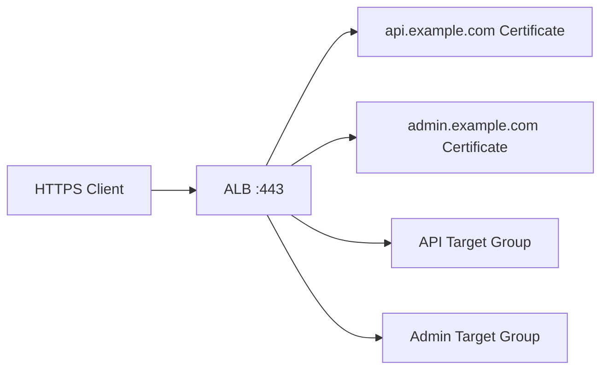
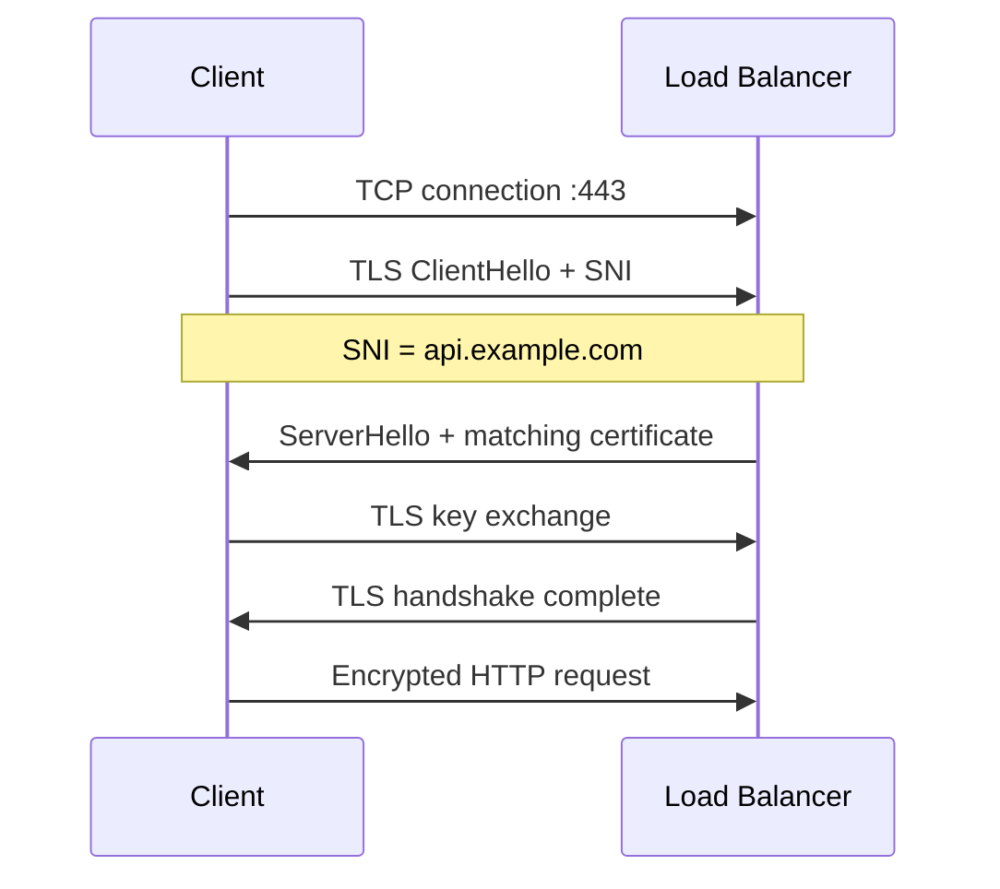
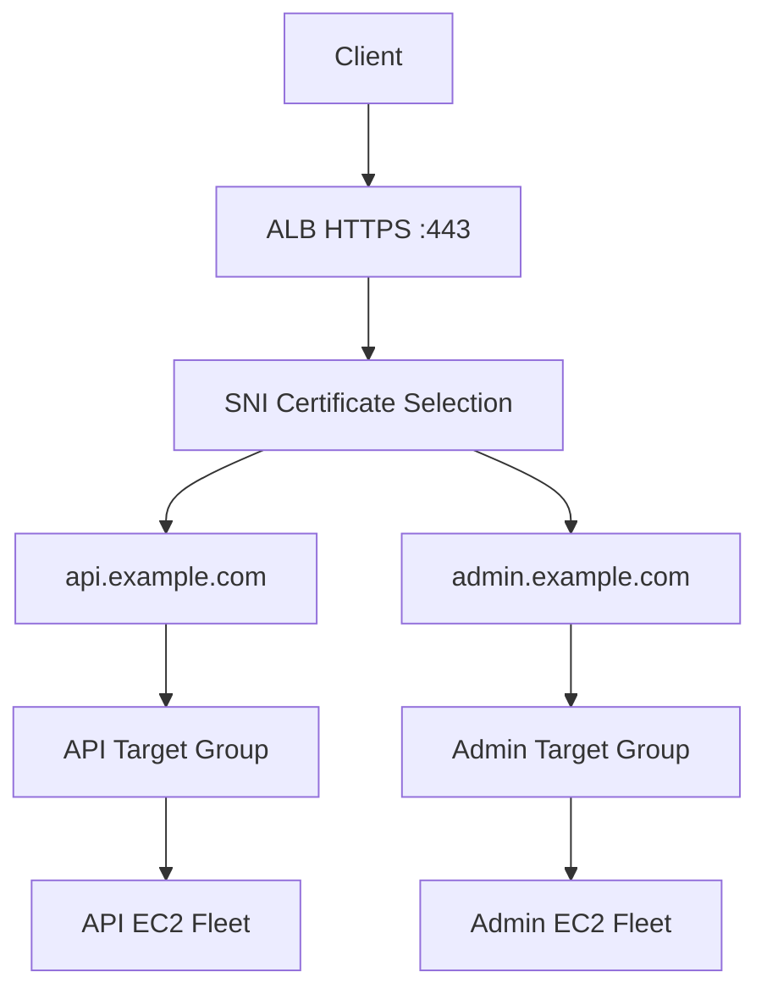
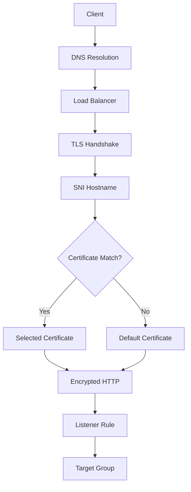
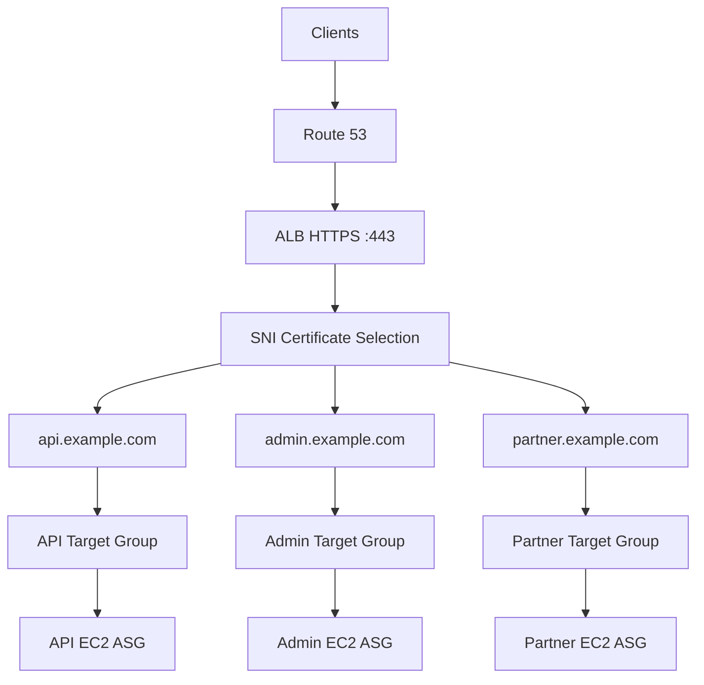

# 04- SNI

## Overview

Server Name Indication (SNI) is a TLS extension that allows a client to indicate the hostname it is connecting to during the TLS handshake.

SNI solves an important problem in multi-domain HTTPS architectures: multiple secure applications can share the same IP address and TLS listener while presenting different certificates based on the requested hostname.

For AWS Elastic Load Balancing, both Application Load Balancers and Network Load Balancers support SNI. When multiple certificates are associated with a secure listener, SNI allows the load balancer to select the appropriate certificate for the hostname supplied by the client. :contentReference[oaicite:0]{index=0}

A typical architecture is:



The important distinction is:

```text
SNI
 |
 +-- Helps select the TLS certificate

Host-based routing
 |
 +-- Determines where the HTTP request is forwarded
```

These mechanisms can work together, but they solve different problems.

---

## Why SNI Exists

Before SNI became widely supported, a TLS endpoint generally had difficulty hosting multiple certificates for different domains on the same IP address and port.

Consider:

```text
203.0.113.10:443
```

Suppose the same endpoint serves:

```text
api.example.com
admin.example.com
shop.example.com
```

Each domain might require a different certificate.

Without SNI, the server has limited information during the early TLS handshake about which hostname the client wants.

With SNI:

```text
Client
  |
  | ClientHello
  | SNI = api.example.com
  v
Load Balancer
  |
  +-- Select api.example.com certificate
  |
  v
TLS handshake
```

This allows multiple certificates to coexist on the same secure listener.

---

## SNI vs Host Header

SNI and the HTTP `Host` header are related but occur at different stages.

```text
TLS Layer
    |
    +-- SNI
    |
    v
TLS established
    |
    v
HTTP Layer
    |
    +-- Host header
```

For example:

```text
TLS ClientHello
    SNI = api.example.com
        |
        v
Certificate selection
        |
        v
Encrypted HTTP request
    Host: api.example.com
        |
        v
Listener routing
```

The SNI value is available during TLS negotiation, before the encrypted HTTP request can normally be inspected.

The HTTP `Host` header is part of the application-layer request and can be used for HTTP routing after TLS is established.

---

## SNI Request Flow

A simplified TLS flow is:



The key point is that the hostname is supplied early enough for the load balancer to choose an appropriate certificate.

---

## TLS ClientHello and SNI

SNI is sent as part of the TLS `ClientHello` message.

Conceptually:

```text
ClientHello
 |
 +-- TLS version
 +-- Supported cipher suites
 +-- Extensions
       |
       +-- Server Name
              |
              +-- api.example.com
```

The server or load balancer can use the server name to select the certificate that should be presented.

---

## SNI Certificate Selection

Suppose an HTTPS listener has:

```text
Certificate A
    api.example.com

Certificate B
    admin.example.com

Certificate C
    shop.example.com
```

A client connects to:

```text
https://admin.example.com
```

and sends:

```text
SNI = admin.example.com
```

The load balancer can select:

```text
Certificate B
```

The resulting flow is:

```text
Client
 |
 | SNI = admin.example.com
 v
ALB
 |
 +-- Certificate A -> no match
 +-- Certificate B -> match
 +-- Certificate C -> no match
 |
 v
Certificate B
```

AWS load balancers use a smart certificate selection algorithm when multiple certificates are configured. If the hostname matches a single certificate, that certificate is selected. If multiple certificates match, the load balancer selects an appropriate certificate based on client compatibility and certificate characteristics. :contentReference[oaicite:1]{index=1}

---

## Default Certificate

A secure listener has a default certificate.

The default certificate is important when:

- The client does not send SNI.
- The SNI hostname does not match an appropriate certificate.

Conceptually:

```text
Client
 |
 +-- SNI = api.example.com
 |       |
 |       +--> Matching certificate
 |
 +-- No SNI
         |
         +--> Default certificate
```

AWS documents that for ALB and NLB certificate lists, the default certificate is used when a client does not provide SNI or when there is no matching certificate. :contentReference[oaicite:2]{index=2}

Therefore, the default certificate should be chosen deliberately.

---

## Certificate List

An HTTPS or TLS listener can have a default certificate and additional certificates in its certificate list.

Example:

```text
HTTPS :443
 |
 +-- Default Certificate
 |     *.example.com
 |
 +-- Certificate List
       |
       +-- api.other-domain.com
       +-- admin.other-domain.com
       +-- service.example.org
```

This allows multiple secure domains to share a listener.

AWS supports adding certificates to the listener certificate list through the ELB APIs and management interfaces. :contentReference[oaicite:3]{index=3}

---

## SNI and Wildcard Certificates

SNI does not eliminate the need to design certificate coverage correctly.

For example:

```text
*.example.com
```

can cover:

```text
api.example.com
admin.example.com
```

but does not generally cover:

```text
api.internal.example.com
```

A wildcard certificate also does not normally cover the apex domain:

```text
example.com
```

unless that hostname is separately included in the certificate.

Therefore, certificate design and SNI configuration should be considered together.

---

## SNI and SAN Certificates

Subject Alternative Names (SANs) allow multiple explicit DNS names to be covered by one certificate.

For example:

```text
Certificate
 |
 +-- api.example.com
 +-- admin.example.com
 +-- shop.example.com
```

SNI and SAN solve different problems:

| Mechanism | Purpose |
|---|---|
| SAN | Defines hostnames covered by one certificate |
| SNI | Tells the TLS endpoint which hostname the client requested |
| Certificate list | Allows multiple certificates on one listener |

You can use either a SAN certificate or multiple certificates with SNI depending on the architecture.

---

## SNI with Application Load Balancer

ALB supports SNI for HTTPS listeners.

A typical architecture is:



SNI handles certificate selection.

Listener rules can then handle application routing.

---

## SNI with ALB Routing

Consider:

```text
api.example.com
admin.example.com
```

The complete request flow can be:

```text
Client
 |
 | SNI = api.example.com
 v
ALB
 |
 +-- Select api.example.com certificate
 |
 +-- TLS established
 |
 +-- HTTP Host = api.example.com
 |
 +-- Listener rule
 |
 v
API Target Group
```

The certificate-selection stage and HTTP-routing stage are separate.

---

## SNI with Network Load Balancer

NLB also supports SNI on TLS listeners.

A simplified architecture is:

```text
Client
 |
 | TLS + SNI
 v
NLB :443
 |
 +-- Certificate A
 +-- Certificate B
 +-- Certificate C
 |
 v
Target
```

AWS documents certificate lists and SNI support for NLB TLS listeners as well. :contentReference[oaicite:4]{index=4}

---

## ALB vs NLB SNI

| Capability | ALB | NLB |
|---|---|---|
| SNI support | Yes | Yes |
| Multiple certificates | Yes | Yes |
| HTTPS/TLS listener | HTTPS | TLS |
| Host-based HTTP routing | Yes | No ALB-style HTTP routing |
| Path-based HTTP routing | Yes | No |
| Layer | 7 | 4 |
| Typical SNI use | Web/API domains | TLS/network services |

SNI itself is a TLS feature; the surrounding routing capabilities depend on the load balancer type.

---

## SNI and TLS Termination

SNI is most directly useful when the load balancer terminates TLS.

```text
Client
 |
 | HTTPS
 v
ALB
 |
 +-- SNI
 +-- Certificate
 +-- TLS termination
 |
 v
EC2
```

The load balancer receives the SNI value during the TLS handshake and selects the certificate before completing the TLS negotiation.

---

## SNI and End-to-End TLS

SNI can also appear on multiple TLS hops.

For example:

```text
Client
 |
 | HTTPS + SNI
 v
ALB
 |
 | HTTPS
 v
EC2
```

The client-to-ALB connection and ALB-to-target connection are separate TLS connections.

The SNI value used on the frontend connection does not automatically mean the backend connection uses the same TLS configuration.

Backend TLS must be configured independently.

For ALB HTTPS target groups, the load balancer establishes TLS connections to targets using certificates installed on the targets. AWS notes that it does not validate those target certificates. :contentReference[oaicite:5]{index=5}

---

## SNI and mTLS

SNI should not be confused with mutual TLS.

### SNI

Used primarily to identify the requested server hostname during TLS negotiation.

```text
Client
 |
 +-- "I want api.example.com"
 |
 v
Server certificate selection
```

### mTLS

Used to authenticate both sides.

```text
Client
 |
 +-- Client certificate
 |
 v
Server
 |
 +-- Server certificate
```

They solve different problems.

```text
SNI
 -> Which server name is being requested?

mTLS
 -> Can the client also prove its identity?
```

---

## SNI and Security

SNI itself should not be treated as an authentication mechanism.

The hostname in SNI is supplied by the client.

Therefore:

```text
SNI = api.example.com
```

does not prove that the client is authorized to access `api.example.com`.

The certificate proves server identity to the client when properly validated.

Application authorization still requires mechanisms such as:

- OAuth/OIDC
- JWT
- Sessions
- API keys
- IAM-based authorization
- mTLS where appropriate

---

## SNI and DNS

DNS determines where the client connects.

For example:

```text
api.example.com
       |
       v
DNS
       |
       v
ALB address
       |
       v
TLS + SNI
```

A complete architecture is therefore:


DNS and SNI solve different stages of the connection.

---

## SNI and Route 53

A common AWS architecture is:

```text
Route 53
   |
   +-- api.example.com
   +-- admin.example.com
   +-- shop.example.com
          |
          v
        ALB
          |
          +-- SNI certificates
          |
          +-- Listener rules
```

Multiple DNS names can resolve to the same ALB while the ALB uses SNI to present the appropriate certificate.

---

## SNI and Microservices

SNI can be useful when multiple HTTPS services share a load-balancing endpoint.

For example:

```text
api.example.com
    |
    +-- API certificate
    |
    +-- API Target Group

admin.example.com
    |
    +-- Admin certificate
    |
    +-- Admin Target Group
```

This allows a single ALB to serve multiple secure applications.

However, certificate sharing should not be confused with application isolation. Services still require appropriate:

- Security groups
- IAM permissions
- Routing rules
- Authentication
- Authorization
- Logging
- Monitoring

---

## SNI and Django

A Django deployment may use:

```text
api.example.com
      |
      v
ALB
      |
      +-- SNI certificate
      |
      v
Django
```

Django should still be configured correctly for HTTPS-aware operation when TLS terminates at the ALB.

Important areas include:

- `ALLOWED_HOSTS`
- CSRF trusted origins
- Secure cookies
- Proxy HTTPS configuration

SNI only determines the certificate presented during TLS negotiation. It does not replace Django's host validation or security configuration.

---

## SNI and FastAPI

A FastAPI architecture can use:

```text
api.example.com
      |
      v
ALB
      |
      +-- SNI certificate
      |
      v
FastAPI
```

The application remains responsible for:

- Authentication
- Authorization
- Request validation
- Application-level security

The ALB handles the frontend TLS connection.

---

## Certificate Selection with Multiple Matches

A certificate list may contain overlapping certificates.

For example:

```text
Certificate A
    *.example.com

Certificate B
    api.example.com
```

A request for:

```text
api.example.com
```

could match both.

AWS load balancers use a smart certificate selection algorithm to choose the best certificate that the client can support. AWS documents preference criteria including public-key algorithm, hashing algorithm, key length, and validity period when multiple certificates match. :contentReference[oaicite:6]{index=6}

Avoid creating unnecessary overlapping certificates because they make certificate management and troubleshooting harder.

---

## Certificate Selection and Client Compatibility

Certificate selection is not simply:

```text
Hostname -> First Matching Certificate
```

The load balancer can consider the client's capabilities when multiple certificates match.

For example, multiple certificates might differ in:

- RSA vs ECDSA key algorithm
- Key length
- Hashing algorithm
- Validity characteristics

AWS's smart selection logic considers these properties when multiple certificates match. :contentReference[oaicite:7]{index=7}

---

## SNI and Non-SNI Clients

Modern browsers and most modern API clients support SNI.

However, some older clients may not send SNI.

In that case:

```text
Client
 |
 | TLS without SNI
 v
ALB
 |
 v
Default Certificate
```

Therefore, the default certificate still matters even when the majority of clients support SNI.

---

## Default Certificate Strategy

When multiple certificates are configured, choose the default certificate deliberately.

A useful strategy is to use a certificate that:

- Covers the primary production domain
- Is valid for expected non-SNI clients where relevant
- Does not expose an unrelated internal or sensitive hostname
- Has a predictable ownership model

Do not treat the default certificate as an unimportant placeholder.

---

## SNI and Access Logs

Load balancer access logs can provide useful SNI-related information.

For ALB access logs, fields include the hostname supplied by the client during the TLS handshake and the ARN of the certificate presented to the client. :contentReference[oaicite:8]{index=8}

This can help investigate:

- Unexpected hostname requests
- Wrong certificate presentation
- Certificate-selection behavior
- Client compatibility problems
- Multi-domain listener configuration

---

## Troubleshooting SNI

A practical troubleshooting flow is:



Check the following:

1. Confirm the client is connecting to the expected hostname.
2. Confirm DNS resolves to the intended load balancer.
3. Confirm the client sends SNI.
4. Inspect the certificate list on the listener.
5. Verify the requested hostname is covered by a certificate.
6. Check the default certificate.
7. Check certificate status and validity.
8. Check TLS security policy compatibility.
9. Check listener routing rules.
10. Check target health.

---

## Inspecting Certificates with OpenSSL

OpenSSL can be useful for troubleshooting TLS and SNI behavior.

Specify the hostname explicitly:

```bash
openssl s_client \
    -connect api.example.com:443 \
    -servername api.example.com
```

The `-servername` option sends the SNI hostname.

You can inspect certificate information with:

```bash
openssl s_client \
    -connect api.example.com:443 \
    -servername api.example.com \
    -showcerts
```

This is useful when diagnosing:

- Wrong certificate
- Certificate chain issues
- TLS negotiation
- SNI behavior
- Protocol compatibility

---

## Comparing SNI and No SNI

With SNI:

```bash
openssl s_client \
    -connect api.example.com:443 \
    -servername api.example.com
```

Without explicitly specifying SNI:

```bash
openssl s_client \
    -connect api.example.com:443
```

The resulting certificate can differ when the listener hosts multiple certificates.

The test should always be interpreted alongside the listener's default certificate and certificate list.

---

## AWS CLI Inspection

List load balancers:

```bash
aws elbv2 describe-load-balancers
```

List listeners:

```bash
aws elbv2 describe-listeners \
    --load-balancer-arn "$LOAD_BALANCER_ARN"
```

List certificates associated with a listener:

```bash
aws elbv2 describe-listener-certificates \
    --listener-arn "$LISTENER_ARN"
```

Add a certificate to a listener's certificate list:

```bash
aws elbv2 add-listener-certificates \
    --listener-arn "$LISTENER_ARN" \
    --certificates CertificateArn="$CERTIFICATE_ARN"
```

Replace the default certificate:

```bash
aws elbv2 modify-listener \
    --listener-arn "$LISTENER_ARN" \
    --certificates CertificateArn="$CERTIFICATE_ARN"
```

These operations should be performed carefully in production because changing certificates can affect live TLS connections.

---

## Production Architecture

A multi-domain API platform might use:



This architecture separates:

```text
DNS
 |
 v
TLS certificate selection
 |
 v
HTTP routing
 |
 v
Backend capacity
```

Each layer has a distinct responsibility.

---

## Security Considerations

### Do Not Trust SNI for Authorization

SNI identifies the hostname requested by the client.

It does not prove identity or authorization.

### Protect Certificate Private Keys

When using ACM with supported AWS load balancers, certificate private-key management is handled by the managed service rather than requiring manual distribution across EC2 instances.

### Use Modern TLS Policies

SNI does not make an insecure TLS policy secure.

Configure an appropriate modern TLS security policy based on application and client requirements.

AWS load balancers provide configurable TLS security policies that determine supported protocols and cipher suites. :contentReference[oaicite:9]{index=9}

### Restrict Backend Access

The backend should generally accept traffic only from the intended load-balancing layer.

```text
Internet
   |
   v
ALB
   |
   v
Private EC2
```

---

## Performance Considerations

SNI certificate selection occurs during TLS establishment.

The practical performance considerations are generally related to:

- TLS handshakes
- Certificate selection
- TLS version
- Cipher suite
- Connection reuse
- Session resumption
- Client behavior

For ordinary API workloads, certificate selection itself should not be treated as the primary performance bottleneck.

More important factors usually include:

- TLS handshake frequency
- Connection reuse
- Request latency
- Backend latency
- Network throughput

---

## High Availability

SNI does not change the high-availability architecture of the load balancer.

A production design should still use:

- Multi-AZ load balancing
- Multiple healthy targets
- Auto Scaling
- Managed certificates
- Health checks
- Monitoring
- Automated certificate lifecycle management

SNI simply allows multiple secure hostnames to share the listener.

---

## Cost Considerations

SNI can reduce the need to create separate load balancers solely because different domains require different certificates.

For example:

```text
Without consolidation:

ALB A -> api.example.com
ALB B -> admin.example.com
ALB C -> shop.example.com
```

may be replaced with:

```text
One ALB
 |
 +-- api.example.com
 +-- admin.example.com
 +-- shop.example.com
```

when the routing, security, ownership, and availability requirements make shared infrastructure appropriate.

Cost should not be the only consideration. Separate load balancers may still be justified by:

- Isolation
- Security boundaries
- Independent ownership
- Different networking requirements
- Different scaling or operational requirements

---

## Common Mistakes

### Confusing SNI with Host-Based Routing

SNI selects the certificate during TLS negotiation.

The HTTP `Host` header can be used for application-layer routing after TLS is established.

### Forgetting the Default Certificate

Clients that do not provide SNI or do not match a certificate can receive the default certificate.

### Assuming Every Certificate Matches Every Subdomain

Certificate coverage must be explicitly verified through SANs and wildcard rules.

### Using SNI as Authentication

SNI is client-provided hostname information, not proof of client identity.

### Creating Excessive Overlapping Certificates

Multiple overlapping certificates make certificate selection and operations harder to reason about.

### Ignoring Older Clients

Most modern clients support SNI, but legacy clients may not.

If legacy compatibility matters, validate the default-certificate behavior explicitly.

### Forgetting Backend TLS Is Separate

Frontend TLS:

```text
Client -> ALB
```

and backend TLS:

```text
ALB -> EC2
```

are separate connections.

Configuring SNI and certificates on the frontend does not automatically configure backend TLS.

---

## Interview Considerations

### What is SNI?

Server Name Indication is a TLS extension that allows a client to specify the hostname it is connecting to during the TLS handshake.

### Why is SNI useful?

It allows multiple secure domains to share the same IP address and TLS listener while presenting different certificates.

### What problem does SNI solve?

Without SNI, a TLS endpoint has limited information during the initial handshake about which hostname the client wants. SNI provides that hostname early enough for the server or load balancer to select an appropriate certificate.

### Is SNI the same as the HTTP Host header?

No.

```text
SNI
 -> TLS handshake
 -> Certificate selection

Host header
 -> HTTP request
 -> Application-layer routing
```

### What happens if the client does not support SNI?

The load balancer uses the default certificate associated with the secure listener.

### Can ALB use multiple certificates?

Yes. Multiple certificates can be associated with an HTTPS listener through its certificate list, with SNI used for certificate selection.

### Does NLB support SNI?

Yes. NLB TLS listeners support SNI and certificate lists.

### Does SNI authenticate the client?

No. SNI identifies the hostname requested by the client. It does not authenticate or authorize the client.

### Can SNI and host-based routing be used together?

Yes.

A typical flow is:

```text
SNI
 |
 v
Select TLS certificate
 |
 v
TLS established
 |
 v
HTTP Host
 |
 v
Select target group
```

### What is the role of the default certificate?

It provides the certificate used when there is no matching SNI-based certificate, including clients that do not provide SNI.

## Key Takeaways

- **SNI is a TLS extension that lets clients provide the requested hostname during the TLS handshake, enabling certificate selection for multiple secure domains on one listener.**
- **SNI and HTTP host-based routing solve different problems:** SNI selects the TLS certificate, while HTTP routing determines where the request is forwarded.
- **ALB and NLB support SNI and certificate lists**, allowing multiple domains to share a secure listener with appropriate certificates.
- **The default certificate remains important** for clients without SNI or requests without a matching certificate, so it should be selected deliberately.
- **SNI is not an authentication mechanism**; production systems still require appropriate application authentication, authorization, TLS policies, certificate lifecycle management, and network security.