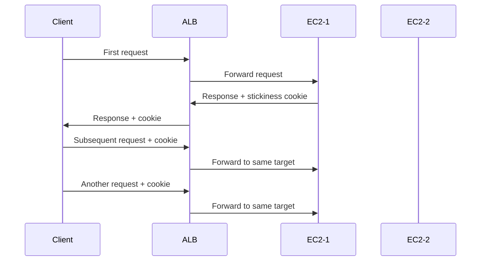
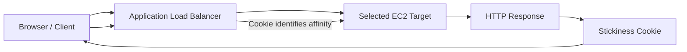
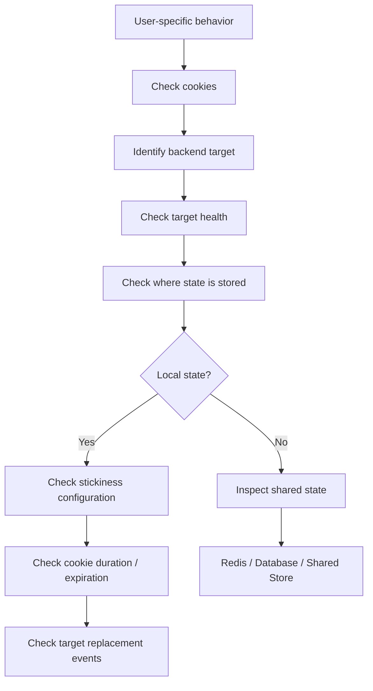

# 05- Sticky Sessions

## Overview

Sticky sessions, also called **session affinity**, configure a load balancer to consistently route requests from the same client to the same backend target for some period of time.

Without session affinity, requests from one client can be distributed across multiple healthy targets:

```text
Client
  |
  v
Load Balancer
  |
  +----> EC2-1
  |
  +----> EC2-2
  |
  +----> EC2-3
```

With sticky sessions enabled:

```text
Client
  |
  v
Load Balancer
  |
  +----> EC2-2
           ^
           |
       Subsequent requests
```

Sticky sessions are primarily useful for applications that maintain **client-specific state on a particular backend instance**.

For modern backend systems, however, the preferred architecture is generally to make application instances stateless and move shared state into systems such as Redis or a database. Sticky sessions should therefore be treated as a deliberate compatibility or transitional mechanism rather than the default scaling strategy.

---

## Why Sticky Sessions Exist

A load balancer normally distributes requests among healthy targets.

For example:

```text
Request 1 -> EC2-1
Request 2 -> EC2-2
Request 3 -> EC2-3
Request 4 -> EC2-1
```

This works well when every backend instance has access to the same application state.

Problems occur when state is stored locally on an instance.

For example:

```text
EC2-1
 |
 +-- User session
 +-- Temporary application state
 +-- In-memory cache

EC2-2
 |
 +-- Different memory
 +-- Different session state
```

A user may authenticate against EC2-1 and then have a subsequent request routed to EC2-2.

The second request may not find the state created by the first request.

Sticky sessions address this by creating an affinity relationship between the client and a target.

---

## Stateless vs Stateful Backend

The difference is fundamental.

### Stateless Application

```text
Client
   |
   v
ALB
   |
   +----> API-1
   |
   +----> API-2
   |
   +----> API-3

Shared State
   |
   +----> Redis
   +----> PostgreSQL
```

Any instance can process any request.

### Stateful Application

```text
Client
   |
   v
ALB
   |
   +----> API-1
             |
             +-- Local session

Client's next request
   |
   v
ALB
   |
   +----> API-1
```

The application depends on the request returning to the same instance.

This second architecture is where sticky sessions become relevant.

---

## How Sticky Sessions Work

With an AWS Application Load Balancer, cookie-based stickiness can be used to bind a client to a target.

Conceptually:



The client stores the cookie and sends it with subsequent requests.

The load balancer uses the cookie to determine the target affinity.

---

## AWS ALB Stickiness

Application Load Balancer supports two main cookie-based stickiness approaches:

- **Load balancer-generated cookie**
- **Application-based cookie**

These mechanisms allow the ALB to maintain session affinity using HTTP cookies. ([docs.aws.amazon.com](https://docs.aws.amazon.com/elasticloadbalancing/latest/application/sticky-sessions.html?utm_source=chatgpt.com))

The exact configuration depends on whether the application already owns the session cookie.

---

## Load Balancer-Generated Cookie

With load balancer-generated stickiness, the ALB creates the cookie used for affinity.

The application does not need to implement its own routing cookie.

Conceptually:

```text
Client
  |
  | Request
  v
ALB
  |
  +-- Select EC2-2
  |
  +-- Generate stickiness cookie
  |
  v
Client
```

Subsequent requests containing the appropriate cookie can be routed to the same target.

This is useful when the application does not already have a suitable application-managed session cookie.

---

## Application-Based Cookie

With application-based stickiness, the application provides the cookie used to identify the session.

The ALB can use an application cookie together with its own stickiness mechanism.

For ALB target groups, the AWS documentation refers to the application cookie configuration through attributes such as:

```text
stickiness.enabled
stickiness.type
stickiness.app_cookie.cookie_name
```

This approach can be useful when the application already has a meaningful session cookie.

---

## Cookie-Based Affinity Flow

A typical flow looks like:



The important point is that the client participates in maintaining the affinity state by returning the cookie.

---

## Duration-Based Stickiness

Sticky sessions are not necessarily permanent.

ALB stickiness is configured with a duration.

For example:

```text
Stickiness duration = 1 hour
```

Conceptually:

```text
Time
 |
 +-- 00:00  Client -> EC2-1
 |
 +-- 00:30  Client -> EC2-1
 |
 +-- 00:59  Client -> EC2-1
 |
 +-- 01:00  Affinity may expire
```

The exact behavior depends on the configured stickiness type and cookie handling.

A long duration increases affinity but can also reduce the effectiveness of load distribution.

---

## Target Failure and Stickiness

Stickiness does not override target health.

If the preferred target becomes unhealthy, the load balancer can stop routing traffic to it and route requests to another healthy target.

Conceptually:

```text
Client
  |
  | Sticky cookie
  v
ALB
  |
  +-- EC2-1
       |
       +-- UNHEALTHY
  |
  +-- EC2-2
       |
       +-- HEALTHY
```

The load balancer's health state is more important than maintaining affinity to an unhealthy target.

This is one reason sticky sessions should not be treated as a reliability mechanism.

---

## Sticky Sessions and Auto Scaling

Sticky sessions interact directly with Auto Scaling.

Consider:

```text
ASG
 |
 +-- EC2-1
 +-- EC2-2
 +-- EC2-3
```

Suppose many clients are pinned to EC2-1.

If EC2-1 is terminated:

```text
EC2-1
 |
 +-- Terminated
```

those clients must be routed elsewhere.

Their local application state may no longer exist.

This exposes the architectural weakness of storing important state only on the instance.

Therefore:

> Sticky sessions can preserve affinity, but they do not make instance-local state durable.

---

## Sticky Sessions and Load Distribution

Sticky sessions can produce uneven traffic distribution.

Suppose:

```text
100 clients

EC2-1 -> 70 clients
EC2-2 -> 20 clients
EC2-3 -> 10 clients
```

The load balancer cannot freely rebalance every request because affinity constrains routing.

This becomes particularly problematic when clients have very different traffic volumes.

For example:

```text
Client A -> 10,000 requests/minute
Client B -> 10 requests/minute
```

If both are pinned to different instances, request distribution can become highly uneven.

---

## Load Imbalance Example

Without stickiness:

```text
EC2-1 -> 33%
EC2-2 -> 34%
EC2-3 -> 33%
```

With stickiness:

```text
EC2-1 -> 70%
EC2-2 -> 20%
EC2-3 -> 10%
```

The actual distribution depends on client behavior and target availability.

This means aggregate request counts alone may not explain backend resource pressure.

CPU, memory, network, latency, and per-target request metrics should be monitored.

---

## Sticky Sessions and High Availability

Sticky sessions introduce a form of application-level affinity that can reduce flexibility during failures.

A stateless architecture can freely distribute:

```text
Request -> Any healthy instance
```

A sticky architecture prefers:

```text
Request -> Previously selected instance
```

If that instance fails, the request can move, but any local state stored there may be lost.

Therefore:

```text
Sticky sessions
    +
Local state
    =
Higher failure sensitivity
```

For highly available systems, shared state is generally preferable.

---

## Sticky Sessions with Django

Django commonly uses sessions for authenticated users.

A production architecture should generally store session data centrally rather than relying on process-local memory.

For example:

```text
Django EC2-1
    |
    +----+
         |
Django EC2-2
    |
    +----> Redis
         |
Django EC2-3
```

All application instances can access the same session backend.

A common configuration is Redis-backed sessions.

Conceptually:

```python
SESSION_ENGINE = "django.contrib.sessions.backends.cache"
SESSION_CACHE_ALIAS = "default"
```

with Redis configured as the shared cache backend.

The exact Django configuration depends on the Redis integration being used.

With shared session state:

```text
Client
   |
   v
ALB
   |
   +----> Django-1
   |
   +----> Django-2
   |
   +----> Django-3
            |
            v
          Redis
```

No sticky session is required merely to preserve the user's session.

---

## Sticky Sessions with FastAPI

FastAPI applications can similarly avoid session affinity by storing shared state externally.

For example:

```text
FastAPI-1 ──┐
FastAPI-2 ──┼──> Redis
FastAPI-3 ──┘
```

Application instances remain interchangeable.

This is particularly useful for:

- JWT-based authentication
- Redis-backed sessions
- Distributed rate limiting
- Shared caching
- Distributed task state

---

## Sticky Sessions and JWT

JWT-based authentication generally does not require sticky sessions.

For example:

```text
Client
 |
 +-- Authorization: Bearer <JWT>
 |
 v
ALB
 |
 +----> API-1
 |
 +----> API-2
 |
 +----> API-3
```

Each API instance can validate the token independently.

This is one reason token-based stateless authentication works well with horizontally scaled APIs.

However, JWT itself does not automatically make every form of application state stateless.

Other state may still exist in:

- Server-side sessions
- Local caches
- Temporary workflow state
- WebSocket connection state
- In-memory locks

---

## Sticky Sessions and Redis

Redis can often eliminate the need for sticky sessions when the state being protected is session-like.

Instead of:

```text
Client -> EC2-1
           |
           +-- local session
```

use:

```text
Client
 |
 v
ALB
 |
 +----> EC2-1 ----+
 |                |
 +----> EC2-2 ----+--> Redis
 |                |
 +----> EC2-3 ----+
```

Now any target can retrieve the same state.

This architecture improves:

- Horizontal scalability
- Failover
- Auto Scaling compatibility
- Rolling deployments
- Instance replacement

Redis itself must still be deployed and operated as a highly available shared dependency when the application requires high availability.

---

## Sticky Sessions and Kubernetes

The same architectural principle applies to Kubernetes.

A Kubernetes Service can implement session affinity, but the application should generally avoid requiring a particular Pod.

Prefer:

```text
Ingress / Load Balancer
        |
        +----> Pod A
        +----> Pod B
        +----> Pod C
              |
              v
           Redis / DB
```

over:

```text
Client
 |
 v
Service
 |
 +----> Pod A only
```

when application state can be externalized.

Kubernetes Pods are intentionally replaceable.

---

## Sticky Sessions and WebSockets

WebSockets require special consideration.

Once a WebSocket connection is established, the connection itself is associated with a particular backend target.

For example:

```text
Client
   |
   | WebSocket connection
   v
ALB
   |
   v
EC2-2
   |
   +-- Persistent connection
```

Subsequent messages on the same connection remain associated with that connection.

This is different from ordinary HTTP request-level stickiness.

If the WebSocket connection is lost and recreated, the new connection can be established with a different target.

Applications requiring durable cross-instance WebSocket state may therefore need:

- Redis
- Kafka
- Pub/Sub
- Database-backed state
- Application-level message routing

---

## Sticky Sessions and gRPC

gRPC typically uses long-lived HTTP/2 connections.

A single gRPC channel may maintain many RPCs over one connection:

```text
Client
 |
 | HTTP/2 connection
 v
Load Balancer
 |
 v
Backend
```

This can naturally create connection-level affinity even without traditional cookie-based HTTP session stickiness.

For gRPC systems, focus on:

- Connection behavior
- Load-balancing mode
- Connection lifetime
- Backend health
- Client-side load balancing where applicable
- Retry behavior

Do not automatically add HTTP cookie stickiness simply because the API is stateful.

---

## Sticky Sessions and Nginx

Nginx can implement affinity using mechanisms such as IP-based routing or application-specific approaches.

For example, an upstream architecture might conceptually use:

```nginx
upstream backend {
    ip_hash;

    server 10.0.1.10;
    server 10.0.2.10;
    server 10.0.3.10;
}
```

`ip_hash` is not equivalent to cookie-based ALB stickiness.

IP-based affinity has limitations because multiple users may share a public IP due to:

- NAT
- Corporate proxies
- Mobile networks
- Carrier-grade NAT

Therefore, IP affinity can produce poor distribution compared with an application-aware cookie mechanism.

---

## ALB vs NLB Stickiness

Sticky-session capabilities depend on the load balancer type and listener architecture.

| Capability | ALB | NLB |
|---|---|---|
| Layer | Application | Transport |
| Cookie-based application stickiness | Yes | Not equivalent to ALB cookie stickiness |
| Source-IP affinity | Supported through appropriate target-group configuration | Supported for relevant target groups |
| HTTP-aware routing | Yes | No |
| Host/path routing | Yes | No |
| Typical use | HTTP/HTTPS applications | TCP/TLS/UDP-style workloads |

For HTTP applications, ALB provides the most natural model for cookie-based session affinity.

---

## Cookie-Based vs Source-IP Stickiness

Two common affinity models are:

| Model | How affinity is determined | Main limitation |
|---|---|---|
| Cookie-based | Client sends an affinity cookie | Requires cookie support |
| Source-IP-based | Client source IP determines affinity | NAT can group many users together |

Cookie-based affinity is generally more appropriate when the application is HTTP-based and client cookies are available.

Source-IP affinity can be useful for protocols or applications where cookies are unavailable, but the resulting distribution must be understood.

---

## When Sticky Sessions Are Appropriate

Sticky sessions can be reasonable when:

- Migrating a legacy stateful application
- Supporting an application that cannot easily externalize state
- Maintaining compatibility with an existing architecture
- Running a temporary transitional architecture
- The state is intentionally tied to a backend target
- The operational trade-offs are understood

They may also be useful when the state is cheap to reconstruct and affinity provides a practical performance benefit.

---

## When to Avoid Sticky Sessions

Avoid relying on sticky sessions when:

- Building a new horizontally scalable API
- Instances are frequently replaced
- Auto Scaling is important
- Fast failover is required
- Rolling deployments are frequent
- The application can externalize state
- Stateless authentication is practical
- Shared storage or caching is readily available

For new Django or FastAPI services, prefer:

```text
Stateless application
        +
Shared state
        +
Horizontal scaling
```

over:

```text
Sticky routing
        +
Instance-local state
```

---

## Sticky Sessions vs Stateless Architecture

| Characteristic | Sticky Sessions | Stateless Architecture |
|---|---|---|
| Request can reach any instance | Limited | Yes |
| Local state dependency | Common | Minimized |
| Auto Scaling | More complex | Straightforward |
| Instance replacement | Can lose local state | Easier |
| Load distribution | Potentially uneven | More flexible |
| Failover | More state-sensitive | Simpler |
| Rolling deployments | More complex | Easier |
| Shared infrastructure | Lower initially | Redis/DB/etc. may be required |
| Long-term scalability | Usually less flexible | Generally better |

The important architectural distinction is not simply whether stickiness is enabled. It is whether the application **depends on affinity to preserve correctness**.

---

## Performance Considerations

Sticky sessions can improve performance when a large local cache is reused by the same client.

For example:

```text
Client
 |
 v
EC2-1
 |
 +-- Warm local cache
```

Repeated requests may benefit from that local state.

However, this optimization comes with trade-offs.

If traffic becomes imbalanced:

```text
EC2-1 -> High CPU
EC2-2 -> Low CPU
EC2-3 -> Low CPU
```

the load balancer has fewer opportunities to redistribute requests.

Shared caching with Redis can provide a more scalable design when the application requires consistent state across instances.

---

## Monitoring Sticky Sessions

Monitor both overall and per-target behavior.

Important metrics and signals include:

- Request count by target
- Target response time
- HTTP 4xx/5xx errors
- Target health
- CPU utilization
- Memory utilization
- Network utilization
- Connection counts
- Auto Scaling events
- Target registration/deregistration
- Load balancer access logs

A useful operational question is:

> Is traffic distributed unevenly because the workload is naturally uneven, or because affinity is preventing redistribution?

Per-target metrics are essential for answering this.

---

## Troubleshooting Workflow

When users report inconsistent behavior, investigate:



Useful questions include:

1. Is the client sending the expected cookie?
2. Is the target group configured for stickiness?
3. Which target receives the request?
4. Is that target healthy?
5. Is the application storing state locally?
6. Was the target recently replaced?
7. Did the Auto Scaling Group scale in or out?
8. Did a deployment replace the instance?
9. Is the application cookie configured correctly?
10. Is the issue actually caused by caching or authentication rather than routing?

---

## Deployment Considerations

Sticky sessions complicate deployments.

Consider:

```text
Version 1
 |
 +-- EC2-1
 +-- EC2-2

Version 2
 |
 +-- EC2-3
 +-- EC2-4
```

Clients pinned to Version 1 may continue sending requests there while the new deployment is being rolled out.

This can make version migration slower and can expose problems when state formats differ.

Applications using sticky sessions should therefore consider:

- Backward-compatible session formats
- Graceful draining
- Target deregistration
- Connection draining
- Session expiration
- Rolling deployment strategy
- Instance replacement behavior

---

## Blue/Green Deployments

Sticky sessions can affect blue/green deployments.

For example:

```text
ALB
 |
 +-- Blue targets
 |
 +-- Green targets
```

Existing affinity may cause clients to continue reaching a previous target group depending on how routing and deployment are configured.

Do not assume that changing target-group weights or listener rules immediately results in every client moving to the new environment when affinity is involved.

Deployment testing should explicitly include clients with existing sessions.

---

## Disaster Recovery Considerations

Sticky sessions do not provide disaster recovery.

If a target or Availability Zone is lost:

```text
Client
 |
 v
Failed target
```

the client can be redirected to another healthy target, but local state may be unavailable.

For resilient systems:

```text
Application state
        |
        +-- PostgreSQL
        +-- Redis
        +-- S3
        +-- Other durable/shared store
```

should be designed independently from target affinity.

For multi-Region architectures, assume individual instances are disposable and design state accordingly.

---

## Security Considerations

Session cookies are security-sensitive.

When applications use session cookies, consider:

- `Secure`
- `HttpOnly`
- `SameSite`
- Appropriate expiration
- Session rotation
- CSRF protection
- TLS-only transmission

Do not place sensitive application state directly into an unprotected client-side cookie.

Also remember that load-balancer stickiness does not provide authentication or authorization.

A sticky cookie means:

```text
"Prefer this target"
```

not:

```text
"This user is authenticated"
```

---

## Cost Considerations

Sticky sessions can sometimes reduce the need for an external state store, but this is not automatically cheaper.

A stateful architecture may require fewer infrastructure components initially:

```text
ALB
 |
 +-- EC2 with local session state
```

A stateless architecture may require:

```text
ALB
 |
 +-- EC2 fleet
 |
 +-- Redis
 +-- PostgreSQL
```

However, the stateless architecture can provide operational advantages that matter at scale:

- Easier scaling
- Easier deployments
- Better failover
- Simpler instance replacement
- More predictable recovery

Cost decisions should therefore consider operational complexity and reliability, not only the number of AWS resources.

---

## Common Mistakes

### Treating Stickiness as a Substitute for Shared State

Sticky sessions reduce cross-instance requests but do not make local state durable.

If an instance disappears, its local state disappears with it.

### Enabling Stickiness Without Monitoring Distribution

Affinity can create uneven target utilization.

Always monitor per-target traffic and resource consumption.

### Using Very Long Stickiness Durations

Long durations can make clients remain attached to targets longer than necessary and reduce balancing flexibility.

Choose a duration based on application behavior rather than using an arbitrary large value.

### Assuming Auto Scaling Solves Stateful Architecture

Auto Scaling can add and remove instances, but it cannot automatically migrate arbitrary in-memory application state.

### Using Source IP Affinity for Individual Users

Many users can share the same source IP because of NAT or proxies.

IP-based affinity can therefore group unrelated users onto the same target.

### Assuming Stickiness Survives Instance Replacement

A replacement instance is not the same process or memory space as the old instance.

Application state stored only on the old instance may be lost.

### Ignoring Deployment Behavior

Sticky sessions can keep clients attached to old targets during rolling deployments.

Test deployment behavior with existing sessions.

### Using Stickiness for Authentication

Stickiness is routing behavior, not authentication.

Authentication and authorization must remain explicit application concerns.

---

## Production Recommendations

For a new Django or FastAPI service:

```text
ALB
 |
 +----> Stateless API instances
 |
 +----> Stateless API instances
 |
 +----> Stateless API instances
             |
             +----> Redis
             +----> PostgreSQL
             +----> S3
```

Prefer this architecture when practical.

If sticky sessions are required:

1. Document exactly which application state requires affinity.
2. Prefer cookie-based affinity for HTTP applications where appropriate.
3. Keep the affinity duration as short as practical.
4. Ensure unhealthy targets can be replaced safely.
5. Monitor per-target traffic and latency.
6. Design deployments around session persistence.
7. Avoid storing irreplaceable state only in instance memory.
8. Test Auto Scaling and instance termination explicitly.
9. Test behavior during Availability Zone and target failures.
10. Define a migration path toward stateless operation if stickiness exists only because of legacy constraints.

---

## Interview Considerations

### What are sticky sessions?

Sticky sessions are a load-balancing technique that attempts to route requests from a client to the same backend target for a period of time.

### Why are sticky sessions used?

They are primarily used when application state is tied to a particular backend instance.

### What is the main disadvantage?

They reduce routing flexibility and can cause uneven traffic distribution or state loss when a target is replaced.

### Are sticky sessions required for Django sessions?

No.

Django sessions can be stored in a shared backend such as Redis or a database, allowing requests to reach any healthy application instance.

### Are JWT APIs normally dependent on sticky sessions?

No. A properly designed JWT-based API can validate the token independently on each backend instance.

### What happens if a sticky target becomes unhealthy?

The load balancer can stop sending traffic to the unhealthy target and route requests to another healthy target. Any state stored only on the failed target may be unavailable.

### What is the difference between cookie and source-IP stickiness?

Cookie stickiness uses client-provided cookie state to maintain affinity, while source-IP affinity derives affinity from the client's source address.

### Why can source-IP stickiness be problematic?

Multiple users can share one public IP through NAT, corporate proxies, or carrier-grade NAT, causing unrelated users to become associated with the same backend target.

### Should a new microservice normally use sticky sessions?

Generally, design the service to be stateless first. Use shared state such as Redis or PostgreSQL when state must be available across instances.

## Key Takeaways

- **Sticky sessions provide session affinity by preferentially routing a client to the same backend target, but they do not make instance-local state durable.**
- **For new Django, FastAPI, and microservice architectures, prefer stateless instances with shared state in systems such as Redis or PostgreSQL.**
- **Stickiness can reduce load-balancing flexibility and create uneven target utilization, especially when clients generate significantly different traffic volumes.**
- **Auto Scaling, deployments, and instance failures require special consideration because replacing a sticky target can invalidate state stored only on that instance.**
- **Use sticky sessions deliberately for genuine affinity requirements or legacy compatibility, and monitor their effect on availability, scaling, deployments, and traffic distribution.**