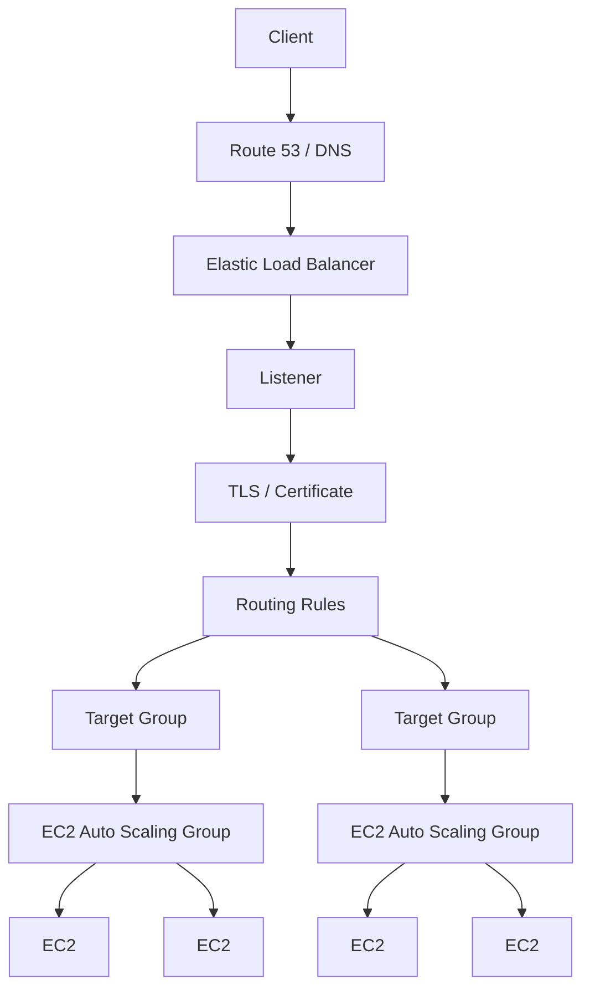
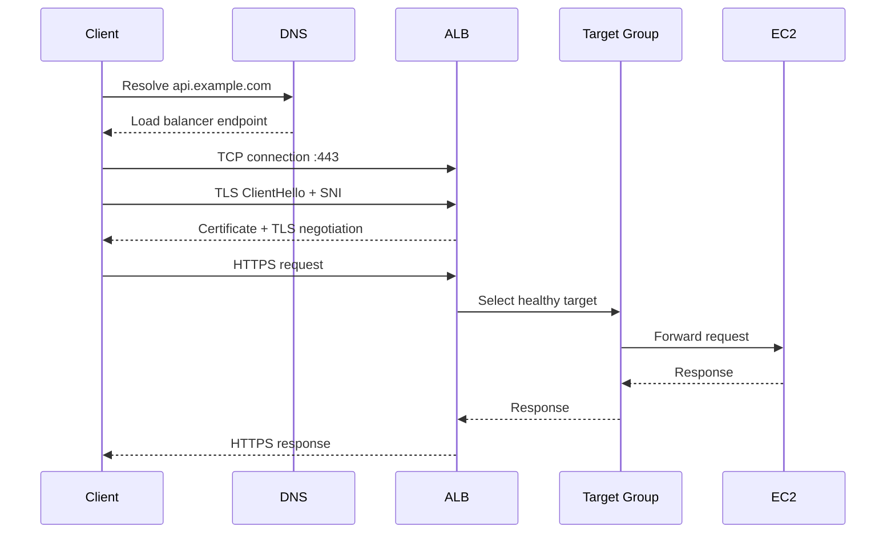
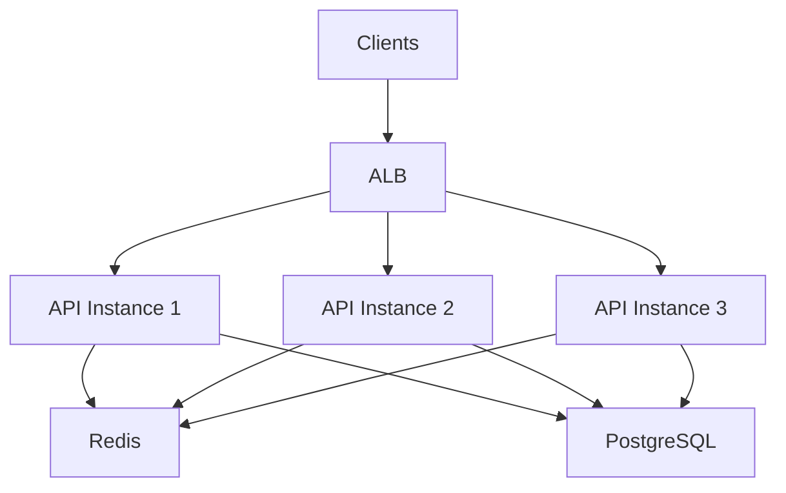
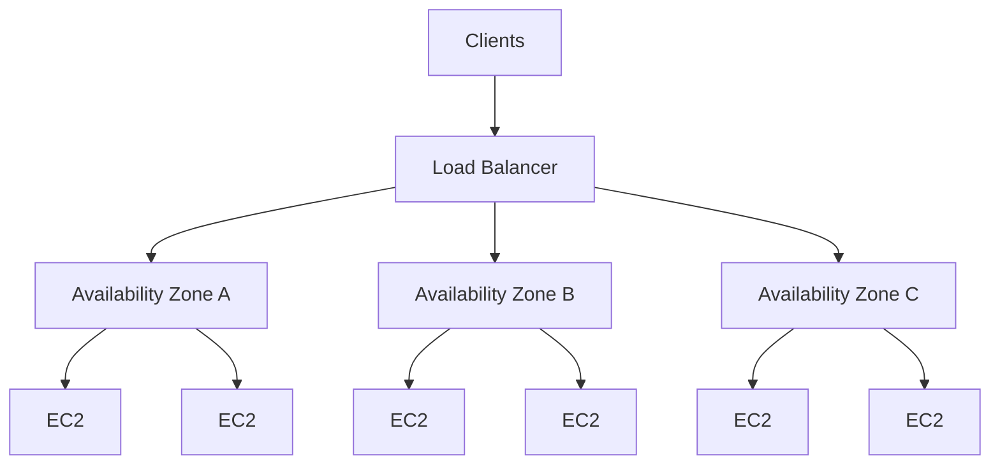

# README

## Overview

The `Load-balancing` section covers the core concepts required to design, deploy, operate, and troubleshoot load balancing for EC2-backed applications.

The focus is primarily on **Elastic Load Balancing (ELB)** and the mechanisms surrounding production HTTP/TLS traffic:

```text
Client
   |
   v
DNS
   |
   v
Load Balancer
   |
   +-------------------+
   |                   |
   v                   v
Target Group A     Target Group B
   |                   |
   v                   v
EC2 / ASG           EC2 / ASG
```

Load balancing provides more than request distribution. A production design must consider:

- TLS termination
- Certificate selection
- Host and path routing
- Target health
- Connection behavior
- Session affinity
- Availability Zones
- Auto Scaling
- Failure handling
- Security boundaries
- Observability
- Deployment behavior

The documents in this folder build these concepts progressively.

---

## Navigation

| # | File | Description |
|---|---|---|
| 01 | [01- Elastic Load Balancer](./01-%20Elastic%20Load%20Balancer.md) | ELB architecture, listeners, target groups, health checks, routing, and EC2 integration |
| 02 | [02- Load Balancer Types](./02-%20Load%20Balancer%20Types.md) | ALB, NLB, and CLB comparison, selection criteria, and use cases |
| 03 | [03- SSL Certificates](./03-%20SSL%20Certificates.md) | TLS termination, ACM certificates, HTTPS configuration, and certificate lifecycle |
| 04 | [04- SNI](./04-%20SNI.md) | Server Name Indication, multi-domain HTTPS, certificate selection, and ALB/NLB integration |
| 05 | [05- Sticky Sessions](./05-%20Sticky%20Sessions.md) | Client-to-target affinity, ALB cookie stickiness, stateful applications, and scaling implications |

## Folder Structure

```text
06- Load-balancing/
    01- Elastic Load Balancer.md
    02- Load Balancer Types.md
    03- SSL Certificates.md
    04- SNI.md
    05- Sticky Sessions.md
    README.md
```

---

## Topics

| File | Topic | Primary Focus |
|---|---|---|
| `01- Elastic Load Balancer.md` | Elastic Load Balancer | ELB architecture, listeners, target groups, health checks, routing, TLS, and production usage |
| `02- Load Balancer Types.md` | Load Balancer Types | ALB, NLB, GWLB, and legacy CLB comparison |
| `03- SSL Certificates.md` | SSL Certificates | TLS certificates, ACM, certificate lifecycle, TLS termination, and certificate management |
| `04- SNI.md` | Server Name Indication | Multi-domain TLS, certificate selection, SNI, and secure listener behavior |
| `05- Sticky Sessions.md` | Sticky Sessions | Session affinity, cookie-based stickiness, stateful applications, and scaling implications |
| `README.md` | Load Balancing Overview | Navigation and topic relationships |

---

## Load Balancing Architecture

A typical EC2-backed web application uses several layers:



Each layer has a distinct responsibility:

| Layer | Responsibility |
|---|---|
| DNS | Resolves application hostname to the load-balancing endpoint |
| Load Balancer | Accepts client connections and distributes traffic |
| Listener | Defines protocol, port, TLS behavior, and routing configuration |
| Certificate | Establishes server identity for TLS |
| SNI | Allows certificate selection for multiple hostnames |
| Listener Rules | Determine where HTTP requests should be routed |
| Target Group | Defines and monitors backend targets |
| Health Checks | Determine whether targets can receive traffic |
| Auto Scaling Group | Maintains backend capacity |
| EC2 | Runs the application workload |

---

## Elastic Load Balancing

AWS Elastic Load Balancing provides managed load-balancing capabilities for distributing traffic across backend targets.

The primary load balancer types are:

- Application Load Balancer (ALB)
- Network Load Balancer (NLB)
- Gateway Load Balancer (GWLB)
- Classic Load Balancer (CLB)

For modern backend applications, ALB and NLB are the most relevant choices.

---

## Load Balancer Selection

The load balancer should be selected based on the traffic and protocol requirements rather than simply choosing the most familiar option.

| Requirement | Typical Choice |
|---|---|
| HTTP/HTTPS APIs | ALB |
| Host-based routing | ALB |
| Path-based routing | ALB |
| REST applications | ALB |
| Web applications | ALB |
| HTTP-aware microservice routing | ALB |
| TLS/TCP workloads | NLB |
| Static IP requirements | NLB |
| Very high-performance L4 workloads | NLB |
| Gateway appliance insertion | GWLB |
| Legacy ELB architecture | CLB |

The detailed trade-offs are covered in `02- Load Balancer Types.md`.

---

## Request Lifecycle

For an HTTPS API, a simplified request lifecycle is:



Understanding this flow makes troubleshooting significantly easier because failures can be isolated by layer.

---

## Listeners

A listener defines how a load balancer accepts traffic.

Typical examples include:

```text
HTTP  :80
HTTPS :443
TCP   :443
TLS   :443
```

An HTTPS listener commonly performs:

```text
Client
  |
  v
ALB :443
  |
  +-- TLS negotiation
  +-- Certificate selection
  +-- SNI processing
  +-- HTTP request
  |
  v
Listener Rules
  |
  v
Target Group
```

A listener can therefore be viewed as the entry point for a particular protocol and port.

---

## Target Groups

A target group represents a set of backend targets that can receive traffic.

For EC2 workloads:

```text
ALB
 |
 +-- Target Group
       |
       +-- EC2-1
       +-- EC2-2
       +-- EC2-3
```

Target groups also define important operational behavior such as:

- Target type
- Port
- Protocol
- Health checks
- Deregistration behavior
- Traffic routing configuration

Target groups are especially important when integrating load balancing with Auto Scaling.

---

## Health Checks

Load balancers should send traffic only to healthy targets.

For an HTTP application:

```text
GET /health
```

might return:

```http
HTTP/1.1 200 OK
```

A production health endpoint should validate the application's ability to serve traffic without unnecessarily depending on every external subsystem.

For example:

```text
/health
    |
    +-- Process running?
    +-- Application initialized?
    +-- Critical dependency available?
```

Separate liveness and readiness semantics when the architecture requires them.

---

## Health Check Design

Avoid using a heavyweight endpoint such as:

```text
GET /api/full-business-operation
```

for load-balancer health checks.

Health checks should be:

- Fast
- Deterministic
- Cheap
- Authentication-independent where appropriate
- Safe to execute frequently
- Representative of whether the instance should receive traffic

Poor health checks can cause healthy instances to be removed from service or unhealthy instances to continue receiving traffic.

---

## TLS and SSL Certificates

HTTPS load balancing usually involves TLS termination at the load balancer:

```text
Client
 |
 | HTTPS
 v
ALB
 |
 +-- TLS termination
 |
 | HTTP or HTTPS
 v
EC2
```

Certificates can be managed using AWS Certificate Manager (ACM).

The certificate covers the hostname presented to the client.

For example:

```text
api.example.com
        |
        v
ACM Certificate
        |
        v
ALB HTTPS Listener
```

Detailed certificate behavior is covered in `03- SSL Certificates.md`.

---

## TLS Termination Models

There are several possible designs.

### TLS Termination at ALB

```text
Client
  |
  | HTTPS
  v
ALB
  |
  | HTTP
  v
EC2
```

Advantages include:

- Centralized certificate management
- Reduced TLS overhead on application instances
- Simplified certificate rotation
- Easier multi-domain TLS management

### End-to-End TLS

```text
Client
  |
  | HTTPS
  v
ALB
  |
  | HTTPS
  v
EC2
```

This may be appropriate when encryption must continue across the internal network or when organizational security requirements require it.

---

## SNI

Server Name Indication allows the client to provide the requested hostname during the TLS handshake.

For example:

```text
ClientHello
    |
    +-- SNI = api.example.com
```

The load balancer can use this information to select the appropriate certificate.

A single listener can therefore support multiple secure hostnames:

```text
ALB :443
 |
 +-- api.example.com
 +-- admin.example.com
 +-- partner.example.com
```

SNI is covered in detail in `04- SNI.md`.

---

## SNI vs Host-Based Routing

These concepts operate at different stages.

```text
TLS layer
    |
    +-- SNI
    |     |
    |     +-- Certificate selection
    |
    v
Encrypted HTTP
    |
    +-- Host header
          |
          +-- Application routing
```

For example:

```text
SNI = api.example.com
       |
       v
Select certificate
       |
       v
Host: api.example.com
       |
       v
Route to API target group
```

SNI does not replace listener routing rules.

---

## Host-Based Routing

ALB can route HTTP requests based on the hostname.

Example:

```text
api.example.com
    |
    +--> API Target Group

admin.example.com
    |
    +--> Admin Target Group
```

This allows multiple services or applications to share the same ALB while maintaining separate target groups.

---

## Path-Based Routing

ALB can also route based on URL paths.

Example:

```text
example.com/api/*
    |
    +--> API Target Group

example.com/admin/*
    |
    +--> Admin Target Group
```

This is useful for modular applications and microservice architectures.

However, routing complexity should be controlled. Excessive listener rules can become difficult to test and operate.

---

## Sticky Sessions

Sticky sessions provide session affinity between clients and backend targets.

Conceptually:

```text
Client
  |
  v
ALB
  |
  +----> EC2-2
           |
           +-- Session state
```

Subsequent requests can continue to reach the same target.

Sticky sessions are useful for legacy or stateful applications, but modern services should generally prefer stateless application instances with shared state.

A common architecture is:

```text
ALB
 |
 +----> Django/FastAPI-1
 +----> Django/FastAPI-2
 +----> Django/FastAPI-3
          |
          +----> Redis
          +----> PostgreSQL
```

Detailed behavior and trade-offs are covered in `05- Sticky Sessions.md`.

---

## Stateless Backend Architecture

For scalable APIs, prefer:



Each application instance should ideally be disposable.

This improves:

- Horizontal scaling
- Auto Scaling
- Rolling deployments
- Failure recovery
- Instance replacement
- Blue/green deployments

---

## Load Balancing with Auto Scaling

ALB and Auto Scaling Groups are commonly combined:

```text
                    +--> EC2-1
                    |
Client -> ALB -> Target Group
                    |
                    +--> EC2-2
                    |
                    +--> EC2-3
                           ^
                           |
                          ASG
```

When the Auto Scaling Group launches a new instance, the instance can be registered with the target group.

When an instance is terminated, it should be removed cleanly from traffic before termination.

This interaction is important for production deployments and scaling events.

---

## Connection Draining and Deregistration

Removing an instance from a target group does not necessarily mean all existing connections should be terminated immediately.

A controlled deregistration process allows existing requests or connections to complete where supported.

Conceptually:

```text
Target
  |
  +-- Healthy
  |
  +-- Deregistering
  |
  +-- Existing connections drain
  |
  +-- Removed
```

This reduces deployment-related request failures.

The exact behavior depends on protocol and load-balancer configuration.

---

## WebSockets

ALB can support WebSocket applications.

A typical architecture is:

```text
Client
 |
 | WebSocket
 v
ALB
 |
 v
WebSocket Target
 |
 v
Application
```

The WebSocket connection remains associated with a backend connection.

Applications with multiple WebSocket instances may still require shared event/state infrastructure such as:

- Redis
- Kafka
- Pub/Sub
- Dedicated messaging infrastructure

Load balancing a connection does not automatically synchronize application state between instances.

---

## gRPC

ALB can support gRPC workloads over HTTP/2.

A simplified architecture is:

```text
gRPC Client
    |
    v
ALB
    |
    v
gRPC Target Group
    |
    +--> Service Instance 1
    +--> Service Instance 2
```

When using gRPC, pay particular attention to:

- HTTP/2 behavior
- Long-lived connections
- Health checks
- Target availability
- Connection lifetime
- Retry semantics
- Client-side behavior

Long-lived connections can affect how evenly traffic is distributed.

---

## Security Groups

A common EC2-backed architecture is:

```text
Internet
   |
   v
ALB Security Group
   |
   v
EC2 Security Group
```

The ALB security group should allow only the required frontend traffic.

The EC2 security group should generally allow application traffic from the ALB security group rather than directly from the entire internet.

For example:

```text
ALB SG
  Inbound:
    TCP 443 from Internet

EC2 SG
  Inbound:
    TCP 8000 from ALB SG
```

This creates a clear network security boundary.

---

## Multi-AZ Architecture

Production load balancers should normally operate across multiple Availability Zones.



Multi-AZ deployment reduces dependence on a single Availability Zone and improves fault tolerance.

The backend fleet should also be distributed across multiple Availability Zones.

---

## Observability

Load-balancing problems are often distributed across multiple layers.

Monitor:

### Load Balancer

- Request count
- Request latency
- HTTP 4xx
- HTTP 5xx
- Target response time
- Active connections
- New connections
- TLS-related metrics where applicable

### Target Group

- Healthy target count
- Unhealthy target count
- Target response time
- Registration/deregistration events

### EC2

- CPU
- Memory where available through the selected monitoring mechanism
- Network throughput
- Disk utilization
- Application latency
- Application errors

### Application

- Request rate
- Error rate
- Dependency latency
- Database latency
- Redis latency
- Queue depth
- Worker saturation

The goal is to correlate:

```text
Client error
   |
   v
Load balancer
   |
   v
Target
   |
   v
Application
   |
   v
Dependency
```

rather than looking at a single metric in isolation.

---

## Common Failure Patterns

### All Targets Unhealthy

Potential causes:

- Incorrect health-check path
- Wrong port
- Security group restrictions
- Application not listening
- Application startup failure
- Incorrect protocol
- Health endpoint returning errors

### ALB Returns 502

Potential causes can include:

- Target connection failure
- Application not accepting connections
- Invalid backend response
- Protocol mismatch
- Target becoming unavailable

Investigate the target health and application logs rather than treating `502` as an ALB-only problem.

### ALB Returns 503

A common cause is that the load balancer has no healthy targets available for the request.

Check:

```text
Target group
    |
    +-- Healthy targets
    +-- Unhealthy targets
    +-- Registered targets
```

### HTTPS Certificate Error

Check:

- Certificate status
- Domain coverage
- SNI
- Listener configuration
- DNS
- Certificate chain where applicable
- Client TLS compatibility

---

## Production Design Checklist

Before deploying an EC2-backed application behind a load balancer, verify:

### Networking

- [ ] Load balancer spans the required Availability Zones
- [ ] Security groups are least-privilege
- [ ] Backend instances are not unnecessarily internet-exposed
- [ ] Required ports are explicitly defined

### TLS

- [ ] HTTPS is configured where required
- [ ] ACM certificates are correctly associated
- [ ] Certificate coverage matches DNS names
- [ ] SNI behavior is understood for multi-domain deployments
- [ ] TLS policies meet security requirements

### Routing

- [ ] Listener rules are documented
- [ ] Host/path routing is tested
- [ ] Default actions are intentional
- [ ] Target groups map cleanly to applications

### Health

- [ ] Health endpoint is lightweight and meaningful
- [ ] Health-check path is correct
- [ ] Health-check port is correct
- [ ] Healthy/unhealthy thresholds are appropriate
- [ ] Failure behavior has been tested

### Scaling

- [ ] Targets are managed through Auto Scaling where appropriate
- [ ] Instances are disposable
- [ ] Application state is externalized
- [ ] Deployment and deregistration behavior is tested
- [ ] Per-target utilization is monitored

### Operations

- [ ] Load-balancer logs are available where required
- [ ] CloudWatch metrics are monitored
- [ ] Alarms exist for critical failures
- [ ] Target health is observable
- [ ] Certificate lifecycle is automated
- [ ] Operational procedures exist for unhealthy targets

---

## Common Architectural Mistakes

### Treating the Load Balancer as the Entire HA Strategy

A highly available load balancer does not make a single backend instance highly available.

Use:

```text
Load Balancer
     |
     +-- Multiple targets
     |
     +-- Multiple AZs
     |
     +-- Auto Scaling
```

### Storing Critical State in EC2 Memory

If application correctness depends on local process memory, instance replacement can cause data loss.

Prefer shared or durable state where practical.

### Using Sticky Sessions to Hide Architectural Problems

Sticky sessions can make a stateful application appear to work while masking the need for shared state.

Use them deliberately rather than as a default solution.

### Ignoring Per-Target Metrics

A healthy aggregate metric can hide one overloaded instance:

```text
Average CPU = 40%

EC2-1 = 95%
EC2-2 = 20%
EC2-3 = 5%
```

Always inspect target-level behavior when troubleshooting.

### Overloading Listener Rules

Complex routing rules can become difficult to reason about.

Keep routing simple and use clear ownership boundaries between services.

---

## Cost Considerations

Load balancer cost should be evaluated together with the architecture around it.

Potential cost drivers include:

- Number of load balancers
- Traffic volume
- Load balancer capacity consumption
- Cross-AZ traffic patterns
- Number of backend instances
- NAT and networking architecture
- Logging and observability
- External state systems such as Redis

Consolidating multiple compatible applications behind one ALB can reduce infrastructure duplication, but isolation and operational requirements should take priority over simple resource count.

---

## Disaster Recovery

A load balancer does not provide application disaster recovery by itself.

A resilient EC2 application should consider:

```text
DNS
 |
 v
Load Balancer
 |
 +-- AZ-A
 |    |
 |    +-- EC2
 |
 +-- AZ-B
 |    |
 |    +-- EC2
 |
 +-- AZ-C
      |
      +-- EC2

Shared State
 |
 +-- Multi-AZ Database
 +-- Redis
 +-- S3
 +-- Backup Systems
```

For broader disaster recovery requirements, consider:

- Multi-AZ architecture
- AMI and EBS backup strategies
- Database backups
- Infrastructure as Code
- Automated deployment
- Cross-Region recovery where justified
- Tested restoration procedures

---

## Interview Topics

This folder covers several common backend and system-design interview areas.

Be prepared to explain:

- What an ALB is
- ALB vs NLB
- Listener vs target group
- How health checks work
- How ALB integrates with Auto Scaling
- TLS termination
- ACM certificates
- SNI
- Host-based routing
- Path-based routing
- Sticky sessions
- Stateless vs stateful applications
- Multi-AZ load balancing
- Connection draining
- WebSocket load balancing
- gRPC load balancing
- Security-group design
- Diagnosing `502` and `503`
- Handling unhealthy targets
- Designing a highly available EC2-backed API

A useful mental model is:

```text
DNS
  |
  v
Load Balancer
  |
  +-- Listener
  |     |
  |     +-- TLS / SNI
  |     +-- Routing
  |
  +-- Target Group
        |
        +-- Health Checks
        |
        +-- EC2 / ASG
              |
              +-- Application
                    |
                    +-- Redis
                    +-- PostgreSQL
                    +-- Kafka
```

---

## Navigation

| Topic | Link |
|---|---|
| Elastic Load Balancer | [01- Elastic Load Balancer](./01-%20Elastic%20Load%20Balancer.md) |
| Load Balancer Types | [02- Load Balancer Types](./02-%20Load%20Balancer%20Types.md) |
| SSL Certificates | [03- SSL Certificates](./03-%20SSL%20Certificates.md) |
| SNI | [04- SNI](./04-%20SNI.md) |
| Sticky Sessions | [05- Sticky Sessions](./05-%20Sticky%20Sessions.md) |

## Key Takeaways

- **Load balancing is a complete traffic-management layer involving listeners, TLS, routing, target groups, health checks, and backend capacity—not simply request distribution.**
- **ALB is typically suited to HTTP/HTTPS applications and application-aware routing, while NLB is designed for lower-level transport workloads and specialized networking requirements.**
- **Production EC2 applications should normally use multi-AZ, disposable backend instances with shared or durable application state.**
- **TLS, SNI, health checks, sticky sessions, and connection behavior directly affect security, availability, scaling, and deployment reliability.**
- **Effective load-balancer operations require correlation across DNS, the load balancer, target groups, EC2 instances, application logs, and downstream dependencies.**