# 01- Route 53 Architecture

## Overview

Amazon Route 53 is a managed DNS service that provides public DNS, private DNS, domain registration, DNS-based traffic routing, health checks, and DNS resolution for AWS and hybrid environments.

From an architecture perspective, Route 53 sits at the **name-resolution and DNS traffic-steering layer**. It determines where a hostname resolves, while services such as CloudFront, ALB, API Gateway, and application components determine what happens after the client reaches the selected endpoint.

A production architecture should therefore treat Route 53 as one component in a larger request path:

```text
Client
  │
  ▼
DNS Resolver
  │
  ▼
Route 53
  │
  ├── CloudFront
  ├── ALB / NLB
  ├── API Gateway
  ├── S3
  └── Other supported AWS targets
          │
          ▼
    Backend Services
```

The architectural importance of Route 53 increases significantly when systems require:

- Custom domains
- Public and private service discovery
- Multi-Region traffic distribution
- DNS-level failover
- Disaster recovery
- Latency-aware routing
- Geographic routing
- AWS service integration
- Hybrid DNS between on-premises networks and AWS

---

## Route 53 Architectural Position

Route 53 operates primarily at the **DNS layer**, before an HTTP, gRPC, or application request is established.

A typical request looks like:

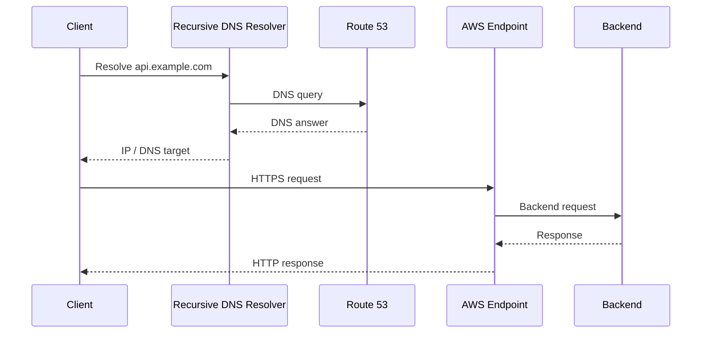

The important distinction is that Route 53 normally participates in **name resolution**, not in every application request.

Once the DNS answer has been cached, subsequent requests may not contact Route 53 at all until the DNS cache expires.

---

## Core Route 53 Components

A production Route 53 architecture is composed of several independent capabilities.

| Component | Architectural responsibility |
|---|---|
| Public Hosted Zone | Authoritative DNS for internet-facing domains |
| Private Hosted Zone | DNS resolution inside associated VPCs |
| DNS Records | Map names to resources or values |
| Routing Policies | Determine which DNS answer should be returned |
| Health Checks | Determine endpoint health for supported routing scenarios |
| Resolver | DNS resolution for AWS and hybrid networks |
| Resolver Endpoints | Connect DNS infrastructure between AWS and external networks |
| Domain Registration | Register and manage domain names |
| Traffic Flow | Build complex DNS routing policies |

These capabilities should not be treated as one monolithic feature.

For example:

```text
Public Hosted Zone
        │
        ├── DNS Records
        │
        ├── Routing Policies
        │
        └── Health Checks
```

while:

```text
VPC
 │
 ▼
Route 53 Resolver
 │
 ├── Private Hosted Zone
 ├── Forwarding Rules
 └── Resolver Endpoints
```

---

## Public DNS Architecture

A public hosted zone provides authoritative DNS information for internet-facing domains.

Example:

```text
example.com
├── www.example.com
├── api.example.com
├── admin.example.com
└── static.example.com
```

A typical production architecture is:

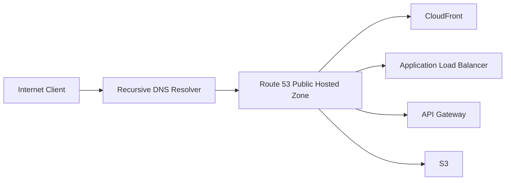

Example DNS design:

| Hostname | Target | Purpose |
|---|---|---|
| `www.example.com` | CloudFront | Web frontend |
| `api.example.com` | ALB | Backend APIs |
| `assets.example.com` | CloudFront/S3 | Static assets |
| `serverless.example.com` | API Gateway | Serverless API |

---

## Private DNS Architecture

Private hosted zones provide DNS resolution within associated VPCs.

Example:

```text
orders.internal.example.com
payments.internal.example.com
users.internal.example.com
```

Architecture:

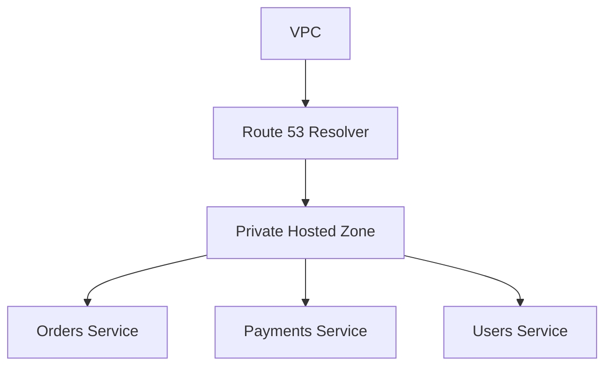

This is useful when services should communicate through stable DNS names rather than hard-coded private IP addresses.

For example:

```text
orders.internal.example.com
```

is preferable to embedding:

```text
10.20.15.42
```

in application configuration.

The IP address may change because of:

- Auto Scaling
- ECS task replacement
- Kubernetes scheduling
- infrastructure changes
- failover
- deployment operations

DNS provides an abstraction between the service name and the current endpoint.

---

## Hosted Zone Architecture

A hosted zone represents a collection of DNS records for a domain.

A public architecture might look like:

```text
example.com
     │
     ▼
Public Hosted Zone
     │
     ├── A / AAAA
     ├── CNAME
     ├── MX
     ├── TXT
     ├── NS
     └── SOA
```

A private architecture might look like:

```text
internal.example.com
          │
          ▼
Private Hosted Zone
          │
          ├── orders.internal.example.com
          ├── payments.internal.example.com
          └── users.internal.example.com
```

Public and private hosted zones solve different problems.

| Characteristic | Public Hosted Zone | Private Hosted Zone |
|---|---|---|
| Resolution | Internet DNS | VPC/internal DNS |
| Typical use | Public applications | Internal services |
| Internet accessible | Yes | No |
| VPC association | Not required | Required |
| Example | `api.example.com` | `orders.internal.example.com` |

---

## DNS Delegation Architecture

When a domain is registered, the parent DNS hierarchy delegates authority for the domain to authoritative name servers.

Conceptually:

```text
Root DNS
   │
   ▼
.com TLD
   │
   ▼
example.com
   │
   ▼
Route 53 Name Servers
   │
   ▼
Hosted Zone Records
```

The domain's authoritative name-server delegation is what allows Route 53 to answer DNS queries authoritatively.

For a production domain:

```text
example.com
      │
      ▼
Route 53 authoritative name servers
      │
      ▼
DNS records
      │
      ├── api
      ├── www
      └── static
```

A common operational mistake is to create a Route 53 hosted zone without correctly configuring domain delegation.

The hosted zone can be perfectly configured while public DNS still points elsewhere.

---

## DNS Record Architecture

Records map DNS names to destinations or values.

Common records include:

| Record | Typical purpose |
|---|---|
| A | IPv4 address |
| AAAA | IPv6 address |
| CNAME | Canonical DNS name |
| MX | Mail routing |
| TXT | Verification and metadata |
| NS | Name-server delegation |
| SOA | Zone authority information |
| SRV | Service location |
| CAA | Certificate-authority restrictions |

For AWS architectures, **Alias records** are particularly important because they allow supported AWS resources to be used as DNS targets.

Example:

```text
api.example.com
      │
      ▼
Route 53 Alias
      │
      ▼
Application Load Balancer
      │
      ▼
Backend
```

---

## Alias-Based Architecture

Alias records are commonly used for AWS resources such as:

- Application Load Balancers
- Network Load Balancers
- CloudFront distributions
- API Gateway endpoints
- S3 website endpoints
- Other supported AWS resources

Example:

```text
example.com
     │
     ▼
Route 53 Alias
     │
     ▼
CloudFront Distribution
     │
     ├── S3
     └── ALB
```

One major advantage is that aliases can be used at the zone apex where a traditional CNAME cannot be used.

For example:

```text
example.com
```

can be configured to route to a supported AWS resource through an Alias record.

---

## Route 53 Routing Layer

Route 53 can make DNS-level traffic-steering decisions.

Common routing policies include:

| Routing Policy | Primary architectural use |
|---|---|
| Simple | Basic DNS resolution |
| Weighted | Traffic distribution |
| Latency-based | Route toward lower-latency Region |
| Failover | Primary/secondary architecture |
| Geolocation | Route based on user location |
| Geoproximity | Route based on geographic proximity and bias |
| Multivalue answer | Return multiple healthy answers |
| IP-based | Route based on client IP ranges |

Example:

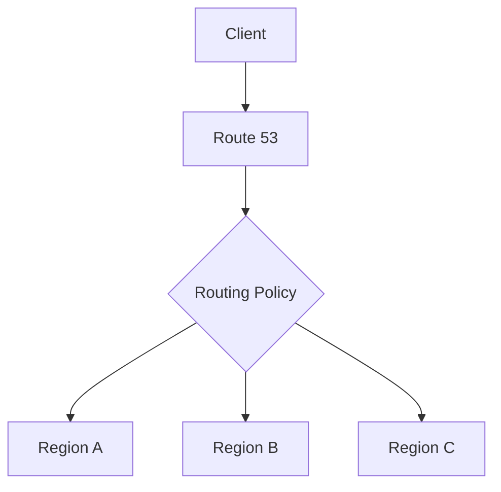

The policy determines which DNS response Route 53 returns.

---

## Route 53 vs Application Routing

A senior engineer must understand the boundary between DNS routing and application routing.

Consider:

```text
api.example.com/users
api.example.com/orders
```

Route 53 can route:

```text
api.example.com
```

but it does not inspect:

```text
/users
/orders
```

Path-based routing belongs at a higher layer:

```text
Client
  │
  ▼
Route 53
  │
  ▼
ALB / API Gateway
  │
  ├── /users  → Users Service
  └── /orders → Orders Service
```

This distinction prevents incorrect architecture decisions.

---

## Multi-Region Architecture

Route 53 becomes especially valuable in multi-Region systems.

Example:

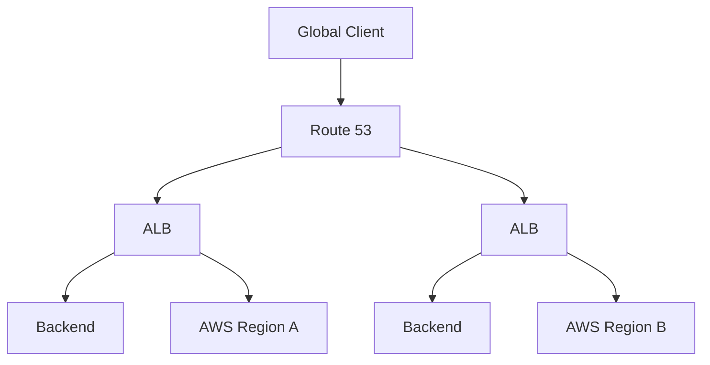

Possible strategies include:

- Latency-based routing
- Failover routing
- Weighted routing
- Geolocation routing
- Geoproximity routing

The routing policy should match the business requirement.

For example:

```text
Requirement:
Send users to the lowest-latency Region.

Candidate:
Latency-based routing
```

Whereas:

```text
Requirement:
Use Region A normally and Region B only when Region A fails.

Candidate:
Failover routing
```

---

## Multi-Region Data Architecture

DNS routing alone does not create a functional multi-Region application.

Consider:

```text
             Route 53
             /       \
            ▼         ▼
        Region A   Region B
            │         │
           ALB       ALB
            │         │
          App A     App B
            │         │
            └────┬────┘
                 ▼
             Data Layer
```

The data architecture must address:

- Replication
- Consistency
- Failover
- RPO
- RTO
- Write ownership
- Conflict handling
- Database recovery

For example, if Region B has a healthy application but stale database state, Route 53 cannot solve the underlying data problem.

---

## Failover Architecture

A common production pattern is:

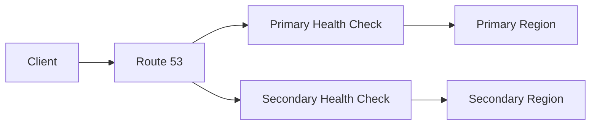

Normal operation:

```text
Route 53
   │
   ▼
Primary
```

After primary failure:

```text
Route 53
   │
   ▼
Secondary
```

The secondary environment must be capable of accepting real production traffic.

A common mistake is creating a failover DNS record pointing to an environment that has never been capacity-tested.

---

## Health-Aware Routing

Health checks can be used with supported routing configurations to influence which DNS answers are returned.

Example:

```text
Route 53
    │
    ├── Health Check → Region A
    │
    └── Health Check → Region B
```

Conceptually:

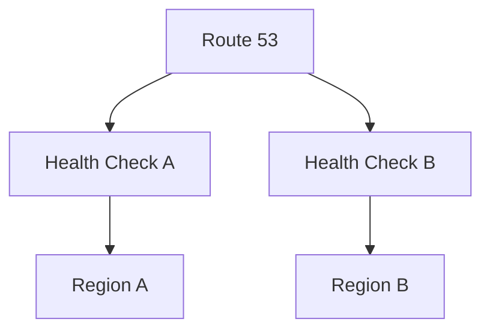

Health checks should represent meaningful availability.

A shallow check such as:

```text
GET /health → 200
```

may not detect:

- Database failure
- Dependency failure
- Broken authentication
- Corrupted application state
- Critical downstream service failure

At the same time, making a health check depend on every downstream dependency can make failover too sensitive.

Health-check design is therefore an architectural decision.

---

## CloudFront Architecture

Route 53 and CloudFront are commonly combined for global applications.

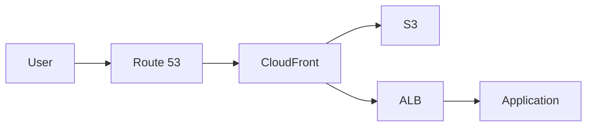

Responsibilities are separated:

| Layer | Responsibility |
|---|---|
| Route 53 | DNS resolution |
| CloudFront | Edge delivery and caching |
| WAF | HTTP request filtering |
| ALB | HTTP load balancing |
| Application | Business logic |
| S3 | Object storage |

This separation makes the architecture easier to reason about and operate.

---

## ALB Architecture

A common backend architecture for Django or FastAPI is:

```text
api.example.com
        │
        ▼
     Route 53
        │
        ▼
       ALB
        │
   ┌────┴────┐
   ▼         ▼
Django    FastAPI
   │         │
   └────┬────┘
        ▼
 PostgreSQL
        +
      Redis
```

Route 53 provides the stable DNS name.

ALB provides:

- Health-based target selection
- HTTP/HTTPS termination
- Load balancing
- Host-based routing
- Path-based routing
- Target-group management

This is a typical separation of concerns.

---

## API Gateway and Lambda Architecture

For serverless backends:

```text
api.example.com
       │
       ▼
   Route 53
       │
       ▼
 API Gateway
       │
       ▼
    Lambda
       │
       ├── DynamoDB
       ├── S3
       └── Other AWS services
```

Route 53 provides the custom DNS name.

API Gateway handles:

- HTTP APIs
- Authentication integration
- Throttling
- API routing
- Request transformation
- Integration with Lambda and other services

Lambda provides application execution.

Each service operates at a different architectural layer.

---

## S3 Architecture

For static content:

```text
www.example.com
       │
       ▼
   Route 53
       │
       ▼
  CloudFront
       │
       ▼
      S3
```

For production websites, CloudFront is commonly placed in front of S3 when edge delivery, HTTPS, caching, and security controls are required.

Route 53 remains responsible for DNS resolution.

---

## Route 53 Resolver Architecture

Route 53 Resolver provides DNS resolution for VPC workloads and supports hybrid DNS architectures.

A simplified AWS-only flow is:

```text
EC2 / ECS / EKS
       │
       ▼
VPC DNS Resolver
       │
       ├── Private Hosted Zones
       ├── AWS internal names
       └── Resolver rules
```

A hybrid architecture can look like:


This is useful when workloads need to resolve names across:

- AWS VPCs
- On-premises networks
- Data centers
- Hybrid environments

---

## Hybrid DNS Architecture

A large enterprise environment may have:

```text
                    Corporate DNS
                         │
                         │
                 VPN / Direct Connect
                         │
                         ▼
               Route 53 Resolver
                  /            \
                 ▼              ▼
        Private Hosted Zone   AWS Services
                 │
                 ▼
          Internal Services
```

Typical requirements include:

- AWS workloads resolving corporate domains
- Corporate workloads resolving AWS private domains
- Centralized DNS forwarding
- Controlled DNS boundaries
- Multi-account VPC DNS

Resolver rules and endpoints should be designed centrally where organizational scale requires it.

---

## Cross-Account Architecture

In larger AWS environments, Route 53 configuration often spans multiple AWS accounts.

Example:

```text
AWS Organization
       │
       ├── Network Account
       │       └── Central DNS / Resolver
       │
       ├── Production Account
       │       └── Application VPC
       │
       ├── Staging Account
       │       └── Application VPC
       │
       └── Development Account
               └── Application VPC
```

A centralized networking account can provide shared DNS infrastructure while workload accounts remain isolated.

This architecture is particularly useful with:

- AWS Organizations
- Shared VPC designs
- Transit Gateway
- Centralized networking
- Multi-account environments

---

## Route 53 in a Microservices Architecture

DNS can provide stable service names, but Route 53 should not automatically become the service-discovery mechanism for every microservice.

For example:

```text
Public
  │
  ▼
Route 53
  │
  ▼
API Gateway / ALB
  │
  ▼
Backend
  │
  ├── Users Service
  ├── Orders Service
  ├── Payments Service
  └── Inventory Service
```

Internal discovery might instead use:

- Kubernetes DNS
- AWS Cloud Map
- Internal ALB
- Service mesh
- Application-level discovery

The appropriate solution depends on deployment architecture and operational requirements.

---

## Route 53 and Kubernetes

For EKS-based systems, a common public architecture is:

```text
api.example.com
       │
       ▼
   Route 53
       │
       ▼
AWS Load Balancer
       │
       ▼
Ingress
       │
       ▼
Kubernetes Services
       │
       ▼
Pods
```

Inside the cluster:

```text
orders.default.svc.cluster.local
```

is typically resolved by Kubernetes DNS rather than Route 53 public DNS.

This creates two distinct DNS domains:

```text
Public DNS
    ↓
Route 53

Cluster DNS
    ↓
CoreDNS / Kubernetes DNS
```

---

## Request Routing Boundaries

A useful production model is:

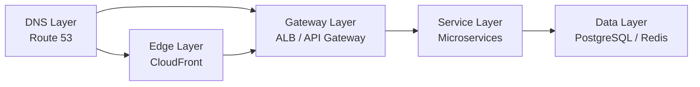

Each layer has a different responsibility.

| Layer | Main decision |
|---|---|
| Route 53 | Which DNS target should this hostname resolve to? |
| CloudFront | How should edge requests be served? |
| ALB | Which backend target should receive the request? |
| API Gateway | Which API integration should receive the request? |
| Application | Which business operation should execute? |
| Database | Where should persistent state be stored? |

---

## Production Architecture Example

A mature public backend architecture may look like:

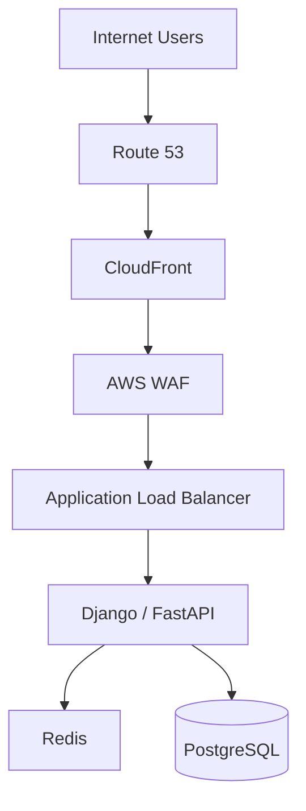

For APIs that do not require CloudFront:

```text
Client
  │
  ▼
Route 53
  │
  ▼
ALB
  │
  ▼
Django / FastAPI
  │
  ├── Redis
  └── PostgreSQL
```

For a serverless backend:

```text
Client
  │
  ▼
Route 53
  │
  ▼
API Gateway
  │
  ▼
Lambda
```

The correct architecture depends on traffic characteristics, operational requirements, latency requirements, and application behavior.

---

## Multi-Region Production Architecture

A more complete multi-Region architecture is:

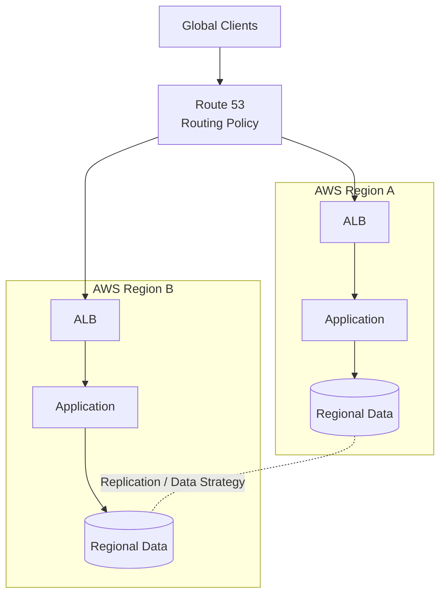

The Route 53 policy might be:

```text
Latency-based
```

or:

```text
Failover
```

or:

```text
Weighted
```

depending on the required behavior.

The database replication model must be designed independently.

---

## DNS Caching and Architecture

DNS caching has a direct effect on Route 53 behavior.

Consider:

```text
Client
  │
  ▼
Recursive Resolver
  │
  ├── Cache hit → existing answer
  │
  └── Cache miss
          │
          ▼
      Route 53
```

If a DNS response has a TTL of 300 seconds, a resolver may continue serving the cached response during that period.

Therefore:

```text
Route 53 configuration change
          ≠
Immediate global traffic change
```

This matters for:

- Failover
- Blue/green deployment
- Traffic shifting
- Disaster recovery
- DNS migrations
- Domain cutovers

TTL should be considered before making operational changes.

---

## Blue/Green Architecture

Weighted DNS routing can support some blue/green strategies.

Example:

```text
                Route 53
                   │
          Weighted Routing
             /         \
            ▼           ▼
       Blue ALB      Green ALB
            │           │
          Blue        Green
        Version       Version
```

A migration could conceptually move from:

```text
Blue: 100%
Green: 0%
```

to:

```text
Blue: 90%
Green: 10%
```

then:

```text
Blue: 50%
Green: 50%
```

and eventually:

```text
Blue: 0%
Green: 100%
```

However, DNS caching means weighted DNS is not equivalent to precise per-request traffic splitting.

For precise deployment traffic control, application-aware or load-balancer-level mechanisms may be more appropriate.

---

## Security Architecture

Route 53 itself should be treated as critical infrastructure.

A DNS modification can redirect production traffic.

Security controls should include:

- Least-privilege IAM
- MFA for privileged administrative access
- Infrastructure-as-code workflows
- Pull-request review
- CloudTrail auditing
- Restricted production access
- Change management
- DNSSEC where appropriate for supported public DNS requirements

A useful security architecture is:

```text
Engineer
   │
   ▼
Git Repository
   │
   ▼
Pull Request
   │
   ▼
CI/CD
   │
   ▼
Terraform / CloudFormation / CDK
   │
   ▼
AWS IAM
   │
   ▼
Route 53
```

This reduces the risk of uncontrolled DNS modifications.

---

## Operational Architecture

Route 53 changes should be treated similarly to other production infrastructure changes.

A production workflow might be:

```text
DNS Change
    │
    ▼
Code Review
    │
    ▼
CI Validation
    │
    ▼
Infrastructure Plan
    │
    ▼
Approval
    │
    ▼
Apply
    │
    ▼
DNS Verification
    │
    ▼
Application Verification
```

Verification should include both DNS and application behavior.

For example:

```bash
dig api.example.com
```

followed by:

```bash
curl -I https://api.example.com
```

DNS resolution succeeding does not prove that the application is healthy.

---

## Monitoring and Observability

Route 53 architecture should be observable at multiple layers.

### DNS Layer

Monitor:

- DNS query behavior
- Health-check status
- Resolver behavior
- DNS configuration changes
- Hosted-zone changes

### Application Layer

Monitor:

- HTTP status codes
- Latency
- Error rate
- Availability
- Dependency failures

### Infrastructure Layer

Monitor:

- ALB target health
- ECS/EKS health
- Lambda errors
- Database health
- Redis availability

A complete architecture should correlate:

```text
DNS
 ↓
Endpoint
 ↓
Load Balancer
 ↓
Application
 ↓
Dependencies
```

rather than treating DNS health as equivalent to application health.

---

## Infrastructure as Code

Production Route 53 configuration should generally be managed through infrastructure as code.

A Terraform example:

```hcl
resource "aws_route53_record" "api" {
  zone_id = aws_route53_zone.public.zone_id
  name    = "api.example.com"
  type    = "A"

  alias {
    name                   = aws_lb.api.dns_name
    zone_id                = aws_lb.api.zone_id
    evaluate_target_health = true
  }
}
```

This provides:

- Version control
- Code review
- Reproducibility
- Change history
- Automated deployment
- Reduced configuration drift

The exact implementation should follow the infrastructure standards used by the organization.

---

## Availability and Disaster Recovery

Route 53 can participate in disaster recovery, but DNS is only one layer.

A complete DR architecture should consider:

```text
             Disaster Recovery
                    │
      ┌─────────────┼─────────────┐
      ▼             ▼             ▼
     DNS          Compute        Data
      │             │             │
 Route 53         ALB/ECS       Database
      │             │             │
 Failover       Capacity       Replication
```

Important questions include:

- How quickly must traffic move?
- What happens to DNS caches?
- Is the secondary Region warm?
- Is compute capacity available?
- Is the database synchronized?
- Are secrets available?
- Are dependencies available?
- Can the application start without manual intervention?
- What is the expected RTO?
- What is the expected RPO?

DNS failover without data readiness is incomplete DR.

---

## Scalability Considerations

Route 53 is a managed, highly scalable DNS service, but application architecture still determines end-to-end scalability.

A typical scalable architecture is:

```text
             Route 53
                 │
                 ▼
            CloudFront
                 │
                 ▼
                ALB
                 │
        ┌────────┼────────┐
        ▼        ▼        ▼
      App      App      App
        │        │        │
        └────────┼────────┘
                 ▼
              Redis
                 │
                 ▼
            PostgreSQL
```

Route 53 provides the DNS entry point.

It does not eliminate bottlenecks in:

- Application compute
- Databases
- Caches
- Queues
- External dependencies

---

## Common Architectural Mistakes

### Using Route 53 for HTTP Routing

Incorrect:

```text
Route 53
 ├── /users
 └── /orders
```

Correct:

```text
Route 53
    │
    ▼
ALB / API Gateway
    ├── /users
    └── /orders
```

### Assuming DNS Failover Is Instant

DNS caches can continue serving an existing answer until the applicable TTL expires.

### Assuming Weighted Routing Is Exact

DNS-level percentages are not equivalent to precise HTTP request percentages.

### Using Public DNS for Internal Services

Internal services should generally use private DNS or dedicated service discovery rather than exposing internal infrastructure through public DNS.

### Creating a Failover Record Without a Real Secondary

A DNS failover configuration is useless if the secondary system cannot serve production traffic.

### Making Health Checks Too Shallow

A successful TCP connection or HTTP `200` response may not represent actual application health.

### Making Health Checks Too Deep

If a health check depends on every downstream dependency, transient dependency issues can unnecessarily remove otherwise usable capacity.

### Hard-Coding Private IP Addresses

Private infrastructure is dynamic. Stable service names are generally preferable to embedding infrastructure addresses in application configuration.

### Treating Route 53 as the Entire DR Strategy

DNS handles traffic steering, not database replication, compute provisioning, secrets, or application recovery.

---

## Architecture Decision Guidelines

| Requirement | Recommended approach |
|---|---|
| Public domain | Route 53 Public Hosted Zone |
| Internal VPC domain | Private Hosted Zone |
| Public web application | Route 53 + CloudFront |
| HTTP backend | Route 53 + ALB |
| Serverless API | Route 53 + API Gateway |
| DNS-level primary/secondary | Failover routing |
| Multi-Region latency optimization | Latency-based routing |
| Controlled DNS traffic split | Weighted routing |
| Geographic DNS steering | Geolocation / Geoproximity |
| Multiple healthy endpoints | Multivalue answer |
| Hybrid DNS | Route 53 Resolver |
| Kubernetes internal discovery | Kubernetes DNS |
| Precise request routing | ALB / API Gateway / application layer |
| Edge caching | CloudFront |

---

## Senior-Level Design Principles

### DNS Is an Abstraction Layer

Applications should generally depend on names rather than infrastructure addresses.

```text
Application
    │
    ▼
api.example.com
    │
    ▼
Current infrastructure
```

This allows infrastructure to change without requiring application code changes.

### Keep Routing Responsibilities Separate

A clean architecture looks like:

```text
Route 53
    ↓
DNS routing

CloudFront
    ↓
Edge delivery

ALB
    ↓
HTTP load balancing

Application
    ↓
Business routing

Database
    ↓
State management
```

### Design for Failure

Every DNS routing decision should have an answer to:

```text
What happens when the selected target fails?
```

### Treat DNS as Production Infrastructure

DNS configuration should have:

- Version control
- Review
- Automated deployment
- Auditability
- Monitoring
- Rollback procedures
- Tested failure scenarios

---

## Key Takeaways

- Route 53 is the **DNS and DNS traffic-steering layer** of an AWS architecture.
- Public hosted zones provide authoritative DNS for internet-facing domains.
- Private hosted zones provide DNS resolution for internal VPC workloads.
- Route 53 Resolver provides DNS resolution capabilities for AWS and hybrid environments.
- DNS records provide the mapping between application names and infrastructure targets.
- Alias records are particularly important for AWS-native architectures.
- Route 53 routing policies operate at the DNS layer and should not be confused with HTTP request routing.
- CloudFront, ALB, API Gateway, and application services operate at different layers and should be used for their respective responsibilities.
- Route 53 can support multi-Region architectures through latency, weighted, failover, geolocation, geoproximity, and other routing policies.
- DNS caching means Route 53 changes are not equivalent to immediate global traffic changes.
- Health checks can influence DNS routing but should be designed carefully around meaningful application health.
- Route 53 can contribute to disaster recovery but cannot replace compute recovery, database replication, secrets management, or application readiness.
- Private DNS is preferable to exposing internal service endpoints through public DNS.
- Kubernetes workloads normally use Kubernetes DNS for cluster-internal service discovery.
- Hybrid environments can use Route 53 Resolver with VPN or Direct Connect.
- Production Route 53 configuration should generally be managed through infrastructure as code.
- DNS changes should be audited and protected with least-privilege IAM.
- A senior engineer should always distinguish between:
  - DNS routing
  - Edge routing
  - HTTP routing
  - Service discovery
  - Application routing
  - Data routing
- The most important architectural principle is:

```text
DNS problem
    → Route 53

Edge delivery problem
    → CloudFront

HTTP routing problem
    → ALB / API Gateway

Internal service discovery problem
    → Private DNS / Kubernetes DNS / Cloud Map

Application routing problem
    → Application layer

Data replication problem
    → Database architecture
```