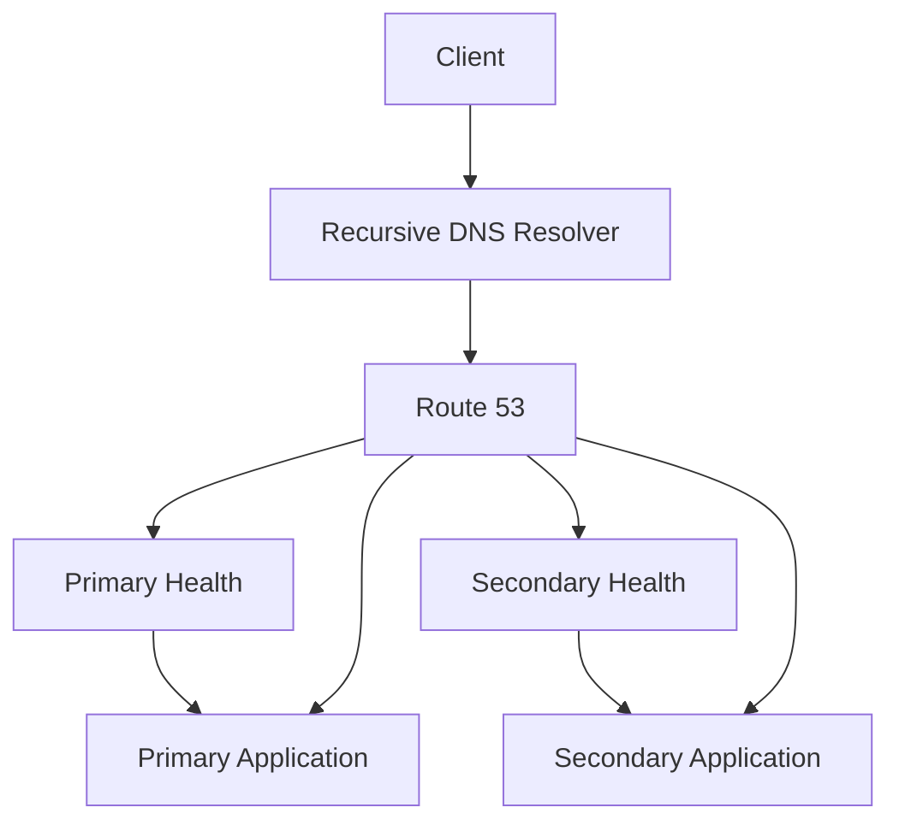
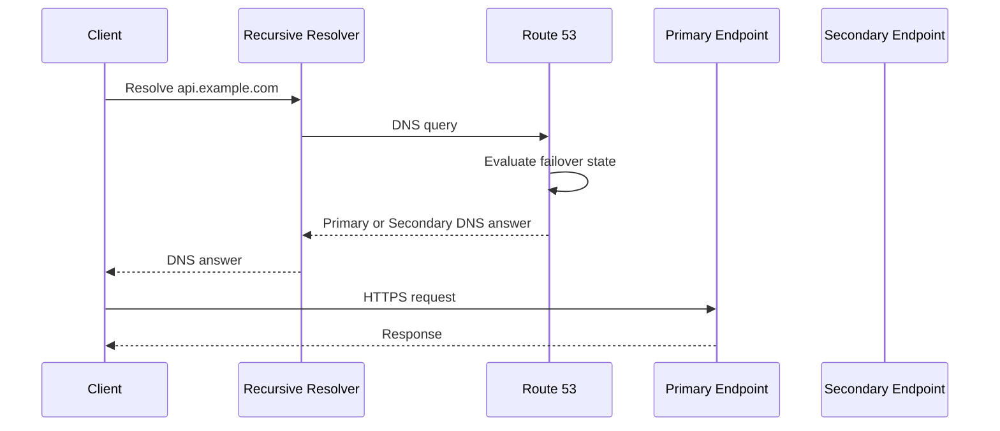
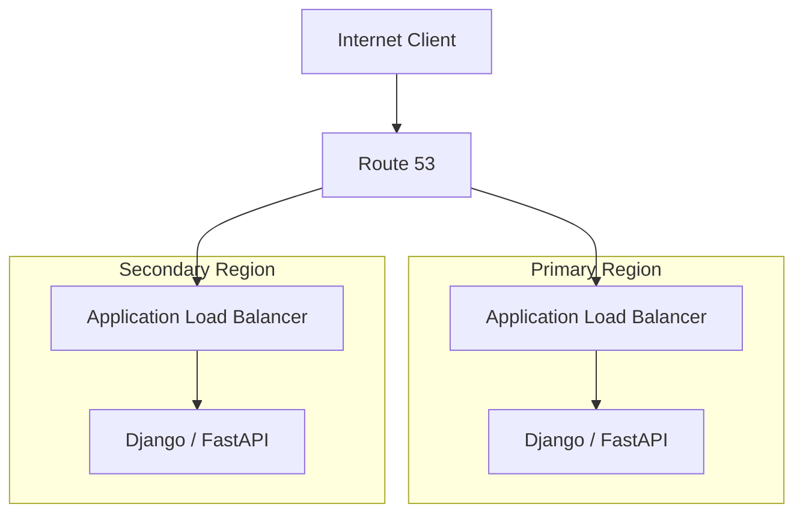
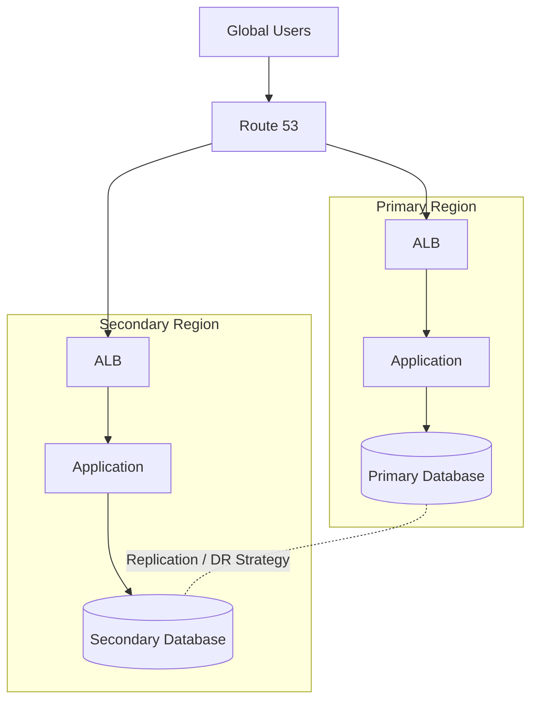
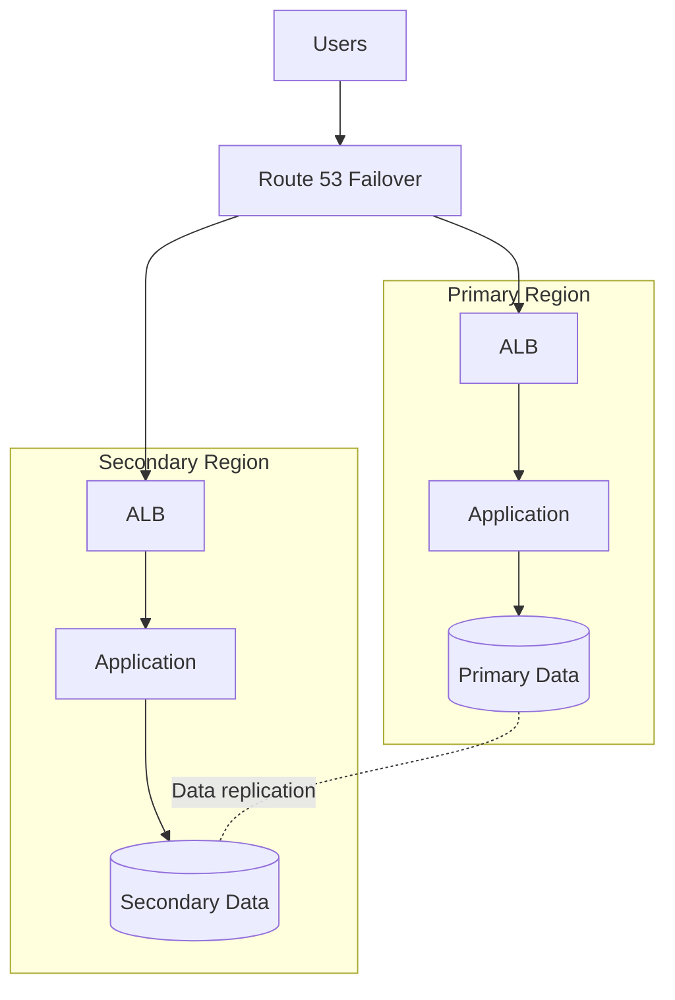
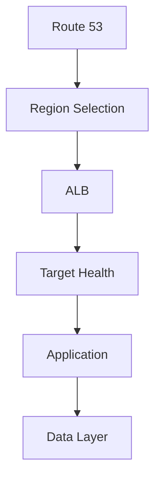

# 02- DNS Failover Architecture

## Overview

DNS failover is an availability pattern in which Amazon Route 53 changes the DNS answer returned to clients when the preferred endpoint becomes unhealthy.

The basic architecture is:

```text
Client
   │
   ▼
DNS Resolver
   │
   ▼
Route 53
   │
   ├── Primary endpoint
   │
   └── Secondary endpoint
```

Under normal conditions, Route 53 returns the primary endpoint:

```text
api.example.com
       │
       ▼
Primary Region
```

When Route 53 determines that the primary is unhealthy, it can return the secondary endpoint:

```text
api.example.com
       │
       ▼
Secondary Region
```

Route 53 supports both **active-passive failover** using the Failover routing policy and **active-active designs** using other routing policies combined with health checks. :contentReference[oaicite:0]{index=0}

DNS failover is useful for:

- Multi-Region disaster recovery
- Primary/secondary application architectures
- Regional failure recovery
- Static website fallback
- Controlled service redundancy
- Internet-facing backend availability

However, DNS failover is not a complete disaster-recovery strategy. Compute capacity, application state, databases, secrets, dependencies, and operational procedures must also be designed for failure.

---

## Why DNS Failover Exists

A DNS record normally maps a hostname to an endpoint:

```text
api.example.com
       │
       ▼
ALB in Region A
```

If that endpoint becomes unavailable, continuing to return the same DNS answer causes new clients to keep attempting to reach an unhealthy system.

DNS failover introduces health-aware decision-making:

```text
                    Route 53
                       │
                 Is primary healthy?
                    /          \
                  Yes           No
                   │             │
                   ▼             ▼
              Primary        Secondary
```

The objective is not to repair the failed endpoint.

The objective is to **stop directing new DNS resolutions toward the failed endpoint** and direct them toward an alternative.

---

## Core Architecture

A basic active-passive architecture contains:

- One primary endpoint
- One secondary endpoint
- One Route 53 hosted zone
- One primary failover record
- One secondary failover record
- Health evaluation for the endpoints



The Route 53 failover configuration requires a **primary** and a **secondary** failover record. :contentReference[oaicite:1]{index=1}

---

## Active-Passive Failover

Active-passive is the classic DNS failover model.

```text
                    Route 53
                       │
                       ▼
                Failover Policy
                  /          \
                 ▼            ▼
             Primary       Secondary
             Region A       Region B
```

Normal operation:

```text
Primary:   HEALTHY
Secondary: HEALTHY

DNS answer → Primary
```

Primary failure:

```text
Primary:   UNHEALTHY
Secondary: HEALTHY

DNS answer → Secondary
```

Primary recovery:

```text
Primary:   HEALTHY
Secondary: HEALTHY

DNS answer → Primary
```

This pattern is appropriate when the organization intentionally wants only one environment serving normal traffic.

---

## Active-Active Failover

Active-active is different.

Both environments normally serve traffic:

```text
                 Route 53
                /         \
               ▼           ▼
          Region A      Region B
             │             │
            App           App
```

If one becomes unhealthy, Route 53 can stop including it in applicable DNS responses.

AWS supports active-active configurations using routing policies other than the Failover policy, combined with health checks. :contentReference[oaicite:2]{index=2}

Typical routing policies include:

- Weighted
- Latency-based
- Geolocation
- Geoproximity
- Multivalue answer

For example:

```text
                 Route 53
                /         \
               ▼           ▼
        us-east-1       ap-south-1
          50%              50%
```

If `us-east-1` becomes unhealthy:

```text
                 Route 53
                     │
                     ▼
                 ap-south-1
```

Active-active usually provides better resource utilization than active-passive because both environments carry production traffic.

---

## Active-Passive vs Active-Active

| Characteristic | Active-Passive | Active-Active |
|---|---|---|
| Normal traffic | Primary only | Multiple environments |
| Secondary usage | Standby | Production |
| Resource utilization | Lower | Higher |
| Failover complexity | Lower | Higher |
| DR readiness | Must maintain standby | Continuously exercised |
| Typical use | DR | Availability + scale |
| Routing policy | Failover | Weighted/latency/etc. |
| Data architecture | Often simpler | Usually more complex |

The right choice depends on RTO, RPO, cost, application architecture, and operational requirements.

---

## DNS Failover Request Lifecycle

A DNS failover decision occurs during DNS resolution, not during every HTTP request.



If the primary is unhealthy:

```text
Client
  │
  ▼
Recursive Resolver
  │
  ▼
Route 53
  │
  ├── Primary unhealthy
  │
  └── Secondary healthy
          │
          ▼
      Secondary answer
```

The important architectural distinction is:

> Route 53 changes DNS answers; it does not proxy application traffic between the primary and secondary endpoints.

---

## Health Checks

Route 53 health checks provide the health signal used by DNS routing decisions.

A health check can monitor:

- A specified endpoint
- Other Route 53 health checks
- A CloudWatch alarm

Route 53 health checkers operate from multiple locations and periodically check monitored endpoints. :contentReference[oaicite:3]{index=3}

A simplified flow is:

```text
Route 53 Health Checkers
        │
        ├── Region A
        ├── Region B
        ├── Region C
        └── Region D
                │
                ▼
          Application
```

The health-check result is evaluated by Route 53 before it chooses an appropriate DNS answer. Health checks are not executed synchronously when a DNS query arrives. :contentReference[oaicite:4]{index=4}

---

## Health Check Types

A practical classification is:

| Type | Purpose |
|---|---|
| Endpoint health check | Directly monitor an endpoint |
| Calculated health check | Combine multiple health checks |
| CloudWatch alarm health check | Use application/infrastructure metrics as a health signal |

For example:

```text
Health Check A → API Region A
Health Check B → API Region B
```

Or:

```text
CloudWatch Alarm
       │
       ▼
Route 53 Health Check
       │
       ▼
DNS Routing
```

This allows DNS failover to incorporate signals that cannot be represented by a simple HTTP request.

---

## Designing the Health Endpoint

A common backend pattern is:

```text
GET /health
```

For a Django or FastAPI application, this endpoint should be intentionally designed for infrastructure health evaluation.

A shallow health endpoint might only return:

```http
HTTP/1.1 200 OK
```

That proves very little.

A production health endpoint should answer the question:

> Can this endpoint safely receive the type of traffic represented by this health check?

For example:

```text
GET /health/ready
```

could validate critical application readiness.

However, avoid blindly checking every dependency.

A dependency-aware health check such as:

```text
Application
 ├── PostgreSQL
 ├── Redis
 ├── Kafka
 ├── External API
 └── Internal service
```

may cause a transient dependency problem to remove an otherwise useful application instance from DNS.

Health checks should therefore be designed around the **failure domain and traffic-safety requirement**.

---

## Health Check Thresholds

Route 53 health checks evaluate endpoint responses over time rather than making a failover decision from one isolated request.

Health-check configuration includes parameters such as:

- Check interval
- Failure threshold
- Protocol
- Port
- Path
- Expected behavior
- Checker regions

Route 53 supports 10-second and 30-second health-check intervals for endpoint health checks. :contentReference[oaicite:5]{index=5}

The practical consequence is that failover is not necessarily instantaneous.

The complete transition includes:

```text
Endpoint failure
      │
      ▼
Health-check detection
      │
      ▼
Route 53 health-state change
      │
      ▼
New DNS responses
      │
      ▼
DNS cache expiration
      │
      ▼
New client connection
```

---

## Failover Records

A Route 53 failover configuration typically contains two records with:

- The same record name
- The same record type
- Failover routing policy
- One `PRIMARY` record
- One `SECONDARY` record

Example:

```text
api.example.com
       │
       ├── PRIMARY
       │      └── ALB Region A
       │
       └── SECONDARY
              └── ALB Region B
```

Route 53 returns the primary record when the primary is healthy and can return the secondary when the primary is unhealthy and the secondary is healthy. :contentReference[oaicite:6]{index=6}

---

## Alias Records and Evaluate Target Health

For supported AWS resources, alias records can use:

```text
Evaluate Target Health = Yes
```

This is particularly useful for AWS-native endpoints such as load balancers.

Example:

```text
api.example.com
       │
       ▼
Route 53 Alias
       │
       ▼
ALB
```

Instead of manually creating an external health check for an AWS resource that supports target-health evaluation, Route 53 can evaluate the health of the alias target.

AWS specifically recommends using `Evaluate Target Health` for supported alias targets rather than unnecessarily creating health checks for those resources. :contentReference[oaicite:7]{index=7}

---

## Failover with ALB

A common production architecture is:



Configuration conceptually becomes:

```text
api.example.com
       │
       ├── PRIMARY
       │      └── Alias → ALB Region A
       │             Evaluate Target Health = Yes
       │
       └── SECONDARY
              └── Alias → ALB Region B
                     Evaluate Target Health = Yes
```

This architecture is generally preferable to pointing DNS directly at individual EC2 instances when an ALB is already part of the application architecture.

---

## Failover with API Gateway

A serverless architecture can use:

```text
api.example.com
       │
       ▼
Route 53
       │
       ├── Primary API Gateway
       │
       └── Secondary API Gateway
```

For example:

```text
Region A
Route 53
   ↓
API Gateway
   ↓
Lambda

Region B
API Gateway
   ↓
Lambda
```

Route 53 can use supported alias targets and health evaluation for API Gateway configurations. :contentReference[oaicite:8]{index=8}

The Lambda functions, data stores, secrets, and downstream dependencies in the secondary Region must still be operationally ready.

---

## Multi-Region DNS Failover

A typical disaster-recovery architecture is:



Route 53 handles:

```text
DNS traffic steering
```

The data layer handles:

```text
Data replication and recovery
```

The compute layer handles:

```text
Application capacity
```

The operational layer handles:

```text
Failover orchestration and verification
```

These are separate responsibilities.

---

## DNS Failover Is Not Database Failover

This is one of the most important architectural distinctions.

Suppose:

```text
Region A
  App A
  DB A

Region B
  App B
  DB B
```

If `App A` fails but `DB A` remains healthy, Route 53 can potentially direct traffic to Region B.

But if `DB A` is the authoritative source of application state and `DB B` is stale, sending traffic to Region B may cause:

- Stale reads
- Missing records
- Failed writes
- Data divergence
- Application inconsistencies

Therefore:

```text
DNS failover
      ≠
Database failover
```

A production DR design must explicitly define:

- RPO
- RTO
- Replication strategy
- Write ownership
- Failover sequence
- Data consistency
- Recovery procedures

---

## TTL and Failover Timing

DNS caching is one of the biggest limitations of DNS-based failover.

Suppose:

```text
TTL = 60 seconds
```

and Route 53 changes the DNS answer from:

```text
Region A
```

to:

```text
Region B
```

Resolvers that already cached the old answer may continue using it until the cache expires.

Therefore:

```text
Route 53 detects failure
        │
        ▼
Route 53 changes DNS answer
        │
        ▼
Existing DNS caches may still contain old answer
        │
        ▼
Cache expiration
        │
        ▼
New DNS lookup
        │
        ▼
Secondary endpoint
```

DNS failover should therefore be designed with realistic expectations about recovery time.

Lower TTLs can improve agility but increase DNS query volume and may not eliminate all client-side or intermediate caching behavior.

---

## Failover Timeline

A realistic failure sequence is:

```text
T0
│
├── Primary application fails
│
T1
│
├── Route 53 health check detects failures
│
T2
│
├── Route 53 marks primary unhealthy
│
T3
│
├── New DNS queries receive secondary answer
│
T4
│
├── Recursive resolver cache expires
│
T5
│
└── Client connects to secondary
```

The total recovery time depends on several variables:

```text
Detection time
+
Health evaluation
+
DNS caching
+
Client behavior
+
Application startup
+
Data readiness
```

This is why DNS failover should not be advertised as an exact fixed number of seconds unless the complete architecture has been measured.

---

## Failover and DNS Caching

Consider a client whose resolver has cached:

```text
api.example.com → Region A
```

Even after Route 53 determines Region A is unhealthy:

```text
Resolver cache
     │
     ▼
Region A
```

may continue to be used until the cached record expires.

This means DNS failover primarily affects **new DNS resolution**, not necessarily clients that already have a cached answer.

This is particularly important for:

- Mobile clients
- Long-running applications
- JVM applications
- Python processes with DNS caching
- Containers
- Service meshes
- Corporate DNS resolvers

Application-level DNS caching can introduce another layer of delay.

---

## Failover and HTTP Keep-Alive

DNS failover does not terminate existing TCP or HTTP connections.

For example:

```text
Client
  │
  └── Existing TCP connection
            │
            ▼
        Region A
```

If Route 53 later changes the DNS answer:

```text
New DNS lookup
      │
      ▼
Region B
```

the existing connection does not automatically migrate to Region B.

Applications using:

- HTTP keep-alive
- Connection pooling
- gRPC channels
- persistent WebSocket connections

may continue interacting with the previous endpoint until the connection is closed or fails.

This is an important senior-level distinction.

---

## Failover with gRPC

gRPC clients commonly maintain long-lived HTTP/2 connections.

Architecture:

```text
gRPC Client
    │
    ▼
api.example.com
    │
    ▼
Route 53
    │
    ▼
Region A
```

If Route 53 switches the DNS answer:

```text
api.example.com
       │
       ▼
Region B
```

an already-established gRPC channel does not necessarily move immediately to Region B.

A robust gRPC architecture should therefore consider:

- Connection lifetime
- Client-side load balancing
- Retry policies
- Backoff
- Resolver refresh behavior
- Health checking
- Idempotency

DNS failover is one layer of the availability strategy, not the entire gRPC failover mechanism.

---

## Failover with Microservices

For public traffic:

```text
Internet
   │
   ▼
Route 53
   │
   ▼
ALB
   │
   ▼
API Service
```

For internal services:

```text
Order Service
      │
      ▼
payments.internal.example.com
      │
      ▼
Payment Service
```

The internal architecture may use:

- Private Hosted Zones
- Kubernetes DNS
- AWS Cloud Map
- Service mesh
- Internal load balancers

Do not automatically apply public DNS failover to every internal microservice.

Internal service availability often requires faster and more granular mechanisms than public DNS.

---

## Health Check Design

A production health check should be:

- Fast
- Deterministic
- Highly available
- Representative of service readiness
- Cheap to execute
- Resistant to transient failures

A useful hierarchy is:

```text
                 Health
                   │
        ┌──────────┴──────────┐
        ▼                     ▼
   Process health        Readiness health
        │                     │
        ▼                     ▼
   Is process alive?    Can it serve traffic?
```

Avoid making the health endpoint perform expensive operations.

Bad example:

```text
GET /health
    │
    ├── Full database scan
    ├── Kafka request
    ├── External API request
    ├── Redis operation
    └── Complex business logic
```

Better:

```text
GET /health/ready
    │
    ├── Application initialized
    ├── Critical local configuration available
    └── Critical dependency state acceptable
```

The exact checks depend on the application's failure model.

---

## Cascading Failure Considerations

Health-based routing can itself amplify failures if designed incorrectly.

Suppose:

```text
Region A
  10 instances
```

One instance fails:

```text
9 healthy
1 unhealthy
```

Removing that instance is reasonable.

But if a shared dependency fails:

```text
PostgreSQL
    ↓
All 10 instances report unhealthy
```

Route 53 may consider the entire region unavailable.

Traffic then moves to Region B:

```text
Region A
  0 healthy

       ↓

Region B
  10 healthy
```

If Region B does not have enough capacity:

```text
Region B
  overloaded
      ↓
health checks fail
      ↓
more traffic / broader failure
```

Health checks should therefore be designed with cascading-failure behavior in mind.

Route 53 also implements safeguards for situations where all records are considered unhealthy, rather than simply returning no DNS answer. :contentReference[oaicite:9]{index=9}

---

## Failover Capacity Planning

A standby Region must have enough capacity to absorb the expected traffic.

Suppose:

```text
Primary traffic = 1000 requests/sec
Secondary capacity = 200 requests/sec
```

Then DNS failover does not provide meaningful resilience.

A production design should evaluate:

```text
Normal traffic
+
Expected peak traffic
+
Failover traffic
+
Recovery overhead
```

For example:

```text
Primary Region
  1000 RPS

Secondary Region
  1200 RPS capacity
```

This gives the secondary enough capacity to accept the primary workload.

The exact capacity strategy depends on:

- Auto Scaling
- ECS
- EKS
- Lambda
- Database capacity
- Cache capacity
- External dependencies

---

## Warm Standby vs Cold Standby

A secondary Region can exist in different states.

| Model | Description | Recovery characteristics |
|---|---|---|
| Cold standby | Minimal infrastructure | Slow recovery |
| Pilot light | Core infrastructure available | Moderate recovery |
| Warm standby | Reduced-capacity application running | Faster recovery |
| Hot standby | Full production capacity | Fastest recovery |
| Active-active | Both Regions serve traffic | Continuous production use |

Route 53 can participate in all of these architectures, but it does not create the standby environment.

For strict RTO requirements, a warm or hot standby is often more appropriate than a completely cold environment.

---

## Failover and Infrastructure as Code

Route 53 failover configuration should generally be managed through infrastructure as code.

Example Terraform configuration:

```hcl
resource "aws_route53_record" "api_primary" {
  zone_id = aws_route53_zone.public.zone_id
  name    = "api.example.com"
  type    = "A"

  set_identifier = "primary"

  failover_routing_policy {
    type = "PRIMARY"
  }

  alias {
    name                   = aws_lb.primary.dns_name
    zone_id                = aws_lb.primary.zone_id
    evaluate_target_health = true
  }
}

resource "aws_route53_record" "api_secondary" {
  zone_id = aws_route53_zone.public.zone_id
  name    = "api.example.com"
  type    = "A"

  set_identifier = "secondary"

  failover_routing_policy {
    type = "SECONDARY"
  }

  alias {
    name                   = aws_lb.secondary.dns_name
    zone_id                = aws_lb.secondary.zone_id
    evaluate_target_health = true
  }
}
```

This gives the DNS architecture:

```text
api.example.com
      │
      ├── PRIMARY
      │      └── Primary ALB
      │
      └── SECONDARY
             └── Secondary ALB
```

The exact Terraform configuration should follow the current provider version and organization-specific infrastructure conventions.

---

## CLI Verification

DNS configuration should be verified from multiple perspectives.

Query the DNS record:

```bash
dig api.example.com
```

Request a specific record type:

```bash
dig api.example.com A
```

Inspect the full DNS response:

```bash
dig +noall +answer api.example.com
```

Test the application:

```bash
curl -I https://api.example.com
```

For a failover test, verify:

```text
DNS answer
    ↓
Expected Region
    ↓
Expected load balancer
    ↓
Expected application
```

Do not rely solely on the Route 53 console to validate a failover architecture.

---

## Testing DNS Failover

A production failover configuration should be tested deliberately.

A useful test sequence is:

```text
1. Establish normal primary traffic
2. Verify secondary readiness
3. Introduce controlled primary failure
4. Observe health-check state
5. Verify Route 53 DNS responses
6. Verify client traffic reaches secondary
7. Validate application behavior
8. Restore primary
9. Verify recovery behavior
10. Document observed RTO
```

Testing should answer:

- How long did health detection take?
- How long did DNS propagation effectively take?
- Did clients reconnect?
- Did connection pools recover?
- Did gRPC channels reconnect?
- Could the secondary handle the traffic?
- Did database writes succeed?
- Did background jobs continue correctly?
- Did monitoring detect the event?
- Did the system automatically recover?

---

## Chaos and Failure Testing

A serious DR architecture should test more than process failure.

Useful scenarios include:

| Failure | Expected behavior |
|---|---|
| Application failure | Route traffic away |
| ALB failure | Secondary path available |
| Region failure | Secondary Region serves traffic |
| Database failure | Application behavior matches DR design |
| DNS resolver issue | Existing architecture handles degraded resolution |
| Dependency outage | Health checks do not create unnecessary cascading failure |
| Network partition | Failover behavior remains safe |
| Capacity exhaustion | Secondary has sufficient capacity |

The purpose of testing is not simply proving that Route 53 changes an answer.

The objective is proving that **the complete system remains usable after failure**.

---

## Observability

Monitor DNS failover at multiple layers.

### Route 53

Monitor:

- Health-check status
- DNS configuration changes
- Routing configuration
- Failover events

### CloudWatch

Health checks can be integrated with CloudWatch for monitoring and notifications. :contentReference[oaicite:10]{index=10}

### Load Balancer

Monitor:

- Healthy target count
- Unhealthy target count
- Request count
- HTTP 5xx
- Target response time

### Application

Monitor:

- Request rate
- Error rate
- Latency
- Dependency failures
- Database errors

### Client

Monitor:

- DNS resolution failures
- Connection failures
- Retry rate
- gRPC reconnects
- HTTP timeout rate

The complete signal should look like:

```text
Route 53
   │
   ▼
DNS answer changed
   │
   ▼
Traffic moved
   │
   ▼
Secondary load increased
   │
   ▼
Application health
   │
   ▼
Business success rate
```

---

## Security Considerations

DNS failover infrastructure should be protected like production infrastructure.

### IAM

Use least-privilege permissions for:

- Route 53 record modifications
- Health-check modifications
- Hosted-zone changes
- Infrastructure deployment

### Infrastructure as Code

Prefer:

```text
Git
 ↓
Pull Request
 ↓
Review
 ↓
CI
 ↓
Infrastructure deployment
 ↓
Route 53
```

over unrestricted manual production changes.

### Auditability

Monitor Route 53 API activity using AWS auditing capabilities such as CloudTrail.

A DNS change can redirect production traffic, so unauthorized record modifications are a significant operational risk.

---

## Disaster Recovery Architecture

A complete multi-Region DR design might look like:



The architecture has four independent concerns:

```text
DNS
 └── Traffic steering

Compute
 └── Application capacity

Data
 └── Replication and recovery

Operations
 └── Detection, orchestration, verification
```

Route 53 solves primarily the first concern.

---

## Route 53 Failover vs Application-Level Failover

DNS failover should not be the only failover mechanism.

Consider:

```text
Route 53
    ↓
ALB
    ↓
Application
```

The ALB can already detect unhealthy backend targets.

Therefore:

```text
Route 53
    → Region-level routing

ALB
    → Instance/task/pod-level routing
```

This layered model is generally more robust.

For example:

```text
Region A
  │
  ▼
ALB
  ├── App 1 healthy
  ├── App 2 unhealthy
  └── App 3 healthy
```

The ALB can remove App 2 without requiring Route 53 to change the regional DNS answer.

Route 53 should generally operate at a broader failure boundary.

---

## Layered Failure Handling

A mature architecture can use multiple levels:



The responsibilities are:

| Layer | Failure handled |
|---|---|
| Route 53 | Region / endpoint-level failure |
| ALB | Target-level failure |
| Application | Dependency/business failures |
| Database | Data-layer failure |
| Kubernetes | Pod/node-level failure |
| Auto Scaling | Capacity failure |

This prevents Route 53 from being overloaded with responsibilities that belong to lower layers.

---

## Advanced Failover Trees

Route 53 can combine routing policies into more complex decision trees.

For example:

```text
Route 53
   │
   ▼
Latency Routing
   │
   ├── Region A
   │      │
   │      ▼
   │   Weighted Routing
   │      ├── ALB A1
   │      └── ALB A2
   │
   └── Region B
          │
          ▼
       Weighted Routing
          ├── ALB B1
          └── ALB B2
```

Health evaluation can cause Route 53 to move through the routing tree when a selected branch is unhealthy. AWS documents this pattern for combinations such as latency-based records with weighted records and health evaluation. :contentReference[oaicite:11]{index=11}

This enables architectures such as:

```text
Choose nearest healthy Region
        │
        ▼
Choose healthy endpoint within Region
```

However, increasingly complex DNS trees also increase operational complexity.

Use them only when the additional routing behavior is justified.

---

## DNS Failover and ARC

For more controlled disaster-recovery operations, Amazon Route 53 health checks can also integrate with Amazon Application Recovery Controller (ARC) routing controls.

This allows operational teams to control DNS failover through routing-control mechanisms rather than relying exclusively on endpoint health detection. AWS documents ARC routing-control health checks as a supported mechanism for DNS failover. :contentReference[oaicite:12]{index=12}

This can be useful when:

- Automated health detection is insufficient
- Operators need explicit regional traffic control
- Disaster-recovery runbooks require controlled failover
- Application-level health cannot be safely inferred from a single endpoint

A senior architecture decision should distinguish:

```text
Automatic health-based failover
```

from:

```text
Operator-controlled failover
```

The latter can be safer for complex distributed systems where automatic failover could create data-integrity problems.

---

## Common Mistakes

### Treating DNS Failover as Instant

DNS caching can delay client migration.

**Avoid it by:**

- Designing realistic RTOs
- Choosing appropriate TTLs
- Testing actual resolver behavior
- Measuring client reconnection time

### Building a Fake Secondary

A secondary endpoint that has never served production traffic is not a reliable DR environment.

**Avoid it by:**

- Keeping the environment operational
- Testing it regularly
- Validating capacity
- Testing dependencies
- Running controlled failover exercises

### Forgetting Data Replication

A second application Region does not automatically mean a second usable data Region.

**Avoid it by:**

- Designing replication explicitly
- Defining RPO/RTO
- Testing database recovery
- Documenting write ownership

### Using Overly Deep Health Checks

Checking every dependency can make the entire Region appear unhealthy because of one transient dependency.

**Avoid it by:**

- Defining what "safe to receive traffic" means
- Keeping checks deterministic
- Testing dependency-failure scenarios

### Using a Shallow Health Check

Returning `200 OK` while the application cannot process real requests can prevent failover.

**Avoid it by:**

- Testing meaningful readiness
- Including critical application state where appropriate

### Forgetting Long-Lived Connections

Existing HTTP/2, gRPC, WebSocket, or keep-alive connections may continue using the old endpoint.

**Avoid it by:**

- Designing client reconnection
- Configuring appropriate timeouts
- Testing connection behavior during failover

### Assuming Weighted DNS Is Exact

DNS caching and resolver behavior mean weighted routing is not a precise per-request traffic splitter.

**Avoid it by:**

- Using weighted DNS for approximate traffic distribution
- Using application/load-balancer mechanisms when precise traffic control is required

### Putting Region-Level Failover at the Wrong Layer

Do not use Route 53 to solve individual-instance failures when an ALB or Kubernetes already handles those failures.

**Avoid it by:**

```text
Route 53 → Region-level decisions
ALB       → Target-level decisions
Kubernetes → Pod/node-level decisions
Application → Dependency/business decisions
```

---

## Production Checklist

Before relying on DNS failover in production, verify:

### DNS

- [ ] Primary failover record exists
- [ ] Secondary failover record exists
- [ ] Record names and types are correct
- [ ] Routing policy is correct
- [ ] Alias configuration is correct
- [ ] TTL is appropriate

### Health

- [ ] Health checks represent meaningful availability
- [ ] Health checks are not unnecessarily expensive
- [ ] Health-check thresholds have been tested
- [ ] Failure and recovery behavior are understood
- [ ] Health checks do not create cascading failures

### Secondary Environment

- [ ] Application is deployed
- [ ] Capacity is sufficient
- [ ] Secrets are available
- [ ] Dependencies are available
- [ ] Database is ready
- [ ] Background workers are ready
- [ ] Monitoring is configured

### Data

- [ ] RPO is defined
- [ ] RTO is defined
- [ ] Replication is tested
- [ ] Failover write behavior is understood
- [ ] Data consistency is validated

### Operations

- [ ] Failover has been tested
- [ ] Recovery has been tested
- [ ] DNS behavior has been verified externally
- [ ] On-call procedures exist
- [ ] Route 53 changes are audited
- [ ] Infrastructure is managed through code where practical

---

## Interview Traps

### "Does Route 53 redirect traffic?"

Not exactly.

Route 53 returns DNS answers. The client then connects to the returned endpoint.

### "Does Route 53 health-check the endpoint for every DNS query?"

No.

Route 53 health checks are performed periodically and the resulting health state is used when selecting DNS answers. :contentReference[oaicite:13]{index=13}

### "Will failover immediately disconnect users from the failed Region?"

No.

Existing connections remain until they close or fail. DNS changes primarily affect new DNS resolution.

### "Does DNS failover guarantee zero downtime?"

No.

It depends on:

- Detection time
- DNS caching
- Client behavior
- Secondary capacity
- Application readiness
- Data availability

### "Can Route 53 fail over a database automatically?"

Not by itself.

Database failover requires a separate data architecture.

### "Is active-passive always better for DR?"

No.

Active-active can provide stronger availability and continuously exercise both environments, but usually introduces greater data and operational complexity.

### "Can an ALB already handle failures without Route 53?"

Yes.

An ALB can remove unhealthy targets inside its target group. Route 53 is more appropriate for broader DNS-level decisions such as selecting between Regions or independent endpoints.

---

## Key Takeaways

- DNS failover uses Route 53 to change DNS answers when the preferred endpoint becomes unhealthy.
- Active-passive failover uses Route 53's Failover routing policy with primary and secondary records.
- Active-active architectures can use other routing policies combined with health checks.
- Route 53 health checks operate periodically; they are not executed as part of each DNS query.
- Alias records can use `Evaluate Target Health` for supported AWS targets.
- Route 53 should generally handle broader failure boundaries such as Region-level or endpoint-level routing.
- ALB, Kubernetes, and application-level mechanisms should handle lower-level failures where appropriate.
- DNS failover does not proxy traffic and does not migrate existing TCP, HTTP, gRPC, or WebSocket connections.
- DNS caching means failover is not instantaneous for every client.
- A secondary Region must have sufficient compute, dependency, secret, and data readiness to accept production traffic.
- DNS failover is not database failover.
- DNS failover is not a complete disaster-recovery strategy.
- Health checks should represent whether an endpoint is safe to receive traffic without creating unnecessary cascading failures.
- Active-active and active-passive architectures have different cost, complexity, utilization, and recovery characteristics.
- Weighted DNS can support controlled traffic distribution, but it is not a precise per-request traffic splitter.
- Multi-level Route 53 routing policies can create sophisticated failover trees, but complexity should be justified by actual requirements.
- Production failover must be tested, not merely configured.
- A complete DR architecture should connect:

```text
Failure Detection
       ↓
Health Evaluation
       ↓
Route 53 DNS Decision
       ↓
DNS Cache Expiration
       ↓
Client Reconnection
       ↓
Secondary Capacity
       ↓
Application Readiness
       ↓
Data Availability
       ↓
Business Recovery
```

The key architectural principle is:

```text
Route 53
    ↓
Decide where new DNS resolutions should go

ALB / Kubernetes
    ↓
Decide which healthy compute target receives traffic

Application
    ↓
Handle dependency and business failures

Database / Data Layer
    ↓
Handle replication and data recovery

Operations
    ↓
Validate and control disaster recovery
```