# 03- Real-World Architectures

## Overview

Amazon Route 53 is most valuable when treated as a **traffic-steering layer** within a larger distributed architecture rather than simply as a DNS service.

In production systems, Route 53 commonly sits at the boundary between users and application infrastructure:

```text
Users
  │
  ▼
DNS Resolver
  │
  ▼
Route 53
  │
  ├── CloudFront
  ├── ALB
  ├── API Gateway
  ├── S3
  ├── Regional application
  └── DR environment
```

The routing decision can incorporate:

- Availability
- Latency
- Geography
- Traffic percentages
- Endpoint health
- Disaster-recovery requirements
- Application architecture
- Deployment strategy

The important engineering question is therefore not:

> "How do I configure a Route 53 record?"

It is:

> "What traffic decision should DNS make, at which failure boundary, and what happens after the client receives the answer?"

This document focuses on practical architectures where Route 53 participates in production backend systems.

---

## Architecture Patterns

The most common production patterns are:

| Architecture | Primary Route 53 capability | Typical use |
|---|---|---|
| Single-region application | Alias routing | Standard production API |
| CloudFront + S3 | Alias routing | Static websites |
| CloudFront + ALB | Alias routing | CDN-backed APIs/web applications |
| Multi-AZ ALB | Regional endpoint | High availability |
| Multi-Region active-passive | Failover routing | Disaster recovery |
| Multi-Region active-active | Latency routing | Global applications |
| Weighted deployment | Weighted routing | Canary releases |
| Geographic routing | Geolocation | Regulatory/geographic requirements |
| Proximity routing | Geoproximity | Geographic traffic steering |
| Health-aware endpoints | Health checks | Availability-based routing |
| Hybrid DNS | Route 53 Resolver | AWS/on-premises integration |

---

## Single-Region Production API

The simplest production architecture is:

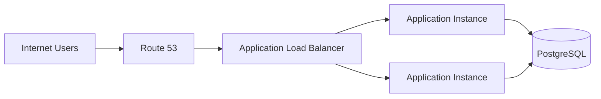

A typical DNS record is:

```text
api.example.com
       │
       ▼
Route 53 Alias
       │
       ▼
Application Load Balancer
       │
       ├── Target 1
       ├── Target 2
       └── Target 3
```

### Why Route 53 Is Used

The public hostname should not expose individual compute instances.

Instead:

```text
api.example.com
```

maps to:

```text
ALB
```

The ALB then handles target-level distribution.

This creates a clean responsibility boundary:

```text
Route 53
    ↓
DNS-level endpoint selection

ALB
    ↓
Target-level traffic distribution

Application
    ↓
Business processing

PostgreSQL
    ↓
Persistent state
```

### Production Characteristics

This architecture provides:

- Stable application hostname
- Multi-AZ load balancing
- Automatic target health evaluation at the ALB layer
- Independent DNS management
- Simple deployment topology

However, it is still a **single-Region architecture**.

A Region-wide outage can make the entire application unavailable.

---

## Multi-AZ Application Architecture

Before introducing Multi-Region DNS, understand the more common Multi-AZ design.

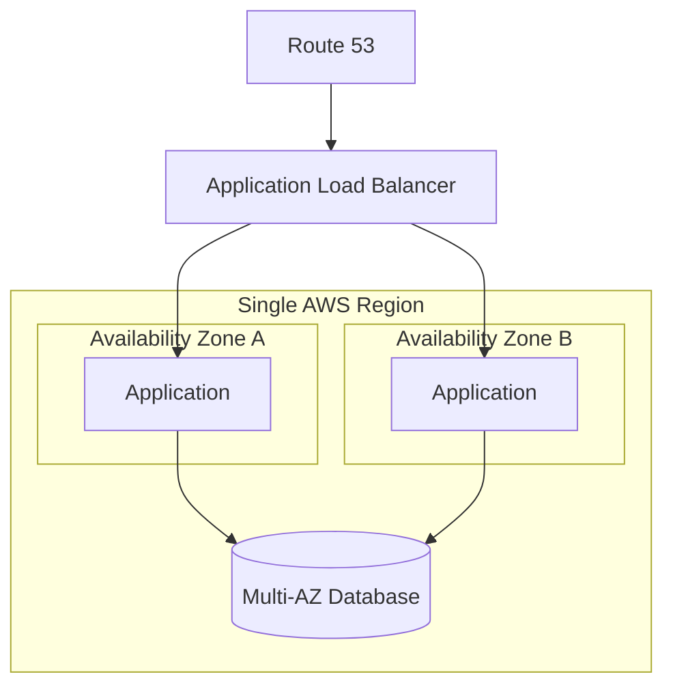

Route 53 normally has no need to choose between the individual Availability Zones.

The ALB handles that responsibility.

This is an important design principle:

> Do not use DNS routing to solve a problem that a load balancer already solves more effectively.

Route 53 should usually operate at a larger routing boundary.

---

## CloudFront + Route 53

A common public web architecture is:


The origin can be:

- S3
- ALB
- API Gateway
- Custom HTTP origin

For a static website:

```text
example.com
     │
     ▼
Route 53
     │
     ▼
CloudFront
     │
     ▼
S3
```

For a dynamic application:

```text
example.com
     │
     ▼
Route 53
     │
     ▼
CloudFront
     │
     ▼
ALB
     │
     ▼
Django / FastAPI
```

### Why This Architecture Is Useful

CloudFront provides:

- Edge caching
- TLS termination
- Global edge presence
- Reduced origin traffic
- DDoS protection integration
- Lower latency for cacheable content

Route 53 provides:

- DNS resolution
- Domain routing
- Alias records
- Integration with AWS endpoints

The responsibilities remain separate:

```text
Route 53 → Find the CloudFront distribution

CloudFront → Serve/cache/forward HTTP traffic

ALB → Distribute traffic to application targets

Application → Execute business logic
```

---

## Route 53 + S3 Static Website

A typical static website architecture is:

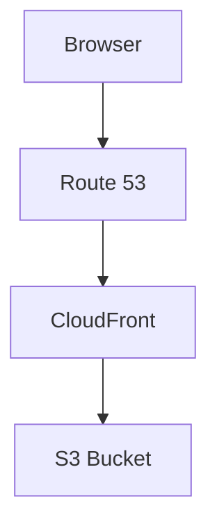

For a production website, CloudFront is generally preferable to exposing an S3 website endpoint directly.

A common setup is:

```text
www.example.com
       │
       ▼
Route 53
       │
       ▼
CloudFront
       │
       ▼
Private S3 bucket
```

The bucket can remain private while CloudFront accesses it through an appropriate origin-access configuration.

This provides a stronger security boundary than making the bucket publicly readable solely to serve website content.

---

## Route 53 + CloudFront + API

A production API can use:

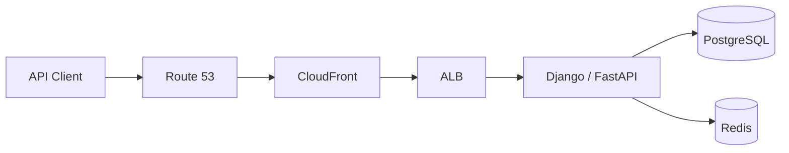

This architecture is useful when the API benefits from:

- Edge TLS termination
- Caching
- WAF integration
- Global edge connectivity
- Centralized HTTP controls

However, not every API request should be cached.

Authenticated or highly dynamic API responses generally require careful cache-policy design.

---

## Route 53 + API Gateway + Lambda

A serverless API can use:

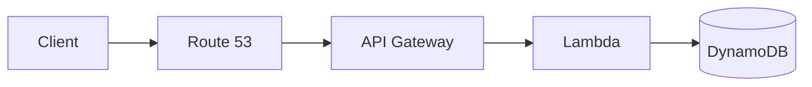

Typical hostname:

```text
api.example.com
```

points to an API Gateway endpoint using an appropriate Route 53 alias configuration.

This removes the need to operate:

- EC2 instances
- Application servers
- Load balancer targets
- Application scaling infrastructure

But the architecture still requires attention to:

- Lambda concurrency
- API Gateway throttling
- Database capacity
- Cold-start behavior
- Dependency failures
- Observability

Route 53 only handles the DNS layer.

---

## Multi-Region Active-Passive Architecture

A classic disaster-recovery architecture is:

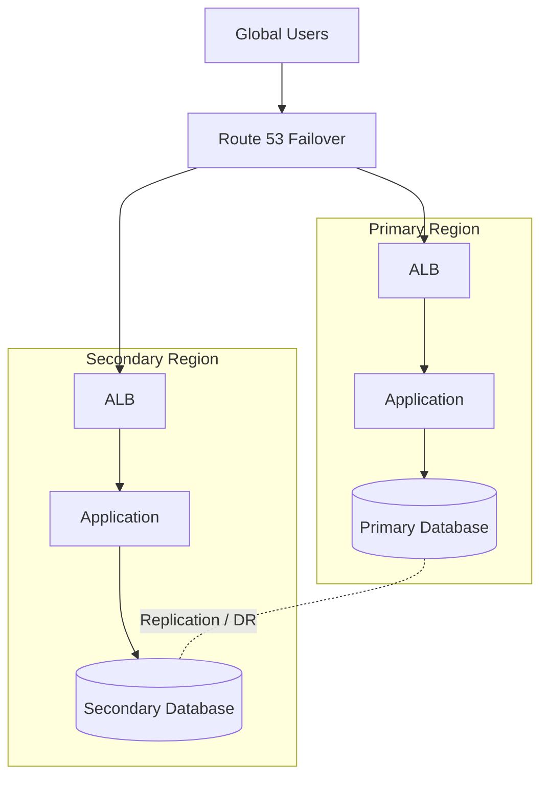

Normal state:

```text
Route 53
   │
   ▼
Primary Region
```

Failure state:

```text
Route 53
   │
   ▼
Secondary Region
```

### When to Use It

Active-passive is appropriate when:

- One Region should normally serve traffic
- A second Region exists primarily for disaster recovery
- Cost optimization is important
- Application state is difficult to run active-active
- Regional failover is acceptable

### Important Limitation

The secondary Region must actually be usable.

A DNS record pointing to an empty environment is not disaster recovery.

---

## Multi-Region Active-Active Architecture

Active-active allows multiple Regions to serve traffic continuously.

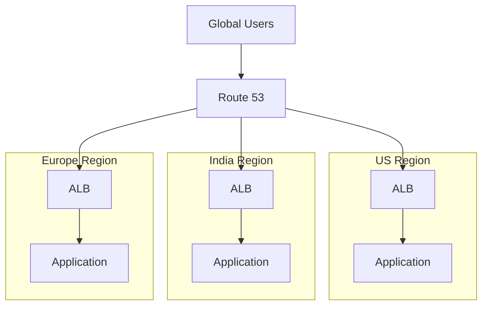

Latency-based routing can direct users toward the Region Route 53 determines to have the lowest latency from the user's DNS resolver.

This architecture is useful for:

- Global applications
- Latency-sensitive APIs
- Regional isolation
- High availability
- Large-scale traffic distribution

### Main Challenge

Application state becomes more difficult.

For example:

```text
US Application
      │
      ▼
US Database

India Application
      │
      ▼
India Database
```

Now the architecture must answer:

- Where is authoritative state?
- How are writes replicated?
- What happens during a partition?
- How are conflicts resolved?
- Which Region accepts writes?
- What consistency model is required?

Route 53 does not solve these problems.

---

## Multi-Region Read-Heavy Architecture

A useful pattern for read-heavy systems is:

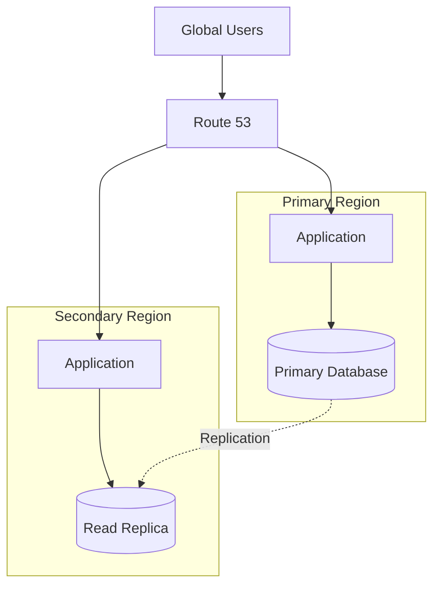

This works well when:

- Reads dominate
- Data replication is acceptable
- Writes have a clear primary ownership model
- Regional read latency matters

A senior engineer should avoid assuming that DNS-level geographic distribution automatically makes the database globally distributed.

---

## Latency-Based Global API

Consider a global API:

```text
api.example.com
```

with deployments in:

```text
us-east-1
eu-west-1
ap-south-1
```

Route 53 can use latency-based routing:

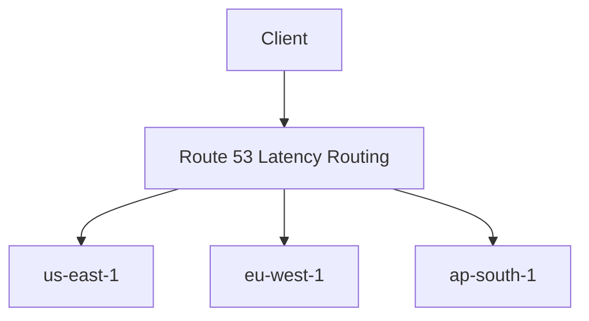

The routing decision is based on AWS's latency measurements between AWS Regions and the DNS resolver location, not a real-time measurement of the user's exact application response time.

This distinction matters when debugging routing behavior.

---

## Geolocation Architecture

Geolocation routing allows routing decisions based on the geographic location associated with the DNS query.

Example:

```text
api.example.com

India       → ap-south-1
Europe      → eu-west-1
North America → us-east-1
```

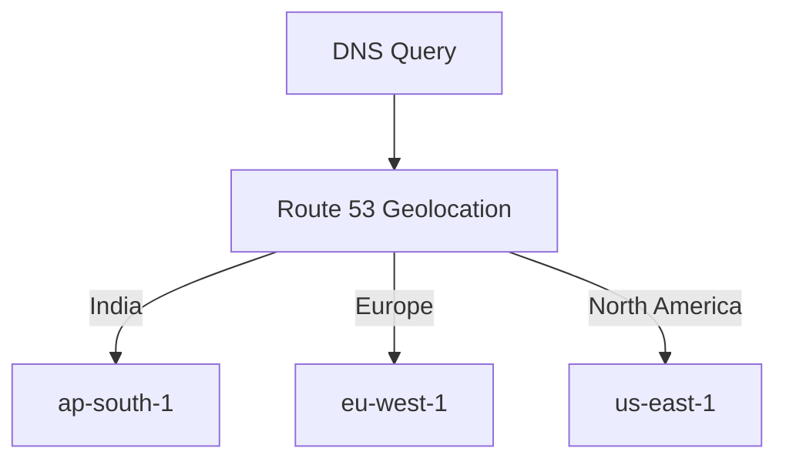

This is useful for:

- Regulatory requirements
- Geographic content
- Regional service endpoints
- Data residency strategies

However:

> Geolocation routing does not by itself guarantee data residency.

If the application in India communicates with a database in another Region, the overall data flow may still cross geographic boundaries.

---

## Geoproximity Architecture

Geoproximity routing is useful when traffic should be directed based on the geographic proximity of resources, with support for adjusting routing boundaries through bias.

Conceptually:

```text
Users
  │
  ▼
Route 53 Geoproximity
  │
  ├── Region A
  ├── Region B
  └── Region C
```

Bias can effectively expand or shrink the geographic area associated with a resource.

This can be useful when an organization wants more control over regional traffic distribution than basic latency-based routing provides.

---

## Weighted Routing for Canary Releases

Route 53 weighted routing can be used for controlled traffic distribution.

Example:

```text
api.example.com

Version A → 95%
Version B → 5%
```

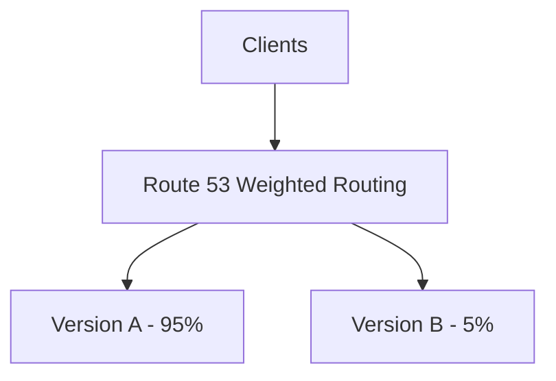

This can support:

- Canary releases
- Blue/green transitions
- Migration between infrastructure versions
- Gradual traffic movement

### Important Limitation

DNS weighting is not equivalent to an exact request-level percentage.

DNS responses are cached by recursive resolvers and clients.

Therefore:

```text
95% / 5%
```

should be interpreted as DNS-level traffic steering, not as a guaranteed:

```text
950 requests / 50 requests
```

distribution.

For precise application traffic splitting, use mechanisms such as:

- ALB weighted target groups
- Service mesh traffic management
- Application-level routing

when appropriate.

---

## Blue/Green Deployment with Route 53

A simple DNS-based blue/green architecture is:

```text
                    Route 53
                       │
             ┌─────────┴─────────┐
             ▼                   ▼
        Blue ALB             Green ALB
             │                   │
        Blue App             Green App
```

Initial state:

```text
Blue  → 100%
Green → 0%
```

Migration:

```text
Blue  → 90%
Green → 10%
```

Later:

```text
Blue  → 0%
Green → 100%
```

### Why It Is Useful

This can allow infrastructure to be deployed independently before receiving production traffic.

However, DNS-based blue/green deployments have slower and less predictable traffic movement than request-level routing mechanisms because of DNS caching.

For applications requiring rapid rollback, an ALB-level or service-mesh-level strategy may be preferable.

---

## Disaster Recovery with Failover Routing

A more explicit DR design uses Route 53 failover routing:

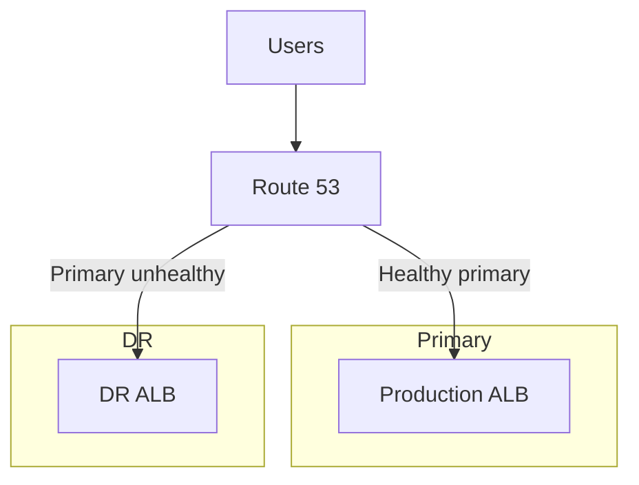

The architecture should include:

```text
Route 53
   │
   ├── Primary health
   └── Secondary health

Primary Region
   ├── Application
   ├── Database
   ├── Cache
   └── Dependencies

Secondary Region
   ├── Application
   ├── Database
   ├── Cache
   └── Dependencies
```

### DR Requirements

A production DR design should explicitly define:

| Requirement | Question |
|---|---|
| RTO | How quickly must service recover? |
| RPO | How much data loss is acceptable? |
| Capacity | Can the secondary handle production load? |
| Data | How is state replicated? |
| Secrets | Are credentials available in the secondary? |
| Dependencies | Are downstream services available? |
| DNS | How quickly can traffic move? |
| Operations | Who triggers and validates failover? |

---

## Route 53 + ALB + ECS

A containerized application commonly looks like:

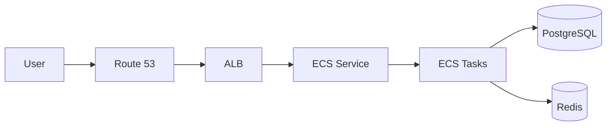

The responsibilities are:

```text
Route 53
  → Public DNS

ALB
  → HTTP routing and target health

ECS
  → Container scheduling

Application
  → Business logic

PostgreSQL
  → Persistent state

Redis
  → Cache / ephemeral state
```

This architecture is often preferable to exposing ECS tasks directly to the internet.

---

## Route 53 + Kubernetes

For an EKS-based architecture:

```text
Internet
   │
   ▼
Route 53
   │
   ▼
ALB / NLB
   │
   ▼
Kubernetes Ingress
   │
   ▼
Service
   │
   ▼
Pods
```

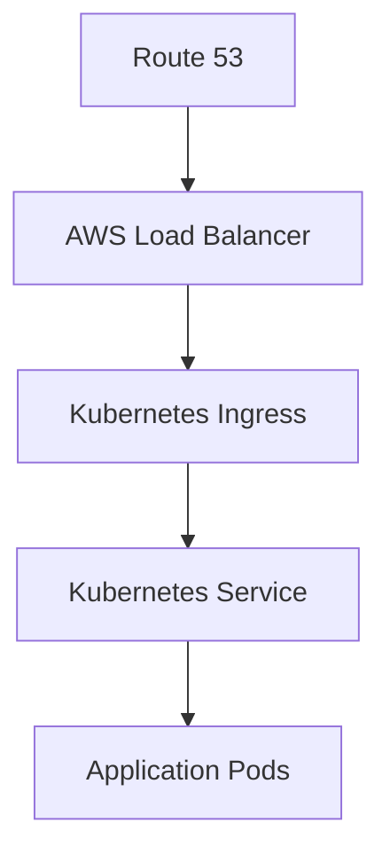

Kubernetes handles pod-level service discovery internally.

Therefore, Route 53 should generally remain focused on the external DNS boundary rather than replacing Kubernetes service discovery.

---

## Route 53 + Nginx

An architecture may also include Nginx:

```text
Route 53
   │
   ▼
ALB
   │
   ▼
Nginx
   │
   ▼
FastAPI / Django
```

Nginx may provide:

- Reverse proxying
- Request buffering
- Header manipulation
- Static file serving
- Local traffic routing

But adding Nginx does not automatically improve the architecture.

Each additional proxy introduces:

- Configuration
- Latency
- Failure modes
- Operational complexity

Use it when it solves a concrete requirement.

---

## Hybrid AWS and On-Premises Architecture

Route 53 Resolver becomes important when an organization has both AWS and on-premises infrastructure.

A typical architecture is:

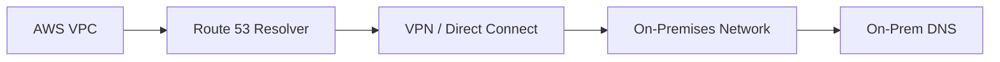

Common requirements include:

```text
AWS → resolve internal.onprem.example.com
```

and:

```text
On-premises → resolve internal.aws.example.com
```

Route 53 Resolver forwarding rules can support these hybrid DNS patterns.

This is fundamentally different from public hosted-zone routing.

---

## Private Hosted Zones

Private hosted zones are useful for internal AWS naming:

```text
internal.example.com
```

For example:

```text
orders.internal.example.com
payments.internal.example.com
users.internal.example.com
```

A typical architecture is:

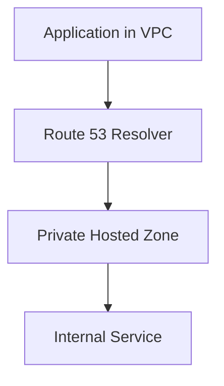

This allows internal service names to remain private.

A production architecture should carefully separate:

```text
Public DNS
```

from:

```text
Private DNS
```

to avoid accidental exposure and naming conflicts.

---

## Multi-Account Architecture

Large organizations commonly use multiple AWS accounts.

For example:

```text
AWS Organization
│
├── Production Account
├── Staging Account
├── Development Account
├── Security Account
└── Networking Account
```

A centralized DNS architecture might look like:

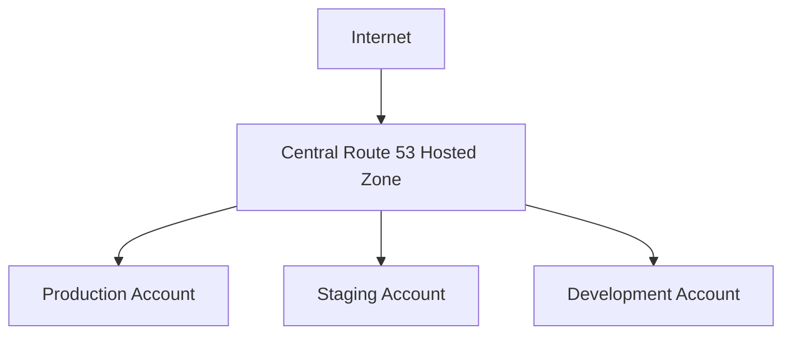

The exact ownership model depends on the organization's networking strategy.

Common approaches include:

- Centralized DNS account
- Application-owned hosted zones
- Delegated subdomains
- Shared networking services

A senior engineer should consider ownership and change control as part of DNS architecture.

---

## DNS Delegation Architecture

A useful multi-account pattern is:

```text
example.com
    │
    ├── api.example.com
    ├── app.example.com
    └── internal.example.com
```

The parent domain can delegate subdomains to independently managed hosted zones.

For example:

```text
example.com
     │
     └── api.example.com
             │
             ▼
      Production DNS Account
```

This allows different teams to manage their own DNS boundaries without giving every team control over the entire domain.

---

## Route 53 + WAF + CloudFront

A security-focused public application can use:

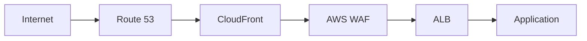

The layers have different responsibilities:

| Layer | Responsibility |
|---|---|
| Route 53 | DNS |
| CloudFront | Edge delivery |
| WAF | HTTP request filtering |
| ALB | Load balancing |
| Application | Business logic |

Route 53 should not be treated as a replacement for WAF or application security controls.

---

## Global API Architecture

A mature global API may combine multiple services:

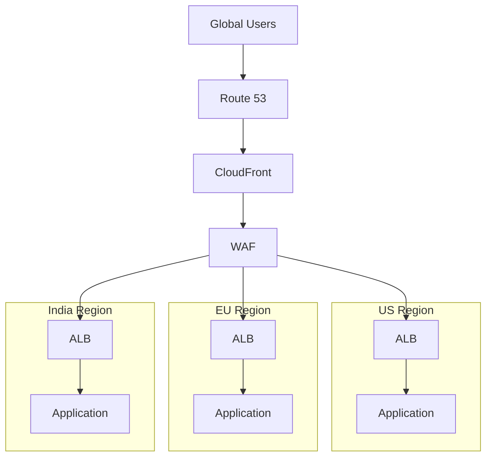

This architecture can provide:

- Global edge connectivity
- Regional application capacity
- Regional traffic steering
- WAF protection
- Multi-Region availability

But the data layer remains the hardest part.

---

## Global State Architecture

Suppose the application uses:

```text
Django
PostgreSQL
Redis
Kafka
```

across multiple Regions.

A possible architecture is:

```text
                  Route 53
                 /        \
                ▼          ▼
             Region A    Region B
                │          │
             Django      Django
                │          │
             Redis       Redis
                │          │
             Kafka       Kafka
                │          │
             DB A        DB B
```

This creates distributed-state questions:

- Is Redis local or globally replicated?
- Is Kafka replicated across Regions?
- Which database accepts writes?
- How are duplicate events handled?
- How are conflicts resolved?
- What happens during network partition?
- Can both Regions safely process the same command?

Route 53 cannot answer these questions.

The DNS layer should therefore be designed **after** the application's state and failure model are understood.

---

## Event-Driven Multi-Region Architecture

A backend using Kafka or another event platform may separate user traffic from asynchronous processing:

```mermaid
flowchart TB
    User[Client]
    DNS[Route 53]
    API[Regional API]
    DB[(Database)]
    Queue[Kafka / Event Stream]
    Worker[Celery / Consumers]

    User --> DNS
    DNS --> API
    API --> DB
    API --> Queue
    Queue --> Worker
```

If the application becomes Multi-Region, event processing must also be considered.

Failing over HTTP traffic while leaving asynchronous processing in the failed Region can create:

- Duplicate processing
- Missing events
- Stuck jobs
- Inconsistent state
- Consumer lag

Therefore, Route 53 failover should be tested together with asynchronous workloads.

---

## Health-Check Architecture

Health checks should operate at the correct failure boundary.

For a Regional ALB:

```text
Route 53
    │
    ▼
ALB
    │
    ├── Healthy target
    ├── Healthy target
    └── Unhealthy target
```

The ALB already performs target health evaluation.

Route 53 can therefore evaluate the regional endpoint rather than every application instance.

A stronger regional design is:

```text
Route 53
    │
    ▼
Regional ALB
    │
    ▼
Application readiness endpoint
```

This avoids exposing individual compute instances to public DNS.

---

## Health Check Anti-Pattern

Avoid this:

```mermaid
flowchart TB
    R53[Route 53]
    I1[Instance 1]
    I2[Instance 2]
    I3[Instance 3]

    R53 --> I1
    R53 --> I2
    R53 --> I3
```

when an ALB already exists.

This creates unnecessary DNS-level complexity.

Prefer:

```mermaid
flowchart TB
    R53[Route 53]
    ALB[ALB]
    Targets[Healthy Application Targets]

    R53 --> ALB
    ALB --> Targets
```

The ALB handles target-level health and distribution.

---

## Production Architecture Decision Matrix

| Requirement | Recommended pattern |
|---|---|
| One Region, standard API | Route 53 → ALB |
| Static website | Route 53 → CloudFront → S3 |
| CDN-backed API | Route 53 → CloudFront → ALB/API Gateway |
| Serverless API | Route 53 → API Gateway → Lambda |
| Multi-AZ application | Route 53 → Regional ALB |
| Regional DR | Route 53 Failover |
| Global active-active | Latency-based routing |
| Controlled DNS traffic split | Weighted routing |
| Geographic routing | Geolocation |
| Geographic resource balancing | Geoproximity |
| Hybrid DNS | Route 53 Resolver |
| Internal AWS naming | Private Hosted Zone |
| Kubernetes application | Route 53 → ALB/NLB → Kubernetes |
| Multi-account DNS | Centralized/delegated DNS |

---

## Choosing the Routing Strategy

The routing policy should follow the business requirement.

```text
Need primary/secondary?
        │
        └── Failover

Need approximate traffic percentage?
        │
        └── Weighted

Need lowest-latency Region?
        │
        └── Latency-based

Need geographic policy?
        │
        └── Geolocation

Need geographic proximity + bias?
        │
        └── Geoproximity

Need multiple healthy answers?
        │
        └── Multivalue answer
```

Do not select a routing policy simply because it sounds more advanced.

Choose the policy that matches the desired traffic decision.

---

## Combining Routing Policies

Complex architectures can combine Route 53 policies using records with the same DNS name but different routing characteristics.

A conceptual architecture might be:

```text
api.example.com
       │
       ▼
Latency-based routing
       │
       ├── US
       │    │
       │    ▼
       │  Weighted
       │    ├── Version A
       │    └── Version B
       │
       └── Europe
            │
            ▼
          Weighted
             ├── Version A
             └── Version B
```

This can support:

- Regional routing
- Canary releases
- Regional health evaluation
- Gradual migration

However, every additional routing layer increases the difficulty of:

- Reasoning about DNS answers
- Testing
- Incident response
- Documentation
- Rollback

Complexity should be treated as an operational cost.

---

## Production Deployment Architecture

DNS changes should normally be part of a controlled deployment pipeline.

A mature workflow is:

```mermaid
flowchart LR
    Developer[Developer]
    Git[Git Repository]
    CI[CI/CD]
    IaC[Terraform / CloudFormation]
    Review[Approval]
    R53[Route 53]

    Developer --> Git
    Git --> CI
    CI --> IaC
    IaC --> Review
    Review --> R53
```

For example:

```bash
terraform plan
```

should be reviewed before:

```bash
terraform apply
```

DNS changes deserve the same change-management discipline as:

- Database migrations
- Security-group changes
- Load-balancer changes
- IAM policies

because a single incorrect DNS record can redirect production traffic.

---

## DNS Deployment Safety

Before changing a production routing policy:

```text
1. Validate record configuration
2. Validate target health
3. Verify target capacity
4. Verify certificates
5. Verify application readiness
6. Verify monitoring
7. Plan rollback
8. Apply change
9. Verify DNS externally
10. Verify application traffic
```

Never assume that a successful infrastructure deployment means the traffic path is correct.

Validate from outside the AWS account and, when relevant, from multiple geographic locations.

---

## Disaster Recovery Runbook

A production DR runbook might look like:

```text
Detect incident
      │
      ▼
Confirm primary failure
      │
      ▼
Validate secondary health
      │
      ▼
Validate secondary capacity
      │
      ▼
Validate database state
      │
      ▼
Initiate DNS failover
      │
      ▼
Verify DNS responses
      │
      ▼
Verify application traffic
      │
      ▼
Monitor secondary
      │
      ▼
Recover primary
      │
      ▼
Plan controlled failback
```

The important point is that failover should not blindly depend on DNS health alone when data integrity is involved.

---

## Failback Architecture

Failback is often more dangerous than failover.

Suppose:

```text
Primary Region failed
        │
        ▼
Secondary Region active
```

The primary is repaired.

It is tempting to immediately change DNS back:

```text
Secondary
    ↓
Primary
```

But the primary may contain stale data.

A safer sequence is:

```text
Primary recovered
      │
      ▼
Synchronize / validate data
      │
      ▼
Validate application
      │
      ▼
Validate capacity
      │
      ▼
Controlled traffic migration
      │
      ▼
Primary restored
```

Failback must therefore be explicitly designed and tested.

---

## Cost Considerations

Route 53 architecture affects more than DNS costs.

For example:

### Active-Passive

```text
Primary Region
  Full capacity

Secondary Region
  Reduced capacity
```

Lower infrastructure cost, but potentially slower recovery.

### Active-Active

```text
Primary Region
  Production capacity

Secondary Region
  Production capacity
```

Higher cost, but both environments are continuously exercised.

The engineering decision should consider:

```text
Infrastructure cost
+
Operational cost
+
Downtime cost
+
Data-loss cost
+
Recovery requirements
```

A cheaper architecture is not necessarily cheaper for the business.

---

## Reliability Principles

A robust Route 53 architecture follows several principles.

### Separate Failure Domains

Avoid:

```text
Route 53
   ↓
One Region
   ↓
One AZ
   ↓
One instance
```

Prefer:

```text
Route 53
   ↓
Multi-AZ endpoint
```

and, when required:

```text
Route 53
   ↓
Multi-Region architecture
```

### Use the Lowest Appropriate Failure Boundary

```text
Instance failure
    → ALB / Kubernetes

AZ failure
    → Multi-AZ architecture

Region failure
    → Route 53 / Multi-Region

Data failure
    → Database architecture

Dependency failure
    → Application resilience
```

This layered approach prevents a single system from becoming responsible for every failure type.

---

## Security Architecture

A production Route 53 architecture should also include:

```mermaid
flowchart TB
    User[Internet]
    R53[Route 53]
    CF[CloudFront]
    WAF[WAF]
    ALB[ALB]
    App[Application]

    User --> R53
    R53 --> CF
    CF --> WAF
    WAF --> ALB
    ALB --> App
```

Security responsibilities:

| Layer | Security concern |
|---|---|
| Route 53 | DNS control and domain integrity |
| CloudFront | Edge security and TLS |
| WAF | HTTP filtering |
| ALB | Network/application entry point |
| Application | Authentication and authorization |
| Database | Data protection |

DNS routing does not replace:

- Authentication
- Authorization
- WAF
- TLS
- Network controls
- Application security

---

## Monitoring a Real-World Architecture

A production monitoring strategy should follow the complete request path:

```text
DNS
 ↓
Edge
 ↓
Load Balancer
 ↓
Application
 ↓
Cache
 ↓
Database
 ↓
External Dependencies
```

Monitor:

| Layer | Important signals |
|---|---|
| Route 53 | Health status, record changes |
| CloudFront | Cache hit ratio, errors, origin latency |
| ALB | 4xx, 5xx, target health, latency |
| ECS/EKS | CPU, memory, task/pod health |
| Django/FastAPI | Request rate, errors, latency |
| Redis | Memory, evictions, latency |
| PostgreSQL | Connections, latency, replication |
| Kafka | Consumer lag, broker health |
| Client | DNS failures, connection failures |

This allows engineers to distinguish:

```text
DNS problem
```

from:

```text
Application problem
```

from:

```text
Data problem
```

during incidents.

---

## Common Production Mistakes

### Using DNS for Instance-Level Load Balancing

DNS is not a replacement for an ALB.

Use:

```text
Route 53 → ALB → Targets
```

instead of maintaining individual instance DNS records.

### Assuming DNS Failover Is Instant

DNS caching introduces delay.

Design RTOs around the entire system rather than Route 53 configuration alone.

### Treating Active-Passive as Automatically Reliable

A standby environment that is never exercised can drift.

Use:

- Regular DR tests
- Automated deployments
- Infrastructure as code
- Dependency validation
- Capacity validation

### Ignoring Database State

A secondary application is useless if it cannot safely access required data.

### Overusing Complex Routing Trees

Complex DNS configurations can become difficult to debug.

Prefer the simplest routing policy that satisfies the requirement.

### Forgetting Client-Side DNS Caching

Long-running processes can cache DNS results independently of Route 53 TTL behavior.

### Using Health Checks That Are Too Aggressive

An overly sensitive health check can cause unnecessary failovers.

### Using Health Checks That Are Too Shallow

A simple `200 OK` may not prove that the application can process production traffic.

### Assuming Geographic Routing Means Data Residency

Traffic location and data location are different architectural concerns.

### Failing to Test Failback

Recovery of the original Region does not mean it is immediately safe to receive production traffic.

---

## Architecture Selection Guide

Use this decision process:

```text
Start
  │
  ▼
Is the application single-region?
  │
  ├── Yes → Route 53 → ALB / CloudFront / API Gateway
  │
  └── No
       │
       ▼
Need disaster recovery?
       │
       ├── Yes → Failover routing
       │
       └── No
            │
            ▼
Need all Regions serving traffic?
            │
            ├── Yes → Latency / weighted / other routing
            │
            └── No
                 │
                 ▼
Need geographic control?
                 │
                 ├── Yes → Geolocation / Geoproximity
                 │
                 └── No → Re-evaluate routing requirement
```

The architecture should be driven by:

- Availability requirements
- Latency requirements
- Data architecture
- Regulatory requirements
- Cost constraints
- Operational maturity
- Deployment strategy

---

## Senior Engineering Design Principles

### DNS Is a Control Plane

Route 53 should generally be viewed as a **traffic-control mechanism** rather than an application runtime.

It decides:

```text
Where should a new DNS resolution point?
```

It does not decide:

```text
How should every HTTP request be processed?
```

### Failure Boundaries Matter

A good architecture aligns each technology with the failure domain it can handle effectively:

```text
Route 53
  → Global / Regional routing

CloudFront
  → Edge delivery

ALB
  → Target distribution

Kubernetes / ECS
  → Compute scheduling

Application
  → Business and dependency resilience

Database
  → State durability and recovery
```

### DNS Is Part of DR, Not the Whole DR System

A complete DR design requires:

```text
DNS
+
Compute
+
Data
+
Dependencies
+
Secrets
+
Observability
+
Runbooks
+
Testing
```

### Simplicity Is a Reliability Feature

If two routing policies satisfy the same requirement, prefer the simpler one.

Every additional routing layer creates more:

- Configuration
- Failure modes
- Testing requirements
- Incident-response complexity

---

## Key Takeaways

- Route 53 should be treated as a DNS and traffic-steering control plane within a larger architecture.
- A common production architecture is `Route 53 → ALB → Application`.
- Multi-AZ availability is usually handled by the load balancer and compute architecture, not by DNS.
- Route 53 is particularly valuable for Multi-Region traffic steering and disaster recovery.
- Active-passive architectures use a primary and secondary environment.
- Active-active architectures allow multiple Regions to serve production traffic.
- CloudFront commonly sits between Route 53 and S3, ALB, or API Gateway.
- API Gateway and Lambda can provide a serverless Route 53 target architecture.
- Kubernetes and ECS should handle compute-level availability while Route 53 handles broader DNS decisions.
- Weighted routing can support canary and blue/green strategies, but DNS weighting is not precise request-level traffic splitting.
- Latency-based routing is useful for global applications but does not guarantee the lowest application response time for every individual user.
- Geolocation and geoproximity routing solve different geographic traffic-steering problems.
- Private hosted zones and Route 53 Resolver are important for internal and hybrid architectures.
- Multi-Region DNS routing does not solve distributed database consistency, replication, or data residency by itself.
- Health checks must represent meaningful service availability without creating cascading failures.
- Existing HTTP, TCP, gRPC, and WebSocket connections do not automatically migrate because a DNS answer changes.
- DNS TTL and resolver caching must be included in availability and RTO calculations.
- Disaster recovery requires more than changing a DNS record.
- Failback must be designed and tested separately from failover.
- DNS architecture should follow the application's data and failure model rather than being designed in isolation.
- The strongest production designs use layered failure handling:

```text
Route 53
   ↓
Global / Regional traffic steering
   ↓
CloudFront / ALB / API Gateway
   ↓
Compute platform
   ↓
Application
   ↓
Cache / Messaging
   ↓
Database
```

The central architectural principle is:

```text
Use Route 53 to decide
WHERE traffic should go.

Use load balancers and compute platforms to decide
WHICH healthy target should receive it.

Use the application to handle
BUSINESS and dependency failures.

Use the data layer to handle
STATE, replication, and recovery.

Use operations and observability to verify
that the complete system actually survives failure.
```