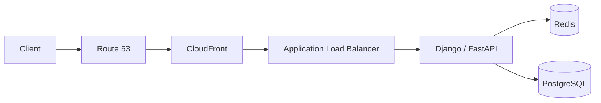
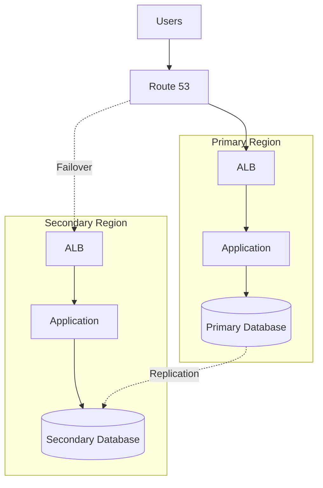

# README

## Overview

This folder contains senior-level engineering notes for **Amazon Route 53**, focused on how DNS works as a production traffic-management and service-discovery layer.

The documentation moves from Route 53 fundamentals through routing policies, health checks, domain management, Resolver, DNS caching, and integration with common AWS application architectures.

The emphasis is not on memorizing Route 53 features. The goal is to understand **how DNS decisions affect backend architecture, availability, latency, deployments, disaster recovery, and production operations**.

---

## What Route 53 Is Responsible For

Route 53 primarily provides:

- Public and private DNS
- Domain registration
- Hosted zones
- DNS record management
- Health checks
- DNS-based traffic routing
- Domain-level failover
- Integration with AWS services
- Private DNS through private hosted zones
- Hybrid DNS through Route 53 Resolver

A useful mental model is:

```text
Client
  │
  ▼
DNS Resolver
  │
  ▼
Route 53
  │
  ├── CloudFront
  ├── ALB / ELB
  ├── API Gateway
  ├── S3
  ├── Regional endpoint
  └── DR endpoint
```

Route 53 determines **where a DNS query should resolve**.

It does not replace:

- Load balancers
- Application health mechanisms
- WAF
- Service discovery inside Kubernetes
- Database replication
- Application-level resilience
- Distributed-system coordination

---

## Folder Structure

```text
Route 53/
│
├── concepts/
│   └── 01- Route 53/
│       ├── 01- Route 53 Fundamentals.md
│       ├── 02- Hosted Zones.md
│       ├── 03- DNS Records.md
│       ├── 04- Record Types.md
│       ├── 05- Alias Records.md
│       ├── 06- Routing Policies.md
│       ├── 07- Simple Routing.md
│       ├── 08- Weighted Routing.md
│       ├── 09- Latency-Based Routing.md
│       ├── 10- Failover Routing.md
│       ├── 11- Geolocation Routing.md
│       ├── 12- Health Checks.md
│       ├── 13- Domain Registration.md
│       ├── 14- Route 53 Resolver.md
│       ├── 15- TTL and DNS Caching.md
│       ├── 16- Route 53 with S3.md
│       ├── 17- Route 53 with CloudFront.md
│       ├── 18- Route 53 with ELB and ALB.md
│       ├── 19- Route 53 with API Gateway and Lambda.md
│       └── 20- Advantages and Limitations.md
│
└── architecture/
    └── 01- Route 53/
        ├── 01- Route 53 Architecture.md
        ├── 02- DNS Failover Architecture.md
        ├── 03- Real-World Architectures.md
        └── README.md
```

---

## Documentation Navigation

### Architecture

| File | Focus |
|---|---|
| [01- Route 53 Architecture](../architecture/01-%20Route%2053/01-%20Route%2053%20Architecture.md) | Core production architecture patterns |
| [02- DNS Failover Architecture](../architecture/01-%20Route%2053/02-%20DNS%20Failover%20Architecture.md) | Regional and endpoint failover |
| [03- Real-World Architectures](../architecture/01-%20Route%2053/03-%20Real-World%20Architectures.md) | Production AWS and backend architectures |

---

## Recommended Reading Order

The concepts should generally be studied in this order:

```text
DNS Fundamentals
      │
      ▼
Hosted Zones
      │
      ▼
DNS Records
      │
      ▼
Record Types
      │
      ▼
Alias Records
      │
      ▼
Routing Policies
      │
      ├── Simple
      ├── Weighted
      ├── Latency
      ├── Failover
      └── Geolocation
      │
      ▼
Health Checks
      │
      ▼
TTL and DNS Caching
      │
      ▼
Domain Registration
      │
      ▼
Route 53 Resolver
      │
      ▼
AWS Service Integrations
      │
      ├── S3
      ├── CloudFront
      ├── ALB / ELB
      └── API Gateway + Lambda
      │
      ▼
Production Architecture
      │
      ├── Multi-AZ
      ├── Multi-Region
      ├── Disaster Recovery
      ├── Canary / Blue-Green
      └── Hybrid DNS
```

---

## Core Mental Model

A senior backend engineer should understand Route 53 through several distinct layers.

### DNS Resolution

```text
Application
    │
    ▼
Operating System Resolver
    │
    ▼
Recursive DNS Resolver
    │
    ▼
Authoritative DNS
    │
    ▼
DNS Answer
```

Route 53 commonly operates as the authoritative DNS service for domains hosted in its hosted zones.

---

### Traffic Steering

The routing policy determines which answer Route 53 returns.

```text
DNS Query
   │
   ▼
Route 53
   │
   ├── Simple
   ├── Weighted
   ├── Latency
   ├── Failover
   ├── Geolocation
   └── Other routing policies
   │
   ▼
DNS Answer
```

The resulting answer is then cached according to DNS caching behavior.

---

### Application Traffic

DNS resolution is only the beginning of the request path.

```text
Client
  │
  ▼
DNS Resolution
  │
  ▼
Route 53
  │
  ▼
CloudFront / ALB / API Gateway
  │
  ▼
Application
  │
  ├── Redis
  ├── PostgreSQL
  ├── Kafka
  └── External Services
```

This distinction is critical during production troubleshooting.

A successful DNS lookup does **not** prove that the application is healthy.

---

## Route 53 and Backend Architecture

A common backend architecture is:



Each component has a different responsibility:

| Component | Responsibility |
|---|---|
| Route 53 | DNS and traffic steering |
| CloudFront | Edge delivery and caching |
| ALB | HTTP load balancing |
| Django / FastAPI | Application logic |
| Redis | Cache / ephemeral state |
| PostgreSQL | Durable application state |

This separation of responsibilities is an important production design principle.

---

## Route 53 Routing Policies

The major routing decisions can be viewed as:

| Requirement | Routing approach |
|---|---|
| Basic DNS answer | Simple |
| Approximate traffic distribution | Weighted |
| Lowest AWS Region latency | Latency-based |
| Primary/secondary DR | Failover |
| Geographic control | Geolocation |
| Geographic proximity with bias | Geoproximity |
| Multiple healthy answers | Multivalue answer |

The correct routing policy depends on the business and failure requirements.

Do not choose a policy simply because it appears more sophisticated.

---

## Route 53 and High Availability

Route 53 is one layer of a highly available architecture.

A typical progression is:

```text
Single Instance
    ↓
Multiple Instances
    ↓
Multi-AZ
    ↓
Regional Load Balancer
    ↓
Multi-Region
    ↓
DNS-Based Regional Failover
```

Each layer addresses a different failure domain.

| Failure | Typical mechanism |
|---|---|
| Instance failure | ALB / ECS / Kubernetes |
| Container failure | ECS / Kubernetes |
| Availability Zone failure | Multi-AZ architecture |
| Regional failure | Multi-Region architecture + Route 53 |
| Database failure | Database HA / replication / backup |
| Dependency failure | Application resilience |
| DNS failure | DNS architecture and external validation |

Route 53 should not be expected to solve every failure mode.

---

## Route 53 and Disaster Recovery

A typical active-passive DR architecture is:



A real DR design must also address:

- RTO
- RPO
- Database replication
- Application capacity
- Secrets
- External dependencies
- Monitoring
- Runbooks
- Failover testing
- Failback

Changing DNS alone does not constitute disaster recovery.

---

## Route 53 and Deployment Strategies

DNS can participate in controlled deployment strategies.

### Weighted Deployment

```text
Version A → 95%
Version B → 5%
```

Useful for:

- Canary deployments
- Gradual migrations
- Infrastructure transitions

However, DNS weighting is not equivalent to exact request-level traffic splitting because recursive resolvers and clients cache DNS responses.

For precise request-level control, application or load-balancer-level routing may be more appropriate.

---

### Blue/Green Deployment

```text
Route 53
   │
   ├── Blue Environment
   └── Green Environment
```

Traffic can gradually move between environments.

The important limitation is that DNS changes are subject to caching behavior.

For rapid rollback requirements, consider whether ALB-level or application-level traffic switching provides better operational control.

---

## Route 53 and Security

Route 53 is part of the public application boundary but is not itself an application security layer.

A production architecture may look like:

```text
Internet
   │
   ▼
Route 53
   │
   ▼
CloudFront
   │
   ▼
AWS WAF
   │
   ▼
ALB
   │
   ▼
Application
```

Security responsibilities should remain separated:

| Layer | Primary concern |
|---|---|
| Route 53 | DNS/domain control |
| CloudFront | Edge/TLS |
| WAF | HTTP filtering |
| ALB | Application entry point |
| Application | Authentication/authorization |
| Database | Data protection |

Route 53 does not replace authentication, authorization, WAF, TLS, or network security.

---

## Route 53 and Private DNS

Private hosted zones allow internal service names to remain inside AWS VPCs.

Example:

```text
orders.internal.example.com
payments.internal.example.com
users.internal.example.com
```

A backend service can therefore communicate using stable internal names rather than hard-coded IP addresses.

This is particularly useful for:

- Microservices
- Internal APIs
- Private infrastructure
- Multi-account AWS environments

---

## Route 53 Resolver and Hybrid Networking

Route 53 Resolver becomes important when AWS and on-premises environments need DNS integration.

Conceptually:

```text
AWS VPC
   │
   ▼
Route 53 Resolver
   │
   ▼
VPN / Direct Connect
   │
   ▼
On-Premises DNS
```

This enables architectures where:

```text
AWS → resolve on-premises names
```

and:

```text
On-premises → resolve AWS private names
```

Hybrid DNS should be treated as part of the overall network architecture rather than as an isolated DNS configuration.

---

## Operational Concerns

Production Route 53 management should include:

- Infrastructure as code
- Change review
- DNS record validation
- Monitoring
- Health-check validation
- External DNS testing
- Documented rollback procedures
- DR exercises

Typical tools include:

```bash
aws route53 list-hosted-zones
```

```bash
aws route53 list-resource-record-sets \
  --hosted-zone-id Z1234567890
```

DNS behavior should also be validated from outside the AWS environment.

For example:

```bash
dig api.example.com
```

or:

```bash
nslookup api.example.com
```

The goal is to verify the actual DNS resolution path rather than relying only on AWS console configuration.

---

## Infrastructure as Code

Production DNS should generally be managed through infrastructure as code.

A simplified Terraform example:

```hcl
resource "aws_route53_record" "api" {
  zone_id = aws_route53_zone.main.zone_id
  name    = "api.example.com"
  type    = "A"

  alias {
    name                   = aws_lb.api.dns_name
    zone_id                = aws_lb.api.zone_id
    evaluate_target_health = true
  }
}
```

Infrastructure as code provides:

- Reviewable changes
- Repeatability
- Version history
- Environment consistency
- Safer rollback
- Automated deployment

DNS changes should receive the same engineering discipline as database and infrastructure changes.

---

## Production Troubleshooting Model

When an application is unreachable, troubleshoot from the outside inward:

```text
DNS
 ↓
TLS
 ↓
CloudFront / ALB / API Gateway
 ↓
Network
 ↓
Application
 ↓
Cache / Queue
 ↓
Database
 ↓
External Dependencies
```

Useful commands include:

```bash
dig api.example.com
```

```bash
dig +trace api.example.com
```

```bash
nslookup api.example.com
```

Then validate the resolved endpoint:

```bash
curl -I https://api.example.com
```

This avoids incorrectly diagnosing an application outage as a DNS outage.

---

## Common Production Pitfalls

### Treating DNS Changes as Instant

DNS responses can be cached by recursive resolvers and clients.

### Using DNS as a Load Balancer

Use ALB/NLB or another appropriate load-balancing mechanism for target-level distribution.

### Ignoring TTL During Deployments

TTL affects how quickly DNS changes become visible to clients.

### Assuming Health Checks Represent Complete Application Health

A health check should represent meaningful availability without depending unnecessarily on fragile downstream systems.

### Designing DR Without Testing It

An untested DR environment should not be considered production-ready.

### Ignoring Data Dependencies

Failing over HTTP traffic without handling database state can create corruption or inconsistent behavior.

### Overcomplicating Routing

Complex routing policies increase operational complexity and incident-debugging difficulty.

### Forgetting Private DNS Boundaries

Public and private DNS namespaces should be designed intentionally.

### Assuming DNS Controls Existing Connections

DNS changes affect future resolution. Existing TCP/TLS/HTTP connections are not automatically redirected.

---

## Engineering Checklist

Before considering a Route 53 architecture production-ready, verify:

### DNS

- [ ] Domain ownership is controlled securely.
- [ ] Hosted zones are intentionally structured.
- [ ] Record types are appropriate.
- [ ] Alias records are used where appropriate.
- [ ] TTLs match operational requirements.

### Routing

- [ ] Routing policy matches the business requirement.
- [ ] Health evaluation is correctly configured.
- [ ] Failover behavior is understood.
- [ ] Weighted routing is not being mistaken for exact request splitting.

### Availability

- [ ] Application runs across multiple Availability Zones where required.
- [ ] Load balancer health checks are configured.
- [ ] Regional failure strategy is documented.
- [ ] DR environments are tested.

### Security

- [ ] Domain and DNS management access is restricted.
- [ ] DNS changes are auditable.
- [ ] TLS is correctly configured.
- [ ] WAF and application security controls are in place where required.

### Operations

- [ ] DNS is managed through infrastructure as code where appropriate.
- [ ] DNS changes go through review.
- [ ] Monitoring exists for critical endpoints.
- [ ] External DNS resolution can be tested.
- [ ] Failover and failback procedures are documented.

---

## Key Architectural Principles

The most important Route 53 principles are:

```text
Route 53
    ↓
Global / DNS-level traffic steering

Load Balancer
    ↓
Target-level traffic distribution

Compute Platform
    ↓
Application capacity and scheduling

Application
    ↓
Business logic and dependency resilience

Data Layer
    ↓
State, consistency, replication, recovery
```

A senior backend engineer should always ask:

1. What failure domain am I solving?
2. Should DNS handle this decision?
3. Should a load balancer handle it instead?
4. What happens when the selected endpoint fails?
5. How quickly can clients observe the new DNS answer?
6. What happens to existing connections?
7. Where does application state live?
8. Can the secondary environment actually handle production traffic?
9. How is database state recovered?
10. How will the architecture be tested during an actual incident?

The strongest Route 53 architectures are not the ones with the most routing policies. They are the ones where DNS, networking, compute, application, and data responsibilities are clearly separated and the resulting failure behavior is predictable.

---

## Key Takeaways

- Route 53 is a DNS and traffic-steering control plane.
- Hosted zones provide the authoritative DNS boundary for domains.
- Routing policies determine how Route 53 selects DNS answers.
- TTL and recursive DNS caching directly affect traffic migration and failover behavior.
- Route 53 commonly integrates with CloudFront, ALB, API Gateway, S3, and Multi-Region architectures.
- Load balancers should normally handle instance or container-level traffic distribution.
- Multi-AZ availability and Multi-Region availability are different architectural concerns.
- Failover routing can support disaster recovery, but DNS is only one component of DR.
- Weighted routing is useful for controlled DNS-level traffic distribution and deployment strategies.
- Latency-based routing is useful for global applications where regional latency matters.
- Geolocation and geoproximity routing address different geographic routing requirements.
- Private hosted zones provide internal DNS within AWS networking boundaries.
- Route 53 Resolver supports AWS and on-premises DNS integration.
- DNS does not solve distributed database consistency, replication, or data residency.
- DNS changes do not automatically move existing application connections.
- Production DNS should be managed, reviewed, monitored, and tested like other critical infrastructure.
- Infrastructure as code provides safer and more repeatable DNS management.
- Disaster recovery must include compute, data, dependencies, secrets, observability, runbooks, and testing.
- The correct Route 53 design follows the application's failure model rather than the feature list of the DNS service.