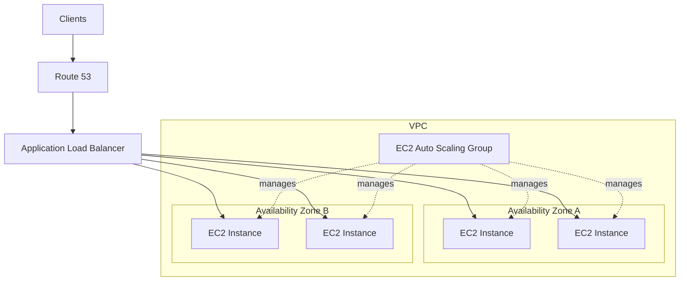
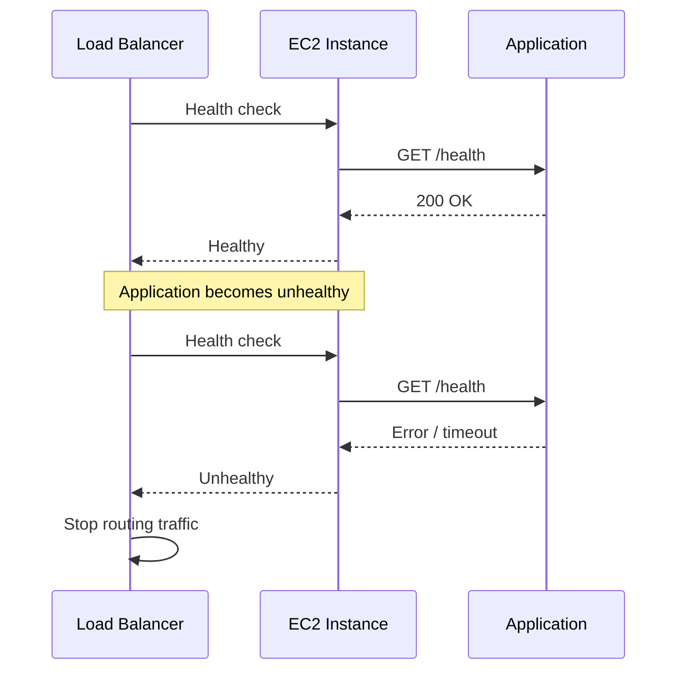

# 02- High Availability Architecture

## Overview

High availability in AWS Elastic Beanstalk is the ability to keep an application serving requests despite failures of individual EC2 instances, infrastructure components, or an Availability Zone.

For production workloads, Elastic Beanstalk provides a load-balanced, scalable environment that uses Elastic Load Balancing and Amazon EC2 Auto Scaling. AWS recommends distributing application instances across multiple Availability Zones and maintaining sufficient capacity so that the application can continue operating if an Availability Zone becomes unavailable. :contentReference[oaicite:0]{index=0}

A highly available Elastic Beanstalk architecture is therefore not simply:

```text
Elastic Beanstalk
    ↓
Multiple EC2 Instances
```

It is a coordinated architecture involving:

```text
Route 53
    ↓
Load Balancer
    ↓
Auto Scaling Group
    ↓
EC2 Instances across multiple AZs
    ↓
Highly available application dependencies
```

The most important principle is:

> High availability is an architectural property of the entire system, not a setting applied to Elastic Beanstalk alone.

## Why High Availability Matters

A single EC2 instance creates a single point of failure.

```text
Client
  │
  ▼
EC2
  │
  ▼
Application
```

If the instance fails, the application becomes unavailable.

A load-balanced environment removes this dependency on a single instance:

```text
             Load Balancer
             /           \
            ▼             ▼
         EC2-A           EC2-B
            │             │
            └──────┬──────┘
                   ▼
              Application
```

However, two instances in the same Availability Zone still leave an Availability Zone as a shared failure domain.

A stronger architecture distributes the instances:

```text
                    Load Balancer
                   /             \
                  /               \
                 ▼                 ▼
              AZ-A               AZ-B
             EC2-A1             EC2-B1
             EC2-A2             EC2-B2
```

If AZ-A becomes unavailable, AZ-B can continue serving traffic.

## Elastic Beanstalk Environment Types

Elastic Beanstalk supports two primary environment types:

| Environment | Architecture | Typical Use |
|---|---|---|
| Single-instance | One EC2 instance | Development, testing, low-cost environments |
| Load-balanced, scalable | Load balancer + Auto Scaling + multiple EC2 instances | Production |

A single-instance environment does not provide meaningful high availability. AWS specifically recommends load-balanced environments for production workloads where high availability and scaling are required. :contentReference[oaicite:1]{index=1}

A production architecture should therefore generally start with:

```text
Environment Type
       │
       ▼
Load balanced
       │
       ├── Load Balancer
       └── Auto Scaling Group
```

## Core High Availability Architecture

A standard Elastic Beanstalk architecture can be represented as:



Elastic Beanstalk manages the environment while the underlying AWS services provide the mechanisms required for redundancy and scaling.

## Availability Zones

An Availability Zone is an isolated location within an AWS Region.

For high availability, application instances should be distributed across multiple Availability Zones.

For example:

```text
AWS Region
│
├── Availability Zone A
│      ├── EC2
│      └── EC2
│
└── Availability Zone B
       ├── EC2
       └── EC2
```

AWS recommends using at least two Availability Zones for production Elastic Beanstalk environments so that an application can remain available if one Availability Zone fails. :contentReference[oaicite:2]{index=2}

The important distinction is:

```text
Multiple Instances
        ≠
Multi-AZ
```

Multiple instances protect against instance-level failure.

Multiple Availability Zones protect against a larger failure domain.

## Multi-AZ Instance Distribution

Elastic Beanstalk's Auto Scaling configuration determines how many Availability Zones are used for the application instances.

For example:

```text
Minimum instances = 4
Maximum instances = 8
Availability Zones = 2
```

A healthy fleet might look like:

```text
AZ-A
 ├── EC2-1
 └── EC2-2

AZ-B
 ├── EC2-3
 └── EC2-4
```

If AZ-A becomes unavailable:

```text
Before failure:

AZ-A                    AZ-B
 ├── EC2-1              ├── EC2-3
 └── EC2-2              └── EC2-4


After AZ-A failure:

AZ-A                    AZ-B
 ├── FAILED             ├── EC2-3
 └── FAILED             └── EC2-4
```

The application may continue serving traffic from AZ-B, assuming the remaining capacity is sufficient.

AWS recommends maintaining N+1 capacity where appropriate so that the system can tolerate the loss of an Availability Zone without exhausting the remaining fleet. :contentReference[oaicite:3]{index=3}

## N+1 Capacity

N+1 means the application has enough capacity to continue operating after losing one unit of capacity.

For example, if an application requires four instances under normal load:

```text
Required capacity = 4
Failure tolerance = 1
Recommended capacity = 5
```

The architecture becomes:

```text
AZ-A
 ├── EC2
 ├── EC2
 └── EC2

AZ-B
 ├── EC2
 └── EC2
```

If AZ-A fails:

```text
AZ-A
 └── unavailable

AZ-B
 ├── EC2
 └── EC2
```

This may or may not be sufficient depending on the application's actual load.

Therefore, N+1 should be calculated against realistic peak demand rather than treating the number as a universal rule.

## Load Balancer High Availability

The load balancer is itself part of the availability architecture.

For a public application, the load balancer should use subnets in multiple Availability Zones.

```text
                 Internet
                    │
                    ▼
          Application Load Balancer
               /             \
              ▼               ▼
        ALB Node AZ-A     ALB Node AZ-B
              │               │
              ▼               ▼
           EC2 fleet       EC2 fleet
```

For an Application Load Balancer, AWS requires at least two Availability Zones. :contentReference[oaicite:4]{index=4}

This prevents the traffic entry point from becoming a single-AZ dependency.

## Health Checks

High availability depends on detecting unhealthy instances quickly.

The load balancer continuously evaluates target health and stops routing traffic to targets that fail its health checks. :contentReference[oaicite:5]{index=5}

A typical flow is:



A good health-check endpoint should be:

- Fast
- Deterministic
- Cheap to execute
- Available without unnecessary authentication
- Representative of application readiness

For a Django or FastAPI service:

```text
GET /health
```

might return:

```json
{
  "status": "healthy"
}
```

A more sophisticated readiness endpoint may verify critical dependencies, but dependency checks should be designed carefully.

If the endpoint performs expensive database or external-service operations on every health probe, the health-check mechanism itself can become a source of load.

## Health Checks vs Instance Replacement

There are multiple health signals in an Elastic Beanstalk architecture.

Conceptually:

```text
Application
     │
     ▼
Load Balancer Health
     │
     ▼
Elastic Beanstalk Health
     │
     ▼
Auto Scaling Instance Health
```

These mechanisms should not be treated as identical.

A target can fail a load balancer health check without automatically implying that every underlying Auto Scaling behavior will immediately replace the instance in exactly the way an engineer expects.

AWS documents separate Auto Scaling health-check configuration and Elastic Load Balancing health behavior. :contentReference[oaicite:6]{index=6}

Production engineers should therefore verify:

- Which health check is failing
- Whether the instance is still considered healthy by Auto Scaling
- Whether traffic has been removed
- Whether replacement is occurring
- Whether the application itself is failing repeatedly

## Auto Scaling and High Availability

Elastic Beanstalk environments include an EC2 Auto Scaling group.

In a load-balanced environment, the Auto Scaling group maintains a configured instance range and adds or removes instances according to scaling conditions. :contentReference[oaicite:7]{index=7}

The architecture is:

```text
                    Elastic Beanstalk
                           │
                           ▼
                    Auto Scaling Group
                           │
             ┌─────────────┼─────────────┐
             ▼             ▼             ▼
           EC2-A         EC2-B         EC2-C
```

Typical configuration:

```text
Minimum: 2
Desired: 2
Maximum: 6
```

During increased demand:

```text
2 Instances
     │
     ▼
High Load
     │
     ▼
Auto Scaling
     │
     ▼
4 Instances
```

During reduced demand:

```text
4 Instances
     │
     ▼
Lower Load
     │
     ▼
Scale In
     │
     ▼
2 Instances
```

The minimum capacity is important for high availability because scaling down to one instance eliminates redundancy.

## Scaling Metrics

Scaling should be based on workload characteristics.

Potential signals include:

| Metric | Useful When |
|---|---|
| CPU utilization | CPU-bound workloads |
| Request count | HTTP workloads |
| Latency | User-facing latency-sensitive APIs |
| Network traffic | Network-intensive applications |
| Disk I/O | Storage-intensive workloads |
| Application metrics | Workload-specific scaling |

Elastic Beanstalk supports CloudWatch-based Auto Scaling triggers, and AWS recommends choosing metrics appropriate to the application's workload rather than relying blindly on defaults. :contentReference[oaicite:8]{index=8}

For a Django API, for example, CPU alone may not accurately represent demand if requests spend most of their time waiting on a database.

A better design may combine:

```text
Request Rate
     +
Latency
     +
CPU
     +
Database Capacity
```

with application-specific thresholds.

## High Availability During Instance Failure

Consider three application instances:

```text
ALB
 │
 ├── EC2-A  Healthy
 ├── EC2-B  Healthy
 └── EC2-C  Healthy
```

If EC2-B fails:

```text
ALB
 │
 ├── EC2-A  Healthy
 ├── EC2-B  Unhealthy
 └── EC2-C  Healthy
```

The load balancer stops routing traffic to EC2-B.

Auto Scaling can then replace the failed instance:

```text
EC2-B Failure
     │
     ▼
Health Detection
     │
     ▼
Instance Replacement
     │
     ▼
New EC2 Instance
     │
     ▼
Health Check Passes
     │
     ▼
Traffic Eligible
```

This is the basic automated-recovery loop that makes horizontal application fleets resilient.

## High Availability During an Availability Zone Failure

The larger failure scenario is:

```text
Normal State

             ALB
            /   \
           /     \
         AZ-A   AZ-B
          │       │
        EC2-A   EC2-B
        EC2-A   EC2-B
```

If AZ-A fails:

```text
             ALB
               \
                \
                 AZ-B
                  │
                EC2-B
                EC2-B
```

The remaining instances continue serving traffic.

However, this only works reliably if:

- The load balancer is available across the required AZs
- Application instances exist in multiple AZs
- Remaining capacity can handle the workload
- Security groups allow the required traffic
- The application does not depend on failed-AZ-local state
- Critical dependencies remain available

## VPC Design

A common production VPC layout is:

```text
VPC
│
├── Public Subnet A
│      └── Load Balancer
│
├── Public Subnet B
│      └── Load Balancer
│
├── Private Subnet A
│      └── EC2
│
├── Private Subnet B
│      └── EC2
│
├── Database Subnet A
│      └── RDS
│
└── Database Subnet B
       └── RDS
```

For a public load-balanced Elastic Beanstalk environment, AWS recommends using load balancer subnets across multiple Availability Zones. Application instances should have corresponding subnets in each Availability Zone used by the load balancer. :contentReference[oaicite:9]{index=9}

A common production pattern is:

```text
Internet
   │
   ▼
Public ALB
   │
   ▼
Private EC2
   │
   ▼
Private RDS
```

Application instances do not need to be publicly addressable simply because the application itself is public.

## Private Application Instances

Private application subnets improve the security boundary.

```text
Internet
   │
   ▼
ALB
   │
   ▼
Private EC2
   │
   ▼
Private RDS
```

The ALB is the public entry point.

The EC2 instances accept traffic from the ALB rather than directly from the Internet.

A typical security-group relationship is:

```text
Internet
   │
   ▼
ALB Security Group
   │
   │ HTTP/HTTPS
   ▼
EC2 Security Group
   │
   │ Database Port
   ▼
RDS Security Group
```

This provides a much cleaner trust model than allowing unrestricted inbound access to application instances.

## Database High Availability

Application high availability is incomplete if the database remains a single point of failure.

For example:

```text
ALB
 │
 ├── EC2-A
 └── EC2-B
      │
      ▼
   Single RDS
```

The application tier is redundant, but the database is not necessarily redundant.

A stronger architecture uses a Multi-AZ database configuration:

```text
Application
    │
    ▼
RDS
 ┌───────────────┐
 │               │
 ▼               ▼
Primary         Standby
 AZ-A            AZ-B
```

AWS recommends using multiple Availability Zones for both application instances and Amazon RDS when designing fault-tolerant Elastic Beanstalk applications. :contentReference[oaicite:10]{index=10}

The important principle is:

> Do not build a highly available application tier on top of a non-resilient stateful dependency.

## Redis and Other Stateful Dependencies

The same reasoning applies to Redis.

A backend might use:

```text
Django
  │
  ├── PostgreSQL
  └── Redis
```

If Redis is a critical dependency for sessions, distributed locking, rate limiting, or application correctness, Redis availability becomes part of the application's availability model.

For caching-only workloads, an unavailable cache should ideally degrade application performance rather than make the entire application unavailable.

For example:

```text
Cache Failure
    │
    ├── Bad design → API unavailable
    │
    └── Better design → Cache miss → Database
```

The correct behavior depends on the role Redis plays in the application.

## Stateless Application Design

High availability works best when EC2 instances are interchangeable.

A stateless application looks like:

```text
                 ALB
              /   |   \
             ▼    ▼    ▼
           EC2  EC2  EC2
             \    |    /
              \   |   /
               ▼  ▼  ▼
          Shared Services
```

Avoid storing authoritative application state on an individual instance.

Examples of state that should generally be externalized include:

- User uploads
- Persistent sessions
- Shared application data
- Distributed task state
- Durable logs
- Application artifacts

Typical services are:

| Data | Service |
|---|---|
| Relational data | RDS / Aurora |
| Objects | S3 |
| Distributed cache | ElastiCache |
| Secrets | Secrets Manager |
| Application artifacts | S3 |

Statelessness allows Auto Scaling to replace or add instances without requiring application-specific migration of local state.

## Session Management

A common high-availability mistake is storing sessions only on local instance memory or local disk.

Consider:

```text
Request 1
   │
   ▼
EC2-A
   │
   └── Session stored locally
```

The next request may reach:

```text
Request 2
   │
   ▼
EC2-B
   │
   └── Session does not exist
```

This can create inconsistent behavior.

For Django, use a shared session backend where appropriate, such as a database or Redis.

The architecture becomes:

```text
             ALB
            /   \
           ▼     ▼
        Django Django
           \     /
            ▼   ▼
          Shared Session Store
```

An alternative is sticky sessions, but sticky sessions create additional operational coupling and should not be the default solution for a horizontally scalable backend.

## Deployment High Availability

High availability also applies during deployments.

A single-instance environment can become unavailable during deployment or configuration changes.

A load-balanced environment can maintain multiple instances while deployment occurs, depending on the deployment strategy and configuration. AWS recommends load-balanced environments for production and notes that they can prevent downtime during configuration updates and deployments. :contentReference[oaicite:11]{index=11}

Conceptually:

```text
Before Deployment

ALB
 │
 ├── v1
 ├── v1
 └── v1
```

During a safe deployment:

```text
ALB
 │
 ├── v1
 ├── v1
 ├── v2
 └── v2
```

After validation:

```text
ALB
 │
 ├── v2
 ├── v2
 └── v2
```

The exact behavior depends on the selected deployment strategy.

## Deployment Strategies and Availability

| Strategy | Availability Characteristic | Cost |
|---|---|---|
| All at once | Highest deployment risk | Low |
| Rolling | Gradual replacement | Moderate |
| Rolling with additional batch | Maintains extra capacity | Higher |
| Immutable | New fleet before replacement | Higher |
| Blue/green | Separate environment | Highest |
| Traffic splitting | Gradual traffic migration | Higher |

For critical production APIs, immutable or blue/green approaches can provide stronger rollback characteristics than replacing the entire production fleet at once.

The correct strategy depends on:

- Deployment duration
- Application startup time
- Rollback requirements
- Traffic volume
- Infrastructure cost
- Database migration strategy
- Backward compatibility

## Database Migration Considerations

Application availability can still be broken by an incompatible database migration.

For example:

```text
Deploy v2
   │
   ▼
v2 expects new column
   │
   ▼
Database still on v1 schema
   │
   ▼
Application errors
```

A safer approach is an expand-and-contract migration:

```text
Expand
  │
  ▼
Add backward-compatible schema
  │
  ▼
Deploy application
  │
  ▼
Migrate traffic
  │
  ▼
Remove old schema later
```

This is particularly important when multiple application versions may temporarily coexist during rolling or blue/green deployments.

## Failure Domains

A senior engineer should explicitly identify failure domains.

| Failure | Protected By |
|---|---|
| Process crash | Process manager / instance replacement |
| EC2 instance failure | Auto Scaling |
| Target failure | Load balancer health checks |
| AZ failure | Multi-AZ deployment |
| Database instance failure | RDS Multi-AZ |
| Deployment failure | Deployment strategy + rollback |
| Application bug | Health checks + rollback |
| Cache failure | Cache redundancy / graceful degradation |
| Region failure | Multi-region architecture |

Elastic Beanstalk provides strong regional infrastructure integration, but it does not automatically transform an application into a multi-region system.

## Regional High Availability

Multi-AZ is not the same as multi-region.

### Multi-AZ

```text
Region
│
├── AZ-A
│    └── Application
│
└── AZ-B
     └── Application
```

### Multi-Region

```text
Region A
│
├── Load Balancer
└── Elastic Beanstalk
       │
       ▼
   Application

Region B
│
├── Load Balancer
└── Elastic Beanstalk
       │
       ▼
   Application
```

Multi-region architecture introduces significantly more complexity:

- DNS failover
- Data replication
- Cross-region latency
- Deployment coordination
- Secrets synchronization
- Disaster recovery
- Regional service dependencies
- Cost

Do not implement multi-region merely because it sounds more highly available. It should be driven by actual recovery objectives and business requirements.

## Availability vs Disaster Recovery

These concepts are related but different.

| Concept | Goal |
|---|---|
| High Availability | Continue serving traffic during expected failures |
| Fault Tolerance | Continue operating despite component failure |
| Disaster Recovery | Recover after a major outage |
| Backup | Preserve data for restoration |
| Multi-Region | Reduce dependence on a single AWS Region |

For example:

```text
EC2 failure
   ↓
High Availability

AZ failure
   ↓
Multi-AZ High Availability

Region failure
   ↓
Disaster Recovery / Multi-Region
```

A two-AZ Elastic Beanstalk deployment is not a complete disaster recovery strategy.

## Monitoring High Availability

Monitoring should verify not only whether the environment is technically running, but whether it has enough healthy capacity.

Important signals include:

- Healthy host count
- Unhealthy host count
- HTTP 4xx rate
- HTTP 5xx rate
- Request latency
- CPU utilization
- Network utilization
- Auto Scaling activity
- Deployment events
- Environment health
- Database health
- Application error rate

A useful operational model is:

```text
                Availability
                     │
        ┌────────────┼────────────┐
        ▼            ▼            ▼
     Traffic       Hosts       Dependencies
        │            │            │
        ▼            ▼            ▼
      5xx          Health       RDS/Redis
      Rate         Count        Health
```

## Observability During an AZ Failure

A multi-AZ system should make it possible to identify:

```text
AZ-A
 │
 ├── Instances unhealthy
 ├── Traffic reduced
 └── Capacity lost

AZ-B
 │
 ├── Instances healthy
 ├── Traffic increased
 └── Capacity available
```

Without appropriate metrics and alarms, the system may technically survive an AZ failure while operating dangerously close to capacity limits.

## Capacity Planning

High availability requires enough spare capacity to survive failures.

Consider:

```text
Normal traffic
    │
    ▼
4 instances
```

If one AZ contains half the fleet:

```text
AZ-A = 2
AZ-B = 2
```

and AZ-A fails:

```text
Remaining = 2
```

If normal peak traffic requires all four instances, the system remains technically alive but may suffer severe latency or additional failures.

Therefore:

```text
Availability
    +
Capacity
    =
Resilience
```

Capacity planning should account for:

- Peak traffic
- Instance failure
- AZ failure
- Scaling delay
- Application startup time
- Database capacity
- Cache capacity
- Background workloads

## Cost Considerations

High availability costs more than a single-instance architecture.

Typical additional costs include:

- Multiple EC2 instances
- Application Load Balancer
- NAT gateways for private instances
- Multi-AZ RDS
- Additional CloudWatch usage
- Additional staging or blue/green environments

A basic comparison:

| Architecture | Cost | Availability |
|---|---:|---|
| Single instance | Low | Low |
| Two instances, one AZ | Moderate | Better instance resilience |
| Two+ AZs | Higher | High |
| Multi-AZ + redundant dependencies | Higher | Higher |
| Multi-region | Highest | Regional resilience |

Cost optimization should therefore focus on removing unnecessary waste rather than eliminating required redundancy.

## Security Considerations

High availability should not weaken security.

Recommended architecture:

```text
Internet
   │
   ▼
Public ALB
   │
   ▼
Private EC2
   │
   ▼
Private RDS
```

Use:

- Security groups with least-privilege rules
- HTTPS for client traffic
- TLS between services where required
- Private application subnets
- Private database subnets
- IAM least privilege
- Secrets Manager or Parameter Store for sensitive configuration
- CloudTrail and CloudWatch for auditing and monitoring

AWS documents support for public and internal load balancer schemes and private application subnets within VPC-based Elastic Beanstalk environments. :contentReference[oaicite:12]{index=12}

## Common Mistakes

### Using One Instance for Production

```text
ALB
 │
 └── EC2
```

There is no meaningful instance redundancy.

Use a load-balanced environment with multiple instances for production workloads that require availability.

### Using Multiple Instances in One AZ

```text
AZ-A
 ├── EC2
 ├── EC2
 └── EC2
```

This protects against instance failure but not AZ failure.

### Setting Minimum Capacity to One

Scaling down to one instance eliminates application-tier redundancy.

Maintain a minimum fleet appropriate for the application's availability requirements.

### Ignoring Dependency Availability

A highly available EC2 fleet does not help if:

```text
EC2
 │
 ▼
Single Database
 │
 ▼
Failure
```

Critical dependencies must be evaluated as part of the same availability design.

### Storing State Locally

Local sessions, uploads, or shared state can break when requests move between instances.

Use appropriate shared services.

### Relying Only on CPU for Scaling

CPU may not represent actual application pressure.

An API may be constrained by:

- Database connections
- External API latency
- Request count
- Network throughput
- Queue depth
- Application-level locks

### Using Sticky Sessions as a Substitute for Statelessness

Sticky sessions can hide architectural problems but make traffic distribution and instance replacement more complex.

Prefer stateless application design when possible.

### Performing Incompatible Database Migrations

Rolling deployments can temporarily run multiple application versions.

Schema changes must therefore preserve backward compatibility during the transition.

## Production Checklist

Before considering an Elastic Beanstalk environment highly available, verify:

- [ ] Environment type is load-balanced and scalable.
- [ ] Application instances run across at least two Availability Zones.
- [ ] Load balancer subnets span multiple Availability Zones.
- [ ] Auto Scaling minimum capacity provides the required redundancy.
- [ ] Capacity can tolerate loss of an Availability Zone.
- [ ] Health checks accurately represent application health.
- [ ] Unhealthy instances are removed from traffic.
- [ ] Failed instances are replaced automatically where required.
- [ ] Application instances are stateless where practical.
- [ ] Persistent data is stored outside individual EC2 instances.
- [ ] Database availability matches application availability requirements.
- [ ] Redis and other critical dependencies have an appropriate resilience model.
- [ ] Security groups restrict traffic to required paths.
- [ ] Application instances do not require public IP addresses unnecessarily.
- [ ] Monitoring and alarms cover traffic, health, capacity, and errors.
- [ ] Deployment strategy supports safe rollout and rollback.
- [ ] Database migrations are backward compatible during deployments.
- [ ] Backups and disaster recovery procedures are defined.
- [ ] Capacity has been tested against peak traffic and failure scenarios.

## Interview Perspective

### Is Elastic Beanstalk highly available by default?

Not necessarily.

Elastic Beanstalk supports both single-instance and load-balanced environments. High availability requires an appropriate environment configuration, including multiple instances and Availability Zones. :contentReference[oaicite:13]{index=13}

### How does Elastic Beanstalk handle an EC2 instance failure?

The load balancer can detect an unhealthy target and stop routing traffic to it. The Auto Scaling group manages the EC2 fleet and can replace failed capacity according to its health-check and capacity configuration. :contentReference[oaicite:14]{index=14}

### Why are multiple Availability Zones important?

Multiple instances in one AZ protect against instance-level failures. Multiple AZs protect against an AZ-level failure.

### Is two EC2 instances enough for high availability?

Not necessarily.

You need to consider:

- AZ distribution
- Capacity requirements
- Load balancer availability
- Database availability
- Cache availability
- Deployment behavior
- Failure recovery time

### Does Multi-AZ mean zero downtime?

No.

Multi-AZ reduces the impact of failures but does not guarantee zero downtime.

Failures can still occur because of:

- Application bugs
- Incorrect health checks
- Bad deployments
- Database failures
- Configuration errors
- Capacity exhaustion
- Network configuration mistakes

### Is Multi-AZ the same as Multi-Region?

No.

Multi-AZ protects against Availability Zone failures within a Region.

Multi-region architecture addresses Region-level failure and introduces substantially more operational complexity.

## Key Takeaways

- High availability in Elastic Beanstalk requires a load-balanced, scalable environment rather than a single EC2 instance.
- Application instances should be distributed across multiple Availability Zones.
- The load balancer must also span the required Availability Zones.
- Auto Scaling provides capacity management and instance replacement.
- N+1 capacity can help the application survive the loss of one Availability Zone without exhausting remaining capacity.
- Health checks are fundamental to removing unhealthy instances from traffic.
- High availability must include databases, caches, storage, and other critical dependencies.
- Stateless application design makes horizontal scaling and instance replacement significantly easier.
- Persistent application state should not depend on an individual EC2 instance.
- Private application instances behind a public load balancer are a common production security pattern.
- Deployment strategy is part of availability; a bad deployment can cause an outage even when infrastructure is healthy.
- Database migrations must remain compatible with multiple application versions during rolling or staged deployments.
- Multi-AZ improves availability within a Region but does not provide multi-region disaster recovery.
- Monitoring must measure both application health and available capacity.
- High availability is ultimately a system-design problem: every critical component and failure domain must be evaluated.