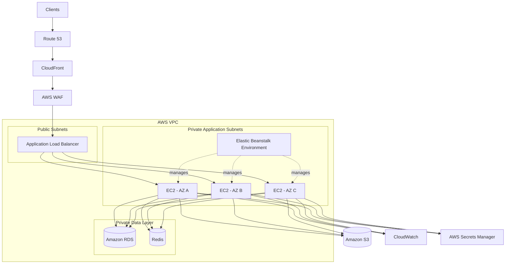

# 03- Production Architecture

## Overview

A production Elastic Beanstalk architecture should treat Elastic Beanstalk as the application-environment orchestration layer rather than as the entire infrastructure stack.

A typical production backend separates responsibilities across:

- DNS and edge routing
- Load balancing
- Application compute
- Auto Scaling
- Persistent data
- Caching
- Object storage
- Secrets
- Observability
- Deployment automation

For a public Django or FastAPI API, a practical architecture is:

```text
Internet
   │
   ▼
Route 53
   │
   ▼
CloudFront / WAF
   │
   ▼
Application Load Balancer
   │
   ▼
Elastic Beanstalk
   │
   ├── EC2
   ├── EC2
   └── EC2
        │
        ├── PostgreSQL / RDS
        ├── Redis
        └── S3
```

Elastic Beanstalk supports load-balanced, scalable environments that use Elastic Load Balancing and EC2 Auto Scaling. AWS explicitly recommends load-balanced environments for production rather than single-instance environments. :contentReference[oaicite:0]{index=0}

The objective is not simply to make the application run. The production architecture must make the system:

- Highly available
- Horizontally scalable
- Secure
- Observable
- Deployable without unnecessary downtime
- Recoverable after failures
- Operationally manageable

## Production Architecture Principles

A production Elastic Beanstalk deployment should follow several core principles.

### Keep Application Instances Disposable

EC2 instances managed by Elastic Beanstalk should be treated as replaceable compute.

Do not make an individual instance the authoritative source of:

- User uploads
- Persistent sessions
- Application state
- Database data
- Deployment artifacts

Instead:

```text
EC2
 │
 ├── Application code
 ├── Temporary files
 └── Runtime state
```

while durable state lives externally:

```text
Application
 │
 ├── RDS / Aurora ────── Relational data
 ├── Redis ────────────── Cache / shared ephemeral state
 ├── S3 ──────────────── Objects
 └── Secrets Manager ─── Secrets
```

This allows Auto Scaling to replace instances without requiring application-specific recovery procedures.

### Prefer Horizontal Scaling

Production capacity should generally be increased by adding instances rather than continuously increasing the size of one instance.

```text
                    ALB
                     │
          ┌──────────┼──────────┐
          ▼          ▼          ▼
        EC2-A      EC2-B      EC2-C
```

This architecture provides both scalability and instance-level failure tolerance.

### Separate Stateless and Stateful Responsibilities

A useful architectural boundary is:

```text
Stateless Compute
       │
       ├── Django
       ├── FastAPI
       ├── Nginx
       └── Workers

Stateful Services
       │
       ├── PostgreSQL
       ├── Redis
       ├── S3
       └── Kafka / SQS
```

Elastic Beanstalk should primarily manage the stateless application tier.

## Recommended Production Topology

A production deployment can be structured as:



The exact services should be selected according to application requirements. Do not add CloudFront, WAF, Redis, or other components simply because they are common production services.

## Environment Type

Elastic Beanstalk provides two major environment models:

| Environment | Typical Purpose | Production Suitability |
|---|---|---|
| Single-instance | Development and testing | Generally unsuitable |
| Load-balanced, scalable | Production web applications | Recommended |

A load-balanced environment uses Elastic Load Balancing and EC2 Auto Scaling to provide multiple application instances. :contentReference[oaicite:1]{index=1}

For a production API:

```text
Environment Type
        │
        ▼
Load balanced
        │
        ├── Load Balancer
        └── Auto Scaling Group
```

The load balancer becomes the stable application entry point while EC2 instances remain replaceable.

## VPC Architecture

A production environment should normally use a deliberately designed VPC rather than treating networking as an afterthought.

A common topology is:

```text
VPC
│
├── Public Subnet AZ-A
│      └── ALB
│
├── Public Subnet AZ-B
│      └── ALB
│
├── Private Subnet AZ-A
│      └── EC2
│
├── Private Subnet AZ-B
│      └── EC2
│
├── Private Database Subnet AZ-A
│      └── RDS
│
└── Private Database Subnet AZ-B
       └── RDS
```

Elastic Beanstalk allows you to choose the subnets used by the load balancer and application instances. AWS recommends using multiple Availability Zones for load balancer subnets when designing for high availability. :contentReference[oaicite:2]{index=2}

### Public Load Balancer, Private Application Instances

For a public API, a common security boundary is:

```text
Internet
   │
   ▼
Public ALB
   │
   ▼
Private EC2
   │
   ▼
Private RDS
```

The application instances do not need to be directly reachable from the Internet.

This reduces the public attack surface and makes the network trust relationships easier to reason about.

## Network Security Groups

Security groups should reflect application communication paths.

A typical design is:

```text
Internet
   │
   │ HTTPS :443
   ▼
ALB Security Group
   │
   │ Application Port
   ▼
EC2 Security Group
   │
   │ PostgreSQL :5432
   ▼
RDS Security Group
```

For example:

| Source | Destination | Port | Purpose |
|---|---|---:|---|
| Internet | ALB | 443 | Public HTTPS |
| ALB SG | EC2 SG | 8000/80 | Application traffic |
| EC2 SG | RDS SG | 5432 | PostgreSQL |
| EC2 SG | Redis SG | 6379 | Redis |

The exact ports depend on the application configuration.

Avoid:

```text
0.0.0.0/0
    │
    ├── EC2
    └── RDS
```

when the service only needs traffic from another internal component.

## Availability Zones

Application instances should be distributed across multiple Availability Zones.

For example:

```text
Region
│
├── AZ-A
│    ├── EC2
│    └── EC2
│
├── AZ-B
│    ├── EC2
│    └── EC2
│
└── AZ-C
     └── EC2
```

The exact number of Availability Zones should be determined by:

- Availability requirements
- Regional AZ availability
- Traffic
- Cost
- Capacity
- Dependency architecture

Multi-AZ deployment protects against an Availability Zone failure, but only if the remaining fleet has enough capacity to handle the workload.

## Auto Scaling Architecture

The application tier should normally be controlled by an Auto Scaling group.

```text
                 Auto Scaling Group
                        │
          ┌─────────────┼─────────────┐
          ▼             ▼             ▼
        EC2-A         EC2-B         EC2-C
          │             │             │
          └─────────────┼─────────────┘
                        ▼
                  Application
```

Configure:

- Minimum capacity
- Desired capacity
- Maximum capacity
- Scaling triggers
- Health-check behavior

For example:

```text
Minimum: 3
Desired: 3
Maximum: 9
```

This provides baseline redundancy while allowing the environment to scale during increased demand.

### Capacity Planning

Do not choose the minimum capacity simply because the application currently needs that number of instances.

Suppose:

```text
Normal peak requirement = 4 instances
```

If the application runs exactly four instances:

```text
AZ-A = 2
AZ-B = 2
```

and AZ-A fails:

```text
AZ-A = 0
AZ-B = 2
```

The application survives, but it may no longer have sufficient capacity.

Capacity planning should therefore consider failure scenarios, not only normal traffic.

## Load Balancer Architecture

The Application Load Balancer provides the stable entry point for the application.

```text
                    Internet
                       │
                       ▼
                    Route 53
                       │
                       ▼
                     ALB
                  /       \
                 ▼         ▼
              AZ-A        AZ-B
               │            │
             EC2-A        EC2-B
```

The ALB handles:

- Client connections
- Listener rules
- TLS termination
- Target registration
- Health checks
- Traffic distribution

The application instances should not normally need to know which client is connected directly to them.

## Request Lifecycle

For a Django REST API:

```text
Client
  │
  ▼
Route 53
  │
  ▼
CloudFront / WAF
  │
  ▼
Application Load Balancer
  │
  ▼
EC2
  │
  ▼
Nginx
  │
  ▼
Gunicorn
  │
  ▼
Django / DRF
  │
  ├── PostgreSQL
  ├── Redis
  └── S3
```

For FastAPI:

```text
Client
  │
  ▼
ALB
  │
  ▼
Nginx
  │
  ▼
Gunicorn / Uvicorn
  │
  ▼
FastAPI
```

The architecture should keep the application process independent from the lifecycle of any particular EC2 instance.

## Health Checks

Health checks are essential because the load balancer needs a reliable way to determine whether a target can serve traffic.

A typical endpoint is:

```text
GET /health
```

A simple response might be:

```json
{
  "status": "healthy"
}
```

A production health endpoint should be:

- Fast
- Deterministic
- Cheap
- Observable
- Appropriate for the load balancer's health-check frequency

Do not blindly perform expensive operations such as multiple external API calls on every health check.

### Liveness vs Readiness

These concepts should be separated where appropriate.

**Liveness** asks:

```text
Is the application process alive?
```

**Readiness** asks:

```text
Can this instance safely receive production traffic?
```

For example:

```text
Application Process
       │
       ▼
Liveness
       │
       ▼
Running

Database / critical dependency
       │
       ▼
Readiness
       │
       ▼
Accept traffic
```

The correct implementation depends on the application's dependency model.

## Stateless Django and FastAPI Applications

A production Elastic Beanstalk environment benefits from stateless application instances.

Avoid:

```text
EC2-A
 └── User session

EC2-B
 └── Different user session state
```

Prefer:

```text
EC2-A ─┐
EC2-B ─┼──► Shared Session Store
EC2-C ─┘
```

For Django, session data can be stored in a shared backend such as Redis or a database when appropriate.

For FastAPI, shared session and authentication state should similarly remain outside an individual instance when the application requires server-side state.

## Persistent Data

Do not use EC2 local storage as the authoritative database for production application data.

Use managed services:

| Data | Recommended Service |
|---|---|
| Relational data | Amazon RDS / Aurora |
| Object storage | Amazon S3 |
| Cache | ElastiCache / Redis |
| Secrets | AWS Secrets Manager |
| Application artifacts | Amazon S3 |
| Messages | Amazon SQS / Kafka where appropriate |

The architecture becomes:

```text
EC2
 │
 ├── RDS
 ├── Redis
 ├── S3
 └── Secrets Manager
```

This means a newly launched EC2 instance can become operational without needing data restored from a previous instance's local disk.

## Database Architecture

A production Django or FastAPI application commonly uses Amazon RDS for PostgreSQL.

```text
              Application Tier
            /       |       \
           ▼        ▼        ▼
        EC2-A    EC2-B    EC2-C
           \        |        /
            \       |       /
                 RDS
                  │
          PostgreSQL Database
```

For availability-sensitive applications, the database layer should have its own resilience model.

A Multi-AZ RDS architecture can provide:

```text
Application
     │
     ▼
RDS
 ┌──────────────┐
 │              │
 ▼              ▼
Primary        Standby
AZ-A            AZ-B
```

The application should connect through the managed database endpoint rather than depending on an individual database instance address.

## Redis Architecture

Redis should be classified according to how the application uses it.

### Cache-Only Redis

If Redis is purely a cache:

```text
Django
  │
  ▼
Redis
  │
  ├── Hit → Return cached value
  └── Miss → Query database
```

A Redis failure should ideally result in cache misses rather than complete application failure.

### Critical Redis State

If Redis stores:

- Distributed locks
- Session state
- Rate-limit state
- Task coordination
- Application-critical state

then Redis becomes part of the application's availability boundary.

The resilience requirements must therefore be higher.

## Background Processing

Elastic Beanstalk web environments should not necessarily perform all long-running work inside HTTP requests.

A common architecture is:

```text
Client
  │
  ▼
Django / FastAPI
  │
  ▼
Queue
  │
  ▼
Worker
  │
  ├── PostgreSQL
  ├── Redis
  └── S3
```

For example:

```text
API
 │
 ▼
SQS / Kafka
 │
 ▼
Celery Worker
 │
 ▼
Long-running task
```

This prevents slow background work from consuming web-server request capacity.

The worker architecture can be independently scaled from the web tier when the workload justifies it.

## Object Storage

User-generated files should generally be stored in S3 rather than on individual EC2 instances.

A common flow is:

```text
Client
  │
  ▼
API
  │
  ▼
S3
```

For larger uploads, direct client-to-S3 uploads using presigned URLs can reduce application-server bandwidth:

```text
Client
  │
  ├──────────────► S3
  │
  │ presigned URL
  ▼
Backend API
```

This can improve application scalability by removing large object-transfer workloads from EC2 instances.

## Secrets Management

Production credentials should not be hard-coded into:

- Git repositories
- Dockerfiles
- Application source
- AMIs
- Shell scripts committed to source control

Prefer AWS Secrets Manager or another appropriate managed secret store.

Conceptually:

```text
EC2
 │
 ▼
IAM Role
 │
 ▼
Secrets Manager
 │
 ▼
Database Credentials
```

The EC2 instance profile should have permission only to retrieve the secrets required by the application.

## CloudFront and WAF

CloudFront can be used in front of the application when edge caching, global distribution, or reduced origin load is required.

A common architecture is:

```text
Client
  │
  ▼
CloudFront
  │
  ▼
WAF
  │
  ▼
ALB
  │
  ▼
Elastic Beanstalk
```

CloudFront is particularly useful for:

- Static assets
- Public content
- Global distribution
- Edge caching

WAF can provide request filtering and application-layer protection.

Neither service should be introduced without understanding the application's caching and security requirements.

## TLS Architecture

For public APIs, HTTPS should terminate at the load balancer or another appropriate edge layer.

```text
Client
  │
  │ HTTPS
  ▼
ALB
  │
  │ HTTP/HTTPS
  ▼
EC2
```

The choice of encryption between ALB and EC2 depends on security requirements and the trust boundary.

TLS certificates should be managed through AWS Certificate Manager where appropriate rather than manually copying certificate files onto every instance.

## Deployment Architecture

Production deployments should avoid unnecessarily replacing the entire application fleet simultaneously.

Elastic Beanstalk supports multiple deployment policies, including:

- All at once
- Rolling
- Rolling with additional batch
- Immutable
- Traffic splitting

Rolling deployments replace instances in batches while maintaining a configured minimum capacity. Immutable deployments create a separate temporary Auto Scaling group and only replace the old fleet after the new instances pass health checks. :contentReference[oaicite:3]{index=3}

### Rolling Deployment

```text
Old Fleet
 ├── v1
 ├── v1
 ├── v1
 └── v1

        ↓

Batch replacement

        ↓

New Fleet
 ├── v2
 ├── v2
 ├── v2
 └── v2
```

During a rolling deployment, old and new versions can temporarily coexist. This means application and database changes should remain backward compatible during the transition.

### Immutable Deployment

An immutable deployment creates a temporary Auto Scaling group containing the new instances.

```text
Existing ASG
 ├── v1
 ├── v1
 └── v1

Temporary ASG
 ├── v2
 ├── v2
 └── v2
```

The new fleet is health-checked before the old fleet is terminated. If the update fails, Elastic Beanstalk can remove the temporary group while leaving the original fleet intact. :contentReference[oaicite:4]{index=4}

The major tradeoff is capacity and cost: during the update, the environment temporarily requires additional EC2 capacity. :contentReference[oaicite:5]{index=5}

## Blue/Green Deployment

For high-risk releases, separate environments can be used:

```text
                    Route 53
                       │
                       ▼
                    Production
                    Traffic
                       │
                       ▼
                  Green Environment
                       │
                  Elastic Beanstalk
```

The previous environment remains available as the rollback target.

Conceptually:

```text
Blue
 └── v1

Green
 └── v2
```

After validation:

```text
Traffic
   │
   ▼
Green v2
```

The old Blue environment can remain available temporarily for rollback.

AWS documents blue/green deployments as a way to deploy a new version to a separate environment and then swap the environment CNAMEs to redirect traffic. :contentReference[oaicite:6]{index=6}

### Blue/Green Advantages

- Strong rollback capability
- Independent environment validation
- Reduced production deployment risk
- Useful for major application changes

### Blue/Green Limitations

- Higher infrastructure cost
- Two environments must be maintained temporarily
- Database migrations require careful planning
- Configuration drift can occur
- External dependencies must be environment-aware

A blue/green deployment does not automatically solve database compatibility problems.

## Database Migration Strategy

Production deployments should use backward-compatible database migrations.

A safer sequence is:

```text
Deploy schema change
        │
        ▼
Maintain compatibility with v1
        │
        ▼
Deploy v2
        │
        ▼
Switch traffic
        │
        ▼
Remove obsolete schema later
```

This is commonly called an expand-and-contract approach.

Avoid:

```text
Drop column
    │
    ▼
Deploy application that still expects column
    │
    ▼
Production failure
```

Rolling and immutable deployments can temporarily involve multiple application versions, so database compatibility must be treated as part of the deployment architecture.

## CI/CD Architecture

A production Elastic Beanstalk environment should normally be deployed through CI/CD rather than manually from an engineer's workstation.

A typical pipeline is:


For GitHub Actions, a pipeline might conceptually contain:

```text
Checkout
   ↓
Install dependencies
   ↓
Lint
   ↓
Unit tests
   ↓
Security checks
   ↓
Build application artifact
   ↓
Deploy
   ↓
Health validation
```

The exact CI/CD implementation depends on organizational requirements.

## Deployment Artifact

The artifact deployed to Elastic Beanstalk should be reproducible.

For a Python application, the artifact may contain:

```text
application.zip
├── application/
├── requirements.txt
├── Procfile
├── .ebextensions/
└── configuration files
```

The application version should be traceable to:

- Git commit
- Build identifier
- Release identifier
- Deployment timestamp

This makes production troubleshooting significantly easier.

## Platform Updates

Elastic Beanstalk platforms receive updates containing fixes, security updates, and platform improvements.

Managed platform updates can automatically apply supported patch or minor platform updates during a scheduled maintenance window. AWS performs these managed updates using immutable environment updates. :contentReference[oaicite:7]{index=7}

A production strategy should therefore define:

- Which platform branch is supported
- Whether managed updates are enabled
- Patch vs minor update policy
- Maintenance window
- Application compatibility testing
- Rollback procedures

Platform branches eventually become deprecated or retired, so platform lifecycle management should be part of production operations. :contentReference[oaicite:8]{index=8}

## Observability Architecture

A production environment should expose infrastructure and application health through CloudWatch and application-level monitoring.

```text
                    Application
                        │
            ┌───────────┼───────────┐
            ▼           ▼           ▼
          Logs       Metrics      Errors
            │           │           │
            └───────────┼───────────┘
                        ▼
                   CloudWatch
                        │
                  ┌─────┴─────┐
                  ▼           ▼
                Alarms      Dashboards
                  │
                  ▼
              Notifications
```

Important metrics include:

### Load Balancer

- Request count
- HTTP 4xx
- HTTP 5xx
- Target response time
- Healthy target count
- Unhealthy target count

### EC2

- CPU
- Network
- Disk
- Instance health
- Memory where custom monitoring is configured

### Application

- Request latency
- Error rate
- Database latency
- Cache hit ratio
- Queue depth
- Worker failures

### Business Metrics

Infrastructure health alone is insufficient.

Also monitor metrics such as:

- Successful orders
- Failed payments
- Authentication failures
- Job completion rate
- API success rate

A system can be technically healthy while the business workflow is broken.

## Logging Architecture

Logs should be centralized rather than retained only on individual EC2 instances.

```text
EC2-A ─┐
EC2-B ─┼──► CloudWatch Logs
EC2-C ─┘
```

Useful log categories include:

- Application logs
- Nginx logs
- Web-server logs
- Deployment logs
- System logs
- Load balancer access logs where configured

Use structured logging for backend applications.

Example:

```json
{
  "timestamp": "2026-08-13T10:15:22Z",
  "level": "ERROR",
  "service": "orders-api",
  "request_id": "7f4c2a",
  "path": "/api/orders",
  "status": 500,
  "duration_ms": 241,
  "message": "Database connection failed"
}
```

A request or correlation ID makes tracing a request across Nginx, application code, workers, and downstream services significantly easier.

## Performance Architecture

Performance should be optimized by identifying the actual bottleneck.

A typical API request may involve:

```text
Client
  │
  ▼
ALB
  │
  ▼
Nginx
  │
  ▼
Django
  │
  ├── Redis
  └── PostgreSQL
```

Potential bottlenecks include:

- ALB connection limits
- EC2 CPU
- EC2 memory
- Python worker count
- Database connection pool
- Slow SQL queries
- Redis latency
- External APIs
- Network throughput

Adding more EC2 instances does not automatically solve every bottleneck.

For example:

```text
3 EC2 instances
      │
      ▼
Shared PostgreSQL
      │
      ▼
Database saturated
```

Scaling the application tier from three to ten instances may make the database problem worse.

## Python Application Considerations

For Django and FastAPI workloads, production process configuration matters.

A common Django architecture is:

```text
ALB
 │
 ▼
Nginx
 │
 ▼
Gunicorn
 │
 ▼
Django
```

A FastAPI deployment may use:

```text
ALB
 │
 ▼
Nginx
 │
 ▼
Gunicorn + Uvicorn workers
 │
 ▼
FastAPI
```

Worker count should be based on workload characteristics and measured resource usage rather than blindly applying a fixed formula.

For CPU-bound workloads, excessive Python workers can increase contention.

For I/O-bound workloads, concurrency characteristics become more important.

## Celery Architecture

For applications using Celery:

```text
                 Django / FastAPI
                        │
                        ▼
                     Broker
                        │
                ┌───────┼───────┐
                ▼       ▼       ▼
             Worker  Worker  Worker
                │       │       │
                └───────┼───────┘
                        ▼
                 PostgreSQL / S3
```

The web tier and worker tier should be scaled independently when their workloads differ.

For example:

```text
Web:
3 EC2 instances

Workers:
6 EC2 instances
```

This is more efficient than forcing the web tier to scale purely because background processing increased.

## Kafka Integration

If Kafka is used for event-driven architecture:

```text
Django / FastAPI
      │
      ▼
Kafka
      │
 ┌────┼────┐
 ▼    ▼    ▼
Consumer Consumer Consumer
```

Kafka should not be introduced solely to make Elastic Beanstalk "more production ready."

Use it when the system genuinely requires:

- Event streaming
- Durable event processing
- Consumer groups
- Replay
- Decoupled services
- High-throughput event pipelines

The same architectural principle applies to Redis, Celery, and other infrastructure components.

## Security Architecture

A production Elastic Beanstalk environment should use defense in depth.

```text
Internet
   │
   ▼
CloudFront / WAF
   │
   ▼
ALB
   │
   ▼
Private EC2
   │
   ▼
Private Data Services
```

Important controls include:

- HTTPS
- Security groups
- Private subnets
- IAM least privilege
- Secrets Manager
- CloudTrail
- CloudWatch
- Dependency patching
- Platform updates
- Restricted administrative access

Avoid placing credentials directly in:

```text
settings.py
.env committed to Git
Dockerfile
source code
```

Environment-specific configuration should be managed through appropriate AWS configuration and secret-management mechanisms.

## Disaster Recovery

Multi-AZ architecture provides resilience within a Region but does not protect against a complete Regional failure.

A disaster recovery strategy should define:

- RPO
- RTO
- Backup frequency
- Restore procedures
- Database recovery
- Infrastructure recreation
- Artifact retention
- DNS failover
- Cross-region requirements

A simplified multi-region strategy could be:

```text
                    Route 53
                   /         \
                  ▼           ▼
             Region A      Region B
                 │             │
                 ▼             ▼
             Beanstalk     Beanstalk
                 │             │
                 ▼             ▼
              Database      Database
```

This architecture is significantly more complex than Multi-AZ.

Do not introduce it unless the application's recovery requirements justify the additional operational and financial cost.

## Backup Strategy

Backups should cover persistent state, not merely application instances.

Typical backup targets include:

| Resource | Backup / Recovery Strategy |
|---|---|
| RDS | Automated backups + snapshots |
| S3 | Versioning / lifecycle policies where appropriate |
| Application artifacts | Immutable build artifacts |
| Configuration | Version-controlled infrastructure/configuration |
| Secrets | Managed secret storage and recovery strategy |

A backup strategy is incomplete until restoration has been tested.

The critical question is not:

> Do we have backups?

It is:

> Can we restore the production system within the required RTO?

## Cost Architecture

A production architecture introduces multiple cost dimensions.

| Component | Main Cost Driver |
|---|---|
| EC2 | Instance type × runtime |
| ALB | Load balancer usage |
| NAT Gateway | Hourly + data processing |
| RDS | Instance + storage + I/O |
| Redis | Node type + runtime |
| S3 | Storage + requests + transfer |
| CloudFront | Data transfer + requests |
| WAF | Web ACL/rules + requests |
| CloudWatch | Logs, metrics, alarms |

Private application subnets often require NAT gateways when instances need outbound Internet access. For workloads that can use AWS services through VPC endpoints, interface or gateway endpoints can reduce unnecessary NAT dependency and potentially reduce costs.

Cost optimization should not remove required redundancy.

## Operational Model

A production Elastic Beanstalk environment should have defined operational procedures for:

- Deployment
- Rollback
- Platform updates
- Scaling
- Incident response
- Instance replacement
- Database recovery
- Secret rotation
- Certificate renewal
- Log investigation
- Capacity planning

An operational runbook should answer:

```text
What failed?
    │
    ▼
Which layer?
    │
    ├── DNS
    ├── ALB
    ├── EC2
    ├── Application
    ├── Database
    └── Dependency
    │
    ▼
What is the immediate mitigation?
    │
    ▼
What is the permanent fix?
```

## Production Failure Scenarios

### EC2 Instance Failure

```text
EC2 failure
    │
    ▼
Health check failure
    │
    ▼
Traffic removed
    │
    ▼
Replacement instance
    │
    ▼
Health check passes
    │
    ▼
Traffic restored
```

### Availability Zone Failure

```text
AZ-A unavailable
       │
       ▼
Traffic continues through AZ-B
       │
       ▼
Remaining capacity evaluated
       │
       ▼
Scale out if required
```

### Bad Application Deployment

With an immutable deployment:

```text
v1 fleet
   │
   ├──────────────► continues serving
   │
   ▼
Temporary v2 fleet
   │
   ▼
Health checks fail
   │
   ▼
Terminate v2 fleet
   │
   ▼
v1 remains
```

Immutable deployments are specifically designed to reduce the rollback complexity of failed fleet replacements. :contentReference[oaicite:9]{index=9}

### Database Failure

```text
Application
    │
    ▼
RDS
    │
    ├── Primary failure
    │
    ▼
Managed failover / recovery
    │
    ▼
Application reconnects
```

The actual recovery behavior depends on the database configuration and AWS service capabilities.

## Common Production Mistakes

### Treating Elastic Beanstalk as the Entire Architecture

Elastic Beanstalk manages the environment, but the application still depends on:

```text
ALB
EC2
VPC
IAM
RDS
Redis
S3
CloudWatch
```

Understanding the underlying resources is essential for senior-level troubleshooting.

### Using a Single Instance

A single-instance environment is vulnerable to instance failure and deployment-related downtime. AWS explicitly describes single-instance environments as suitable for development, testing, or staging rather than production. :contentReference[oaicite:10]{index=10}

### Putting Application Instances in Public Subnets Unnecessarily

Publicly routable application instances increase the attack surface.

Prefer:

```text
Internet
   │
   ▼
ALB
   │
   ▼
Private EC2
```

when the architecture permits it.

### Storing Files on EC2

Files stored on an individual instance may disappear when that instance is replaced.

Use S3 for durable object storage.

### Hard-Coding Secrets

Credentials committed to source control are difficult to rotate and represent a serious security risk.

Use managed secret storage.

### Scaling Only the Web Tier

If the database is saturated, adding more web instances can increase database pressure.

Always identify the actual bottleneck.

### Using All-at-Once Deployments for Critical Services

All-at-once deployment is fast but can temporarily reduce or eliminate service availability. AWS documents rolling, immutable, and traffic-splitting deployment strategies as alternatives when availability and rollout safety matter. :contentReference[oaicite:11]{index=11}

### Ignoring Deployment Compatibility

Rolling or staged deployments can temporarily run different application versions.

Database migrations and API contracts must therefore support backward compatibility during the deployment window.

### Treating Multi-AZ as Disaster Recovery

Multi-AZ protects against Availability Zone failures.

It does not automatically protect against:

- Region failure
- Data corruption
- Application bugs
- Incorrect deployments
- Credential compromise

Those require additional recovery mechanisms.

## Production Readiness Checklist

### Architecture

- [ ] Load-balanced Elastic Beanstalk environment
- [ ] Multiple EC2 instances
- [ ] Multiple Availability Zones
- [ ] Adequate minimum and maximum capacity
- [ ] Stateless application design
- [ ] Externalized persistent state

### Networking

- [ ] Custom VPC where appropriate
- [ ] Public ALB subnets
- [ ] Private application subnets where appropriate
- [ ] Private database subnets
- [ ] Security groups based on required communication paths
- [ ] No unnecessary public IPs

### Data

- [ ] RDS / Aurora for relational persistence
- [ ] Appropriate database availability configuration
- [ ] S3 for durable object storage
- [ ] Redis resilience appropriate to its role
- [ ] Tested backup and restoration process

### Security

- [ ] HTTPS
- [ ] ACM-managed certificates where appropriate
- [ ] Least-privilege IAM
- [ ] Secrets Manager or appropriate secret store
- [ ] Restricted security-group rules
- [ ] Audit logging

### Deployment

- [ ] CI/CD pipeline
- [ ] Reproducible application artifacts
- [ ] Health validation
- [ ] Appropriate deployment policy
- [ ] Rollback procedure
- [ ] Backward-compatible database migrations
- [ ] Platform update strategy

### Observability

- [ ] Application logs
- [ ] Infrastructure metrics
- [ ] ALB metrics
- [ ] Error-rate monitoring
- [ ] Latency monitoring
- [ ] Health alarms
- [ ] Capacity alarms
- [ ] Deployment monitoring
- [ ] Business-level monitoring

### Reliability

- [ ] Instance failure tested
- [ ] AZ failure scenario considered
- [ ] Dependency failures considered
- [ ] Recovery procedures documented
- [ ] RPO defined
- [ ] RTO defined
- [ ] Disaster recovery strategy tested

## Interview Perspective

### Why use Elastic Beanstalk instead of managing EC2 manually?

Elastic Beanstalk provides an application-oriented environment abstraction and manages infrastructure components such as EC2, Auto Scaling, and Elastic Load Balancing for the environment. :contentReference[oaicite:12]{index=12}

The tradeoff is reduced infrastructure-management effort in exchange for accepting Elastic Beanstalk's deployment and environment model.

### Is Elastic Beanstalk serverless?

No.

Elastic Beanstalk environments typically use EC2 instances underneath the managed environment. :contentReference[oaicite:13]{index=13}

### Should EC2 instances contain persistent application state?

Generally no.

Production application instances should be replaceable. Persistent state should be stored in appropriate managed services.

### Why put an ALB in front of Elastic Beanstalk?

The ALB provides a stable traffic entry point, distributes requests across instances, and performs target health checks.

### Why use immutable deployments?

Immutable deployments create a new fleet separately from the old fleet and validate the new instances before replacing the old fleet. This reduces the rollback complexity of partially completed deployments. :contentReference[oaicite:14]{index=14}

### When should blue/green be preferred?

Blue/green is useful when the deployment needs an independently running environment for validation and a rapid traffic switch or rollback. It is particularly useful for high-risk releases or changes that should not be performed directly against the existing environment. :contentReference[oaicite:15]{index=15}

### Does Elastic Beanstalk eliminate the need to understand AWS networking?

No.

Production engineers still need to understand:

- VPCs
- Subnets
- Route tables
- Security groups
- Load balancers
- NAT
- DNS
- IAM
- Database networking

Elastic Beanstalk simplifies orchestration; it does not eliminate the underlying infrastructure.

### What makes an Elastic Beanstalk architecture production-ready?

A strong answer should cover more than "multiple EC2 instances."

A production architecture should address:

```text
Availability
Scalability
Networking
Security
Persistent Data
Deployment
Observability
Backup
Disaster Recovery
Cost
Operations
```

The strongest architectural answer is therefore:

> Elastic Beanstalk should manage a stateless, horizontally scalable application tier, while durable state, networking, security, observability, deployment, and recovery are deliberately designed around it.

## Key Takeaways

- Elastic Beanstalk should be treated as an orchestration layer within a larger production AWS architecture.
- Production web applications should generally use a load-balanced, scalable environment rather than a single-instance environment.
- Application instances should be disposable and distributed across multiple Availability Zones.
- The load balancer provides the stable application entry point and routes traffic only to healthy targets.
- Auto Scaling provides horizontal capacity and instance replacement.
- Private application subnets behind a public ALB are a common production security pattern.
- Persistent state should live outside EC2 instances in services such as RDS, S3, Redis, and managed secret stores.
- High availability must include critical dependencies, not only the Elastic Beanstalk application tier.
- Capacity planning must account for instance and Availability Zone failures, not only normal peak traffic.
- Stateless Django and FastAPI applications are significantly easier to scale and recover.
- Background processing should be separated from synchronous HTTP workloads when appropriate.
- CI/CD should produce reproducible artifacts and deploy them using an explicit deployment and rollback strategy.
- Rolling, immutable, and blue/green deployments provide different availability, cost, and rollback tradeoffs. :contentReference[oaicite:16]{index=16}
- Database migrations must remain compatible while multiple application versions may coexist.
- Managed platform updates should be incorporated into the production maintenance strategy. :contentReference[oaicite:17]{index=17}
- CloudWatch and application-level metrics should monitor infrastructure, application, and business health.
- Multi-AZ improves regional availability but is not the same as multi-region disaster recovery.
- A production-ready Elastic Beanstalk architecture is ultimately a system-design problem, not merely an Elastic Beanstalk configuration problem.