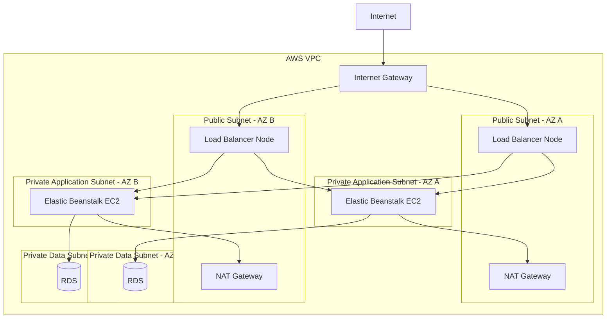
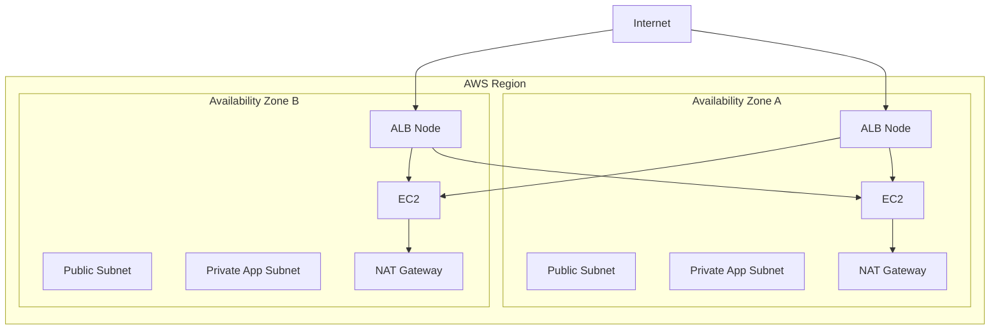

# 04- Networking Architecture

## Overview

Networking is one of the most important parts of a production AWS Elastic Beanstalk architecture because Elastic Beanstalk ultimately runs application workloads inside an Amazon VPC.

Elastic Beanstalk provides environment-level configuration, but the underlying network still consists of familiar AWS components:

```text
VPC
 │
 ├── Subnets
 ├── Route Tables
 ├── Internet Gateway
 ├── NAT Gateway
 ├── Security Groups
 └── Load Balancer
```

A production backend commonly uses a public load balancer and private application instances:

```text
Internet
   │
   ▼
Public Load Balancer
   │
   ▼
Private EC2 Instances
   │
   ├── PostgreSQL / RDS
   ├── Redis
   └── AWS Services
```

This architecture separates the public ingress layer from the application compute layer and reduces the number of resources directly exposed to the Internet.

The important engineering principle is:

> Elastic Beanstalk simplifies application deployment, but it does not remove the need to understand VPC networking.

## Networking Architecture

A typical production topology looks like:



This is a logical architecture. The exact subnet count, NAT topology, database configuration, and load balancer type should be determined by the application's requirements.

## VPC

A VPC provides the network boundary for an Elastic Beanstalk environment.

A VPC contains:

- CIDR ranges
- Subnets
- Route tables
- Internet gateways
- NAT gateways
- Security groups
- Network ACLs
- VPC endpoints
- Other networking components

Conceptually:

```text
VPC
│
├── Public Subnets
│
├── Private Application Subnets
│
├── Private Database Subnets
│
├── Route Tables
│
├── Internet Gateway
│
└── NAT / VPC Endpoints
```

When an Elastic Beanstalk environment is created, it can use either the default VPC or a custom VPC.

For production systems, a deliberately designed custom VPC is usually preferable because networking requirements are known in advance.

## CIDR Planning

VPC networking begins with address planning.

For example:

```text
VPC
10.0.0.0/16
```

Possible subnet allocation:

```text
10.0.0.0/20    Public AZ-A
10.0.16.0/20   Public AZ-B

10.0.32.0/20   Private App AZ-A
10.0.48.0/20   Private App AZ-B

10.0.64.0/20   Private DB AZ-A
10.0.80.0/20   Private DB AZ-B
```

The exact CIDRs are examples only.

CIDR planning should account for:

- Current capacity
- Future scaling
- Multiple Availability Zones
- Additional services
- VPC peering
- Transit Gateway
- VPN or Direct Connect
- Kubernetes or other future workloads

Poor CIDR planning can become difficult to correct later because overlapping networks create problems for connectivity between VPCs and on-premises networks.

## Subnets

A subnet is an IP address range inside a VPC associated with a specific Availability Zone.

A production Elastic Beanstalk architecture commonly separates subnets by responsibility:

```text
VPC
│
├── Public
│   ├── ALB
│   └── NAT Gateway
│
├── Private Application
│   ├── EC2
│   └── Workers
│
└── Private Data
    └── RDS
```

This separation creates clear network boundaries.

### Public Subnet

A public subnet has a route to an Internet Gateway.

Typical resources:

- Internet-facing load balancers
- NAT gateways
- Other intentionally public infrastructure

### Private Subnet

A private subnet does not provide direct inbound Internet access through an Internet Gateway.

Typical resources:

- Elastic Beanstalk EC2 instances
- Application workers
- Internal services
- Databases

A private instance can still make outbound connections through a NAT gateway when required.

## Public vs Private Elastic Beanstalk Architecture

Elastic Beanstalk supports multiple VPC arrangements.

### Public Load Balancer + Private Instances

This is a common production pattern:

```text
Internet
   │
   ▼
Public ALB
   │
   ▼
Private EC2
```

The load balancer is Internet-facing while the application instances are not directly exposed.

### Public Load Balancer + Public Instances

Another configuration is:

```text
Internet
   │
   ▼
Public ALB
   │
   ▼
Public EC2
```

This can work, but the instances have a larger public exposure surface and generally require more careful security controls.

### Internal Load Balancer

For internal applications:

```text
Corporate Network / VPC
          │
          ▼
     Internal ALB
          │
          ▼
      Private EC2
```

This is appropriate when the application should only be reachable from a VPC or connected private network.

## Elastic Beanstalk VPC Configuration

Elastic Beanstalk allows network settings such as:

- VPC
- Load balancer visibility
- Load balancer subnets
- Instance subnets
- Instance public IP configuration
- Database subnets

A conceptual configuration is:

```text
Elastic Beanstalk Environment
│
├── VPC
│
├── Load Balancer
│   ├── Public Subnet A
│   └── Public Subnet B
│
├── Application Instances
│   ├── Private Subnet A
│   └── Private Subnet B
│
└── Database
    ├── Private DB Subnet A
    └── Private DB Subnet B
```

The important architectural distinction is that load balancer subnets and instance subnets have different responsibilities.

## Internet Gateway

An Internet Gateway provides Internet connectivity for resources in a VPC that have appropriate public routing and addressing.

For an Internet-facing load balancer:

```text
Internet
   │
   ▼
Internet Gateway
   │
   ▼
Public Subnet
   │
   ▼
ALB
```

The Internet Gateway does not automatically make every resource inside the VPC public.

A resource needs the appropriate combination of:

- Public subnet routing
- Public IP or public-facing load balancer behavior
- Security group rules
- Network configuration

## Route Tables

Route tables determine where packets should go.

A simplified public route table might contain:

```text
Destination       Target
-----------       ------
10.0.0.0/16       local
0.0.0.0/0         Internet Gateway
```

A private application route table might contain:

```text
Destination       Target
-----------       ------
10.0.0.0/16       local
0.0.0.0/0         NAT Gateway
```

This creates the typical flow:

```text
Private EC2
    │
    ▼
Private Route Table
    │
    ▼
NAT Gateway
    │
    ▼
Internet Gateway
    │
    ▼
Internet
```

The Internet cannot initiate a new connection through the NAT gateway back to the private EC2 instance.

## NAT Gateway

A NAT gateway allows instances in private subnets to initiate outbound connections to destinations outside the VPC while preventing unsolicited inbound Internet connections.

This is important for Elastic Beanstalk instances because application instances may need outbound Internet connectivity for:

- Package installation
- External APIs
- AWS APIs
- OS updates
- Application dependencies
- Monitoring integrations

The architecture is:

```text
Private EC2
    │
    ▼
Private Route Table
    │
    ▼
NAT Gateway
    │
    ▼
Internet Gateway
    │
    ▼
Internet
```

### NAT Gateway High Availability

A single NAT gateway can become a dependency for multiple Availability Zones.

For stronger AZ isolation:

```text
AZ-A                         AZ-B
 │                            │
Private EC2                  Private EC2
 │                            │
 ▼                            ▼
NAT Gateway A                NAT Gateway B
 │                            │
 └──────────────┬─────────────┘
                ▼
        Internet Gateway
```

This avoids making AZ-B depend on a NAT gateway located only in AZ-A.

The tradeoff is cost because each NAT gateway incurs hourly and data-processing charges.

## VPC Endpoints

Not every AWS service connection needs to traverse a NAT gateway.

VPC endpoints can provide private connectivity from VPC resources to supported AWS services.

For example:

```text
Private EC2
    │
    ▼
VPC Endpoint
    │
    ▼
Amazon S3
```

This can reduce unnecessary Internet/NAT dependency.

A common example is an S3 gateway endpoint:

```text
Private EC2
    │
    ▼
S3 Gateway Endpoint
    │
    ▼
Amazon S3
```

For production environments, evaluate VPC endpoints for frequently accessed AWS services where they improve security, routing simplicity, or cost.

## Application Load Balancer

Elastic Beanstalk commonly creates an Application Load Balancer when load balancing is enabled.

The request path is:

```text
Client
   │
   ▼
ALB
   │
   ├── EC2-A
   ├── EC2-B
   └── EC2-C
```

The ALB can provide:

- HTTP/HTTPS listeners
- Path-based routing
- Host-based routing
- Target health checks
- TLS termination
- Multiple processes
- Access logging

For a Django or FastAPI backend, the ALB usually forwards traffic to a reverse proxy such as Nginx running on the EC2 instances.

## ALB Subnet Placement

An Internet-facing ALB should use public subnets.

For high availability:

```text
                 Internet
                    │
                    ▼
             Application Load
                 Balancer
                /         \
               ▼           ▼
            Public       Public
            Subnet A     Subnet B
               │           │
               └─────┬─────┘
                     ▼
                Private EC2
```

An Application Load Balancer requires subnets in at least two Availability Zones.

This makes the load balancer part of the multi-AZ architecture rather than creating a single-AZ ingress dependency.

## Security Groups

Security groups provide stateful network filtering.

A production architecture should define security groups by role.

```text
Internet
   │
   ▼
ALB Security Group
   │
   ▼
EC2 Security Group
   │
   ▼
RDS Security Group
```

Example:

| Security Group | Inbound Source | Port | Purpose |
|---|---|---:|---|
| ALB SG | Internet | 443 | HTTPS |
| EC2 SG | ALB SG | 80/8000 | Application traffic |
| RDS SG | EC2 SG | 5432 | PostgreSQL |
| Redis SG | EC2 SG | 6379 | Redis |

The source should generally be another security group when communication occurs between AWS resources.

Avoid:

```text
RDS
 │
 └── 0.0.0.0/0 : 5432
```

Prefer:

```text
RDS
 │
 └── EC2 Security Group : 5432
```

This expresses the actual trust relationship.

## Load Balancer to EC2 Traffic

A common production flow is:

```text
Client
 │
 │ HTTPS :443
 ▼
ALB
 │
 │ HTTP :80
 ▼
Nginx
 │
 │ localhost
 ▼
Gunicorn / Uvicorn
 │
 ▼
Django / FastAPI
```

The EC2 security group should allow the application listener from the load balancer's security group.

For example:

```text
EC2 Security Group

Inbound:
Source: ALB Security Group
Port: 80
Protocol: TCP
```

Do not expose the application listener to the entire Internet when only the load balancer needs access.

## Nginx and Elastic Beanstalk Networking

For many Elastic Beanstalk platforms, Nginx operates as a reverse proxy in front of the application.

Conceptually:

```text
ALB
 │
 ▼
EC2 :80
 │
 ▼
Nginx
 │
 ▼
Application Process
```

For example:

```text
ALB :443
    │
    ▼
EC2 :80
    │
    ▼
Nginx
    │
    ▼
Gunicorn :8000
    │
    ▼
Django
```

This means engineers must distinguish between:

- ALB listener port
- EC2 listener port
- Nginx port
- Application process port

A `502 Bad Gateway` can result from a failure at any of these layers.

## Application Port Configuration

Suppose the application listens on:

```text
127.0.0.1:8000
```

and Nginx listens on:

```text
0.0.0.0:80
```

The network path is:

```text
ALB
 │
 │ TCP :80
 ▼
EC2
 │
 ▼
Nginx :80
 │
 │ localhost:8000
 ▼
Gunicorn
 │
 ▼
Django
```

The EC2 security group only needs to expose the port that receives traffic from the load balancer.

The internal application port does not need to be exposed to the VPC or Internet if Nginx communicates with it locally.

## Health Check Networking

Health checks must be able to reach the configured application process.

A typical path is:

```text
ALB
 │
 │ Health Check
 ▼
EC2 :80
 │
 ▼
Nginx
 │
 ▼
/health
 │
 ▼
Application
```

For an Application Load Balancer, Elastic Beanstalk can configure health checks per process.

A health check should return `200 OK` when the process is ready to serve traffic.

A common endpoint is:

```text
GET /health
```

Avoid using an endpoint that is served only by a static reverse-proxy page if the goal is to verify application health.

Otherwise:

```text
Nginx healthy
     │
     ▼
Health check = OK
     │
     ▼
Application actually broken
```

This creates a false-positive health signal.

## DNS Architecture

Route 53 typically provides the public DNS layer:

```text
api.example.com
       │
       ▼
Route 53
       │
       ▼
ALB DNS Name
       │
       ▼
Elastic Beanstalk
```

A Route 53 alias record can point the application hostname toward the load balancer.

The client should therefore use:

```text
api.example.com
```

rather than an individual EC2 IP address.

This allows the underlying instances to change without changing the public application endpoint.

## HTTPS Architecture

A common production HTTPS architecture is:

```text
Client
  │
  │ HTTPS :443
  ▼
ALB
  │
  │ HTTP or HTTPS
  ▼
EC2
```

TLS can terminate at the ALB using an ACM certificate.

The application then receives forwarded traffic from the load balancer.

For higher security requirements, encryption can also be maintained between the ALB and application instances.

The decision depends on:

- Security requirements
- Compliance
- Internal trust boundaries
- Certificate management
- Operational complexity

## End-to-End Encryption

For stricter environments:

```text
Client
  │
  │ HTTPS
  ▼
ALB
  │
  │ HTTPS
  ▼
Nginx
  │
  ▼
Application
```

This prevents plaintext HTTP on the ALB-to-instance network path.

End-to-end TLS introduces additional certificate and configuration management, so it should be implemented deliberately rather than automatically.

## Internal Elastic Beanstalk Environments

Not every Elastic Beanstalk application needs to be public.

For an internal backend:

```text
Corporate Network
      │
      ▼
VPN / Direct Connect
      │
      ▼
Internal ALB
      │
      ▼
Private EC2
```

Examples include:

- Internal administration APIs
- Microservices
- Enterprise applications
- Internal reporting systems
- Private gRPC services

The load balancer can be configured as internal rather than Internet-facing.

## Microservices Networking

If multiple backend services use Elastic Beanstalk:

```text
                  Internal Network
                       │
        ┌──────────────┼──────────────┐
        ▼              ▼              ▼
     Service A      Service B      Service C
        │              │              │
        └──────────────┼──────────────┘
                       ▼
                 Shared Services
```

Each service can have its own environment and load balancer.

For example:

```text
orders-api
    │
    ▼
payments-api
```

For service-to-service communication, the network architecture should consider:

- Private DNS
- Internal load balancers
- Security groups
- TLS
- Timeouts
- Retries
- Circuit breaking
- Service discovery

Do not make internal microservices publicly accessible merely because the application is deployed on Elastic Beanstalk.

## REST and gRPC Networking

REST APIs commonly use HTTP/HTTPS:

```text
Service A
   │
   │ HTTPS
   ▼
Service B
```

gRPC typically uses HTTP/2 and TLS:

```text
Service A
   │
   │ HTTP/2 + TLS
   ▼
Internal Load Balancer
   │
   ▼
Service B
```

If gRPC is used, the chosen load balancer and listener configuration must support the protocol requirements.

The network architecture should be designed around the actual protocol rather than assuming every backend service is an HTTP/1.1 REST endpoint.

## Database Networking

A production database should generally be isolated from the public Internet.

```text
Internet
   │
   ▼
ALB
   │
   ▼
Private EC2
   │
   ▼
Private RDS
```

The database security group should allow connections only from the application security group.

Example:

```text
EC2 SG
   │
   │ TCP 5432
   ▼
RDS SG
```

This is preferable to:

```text
Internet
   │
   │ TCP 5432
   ▼
RDS
```

Database connectivity failures should be investigated across multiple layers:

```text
Application
    │
    ▼
EC2 Security Group
    │
    ▼
Route Table
    │
    ▼
Subnet
    │
    ▼
RDS Security Group
    │
    ▼
RDS Endpoint
```

## Redis Networking

For Redis:

```text
EC2
 │
 │ TCP 6379
 ▼
Redis
```

The Redis security group should permit access from the application security group rather than the entire VPC or Internet.

For example:

```text
Redis SG

Inbound:
Source: Application SG
Port: 6379
```

Redis should normally remain private.

## S3 Networking

An application instance in a private subnet can access S3 without receiving a public IP.

One possible path is:

```text
EC2
 │
 ▼
S3 VPC Endpoint
 │
 ▼
S3
```

Another is:

```text
EC2
 │
 ▼
NAT Gateway
 │
 ▼
Internet Gateway
 │
 ▼
S3
```

For AWS service traffic, private connectivity through VPC endpoints can provide a cleaner network path and reduce reliance on NAT.

## Private Subnet Internet Access

Private instances may need outbound Internet access.

Example:

```text
Private EC2
     │
     ▼
Route Table
     │
     ▼
NAT Gateway
     │
     ▼
Internet Gateway
     │
     ▼
Internet
```

Important distinction:

```text
Private subnet
    ≠
No outbound Internet access
```

A private subnet can have controlled outbound connectivity through a NAT gateway.

## Public vs Private Routing

| Property | Public Subnet | Private Subnet |
|---|---|---|
| Route to Internet Gateway | Yes | No direct Internet route |
| Typical resources | ALB, NAT Gateway | EC2, RDS |
| Direct Internet ingress | Possible | Not directly |
| Outbound Internet | IGW | NAT / endpoint |
| Public IP commonly used | Yes | Usually no |
| Production application instances | Usually avoid | Preferred where appropriate |

The classification comes primarily from routing, not simply from the resource type.

## Network ACLs

Network ACLs operate at the subnet boundary.

Security groups operate at the resource level.

Conceptually:

```text
Internet
   │
   ▼
Network ACL
   │
   ▼
Subnet
   │
   ▼
Security Group
   │
   ▼
EC2
```

A production environment should avoid unnecessarily complex NACL configurations.

Security groups are usually the primary mechanism for controlling application-to-application traffic.

NACLs can provide an additional subnet-level security boundary when there is a clear requirement.

## Security Groups vs NACLs

| Feature | Security Group | Network ACL |
|---|---|---|
| Scope | Resource / ENI | Subnet |
| Stateful | Yes | No |
| Return traffic | Automatically allowed | Explicit rules required |
| Rule type | Allow | Allow and deny |
| Typical use | Application traffic control | Subnet-level boundary |
| Complexity | Lower | Higher |

A common mistake is attempting to solve every networking problem with NACLs when security groups already provide the required control.

## Route Table Design

A production topology might use separate route tables:

```text
Public Route Table
    │
    ├── local
    └── 0.0.0.0/0 → IGW


Private App Route Table AZ-A
    │
    ├── local
    └── 0.0.0.0/0 → NAT-A


Private App Route Table AZ-B
    │
    ├── local
    └── 0.0.0.0/0 → NAT-B
```

This allows each Availability Zone to use its local NAT gateway.

The design improves fault isolation compared with routing both AZs through a single NAT gateway.

## Multi-AZ Networking

A production Elastic Beanstalk environment should distribute network components across Availability Zones.



This architecture minimizes cross-AZ dependencies for outbound Internet traffic.

## NAT Gateway Cost vs Resilience

There is a tradeoff between centralized NAT and per-AZ NAT.

### Single NAT Gateway

```text
AZ-A ──┐
       ├──► NAT-A ──► Internet
AZ-B ──┘
```

Advantages:

- Lower cost
- Simpler infrastructure

Limitations:

- AZ dependency
- Potential cross-AZ traffic
- NAT gateway failure can affect multiple AZs

### NAT Gateway per AZ

```text
AZ-A ──► NAT-A ──► Internet

AZ-B ──► NAT-B ──► Internet
```

Advantages:

- Better fault isolation
- Avoids cross-AZ NAT dependency
- Better resilience

Limitations:

- Higher cost
- More resources to manage

For highly available production systems, per-AZ NAT gateways are often preferable when private instances require significant Internet egress.

## VPC Peering and Transit Connectivity

An Elastic Beanstalk environment may need to communicate with resources outside its VPC.

Possible architectures include:

```text
VPC A
 │
 ▼
VPC Peering
 │
 ▼
VPC B
```

or:

```text
VPC A ─┐
VPC B ─┼──► Transit Gateway
VPC C ─┘
```

Use VPC peering for simpler point-to-point connectivity.

Use AWS Transit Gateway when many VPCs and networks need centralized connectivity.

Avoid creating a large number of ad-hoc peering relationships as the environment grows.

## Hybrid Connectivity

Enterprise applications may need connectivity to on-premises systems.

A simplified architecture is:

```text
Elastic Beanstalk VPC
        │
        ▼
Transit Gateway / VPN
        │
        ▼
Corporate Network
        │
        ▼
On-Premises Services
```

For example:

```text
Django API
    │
    ▼
Internal Service
    │
    ▼
VPN
    │
    ▼
On-Prem PostgreSQL
```

Hybrid networking introduces additional concerns:

- Routing
- DNS resolution
- MTU
- Latency
- Security
- Availability
- Failover

## DNS for Internal Services

For internal microservices, use private DNS rather than hard-coded private IP addresses.

Avoid:

```text
http://10.0.32.17:8000
```

Prefer:

```text
http://orders.internal.example.com
```

This allows instances to change without requiring application configuration changes.

AWS PrivateLink, Route 53 private hosted zones, service discovery, or internal load balancers can be appropriate depending on the architecture.

## Network Flow Example

Consider:

```text
Client
  │
  │ HTTPS
  ▼
Route 53
  │
  ▼
ALB
  │
  │ HTTP
  ▼
Private EC2
  │
  │ PostgreSQL
  ▼
RDS
```

The complete packet flow involves multiple controls:

```text
DNS Resolution
      ↓
ALB Listener
      ↓
ALB Security Group
      ↓
Target Selection
      ↓
EC2 Security Group
      ↓
Nginx
      ↓
Application
      ↓
EC2 Security Group
      ↓
RDS Security Group
      ↓
PostgreSQL
```

A failure at any layer can appear to the application as a generic connectivity problem.

## Troubleshooting Networking

A structured troubleshooting process is:

```text
Symptom
   │
   ▼
DNS
   │
   ▼
Load Balancer
   │
   ▼
Security Groups
   │
   ▼
Route Tables
   │
   ▼
Subnet
   │
   ▼
EC2
   │
   ▼
Application
   │
   ▼
Dependency
```

### DNS Failure

Check:

```text
Hostname
   ↓
Route 53 record
   ↓
Resolved target
   ↓
ALB DNS name
```

### ALB Failure

Check:

- Listener
- Listener port
- Target group
- Target health
- Security groups
- Subnet configuration

### EC2 Connectivity Failure

Check:

- Instance security group
- Route table
- Subnet
- Network ACL
- Instance port
- Nginx
- Application process

### Database Failure

Check:

```text
EC2
 │
 ├── DNS resolution
 ├── Route table
 ├── Security group
 ├── Network ACL
 └── RDS endpoint
```

Do not immediately assume that a database error means PostgreSQL itself is down.

## Common Networking Mistakes

### Putting Everything in Public Subnets

Bad:

```text
Public Subnet
├── ALB
├── EC2
└── RDS
```

Prefer:

```text
Public Subnet
└── ALB

Private Application Subnet
└── EC2

Private Database Subnet
└── RDS
```

### Exposing EC2 Directly to the Internet

If the ALB is the application entry point, clients should normally reach the ALB rather than individual instances.

### Allowing `0.0.0.0/0` to the Database

Bad:

```text
RDS :5432
Source: 0.0.0.0/0
```

Prefer:

```text
RDS :5432
Source: Application Security Group
```

### Using One NAT Gateway for Everything

This can create a hidden AZ dependency.

For high availability, consider one NAT gateway per Availability Zone when the cost is justified.

### Forgetting NAT for Private Instances

Private EC2 instances may require outbound Internet connectivity for platform operations and application dependencies.

Without an appropriate egress path:

```text
Private EC2
    │
    X
    │
Internet
```

operations such as package retrieval or external API access may fail.

### Incorrect Security Group Direction

The application security group must permit traffic from the load balancer security group on the actual listener port.

For example:

```text
ALB SG
   │
   │ TCP 80
   ▼
EC2 SG
```

If the EC2 security group only permits traffic from the Internet or an unrelated security group, the ALB may report unhealthy targets.

### Confusing Public and Private IPs

A private EC2 instance can communicate within the VPC without a public IP.

Do not use public IPs for internal service communication when private DNS and private addressing are sufficient.

### Hard-Coding IP Addresses

Instances are ephemeral.

Avoid:

```text
10.0.32.17
```

for service discovery.

Prefer:

```text
orders.internal.example.com
```

or an appropriate internal load-balancer endpoint.

### Ignoring Cross-AZ Traffic

Cross-AZ traffic can introduce:

- Additional latency
- Additional data-transfer cost
- Unnecessary failure dependencies

Network architecture should prefer local-AZ dependencies where practical without creating unnecessary architectural complexity.

## Production Networking Checklist

### VPC

- [ ] Custom VPC designed for production requirements
- [ ] CIDR ranges planned for future growth
- [ ] No unnecessary CIDR overlap with connected networks
- [ ] Multiple Availability Zones

### Load Balancer

- [ ] Load balancer subnets span multiple AZs
- [ ] Public ALB used only when public ingress is required
- [ ] Internal ALB used for private services where appropriate
- [ ] HTTPS configured
- [ ] Target health checks configured correctly

### Application Instances

- [ ] EC2 instances use private subnets where appropriate
- [ ] Public IPs disabled unless required
- [ ] Application listener is not publicly exposed
- [ ] Security group allows traffic from the ALB
- [ ] Nginx / application ports are clearly defined

### Routing

- [ ] Public route tables point to an Internet Gateway
- [ ] Private application routes use NAT or VPC endpoints as required
- [ ] NAT dependencies are understood
- [ ] Route tables are separated by network role where appropriate

### Security

- [ ] Security groups follow least privilege
- [ ] Database accepts traffic only from required application sources
- [ ] Redis remains private
- [ ] NACLs are used deliberately
- [ ] No unnecessary Internet-facing services

### AWS Services

- [ ] S3 access evaluated for VPC endpoints
- [ ] Secrets access follows least privilege
- [ ] AWS API access does not unnecessarily depend on public Internet paths
- [ ] Private DNS is used for internal services

### High Availability

- [ ] Application instances span multiple AZs
- [ ] Load balancer spans multiple AZs
- [ ] Critical dependencies span appropriate AZs
- [ ] NAT architecture matches availability requirements
- [ ] Network failure scenarios have been tested

## Interview Perspective

### Why put Elastic Beanstalk EC2 instances in private subnets?

To reduce direct Internet exposure and force public traffic through the load balancer.

The common architecture is:

```text
Internet
   │
   ▼
Public ALB
   │
   ▼
Private EC2
```

### Do private EC2 instances need Internet access?

Not necessarily.

If they need outbound access to the Internet, they can use a NAT gateway. If they only need AWS services, VPC endpoints may provide private connectivity for supported services.

### Why does the ALB need public subnets?

An Internet-facing ALB needs network connectivity to the Internet. Public subnets provide the appropriate route through the Internet Gateway.

An internal ALB can instead operate in private subnets.

### Why use multiple Availability Zones?

To avoid making the load balancer or application tier dependent on one Availability Zone.

### What happens if the EC2 instance is private?

The ALB can still route traffic to it using its private IP address.

The client does not need to connect directly to the EC2 instance.

### Does a private subnet mean the instance cannot make outbound connections?

No.

A private instance can make outbound connections through a NAT gateway or supported VPC endpoints.

### Why should the database security group reference the application security group?

It expresses the intended trust relationship:

```text
Application
    │
    ▼
Application SG
    │
    ▼
Database SG
```

This is more restrictive and maintainable than allowing an entire CIDR range or the Internet.

### What is the difference between a route table and a security group?

A route table determines where traffic is sent.

A security group determines whether traffic is allowed to or from a resource.

```text
Route Table
    │
    ▼
Where should the packet go?

Security Group
    │
    ▼
Is this traffic allowed?
```

### What is the most common production networking pattern?

For a public backend API:

```text
Route 53
   │
   ▼
ALB
   │
   ▼
Private EC2
   │
   ├── RDS
   ├── Redis
   └── AWS Services
```

This pattern provides a clean separation between Internet ingress, application compute, and persistent data.

## Key Takeaways

- Elastic Beanstalk environments run inside an Amazon VPC, so production networking must be designed deliberately.
- A common production architecture uses public load balancer subnets and private application subnets.
- Application EC2 instances should generally not require direct Internet exposure.
- Route tables determine traffic paths; security groups determine whether resource traffic is allowed.
- An Internet-facing ALB should span multiple Availability Zones.
- Private EC2 instances can use NAT gateways for outbound Internet access without becoming directly reachable from the Internet.
- VPC endpoints can provide private access to supported AWS services and reduce unnecessary NAT dependency.
- NAT gateways should be designed with Availability Zone failure and cost in mind.
- Security groups should model application trust relationships, such as `ALB SG → EC2 SG → RDS SG`.
- Databases and Redis should normally remain private and should not be exposed directly to the Internet.
- DNS should point clients to stable service endpoints rather than individual EC2 IP addresses.
- Nginx, application processes, ALB listeners, and security groups must be treated as separate networking layers when troubleshooting.
- Internal microservices should use private networking and private DNS rather than public Internet endpoints.
- REST and gRPC services have different protocol requirements and should be designed around the actual transport being used.
- High availability requires networking components and dependencies to be considered across Availability Zones, not just the EC2 fleet.
- The strongest Elastic Beanstalk networking architecture separates public ingress, private application compute, and private stateful services while providing controlled outbound connectivity.