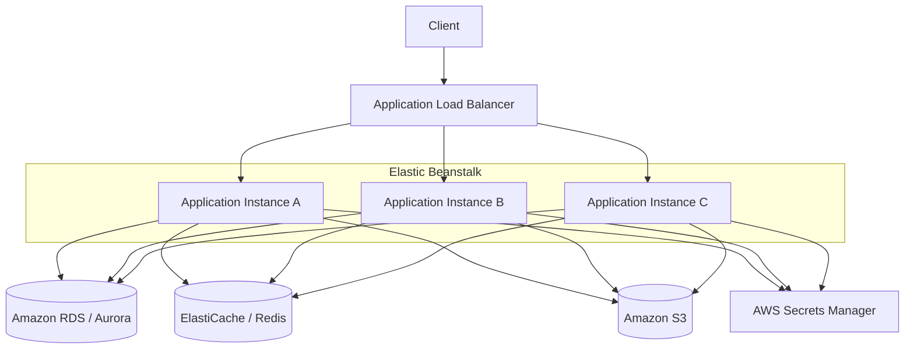
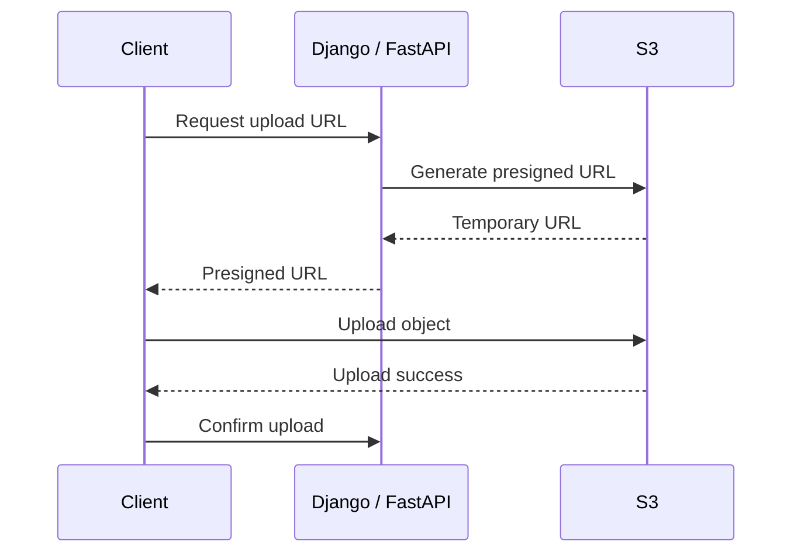
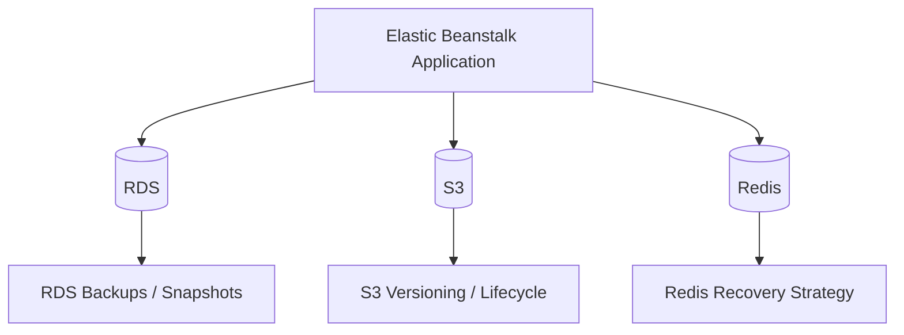
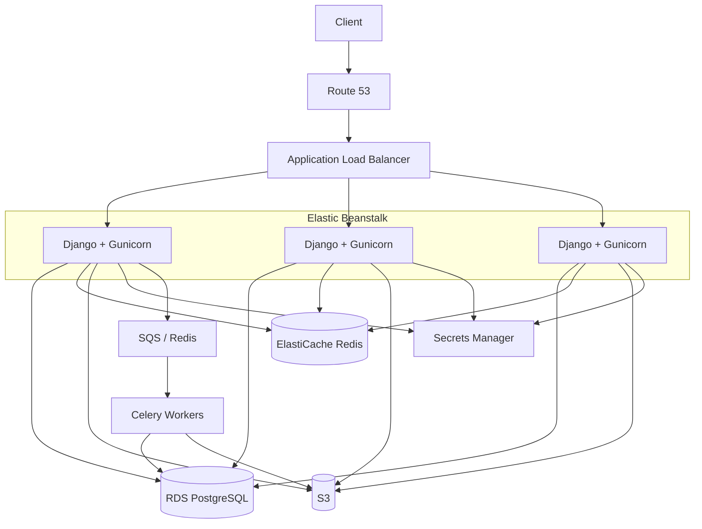

# 05- Database and Storage Architecture

## Overview

Elastic Beanstalk should primarily provide the application compute layer. Production databases, files, caches, and other persistent state should generally be externalized into services designed specifically for durability, availability, and operational management.

A typical production architecture separates compute from state:

```text
                         Internet
                            │
                            ▼
                     Load Balancer
                            │
                            ▼
                 Elastic Beanstalk
                 Application Instances
                  /       |       \
                 /        |        \
                ▼         ▼         ▼
              RDS       Redis       S3
           PostgreSQL    Cache      Objects
```

This separation is important because Elastic Beanstalk instances are replaceable. An instance can be terminated, replaced, scaled in, or recreated during deployment without requiring persistent application data to move with it.

The key architectural principle is:

> Keep compute disposable and keep durable state outside the Elastic Beanstalk instance.

For a Django or FastAPI application, the resulting system commonly looks like:

```text
Django / FastAPI
      │
      ├── PostgreSQL → RDS / Aurora
      ├── Redis      → ElastiCache
      ├── Files      → S3
      ├── Secrets    → Secrets Manager
      └── Tasks      → Celery + broker
```

## Stateful vs Stateless Architecture

The first distinction to make is between application compute and application state.

### Stateless Compute

An Elastic Beanstalk EC2 instance should ideally contain:

- Application code
- Runtime dependencies
- Temporary files
- Process state
- Short-lived request state

It should not be the authoritative location for:

- Database records
- User-uploaded files
- Shared sessions
- Durable job state
- Important logs
- Backups

A stateless fleet looks like:

```text
                  Load Balancer
                 /      |      \
                ▼       ▼       ▼
              EC2-A   EC2-B   EC2-C
                │       │       │
                └───────┼───────┘
                        │
                 Shared Services
```

Any instance can process any request.

### Stateful Services

Stateful services maintain information that must survive individual instance failures.

Typical examples:

```text
RDS        → relational data
S3         → object data
Redis      → cache / ephemeral shared state
Secrets    → credentials and configuration
```

The application tier consumes these services rather than owning the persistent state itself.

## Production Data Architecture

A common production backend architecture is:



Each service has a different responsibility:

| Service | Primary Responsibility | Durable |
|---|---|---|
| RDS / Aurora | Relational data | Yes |
| S3 | Object storage | Yes |
| ElastiCache / Redis | Cache and shared ephemeral state | Depends on configuration and use |
| Secrets Manager | Secrets | Yes |
| EC2 | Application compute | No |

The architecture should not use one service as a substitute for another simply because it is already available.

## Amazon RDS for Relational Data

For Django, FastAPI, and other backend applications that require relational data, Amazon RDS for PostgreSQL is a common production choice.

The architecture becomes:

```text
Elastic Beanstalk
       │
       │ PostgreSQL
       ▼
Amazon RDS
       │
       ▼
PostgreSQL
```

RDS manages much of the operational infrastructure around the database, including provisioning, backups, patching, monitoring integration, and high-availability configurations.

Elastic Beanstalk can also create a database as part of an environment, but for production systems the database is commonly managed independently so that its lifecycle is not tightly coupled to the application environment.

## Why Keep the Database Outside the Environment

Consider an application with:

```text
Elastic Beanstalk Environment
    │
    └── RDS
```

If the database lifecycle is tightly coupled to the application environment, deleting or recreating the environment can create unnecessary operational risk.

A better architecture is:

```text
Application Environment
        │
        ▼
Existing RDS
```

The database has an independent lifecycle.

This allows:

- Application deployments without database replacement
- Independent database scaling
- Independent backup policies
- Database reuse across application environments
- Blue/green application deployments
- Safer environment recreation

This separation is especially important when maintaining separate environments such as:

```text
Development
    │
    ▼
Staging
    │
    ▼
Production
```

Each environment should use the correct database boundary rather than accidentally sharing production state.

## RDS Multi-AZ

For availability-sensitive applications, the database should have its own high-availability design.

A Multi-AZ architecture can be represented as:

```text
              Application
                   │
                   ▼
                  RDS
             ┌─────┴─────┐
             ▼           ▼
         Primary       Standby
           AZ-A          AZ-B
```

The application connects through the managed database endpoint rather than directly targeting an individual database instance.

This is important because failover can change which underlying database instance serves as the primary.

Multi-AZ improves availability, but it is not a replacement for backups.

```text
Multi-AZ
   +
Backups
   +
Recovery Testing
```

are separate reliability mechanisms.

## RDS Read Replicas

Read replicas address a different problem from Multi-AZ.

### Multi-AZ

Primary goal:

```text
High Availability
```

### Read Replica

Primary goal:

```text
Read Scalability
```

Conceptually:

```text
                 Application
                     │
             ┌───────┴────────┐
             ▼                ▼
         Primary            Replica
         Database           Database
             │                │
          Writes           Reads
```

A read-replica architecture can be useful when:

- Read traffic is significantly higher than write traffic
- Reporting workloads are expensive
- Read-heavy endpoints need additional capacity

Do not assume that adding read replicas automatically improves every workload.

Applications must explicitly understand read/write routing and replication characteristics.

## Database Connection Management

A horizontally scaled application creates multiple database clients.

For example:

```text
EC2-A ──┐
EC2-B ──┼──► PostgreSQL
EC2-C ──┘
```

If each instance starts too many application workers, the total number of database connections can become unexpectedly large.

For example:

```text
3 EC2 instances
×
8 application workers
×
multiple connections
=
potentially high DB connection count
```

This can exhaust the database even when EC2 CPU utilization appears normal.

Production configuration should therefore consider:

- Worker count
- Connection lifetime
- Database connection limits
- Connection pooling
- Request concurrency
- Instance scaling
- Background workers

For PostgreSQL-heavy applications, a connection pooler such as PgBouncer may be appropriate at larger scale, depending on the application's connection behavior and deployment architecture.

## Django Database Configuration

A production Django application should obtain database configuration from environment-specific configuration or managed secrets rather than hard-coding credentials.

A simplified configuration might look like:

```python
import os

DATABASES = {
    "default": {
        "ENGINE": "django.db.backends.postgresql",
        "NAME": os.environ["DB_NAME"],
        "USER": os.environ["DB_USER"],
        "PASSWORD": os.environ["DB_PASSWORD"],
        "HOST": os.environ["DB_HOST"],
        "PORT": os.environ.get("DB_PORT", "5432"),
        "CONN_MAX_AGE": 60,
    }
}
```

The exact connection configuration should be tuned to the application's traffic pattern and database capacity.

Secrets should not be committed to source control.

## FastAPI Database Architecture

FastAPI applications commonly use SQLAlchemy, SQLModel, or another database layer.

The architecture remains the same:

```text
FastAPI
   │
   ▼
Database Connection Layer
   │
   ▼
RDS PostgreSQL
```

The framework does not change the underlying production requirement: database connections must be managed carefully when the application is horizontally scaled.

## Database Migrations

Database migrations are part of the storage architecture because application deployments and database schema changes are tightly coupled.

A production deployment should avoid destructive migrations that break the currently running application version.

A safer sequence is:

```text
Existing Schema
      │
      ▼
Expand Schema
      │
      ▼
Deploy Compatible Application
      │
      ▼
Migrate Data
      │
      ▼
Remove Obsolete Schema
```

For example:

```text
v1 application
     │
     ▼
Add nullable column
     │
     ▼
Deploy v2
     │
     ▼
Start writing new field
     │
     ▼
Backfill existing records
     │
     ▼
Remove old field later
```

This is especially important with rolling, immutable, and blue/green deployments where more than one application version can temporarily exist.

## Amazon S3 for Object Storage

User-generated files should generally be stored in Amazon S3 rather than on Elastic Beanstalk instances.

Examples include:

- Profile images
- Documents
- Reports
- Generated exports
- Media
- Backups
- Static assets

The architecture becomes:

```text
Client
   │
   ▼
Django / FastAPI
   │
   ▼
S3
```

The EC2 filesystem is temporary application storage, while S3 provides durable object storage.

## Why Local EC2 Storage Is Dangerous

Consider:

```text
User
 │
 ▼
EC2-A
 │
 └── upload.pdf
```

If EC2-A is terminated:

```text
EC2-A
  X
```

the application cannot assume that `upload.pdf` will still exist.

This becomes especially dangerous when requests are load-balanced:

```text
Request 1 → EC2-A → file created

Request 2 → EC2-B → file not found
```

The problem becomes more likely as the application scales.

The correct pattern is:

```text
Request 1 → EC2-A ─┐
                   ├──► S3
Request 2 → EC2-B ─┘
```

Both instances access the same durable object store.

## Direct-to-S3 Uploads

For large uploads, the application does not necessarily need to proxy the entire file through EC2.

A better architecture can be:

```text
Client
   │
   │ Request upload authorization
   ▼
Backend API
   │
   │ Presigned URL
   ▼
Client
   │
   │ Upload directly
   ▼
S3
```

The application remains responsible for authorization while S3 handles the large object transfer.

This reduces:

- EC2 bandwidth consumption
- Application worker usage
- Request duration
- Application memory pressure

## S3 Presigned URLs

A presigned URL grants temporary access to an S3 object operation.

A typical flow is:



The URL should have:

- Limited lifetime
- Limited permissions
- Appropriate object key
- Appropriate content constraints

Do not expose long-lived credentials to clients.

## S3 Object Organization

Use predictable object-key structures.

For example:

```text
uploads/
├── users/
│   ├── 1001/
│   │   ├── profile/
│   │   └── documents/
│   └── 1002/
│       └── documents/
└── reports/
    └── 2026/
```

The object key should generally not be treated as the application's primary metadata store.

Store important metadata in PostgreSQL:

```text
PostgreSQL
    │
    ├── object_id
    ├── owner_id
    ├── object_key
    ├── content_type
    ├── created_at
    └── status
              │
              ▼
             S3
```

This allows the database to enforce relationships and business rules while S3 stores the actual object bytes.

## S3 Versioning

S3 Versioning can protect against accidental overwrites and deletions.

Conceptually:

```text
report.pdf
   │
   ├── Version 1
   ├── Version 2
   └── Version 3
```

Versioning is particularly useful for:

- Important documents
- Configuration artifacts
- Critical object repositories
- Recovery from accidental deletion

Versioning increases storage usage, so lifecycle policies should be considered.

## S3 Lifecycle Policies

Objects often have different retention requirements over time.

A lifecycle policy can transition or delete objects based on age and storage requirements.

For example:

```text
Active
  │
  ▼
Older
  │
  ▼
Archive
  │
  ▼
Delete
```

Lifecycle policies can reduce storage cost, but they should never be applied without understanding retention and recovery requirements.

## S3 Security

S3 buckets should normally remain private.

A secure architecture is:

```text
Application
    │
    │ IAM
    ▼
Private S3 Bucket
```

Avoid making the entire bucket publicly readable simply because the application needs to serve uploaded files.

For private objects, use:

- IAM authorization
- Presigned URLs
- CloudFront signed access where appropriate
- Bucket policies
- Encryption

## S3 Encryption

S3 supports server-side encryption.

For sensitive workloads, choose the encryption configuration according to organizational and compliance requirements.

Common choices include:

- SSE-S3
- SSE-KMS

With KMS-based encryption:

```text
Application
    │
    ▼
S3
    │
    ▼
AWS KMS
```

IAM and KMS permissions must both be configured correctly.

## Redis and Cache Storage

Redis is different from RDS and S3.

Redis is commonly used for:

- Caching
- Sessions
- Rate limiting
- Distributed locks
- Short-lived application state
- Celery broker/result state depending on architecture

A common backend architecture is:

```text
Django / FastAPI
       │
       ▼
      Redis
       │
       ├── Cache
       ├── Sessions
       └── Coordination
```

The appropriate resilience model depends on how Redis is being used.

## Cache-Only Redis

If Redis is purely a cache:

```text
Application
    │
    ▼
Redis
    │
    ├── Hit → Return data
    │
    └── Miss → Query PostgreSQL
```

Redis failure should ideally degrade performance rather than make the entire application unavailable.

```text
Redis unavailable
       │
       ▼
Cache bypass
       │
       ▼
PostgreSQL
```

This pattern requires careful protection against a sudden database load spike caused by mass cache misses.

## Cache Stampede

A cache failure or mass expiration can create a cache stampede.

```text
1000 requests
      │
      ▼
Cache miss
      │
      ▼
1000 database queries
      │
      ▼
Database overloaded
```

Mitigation techniques include:

- Request coalescing
- Short locking
- Randomized TTLs
- Background refresh
- Stale-while-revalidate patterns
- Appropriate cache warming

The correct strategy depends on the workload.

## Redis High Availability

For production-critical Redis workloads, use an appropriate managed Redis deployment rather than running Redis directly on an Elastic Beanstalk application instance.

Conceptually:

```text
Application
 /    |    \
▼     ▼     ▼
Redis Managed Service
        │
   High Availability
```

The exact topology depends on the AWS Redis service and configuration being used.

The important architectural rule is:

> Do not make an Elastic Beanstalk EC2 instance the single source of truth for shared Redis state.

## Celery Storage Architecture

A Django or FastAPI application may use Celery for asynchronous processing.

A typical architecture is:

```text
Django / FastAPI
       │
       ▼
Redis / SQS / Broker
       │
       ▼
Celery Workers
       │
       ├── PostgreSQL
       └── S3
```

For example:

```text
API
 │
 ▼
Queue
 │
 ▼
Celery Worker
 │
 ├── Generate report
 ├── Store report in S3
 └── Update PostgreSQL
```

The worker should not depend on local files surviving across instances.

## Kafka and Durable Events

Kafka should be treated differently from a cache.

If Kafka is used:

```text
Application
    │
    ▼
Kafka
    │
    ├── Consumer A
    ├── Consumer B
    └── Consumer C
```

Kafka may provide durable event streaming and replay depending on its configuration.

Use Kafka when the system actually requires:

- Event streaming
- Durable event processing
- Replay
- Consumer groups
- High-throughput pipelines

Do not use Redis as a substitute for Kafka when durable event-stream semantics are required.

## Storage Decision Matrix

| Requirement | Service |
|---|---|
| Relational transactions | RDS / Aurora PostgreSQL |
| Large binary objects | S3 |
| Frequently accessed cached data | Redis |
| Shared ephemeral state | Redis |
| Application secrets | Secrets Manager |
| Durable event stream | Kafka |
| Asynchronous task queue | SQS / Celery broker |
| Application logs | CloudWatch Logs |

The correct service depends on data semantics, not simply data size.

## Database vs Object Storage

A common architectural mistake is storing large binary files directly in PostgreSQL.

For example:

```text
PostgreSQL
 └── 2 GB video
```

For many applications, a better design is:

```text
PostgreSQL
 └── Metadata + S3 object key

S3
 └── 2 GB video
```

PostgreSQL remains responsible for transactional metadata while S3 handles object storage.

This reduces database storage pressure and keeps database backups smaller.

## Database vs Redis

Do not use Redis as a replacement for PostgreSQL when the application requires durable relational state.

Bad:

```text
User Account
   │
   ▼
Redis only
```

Better:

```text
User Account
   │
   ▼
PostgreSQL
   │
   └── Redis cache
```

Redis can cache database state:

```text
PostgreSQL
    │
    ▼
Redis
    │
    ▼
API
```

The database remains authoritative.

## Storage Consistency

Applications often maintain references across PostgreSQL and S3.

For example:

```text
PostgreSQL
 └── document_id = 42
     object_key = documents/42/report.pdf

S3
 └── documents/42/report.pdf
```

The application must handle partial failures.

Possible sequence:

```text
Create DB record
      │
      ▼
Upload S3 object
      │
      X
Upload fails
```

Now the database contains metadata for an object that does not exist.

Alternatively:

```text
Upload S3
   │
   ▼
Create DB record
   │
   X
DB transaction fails
```

Now S3 contains an object with no corresponding database record.

Production systems should therefore define an explicit consistency strategy.

Possible techniques include:

- Transactional status fields
- Asynchronous cleanup
- Reconciliation jobs
- Idempotent uploads
- Object lifecycle policies
- Periodic consistency checks

## Storage State Machine

For document uploads, a state model can be useful:

```text
PENDING
   │
   ▼
UPLOADING
   │
   ▼
AVAILABLE
   │
   ├──► DELETED
   │
   └──► FAILED
```

The database can track the object's lifecycle while S3 stores the actual bytes.

This makes partial failures observable and recoverable.

## Backup Architecture

Backups should cover every durable data source.



Backup requirements should be based on:

- RPO
- RTO
- Data criticality
- Retention
- Compliance
- Recovery cost

## RPO and RTO

### Recovery Point Objective

RPO answers:

> How much data can the business afford to lose?

For example:

```text
RPO = 15 minutes
```

means the recovery strategy should aim to lose no more than approximately 15 minutes of data.

### Recovery Time Objective

RTO answers:

> How quickly must the system be restored?

For example:

```text
RTO = 1 hour
```

means the recovery process should restore service within approximately one hour.

These requirements determine the appropriate backup and disaster recovery architecture.

## Database Backup Strategy

For RDS, production backup planning should consider:

- Automated backups
- Retention period
- Manual snapshots
- Point-in-time recovery
- Cross-region recovery requirements
- Restore testing

A snapshot that has never been restored is not proof of a working recovery strategy.

A useful operational procedure is:

```text
Backup
  │
  ▼
Restore
  │
  ▼
Validate schema
  │
  ▼
Validate application connectivity
  │
  ▼
Validate critical data
```

## S3 Backup and Recovery

S3 has strong durability characteristics, but application recovery requirements still need explicit design.

Useful mechanisms include:

- Versioning
- Lifecycle policies
- Replication where required
- Object Lock where compliance requires it
- Cross-region replication where appropriate

The correct configuration depends on the business recovery requirements.

## Disaster Recovery Architecture

A production application should distinguish between:

```text
High Availability
        │
        ▼
Multi-AZ
```

and:

```text
Disaster Recovery
        │
        ▼
Backups / Replication / Multi-Region
```

A Multi-AZ database protects against an Availability Zone failure but does not protect against every form of data corruption or Regional failure.

For higher recovery requirements:

```text
Region A
│
├── Elastic Beanstalk
├── RDS
└── S3
       │
       │ Replication / Backup
       ▼
Region B
│
├── Elastic Beanstalk
├── RDS
└── S3
```

Multi-region storage and database architectures introduce significant complexity and should be justified by the application's RTO and RPO.

## Storage Security

Production storage should follow least privilege.

A typical trust model is:

```text
Elastic Beanstalk IAM Role
          │
          ├── Read/write required S3 objects
          │
          ├── Retrieve required secrets
          │
          └── Access required AWS services
```

The application should not receive unrestricted access to every S3 bucket or AWS resource.

For example, avoid permissions equivalent to:

```text
s3:*
Resource: *
```

when the application only needs access to one bucket or prefix.

## IAM for S3 Access

Use IAM roles attached to EC2 instances rather than embedding AWS access keys in the application.

Conceptually:

```text
EC2
 │
 ▼
Instance Profile / IAM Role
 │
 ▼
AWS API
 │
 ▼
S3
```

The application can use the AWS SDK without storing long-lived credentials in source code.

For Python:

```python
import boto3

s3 = boto3.client("s3")

s3.upload_file(
    "/tmp/report.pdf",
    "example-production-bucket",
    "reports/report.pdf",
)
```

The SDK can obtain credentials from the instance's IAM role.

## Storage Encryption

Sensitive data should use appropriate encryption at rest.

Typical architecture:

```text
Application
   │
   ▼
RDS / S3 / Redis
   │
   ▼
AWS-managed encryption
```

For stricter requirements, customer-managed KMS keys may be appropriate.

Consider:

- Key ownership
- Key rotation
- IAM permissions
- Audit requirements
- Cross-account access
- Backup encryption

Encryption does not replace access control.

## Monitoring Databases

Database monitoring should cover both infrastructure and application behavior.

Important signals include:

- CPU utilization
- Storage utilization
- Database connections
- Read latency
- Write latency
- IOPS
- Throughput
- Lock contention
- Slow queries
- Replica lag where applicable

A database can appear healthy from an infrastructure perspective while the application experiences severe query latency.

Application-level metrics should therefore complement RDS metrics.

## Monitoring S3

Useful S3 operational signals include:

- Request failures
- Object counts
- Storage growth
- Unexpected deletion
- Replication status where applicable
- Access patterns
- Lifecycle behavior

CloudTrail can also provide auditing of API activity when configured.

## Monitoring Redis

Important Redis signals include:

- Memory usage
- Evictions
- CPU
- Connections
- Cache hit ratio
- Latency
- Replication health where applicable

A low cache hit ratio may indicate:

- Poor cache keys
- Very short TTLs
- Insufficient memory
- Incorrect invalidation
- Uncacheable workloads

## Storage Cost Management

Storage architecture has direct cost implications.

| Resource | Main Cost Drivers |
|---|---|
| RDS | Instance, storage, I/O, backups |
| S3 | Storage, requests, data transfer |
| Redis | Node size and runtime |
| NAT | Hourly and data processing |
| CloudWatch | Logs and metrics |
| KMS | Key usage and API requests |

Common optimization techniques include:

- S3 lifecycle policies
- Appropriate object storage classes
- Database storage monitoring
- Removal of obsolete snapshots
- Cache sizing
- Log retention policies
- VPC endpoints where appropriate

Do not optimize cost by removing required redundancy from critical data.

## Production Pitfalls

### Storing Uploads on EC2

Bad:

```text
EC2
└── media/
```

Use:

```text
S3
└── media/
```

### Creating the Database Inside Every Environment

A database should usually have an independent lifecycle in production.

Avoid accidentally coupling database destruction to application-environment recreation.

### Treating Redis as the Primary Database

Redis is excellent for caching and certain ephemeral/shared-state workloads, but PostgreSQL should remain the system of record for relational business data.

### Ignoring Database Connection Limits

Scaling from two to ten EC2 instances can multiply database connections.

Always calculate:

```text
instances
×
workers per instance
×
connections per worker
```

and compare the result with database capacity.

### No Backup Restore Testing

A successful backup job does not prove successful recovery.

Regularly test restoration.

### Public S3 Buckets by Default

Making a bucket public to simplify file access creates unnecessary security exposure.

Prefer private buckets and controlled access.

### Storing AWS Credentials in `.env`

Avoid long-lived AWS access keys in application configuration.

Use IAM roles for AWS workloads.

### Using One Service for Every Data Type

Do not put everything into PostgreSQL or everything into Redis.

Choose storage based on data semantics:

```text
Relational data → PostgreSQL
Objects         → S3
Cache           → Redis
Events          → Kafka
Secrets         → Secrets Manager
```

### Ignoring Cross-Service Consistency

PostgreSQL and S3 do not share one transaction.

Applications must explicitly handle partial failures between the systems.

## Production Architecture Example

A realistic Django production system might look like:



The responsibilities are deliberately separated:

```text
Elastic Beanstalk → Compute
RDS               → Relational persistence
Redis             → Cache / shared ephemeral state
S3                → Object storage
SQS / Redis       → Async task delivery
Celery            → Background processing
Secrets Manager   → Credentials
```

## Production Storage Checklist

### Database

- [ ] Production database has an independent lifecycle.
- [ ] RDS / Aurora is used instead of local EC2 database storage.
- [ ] Multi-AZ requirements are defined.
- [ ] Database connection limits are understood.
- [ ] Connection pooling is evaluated.
- [ ] Automated backups are enabled.
- [ ] Point-in-time recovery requirements are defined.
- [ ] Restore procedures are tested.
- [ ] Database migrations are backward compatible.
- [ ] Database credentials are managed securely.

### Object Storage

- [ ] User uploads are stored in S3.
- [ ] S3 buckets are private unless public access is explicitly required.
- [ ] IAM permissions use least privilege.
- [ ] Presigned URLs are used for appropriate direct-upload/download workflows.
- [ ] Versioning is enabled where recovery requirements justify it.
- [ ] Lifecycle policies are configured where appropriate.
- [ ] Encryption requirements are defined.
- [ ] Object/database consistency is handled explicitly.

### Redis

- [ ] Redis is external to Elastic Beanstalk instances.
- [ ] Redis is private.
- [ ] Security groups restrict access.
- [ ] Cache failure behavior is defined.
- [ ] Memory and eviction behavior are monitored.
- [ ] Redis availability matches its role in the application.

### Application Instances

- [ ] EC2 instances do not contain authoritative persistent data.
- [ ] Local files are treated as temporary.
- [ ] Application logs are centralized.
- [ ] IAM roles are used instead of long-lived AWS credentials.
- [ ] Instance replacement does not cause data loss.

### Disaster Recovery

- [ ] RPO is defined.
- [ ] RTO is defined.
- [ ] Database backups are tested.
- [ ] S3 recovery requirements are defined.
- [ ] Critical storage dependencies have documented recovery procedures.
- [ ] Multi-region requirements have been evaluated where necessary.

## Interview Perspective

### Why should the database not live on the Elastic Beanstalk EC2 instance?

Because EC2 instances in an Auto Scaling environment are disposable.

Replacing an instance should not destroy application data.

Use a managed persistent database such as RDS instead.

### Why should uploaded files be stored in S3?

Because the Elastic Beanstalk fleet is horizontally scalable and instances can be replaced.

S3 provides a shared durable storage layer accessible by every application instance.

### What happens if a user uploads a file to EC2-A and the next request reaches EC2-B?

If the file was stored only on EC2-A's local filesystem, EC2-B cannot reliably access it.

The correct architecture is to store the file in S3.

### What is the difference between RDS Multi-AZ and read replicas?

Multi-AZ primarily addresses database availability and failover.

Read replicas primarily address read scalability and certain replication-based use cases.

They solve different problems.

### Why is database connection management important with Elastic Beanstalk?

Because Auto Scaling multiplies application instances and application workers.

For example:

```text
5 instances
×
6 workers
×
connections
```

can produce significantly more database connections than a developer expects.

Database capacity must therefore be considered together with application scaling.

### Should Redis be used as the primary database?

Generally no for relational business data.

A common architecture is:

```text
PostgreSQL → Source of truth
Redis      → Cache
```

### Why use S3 instead of PostgreSQL for large files?

S3 is designed for object storage and scales independently from the relational database.

The database can store metadata and object references while S3 stores the file bytes.

### How would you design storage for a Django application on Elastic Beanstalk?

A strong answer would be:

```text
Django
 │
 ├── RDS PostgreSQL → relational data
 ├── Redis → cache / sessions where appropriate
 ├── S3 → media and static objects
 ├── Secrets Manager → credentials
 └── Celery + queue → asynchronous processing
```

The EC2 instances remain stateless and replaceable.

### What happens if S3 succeeds but the database transaction fails?

The application can be left with an orphaned S3 object.

Production systems should handle this using mechanisms such as:

- Object status tracking
- Cleanup jobs
- Reconciliation
- Idempotent operations
- Lifecycle policies

This is a distributed consistency problem rather than something PostgreSQL transactions can automatically solve across S3.

## Key Takeaways

- Elastic Beanstalk should primarily provide disposable application compute, not persistent application storage.
- Keep relational data in RDS or Aurora rather than on EC2 instances.
- Keep user-generated objects and large files in S3 rather than local EC2 storage.
- Use Redis for caching and other appropriate ephemeral/shared-state workloads, not as an automatic replacement for PostgreSQL.
- Keep production databases independent from the Elastic Beanstalk environment lifecycle.
- RDS Multi-AZ and read replicas solve different problems: availability versus read scalability.
- Database connection limits become increasingly important as Elastic Beanstalk scales application instances and workers.
- Database migrations must remain compatible with application versions that may temporarily coexist during deployment.
- S3 presigned URLs can move large file transfers away from application servers.
- S3 object metadata and business relationships should generally remain in PostgreSQL while S3 stores the actual object.
- PostgreSQL and S3 do not share a transaction boundary, so applications must explicitly handle partial failures.
- IAM roles should be used for AWS access from Elastic Beanstalk instances instead of long-lived access keys.
- Storage services should remain private and use least-privilege access wherever possible.
- Backups are only useful when restoration has been tested against the application's RPO and RTO.
- High availability, backup, and disaster recovery are separate concerns and should be designed independently.
- The production storage architecture should make EC2 replacement, horizontal scaling, deployment, and disaster recovery safe operations.