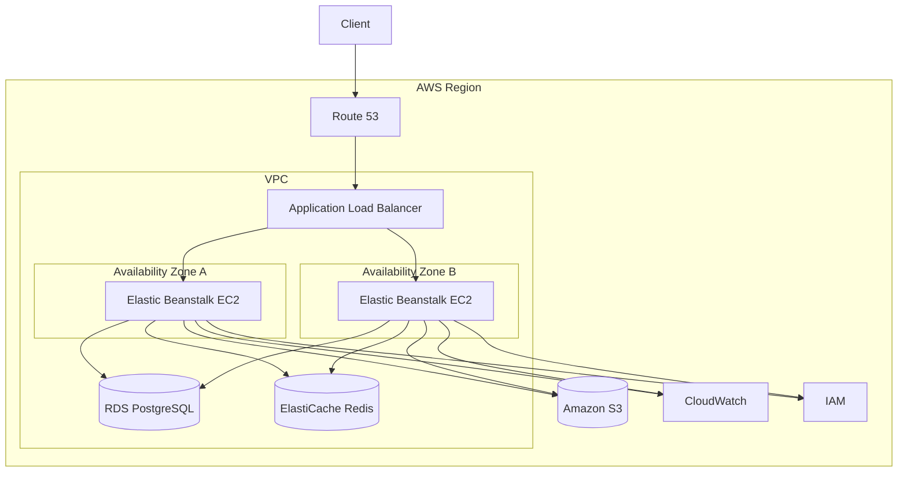

# README

## Overview

Amazon Elastic Beanstalk is an AWS managed application platform for deploying and operating backend applications without manually managing the complete underlying compute and deployment stack.

For backend engineers, Elastic Beanstalk is best understood as an application deployment and environment-management layer built on top of AWS infrastructure such as:

- EC2
- Auto Scaling
- Elastic Load Balancing
- VPC
- Security Groups
- CloudWatch
- IAM
- S3

It is particularly useful for deploying applications built with Python, Django, FastAPI, and other supported runtimes when the team wants AWS-managed environment orchestration without directly managing every EC2 lifecycle operation.

This section focuses on the **architecture of production Elastic Beanstalk environments**, including compute, availability, networking, databases, storage, security boundaries, and operational design.

## Architecture Topics

| File | Topic | Focus |
|---|---|---|
| [01- Elastic Beanstalk Architecture](./01-Elastic%20Beanstalk%20Architecture.md) | Core Architecture | Elastic Beanstalk environment architecture, major components, request flow, deployment model, and relationship with underlying AWS services |
| [02- High Availability Architecture](./02-%20High%20Availability%20Architecture.md) | High Availability | Multi-AZ architecture, Auto Scaling, load balancing, failure isolation, deployment availability, and resilience |
| [03- Production Architecture](./03-%20Production%20Architecture.md) | Production Architecture | Production-grade environment design, scalability, reliability, security, monitoring, deployment, and operational considerations |
| [04- Networking Architecture](./04-%20Networking%20Architecture.md) | Networking | VPC, public/private subnets, route tables, Internet Gateway, NAT Gateway, security groups, ALB networking, and internal service communication |
| [05- Database and Storage Architecture](./05-%20Database%20and%20Storage%20Architecture.md) | Data and Storage | RDS, PostgreSQL, Redis, S3, persistent storage, backups, database connectivity, object storage, and disaster recovery |

## Recommended Reading Order

The documents are intentionally ordered from architecture fundamentals toward production implementation.

```text
01- Elastic Beanstalk Architecture
              │
              ▼
02- High Availability Architecture
              │
              ▼
03- Production Architecture
              │
              ▼
04- Networking Architecture
              │
              ▼
05- Database and Storage Architecture
```

### Start with the Core Architecture

Read [01- Elastic Beanstalk Architecture](./01-Elastic%20Beanstalk%20Architecture.md) first.

Understand:

- Elastic Beanstalk environments
- Application versions
- Environment configuration
- EC2 instances
- Auto Scaling
- Load balancing
- Deployment flow
- Health monitoring
- Relationship between Elastic Beanstalk and underlying AWS resources

### Then Study High Availability

Read [02- High Availability Architecture](./02-%20High%20Availability%20Architecture.md).

Focus on:

- Availability Zones
- Auto Scaling
- Load balancer redundancy
- Multi-AZ application placement
- Instance replacement
- Failure isolation
- Deployment availability
- Recovery behavior

### Then Study Production Architecture

Read [03- Production Architecture](./03-%20Production%20Architecture.md).

This connects the individual components into a production-oriented backend architecture.

Focus on:

- Stateless application design
- Scaling
- Deployment strategies
- Security boundaries
- Monitoring
- Reliability
- Cost considerations
- Operational practices
- Disaster recovery

### Then Study Networking

Read [04- Networking Architecture](./04-%20Networking%20Architecture.md).

Focus on:

- VPC architecture
- Public and private subnets
- Internet Gateway
- NAT Gateway
- Route tables
- Security groups
- ALB networking
- Internal services
- DNS
- VPC endpoints

The networking document is particularly important for understanding why a production Elastic Beanstalk environment can expose a public load balancer while keeping application instances private.

### Finish with Database and Storage Architecture

Read [05- Database and Storage Architecture](./05-%20Database%20and%20Storage%20Architecture.md).

Focus on:

- RDS and PostgreSQL
- Database connectivity
- Database scaling
- Multi-AZ databases
- Read replicas
- S3
- Redis
- Persistent versus ephemeral state
- Backups
- Disaster recovery
- Storage security

This completes the separation between **stateless application compute** and **durable application state**.

## Architecture at a Glance

A typical production-oriented Elastic Beanstalk backend can be represented as:



The key architectural separation is:

```text
                 Public Ingress
                      │
                      ▼
                    ALB
                      │
             ┌────────┴────────┐
             ▼                 ▼
       Private EC2        Private EC2
             │                 │
             └────────┬────────┘
                      │
          ┌───────────┼───────────┐
          ▼           ▼           ▼
         RDS        Redis         S3
```

## Core Architectural Principles

### Keep Application Instances Stateless

Elastic Beanstalk instances should be replaceable.

Avoid treating an individual EC2 instance as the authoritative location for:

- Database records
- User uploads
- Shared application state
- Important logs
- Durable job state

Persistent state should live in appropriate managed services.

### Separate Public and Private Layers

A common production pattern is:

```text
Internet
   │
   ▼
Public ALB
   │
   ▼
Private Application Instances
   │
   ├── RDS
   ├── Redis
   └── AWS Services
```

This reduces the direct exposure of application infrastructure.

### Design for Instance Replacement

An Elastic Beanstalk environment can replace instances during:

- Scaling
- Failed health checks
- Platform updates
- Deployments
- Infrastructure changes

The application should continue functioning when an individual instance disappears.

### Design Across Availability Zones

Production workloads should avoid unnecessary single-AZ dependencies.

At minimum, evaluate:

- Load balancer placement
- Application instance placement
- Database availability
- NAT architecture
- Cache availability
- External dependencies

### Keep Data Outside Compute

A useful mental model is:

```text
Elastic Beanstalk → Compute
RDS               → Relational state
S3                → Object state
Redis             → Cache / ephemeral state
```

This separation makes scaling and deployment safer.

## Backend Application Context

For a Django application:

```text
Client
  │
  ▼
ALB
  │
  ▼
Elastic Beanstalk
  │
  ├── Nginx
  ├── Gunicorn
  └── Django
       │
       ├── PostgreSQL → RDS
       ├── Redis      → ElastiCache
       └── Media      → S3
```

For a FastAPI application:

```text
Client
  │
  ▼
ALB
  │
  ▼
Elastic Beanstalk
  │
  ├── Nginx
  ├── Uvicorn / Gunicorn
  └── FastAPI
       │
       ├── PostgreSQL → RDS
       ├── Redis      → ElastiCache
       └── Objects    → S3
```

The application framework changes, but the underlying infrastructure principles remain largely the same.

## Production Concerns Covered

This architecture section should be used together with the individual documents to understand:

| Concern | Primary Document |
|---|---|
| Core Elastic Beanstalk architecture | [01- Elastic Beanstalk Architecture](./01-Elastic%20Beanstalk%20Architecture.md) |
| High availability | [02- High Availability Architecture](./02-%20High%20Availability%20Architecture.md) |
| Production design | [03- Production Architecture](./03-%20Production%20Architecture.md) |
| Networking and security boundaries | [04- Networking Architecture](./04-%20Networking%20Architecture.md) |
| Database and persistent storage | [05- Database and Storage Architecture](./05-%20Database%20and%20Storage%20Architecture.md) |

The complete architecture should be evaluated across all of these dimensions rather than treating Elastic Beanstalk as only a deployment mechanism.

## Key Takeaways

- Elastic Beanstalk is an application platform built on underlying AWS infrastructure rather than a replacement for understanding that infrastructure.
- Production Elastic Beanstalk environments should generally use stateless, replaceable application instances.
- Public ingress and private application compute should be separated where appropriate.
- High availability requires deliberate multi-AZ architecture across the application and its dependencies.
- Networking design determines how clients, load balancers, application instances, databases, and AWS services communicate.
- RDS should normally provide durable relational storage rather than storing database state on EC2.
- S3 should generally provide durable object storage instead of relying on instance-local filesystems.
- Redis should be used according to its role as cache or shared ephemeral state rather than treated as a general-purpose database.
- Database, storage, networking, and compute should have independent operational and failure considerations.
- A production Elastic Beanstalk architecture should be designed around instance replacement, horizontal scaling, security, observability, recovery, and controlled deployment.