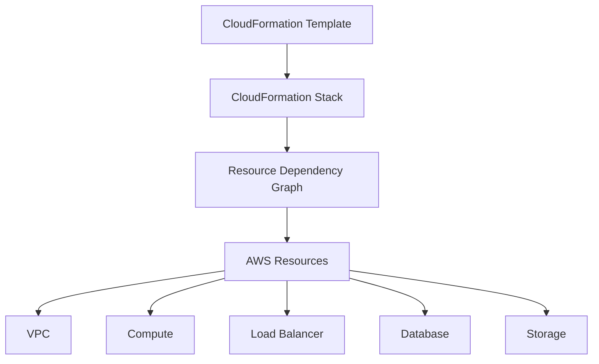
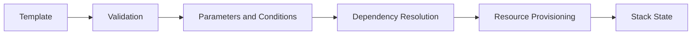
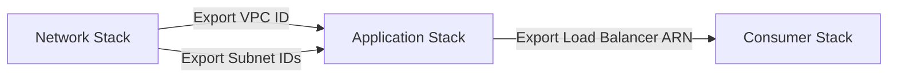
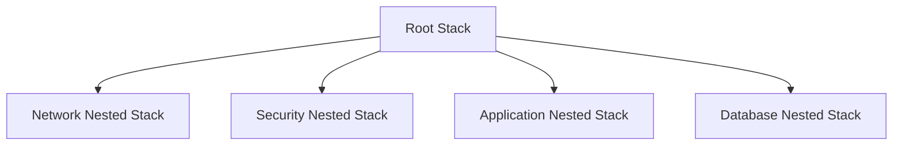
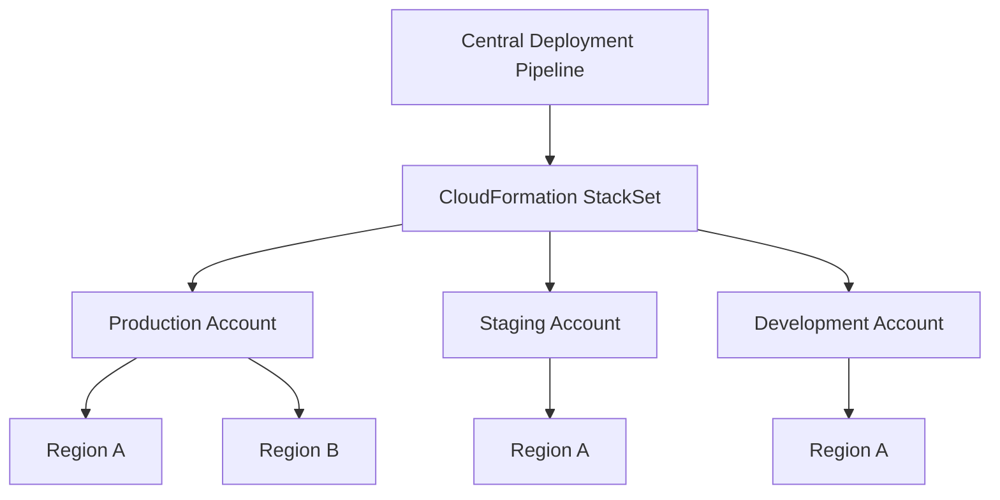
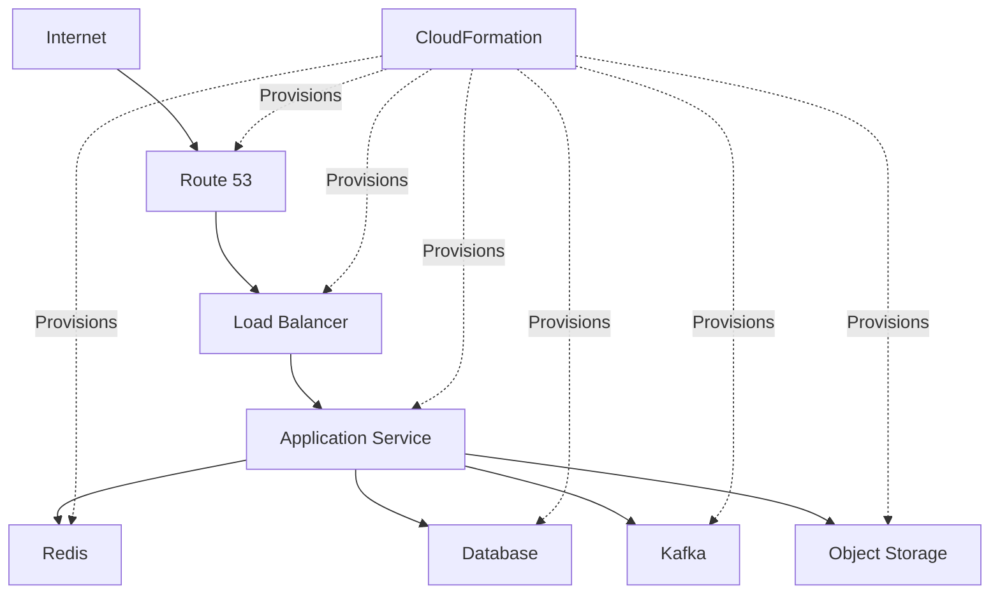
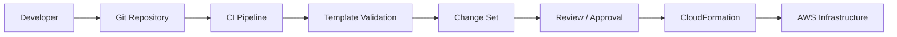
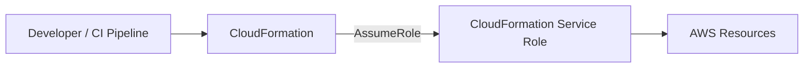
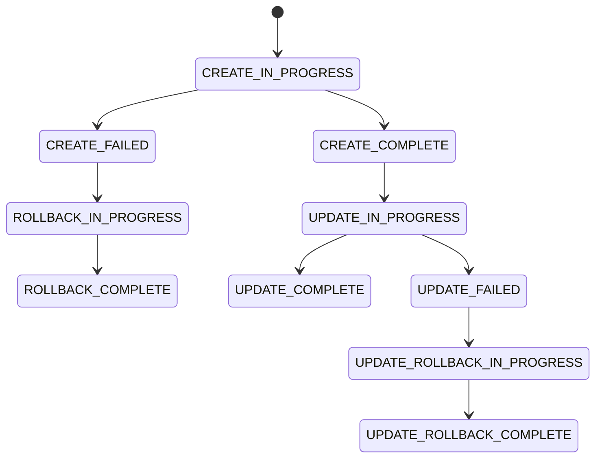
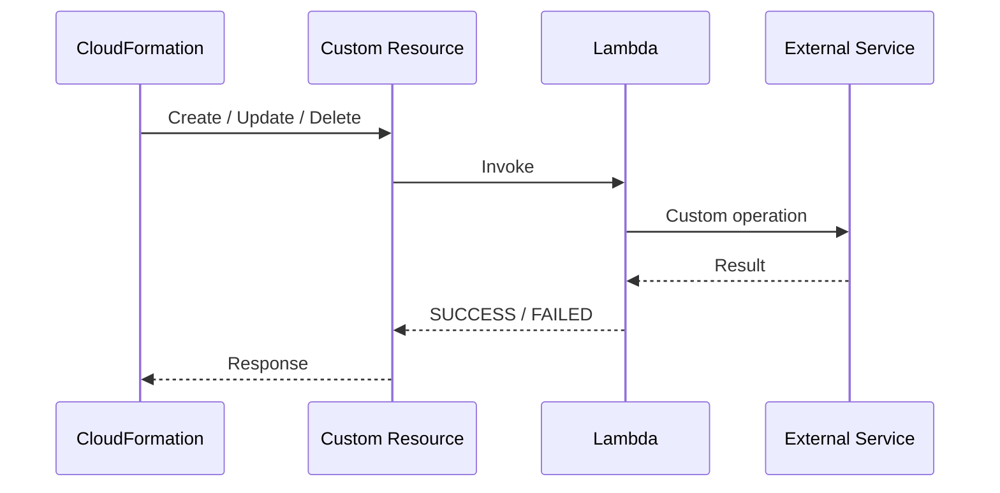

# 01- CloudFormation Architecture

## Overview

AWS CloudFormation provides an Infrastructure as Code (IaC) control plane for defining, provisioning, updating, and deleting AWS infrastructure from declarative templates. The central architectural unit is the **stack**, which groups related AWS resources and manages their lifecycle as a single deployment boundary.

A production CloudFormation architecture should separate infrastructure into logical stacks, control dependencies between those stacks, use reusable templates, and provide a controlled deployment path through version control and CI/CD.

The architecture can range from a single application stack to a multi-account, multi-region platform composed of nested stacks, cross-stack references, StackSets, service roles, and custom resources.

---

## Core CloudFormation Architecture

At a high level, the deployment flow is:



The template represents the **desired state**. CloudFormation interprets that desired state and manages the corresponding AWS resources.

A stack therefore acts as the operational boundary between the declarative configuration and the deployed infrastructure.

---

## Architecture Components

| Component | Responsibility |
|---|---|
| Template | Defines the desired infrastructure |
| Stack | Groups and manages related resources |
| Resources | Actual AWS infrastructure created by the stack |
| Parameters | Provide environment-specific deployment inputs |
| Mappings | Provide static configuration mappings |
| Conditions | Control conditional resource creation or configuration |
| Outputs | Expose important values from a stack |
| Change Sets | Preview infrastructure changes before execution |
| Service Role | Controls permissions used by CloudFormation |
| Nested Stack | Composes multiple CloudFormation templates |
| StackSet | Deploys stacks across multiple accounts and regions |
| Custom Resource | Extends CloudFormation with custom deployment logic |

---

## Template to Resource Flow

CloudFormation follows a declarative deployment model rather than requiring an imperative sequence of resource creation commands.



During deployment, CloudFormation evaluates the template, resolves references and dependencies, and creates or updates resources according to the resulting dependency graph.

This allows CloudFormation to determine resource creation order automatically when relationships are expressed through references such as `Ref` and `GetAtt`.

---

## Resource Dependency Architecture

Resources inside a stack do not necessarily execute sequentially.

For example:

```text
VPC
 |
 +-- Public Subnet
 |      |
 |      +-- Load Balancer
 |
 +-- Private Subnet
        |
        +-- Application Server
               |
               +-- RDS
```

CloudFormation can infer many dependencies from references between resources.

For example:

```yaml
Resources:

  ApplicationSubnet:
    Type: AWS::EC2::Subnet
    Properties:
      VpcId: !Ref ApplicationVPC

  ApplicationVPC:
    Type: AWS::EC2::VPC
    Properties:
      CidrBlock: 10.0.0.0/16
```

The reference:

```yaml
VpcId: !Ref ApplicationVPC
```

creates a dependency between the subnet and VPC.

CloudFormation therefore understands that the VPC must exist before the subnet can be created.

---

## Explicit Dependencies

When CloudFormation cannot infer a dependency automatically, `DependsOn` can be used.

```yaml
Resources:

  ApplicationServer:
    Type: AWS::EC2::Instance
    DependsOn: ApplicationRole
    Properties:
      ImageId: ami-xxxxxxxx
      InstanceType: t3.micro

  ApplicationRole:
    Type: AWS::IAM::Role
    Properties:
      AssumeRolePolicyDocument:
        Version: "2012-10-17"
        Statement:
          - Effect: Allow
            Principal:
              Service:
                - ec2.amazonaws.com
            Action:
              - sts:AssumeRole
```

Use explicit dependencies only when there is a genuine dependency that CloudFormation cannot derive automatically.

Overusing `DependsOn` makes the dependency graph unnecessarily rigid.

---

## Stack Boundary Design

A common production mistake is placing an entire AWS environment into one massive stack.

For example:

```text
Production Stack
├── VPC
├── Subnets
├── Security Groups
├── ALB
├── EC2
├── ECS
├── RDS
├── S3
├── IAM
└── Monitoring
```

This works for small environments but becomes difficult to maintain as infrastructure grows.

A more modular architecture can separate infrastructure by responsibility:

```text
Network Stack
├── VPC
├── Subnets
├── Route Tables
└── NAT Gateways

Security Stack
├── Security Groups
├── IAM Roles
└── Policies

Data Stack
├── RDS
└── Database Security

Application Stack
├── ECS / EC2
├── Load Balancer
└── Application Resources

Observability Stack
├── Log Groups
├── Alarms
└── Monitoring Resources
```

The correct boundary depends on resource lifecycle, ownership, dependency relationships, and deployment frequency.

---

## Stack Coupling

Stack decomposition should balance **modularity** against **coupling**.

Too few stacks:

```text
Large Stack
    ↓
Large Blast Radius
    ↓
Difficult Updates
```

Too many stacks:

```text
Many Small Stacks
    ↓
Many Dependencies
    ↓
Complex Deployment Ordering
```

A useful production boundary usually groups resources that:

- Share a lifecycle.
- Are managed by the same team.
- Change together.
- Have closely related ownership.
- Have a strong architectural relationship.

Avoid splitting resources merely to increase the number of stacks.

---

## Cross-Stack Architecture

When infrastructure is divided into multiple stacks, outputs can expose values required by another stack.



For example, the network stack can expose a VPC ID:

```yaml
Outputs:

  VpcId:
    Description: Application VPC ID
    Value: !Ref ApplicationVPC
    Export:
      Name: Application-VpcId
```

Another stack can consume it:

```yaml
Resources:

  ApplicationSecurityGroup:
    Type: AWS::EC2::SecurityGroup
    Properties:
      VpcId: !ImportValue Application-VpcId
      GroupDescription: Application security group
```

This creates a dependency between the stacks.

Cross-stack references are useful when the exported value represents a stable infrastructure contract.

---

## Cross-Stack Dependency Trade-Offs

Cross-stack references provide modularity but also introduce coupling.

| Approach | Advantage | Limitation |
|---|---|---|
| Single Stack | Simple dependency management | Large blast radius |
| Multiple Stacks | Independent lifecycle | Deployment coordination |
| Cross-Stack References | Strong infrastructure contracts | Creates stack coupling |
| Nested Stacks | Reusable composition | Parent stack controls lifecycle |
| External Configuration | Loose coupling | Requires configuration management |

Avoid creating unnecessary cross-stack references.

A stack should expose only the values that other stacks genuinely need.

---

## Nested Stack Architecture

Nested stacks allow a parent stack to compose multiple child templates.



A nested stack can be useful when a logical infrastructure component is large enough to deserve its own template but should still be managed as part of the parent stack lifecycle.

Example:

```text
Application Infrastructure
│
├── Root Template
│
├── network.yaml
├── security.yaml
├── application.yaml
└── database.yaml
```

Nested stacks are particularly useful for reusable infrastructure modules.

However, nested stacks remain part of the parent's lifecycle, so they should not be treated as completely independent deployment units.

---

## Nested Stacks vs Cross-Stack References

| Characteristic | Nested Stack | Cross-Stack Reference |
|---|---|---|
| Lifecycle | Parent-controlled | Independent stacks |
| Composition | Strong | Loose |
| Reuse | Template composition | Shared infrastructure |
| Deployment | Parent deployment | Separate deployments |
| Coupling | Higher lifecycle coupling | Value dependency |
| Best Use | Modular application infrastructure | Shared infrastructure contracts |

Use nested stacks when components should be deployed together.

Use separate stacks with outputs when components have independent lifecycles.

---

## Enterprise Multi-Account Architecture

CloudFormation can be used with AWS Organizations and StackSets to distribute infrastructure across multiple accounts and regions.



This model is useful for organization-wide infrastructure such as:

- IAM-related baseline resources.
- Logging infrastructure.
- Security controls.
- Networking components.
- Standard monitoring resources.
- Compliance infrastructure.

StackSets provide centralized deployment of CloudFormation stacks across multiple AWS accounts and regions.

---

## Multi-Region Architecture

For workloads requiring regional redundancy, CloudFormation templates can be deployed independently into multiple AWS regions.

```text
                    Deployment Pipeline
                           |
                    CloudFormation
                           |
             +-------------+-------------+
             |                           |
         Region A                    Region B
             |                           |
       Application Stack          Application Stack
             |                           |
          Database                  Database
```

The infrastructure template should avoid unnecessary region-specific hardcoding.

Pseudo parameters such as:

```yaml
!Ref AWS::Region
```

can make templates more portable across regions.

Mappings can also be used when static region-specific configuration is required.

---

## Production Application Architecture

A backend application deployed with CloudFormation may have infrastructure organized as:



CloudFormation does not replace the runtime architecture of the application. It defines and manages the infrastructure required to implement that architecture.

For a Django or FastAPI microservice environment, CloudFormation may provision:

- VPC and subnets.
- Load balancers.
- ECS or EC2 compute.
- IAM roles.
- RDS PostgreSQL.
- ElastiCache Redis.
- S3 buckets.
- Kafka infrastructure.
- CloudWatch resources.
- Security groups.
- Networking components.

---

## CloudFormation Deployment Architecture

Production deployments should generally flow through version control and CI/CD rather than manual console changes.



A typical pipeline can perform:

1. Template validation.
2. Static analysis or linting.
3. Security checks.
4. Change Set creation.
5. Change review.
6. Change Set execution.
7. Deployment verification.
8. Monitoring and rollback handling.

This creates a controlled deployment path and reduces configuration drift.

---

## Service Role Architecture

Production CloudFormation deployments can use a dedicated service role.



The service role provides a consistent permission boundary for infrastructure deployments.

This is preferable to granting every deployment user broad permissions across all AWS resources.

The role should follow least privilege and grant only the permissions required by the templates it manages.

---

## Change Set Architecture

Change Sets provide a deployment safety boundary between a template change and the actual infrastructure update.

```text
Current Infrastructure
        |
        v
Updated Template
        |
        v
Create Change Set
        |
        v
Review Proposed Changes
        |
        v
Approve
        |
        v
Execute Change Set
        |
        v
Updated Infrastructure
```

This is particularly important for production infrastructure where an apparently small template change may result in resource replacement.

For example:

```text
Database Change
      |
      +--> Modify
      |
      +--> Replace
      |
      +--> Delete
```

The replacement behavior should be reviewed before executing the deployment.

---

## Rollback Architecture

CloudFormation provides rollback behavior when stack operations fail.



Rollback helps prevent partially deployed infrastructure from remaining after failed operations.

However, rollback is not a substitute for deployment validation.

A production pipeline should reduce the probability of failure before execution through:

- Template validation.
- Change Set review.
- IAM validation.
- Dependency verification.
- Environment-specific testing.
- Controlled rollout procedures.

---

## Custom Resource Architecture

Custom Resources extend CloudFormation when native resource types cannot perform a required operation.



Typical use cases include:

- Third-party integrations.
- External API calls.
- Custom configuration.
- Dynamic values.
- Operations unsupported by native CloudFormation resources.

A custom resource introduces additional operational complexity because deployment success now depends on the custom implementation.

The implementation should therefore be:

- Idempotent.
- Observable.
- Explicit about Create, Update, and Delete behavior.
- Resilient to retries.
- Securely permissioned.
- Properly instrumented with logs.

---

## Failure Domains

CloudFormation architecture should consider failure domains at multiple levels.

```text
Template
   |
   +-- Syntax / Validation Failure
   |
   +-- Permission Failure
   |
   +-- Dependency Failure
   |
   +-- Resource Provisioning Failure
   |
   +-- Custom Resource Failure
   |
   +-- Stack Update Failure
```

A failure in one resource can affect the overall stack operation.

For this reason, stack boundaries should align with meaningful operational and ownership boundaries rather than arbitrary resource counts.

---

## Architecture Design Principles

### Prefer Declarative Infrastructure

Define the desired infrastructure in templates and let CloudFormation manage resource lifecycle.

Avoid imperative scripts that manually create and modify individual resources when CloudFormation can manage them declaratively.

### Keep Templates Modular

Avoid extremely large templates.

Use nested stacks or separate stacks when infrastructure has clear boundaries.

### Minimize Hardcoded Values

Prefer:

- Parameters for deployment-specific values.
- Pseudo parameters for AWS context.
- Mappings for static configuration.
- Outputs for infrastructure contracts.

### Control Deployment Risk

Use Change Sets for important production changes.

Treat infrastructure changes with the same discipline as application code changes.

### Avoid Manual Production Changes

Manual changes can create configuration drift between the declared CloudFormation state and the actual infrastructure.

The preferred flow is:

```text
Change Template
      ↓
Code Review
      ↓
CI Validation
      ↓
Change Set
      ↓
Approval
      ↓
CloudFormation Update
```

### Use Least Privilege

CloudFormation service roles should not receive unrestricted administrative permissions unless there is a specific architectural requirement.

### Design for Independent Lifecycles

Resources that change independently should generally not be forced into the same stack.

For example, a shared networking layer may have a much slower lifecycle than application compute resources.

---

## Architecture Anti-Patterns

| Anti-Pattern | Problem | Better Approach |
|---|---|---|
| One massive stack | Large blast radius | Modular stack boundaries |
| Excessive stacks | High dependency complexity | Group related resources |
| Hardcoded regions | Poor portability | Pseudo parameters or mappings |
| Manual production changes | Configuration drift | Version-controlled templates |
| Direct production updates | Higher deployment risk | Change Sets and approvals |
| Broad service-role permissions | Security exposure | Least privilege |
| Excessive cross-stack references | Tight coupling | Stable infrastructure contracts |
| Overuse of nested stacks | Complex parent lifecycle | Use only for logical composition |
| Non-idempotent custom resources | Retry failures | Idempotent implementations |
| No deployment validation | Runtime failures | CI validation and linting |

---

## Backend Engineering Integration

CloudFormation is infrastructure orchestration rather than an application runtime.

For a Python backend, the relationship may look like:

```text
Git Repository
      |
      +-- Django / FastAPI Application
      |
      +-- CloudFormation Templates
               |
               +-- VPC
               +-- Load Balancer
               +-- ECS / EC2
               +-- PostgreSQL
               +-- Redis
               +-- Kafka
               +-- IAM
               +-- CloudWatch
```

The application code controls application behavior.

CloudFormation controls the infrastructure required to run that application.

This separation allows application and infrastructure changes to evolve independently while remaining version-controlled.

---

## Production Considerations

### High Availability

For production workloads:

- Deploy compute across multiple Availability Zones.
- Avoid single-instance infrastructure where availability requirements do not permit it.
- Use managed AWS services where appropriate.
- Design stack boundaries around failure and recovery requirements.

### Scalability

CloudFormation itself is not an application scaling mechanism.

It provisions scalable infrastructure such as:

- Auto Scaling groups.
- ECS services.
- Load balancers.
- Managed databases.
- Distributed storage.
- Messaging infrastructure.

Application-level scaling should remain independent of infrastructure provisioning.

### Reliability

Use:

- Change Sets.
- Rollback mechanisms.
- Stack policies where appropriate.
- Drift detection.
- Version-controlled templates.
- Automated validation.
- Controlled deployment pipelines.

### Security

Use:

- Dedicated CloudFormation service roles.
- Least-privilege IAM.
- Secure secret management.
- `NoEcho` where appropriate.
- Controlled IAM capabilities.
- CloudTrail auditing.
- Restricted deployment permissions.

Sensitive credentials should not be hardcoded into templates.

### Disaster Recovery

CloudFormation templates can serve as reproducible infrastructure definitions.

This makes them useful for rebuilding infrastructure in another region or environment, provided that:

- Data recovery is handled separately.
- Regional dependencies are understood.
- Templates are version controlled.
- Required artifacts are available.
- Recovery procedures are tested.

Infrastructure recreation alone does not constitute a complete disaster recovery strategy.

### Cost

CloudFormation itself is primarily an orchestration mechanism; the major cost comes from the AWS resources it provisions.

Architecture decisions should therefore consider:

- Resource lifecycle.
- Environment separation.
- NAT Gateway usage.
- Database sizing.
- Idle development environments.
- Multi-region infrastructure.
- Unused stacks and resources.

---

## Recommended Production Architecture

A mature CloudFormation environment can be organized as:

```text
                    Git Repository
                          |
                          v
                    CI/CD Pipeline
                          |
                 Template Validation
                          |
                    Change Set
                          |
                    Approval Gate
                          |
                          v
                 CloudFormation
                          |
          +---------------+---------------+
          |               |               |
          v               v               v
      Network          Security       Application
       Stack             Stack           Stack
          |               |               |
          +---------------+---------------+
                          |
                          v
                    Data / Platform
                       Stacks
```

For larger organizations:

```text
                    Central CI/CD
                          |
                          v
                    CloudFormation
                     StackSets
                          |
          +---------------+---------------+
          |               |               |
          v               v               v
       Account A       Account B       Account C
          |               |               |
       Region A         Region A         Region A
       Region B         Region B         Region B
```

The exact decomposition should be driven by ownership, lifecycle, dependencies, security boundaries, and operational requirements.

---

## Key Takeaways

- CloudFormation manages AWS infrastructure through declarative templates and stacks.
- A stack is both a deployment unit and a resource lifecycle boundary.
- CloudFormation builds a dependency graph from resource references and explicit dependencies.
- Large environments should use deliberate stack boundaries rather than one monolithic stack.
- Nested stacks are useful for modular composition when child resources should share the parent's lifecycle.
- Cross-stack references are useful for stable infrastructure contracts but introduce coupling.
- StackSets are appropriate for distributing infrastructure across multiple AWS accounts and regions.
- Change Sets provide an important safety mechanism for reviewing production infrastructure changes.
- Service roles provide a consistent and controlled permission model for CloudFormation deployments.
- Custom Resources extend CloudFormation but introduce additional failure and operational complexity.
- Version control, CI/CD, least privilege, validation, drift detection, and controlled deployment should be treated as core parts of production CloudFormation architecture.
- CloudFormation provisions infrastructure; application frameworks such as Django and FastAPI remain responsible for application behavior.