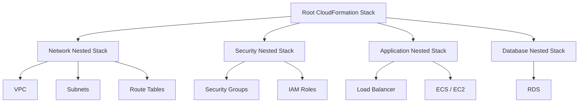
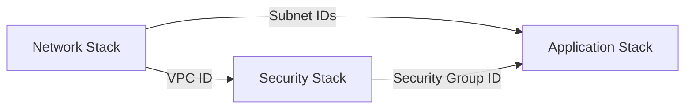
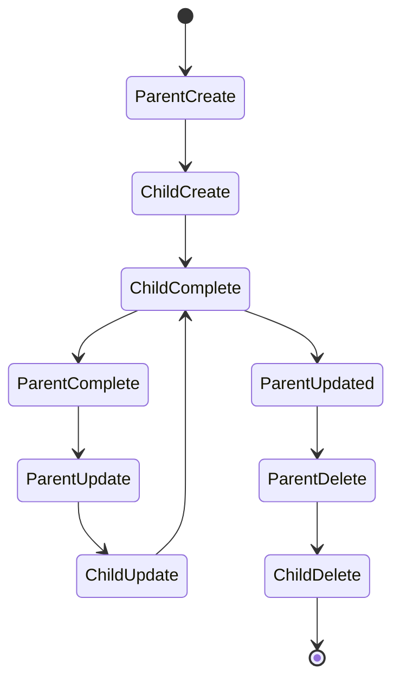
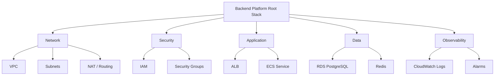
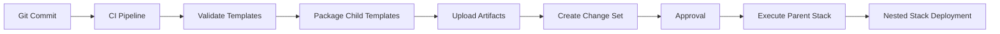

# 02- Nested Stack Architecture

## Overview

A nested stack is a CloudFormation stack created and managed by another CloudFormation stack, known as the **parent stack**. The parent template references one or more child templates through `AWS::CloudFormation::Stack` resources.

Nested stacks provide a way to decompose a large CloudFormation template into smaller, logically separated templates while preserving a single top-level deployment boundary.

A typical structure is:

```text
Root Stack
├── Network Nested Stack
├── Security Nested Stack
├── Application Nested Stack
└── Database Nested Stack
```

The parent stack coordinates the lifecycle of the nested stacks. This makes nested stacks useful for modular infrastructure where components are logically independent but should still be deployed and managed together.

---

## Why Nested Stacks Exist

A single CloudFormation template can become difficult to maintain as infrastructure grows.

For example:

```text
production.yaml

VPC
Subnets
Route Tables
NAT Gateways
Security Groups
IAM Roles
Load Balancer
ECS
RDS
CloudWatch
S3
```

Putting every resource into one template creates several problems:

- Large template size.
- Difficult code review.
- Poor separation of responsibilities.
- Difficult reuse.
- Harder troubleshooting.
- Reduced readability.
- Increased risk of unrelated changes affecting the same deployment.

Nested stacks allow the infrastructure to be decomposed:

```text
production.yaml
    │
    ├── network.yaml
    ├── security.yaml
    ├── application.yaml
    └── database.yaml
```

The parent stack remains the deployment boundary while each child template focuses on a specific responsibility.

---

## Nested Stack Architecture

The basic architecture is:



The parent stack contains `AWS::CloudFormation::Stack` resources rather than defining every infrastructure resource directly.

Example:

```yaml
Resources:

  NetworkStack:
    Type: AWS::CloudFormation::Stack
    Properties:
      TemplateURL: https://example-bucket.s3.amazonaws.com/network.yaml

  SecurityStack:
    Type: AWS::CloudFormation::Stack
    Properties:
      TemplateURL: https://example-bucket.s3.amazonaws.com/security.yaml
```

Each nested stack references another CloudFormation template.

---

## Parent and Child Stack Relationship

The most important architectural property is that the child stack is controlled by the parent.

```text
Parent Stack
     │
     ├── creates
     ├── updates
     └── deletes
            │
            ▼
      Child Stack
```

A nested stack is therefore not simply an independent CloudFormation stack placed next to another stack.

Its lifecycle is tied to the parent.

This distinction is important when deciding between nested stacks and independent stacks connected through outputs and imports.

---

## How Nested Stacks Work

The deployment flow is approximately:

```text
Parent Template
      │
      ▼
CloudFormation
      │
      ▼
Create Parent Stack
      │
      ▼
Discover AWS::CloudFormation::Stack
      │
      ▼
Create Child Stack
      │
      ▼
Provision Child Resources
      │
      ▼
Child Stack Complete
      │
      ▼
Parent Stack Complete
```

The parent stack waits for the nested stack operation to complete as part of the overall stack operation.

This gives CloudFormation a hierarchical resource model.

---

## Basic Nested Stack Example

A parent template can reference a child template using `TemplateURL`.

### Parent Template

```yaml
AWSTemplateFormatVersion: '2010-09-09'

Description: Root infrastructure stack

Resources:

  NetworkStack:
    Type: AWS::CloudFormation::Stack
    Properties:
      TemplateURL: https://my-artifacts-bucket.s3.amazonaws.com/network.yaml
```

The child template contains the actual network resources.

### Child Template

```yaml
AWSTemplateFormatVersion: '2010-09-09'

Description: Network infrastructure

Resources:

  ApplicationVPC:
    Type: AWS::EC2::VPC
    Properties:
      CidrBlock: 10.0.0.0/16
      EnableDnsHostnames: true
      EnableDnsSupport: true

Outputs:

  VpcId:
    Description: Application VPC ID
    Value: !Ref ApplicationVPC
```

The parent stack manages the child stack, while the child stack manages the VPC.

---

## Template Storage

Nested stack templates are normally referenced through `TemplateURL`.

For example:

```yaml
TemplateURL: https://my-bucket.s3.amazonaws.com/network.yaml
```

This means the child template must be available at a location accessible to CloudFormation.

A common repository and deployment structure is:

```text
infrastructure/
├── root.yaml
├── network.yaml
├── security.yaml
├── application.yaml
└── database.yaml
```

A CI/CD pipeline can package and upload these templates to an S3 location before creating or updating the root stack.

---

## Passing Parameters to Nested Stacks

Parent stacks can pass parameters to child stacks.

### Parent

```yaml
Parameters:

  Environment:
    Type: String
    Default: production

Resources:

  NetworkStack:
    Type: AWS::CloudFormation::Stack
    Properties:
      TemplateURL: https://my-bucket.s3.amazonaws.com/network.yaml

      Parameters:
        Environment: !Ref Environment
```

### Child

```yaml
Parameters:

  Environment:
    Type: String
```

The parent owns the deployment input while the child consumes the value.

This is useful for keeping environment-specific configuration consistent across nested components.

---

## Passing Outputs from Nested Stacks

Nested stacks can expose outputs to the parent stack.

For example, the child stack can export the VPC ID through its `Outputs` section:

```yaml
Outputs:

  VpcId:
    Description: VPC created by the network stack
    Value: !Ref ApplicationVPC
```

The parent stack can retrieve the nested stack output:

```yaml
Outputs:

  NetworkVpcId:
    Description: VPC ID from the network nested stack
    Value: !GetAtt NetworkStack.Outputs.VpcId
```

The flow is:

```text
Network Stack
      │
      │ Outputs.VpcId
      ▼
Parent Stack
      │
      │ !GetAtt NetworkStack.Outputs.VpcId
      ▼
Other Parent Resources
```

This is one of the primary mechanisms for passing infrastructure information between a parent stack and its nested child stacks.

---

## Passing Values Between Nested Stacks

A parent can pass the output of one nested stack into another nested stack.



Conceptually:

```text
Network Stack
     │
     ├── VPC ID
     │
     └──────────────► Security Stack
                         │
                         └── Security Group ID
                                  │
                                  ▼
                         Application Stack
```

This allows infrastructure modules to remain separate while the parent stack coordinates their dependencies.

---

## Dependency Ordering

Nested stacks can form dependency relationships.

For example:

```text
Network
   ↓
Security
   ↓
Application
   ↓
Database Integration
```

If the application stack requires a subnet created by the network stack, the parent should pass the subnet information into the application nested stack.

Example:

```yaml
Resources:

  NetworkStack:
    Type: AWS::CloudFormation::Stack
    Properties:
      TemplateURL: https://my-bucket.s3.amazonaws.com/network.yaml

  ApplicationStack:
    Type: AWS::CloudFormation::Stack
    Properties:
      TemplateURL: https://my-bucket.s3.amazonaws.com/application.yaml
      Parameters:
        VpcId: !GetAtt NetworkStack.Outputs.VpcId
```

The reference creates a dependency relationship between the nested stacks.

CloudFormation can therefore determine that the network stack must produce the VPC before the application stack can consume it.

---

## Nested Stack Lifecycle

Nested stacks participate in the parent stack lifecycle.



A parent stack operation can therefore trigger operations on one or more child stacks.

This makes lifecycle coupling the defining characteristic of nested stacks.

---

## Nested Stack Updates

When the parent template or child template changes, CloudFormation evaluates the resulting infrastructure changes.

A typical deployment flow is:

```text
Modify Child Template
        ↓
Update Parent Deployment
        ↓
CloudFormation Processes Nested Stack
        ↓
Update Child Resources
        ↓
Validate Result
        ↓
Parent Update Complete
```

The exact behavior depends on what changed.

For example, modifying an application resource inside `application.yaml` may only affect the application nested stack, while changing the parent template can affect the overall stack hierarchy.

---

## Nested Stacks and Change Sets

Change Sets should be used when evaluating important production changes.

```text
Updated Templates
       ↓
Create Change Set
       ↓
Inspect Parent Changes
       ↓
Inspect Nested Stack Changes
       ↓
Approve
       ↓
Execute
```

This is particularly useful when a parent template contains many nested stacks.

The important question is not only:

> Did the parent stack change?

It is:

> What resources will actually change across the nested stack hierarchy?

---

## Nested Stack Architecture for Backend Systems

A backend platform can use nested stacks to organize infrastructure by responsibility.



For example, a FastAPI or Django application might run on ECS while PostgreSQL and Redis are provisioned by separate nested stacks.

The application stack receives the required network and security values from the parent.

---

## Nested Stacks vs Independent Stacks

Nested stacks should not automatically replace independent CloudFormation stacks.

| Characteristic | Nested Stack | Independent Stack |
|---|---|---|
| Lifecycle | Controlled by parent | Independent |
| Deployment boundary | Parent | Individual stack |
| Reuse | Good for template composition | Good for shared infrastructure |
| Coupling | Strong lifecycle coupling | Lower lifecycle coupling |
| Dependency model | Parent-child | Outputs/imports or external configuration |
| Failure impact | Can affect parent operation | More isolated |
| Best use | Modular infrastructure deployed together | Independently managed infrastructure |

The key architectural decision is lifecycle independence.

If two infrastructure components must always be deployed together, nested stacks can be appropriate.

If they have independent ownership or deployment schedules, independent stacks are usually a better boundary.

---

## Nested Stacks vs Cross-Stack References

Consider:

```text
Network
Application
Database
```

With nested stacks:

```text
Root Stack
├── Network Nested Stack
├── Application Nested Stack
└── Database Nested Stack
```

With independent stacks:

```text
Network Stack
Application Stack
Database Stack
```

The independent stacks can communicate through outputs and imports or other configuration mechanisms.

The nested architecture provides stronger lifecycle coordination.

The independent architecture provides greater operational independence.

---

## When to Use Nested Stacks

Nested stacks are a good fit when:

- A root deployment should manage multiple infrastructure modules.
- Infrastructure has clear internal boundaries.
- Components should share the same deployment lifecycle.
- A large template needs to be decomposed.
- Reusable infrastructure modules are required within a larger stack.
- A platform team wants to organize infrastructure by responsibility without creating completely independent stacks.

Typical examples include:

```text
Root Stack
├── Network
├── Security
├── Application
└── Monitoring
```

---

## When Not to Use Nested Stacks

Avoid nested stacks when components require independent operational ownership.

For example:

```text
Shared Network
     │
     ├── Team A Application
     ├── Team B Application
     └── Team C Application
```

If each application has a different release lifecycle, forcing all applications under one parent stack can create unnecessary coupling.

Independent stacks may be more appropriate:

```text
Network Stack

Team A Application Stack
Team B Application Stack
Team C Application Stack
```

---

## Advantages

### Modular Templates

Large infrastructure can be decomposed into smaller files.

```text
root.yaml
network.yaml
security.yaml
application.yaml
database.yaml
```

Each file has a clear responsibility.

### Better Maintainability

Engineers can reason about one infrastructure domain without reading an enormous template.

### Reusable Components

Nested templates can be reused in different parent templates.

### Centralized Lifecycle

The parent stack provides a single deployment boundary for related infrastructure.

### Reduced Template Complexity

The root template becomes an orchestration layer rather than containing every resource definition.

---

## Limitations

### Lifecycle Coupling

Child stacks are tied to the parent lifecycle.

### More Complex Debugging

A failure may occur several levels deep in the stack hierarchy.

```text
Root Stack
    ↓
Application Stack
    ↓
Resource
    ↓
Failure
```

### Template Distribution

Child templates must be available to CloudFormation through their referenced locations.

### Deployment Complexity

A deeply nested architecture can make deployments difficult to understand and troubleshoot.

### Dependency Management

Passing values through several levels of nested stacks can create tightly coupled infrastructure.

---

## Avoid Deep Nesting

Nested stacks should generally remain shallow.

Avoid structures such as:

```text
Root
└── Platform
    └── Application
        └── Service
            └── Database
                └── Monitoring
```

Deep hierarchies make failures and dependencies difficult to understand.

Prefer:

```text
Root
├── Network
├── Security
├── Application
├── Database
└── Monitoring
```

The goal is modularity, not maximum nesting.

---

## Security Considerations

Nested stacks should follow the same security principles as normal CloudFormation stacks.

### Least Privilege

The CloudFormation execution role should have only the permissions required to provision the infrastructure.

### Protect Sensitive Parameters

Do not place passwords, API keys, or other secrets directly in templates.

Use appropriate AWS secret-management mechanisms.

### Control Template Access

Child templates stored in S3 should have controlled access.

Do not make infrastructure templates publicly accessible unless there is a deliberate architectural reason.

### Protect Critical Resources

Use appropriate deletion and update protection mechanisms for critical resources such as databases.

---

## Reliability Considerations

A failure in a nested stack can affect the parent stack operation.

For example:

```text
Root Update
    │
    ▼
Application Nested Stack
    │
    ▼
RDS Modification
    │
    ▼
Failure
    │
    ▼
Parent Update Failure
```

Therefore:

- Review dependency relationships carefully.
- Use Change Sets for important updates.
- Test templates before production deployment.
- Avoid unnecessary dependencies between child stacks.
- Keep nested stack responsibilities clear.
- Monitor stack events during deployment.

---

## Troubleshooting Nested Stack Failures

Start at the parent stack and identify the nested stack that failed.

```bash
aws cloudformation describe-stack-events \
  --stack-name production-stack
```

Then inspect the relevant nested stack.

```bash
aws cloudformation describe-stack-events \
  --stack-name nested-stack-name
```

A practical diagnostic sequence is:

```text
Parent Stack
    ↓
Identify Failed Nested Stack
    ↓
Inspect Nested Stack Events
    ↓
Identify Failed Resource
    ↓
Inspect Resource Configuration
    ↓
Check IAM / Dependencies / Parameters
    ↓
Correct Template
    ↓
Retry Deployment
```

Do not immediately assume the root template is the source of the problem.

The actual failure may be several levels down in the nested stack hierarchy.

---

## Monitoring and Operations

CloudFormation stack events are the primary operational signal during deployments.

Useful commands include:

```bash
aws cloudformation describe-stacks \
  --stack-name production-stack
```

and:

```bash
aws cloudformation describe-stack-events \
  --stack-name production-stack
```

For production pipelines, deployment systems should capture:

- Stack operation status.
- Failed resource.
- Failure reason.
- Nested stack identifier.
- Deployment duration.
- Rollback status.

This information should be available in CI/CD logs and operational tooling.

---

## CI/CD Integration

A production pipeline can package and deploy nested templates as a single infrastructure release.



A typical repository might look like:

```text
infrastructure/
    root.yaml
    network.yaml
    security.yaml
    application.yaml
    database.yaml
```

The pipeline should ensure that the parent template references the correct versions or locations of its child templates.

---

## Production Design Guidelines

A production nested-stack architecture should follow these principles:

- Keep the parent template focused on composition.
- Give each child template one clear infrastructure responsibility.
- Keep the hierarchy shallow.
- Pass only required parameters.
- Expose only required outputs.
- Avoid unnecessary cross-module dependencies.
- Use stable interfaces between nested stacks.
- Store templates in version control.
- Validate templates in CI/CD.
- Use Change Sets for important production changes.
- Use least-privilege CloudFormation execution roles.
- Monitor parent and nested stack events.
- Protect critical resources from accidental deletion or replacement.
- Avoid forcing independently deployed systems into one parent stack.

---

## Common Mistakes

### Treating Nested Stacks as Independent Stacks

A nested stack is lifecycle-dependent on its parent.

**Avoid it:** use independent stacks when components require independent deployments.

### Excessive Nesting

Deep hierarchies make infrastructure harder to understand.

**Avoid it:** keep the architecture shallow and organize modules by responsibility.

### Passing Too Many Parameters

A child stack with dozens of parameters usually indicates excessive coupling.

**Avoid it:** expose a small, stable interface.

### Returning Too Many Outputs

Outputs should represent meaningful infrastructure contracts.

**Avoid it:** expose only values that consumers actually need.

### Hardcoding Child Template Locations

Hardcoded artifact locations can make promotion between environments difficult.

**Avoid it:** manage template artifacts systematically through the deployment pipeline.

### Ignoring Nested Stack Events

Looking only at the parent stack can hide the actual failure.

**Avoid it:** inspect the nested stack's events when troubleshooting.

### Combining Unrelated Lifecycles

Putting independently managed infrastructure under one root stack can make deployments unnecessarily coupled.

**Avoid it:** use independent stacks when lifecycle independence is more important than centralized orchestration.

---

## Interview Perspective

### Nested Stack vs Independent Stack

The primary distinction is lifecycle.

> A nested stack is managed as part of a parent stack, while an independent stack has its own lifecycle and deployment boundary.

### Why Use Nested Stacks?

The strongest answer is:

> Use nested stacks to decompose large CloudFormation templates into reusable, logically separated modules while retaining centralized lifecycle management.

### What Is the Main Disadvantage?

Lifecycle coupling.

A child stack cannot be treated as completely independent from its parent.

### How Do Nested Stacks Communicate?

The parent can pass parameters into nested stacks, and nested stacks can expose outputs that the parent consumes through nested-stack attributes.

### When Should You Avoid Nested Stacks?

Avoid them when infrastructure components require independent ownership, deployment schedules, or failure isolation.

---

## Key Takeaways

- A nested stack is a CloudFormation stack managed by a parent stack.
- Nested stacks primarily solve template modularity and infrastructure composition problems.
- `AWS::CloudFormation::Stack` is the resource type used to create a nested stack.
- Child templates are referenced through `TemplateURL`.
- Parent stacks can pass parameters to child stacks.
- Child stack outputs can be consumed by the parent through `!GetAtt NestedStack.Outputs.OutputName`.
- Nested stacks share the lifecycle of the parent, which is their most important architectural characteristic.
- Nested stacks are well suited to infrastructure that should be modular but deployed together.
- Independent stacks are preferable when infrastructure requires independent ownership or deployment lifecycles.
- Keep nested hierarchies shallow and interfaces between modules small.
- Use Change Sets, CI/CD validation, least-privilege roles, and stack event monitoring for production deployments.
- The goal of nested stacks is controlled modularity, not maximum decomposition.