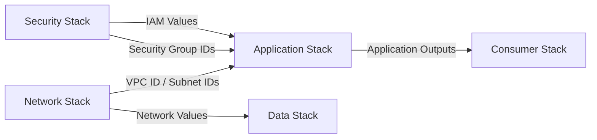
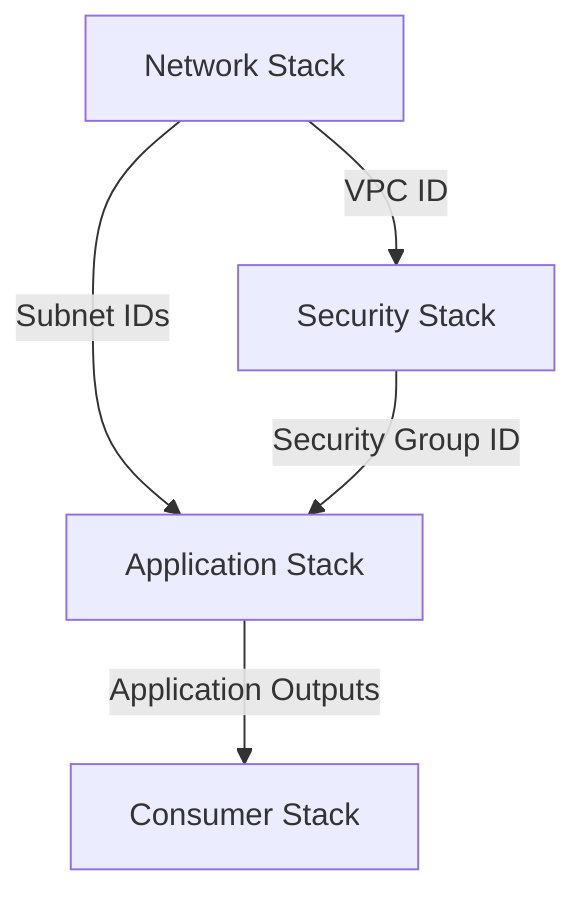
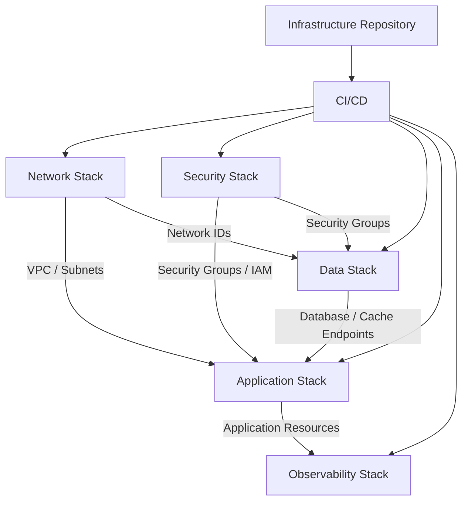
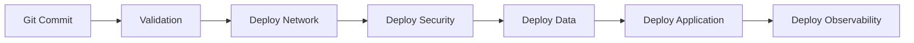

# 03- Cross Stack Architecture

## Overview

Cross-stack architecture is a CloudFormation design pattern where infrastructure is divided into multiple independent CloudFormation stacks that share values through explicit interfaces.

Unlike nested stacks, these stacks have **independent lifecycles**. One stack can be updated, deployed, or rolled back without requiring the other stack to be managed as part of the same parent-child hierarchy.

A common production architecture is:

```text
Network Stack
     │
     │ exports infrastructure values
     ▼
Application Stack
     │
     │ exports application values
     ▼
Consumer Stack
```

This approach is particularly useful when infrastructure has different ownership, deployment frequency, or lifecycle requirements.

---

## Why Cross-Stack Architecture Exists

A large production environment should rarely be managed as one CloudFormation stack.

For example:

```text
Single Stack
├── VPC
├── Subnets
├── Security Groups
├── Load Balancer
├── ECS
├── RDS
├── Redis
├── IAM
└── Monitoring
```

This creates a large deployment boundary.

A change to one component can potentially affect an unrelated component.

Cross-stack architecture allows infrastructure to be separated:

```text
Network Stack
├── VPC
├── Subnets
├── Route Tables
└── NAT

Security Stack
├── Security Groups
└── IAM Roles

Application Stack
├── Load Balancer
├── ECS
└── Application Configuration

Data Stack
├── RDS
└── Redis
```

The stacks communicate through explicitly defined values.

---

## Core Architecture



Each stack owns a specific infrastructure domain.

For example:

```text
Network Stack
    owns VPC and networking

Security Stack
    owns security groups and IAM

Application Stack
    owns application infrastructure

Data Stack
    owns persistent data infrastructure
```

The relationship between stacks is explicit rather than being controlled by a parent stack.

---

## Cross-Stack Communication

CloudFormation provides several mechanisms for sharing values.

The most important native mechanism is:

```text
Stack A
   │
   └── Output + Export
            │
            ▼
        Stack B
            │
            └── ImportValue
```

The exporting stack publishes a value.

The consuming stack imports that value.

---

## Outputs and Exports

Consider a network stack that creates a VPC.

```yaml
Resources:

  ApplicationVPC:
    Type: AWS::EC2::VPC
    Properties:
      CidrBlock: 10.0.0.0/16
      EnableDnsSupport: true
      EnableDnsHostnames: true

Outputs:

  VpcId:
    Description: VPC ID shared with application infrastructure
    Value: !Ref ApplicationVPC
    Export:
      Name: application-vpc-id
```

The important part is:

```yaml
Export:
  Name: application-vpc-id
```

This creates a named CloudFormation export.

Another stack can consume it.

---

## Importing an Exported Value

The application stack can reference the exported VPC ID:

```yaml
Resources:

  ApplicationSecurityGroup:
    Type: AWS::EC2::SecurityGroup
    Properties:
      GroupDescription: Application security group
      VpcId: !ImportValue application-vpc-id
```

The dependency becomes:

```text
Network Stack
     │
     │ exports application-vpc-id
     ▼
Application Stack
     │
     │ imports application-vpc-id
     ▼
Security Group
```

The application stack does not need to know how the VPC was created.

It only depends on the infrastructure contract represented by the exported value.

---

## Cross-Stack Contract

An exported value acts as an interface between stacks.

For example:

```text
Network Stack
     │
     │ Contract:
     │ application-vpc-id
     ▼
Application Stack
```

The consuming stack should depend on the **contract**, not on the internal implementation of the producing stack.

This is an important architectural principle.

The application stack should not need to know:

- Which CIDR was used.
- How many subnets exist internally.
- Which route tables were created.
- How the VPC was constructed.

It only needs the values required to consume the network infrastructure.

---

## Export Naming

Export names must be unique within an AWS account and region.

A common convention is:

```text
<environment>-<service>-<resource>
```

For example:

```text
production-network-vpc-id
production-network-private-subnet-a
production-network-private-subnet-b
production-security-app-sg
```

Example:

```yaml
Outputs:

  VpcId:
    Value: !Ref ApplicationVPC
    Export:
      Name: !Sub "${Environment}-network-vpc-id"
```

This reduces naming collisions across environments.

---

## Environment-Aware Exports

Parameters can be used to generate environment-specific export names.

```yaml
Parameters:

  Environment:
    Type: String
    AllowedValues:
      - development
      - staging
      - production

Resources:

  ApplicationVPC:
    Type: AWS::EC2::VPC
    Properties:
      CidrBlock: 10.0.0.0/16

Outputs:

  VpcId:
    Value: !Ref ApplicationVPC
    Export:
      Name: !Sub "${Environment}-network-vpc-id"
```

This results in separate contracts such as:

```text
development-network-vpc-id
staging-network-vpc-id
production-network-vpc-id
```

This pattern is useful when multiple environments exist within the same AWS account and region.

---

## Cross-Stack Dependency Flow

A typical dependency chain looks like:



For example:

```text
Network
   │
   ├── VPC ID
   ├── Private Subnet IDs
   └── Public Subnet IDs
           │
           ▼
Security
   │
   ├── Application Security Group
   └── Database Security Group
           │
           ▼
Application
   │
   └── Load Balancer / ECS
           │
           ▼
Consumer
```

The architecture forms a dependency graph.

---

## Deployment Ordering

Cross-stack dependencies require correct deployment ordering.

If the application stack imports a value from the network stack:

```text
Network Stack
      ↓
Application Stack
```

The network stack must exist before the application stack can be successfully deployed.

A production deployment pipeline should therefore understand these dependencies.


The deployment system should not blindly deploy stacks in parallel when a dependency exists between them.

---

## Independent Lifecycle

The main architectural benefit of cross-stack architecture is lifecycle independence.

For example:

```text
Network Stack
     │
     │ changes rarely
     ▼

Application Stack
     │
     │ changes frequently
     ▼

Monitoring Stack
     │
     │ changes independently
```

The application team can update the application stack without redeploying the entire network stack.

This is especially useful for backend systems where:

- Application releases happen frequently.
- Network infrastructure changes rarely.
- Database infrastructure has stricter change controls.
- Security infrastructure is managed centrally.

---

## Cross-Stack Architecture for Backend Systems

A realistic backend platform might look like:

```text
                    AWS Account
                         │
          +--------------+--------------+
          │              │              │
          ▼              ▼              ▼
      Network         Security        Data
       Stack           Stack          Stack
          │              │              │
          └──────┬───────┘              │
                 ▼                      │
            Application Stack ◄─────────┘
                 │
                 ▼
          Monitoring Stack
```

For a Django or FastAPI application:

```text
Network Stack
├── VPC
├── Private Subnets
├── Public Subnets
└── Routing

Security Stack
├── ALB Security Group
├── Application Security Group
└── Database Security Group

Data Stack
├── PostgreSQL
└── Redis

Application Stack
├── Load Balancer
├── ECS Service
└── IAM Roles
```

The application stack consumes values from the other infrastructure stacks.

---

## Cross-Stack References

A basic cross-stack reference uses:

```yaml
!ImportValue
```

Example:

```yaml
VpcId: !ImportValue production-network-vpc-id
```

For a subnet:

```yaml
SubnetId: !ImportValue production-network-private-subnet-a
```

For a security group:

```yaml
SecurityGroupIds:
  - !ImportValue production-security-app-sg
```

The imported value becomes part of the consuming stack's resource configuration.

---

## Exported Lists

Sometimes a stack needs to expose multiple related values.

For example:

```yaml
Outputs:

  PrivateSubnetA:
    Value: !Ref PrivateSubnetA
    Export:
      Name: production-network-private-subnet-a

  PrivateSubnetB:
    Value: !Ref PrivateSubnetB
    Export:
      Name: production-network-private-subnet-b
```

The application stack can consume them independently:

```yaml
Resources:

  ApplicationService:
    Type: AWS::ECS::Service
    Properties:
      NetworkConfiguration:
        AwsvpcConfiguration:
          Subnets:
            - !ImportValue production-network-private-subnet-a
            - !ImportValue production-network-private-subnet-b
```

This provides an explicit interface between the network and application stacks.

---

## Stack Ownership

Cross-stack architecture becomes especially valuable in organizations with multiple teams.

For example:

```text
Platform Team
     │
     └── Network Stack
            │
            └── Exposes infrastructure contracts

Security Team
     │
     └── Security Stack
            │
            └── Exposes security contracts

Backend Team
     │
     └── Application Stack
```

The backend team does not need permission to modify the network stack simply because the application depends on the network.

This provides a stronger organizational and security boundary.

---

## Cross-Stack References and IAM

A consuming stack needs permission to create and manage its own resources.

The CloudFormation execution role for the application stack does not need unrestricted control over the network resources merely because it consumes exported values.

This supports least-privilege infrastructure management.

For example:

```text
Network Deployment Role
    ↓
Network Resources

Application Deployment Role
    ↓
Application Resources
    ↓
Consumes Network Exports
```

This is preferable to a single deployment role with broad permissions across the entire environment.

---

## Stack Coupling

Cross-stack architecture reduces lifecycle coupling, but it does not eliminate dependency coupling.

Consider:

```text
Network Stack
      │
      │ exports VPC ID
      ▼
Application Stack
```

The application stack depends on the existence of the exported value.

Therefore:

```text
Independent Lifecycle
        ≠
Zero Dependency
```

A senior-level design must distinguish between:

- Lifecycle coupling.
- Data/value coupling.
- Deployment coupling.
- Ownership coupling.

Cross-stack architecture primarily reduces lifecycle and ownership coupling.

---

## Export Immutability Constraint

One of the most important operational characteristics of CloudFormation exports is that an exported value cannot be changed or removed while another stack is importing it.

For example:

```text
Network Stack
     │
     │ exports production-network-vpc-id
     ▼
Application Stack
     │
     └── imports production-network-vpc-id
```

The network stack cannot freely remove or modify that export while the application stack depends on it.

This protects consumers from unexpected contract changes.

---

## Safe Contract Migration

Suppose the network stack needs to replace:

```text
production-network-vpc-id
```

with:

```text
production-network-primary-vpc-id
```

A safe migration should not immediately remove the old export.

A safer sequence is:

```text
Create New Export
       ↓
Update Consumers
       ↓
Verify No Consumers Use Old Export
       ↓
Remove Old Export
```

Conceptually:

```text
Old Contract
     │
     ├── Existing Consumers
     │
     ▼
New Contract
     │
     ├── Migrate Consumers
     │
     ▼
Remove Old Contract
```

This resembles API contract migration in application development.

---

## Cross-Stack References as Infrastructure APIs

A useful mental model is:

```text
CloudFormation Stack
        =
Infrastructure Service

CloudFormation Export
        =
Infrastructure API Contract
```

For example:

```text
Network Stack API

GET-like contract:
    VPC_ID
    PRIVATE_SUBNET_A
    PRIVATE_SUBNET_B
```

The consuming stack should rely on the contract rather than internal implementation details.

This makes infrastructure architecture easier to reason about at scale.

---

## Nested Stack vs Cross-Stack Architecture

| Characteristic | Nested Stack | Cross-Stack |
|---|---|---|
| Parent-child relationship | Yes | No |
| Lifecycle | Coupled | Independent |
| Deployment boundary | Parent | Individual stack |
| Reuse | Template composition | Shared infrastructure |
| Ownership | Usually centralized | Can be team-specific |
| Dependency | Parent-child | Export/import |
| Failure isolation | Lower | Higher |
| Best use | Modular infrastructure deployed together | Independently managed infrastructure |

The key question is:

> Should these infrastructure components share the same lifecycle?

If yes, nested stacks may be appropriate.

If no, independent stacks with explicit contracts are usually a better fit.

---

## Nested Stack vs Cross-Stack Example

### Nested Architecture

```text
Root Stack
├── Network
├── Security
└── Application
```

The root stack controls the lifecycle of all three.

### Cross-Stack Architecture

```text
Network Stack
      │
      ▼
Security Stack
      │
      ▼
Application Stack
```

Each stack can have its own deployment lifecycle.

This difference becomes significant as organizations and infrastructure grow.

---

## Cross-Stack vs Hardcoded Configuration

Avoid this:

```yaml
VpcId: vpc-0123456789abcdef
```

The value is tied directly to a specific infrastructure instance.

Prefer:

```yaml
VpcId: !ImportValue production-network-vpc-id
```

The application stack now depends on a stable infrastructure contract instead of a hardcoded resource identifier.

This also makes the template more reusable across environments.

---

## Cross-Stack vs Parameter Passing

Parameters are useful when the deployment pipeline explicitly provides values.

For example:

```bash
aws cloudformation deploy \
  --template-file application.yaml \
  --stack-name production-application \
  --parameter-overrides \
    VpcId=vpc-0123456789abcdef
```

Cross-stack exports provide a CloudFormation-native dependency mechanism:

```yaml
VpcId: !ImportValue production-network-vpc-id
```

| Approach | Best Use |
|---|---|
| Parameters | Environment or deployment-specific input |
| Exports/Imports | Stable stack-to-stack contracts |
| Hardcoded IDs | Generally avoid |
| External configuration | Loose coupling across systems |

---

## Operational Considerations

### Deployment

Deploy producing stacks before consuming stacks.

```text
Network
   ↓
Security
   ↓
Data
   ↓
Application
```

The exact order depends on actual dependencies.

### Monitoring

Monitor stack events for both the producer and consumer stacks.

```bash
aws cloudformation describe-stack-events \
  --stack-name production-network
```

```bash
aws cloudformation describe-stack-events \
  --stack-name production-application
```

### Dependency Discovery

AWS CLI can be used to inspect exports:

```bash
aws cloudformation list-exports
```

This is useful when determining which infrastructure contracts are available.

### Change Management

Treat exported values as public interfaces.

Changing an export name or removing an export can affect downstream stacks.

---

## Security Considerations

Cross-stack references should not be used as a mechanism for distributing secrets.

Avoid exporting:

```text
DatabasePassword
API Key
Private Key
Access Token
```

CloudFormation exports are infrastructure configuration contracts, not a secret-management system.

For sensitive values, use appropriate AWS secret-management services and retrieve secrets at runtime or through supported infrastructure integrations.

Good export candidates include:

```text
VPC ID
Subnet ID
Security Group ID
Load Balancer ARN
Hosted Zone ID
Resource ARN
```

---

## Reliability Considerations

Cross-stack architecture improves failure isolation when stacks have independent lifecycles.

For example:

```text
Application Deployment Failure
          │
          ▼
Application Stack Rollback

Network Stack
     │
     └── remains unchanged
```

This is generally safer than putting both application and network resources into a single large deployment boundary.

However, the application may still be unable to deploy if the network contract is missing or invalid.

Cross-stack architecture therefore improves isolation but does not eliminate dependencies.

---

## Scalability Considerations

Cross-stack architecture scales organizationally as well as technically.

A growing platform might evolve from:

```text
One Stack
```

to:

```text
Network
Security
Data
Application
Observability
```

and eventually:

```text
Organization
├── Shared Network
├── Security Baseline
├── Logging
├── Platform
├── Team A Application
├── Team B Application
└── Team C Application
```

The architecture allows infrastructure ownership to evolve without forcing every component into a single CloudFormation deployment.

---

## Disaster Recovery

Cross-stack architecture can support disaster recovery by separating infrastructure responsibilities.

For example:

```text
Network Stack
      ↓
Application Stack
      ↓
Data Stack
```

Each stack can be version controlled and recreated according to the recovery strategy.

However, rebuilding stacks does not automatically recover stateful data.

Database backups, replication, snapshots, and application data recovery must be designed separately.

---

## Cost Considerations

CloudFormation stack decomposition itself does not generally represent the major infrastructure cost.

The important cost implications come from the resources managed by the stacks.

However, excessive decomposition can increase operational overhead:

- More deployment pipelines.
- More stack monitoring.
- More dependency management.
- More release coordination.
- More infrastructure artifacts.

The goal is not to maximize the number of stacks.

The goal is to establish meaningful lifecycle and ownership boundaries.

---

## Production Architecture Example

A mature backend platform might use:



The important design principle is that each stack owns a clear infrastructure responsibility while exposing only the values required by consumers.

---

## CI/CD Deployment Model

A production pipeline should understand the dependency graph.



For independent stacks, each stage can have its own:

- Change Set.
- Approval.
- Rollback.
- Deployment role.
- Monitoring.
- Ownership.

This provides stronger operational control than a single monolithic stack.

---

## Common Mistakes

### Removing an Export Too Early

Removing an export while consumers still import it can fail the stack update.

**Avoid it:** migrate consumers first, verify dependencies, then remove the old contract.

### Creating Too Many Exports

Exporting every internal resource creates unnecessary coupling.

**Avoid it:** expose only stable values that consumers genuinely require.

### Treating Exports as Secrets

Exports are not designed to be a secret-management mechanism.

**Avoid it:** use appropriate secret-management services for sensitive values.

### Hardcoding Export Names Everywhere

Inconsistent naming makes environments difficult to manage.

**Avoid it:** establish a predictable naming convention.

### Ignoring Deployment Dependencies

A consumer stack cannot reliably deploy before its producer contract exists.

**Avoid it:** model deployment dependencies explicitly in CI/CD.

### Sharing Unstable Implementation Details

Exporting temporary or frequently changing values creates fragile contracts.

**Avoid it:** expose stable infrastructure interfaces.

### Creating Circular Dependencies

For example:

```text
Network Stack
    ↓
Application Stack
    ↓
Network Stack
```

This creates an invalid dependency cycle.

**Avoid it:** design a directional dependency graph.

---

## Interview Traps

### Are Cross-Stack References the Same as Nested Stacks?

No.

Nested stacks have a parent-child lifecycle relationship.

Cross-stack references connect independently managed stacks through exported values.

### Does Cross-Stack Architecture Remove Coupling?

No.

It reduces lifecycle coupling but introduces explicit value and deployment dependencies.

### Can an Export Be Changed Freely?

No.

An exported value that is currently imported by another stack cannot simply be removed or modified without first addressing the consuming dependency.

### Should Secrets Be Exported?

No.

CloudFormation exports should represent infrastructure contracts, not secret values.

### Why Not Use One Large Stack?

A monolithic stack increases deployment blast radius and reduces independent ownership and lifecycle management.

### Why Not Create Hundreds of Tiny Stacks?

Excessive decomposition creates operational complexity and dependency management overhead.

The correct architecture is based on meaningful lifecycle, ownership, and dependency boundaries.

---

## Best Practices

- Define clear ownership for every stack.
- Treat exports as infrastructure API contracts.
- Keep export names predictable and environment-aware.
- Export stable identifiers rather than implementation details.
- Keep dependency graphs directional.
- Avoid circular dependencies.
- Minimize the number of exported values.
- Deploy producer stacks before consumer stacks.
- Use CI/CD to enforce dependency ordering.
- Use separate deployment roles when ownership boundaries require them.
- Never use exports as a replacement for secret management.
- Plan contract migrations before changing or removing exports.
- Prefer independent stacks when components have independent lifecycles.
- Prefer nested stacks when components should share a lifecycle.
- Avoid decomposing infrastructure into stacks solely for the sake of decomposition.

---

## Key Takeaways

- Cross-stack architecture divides infrastructure into independently managed CloudFormation stacks.
- CloudFormation Outputs and `Export`/`ImportValue` provide a native mechanism for sharing infrastructure values.
- Exported values act as contracts between infrastructure stacks.
- Cross-stack references reduce lifecycle coupling but do not eliminate dependency coupling.
- Producer stacks should expose stable infrastructure values such as VPC IDs, subnet IDs, security group IDs, and resource ARNs.
- Secrets should not be distributed through CloudFormation exports.
- Export names should follow a consistent environment-aware naming convention.
- Export contracts must be migrated carefully because consuming stacks depend on them.
- Cross-stack architecture is especially useful when infrastructure has different ownership, deployment frequency, or lifecycle requirements.
- Nested stacks are better when modules should share a lifecycle; cross-stack architecture is better when modules should remain independently deployable.
- A good cross-stack architecture minimizes dependencies while maintaining clear infrastructure ownership and contracts.
- The objective is not maximum stack decomposition; it is well-defined lifecycle, ownership, and dependency boundaries.